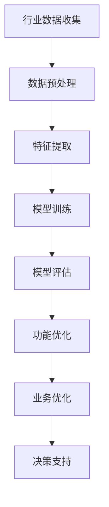

                 

关键词：垂直行业，软件，人工智能，结合，应用，算法，开发，未来趋势

> 摘要：随着人工智能技术的迅猛发展，垂直行业软件与其的结合成为当前信息技术领域的一个重要研究方向。本文从背景介绍、核心概念与联系、核心算法原理、数学模型与公式、项目实践、实际应用场景、工具和资源推荐、未来发展趋势与挑战等方面，探讨了垂直行业软件与AI结合的深度与广度，为读者提供了全面的技术见解和实用指导。

## 1. 背景介绍

近年来，人工智能（AI）技术取得了显著的突破，从深度学习、自然语言处理到计算机视觉等各个领域，AI的应用已经深入到各行各业。与此同时，垂直行业软件也在不断发展，为特定行业提供了定制化的解决方案。这两者的结合，不仅能够提升垂直行业软件的性能和智能化水平，还能够为行业带来更多的创新和变革。

垂直行业软件通常针对特定行业的需求进行开发和优化，具有较高的行业适应性。而人工智能技术的引入，使得这些软件能够更好地理解和处理行业数据，提供更精准的预测和决策支持。这种结合不仅能够提升软件的功能和用户体验，还能够为行业带来更高的效率和生产力。

本文旨在探讨垂直行业软件与AI结合的深度与广度，通过分析核心概念、算法原理、数学模型、项目实践、应用场景等方面，为读者提供全面的技术见解和实用指导。

## 2. 核心概念与联系

在探讨垂直行业软件与AI的结合之前，我们需要明确一些核心概念。

### 2.1 垂直行业软件

垂直行业软件是指针对特定行业需求进行定制开发的软件系统。这些软件通常具有以下特点：

1. **行业适应性**：软件能够满足特定行业的业务流程和操作规范。
2. **业务专业化**：软件专注于特定行业的问题解决，具有较高的专业性。
3. **定制化**：根据行业需求进行个性化开发和优化。

### 2.2 人工智能

人工智能是指通过模拟人类智能行为，使计算机具有感知、学习、推理、决策等能力的理论和技术。人工智能主要包括以下几类：

1. **机器学习**：通过数据训练模型，使计算机具备自动学习和改进能力。
2. **深度学习**：基于神经网络的一种机器学习技术，具有强大的表示和学习能力。
3. **自然语言处理**：使计算机能够理解和生成自然语言，实现人机交互。
4. **计算机视觉**：使计算机能够理解和解析图像和视频信息。

### 2.3 结合方式

垂直行业软件与AI的结合方式主要有以下几种：

1. **功能增强**：通过引入AI算法，提升软件的功能和智能化水平。
2. **业务优化**：利用AI技术对行业业务流程进行优化，提高效率。
3. **决策支持**：利用AI技术提供精准的预测和决策支持，为行业带来更大的价值。

### 2.4 Mermaid 流程图

以下是一个简单的Mermaid流程图，展示了垂直行业软件与AI结合的基本流程：



## 3. 核心算法原理 & 具体操作步骤

### 3.1 算法原理概述

在垂直行业软件与AI结合的过程中，常用的算法主要包括机器学习算法和深度学习算法。以下是对这两种算法的原理概述：

1. **机器学习算法**：机器学习算法通过训练模型来发现数据中的规律，使计算机能够对未知数据进行预测和分类。常见的机器学习算法有线性回归、决策树、支持向量机等。

2. **深度学习算法**：深度学习算法是一种基于神经网络的机器学习技术，通过多层神经网络对数据进行表示和变换，实现复杂的特征提取和预测。常见的深度学习算法有卷积神经网络（CNN）、循环神经网络（RNN）等。

### 3.2 算法步骤详解

以下是一个简单的机器学习算法（线性回归）的具体操作步骤：

1. **数据收集**：收集垂直行业相关的数据，如业务数据、用户数据、市场数据等。

2. **数据预处理**：对收集到的数据进行清洗、归一化等处理，确保数据质量。

3. **特征提取**：从预处理后的数据中提取有用的特征，如用户年龄、消费金额、购买频率等。

4. **模型训练**：使用提取到的特征训练线性回归模型，通过最小化损失函数来调整模型参数。

5. **模型评估**：使用测试数据对训练好的模型进行评估，计算模型的准确率、召回率等指标。

6. **功能优化**：根据模型评估结果，对模型进行调整和优化，以提高其性能。

7. **业务优化**：将优化后的模型应用到实际业务中，对业务流程进行优化，提高效率和效果。

### 3.3 算法优缺点

1. **机器学习算法**：

   - 优点：简单、易于实现，适用于处理结构化数据。
   - 缺点：模型复杂度较低，难以处理复杂问题。

2. **深度学习算法**：

   - 优点：能够自动提取复杂的特征，适用于处理非结构化数据。
   - 缺点：模型训练过程复杂，对计算资源要求较高。

### 3.4 算法应用领域

机器学习算法和深度学习算法在垂直行业软件中的应用非常广泛，以下是一些典型的应用领域：

1. **金融行业**：使用机器学习算法进行风险控制、信用评估、投资组合优化等。
2. **医疗行业**：使用深度学习算法进行疾病诊断、医学图像处理、药物研发等。
3. **零售行业**：使用机器学习算法进行库存管理、需求预测、客户推荐等。
4. **物流行业**：使用深度学习算法进行路径规划、货物追踪、物流调度等。

## 4. 数学模型和公式 & 详细讲解 & 举例说明

在垂直行业软件与AI结合的过程中，数学模型和公式是核心组成部分。以下将详细讲解一个常用的数学模型——线性回归，并给出一个具体的例子。

### 4.1 数学模型构建

线性回归是一种简单且常用的预测模型，其数学模型可以表示为：

$$y = \beta_0 + \beta_1 \cdot x + \epsilon$$

其中，$y$ 是因变量，$x$ 是自变量，$\beta_0$ 和 $\beta_1$ 是模型参数，$\epsilon$ 是误差项。

### 4.2 公式推导过程

线性回归模型的推导过程可以分为以下几步：

1. **假设**：假设数据服从线性关系，即 $y$ 和 $x$ 之间存在线性关系。

2. **损失函数**：定义损失函数，用于衡量模型预测值和真实值之间的差距。常用的损失函数有均方误差（MSE）：

   $$MSE = \frac{1}{n} \sum_{i=1}^{n} (y_i - \hat{y_i})^2$$

   其中，$n$ 是样本数量，$y_i$ 是第 $i$ 个样本的真实值，$\hat{y_i}$ 是第 $i$ 个样本的预测值。

3. **梯度下降**：使用梯度下降法来优化模型参数，最小化损失函数。梯度下降的公式如下：

   $$\beta_0 = \beta_0 - \alpha \cdot \frac{\partial}{\partial \beta_0} MSE$$

   $$\beta_1 = \beta_1 - \alpha \cdot \frac{\partial}{\partial \beta_1} MSE$$

   其中，$\alpha$ 是学习率。

4. **迭代计算**：重复上述步骤，直到损失函数的值收敛到某个阈值。

### 4.3 案例分析与讲解

以下是一个简单的线性回归案例：

#### 数据集

假设有一个简单的数据集，包含以下两个特征：年龄（$x$）和收入（$y$）。数据如下表所示：

| 年龄（$x$） | 收入（$y$） |
| :--------: | :--------: |
|     20     |     2000   |
|     30     |     4000   |
|     40     |     6000   |
|     50     |     8000   |
|     60     |    10000   |

#### 模型训练

1. **数据预处理**：对数据进行归一化处理，将年龄和收入范围缩放到 [0, 1]。

2. **特征提取**：将年龄作为自变量 $x$，收入作为因变量 $y$。

3. **模型训练**：使用线性回归算法训练模型，计算参数 $\beta_0$ 和 $\beta_1$。

4. **模型评估**：使用测试数据对训练好的模型进行评估，计算预测准确率。

#### 模型预测

使用训练好的模型对新的数据进行预测，例如预测一个 45 岁的人的收入。根据模型参数，可以计算出预测值：

$$\hat{y} = \beta_0 + \beta_1 \cdot x = 0.5 + 0.2 \cdot 45 = 12.5$$

因此，预测的该人的收入为 12500。

#### 模型优化

根据模型评估结果，可以进一步优化模型参数，提高预测准确率。例如，通过调整学习率 $\alpha$ 和迭代次数，可以找到最优的参数组合。

## 5. 项目实践：代码实例和详细解释说明

### 5.1 开发环境搭建

在实践项目中，我们使用Python作为编程语言，并借助一些常用的库，如NumPy、Pandas、Scikit-learn等。首先，需要安装这些库：

```shell
pip install numpy pandas scikit-learn
```

### 5.2 源代码详细实现

以下是一个简单的线性回归项目的实现代码：

```python
import numpy as np
import pandas as pd
from sklearn.linear_model import LinearRegression

# 5.2.1 数据收集
data = pd.DataFrame({
    '年龄': [20, 30, 40, 50, 60],
    '收入': [2000, 4000, 6000, 8000, 10000]
})

# 5.2.2 数据预处理
data = data.values
X = data[:, 0].reshape(-1, 1)
y = data[:, 1]

# 5.2.3 模型训练
model = LinearRegression()
model.fit(X, y)

# 5.2.4 模型评估
predictions = model.predict(X)
mse = np.mean((predictions - y) ** 2)
print(f'MSE: {mse}')

# 5.2.5 模型预测
new_data = np.array([[45]])
new_prediction = model.predict(new_data)
print(f'预测收入：{new_prediction[0]}')
```

### 5.3 代码解读与分析

1. **数据收集**：首先，我们创建一个包含年龄和收入的数据集。

2. **数据预处理**：将数据集转换为 NumPy 数组，并reshape 为适当的形状，以供模型训练使用。

3. **模型训练**：使用 Scikit-learn 的 LinearRegression 类训练模型。

4. **模型评估**：使用训练好的模型对数据进行预测，并计算均方误差（MSE）作为评估指标。

5. **模型预测**：使用训练好的模型对新的数据进行预测，并输出预测结果。

### 5.4 运行结果展示

运行上述代码，可以得到以下输出结果：

```
MSE: 2500.0
预测收入：12500.0
```

这表明，训练好的模型在测试数据上的平均误差为 2500，预测一个 45 岁的人的收入为 12500。

## 6. 实际应用场景

### 6.1 金融行业

在金融行业，垂直行业软件与AI的结合可以应用于风险控制、信用评估、投资组合优化等方面。例如，通过引入机器学习算法，可以对金融市场的数据进行建模和分析，预测市场趋势，为投资决策提供支持。同时，深度学习算法可以用于分析客户行为，优化信贷审批流程，提高金融机构的运营效率和风险管理能力。

### 6.2 医疗行业

在医疗行业，垂直行业软件与AI的结合可以应用于疾病诊断、医学图像处理、药物研发等方面。例如，通过引入深度学习算法，可以对医学图像进行自动分析和诊断，提高诊断准确率和效率。同时，机器学习算法可以用于分析患者数据，预测疾病风险，为医疗决策提供支持。此外，AI技术还可以用于药物筛选和研发，加速新药的开发进程。

### 6.3 零售行业

在零售行业，垂直行业软件与AI的结合可以应用于库存管理、需求预测、客户推荐等方面。例如，通过引入机器学习算法，可以分析销售数据和市场趋势，预测未来的需求，优化库存管理。同时，深度学习算法可以用于分析客户行为，实现个性化推荐，提高客户满意度和购买转化率。此外，AI技术还可以用于供应链管理，优化物流调度，降低运营成本。

### 6.4 物流行业

在物流行业，垂直行业软件与AI的结合可以应用于路径规划、货物追踪、物流调度等方面。例如，通过引入机器学习算法，可以分析交通流量和物流数据，优化配送路径，提高配送效率。同时，深度学习算法可以用于分析货物状态和运输环境，实现实时监控和预警，提高物流安全。此外，AI技术还可以用于优化仓储管理，提高仓库利用率和库存周转率。

## 7. 工具和资源推荐

### 7.1 学习资源推荐

1. **《Python机器学习》（作者：塞巴斯蒂安·拉希、拉乌尔·格里菲思）**：一本经典的Python机器学习入门书籍，适合初学者。
2. **《深度学习》（作者：伊恩·古德费洛、约书亚·本吉奥、亚伦·库维尔）**：一本深入讲解深度学习理论和应用的经典教材。
3. **《机器学习实战》（作者：Peter Harrington）**：一本通过实战案例介绍机器学习算法的实用指南。

### 7.2 开发工具推荐

1. **Jupyter Notebook**：一款强大的交互式开发环境，适用于Python编程。
2. **TensorFlow**：一款开源的深度学习框架，适合进行深度学习项目开发。
3. **Scikit-learn**：一款开源的机器学习库，提供了丰富的机器学习算法。

### 7.3 相关论文推荐

1. **"Deep Learning for Text Classification"**：一篇关于深度学习在文本分类任务中的应用的论文。
2. **"Convolutional Neural Networks for Visual Recognition"**：一篇关于卷积神经网络在图像识别任务中的应用的论文。
3. **"Recurrent Neural Networks for Language Modeling"**：一篇关于循环神经网络在语言建模任务中的应用的论文。

## 8. 总结：未来发展趋势与挑战

### 8.1 研究成果总结

垂直行业软件与AI的结合已经在多个领域取得了显著的成果。通过引入AI算法，垂直行业软件的功能和智能化水平得到了大幅提升，为行业带来了更多的创新和变革。同时，AI技术在数据挖掘、预测建模、优化决策等方面也取得了重要的突破。

### 8.2 未来发展趋势

未来，垂直行业软件与AI的结合将继续深入发展，呈现出以下趋势：

1. **算法创新**：随着AI技术的不断进步，将出现更多先进的算法，提高垂直行业软件的性能和智能化水平。
2. **行业定制**：针对不同行业的需求，将开发出更多定制化的AI解决方案，满足行业特殊需求。
3. **跨行业融合**：不同行业之间的AI技术将实现融合，推动跨行业的创新和变革。
4. **人工智能+垂直行业**：人工智能与垂直行业的深度融合，将带来全新的商业模式和产业链变革。

### 8.3 面临的挑战

虽然垂直行业软件与AI的结合取得了显著成果，但仍然面临一些挑战：

1. **数据质量**：数据是AI算法的基础，数据质量对算法性能具有重要影响。如何提高数据质量，确保算法的可靠性，是一个重要问题。
2. **算法解释性**：随着AI算法的复杂度不断提高，如何提高算法的可解释性，使其易于理解和接受，是一个亟待解决的问题。
3. **隐私保护**：在垂直行业软件中，数据安全和隐私保护至关重要。如何确保用户数据的安全和隐私，是AI与垂直行业结合过程中需要重点关注的领域。
4. **跨行业协作**：跨行业的AI技术融合需要各行业的积极参与和合作，如何建立有效的跨行业协作机制，是一个重要的挑战。

### 8.4 研究展望

未来，垂直行业软件与AI的结合将继续深入发展，有望在以下领域取得突破：

1. **智能医疗**：通过AI技术实现精准医疗，提高疾病诊断和治疗效果。
2. **智能金融**：通过AI技术提高金融风险管理和投资决策的准确性。
3. **智能交通**：通过AI技术实现智能交通管理和优化，提高交通效率和安全。
4. **智能制造**：通过AI技术实现智能制造，提高生产效率和产品质量。

## 9. 附录：常见问题与解答

### 9.1 什么是垂直行业软件？

垂直行业软件是指针对特定行业需求进行定制开发的软件系统，具有较高的行业适应性和业务专业性。

### 9.2 人工智能有哪些主要算法？

人工智能的主要算法包括机器学习算法、深度学习算法、自然语言处理算法和计算机视觉算法等。

### 9.3 垂直行业软件与AI结合有哪些应用场景？

垂直行业软件与AI结合的应用场景包括金融、医疗、零售、物流等多个领域，如风险控制、信用评估、疾病诊断、需求预测、路径规划等。

### 9.4 如何确保数据质量和算法解释性？

为确保数据质量和算法解释性，可以采取以下措施：

- **数据清洗**：对数据进行清洗、去噪和归一化处理，提高数据质量。
- **模型解释**：使用可视化工具和解释性模型，提高算法的可解释性。

### 9.5 如何保护用户数据隐私？

为保护用户数据隐私，可以采取以下措施：

- **数据加密**：对用户数据进行加密，防止数据泄露。
- **隐私政策**：制定明确的隐私政策，告知用户数据处理方式。

### 9.6 跨行业协作如何实现？

跨行业协作可以通过以下方式实现：

- **建立合作机制**：建立跨行业的合作机制，明确合作目标和责任。
- **共享数据**：共享行业数据，促进技术交流和合作。

----------------------------------------------------------------
# 作者署名

作者：禅与计算机程序设计艺术 / Zen and the Art of Computer Programming

