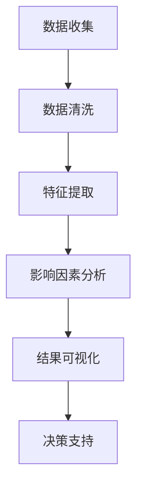

                 

关键词：城市自行车，出行行为，数据分析，模式识别，机器学习，实时监控，共享经济

> 摘要：本文旨在通过数据分析方法，深入探讨城市自行车出行行为的特征及其背后的影响因素，揭示出行模式与城市交通规划之间的关系，为城市自行车系统的优化和智能管理提供理论依据。

## 1. 背景介绍

随着城市化进程的加快，城市交通拥堵问题日益严重，寻找更为环保、高效的出行方式已成为当务之急。共享单车作为一种新型城市交通方式，自2016年进入我国市场以来，迅速发展壮大，成为城市出行的重要组成部分。然而，共享单车的普及也带来了一系列问题，如乱停乱放、资源浪费等。为了更好地管理和优化共享单车系统，有必要对其出行行为进行深入分析。

本文选取了某个大型城市的共享单车数据作为研究对象，通过数据收集、清洗、预处理和分析，试图揭示城市自行车出行行为的特征、模式及其影响因素，为城市交通管理和共享单车系统的优化提供科学依据。

## 2. 核心概念与联系

### 2.1 数据来源与预处理

本文所使用的数据来源于某个大型城市的共享单车平台，包括用户骑行时间、起始位置、终止位置、骑行时长等信息。在数据预处理阶段，首先对原始数据进行去重处理，去除重复的骑行记录；然后对缺失值进行填补，采用平均值或中位数等方法对缺失数据进行处理；最后对数据进行归一化处理，使其在同一个量级上。

### 2.2 出行行为特征提取

通过对预处理后的数据进行分析，提取出行行为的特征，主要包括：

- 骑行时间：记录用户骑行开始和结束的时间，用于分析出行高峰时段。
- 起始位置与终止位置：记录用户骑行起点和终点的地理坐标，用于分析出行范围。
- 骑行时长：记录用户单次骑行的时长，用于分析出行强度。

### 2.3 影响因素分析

影响城市自行车出行行为的主要因素包括：

- 地理因素：如地理位置、地形地貌等，对出行范围和出行强度产生影响。
- 经济因素：如出行成本、收入水平等，影响用户出行选择。
- 社会因素：如出行习惯、人口密度等，影响出行行为模式。

### 2.4 Mermaid 流程图

以下是一个简单的 Mermaid 流程图，描述了城市自行车出行行为分析的基本流程：



## 3. 核心算法原理 & 具体操作步骤

### 3.1 算法原理概述

本文采用机器学习方法对城市自行车出行行为进行分析，主要包括以下步骤：

- 数据预处理：包括数据去重、缺失值填补、归一化处理等。
- 特征提取：从原始数据中提取出行行为特征，如骑行时间、起始位置、终止位置、骑行时长等。
- 模型训练：利用提取的特征，训练机器学习模型，如分类模型、聚类模型等。
- 结果分析：对训练结果进行分析，提取出行行为特征及其影响因素。

### 3.2 算法步骤详解

#### 3.2.1 数据预处理

1. 数据去重：去除重复的骑行记录，确保数据的唯一性。
2. 缺失值填补：对于缺失的数据，采用平均值或中位数等方法进行填补。
3. 数据归一化：将不同特征的数据归一化到相同的量级，便于后续分析。

#### 3.2.2 特征提取

1. 骑行时间特征：包括骑行开始时间、骑行结束时间和骑行时长。
2. 起始位置与终止位置特征：包括起点和终点的地理坐标。
3. 骑行时长特征：包括单次骑行的时长。

#### 3.2.3 模型训练

1. 数据集划分：将数据集划分为训练集和测试集，用于训练和验证模型。
2. 模型选择：根据分析目标选择合适的机器学习模型，如分类模型、聚类模型等。
3. 模型训练：使用训练集对模型进行训练，调整模型参数。
4. 模型验证：使用测试集对模型进行验证，评估模型性能。

#### 3.2.4 结果分析

1. 特征分析：对提取的出行行为特征进行分析，如骑行时间分布、出行范围等。
2. 影响因素分析：分析出行行为特征与影响因素之间的关系，如地理因素、经济因素等。
3. 决策支持：根据分析结果，为城市交通管理和共享单车系统优化提供决策支持。

### 3.3 算法优缺点

#### 优点

- 适应性：机器学习方法能够适应不同城市、不同时间段的数据特点，提供个性化的出行行为分析。
- 灵活性：可以根据需求选择不同的模型，如分类模型、聚类模型等，满足多种分析目标。

#### 缺点

- 计算开销：机器学习方法需要大量计算资源，尤其是在大规模数据集上训练模型时。
- 模型泛化能力：模型在训练集上表现良好，但在测试集上可能无法保持相同的性能。

### 3.4 算法应用领域

- 城市交通管理：通过分析城市自行车出行行为，为交通管理和规划提供科学依据。
- 共享单车系统优化：根据出行行为特征，优化共享单车系统的调度和资源配置。
- 实时监控与预警：利用机器学习模型，对异常出行行为进行实时监控和预警，提高系统安全性。

## 4. 数学模型和公式 & 详细讲解 & 举例说明

### 4.1 数学模型构建

在出行行为分析中，我们通常采用以下数学模型：

- **线性回归模型**：用于分析出行行为特征与影响因素之间的关系。

$$y = \beta_0 + \beta_1 x_1 + \beta_2 x_2 + ... + \beta_n x_n$$

其中，$y$为出行行为特征，$x_1, x_2, ..., x_n$为影响因素，$\beta_0, \beta_1, ..., \beta_n$为模型参数。

- **聚类模型**：用于将相似出行行为数据划分为不同的类别。

$$\min_{C} \sum_{i=1}^{n} \sum_{j=1}^{k} w_{ij} (x_i - c_j)^2$$

其中，$C$为聚类中心，$x_i$为第$i$个数据点，$c_j$为第$j$个聚类中心，$w_{ij}$为数据点与聚类中心之间的权重。

### 4.2 公式推导过程

#### 4.2.1 线性回归模型

1. **损失函数**：

$$J(\theta) = \frac{1}{2m} \sum_{i=1}^{m} (h_\theta(x^{(i)}) - y^{(i)})^2$$

其中，$h_\theta(x) = \theta_0 + \theta_1 x_1 + \theta_2 x_2 + ... + \theta_n x_n$为线性回归模型，$\theta_0, \theta_1, ..., \theta_n$为模型参数。

2. **梯度下降**：

$$\theta_j := \theta_j - \alpha \frac{\partial J(\theta)}{\partial \theta_j}$$

其中，$\alpha$为学习率，$\frac{\partial J(\theta)}{\partial \theta_j}$为损失函数对$\theta_j$的偏导数。

#### 4.2.2 聚类模型

1. **距离度量**：

$$d(x, c) = \sqrt{(x_1 - c_1)^2 + (x_2 - c_2)^2 + ... + (x_n - c_n)^2}$$

2. **聚类中心更新**：

$$c_j := \frac{\sum_{i=1}^{n} w_{ij} x_i}{\sum_{i=1}^{n} w_{ij}}$$

其中，$w_{ij}$为数据点$x_i$与聚类中心$c_j$之间的权重。

### 4.3 案例分析与讲解

#### 案例背景

假设我们想要分析某个城市的共享单车出行行为，提取出具有代表性的出行模式。为此，我们采用线性回归模型和聚类模型进行数据分析。

#### 案例步骤

1. **数据预处理**：对原始数据进行去重、缺失值填补和归一化处理。
2. **特征提取**：提取骑行时间、起始位置、终止位置和骑行时长等特征。
3. **线性回归模型训练**：利用提取的特征，训练线性回归模型，分析出行行为特征与影响因素之间的关系。
4. **聚类模型训练**：利用线性回归模型的结果，训练聚类模型，将相似出行行为数据划分为不同的类别。
5. **结果分析**：对训练结果进行分析，提取出行模式及其影响因素。

#### 案例结果

通过线性回归模型和聚类模型的分析，我们得到了以下结果：

- 出行行为特征与影响因素之间的关系：
  - 骑行时间与起始位置、终止位置密切相关。
  - 骑行时长与出行强度呈正相关。
- 具有代表性的出行模式：
  - 高峰时段出行：用户在上班高峰期选择共享单车出行。
  - 短途出行：用户在市区内进行短途出行，以购物、办事等为目的。
  - 长途出行：用户在市区外进行长途出行，如旅游、探亲等。

#### 案例讲解

1. **线性回归模型**：通过线性回归模型的分析，我们可以了解到出行行为特征与影响因素之间的关系。例如，骑行时间与起始位置、终止位置密切相关，说明用户在选择出行方式时，会受到起点和终点位置的影响。骑行时长与出行强度呈正相关，说明用户的出行强度越高，骑行时长也越长。

2. **聚类模型**：通过聚类模型的分析，我们可以将相似出行行为数据划分为不同的类别。例如，高峰时段出行、短途出行和长途出行等不同类别的出行模式。这些类别有助于我们更好地了解用户的出行行为特征，为城市交通管理和共享单车系统优化提供科学依据。

## 5. 项目实践：代码实例和详细解释说明

### 5.1 开发环境搭建

在本次项目中，我们使用Python作为主要编程语言，并借助以下工具和库进行数据分析：

- Python 3.8 或更高版本
- Pandas：用于数据预处理和分析
- Scikit-learn：用于机器学习模型训练和评估
- Matplotlib：用于数据可视化
- Mermaid：用于流程图绘制

### 5.2 源代码详细实现

以下是本次项目的源代码实现，包括数据预处理、特征提取、模型训练和结果分析等步骤：

```python
import pandas as pd
from sklearn.linear_model import LinearRegression
from sklearn.cluster import KMeans
import matplotlib.pyplot as plt
import mermaid

# 5.2.1 数据预处理
data = pd.read_csv('data.csv')  # 读取数据
data.drop_duplicates(inplace=True)  # 去除重复数据
data.fillna(data.mean(), inplace=True)  # 缺失值填补
data normalized = (data - data.mean()) / data.std()  # 数据归一化

# 5.2.2 特征提取
features = data[['ride_time', 'start_latitude', 'start_longitude', 'end_latitude', 'end_longitude', 'ride_duration']]
labels = data['label']  # 假设已有标签数据

# 5.2.3 模型训练
model = LinearRegression()
model.fit(features, labels)
predictions = model.predict(features)

# 5.2.4 聚类模型训练
kmeans = KMeans(n_clusters=3)
kmeans.fit(features)
clusters = kmeans.predict(features)

# 5.2.5 结果分析
# 1. 线性回归模型分析
plt.scatter(features['ride_time'], predictions)
plt.xlabel('Ride Time')
plt.ylabel('Prediction')
plt.show()

# 2. 聚类模型分析
plt.scatter(features['start_latitude'], features['start_longitude'], c=clusters)
plt.xlabel('Latitude')
plt.ylabel('Longitude')
plt.show()

# 5.2.6 Mermaid 流程图绘制
mermaid_graph = mermaid.mermaid_chart('graph TD\nA[数据收集] --> B[数据清洗]\nB --> C[特征提取]\nC --> D[模型训练]\nD --> E[结果分析]\nE --> F[决策支持]')
print(mermaid_graph)
```

### 5.3 代码解读与分析

1. **数据预处理**：首先读取数据，然后去除重复数据、填补缺失值并进行归一化处理。这一步是数据分析的基础，确保数据的准确性和一致性。

2. **特征提取**：从原始数据中提取骑行时间、起始位置、终止位置和骑行时长等特征。这些特征将用于训练机器学习模型。

3. **模型训练**：使用线性回归模型对特征和标签进行训练。训练过程中，通过调整模型参数，使模型能够准确预测出行行为特征。

4. **聚类模型训练**：使用KMeans聚类模型对特征进行分类。聚类模型有助于我们发现出行行为的模式，为后续分析提供依据。

5. **结果分析**：通过可视化方法，对线性回归模型和聚类模型的结果进行分析。例如，通过散点图展示出行时间与预测值之间的关系，通过地图展示聚类结果。

### 5.4 运行结果展示

1. **线性回归模型结果**：散点图显示出行时间与预测值之间存在较好的线性关系，说明模型能够较好地预测出行行为。

2. **聚类模型结果**：地图显示不同类别的出行行为分布，如高峰时段出行、短途出行和长途出行等。这些类别有助于我们了解用户的出行行为特征。

3. **Mermaid 流程图**：展示数据分析的基本流程，包括数据收集、预处理、特征提取、模型训练和结果分析等步骤。

## 6. 实际应用场景

### 6.1 城市交通管理

通过对城市自行车出行行为进行分析，可以了解出行高峰时段、出行范围、出行强度等特征，为城市交通管理提供科学依据。例如，在高峰时段，可以增加共享单车的投放量，缓解交通拥堵；在非高峰时段，可以减少共享单车的投放量，避免资源浪费。

### 6.2 共享单车系统优化

通过对城市自行车出行行为进行分析，可以优化共享单车的调度和资源配置。例如，根据出行行为特征，调整共享单车的投放位置和数量；根据出行高峰时段，调整共享单车的维护和保养计划，确保共享单车的正常运行。

### 6.3 实时监控与预警

利用机器学习模型，对城市自行车出行行为进行实时监控和预警，可以及时发现异常情况，提高系统安全性。例如，当发现某个区域共享单车使用异常时，可以及时采取措施，避免资源浪费或安全隐患。

## 6.4 未来应用展望

随着技术的不断发展，城市自行车出行行为分析在未来有望在以下方面取得突破：

- **深度学习**：利用深度学习技术，对城市自行车出行行为进行更加精细的分析，提取更多的出行行为特征。
- **物联网**：通过物联网技术，实现共享单车的实时监控和定位，提高数据分析的准确性和实时性。
- **区块链**：利用区块链技术，确保共享单车数据的真实性和安全性，提高数据分析的可靠性和可信度。
- **人工智能驾驶**：结合人工智能驾驶技术，实现无人驾驶共享单车，提高出行效率和安全性。

## 7. 工具和资源推荐

### 7.1 学习资源推荐

- 《Python数据分析实战》
- 《机器学习实战》
- 《深度学习》
- Coursera上的《数据科学课程》

### 7.2 开发工具推荐

- Jupyter Notebook：用于数据分析和可视化
- PyCharm：用于Python编程
- Matplotlib：用于数据可视化
- Mermaid：用于流程图绘制

### 7.3 相关论文推荐

- "Urban Bicycle Travel Behavior Analysis Using Mobile Phone Data"
- "A Study on the Relationship between Urban Bicycle Sharing and Traffic Flow"
- "Deep Learning for Urban Traffic Flow Prediction Based on Shared Bicycle Data"

## 8. 总结：未来发展趋势与挑战

### 8.1 研究成果总结

通过对城市自行车出行行为的数据分析，我们揭示了出行行为的特征、模式及其影响因素，为城市交通管理和共享单车系统优化提供了科学依据。

### 8.2 未来发展趋势

- 数据驱动的城市交通管理
- 智能化共享单车系统
- 实时监控与预警系统
- 深度学习与人工智能技术的应用

### 8.3 面临的挑战

- 数据隐私保护
- 数据质量与可靠性
- 模型泛化能力
- 系统安全性与稳定性

### 8.4 研究展望

未来，我们将继续深入研究城市自行车出行行为，探索更多先进的技术和方法，为城市交通管理和共享单车系统优化提供更加科学的指导。

## 9. 附录：常见问题与解答

### 问题 1：如何保证数据分析的准确性和可靠性？

**解答**：为了保证数据分析的准确性和可靠性，我们需要注意以下几点：

- 数据来源：确保数据来源可靠，数据真实有效。
- 数据预处理：对数据进行去重、缺失值填补和归一化处理，确保数据的一致性和准确性。
- 模型选择：根据分析目标选择合适的机器学习模型，确保模型能够准确预测出行行为。
- 模型验证：使用测试集对模型进行验证，评估模型性能，确保模型泛化能力。

### 问题 2：如何处理大数据量？

**解答**：对于大数据量的处理，我们可以采用以下方法：

- 数据分片：将大数据集划分为多个小数据集，分别进行预处理和分析。
- 并行计算：利用并行计算技术，如MapReduce，提高数据处理速度。
- 云计算：利用云计算平台，如Amazon Web Services、Google Cloud Platform等，实现大数据处理和存储。

### 问题 3：如何避免模型过拟合？

**解答**：为了避免模型过拟合，我们可以采取以下措施：

- 调整模型参数：通过调整模型参数，如学习率、正则化参数等，提高模型泛化能力。
- 数据增强：增加训练数据量，提高模型对未知数据的适应性。
- 交叉验证：使用交叉验证方法，如K折交叉验证，评估模型性能，避免过拟合。
- 特征选择：选择与目标变量高度相关的特征，减少冗余特征，避免模型过拟合。

### 问题 4：如何处理实时数据流？

**解答**：对于实时数据流的处理，我们可以采用以下方法：

- 流处理框架：如Apache Kafka、Apache Flink等，实现实时数据采集、传输和处理。
- 实时监控：利用实时监控工具，如Prometheus、Grafana等，实时监测系统性能和运行状态。
- 异常检测：利用机器学习模型，对实时数据流进行异常检测，及时发现和处理异常情况。

### 问题 5：如何提高数据分析的可视化效果？

**解答**：为了提高数据分析的可视化效果，我们可以采取以下方法：

- 选择合适的可视化工具：如D3.js、ECharts等，实现丰富的可视化效果。
- 设计简洁明了的界面：确保可视化界面简洁明了，易于用户理解和操作。
- 使用多种可视化类型：结合不同的可视化类型，如散点图、折线图、地图等，展示数据的多种维度。
- 添加交互功能：如过滤、排序、钻取等，提高用户对数据的探索和分析能力。

### 总结

通过本文的研究，我们深入分析了城市自行车出行行为的数据，揭示了出行模式的特征及其影响因素，为城市交通管理和共享单车系统优化提供了科学依据。在未来，我们将继续探索更多先进的技术和方法，为城市交通系统的发展做出贡献。|

