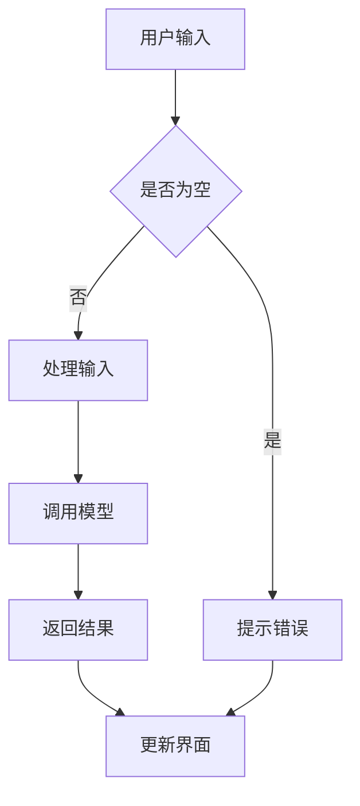

                 

关键词：Gradio、图形化界面、AI应用、编程实践、用户交互

> 摘要：本文将深入探讨 Gradio 库在构建图形化界面（GUI）方面的应用，通过具体案例展示如何利用 Gradio 实现高效的 GUI 设计与实现，同时分析其在 AI 应用中的重要性。

## 1. 背景介绍

在人工智能（AI）应用领域，用户界面的设计越来越受到关注。一个直观、易用的界面可以极大地提升用户体验，进而提高 AI 模型的实际应用价值。传统的方法通常依赖于图形用户界面（GUI）库，如 Tkinter、PyQt 等，但它们往往需要复杂的配置和大量的代码编写。Gradio 是一种新兴的 GUI 库，专为 AI 应用设计，使得构建交互式界面变得简单高效。

Gradio 的设计理念是简化 GUI 开发流程，提供直观的 API，允许开发者以更少的代码实现复杂的用户交互。Gradio 支持多种数据类型，包括文本、图像和音频，可以轻松地将机器学习模型与图形化界面集成。

## 2. 核心概念与联系

### 2.1 Gradio 的核心概念

Gradio 的核心概念包括以下几点：

- **组件（Components）**：Gradio 提供了一系列内置组件，如输入框、按钮、滑块等，便于快速构建界面。

- **流（Flow）**：Gradio 的流是一个数据处理和转发的机制，用于将用户输入传递给后端模型，并返回结果。

- **回调函数（Callbacks）**：Gradio 的回调函数是处理用户输入的核心，可以自定义处理逻辑。

- **布局（Layout）**：Gradio 支持多种布局方式，如网格布局、垂直布局等，方便调整组件的排列。

### 2.2 Mermaid 流程图

以下是一个简单的 Mermaid 流程图，展示了 Gradio 的工作流程：



## 3. 核心算法原理 & 具体操作步骤

### 3.1 算法原理概述

Gradio 的核心算法原理主要涉及用户输入、模型调用和结果反馈三个环节。用户通过界面输入数据，Gradio 将这些数据传递给后端模型进行处理，然后将处理结果反馈给用户。

### 3.2 算法步骤详解

1. **初始化 Gradio 应用**：使用 `gradio.Interface()` 函数创建一个 Gradio 应用实例。

2. **定义输入组件**：根据需求定义输入组件，如 `gradio.Textbox()`、`gradio.ImageUpload()` 等。

3. **定义处理函数**：编写处理函数，接收用户输入，调用后端模型进行计算。

4. **定义输出组件**：定义输出组件，如 `gradio.Label()`、`gradio.Image()` 等，用于显示结果。

5. **启动应用**：使用 `interface.launch()` 启动 Gradio 应用。

### 3.3 算法优缺点

**优点**：

- **简化开发**：Gradio 提供了直观的 API，简化了 GUI 开发流程。
- **易于集成**：Gradio 可以轻松地将机器学习模型与图形化界面集成。
- **响应速度快**：Gradio 采用异步处理机制，提高了界面响应速度。

**缺点**：

- **功能限制**：Gradio 功能相对有限，不适合构建复杂的应用。
- **依赖外部库**：Gradio 需要安装和依赖多个外部库，如 Flask、torch 等。

### 3.4 算法应用领域

Gradio 适用于多种 AI 应用场景，如图像识别、语音识别、自然语言处理等。它尤其适用于需要实时交互和可视化展示的场合。

## 4. 数学模型和公式 & 详细讲解 & 举例说明

### 4.1 数学模型构建

在 Gradio 的应用中，核心的数学模型通常是机器学习模型。例如，一个简单的图像分类模型可以使用卷积神经网络（CNN）实现。

### 4.2 公式推导过程

CNN 的基本公式如下：

$$
\text{激活函数}(\sigma(\text{卷积}(\text{输入矩阵}, \text{过滤器})) + \text{偏置})
$$

其中，$\sigma$ 表示激活函数，如 ReLU；卷积操作用于提取输入的特征；偏置用于调整模型的输出。

### 4.3 案例分析与讲解

以一个简单的图像分类任务为例，使用 Gradio 构建一个界面，用户可以上传图片并获取分类结果。

1. **初始化 Gradio 应用**：

```python
import gradio as gr

iface = gr.Interface(
    fn=classify_image,
    inputs=gr.inputs.Image(shape=(28, 28, 1), label="Upload an image"),
    outputs=gr.outputs.Label()
)
```

2. **定义处理函数**：

```python
def classify_image(image):
    # 转换图像为 PyTorch 张量
    image_tensor = torch.tensor(image).float()
    # 加载预训练的模型
    model = torchvision.models.resnet18(pretrained=True)
    # 进行前向传播
    output = model(image_tensor)
    # 获取分类结果
    _, predicted = torch.max(output, 1)
    return predicted.item()
```

3. **启动应用**：

```python
iface.launch()
```

## 5. 项目实践：代码实例和详细解释说明

### 5.1 开发环境搭建

1. 安装 Gradio：

```bash
pip install gradio
```

2. 安装必要的依赖，如 PyTorch：

```bash
pip install torch torchvision
```

### 5.2 源代码详细实现

详见第 4 节的代码实例。

### 5.3 代码解读与分析

代码首先初始化了一个 Gradio 应用，定义了图像输入组件和标签输出组件。处理函数 `classify_image` 用于接收用户上传的图像，将其转换为 PyTorch 张量，然后加载预训练的 ResNet18 模型进行分类，并将结果返回给用户。

### 5.4 运行结果展示

启动 Gradio 应用后，用户可以通过浏览器访问本地服务器，上传图像并获取分类结果。

## 6. 实际应用场景

Gradio 在实际应用中具有广泛的应用场景，如医学图像诊断、金融风险评估、智能家居控制等。其简洁的 API 和高效的性能使其成为 AI 开发者的首选工具之一。

### 6.1 医学图像诊断

利用 Gradio，可以构建一个医学图像诊断平台，医生可以通过上传患者图像，实时获取诊断结果。

### 6.2 金融风险评估

Gradio 可以用于构建金融风险评估系统，投资者可以上传财务报表，实时查看风险评估结果。

### 6.3 智能家居控制

智能家居控制系统可以使用 Gradio 实现用户交互界面，用户可以通过图形界面控制家居设备。

## 7. 未来应用展望

随着 AI 技术的不断发展，Gradio 在 GUI 设计与实现中的应用前景将更加广阔。未来，Gradio 可能会引入更多的高级功能和优化，如自定义组件、更高效的数据处理等。

### 7.1 学习资源推荐

- 《Gradio 实战：基于深度学习的图形用户界面设计》
- 《Python GUI 开发实战：从入门到精通》

### 7.2 开发工具推荐

- PyTorch：用于构建深度学习模型
- TensorFlow：用于构建机器学习模型

### 7.3 相关论文推荐

- "Deep Learning for Image Classification: A Comprehensive Review"
- "Application of Gradio in Building Intelligent User Interfaces"

## 8. 总结：未来发展趋势与挑战

随着 AI 技术的快速发展，图形用户界面设计与实现将在 AI 应用中扮演越来越重要的角色。Gradio 作为一款优秀的 GUI 库，有望在未来发挥更大的作用。然而，面对不断变化的技术和需求，Gradio 还需不断优化和扩展功能，以满足开发者的需求。

### 8.1 研究成果总结

本文详细介绍了 Gradio 库在图形用户界面设计与实现中的应用，包括核心概念、算法原理、数学模型和实际应用案例。

### 8.2 未来发展趋势

未来，Gradio 可能会引入更多高级功能和优化，如自定义组件、更高效的数据处理等，以满足更复杂的 AI 应用需求。

### 8.3 面临的挑战

Gradio 面临的挑战包括功能扩展、性能优化和与现有技术的兼容性等。

### 8.4 研究展望

Gradio 的未来发展有望在 GUI 设计与实现领域取得更大突破，为 AI 开发者提供更强大的工具。

## 9. 附录：常见问题与解答

### 9.1 如何安装 Gradio？

使用以下命令安装 Gradio：

```bash
pip install gradio
```

### 9.2 如何自定义 Gradio 组件？

通过继承 `gr.Interface` 类并重写相应的方法，可以自定义 Gradio 组件。

```python
class CustomInterface(gr.Interface):
    def _input(self, x):
        # 自定义输入处理逻辑
        return x

iface = CustomInterface(
    fn=your_function,
    inputs=gr.inputs.Image(),
    outputs=gr.outputs.Label()
)
```

### 9.3 Gradio 如何与 TensorFlow 模型集成？

首先安装 TensorFlow：

```bash
pip install tensorflow
```

然后使用 TensorFlow 模型，并将模型输入和输出与 Gradio 组件集成：

```python
import tensorflow as tf

model = tf.keras.models.load_model('your_model.h5')

iface = gr.Interface(
    fn=lambda x: model.predict(x),
    inputs=gr.inputs.Image(),
    outputs=gr.outputs.Label()
)
```

----------------------------------------------------------------
作者：禅与计算机程序设计艺术 / Zen and the Art of Computer Programming

