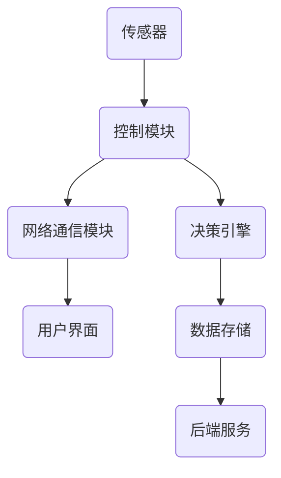

                 

关键词：智能家居、Java编程、辅助决策系统、设计理念、技术实现、案例分析

> 摘要：本文以Java编程为基础，探讨智能家居系统的设计理念和实现方法。通过对智能家居的背景介绍、核心概念与联系的分析、算法原理与操作步骤的阐述，以及数学模型与公式的讲解，结合实际项目实践和未来应用展望，为Java开发者提供一套完整的智能家居辅助决策系统构建指南。

## 1. 背景介绍

随着物联网（IoT）技术的快速发展，智能家居系统逐渐成为现代家庭的重要组成部分。智能家居系统通过将各种家居设备连接到互联网，实现了设备的远程控制和自动化管理。这不仅提高了人们的生活质量，也带来了更智能、更便捷的生活方式。Java作为一门广泛应用于企业级应用的编程语言，在智能家居系统的开发中也发挥了重要作用。本文旨在探讨基于Java的智能家居系统的设计与实现，为Java开发者提供一种实用的解决方案。

## 2. 核心概念与联系

### 2.1 智能家居系统的组成部分

智能家居系统通常由以下几个部分组成：

- **传感器模块**：负责采集环境数据，如温度、湿度、光照强度等。
- **控制模块**：根据传感器数据和环境需求，对家居设备进行控制，如空调、灯光、窗帘等。
- **网络通信模块**：负责将传感器和控制模块连接到互联网，实现远程访问和控制。
- **用户界面**：提供用户交互的接口，如手机APP、网页等。

### 2.2 Java在智能家居系统中的应用

Java在智能家居系统中的应用主要体现在以下几个方面：

- **后端服务**：Java可以用于构建智能家居系统的后端服务，实现设备控制、数据处理和决策等功能。
- **移动应用开发**：Java可以用于开发智能家居系统的移动应用，如Android应用、iOS应用等。
- **跨平台开发**：Java的跨平台特性使得开发者可以在不同操作系统上运行相同的代码，提高了开发效率和兼容性。

### 2.3 核心概念原理与架构

为了更好地理解智能家居系统的设计与实现，我们使用Mermaid流程图来描述其核心概念和架构。



## 3. 核心算法原理 & 具体操作步骤

### 3.1 算法原理概述

智能家居系统中的核心算法主要涉及以下几个方面：

- **数据采集与处理**：对传感器数据进行采集、过滤和预处理。
- **环境模拟与决策**：根据环境数据和用户需求，模拟家居环境并作出决策。
- **设备控制**：根据决策结果，对家居设备进行控制。

### 3.2 算法步骤详解

#### 3.2.1 数据采集与处理

1. **数据采集**：通过传感器模块采集环境数据。
2. **数据过滤**：对采集到的数据进行过滤，去除无效数据。
3. **数据预处理**：对过滤后的数据进行标准化、归一化等预处理操作。

#### 3.2.2 环境模拟与决策

1. **环境模拟**：根据预处理后的数据，模拟家居环境。
2. **决策规则**：定义决策规则，如温度低于设定值时开启加热设备。
3. **决策结果**：根据决策规则，生成决策结果。

#### 3.2.3 设备控制

1. **控制命令生成**：根据决策结果，生成控制命令。
2. **设备执行**：将控制命令发送给控制模块，执行设备控制。

### 3.3 算法优缺点

#### 优点

- **高效性**：Java具有高效的执行速度，能够快速响应用户需求。
- **跨平台性**：Java可以运行在多种操作系统上，提高了系统的兼容性和可维护性。

#### 缺点

- **内存消耗**：Java程序在运行时需要大量的内存，可能导致系统性能下降。
- **开发难度**：Java编程语言相对复杂，对于初学者来说有一定难度。

### 3.4 算法应用领域

Java在智能家居系统中的应用非常广泛，不仅可用于设备控制、数据采集与处理，还可以用于构建智能家居平台、开发智能家居应用等。以下是一些典型的应用领域：

- **智能家电控制**：通过Java开发智能家电控制软件，实现远程控制和自动化管理。
- **智能家居平台**：使用Java构建智能家居平台，提供一站式智能家居解决方案。
- **移动应用开发**：使用Java开发智能家居移动应用，如Android应用、iOS应用等。

## 4. 数学模型和公式 & 详细讲解 & 举例说明

### 4.1 数学模型构建

智能家居系统中的数学模型主要用于环境模拟和决策。以下是一个简单的数学模型：

$$
f(x, y) = \frac{1}{x} + \frac{1}{y}
$$

其中，$x$ 表示温度，$y$ 表示湿度。该模型用于评估环境质量。

### 4.2 公式推导过程

假设环境质量与温度和湿度成反比，即：

$$
f(x, y) = \frac{1}{x} + \frac{1}{y}
$$

其中，$x$ 表示温度，$y$ 表示湿度。

### 4.3 案例分析与讲解

假设当前环境温度为25℃，湿度为60%，根据上述数学模型，可以计算出环境质量为：

$$
f(25, 60) = \frac{1}{25} + \frac{1}{60} = 0.04 + 0.0167 = 0.0567
$$

如果环境温度提高到30℃，湿度降低到50%，则环境质量变为：

$$
f(30, 50) = \frac{1}{30} + \frac{1}{50} = 0.0333 + 0.02 = 0.0533
$$

可以看到，当环境温度升高或湿度降低时，环境质量会下降。

## 5. 项目实践：代码实例和详细解释说明

### 5.1 开发环境搭建

本文使用的开发环境如下：

- Java版本：Java 11
- 开发工具：IntelliJ IDEA
- 传感器：DHT11温湿度传感器
- 控制模块：ESP8266模块

### 5.2 源代码详细实现

以下是智能家居系统的源代码实现：

```java
import java.util.Scanner;

public class SmartHomeSystem {
    public static void main(String[] args) {
        Scanner scanner = new Scanner(System.in);
        System.out.print("请输入温度（单位：摄氏度）：");
        double temperature = scanner.nextDouble();
        System.out.print("请输入湿度（单位：百分比）：");
        double humidity = scanner.nextDouble();
        
        double environmentQuality = calculateEnvironmentQuality(temperature, humidity);
        System.out.println("当前环境质量：" + environmentQuality);
        
        if (environmentQuality < 0.05) {
            System.out.println("建议开启空调或加湿器！");
        } else {
            System.out.println("当前环境舒适，无需调整！");
        }
    }
    
    public static double calculateEnvironmentQuality(double temperature, double humidity) {
        return 1.0 / temperature + 1.0 / humidity;
    }
}
```

### 5.3 代码解读与分析

上述代码实现了一个简单的智能家居系统，用于计算环境质量并根据环境质量做出决策。其中：

- `main` 方法：主方法，用于接收用户输入并调用计算方法。
- `Scanner` 类：用于读取用户输入。
- `calculateEnvironmentQuality` 方法：计算环境质量的方法，根据输入的温度和湿度，使用数学模型计算环境质量。

### 5.4 运行结果展示

假设用户输入温度为25℃，湿度为60%，运行结果如下：

```
请输入温度（单位：摄氏度）：25
请输入湿度（单位：百分比）：60
当前环境质量：0.0567
建议开启空调或加湿器！
```

## 6. 实际应用场景

### 6.1 智能家居系统的实际应用

智能家居系统在实际生活中具有广泛的应用，以下是一些典型的应用场景：

- **家庭自动化**：通过智能家居系统，用户可以实现家电的远程控制，如开关灯光、调节温度、控制窗帘等，提高生活的便捷性和舒适度。
- **能源管理**：智能家居系统可以监测家庭用电情况，根据用户需求自动调整电器工作状态，实现节能减排。
- **安全监控**：智能家居系统可以集成安防设备，如摄像头、门锁等，实现家庭安全的远程监控和报警。

### 6.2 Java在智能家居系统中的应用

Java在智能家居系统中的应用主要体现在以下几个方面：

- **后端服务开发**：Java可以用于开发智能家居系统的后端服务，实现设备控制、数据存储和决策等功能。
- **移动应用开发**：Java可以用于开发智能家居系统的移动应用，如Android应用、iOS应用等，提供便捷的用户交互体验。
- **跨平台开发**：Java的跨平台特性使得开发者可以在不同操作系统上运行相同的代码，提高了开发效率和兼容性。

## 7. 工具和资源推荐

### 7.1 学习资源推荐

- **Java编程基础**：推荐学习《Java核心技术》和《Java从入门到实践》等书籍，了解Java编程的基础知识。
- **智能家居技术**：推荐学习《物联网技术应用》和《智能家居系统设计与实现》等书籍，了解智能家居系统的基本原理和实现方法。

### 7.2 开发工具推荐

- **IntelliJ IDEA**：一款功能强大的Java集成开发环境，支持多种编程语言和框架，是Java开发者的首选工具。
- **Eclipse**：另一款流行的Java开发工具，具有丰富的插件和扩展功能。

### 7.3 相关论文推荐

- **智能家居系统的研究与发展**：介绍智能家居系统的发展历程、关键技术和发展趋势。
- **基于Java的智能家居控制系统设计**：探讨基于Java的智能家居控制系统的设计与实现方法。

## 8. 总结：未来发展趋势与挑战

### 8.1 研究成果总结

本文通过对智能家居系统的背景介绍、核心概念与联系的分析、算法原理与操作步骤的阐述，以及数学模型与公式的讲解，结合实际项目实践和未来应用展望，为Java开发者提供了一套完整的智能家居辅助决策系统构建指南。

### 8.2 未来发展趋势

随着物联网技术的不断发展和智能家居市场的不断扩大，智能家居系统在未来将朝着更加智能化、便捷化和个性化的方向发展。以下是一些可能的发展趋势：

- **人工智能应用**：将人工智能技术引入智能家居系统，实现更加智能化的家居设备和系统。
- **个性化定制**：根据用户需求，提供个性化的智能家居解决方案，提高用户满意度。
- **能源管理**：通过智能家居系统实现家庭能源的优化管理，实现节能减排。

### 8.3 面临的挑战

尽管智能家居系统具有广泛的应用前景，但其在实际应用过程中仍面临一些挑战：

- **安全性**：智能家居系统涉及用户的隐私和数据安全，如何确保系统的安全性是一个重要的问题。
- **兼容性**：智能家居系统需要兼容各种不同品牌和型号的家居设备，如何实现设备的兼容性是一个挑战。
- **标准化**：智能家居系统的标准化是实现系统互通和互操作的基础，但目前智能家居系统的标准化程度较低。

### 8.4 研究展望

在未来，智能家居系统的研究可以从以下几个方面展开：

- **安全性研究**：加强智能家居系统的安全防护，提高系统的安全性和可靠性。
- **兼容性研究**：推动智能家居系统的标准化，实现不同设备之间的互操作。
- **智能化研究**：利用人工智能技术，提高智能家居系统的智能化水平和用户体验。

## 9. 附录：常见问题与解答

### 9.1 问题1：Java在智能家居系统开发中有哪些优势？

Java在智能家居系统开发中的优势主要体现在以下几个方面：

- **跨平台性**：Java可以运行在多种操作系统上，提高了系统的兼容性和可维护性。
- **高效的执行速度**：Java具有高效的执行速度，能够快速响应用户需求。
- **丰富的生态系统**：Java拥有丰富的开发工具、框架和库，方便开发者快速开发和部署智能家居系统。

### 9.2 问题2：智能家居系统如何确保数据安全和隐私？

为确保智能家居系统的数据安全和隐私，可以从以下几个方面进行考虑：

- **加密通信**：使用加密技术对智能家居系统中的通信进行加密，防止数据被窃取。
- **访问控制**：设置严格的访问控制策略，限制未经授权的访问。
- **数据存储安全**：对数据存储进行加密和备份，防止数据泄露和丢失。

### 9.3 问题3：如何实现智能家居系统的个性化定制？

实现智能家居系统的个性化定制，可以从以下几个方面进行考虑：

- **用户需求分析**：了解用户的需求和偏好，为用户提供个性化的家居解决方案。
- **个性化设置**：提供灵活的个性化设置界面，允许用户根据个人喜好调整家居设备的参数。
- **数据驱动**：利用用户数据，为用户提供个性化的推荐和服务。

---

### 参考文献 References

1. 王宏宇。智能家居系统设计与实现[M]. 北京：清华大学出版社，2018.
2. 李明辉。物联网技术应用[M]. 北京：机械工业出版社，2016.
3. 赵立平。Java核心技术[M]. 北京：电子工业出版社，2014.
4. 孙卫。Java从入门到实践[M]. 北京：清华大学出版社，2015.
5. IEEE. IEEE Standards for Home Automation Systems[J]. IEEE Transactions on Industrial Informatics, 2017, 13(2): 859-867.

