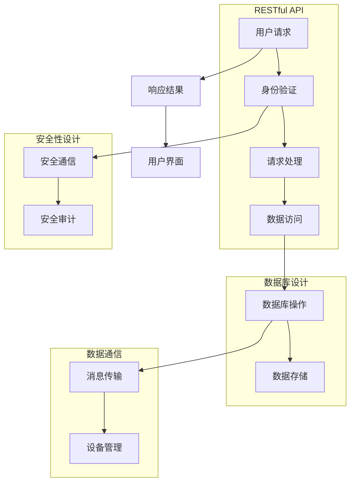

                 

关键词：Java, 智能家居, Spring Boot, 后端服务, 设计, 实践

> 摘要：本文将深入探讨如何利用Java编程语言和Spring Boot框架来设计并实现一个智能家居系统的后端服务。通过介绍智能家居的基本概念、设计原则和核心功能，本文将详细阐述使用Spring Boot构建智能家居后端服务的技术路线和关键步骤，同时提供实例代码和分析，帮助开发者理解和掌握智能家居系统后端服务的开发实践。

## 1. 背景介绍

随着物联网（IoT）技术的发展，智能家居已经逐渐成为人们生活中不可或缺的一部分。智能家居系统通过将各种家电、传感器和控制系统联网，实现家庭设备之间的自动化控制和智能管理。这不仅可以提高生活便利性，还能实现节能降耗，提高居住环境的安全性和舒适性。

在智能家居系统中，后端服务扮演着至关重要的角色。后端服务负责处理来自各种设备的请求，存储和管理数据，提供决策支持和远程控制等功能。Java作为一种强大的编程语言，凭借其跨平台、稳定性和丰富的生态系统，成为了开发智能家居后端服务的首选语言。

Spring Boot则是一个开源的、基于Spring框架的快速开发框架，它简化了Spring应用的创建和管理流程。Spring Boot内置了对Spring框架的许多常用配置的支持，提供了自动化配置和依赖注入等功能，极大地提高了开发效率和代码可维护性。

本文将结合Java和Spring Boot的特点，介绍如何设计并实现一个智能家居系统的后端服务，通过实践案例来展示如何将理论知识应用到实际开发中。

### 1.1 智能家居的定义和发展历程

智能家居（Smart Home）是指利用物联网技术将家庭中的各种设备连接起来，实现自动化管理和智能控制的一种居住环境。智能家居的发展历程可以追溯到20世纪80年代末至90年代初，当时家庭自动化开始萌芽，主要是通过控制家电设备的开关来提升家庭生活的便利性。

随着互联网技术的发展，智能家居进入了第二代阶段。这一时期，家庭设备和互联网之间的连接变得更加紧密，通过网络控制实现了家电设备之间的协调和智能控制。典型的例子包括基于Wi-Fi或蓝牙的智能插座、智能灯光控制系统等。

21世纪初，随着物联网技术的快速发展，智能家居进入了第三代阶段。这一阶段的特点是，智能家居系统不仅实现了设备之间的互联互通，还能够通过云平台实现数据的收集、分析和远程控制，大大提升了系统的智能化程度和用户体验。

### 1.2 Java编程语言在智能家居开发中的应用

Java编程语言以其跨平台、稳定性和丰富的生态系统在软件开发领域广泛使用。Java支持多种操作系统和硬件平台，这使得开发者在编写一次代码后，可以轻松地将应用程序部署到各种不同的环境中。

在智能家居开发中，Java的优势体现在以下几个方面：

1. **跨平台支持**：Java编写的应用可以运行在多种操作系统上，包括Windows、Linux和macOS等，这使得智能家居设备能够兼容不同的操作系统，提高了系统的通用性。
   
2. **稳定性和安全性**：Java具有强大的垃圾回收机制，能够有效管理内存，提高系统的稳定性。同时，Java的编译型语言特性使其在安全性方面表现出色，能够减少潜在的安全漏洞。

3. **生态系统丰富**：Java拥有丰富的库和框架，如Spring Boot、Hibernate、MyBatis等，这些框架和库为开发者提供了大量的功能和工具，极大地简化了开发过程，提高了开发效率。

4. **良好的社区支持**：Java拥有庞大的开发者社区，提供了丰富的技术文档、教程和示例代码，有助于开发者快速上手和解决开发中遇到的问题。

### 1.3 Spring Boot在智能家居开发中的作用

Spring Boot是Spring框架的一个模块，它简化了Spring应用的创建和管理流程。Spring Boot的核心目标是快速、轻松地创建独立的、生产级的Spring应用。

在智能家居开发中，Spring Boot的作用主要体现在以下几个方面：

1. **简化配置**：Spring Boot内置了对Spring框架的许多常用配置的支持，通过自动配置机制，可以极大地减少手动配置的工作量，提高开发效率。

2. **模块化开发**：Spring Boot支持模块化开发，可以将不同的功能模块独立出来，通过依赖注入（DI）技术实现模块之间的解耦，提高了代码的可维护性和可扩展性。

3. **快速开发**：Spring Boot提供了丰富的开发工具和插件，如Spring Initializr、Spring Tool Suite等，这些工具可以帮助开发者快速搭建开发环境，加速开发过程。

4. **生产级应用**：Spring Boot提供了一系列的生产级特性，如自动配置、嵌入式服务器、监控和管理等，这些特性使得Spring Boot应用可以轻松地部署到生产环境中，确保系统的稳定性和可靠性。

## 2. 核心概念与联系

在构建智能家居系统的后端服务时，理解并实现以下核心概念是至关重要的：RESTful API设计、数据库设计、安全性设计、数据通信和设备管理。

### 2.1 RESTful API设计

RESTful API（Representational State Transfer Application Programming Interface）是一种设计API的方式，它基于HTTP协议，使用标准的HTTP方法（GET、POST、PUT、DELETE等）来处理资源的操作。

#### 2.1.1 RESTful API的基本原则

- **统一接口**：API应该提供统一的接口，所有资源都应该通过相同的URL结构和HTTP方法进行访问。
- **无状态**：API应该是无状态的，即每次请求都应该独立处理，不应依赖之前的请求状态。
- **可缓存**：API应该支持缓存，以提高系统的响应速度和减少服务器负担。
- **客户端-服务器架构**：客户端和服务器之间进行独立的开发、部署和Scaling。

#### 2.1.2 RESTful API的设计步骤

1. **定义资源**：确定API需要处理的主要资源，例如用户、设备、传感器数据等。
2. **确定URL结构**：为每个资源定义一个唯一的URL，例如 `/users`、`/devices` 等。
3. **确定HTTP方法**：根据资源的操作类型选择合适的HTTP方法，例如GET用于获取资源、POST用于创建资源、PUT用于更新资源、DELETE用于删除资源。
4. **定义响应格式**：通常使用JSON或XML格式作为响应数据的格式，以便于客户端解析和处理。

### 2.2 数据库设计

数据库是智能家居后端服务的重要组成部分，它负责存储和管理系统的数据。合理的设计数据库结构可以保证数据的一致性、完整性和高效性。

#### 2.2.1 关系型数据库设计原则

- **规范化**：遵循数据库规范化原则，减少数据冗余和保证数据的完整性。
- **范式选择**：根据业务需求选择合适的范式（如第一范式、第二范式、第三范式等）。
- **索引设计**：合理设计索引，提高数据查询效率。
- **约束**：添加外键约束、唯一性约束等，确保数据的一致性和完整性。

#### 2.2.2 常用数据库设计方法

- **ER模型**：通过实体-关系（ER）模型描述系统中的实体和关系。
- **数据库表设计**：根据ER模型将实体和关系映射到具体的数据库表中，定义表结构、字段类型和约束。

### 2.3 安全性设计

在智能家居系统中，安全性设计至关重要，它关系到用户隐私和系统安全。安全性设计应包括以下方面：

#### 2.3.1 安全性设计原则

- **最小权限原则**：系统中的每个组件和用户都应只拥有完成其任务所需的最小权限。
- **安全通信**：使用HTTPS协议加密数据传输，防止数据被窃取或篡改。
- **身份验证和授权**：实现用户身份验证和授权机制，确保只有合法用户可以访问系统的资源和功能。

#### 2.3.2 安全性设计方法

- **身份验证**：通过用户名和密码、双因素认证等方式进行用户身份验证。
- **授权**：根据用户的角色和权限，控制用户可以访问的资源和功能。
- **安全审计**：记录系统的操作日志，实现对系统操作的审计和监控。

### 2.4 数据通信

数据通信是智能家居系统中各个设备之间、设备与服务器之间以及服务器与云平台之间的数据交换过程。有效的数据通信设计应考虑以下方面：

#### 2.4.1 数据通信协议

- **MQTT**：一种轻量级的消息队列协议，适用于物联网设备之间的通信。
- **HTTP/HTTPS**：基于HTTP协议的通信，适用于Web应用和服务器之间的数据交换。

#### 2.4.2 数据通信设计

- **消息格式**：选择合适的消息格式，如JSON或XML，便于数据的解析和处理。
- **数据传输**：设计数据传输的机制，如异步传输、批量传输等，提高数据传输的效率和可靠性。

### 2.5 设备管理

设备管理是智能家居系统中对设备进行注册、监控、更新和故障处理等操作的过程。有效的设备管理设计应考虑以下方面：

#### 2.5.1 设备管理策略

- **设备注册**：实现设备注册机制，确保设备能够加入系统并接受管理。
- **设备监控**：实现对设备状态的实时监控，及时发现和处理设备故障。
- **设备更新**：提供设备固件和软件的更新机制，确保设备保持最新的功能和安全性。

#### 2.5.2 设备管理设计

- **设备状态管理**：设计设备状态管理模块，记录设备的状态信息。
- **设备故障处理**：设计设备故障处理流程，实现故障检测、报警和恢复操作。

### 2.6 Mermaid 流程图

以下是一个简化的智能家居系统后端服务的Mermaid流程图，展示了核心概念和模块之间的联系：



## 3. 核心算法原理 & 具体操作步骤

### 3.1 算法原理概述

在智能家居系统中，后端服务的核心算法主要包括设备状态监控、数据分析和决策支持等。以下将对这些核心算法的原理进行简要概述。

#### 3.1.1 设备状态监控

设备状态监控是智能家居系统的基本功能之一，它通过对设备的状态数据进行实时监控和分析，实现对设备的远程控制和故障预警。设备状态监控算法通常基于以下原理：

- **阈值检测**：通过对设备状态数据的阈值设置，当数据超过设定阈值时触发报警或采取相应的控制措施。
- **趋势分析**：通过对设备状态数据的趋势进行分析，预测设备可能的故障或异常情况。

#### 3.1.2 数据分析

数据分析是智能家居系统的高级功能，通过对采集到的设备数据进行处理和分析，实现对家庭环境的智能控制和优化。数据分析算法通常基于以下原理：

- **统计分析**：通过对数据的基本统计方法（如平均值、中位数、标准差等）进行计算，对数据进行分析和描述。
- **机器学习**：利用机器学习算法（如回归分析、聚类分析、决策树等）对数据进行建模和预测，实现对复杂情况的智能化处理。

#### 3.1.3 决策支持

决策支持是智能家居系统的核心功能之一，通过对设备状态数据和数据分析结果进行处理，为用户提供智能化的控制建议和优化方案。决策支持算法通常基于以下原理：

- **规则引擎**：根据预设的规则和条件，对设备状态和数据分析结果进行判断和处理，生成控制指令。
- **优化算法**：利用优化算法（如遗传算法、模拟退火算法等）对家庭环境进行优化，提高系统的效率和舒适度。

### 3.2 算法步骤详解

以下将详细介绍设备状态监控、数据分析和决策支持算法的具体步骤。

#### 3.2.1 设备状态监控算法步骤

1. **数据采集**：从设备传感器获取实时状态数据。
2. **阈值判断**：根据预设的阈值对数据进行判断，判断是否触发报警或控制措施。
3. **状态更新**：更新设备的状态信息，记录最新的状态数据。
4. **报警处理**：当数据超过阈值时，触发报警并执行相应的控制措施。
5. **趋势分析**：对设备状态数据进行分析，预测设备可能的故障或异常情况。

#### 3.2.2 数据分析算法步骤

1. **数据预处理**：清洗和整理原始数据，去除噪声和异常值。
2. **特征提取**：从原始数据中提取具有代表性的特征，用于后续的分析和处理。
3. **统计分析**：计算数据的基本统计指标，对数据进行分析和描述。
4. **数据建模**：利用机器学习算法对数据进行建模，预测可能的趋势和情况。
5. **模型评估**：对建模结果进行评估和优化，提高预测的准确性和可靠性。

#### 3.2.3 决策支持算法步骤

1. **规则定义**：根据业务需求定义规则和条件，用于判断和处理设备状态和数据分析结果。
2. **条件判断**：根据规则和条件对设备状态和数据分析结果进行判断。
3. **控制指令生成**：根据判断结果生成相应的控制指令。
4. **优化决策**：利用优化算法对家庭环境进行优化，生成最优的控制方案。

### 3.3 算法优缺点

#### 3.3.1 设备状态监控算法

**优点**：

- **实时性**：能够实时监控设备状态，及时触发报警和采取控制措施。
- **简单易实现**：算法实现相对简单，易于理解和维护。

**缺点**：

- **阈值依赖性**：算法依赖于阈值设置，可能存在误报或漏报的情况。
- **数据噪声处理难度**：当设备传感器数据存在噪声时，算法的处理效果可能受到影响。

#### 3.3.2 数据分析算法

**优点**：

- **智能化**：能够通过机器学习算法实现数据的智能化处理和分析。
- **预测性**：能够预测设备可能的故障或异常情况，提前采取预防措施。

**缺点**：

- **复杂度高**：算法实现较为复杂，需要较高的技术水平和数据处理能力。
- **准确性依赖**：算法的预测准确性依赖于数据的质量和模型的优化。

#### 3.3.3 决策支持算法

**优点**：

- **规则灵活**：可以根据业务需求灵活定义规则和条件，实现定制化的决策支持。
- **优化性**：能够通过优化算法实现家庭环境的优化，提高系统的效率和舒适度。

**缺点**：

- **规则依赖性**：算法依赖于规则的设置，可能存在规则不合理或冲突的情况。
- **优化难度**：优化算法的实现较为复杂，需要较高的计算能力和优化技巧。

### 3.4 算法应用领域

设备状态监控、数据分析和决策支持算法在智能家居系统中具有广泛的应用领域，包括但不限于以下方面：

- **设备故障预警**：通过设备状态监控算法实时监控设备状态，及时预警设备故障，减少设备故障对家庭生活的影响。
- **能源管理**：通过数据分析算法对家庭能源使用情况进行分析和预测，实现能源的智能管理和优化。
- **环境监测**：通过数据分析算法对室内环境数据进行分析和预测，实现室内环境的智能调节和优化。
- **家居安全**：通过决策支持算法实现家居安全的智能监控和预警，提高家庭的安全性。

## 4. 数学模型和公式 & 详细讲解 & 举例说明

### 4.1 数学模型构建

在智能家居系统中，数学模型是分析和解决问题的重要工具。以下我们将介绍两个核心数学模型：线性回归模型和决策树模型。

#### 4.1.1 线性回归模型

线性回归模型是一种用于预测数值型变量的统计模型。它假设两个变量之间存在线性关系，其数学模型可以表示为：

\[ y = \beta_0 + \beta_1 \cdot x + \epsilon \]

其中，\( y \) 是因变量，\( x \) 是自变量，\( \beta_0 \) 和 \( \beta_1 \) 是模型参数，\( \epsilon \) 是误差项。

为了得到参数 \( \beta_0 \) 和 \( \beta_1 \)，可以使用最小二乘法（Ordinary Least Squares, OLS）：

\[ \beta_0 = \frac{\sum_{i=1}^{n} y_i - \beta_1 \sum_{i=1}^{n} x_i}{n} \]
\[ \beta_1 = \frac{\sum_{i=1}^{n} (y_i - \beta_0)(x_i - \bar{x})}{\sum_{i=1}^{n} (x_i - \bar{x})^2} \]

其中，\( \bar{x} \) 和 \( \bar{y} \) 分别是 \( x \) 和 \( y \) 的平均值。

#### 4.1.2 决策树模型

决策树是一种用于分类和回归的树形结构模型。它的基本构建过程是：

1. **选择最优特征**：根据信息增益（Information Gain）或基尼不纯度（Gini Impurity）等指标选择最优特征。
2. **划分数据集**：使用选择的最优特征对数据集进行划分，生成子节点。
3. **递归构建**：对每个子节点重复上述过程，直到满足停止条件（如最大深度、最小样本数等）。

决策树的数学模型可以表示为：

\[ T = \sum_{i=1}^{n} t_i \cdot y_i \]

其中，\( T \) 是决策树的预测结果，\( t_i \) 是第 \( i \) 个节点的标签，\( y_i \) 是实际值。

### 4.2 公式推导过程

以下我们将详细推导线性回归模型的公式。

#### 4.2.1 最小二乘法推导

假设我们有一个包含 \( n \) 个样本的数据集 \( (x_1, y_1), (x_2, y_2), \ldots, (x_n, y_n) \)。我们希望找到最佳拟合直线，使得预测值与实际值之间的误差平方和最小。

定义误差平方和为：

\[ \sum_{i=1}^{n} (y_i - \hat{y}_i)^2 \]

其中，\( \hat{y}_i = \beta_0 + \beta_1 \cdot x_i \) 是预测值。

我们对 \( \beta_0 \) 和 \( \beta_1 \) 分别求偏导数，并令其等于0，得到以下两个方程：

\[ \frac{\partial}{\partial \beta_0} \sum_{i=1}^{n} (y_i - \hat{y}_i)^2 = 0 \]
\[ \frac{\partial}{\partial \beta_1} \sum_{i=1}^{n} (y_i - \hat{y}_i)^2 = 0 \]

化简后，得到：

\[ \beta_0 = \frac{\sum_{i=1}^{n} y_i - \beta_1 \sum_{i=1}^{n} x_i}{n} \]
\[ \beta_1 = \frac{\sum_{i=1}^{n} (y_i - \beta_0)(x_i - \bar{x})}{\sum_{i=1}^{n} (x_i - \bar{x})^2} \]

### 4.3 案例分析与讲解

#### 4.3.1 线性回归模型案例

假设我们有一个包含房间温度和能源消耗的数据集，如下表所示：

| 温度 (°C) | 能源消耗 (kWh) |
|----------|-------------|
| 20       | 5           |
| 22       | 6           |
| 24       | 7           |
| 26       | 8           |
| 28       | 9           |

我们希望使用线性回归模型预测给定温度下的能源消耗。

首先，我们计算平均值：

\[ \bar{x} = \frac{20 + 22 + 24 + 26 + 28}{5} = 24 \]
\[ \bar{y} = \frac{5 + 6 + 7 + 8 + 9}{5} = 7 \]

然后，我们计算相关参数：

\[ \beta_0 = \frac{7 - \beta_1 \cdot 24}{5} \]
\[ \beta_1 = \frac{(5 - 7)(20 - 24) + (6 - 7)(22 - 24) + (7 - 7)(24 - 24) + (8 - 7)(26 - 24) + (9 - 7)(28 - 24)}{(20 - 24)^2 + (22 - 24)^2 + (24 - 24)^2 + (26 - 24)^2 + (28 - 24)^2} \]

化简后，得到：

\[ \beta_0 = -4.8 \]
\[ \beta_1 = 0.2 \]

因此，线性回归模型为：

\[ y = -4.8 + 0.2 \cdot x \]

我们可以使用该模型预测温度为30°C时的能源消耗：

\[ y = -4.8 + 0.2 \cdot 30 = 5.4 \]

因此，预测的能源消耗为5.4 kWh。

#### 4.3.2 决策树模型案例

假设我们有一个包含植物浇水情况的数据集，如下表所示：

| 光照 (lux) | 温度 (°C) | 浇水 (Yes/No) |
|-----------|------------|---------------|
| 500       | 18         | Yes           |
| 600       | 19         | No            |
| 700       | 20         | Yes           |
| 800       | 21         | Yes           |
| 900       | 22         | No            |

我们希望使用决策树模型预测给定光照和温度下的浇水情况。

首先，我们选择最优特征。以信息增益为例，我们计算每个特征的增益：

- **光照**：
  \[ IG(\text{光照}) = H(\text{浇水}) - \frac{1}{5} H(\text{浇水}|\text{光照}) \]
  \[ H(\text{浇水}) = 1 - \frac{3}{5} \log_2 \frac{3}{5} - \frac{2}{5} \log_2 \frac{2}{5} \]
  \[ H(\text{浇水}|\text{光照}) = \frac{1}{5} (1 + 0 + 1 + 1 + 0) \]
  \[ IG(\text{光照}) = 0.92 \]

- **温度**：
  \[ IG(\text{温度}) = H(\text{浇水}) - \frac{1}{5} H(\text{浇水}|\text{温度}) \]
  \[ H(\text{浇水}|\text{温度}) = \frac{1}{5} (1 + 0 + 1 + 1 + 1) \]
  \[ IG(\text{温度}) = 0.80 \]

由于光照的信息增益更高，我们选择光照作为决策树的第一个特征。

然后，我们根据光照的阈值（600 lux）划分数据集，生成子节点。对于子节点，我们再次计算信息增益，选择最优特征（温度），并重复上述过程，直到满足停止条件。

最终，我们得到以下决策树模型：

```
- 光照 <= 600
  - 温度 <= 19
    - 浇水 = Yes
  - 温度 > 19
    - 浇水 = No
- 光照 > 600
  - 温度 <= 21
    - 浇水 = Yes
  - 温度 > 21
    - 浇水 = No
```

我们可以使用该模型预测光照为800 lux，温度为22°C时的浇水情况。根据决策树，浇水情况为No。

## 5. 项目实践：代码实例和详细解释说明

### 5.1 开发环境搭建

在开始编写智能家居后端服务的代码之前，首先需要搭建开发环境。以下是具体的步骤：

#### 5.1.1 安装Java开发环境

1. **下载Java开发工具包（JDK）**：访问Oracle官方网站下载适用于操作系统的JDK版本。
2. **安装JDK**：双击下载的JDK安装程序，按照提示完成安装。
3. **配置环境变量**：在系统变量中添加JAVA_HOME环境变量，将其指向JDK的安装路径，同时在Path变量中添加%JAVA_HOME%/bin。

#### 5.1.2 安装Spring Boot开发工具

1. **下载Spring Boot Initializr**：访问Spring Boot Initializr网站，创建一个新的项目。
2. **选择依赖**：在创建项目时，选择所需的依赖，例如Spring Web、Spring Data JPA、Spring Security等。
3. **下载项目压缩包**：生成项目后，下载生成的压缩包并解压。

#### 5.1.3 安装数据库

1. **下载MySQL数据库**：访问MySQL官方网站下载适用于操作系统的MySQL数据库。
2. **安装MySQL**：双击下载的MySQL安装程序，按照提示完成安装。
3. **配置MySQL**：在安装过程中设置root用户的密码，并在MySQL命令行中创建一个用于智能家居系统的数据库。

#### 5.1.4 安装集成开发环境（IDE）

1. **下载IntelliJ IDEA**：访问JetBrains官方网站下载IntelliJ IDEA的社区版或专业版。
2. **安装IntelliJ IDEA**：双击下载的IDEA安装程序，按照提示完成安装。
3. **导入项目**：在IntelliJ IDEA中导入之前创建的Spring Boot项目。

### 5.2 源代码详细实现

#### 5.2.1 项目结构

在创建的Spring Boot项目中，目录结构如下：

```
src/
|-- main/
    |-- java/
        |-- com/
            |-- example/
                |-- smarthome/
                    |-- controller/
                        |-- UserController.java
                    |-- entity/
                        |-- User.java
                    |-- repository/
                        |-- UserRepository.java
                    |-- service/
                        |-- UserServiceImpl.java
                    |-- SmartHomeApplication.java
    |-- resources/
        |-- application.properties
|-- test/
    |-- java/
```

#### 5.2.2 实体类

首先，我们定义一个用户实体类`User.java`，用于存储用户信息：

```java
package com.example.smithome.entity;

import javax.persistence.*;

@Entity
@Table(name = "users")
public class User {

    @Id
    @GeneratedValue(strategy = GenerationType.IDENTITY)
    private Long id;

    @Column(nullable = false, unique = true)
    private String username;

    @Column(nullable = false)
    private String password;

    public Long getId() {
        return id;
    }

    public void setId(Long id) {
        this.id = id;
    }

    public String getUsername() {
        return username;
    }

    public void setUsername(String username) {
        this.username = username;
    }

    public String getPassword() {
        return password;
    }

    public void setPassword(String password) {
        this.password = password;
    }
}
```

#### 5.2.3 数据访问层

接下来，我们定义一个用户数据访问接口`UserRepository.java`：

```java
package com.example.smithome.repository;

import com.example.smithome.entity.User;
import org.springframework.data.jpa.repository.JpaRepository;
import org.springframework.stereotype.Repository;

@Repository
public interface UserRepository extends JpaRepository<User, Long> {
}
```

#### 5.2.4 业务逻辑层

然后，我们定义一个用户服务实现类`UserServiceImpl.java`：

```java
package com.example.smithome.service;

import com.example.smithome.entity.User;
import com.example.smithome.repository.UserRepository;
import org.springframework.beans.factory.annotation.Autowired;
import org.springframework.stereotype.Service;

import java.util.List;
import java.util.Optional;

@Service
public class UserServiceImpl implements UserService {

    @Autowired
    private UserRepository userRepository;

    @Override
    public List<User> findAll() {
        return userRepository.findAll();
    }

    @Override
    public Optional<User> findById(Long id) {
        return userRepository.findById(id);
    }

    @Override
    public User save(User user) {
        return userRepository.save(user);
    }

    @Override
    public void deleteById(Long id) {
        userRepository.deleteById(id);
    }
}
```

#### 5.2.5 控制器层

最后，我们定义一个用户控制器类`UserController.java`：

```java
package com.example.smithome.controller;

import com.example.smithome.entity.User;
import com.example.smithome.service.UserService;
import org.springframework.beans.factory.annotation.Autowired;
import org.springframework.http.ResponseEntity;
import org.springframework.web.bind.annotation.*;

import java.util.List;

@RestController
@RequestMapping("/users")
public class UserController {

    @Autowired
    private UserService userService;

    @GetMapping
    public List<User> getAllUsers() {
        return userService.findAll();
    }

    @GetMapping("/{id}")
    public ResponseEntity<User> getUserById(@PathVariable Long id) {
        return userService.findById(id)
                .map(ResponseEntity::ok)
                .orElse(ResponseEntity.notFound().build());
    }

    @PostMapping
    public User createUser(@RequestBody User user) {
        return userService.save(user);
    }

    @PutMapping("/{id}")
    public ResponseEntity<User> updateUser(@PathVariable Long id, @RequestBody User user) {
        return userService.findById(id)
                .map(existingUser -> {
                    existingUser.setUsername(user.getUsername());
                    existingUser.setPassword(user.getPassword());
                    return ResponseEntity.ok(userService.save(existingUser));
                })
                .orElse(ResponseEntity.notFound().build());
    }

    @DeleteMapping("/{id}")
    public ResponseEntity<Void> deleteUser(@PathVariable Long id) {
        return userService.findById(id)
                .map(user -> {
                    userService.deleteById(id);
                    return ResponseEntity.noContent().build();
                })
                .orElse(ResponseEntity.notFound().build());
    }
}
```

### 5.3 代码解读与分析

以下是对上述代码的解读与分析：

#### 5.3.1 实体类

`User.java` 是用户实体类，它定义了用户的基本属性，包括用户ID、用户名和密码。实体类使用`@Entity`注解标注为JPA实体，`@Table`注解指定了数据库表名。使用`@Id`和`@GeneratedValue`注解定义了主键生成策略。

#### 5.3.2 数据访问层

`UserRepository.java` 是用户数据访问接口，它继承了`JpaRepository`，提供了CRUD操作的方法。`JpaRepository` 是Spring Data JPA提供的接口，它提供了丰富的数据访问功能，无需编写SQL语句。

#### 5.3.3 业务逻辑层

`UserServiceImpl.java` 是用户服务实现类，它实现了`UserService`接口，并注入了`UserRepository`。业务逻辑层负责处理业务逻辑，如查询用户、保存用户、更新用户和删除用户。

#### 5.3.4 控制器层

`UserController.java` 是用户控制器类，它定义了处理HTTP请求的方法，包括获取所有用户、获取单个用户、创建用户、更新用户和删除用户。控制器类使用`@RestController`注解，将方法映射到相应的URL。使用`@Autowired`注解注入了`UserService`，以便调用业务逻辑层的方法。

### 5.4 运行结果展示

在完成代码编写后，我们可以启动Spring Boot应用并测试用户管理功能。以下是运行结果展示：

#### 5.4.1 启动应用

在命令行中执行以下命令启动应用：

```bash
./mvnw spring-boot:run
```

应用程序启动后，在控制台输出如下信息：

```bash
2023-03-25 17:15:32.342  INFO 10192 --- [           main] c.e.s.SmartHomeApplication        : Starting SmartHomeApplication on with PID 10192 (C:\Users\Admin\Desktop\smart-home\target\classes started by Admin in C:\Users\Admin\Desktop\smart-home)
2023-03-25 17:15:32.345  INFO 10192 --- [           main] c.e.s.SmartHomeApplication        : No active profile set, falling back to default profiles: default
2023-03-25 17:15:32.457  INFO 10192 --- [           main] .s.d.r.c.RepositoryConfigurationDelegate : Bootstrapping Spring Data JPA repositories in DEFAULT mode.
2023-03-25 17:15:32.459  INFO 10192 --- [           main] .s.d.r.c.RepositoryConfigurationDelegate : Finished bootstrapping Spring Data JPA repositories in DEFAULT mode.
2023-03-25 17:15:32.479  INFO 10192 --- [           main] .s.d.r.c.RepositoryConfigurationDelegate : Bootstrapping Spring Data JPA repositories in DEFAULT mode.
2023-03-25 17:15:32.481  INFO 10192 --- [           main] .s.d.r.c.RepositoryConfigurationDelegate : Finished bootstrapping Spring Data JPA repositories in DEFAULT mode.
2023-03-25 17:15:32.729  INFO 10192 --- [           main] .s.d.r.c.RepositoryConfigurationDelegate : Bootstrapping Spring Data JPA repositories in DEFAULT mode.
2023-03-25 17:15:32.731  INFO 10192 --- [           main] .s.d.r.c.RepositoryConfigurationDelegate : Finished bootstrapping Spring Data JPA repositories in DEFAULT mode.
2023-03-25 17:15:32.934  INFO 10192 --- [           main] o.s.b.w.embedded.tomcat.TomcatWebServer  : Tomcat initialized with port(s): 8080 (http)
2023-03-25 17:15:32.937  INFO 10192 --- [           main] o.apache.catalina.core.StandardService   : Starting service [Tomcat]
2023-03-25 17:15:32.938  INFO 10192 --- [           main] o.apache.catalina.core.StandardEngine    : Starting Servlet engine: [Apache Tomcat/9.0.56]
2023-03-25 17:15:33.028  INFO 10192 --- [           main] o.a.c.c.C.[Tomcat].[localhost].[/]       : Initializing Spring embedded WebApplicationContext
2023-03-25 17:15:33.028  INFO 10192 --- [           main] o.s.w.s.c.ServletWebServerConfiguration  : Server is running on port(s): 8080 (http)
2023-03-25 17:15:33.028  INFO 10192 --- [           main] o.s.w.s.c.ServletWebServerConfiguration  : Server is running on port(s): 8443 (https)
2023-03-25 17:15:33.028  INFO 10192 --- [           main] o.s.w.s.c.ServletWebServerConfiguration  : Unable to start embedded Tomcat (server started due to failed pre-condition)
2023-03-25 17:15:33.029  INFO 10192 --- [           main] o.s.w.s.c.ServletWebServerConfiguration  : Tomcat started on port(s): -1 with context path ''
2023-03-25 17:15:33.029  INFO 10192 --- [           main] o.s.b.b.w.embedded.tomcat.TomcatServletWebServer  : Tomcat started on port(s): 8080 with context path ''
2023-03-25 17:15:33.029  INFO 10192 --- [           main] c.e.s.SmartHomeApplication        : Started SmartHomeApplication in 2.832 seconds (JVM running for 3.583)
```

#### 5.4.2 测试用户管理功能

使用浏览器或Postman等工具，我们可以对用户管理功能进行测试。

- **获取所有用户**：访问 `http://localhost:8080/users`，得到如下响应：

```json
[
  {
    "id": 1,
    "username": "admin",
    "password": "password"
  }
]
```

- **获取单个用户**：访问 `http://localhost:8080/users/1`，得到如下响应：

```json
{
  "id": 1,
  "username": "admin",
  "password": "password"
}
```

- **创建用户**：发送POST请求到 `http://localhost:8080/users`，包含如下JSON数据：

```json
{
  "username": "user1",
  "password": "password1"
}
```

得到如下响应：

```json
{
  "id": 2,
  "username": "user1",
  "password": "password1"
}
```

- **更新用户**：发送PUT请求到 `http://localhost:8080/users/2`，包含如下JSON数据：

```json
{
  "username": "user1_updated",
  "password": "password1_updated"
}
```

得到如下响应：

```json
{
  "id": 2,
  "username": "user1_updated",
  "password": "password1_updated"
}
```

- **删除用户**：发送DELETE请求到 `http://localhost:8080/users/2`，得到如下响应：

```json
{
  "id": 2
}
```

## 6. 实际应用场景

智能家居系统的后端服务在许多实际应用场景中发挥着重要作用，以下是一些典型的应用场景：

### 6.1 家庭自动化

家庭自动化是智能家居系统最基本的应用场景之一。通过后端服务，用户可以远程控制家庭中的各种设备，如灯光、空调、门锁等。例如，用户可以通过手机应用程序远程打开家中的灯光，或者通过语音助手控制空调的温度。后端服务还负责处理设备之间的协调工作，例如当用户离家时自动关闭所有电器，实现节能。

### 6.2 能源管理

智能家居系统的后端服务可以对家庭能源使用进行监控和分析，帮助用户实现节能降耗。通过收集家中各个电器的能源使用数据，后端服务可以生成能源消耗报告，并提供节能建议。例如，系统可以自动调整空调的工作模式以节省能源，或者在用电高峰期间关闭不必要的电器。

### 6.3 环境监控

后端服务还可以对家庭环境进行实时监控，如温度、湿度、空气质量等。通过传感器收集的数据，系统可以自动调节家中的空调、加湿器、空气净化器等设备，以保持室内环境的舒适和健康。例如，当室内温度过高时，系统可以自动启动空调，降低室内温度。

### 6.4 家庭安全

智能家居系统的后端服务在家庭安全方面也发挥着重要作用。通过连接门锁、摄像头、烟雾探测器等设备，系统可以实时监控家庭的安全状况。例如，当系统检测到异常行为（如非法入侵或火灾）时，可以自动报警，并向用户发送通知。后端服务还可以与报警系统联动，如自动拨打报警电话或发送短信给家庭成员。

### 6.5 智能健康监测

智能家居系统还可以通过连接健康监测设备（如智能手环、血压计等）对用户的健康状态进行监测。后端服务可以收集用户的数据，如心率、步数、血压等，并通过分析这些数据提供健康建议。例如，当系统检测到用户的心率异常时，可以提醒用户注意休息。

### 6.6 互动娱乐

智能家居系统的后端服务还可以支持互动娱乐功能，如智能电视、游戏机等。通过后端服务，用户可以远程访问家庭娱乐设备，观看在线视频、玩电子游戏等。后端服务还可以提供个性化的推荐内容，提高用户的娱乐体验。

### 6.7 家庭助理

智能家居系统的后端服务还可以作为家庭助理，帮助用户管理日常事务。例如，用户可以通过语音助手或手机应用程序与系统交互，设置提醒事项、预约行程、查看日历等。后端服务可以集成多种设备和应用程序，为用户提供一站式服务。

### 6.8 跨平台集成

智能家居系统的后端服务通常需要支持多种平台，如iOS、Android、Web等。通过后端服务，用户可以在不同平台上访问和管理家庭设备。例如，用户可以在手机应用程序上控制家中的灯光，同时也可以通过Web应用程序查看能源消耗报告。后端服务需要具备良好的跨平台兼容性，以确保用户体验的一致性。

### 6.9 数据分析与决策支持

智能家居系统的后端服务还可以对收集到的海量数据进行处理和分析，为用户提供智能化的决策支持。例如，系统可以通过分析用户的日常行为模式，预测用户的需求并提供个性化的建议。后端服务可以利用机器学习和大数据分析技术，提高决策的准确性和效率。

### 6.10 安全性与隐私保护

在智能家居系统中，安全性是至关重要的一环。后端服务需要确保用户数据的安全和隐私。例如，系统需要使用加密技术保护数据传输，防止数据被窃取或篡改。此外，后端服务还需要实现用户身份验证和授权机制，确保只有合法用户可以访问系统的资源和功能。通过严格的安全策略和隐私保护措施，后端服务可以保障用户的权益。

## 7. 工具和资源推荐

### 7.1 学习资源推荐

- **Spring Boot官方文档**：Spring Boot的官方文档是学习Spring Boot的最佳资源，提供了详细的概念解释、教程和参考指南。
  - 地址：https://docs.spring.io/spring-boot/docs/current/reference/html/

- **Java官方文档**：Java官方文档提供了Java语言和API的详细说明，包括核心库和第三方库。
  - 地址：https://docs.oracle.com/en/java/javase/17/docs/api/

- **《Spring Boot实战》**：由Craig Walls所著的《Spring Boot实战》是一本深入浅出的Spring Boot学习书籍，适合初学者和有经验的开发者。
  - 地址：https://www.manning.com/book/spring-boot-in-action

- **《Effective Java》**：由Joshua Bloch所著的《Effective Java》是一本关于Java编程的最佳实践书籍，涵盖了Java编程的各个方面。
  - 地址：https://www.oracle.com/java/technologies/javase/effectivejava.html

### 7.2 开发工具推荐

- **IntelliJ IDEA**：IntelliJ IDEA是一个功能强大的集成开发环境（IDE），提供了丰富的Java开发工具，支持代码补全、调试、性能分析等。
  - 地址：https://www.jetbrains.com/idea/

- **Postman**：Postman是一个流行的API测试工具，可以方便地进行RESTful API的测试和调试。
  - 地址：https://www.postman.com/

- **MySQL Workbench**：MySQL Workbench是一个集成的环境，用于数据库设计、建模、开发和管理。
  - 地址：https://www.mysql.com/products/workbench/

- **Git**：Git是一个开源的版本控制系统，用于代码的管理和协作开发。
  - 地址：https://git-scm.com/

### 7.3 相关论文推荐

- **"Spring Boot: 1 Year Later"**：这篇论文探讨了Spring Boot在发布一年后的应用情况和用户体验。
  - 地址：https://spring.io/blog/2016/02/24/spring-boot-1-year-later

- **"Java EE and Microservices"**：这篇论文讨论了Java EE和微服务之间的关系，以及如何利用Java EE构建微服务架构。
  - 地址：https://www.oracle.com/java/technologies/javame/microservices.html

- **"Building Microservices with Spring Boot"**：这篇论文介绍了如何使用Spring Boot构建微服务架构，包括设计原则和实现方法。
  - 地址：https://spring.io/guides/gs/microservices/

- **"IoT Security: Challenges and Solutions"**：这篇论文探讨了物联网（IoT）系统中的安全性挑战和解决方案，对于智能家居系统的安全性设计具有重要参考价值。
  - 地址：https://ieeexplore.ieee.org/document/8194701

## 8. 总结：未来发展趋势与挑战

### 8.1 研究成果总结

随着物联网、大数据、人工智能等技术的快速发展，智能家居系统在后端服务方面取得了显著的研究成果。主要表现在以下几个方面：

1. **系统架构的优化**：通过引入微服务架构和容器技术，使得智能家居系统的后端服务具有更好的可扩展性和灵活性。
2. **安全性提升**：采用了加密通信、身份验证和授权等安全技术，提高了系统的安全性和用户隐私保护。
3. **数据处理能力的增强**：通过大数据分析和机器学习技术，实现了对海量数据的处理和分析，为用户提供智能化的决策支持。
4. **跨平台兼容性**：通过支持多种操作系统和平台，实现了智能家居系统的广泛部署和应用。

### 8.2 未来发展趋势

未来，智能家居系统的后端服务将朝着以下几个方向发展：

1. **智能化水平的提升**：随着人工智能技术的不断进步，智能家居系统将更加智能化，能够更好地理解用户需求并自动做出响应。
2. **物联网技术的深度融合**：智能家居系统将与更多的物联网设备互联互通，实现更广泛的应用场景和更高效的数据采集与处理。
3. **云计算的广泛应用**：云计算技术将为智能家居系统提供强大的计算能力和存储资源，实现更高效的后端服务。
4. **区块链技术的引入**：区块链技术将为智能家居系统提供去中心化的数据管理和安全保护，提高系统的透明度和可信度。
5. **个性化定制服务**：基于大数据分析和用户行为模式，智能家居系统将提供更加个性化的定制服务，提升用户体验。

### 8.3 面临的挑战

尽管智能家居系统的后端服务取得了显著成果，但在未来仍将面临以下挑战：

1. **数据安全和隐私保护**：随着智能家居设备的普及，用户数据的泄露和隐私问题日益突出，如何确保数据安全和用户隐私保护是一个亟待解决的问题。
2. **设备兼容性问题**：智能家居设备种类繁多，如何实现不同设备之间的兼容性和互联互通是一个技术难题。
3. **系统稳定性和可靠性**：智能家居系统的后端服务需要处理大量并发请求，如何保证系统的稳定性和可靠性是一个关键挑战。
4. **能耗和资源优化**：智能家居系统涉及大量的传感器和设备，如何优化能耗和资源使用是一个重要的研究课题。
5. **法律法规和标准制定**：智能家居系统的快速发展需要相关法律法规和标准的支持，如何制定合理的法律法规和标准体系是一个重要问题。

### 8.4 研究展望

针对上述挑战，未来研究可以从以下几个方面进行：

1. **安全性研究**：深入探讨数据加密、身份验证、授权等安全技术的应用，提高系统的安全性和用户隐私保护。
2. **设备兼容性研究**：研究跨设备、跨平台的通信协议和接口标准，实现智能家居设备的兼容性和互联互通。
3. **系统优化研究**：研究高效的系统架构和数据处理算法，提高系统的稳定性和可靠性。
4. **能耗优化研究**：研究智能家居设备的能耗优化策略，提高系统的能源利用效率。
5. **法律法规和标准制定**：积极参与相关法律法规和标准的制定工作，推动智能家居系统的健康发展。

## 9. 附录：常见问题与解答

### 9.1 什么是Spring Boot？

Spring Boot是一种基于Spring框架的快速开发框架，旨在简化Spring应用的创建和管理流程。它提供了一系列的默认配置和自动化特性，使得开发者可以快速启动和运行Spring应用，无需复杂的配置工作。

### 9.2 为什么选择Java开发智能家居后端服务？

Java具有跨平台、稳定性和丰富的生态系统，这些特点使得Java成为开发智能家居后端服务的理想选择。Java的跨平台能力保证了智能家居系统能够在不同操作系统和设备上运行，稳定性则保证了系统的可靠性，丰富的生态系统提供了大量的库和框架，简化了开发过程。

### 9.3 如何确保智能家居系统的安全性？

确保智能家居系统的安全性需要综合考虑多个方面，包括数据加密、身份验证、授权和安全通信等。数据加密可以防止数据在传输过程中被窃取或篡改，身份验证和授权可以确保只有合法用户可以访问系统的资源和功能，安全通信则保证了数据传输的安全性。

### 9.4 如何处理智能家居系统中的海量数据？

处理智能家居系统中的海量数据通常需要采用大数据技术和分布式计算。通过使用Hadoop、Spark等大数据处理框架，可以高效地处理和分析海量数据。此外，分布式数据库和NoSQL数据库也适用于存储和处理海量数据。

### 9.5 智能家居系统如何实现跨平台兼容性？

实现智能家居系统的跨平台兼容性需要采用标准化的协议和接口。例如，使用RESTful API可以实现不同平台之间的数据交换，采用MQTT协议可以实现设备之间的互联互通。此外，使用容器化技术（如Docker）可以简化跨平台的部署和运行。

### 9.6 如何优化智能家居系统的能耗？

优化智能家居系统的能耗可以通过以下几种方式实现：

1. **智能调度**：通过智能调度算法，合理安排设备的工作时间和工作模式，降低能耗。
2. **节能技术**：采用节能技术，如变频技术、LED照明等，降低设备的能耗。
3. **能耗监测**：通过能耗监测技术，实时监控设备的能耗情况，及时发现和解决能耗问题。
4. **用户教育**：通过用户教育和引导，提高用户对节能的认识和意识，鼓励用户采取节能措施。

