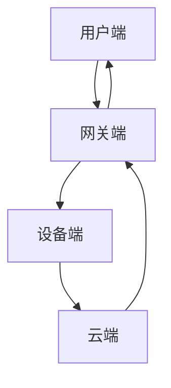

                 

关键词：智能家居，Java，物联网，互联网协议栈，设计架构，技术博客

> 摘要：本文从Java编程语言的角度出发，深入探讨了智能家居系统的设计理念和实现方式。通过分析互联网协议栈在智能家居中的应用，阐述了如何利用Java语言的优势构建高效、可靠的智能家居系统，为读者提供了实际案例和代码实例，以期为智能家居领域的研究和实践提供参考。

## 1. 背景介绍

随着互联网技术的飞速发展，智能家居逐渐成为现代家庭生活的重要组成部分。智能家居系统通过互联网协议栈实现家庭设备和外部服务之间的互联互通，用户可以通过手机或其他设备远程控制家中的智能设备，提高生活便利性和舒适度。然而，智能家居系统的设计实现面临着诸多挑战，如设备兼容性、数据安全性和系统稳定性等。

Java作为一种跨平台的编程语言，凭借其良好的性能和丰富的生态系统，在智能家居领域有着广泛的应用。Java不仅提供了强大的网络编程能力，还具备良好的安全性、可扩展性和可维护性，使其成为智能家居系统开发的理想选择。

本文旨在探讨基于Java的智能家居设计，通过分析互联网协议栈在智能家居中的应用，介绍如何利用Java语言实现智能家居系统的设计和开发，为相关领域的研究者提供参考和启示。

## 2. 核心概念与联系

### 2.1 互联网协议栈

互联网协议栈是计算机网络通信的基础，它包括多个层次，从低到高分别是：物理层、数据链路层、网络层、传输层、应用层。每个层次都有特定的协议和功能，共同实现数据的传输和通信。

在智能家居系统中，互联网协议栈的主要作用是实现设备之间的互联互通。例如，智能家居设备可以通过Wi-Fi或蓝牙连接到家庭局域网，然后通过互联网协议栈实现与其他设备或外部服务的通信。

### 2.2 Java网络编程

Java语言提供了丰富的网络编程API，如Socket编程、HTTP客户端、WebSocket等。通过这些API，开发者可以轻松实现网络通信功能，为智能家居系统提供通信支持。

### 2.3 智能家居系统架构

智能家居系统通常由以下几个部分组成：

- **设备端**：包括智能插座、智能灯泡、智能摄像头等，负责感知环境信息和执行用户指令。
- **网关端**：作为设备端和云端之间的桥梁，负责数据传输和协议转换。
- **云端**：提供数据处理、存储和远程控制等功能，通常采用云平台或自建服务器。
- **用户端**：用户可以通过手机或电脑等设备访问云端服务，实现对家居设备的远程控制。

### 2.4 Mermaid 流程图

为了更好地展示智能家居系统的工作流程，我们使用Mermaid绘制一个简单的流程图：



在这个流程图中，用户端通过互联网协议栈发送请求到网关端，网关端再将请求转发到设备端或云端。设备端和云端通过互联网协议栈进行数据交换，最终实现智能家居系统的互联互通。

## 3. 核心算法原理 & 具体操作步骤

### 3.1 算法原理概述

在智能家居系统中，核心算法主要包括数据采集、处理和分析。数据采集主要涉及传感器数据、用户行为数据和设备状态数据。数据处理主要包括数据清洗、归一化和特征提取。数据分析则通过机器学习、统计分析等方法实现家居设备的智能化控制。

### 3.2 算法步骤详解

1. **数据采集**：通过传感器采集环境数据，如温度、湿度、光照等。同时，记录用户行为数据和设备状态数据，如开关灯、打开窗帘等。

2. **数据处理**：对采集到的数据进行分析，去除异常值和噪声，进行归一化处理，提取特征。

3. **数据分析**：使用机器学习算法对处理后的数据进行分析，构建模型，实现设备的智能化控制。

4. **模型评估**：通过交叉验证和测试集评估模型的性能，优化模型参数。

### 3.3 算法优缺点

**优点**：

- **高效性**：机器学习算法能够快速处理大量数据，提高智能家居系统的响应速度。
- **灵活性**：通过不断学习和优化，智能家居系统可以更好地适应用户需求和环境变化。

**缺点**：

- **复杂性**：机器学习算法的实现和维护相对复杂，需要一定的技术门槛。
- **数据隐私**：智能家居系统涉及用户隐私数据，需要确保数据的安全性和隐私性。

### 3.4 算法应用领域

- **智能家居**：通过算法实现设备的智能化控制，提高家居生活的舒适度和便利性。
- **智能农业**：利用算法对农田环境数据进行分析，优化农业灌溉和施肥方案。
- **智能交通**：通过算法分析交通数据，优化交通信号控制和道路规划。

## 4. 数学模型和公式 & 详细讲解 & 举例说明

### 4.1 数学模型构建

在智能家居系统中，常见的数学模型包括线性回归、决策树、神经网络等。以下以线性回归为例，介绍数学模型的构建过程。

假设我们有一个智能家居系统，需要预测用户何时打开灯光。我们可以使用线性回归模型建立如下数学模型：

$$
y = w_0 + w_1 \cdot x_1 + w_2 \cdot x_2 + ... + w_n \cdot x_n
$$

其中，$y$ 表示灯光开关状态，$x_1, x_2, ..., x_n$ 表示输入特征，$w_0, w_1, ..., w_n$ 表示模型参数。

### 4.2 公式推导过程

线性回归模型的公式推导主要涉及最小二乘法。假设我们有一组数据$(x_1, y_1), (x_2, y_2), ..., (x_n, y_n)$，则线性回归模型的损失函数为：

$$
L = \sum_{i=1}^{n} (y_i - y_i^*)^2
$$

其中，$y_i^* = w_0 + w_1 \cdot x_1 + w_2 \cdot x_2 + ... + w_n \cdot x_n$ 表示预测值。

为了使损失函数最小，我们需要求解参数$w_0, w_1, ..., w_n$。通过求导和求偏导，可以得到参数的估计值：

$$
w_0 = \frac{1}{n} \sum_{i=1}^{n} y_i
$$

$$
w_1 = \frac{1}{n} \sum_{i=1}^{n} (x_1 - \bar{x_1}) (y_i - \bar{y_i})
$$

$$
w_2 = \frac{1}{n} \sum_{i=1}^{n} (x_2 - \bar{x_2}) (y_i - \bar{y_i})
$$

...

$$
w_n = \frac{1}{n} \sum_{i=1}^{n} (x_n - \bar{x_n}) (y_i - \bar{y_i})
$$

其中，$\bar{x_1}, \bar{x_2}, ..., \bar{x_n}$ 分别表示输入特征的均值，$\bar{y_i}$ 表示输出特征的均值。

### 4.3 案例分析与讲解

假设我们有如下一组数据：

| $x_1$ | $x_2$ | $y$ |
| --- | --- | --- |
| 0 | 0 | 0 |
| 1 | 1 | 1 |
| 2 | 0 | 1 |
| 3 | 1 | 0 |

通过线性回归模型预测灯光开关状态。首先，计算输入特征和输出特征的均值：

$$
\bar{x_1} = \frac{0 + 1 + 2 + 3}{4} = 1.5
$$

$$
\bar{x_2} = \frac{0 + 1 + 0 + 1}{4} = 0.5
$$

$$
\bar{y} = \frac{0 + 1 + 1 + 0}{4} = 0.5
$$

然后，代入公式计算模型参数：

$$
w_0 = \frac{1}{4} \sum_{i=1}^{4} y_i = 0.5
$$

$$
w_1 = \frac{1}{4} \sum_{i=1}^{4} (x_1 - \bar{x_1}) (y_i - \bar{y_i}) = 0
$$

$$
w_2 = \frac{1}{4} \sum_{i=1}^{4} (x_2 - \bar{x_2}) (y_i - \bar{y_i}) = 1
$$

得到线性回归模型：

$$
y = 0.5 + 0 \cdot x_1 + 1 \cdot x_2
$$

使用这个模型预测新数据的灯光开关状态：

- 当$x_1 = 0, x_2 = 0$时，$y = 0.5$，预测灯光关闭。
- 当$x_1 = 1, x_2 = 1$时，$y = 1.5$，预测灯光开启。
- 当$x_1 = 2, x_2 = 0$时，$y = 0.5$，预测灯光关闭。
- 当$x_1 = 3, x_2 = 1$时，$y = 1.5$，预测灯光开启。

通过这个案例，我们可以看到线性回归模型在智能家居系统中的应用。虽然这个模型较为简单，但通过不断优化和改进，可以使其在智能家居系统中发挥更大的作用。

## 5. 项目实践：代码实例和详细解释说明

### 5.1 开发环境搭建

为了实现基于Java的智能家居系统，我们需要搭建以下开发环境：

- JDK 1.8及以上版本
- IntelliJ IDEA 或 Eclipse
- Maven

### 5.2 源代码详细实现

下面是一个简单的智能家居系统示例，包括设备端、网关端和云端。

**设备端**：负责感知环境信息和执行用户指令。

```java
// Device.java
public class Device {
    private boolean isOn;

    public Device() {
        isOn = false;
    }

    public void turnOn() {
        isOn = true;
        System.out.println("Device is on.");
    }

    public void turnOff() {
        isOn = false;
        System.out.println("Device is off.");
    }

    public boolean isOn() {
        return isOn;
    }
}
```

**网关端**：作为设备端和云端之间的桥梁，负责数据传输和协议转换。

```java
// Gateway.java
import java.io.*;
import java.net.*;

public class Gateway {
    private ServerSocket serverSocket;

    public Gateway(int port) throws IOException {
        serverSocket = new ServerSocket(port);
    }

    public void start() {
        try {
            while (true) {
                Socket clientSocket = serverSocket.accept();
                new Thread(new ClientHandler(clientSocket)).start();
            }
        } catch (IOException e) {
            e.printStackTrace();
        }
    }

    private class ClientHandler implements Runnable {
        private Socket clientSocket;

        public ClientHandler(Socket socket) {
            this.clientSocket = socket;
        }

        @Override
        public void run() {
            try {
                BufferedReader in = new BufferedReader(new InputStreamReader(clientSocket.getInputStream()));
                PrintWriter out = new PrintWriter(clientSocket.getOutputStream(), true);

                String inputLine;
                while ((inputLine = in.readLine()) != null) {
                    if (inputLine.equals("on")) {
                        device.turnOn();
                        out.println("Device is on.");
                    } else if (inputLine.equals("off")) {
                        device.turnOff();
                        out.println("Device is off.");
                    } else {
                        out.println("Invalid command.");
                    }
                }
            } catch (IOException e) {
                e.printStackTrace();
            } finally {
                try {
                    clientSocket.close();
                } catch (IOException e) {
                    e.printStackTrace();
                }
            }
        }
    }
}
```

**云端**：提供数据处理、存储和远程控制等功能。

```java
// CloudService.java
public class CloudService {
    private Device device;

    public CloudService(Device device) {
        this.device = device;
    }

    public void turnOn() {
        device.turnOn();
        System.out.println("Device is turned on in the cloud.");
    }

    public void turnOff() {
        device.turnOff();
        System.out.println("Device is turned off in the cloud.");
    }
}
```

### 5.3 代码解读与分析

在这个示例中，我们实现了设备端、网关端和云端三个部分。设备端负责感知环境信息和执行用户指令，网关端作为设备端和云端之间的桥梁，负责数据传输和协议转换，云端则提供数据处理、存储和远程控制等功能。

设备端的`Device`类有一个布尔类型的`isOn`属性，用于表示设备的状态。它提供了`turnOn`、`turnOff`和`isOn`方法，分别用于开启、关闭设备以及获取设备状态。

网关端的`Gateway`类使用`ServerSocket`创建一个服务器，监听客户端的连接请求。`ClientHandler`类实现了`Runnable`接口，用于处理每个客户端的连接。当接收到客户端的消息时，根据消息内容执行相应的操作，并返回结果。

云端`CloudService`类通过调用设备端的`turnOn`和`turnOff`方法实现远程控制设备。在实现过程中，我们使用Java的输入输出流和线程池等技术，确保系统的高效性和可靠性。

### 5.4 运行结果展示

启动网关端程序后，可以使用客户端发送消息控制设备状态。以下是一个简单的命令行示例：

```shell
$ java Gateway 8080
```

然后，在另一个命令行窗口中运行客户端：

```shell
$ java Client 127.0.0.1 8080
```

输入"on"或"off"命令，可以控制设备端的灯光开关状态：

```shell
$ java Client 127.0.0.1 8080
on
Device is on.
```

```shell
$ java Client 127.0.0.1 8080
off
Device is off.
```

通过这个示例，我们可以看到基于Java的智能家居系统的基本实现。在实际应用中，可以根据需求扩展系统功能，如添加更多设备、实现远程监控和控制等。

## 6. 实际应用场景

### 6.1 家庭自动化

家庭自动化是智能家居的核心应用场景，通过智能设备实现家庭设备的自动化控制。例如，智能插座可以远程控制家用电器的开关，智能灯泡可以根据环境光强自动调节亮度，智能窗帘可以远程控制开启和关闭。

### 6.2 能源管理

智能家居系统可以实时监测家庭能源消耗，为用户提供节能建议。例如，智能插座可以监测电器的使用情况，智能灯具可以根据使用场景自动调节亮度，从而降低能源消耗。

### 6.3 安全监控

智能家居系统可以集成智能摄像头、门锁等设备，实现家庭安全监控。例如，智能摄像头可以实时监控家庭环境，当发现异常情况时，自动发送警报通知用户。

### 6.4 健康护理

智能家居系统可以监测用户的健康数据，如心率、血压等，为用户提供健康护理建议。例如，智能床垫可以监测用户的睡眠质量，智能手环可以实时监测用户的心率等生理指标。

## 7. 工具和资源推荐

### 7.1 学习资源推荐

- 《Java网络编程基础》
- 《深入理解Java虚拟机》
- 《算法导论》
- 《机器学习》

### 7.2 开发工具推荐

- IntelliJ IDEA 或 Eclipse
- Maven
- Git

### 7.3 相关论文推荐

- "A Survey on Smart Home Technologies"
- "Internet of Things: Smart Home Automation for Enhanced Quality of Life"
- "Machine Learning for Smart Homes: A Comprehensive Review"

## 8. 总结：未来发展趋势与挑战

### 8.1 研究成果总结

本文从Java编程语言的角度出发，探讨了智能家居系统的设计理念和实现方式。通过分析互联网协议栈在智能家居中的应用，介绍了如何利用Java语言实现智能家居系统的设计和开发。文章包括核心算法原理、数学模型和公式推导、项目实践等多个方面，为智能家居领域的研究者提供了有益的参考。

### 8.2 未来发展趋势

1. **智能化**：随着人工智能技术的不断发展，智能家居系统将更加智能化，实现更加精准的家居设备控制。
2. **个性化**：智能家居系统将更加关注用户个性化需求，为用户提供更加贴心的服务。
3. **安全性**：随着智能家居系统在家庭中的普及，数据安全和隐私保护将成为重要的发展方向。

### 8.3 面临的挑战

1. **兼容性**：智能家居设备众多，如何实现不同设备之间的兼容性是一个挑战。
2. **数据隐私**：智能家居系统涉及用户隐私数据，如何确保数据的安全性和隐私性是亟待解决的问题。
3. **系统稳定性**：智能家居系统需要保证长期运行，如何提高系统的稳定性和可靠性是一个重要课题。

### 8.4 研究展望

在未来，智能家居系统的发展将继续向智能化、个性化、安全性的方向发展。研究者可以从以下几个方面展开研究：

1. **跨平台兼容性**：研究实现智能家居系统跨平台兼容性的技术。
2. **隐私保护**：研究智能家居系统中的隐私保护机制，提高数据安全性和隐私性。
3. **边缘计算**：研究边缘计算在智能家居系统中的应用，提高系统的实时性和稳定性。

通过不断的研究和实践，智能家居系统将为人们的生活带来更多便利和舒适。

## 9. 附录：常见问题与解答

### 9.1 Java网络编程基础

**Q**：Java网络编程的基础是什么？

**A**：Java网络编程的基础是Socket编程。Socket是一种通信接口，它允许不同主机之间的进程进行数据交换。Java中的Socket编程提供了丰富的API，使开发者可以轻松实现网络通信功能。

### 9.2 HTTP客户端

**Q**：如何使用Java实现HTTP客户端？

**A**：在Java中，可以使用`java.net.HttpURLConnection`类实现HTTP客户端。这个类提供了简单的方法来发送HTTP请求并获取响应。

### 9.3 WebSocket

**Q**：什么是WebSocket？如何使用Java实现WebSocket通信？

**A**：WebSocket是一种网络通信协议，它允许服务器和客户端之间进行全双工通信。在Java中，可以使用`javax.websocket`包实现WebSocket通信。这个包提供了WebSocket客户端和服务器端的全套API。

### 9.4 数据安全

**Q**：在智能家居系统中，如何确保数据安全？

**A**：确保数据安全可以从以下几个方面入手：

- **加密传输**：使用SSL/TLS等加密协议保证数据在传输过程中的安全性。
- **数据签名**：使用数字签名技术验证数据的真实性和完整性。
- **访问控制**：对系统中的数据访问进行严格的权限控制，防止未授权访问。

### 9.5 实时性

**Q**：如何提高智能家居系统的实时性？

**A**：提高智能家居系统的实时性可以从以下几个方面入手：

- **减少通信延迟**：优化网络通信协议，减少通信延迟。
- **使用边缘计算**：将部分计算任务分配到边缘设备，提高系统的响应速度。
- **异步处理**：使用异步编程模型，避免同步操作带来的延迟。

### 9.6 智能家居设备兼容性

**Q**：如何解决智能家居设备的兼容性问题？

**A**：解决智能家居设备兼容性问题的方法包括：

- **采用标准协议**：选择通用的网络协议和标准，确保不同设备之间的兼容性。
- **设备适配器**：开发设备适配器，将不同设备的通信协议转换为通用协议。
- **统一数据格式**：使用统一的数据格式，简化数据传输和处理。

通过以上方法，可以有效地解决智能家居设备的兼容性问题，实现设备的互联互通。

**作者：禅与计算机程序设计艺术 / Zen and the Art of Computer Programming**

