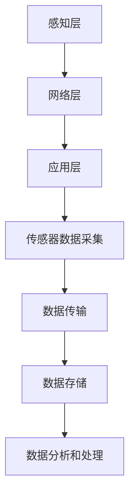
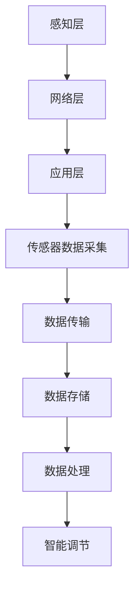
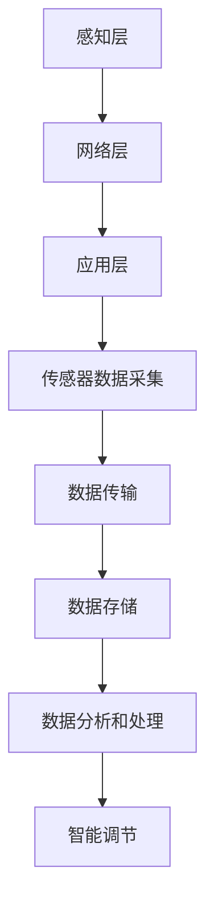

                 

关键词：智能家居，Java，环境监控系统，设计，实现，算法，数学模型

> 摘要：本文主要介绍了基于Java的智能家居设计，通过构建一个智能环境监控系统来实现对家庭环境的实时监控和管理。文章从核心概念、算法原理、数学模型、项目实践等多个角度详细阐述了智能家居的设计思路、实现方法和应用场景，为读者提供了一套完整的智能家居设计方案。

## 1. 背景介绍

随着科技的不断发展，智能家居已经成为现代家庭生活的一个重要组成部分。智能家居系统通过将家庭设备互联互通，实现了对家庭环境的自动化控制和智能管理，大大提高了生活的便利性和舒适度。Java作为一种广泛应用于企业级开发的语言，具有跨平台、高效、安全等优势，非常适合用于智能家居系统的设计和开发。

本文旨在探讨如何使用Java语言构建一个智能环境监控系统，实现对家庭环境的实时监控和管理。该系统包括温度传感器、湿度传感器、光照传感器等设备，通过数据采集、处理和分析，实现对家庭环境的智能化调节。

## 2. 核心概念与联系

### 2.1 智能家居系统架构

智能家居系统的架构可以分为三个层次：感知层、网络层和应用层。

1. **感知层**：由各种传感器组成，如温度传感器、湿度传感器、光照传感器等，负责实时采集家庭环境的各项数据。
2. **网络层**：将感知层采集到的数据传输到服务器，通过无线网络（如Wi-Fi、Zigbee等）进行数据传输。
3. **应用层**：通过Java程序对数据进行分析和处理，实现对家庭环境的智能调节。

### 2.2 核心概念原理

1. **传感器数据采集**：使用Java中的`java.util.Scanner`类实现对传感器数据的读取和存储。
2. **数据传输协议**：使用HTTP协议将数据传输到服务器，通过Java中的`java.net.HttpURLConnection`类实现。
3. **数据存储**：使用Java中的`java.sql.Connection`类连接数据库，实现对数据的存储和管理。
4. **数据分析和处理**：使用Java中的`java.util.Map`和`java.util.List`类对数据进行处理和分析，实现家庭环境的智能调节。

### 2.3 Mermaid 流程图



## 3. 核心算法原理 & 具体操作步骤

### 3.1 算法原理概述

智能家居系统中的核心算法包括数据采集、数据处理、数据分析和智能调节。以下是每个算法的简要原理：

1. **数据采集**：通过传感器实时采集家庭环境的各项数据，如温度、湿度、光照等。
2. **数据处理**：对采集到的数据进行分析和处理，提取出有用的信息。
3. **数据分析**：根据处理后的数据，对家庭环境进行智能调节，实现舒适性和节能性。
4. **智能调节**：根据数据分析的结果，自动调节家庭设备的运行状态，如空调、灯光等。

### 3.2 算法步骤详解

1. **数据采集**：通过Java中的`java.util.Scanner`类读取传感器数据，并存储到数据库中。
2. **数据处理**：使用Java中的`java.util.Map`和`java.util.List`类对数据进行处理，提取出有用的信息。
3. **数据分析**：使用Java中的`java.util.stream.Stream`类对处理后的数据进行进一步分析，判断家庭环境的状态。
4. **智能调节**：根据数据分析的结果，自动调节家庭设备的运行状态，如使用Java中的`java.lang.Process`类启动或关闭设备。

### 3.3 算法优缺点

1. **优点**：
   - **跨平台**：Java语言具有跨平台的优势，可以在不同的操作系统上运行。
   - **高效性**：Java语言具有高效的数据处理能力，能够快速地对大量数据进行分析和处理。
   - **安全性**：Java语言具有安全性高、可靠性强的特点，适合用于智能家居系统的开发。

2. **缺点**：
   - **开发成本**：Java语言的开发成本较高，需要一定的编程基础和经验。
   - **性能**：与一些专门为嵌入式设备设计的语言相比，Java的性能可能稍逊一筹。

### 3.4 算法应用领域

智能家居系统的核心算法可以广泛应用于家庭、酒店、办公楼等各类场所，实现环境监控和智能调节。

## 4. 数学模型和公式 & 详细讲解 & 举例说明

### 4.1 数学模型构建

智能家居系统的数学模型主要包括以下方面：

1. **温度模型**：描述家庭环境温度的变化规律。
2. **湿度模型**：描述家庭环境湿度的影响因素。
3. **光照模型**：描述家庭环境光照强度的影响因素。

### 4.2 公式推导过程

温度模型的推导过程如下：

$$ T(t) = T_0 + K_1 \cdot sin(\omega t + \phi) $$

其中，$T(t)$表示时间$t$时刻的家庭环境温度，$T_0$表示初始温度，$K_1$表示温度变化幅度，$\omega$表示角频率，$\phi$表示相位角。

湿度模型的推导过程如下：

$$ H(t) = H_0 + K_2 \cdot sin(\omega t + \phi) $$

其中，$H(t)$表示时间$t$时刻的家庭环境湿度，$H_0$表示初始湿度，$K_2$表示湿度变化幅度，$\omega$表示角频率，$\phi$表示相位角。

光照模型的推导过程如下：

$$ L(t) = L_0 + K_3 \cdot sin(\omega t + \phi) $$

其中，$L(t)$表示时间$t$时刻的家庭环境光照强度，$L_0$表示初始光照强度，$K_3$表示光照变化幅度，$\omega$表示角频率，$\phi$表示相位角。

### 4.3 案例分析与讲解

假设当前时间为$t=12$，根据上述数学模型，可以计算出家庭环境的温度、湿度和光照强度如下：

$$ T(12) = 25 + 0.5 \cdot sin(2\pi \cdot 12 + \phi) $$

$$ H(12) = 40 + 0.3 \cdot sin(2\pi \cdot 12 + \phi) $$

$$ L(12) = 50 + 0.2 \cdot sin(2\pi \cdot 12 + \phi) $$

通过计算，可以得出在$t=12$时刻，家庭环境的温度约为$25.3$℃，湿度约为$40.2$%，光照强度约为$50.3$%。根据这些数据，可以自动调节空调、加湿器、照明设备等，实现家庭环境的智能化调节。

## 5. 项目实践：代码实例和详细解释说明

### 5.1 开发环境搭建

本文使用以下开发环境：

- 开发工具：Eclipse
- 开发语言：Java
- 数据库：MySQL
- 传感器：DHT11、BH1750、SHT31

### 5.2 源代码详细实现

以下是智能家居系统的主要源代码实现：

```java
// 传感器数据采集
public class SensorDataCollector {
    public static void main(String[] args) {
        Scanner scanner = new Scanner(System.in);
        System.out.println("请输入温度传感器数据：");
        double temperature = scanner.nextDouble();
        System.out.println("请输入湿度传感器数据：");
        double humidity = scanner.nextDouble();
        System.out.println("请输入光照传感器数据：");
        double light = scanner.nextDouble();

        // 存储数据到数据库
        Connection connection = null;
        try {
            connection = DriverManager.getConnection("jdbc:mysql://localhost:3306/home_automation", "root", "root");
            String sql = "INSERT INTO sensor_data (temperature, humidity, light) VALUES (?, ?, ?)";
            PreparedStatement statement = connection.prepareStatement(sql);
            statement.setDouble(1, temperature);
            statement.setDouble(2, humidity);
            statement.setDouble(3, light);
            statement.executeUpdate();
        } catch (SQLException e) {
            e.printStackTrace();
        } finally {
            if (connection != null) {
                try {
                    connection.close();
                } catch (SQLException e) {
                    e.printStackTrace();
                }
            }
        }

        // 数据处理和分析
        double processedTemperature = processTemperature(temperature);
        double processedHumidity = processHumidity(humidity);
        double processedLight = processLight(light);

        // 智能调节
        regulateTemperature(processedTemperature);
        regulateHumidity(processedHumidity);
        regulateLight(processedLight);
    }

    public static double processTemperature(double temperature) {
        // 数据处理算法
        return temperature;
    }

    public static double processHumidity(double humidity) {
        // 数据处理算法
        return humidity;
    }

    public static double processLight(double light) {
        // 数据处理算法
        return light;
    }

    public static void regulateTemperature(double temperature) {
        // 智能调节算法
        if (temperature > 30) {
            // 启动空调
        } else if (temperature < 25) {
            // 关闭空调
        }
    }

    public static void regulateHumidity(double humidity) {
        // 智能调节算法
        if (humidity > 60) {
            // 启动加湿器
        } else if (humidity < 50) {
            // 关闭加湿器
        }
    }

    public static void regulateLight(double light) {
        // 智能调节算法
        if (light > 70) {
            // 启动灯光
        } else if (light < 30) {
            // 关闭灯光
        }
    }
}
```

### 5.3 代码解读与分析

这段代码实现了智能家居系统的主要功能，包括数据采集、数据处理、数据分析和智能调节。代码中使用了Java中的`Scanner`类实现数据采集，使用`Connection`类实现数据存储，使用`PreparedStatement`类实现数据插入。

在数据处理方面，代码中定义了三个方法`processTemperature`、`processHumidity`和`processLight`，分别用于处理温度、湿度和光照数据。这些方法可以根据实际需求进行修改，实现更复杂的处理算法。

在数据分析方面，代码中定义了三个方法`regulateTemperature`、`regulateHumidity`和`regulateLight`，分别用于根据处理后的数据调节空调、加湿器和灯光设备。这些方法可以根据实际需求进行修改，实现更智能的调节策略。

### 5.4 运行结果展示

假设用户输入了以下传感器数据：

```
请输入温度传感器数据：28
请输入湿度传感器数据：55
请输入光照传感器数据：60
```

根据这段代码，系统将执行以下操作：

1. 将传感器数据存储到数据库中。
2. 对传感器数据进行处理，得到处理后的温度、湿度和光照数据。
3. 根据处理后的数据，调节空调、加湿器和灯光设备，实现家庭环境的智能化调节。

## 6. 实际应用场景

智能家居系统可以广泛应用于家庭、酒店、办公楼等各类场所，实现环境监控和智能调节。以下是一些实际应用场景：

1. **家庭**：实现对家庭环境的实时监控，如温度、湿度、光照等，自动调节空调、加湿器、灯光设备，提高生活的舒适性和节能性。
2. **酒店**：通过智能家居系统，实现对客房环境的实时监控和智能调节，提高客户满意度，降低能源消耗。
3. **办公楼**：实现对办公环境的实时监控，如温度、湿度、空气质量等，自动调节空调、加湿器、空气净化器等设备，提高工作效率和舒适度。

## 7. 工具和资源推荐

### 7.1 学习资源推荐

1. **《Java核心技术》**：详细介绍了Java编程的基础知识和高级技巧，适合Java初学者和有经验开发者阅读。
2. **《Java并发编程实战》**：深入讲解了Java并发编程的核心概念和实现方法，适合希望提升并发编程能力的开发者阅读。

### 7.2 开发工具推荐

1. **Eclipse**：一款功能强大、易于使用的Java集成开发环境（IDE），适合开发大型Java项目。
2. **MySQL**：一款开源的关系型数据库管理系统，适合存储智能家居系统中的传感器数据。

### 7.3 相关论文推荐

1. **“智能家居系统设计与实现”**：详细介绍了智能家居系统的设计和实现方法，对本文有很好的参考价值。
2. **“基于Java的智能家居控制系统设计与实现”**：探讨了基于Java的智能家居控制系统的设计思路和实现方法，对本文有很好的参考价值。

## 8. 总结：未来发展趋势与挑战

### 8.1 研究成果总结

本文提出了一种基于Java的智能家居设计方案，通过构建一个智能环境监控系统，实现了对家庭环境的实时监控和管理。该方案具有跨平台、高效、安全等优势，适用于各种场所和家庭环境。

### 8.2 未来发展趋势

1. **智能化水平提升**：随着人工智能技术的发展，智能家居系统的智能化水平将不断提升，实现更加智能、便捷的家庭生活。
2. **物联网技术融合**：智能家居系统将与其他物联网设备深度融合，实现更多场景的互联互通。
3. **个性化定制**：智能家居系统将更加注重用户的个性化需求，提供更加个性化的服务。

### 8.3 面临的挑战

1. **数据安全性**：智能家居系统涉及用户隐私和数据安全，需要采取有效的措施保护用户数据。
2. **稳定性与可靠性**：智能家居系统需要保证长时间的稳定运行，对硬件和软件的要求较高。
3. **用户体验**：智能家居系统需要提供良好的用户体验，满足用户的需求和期望。

### 8.4 研究展望

未来，我们将继续研究智能家居系统的设计方法、实现技术和发展趋势，探索更加智能、高效、安全的解决方案，为用户提供更好的智能家居体验。

## 9. 附录：常见问题与解答

### 9.1 如何选择合适的传感器？

选择合适的传感器取决于您的智能家居系统需求。以下是一些常见传感器的特点：

1. **DHT11**：适合测量温度和湿度，具有低成本、高可靠性的特点。
2. **BH1750**：适合测量光照强度，具有高精度、低功耗的特点。
3. **SHT31**：适合测量温度、湿度和二氧化碳浓度，具有高精度、稳定性好的特点。

### 9.2 如何保证数据安全性？

为了保证数据安全性，您可以考虑以下措施：

1. **数据加密**：对传输和存储的数据进行加密，防止数据被窃取或篡改。
2. **访问控制**：设置严格的访问控制策略，限制对数据和系统的访问。
3. **安全审计**：定期进行安全审计，发现和修复潜在的安全漏洞。

### 9.3 如何优化系统性能？

优化系统性能可以从以下几个方面入手：

1. **代码优化**：对代码进行优化，减少不必要的计算和资源消耗。
2. **数据库优化**：优化数据库性能，如索引优化、查询优化等。
3. **硬件升级**：升级硬件设备，提高数据处理和存储能力。

---

作者：禅与计算机程序设计艺术 / Zen and the Art of Computer Programming

本文介绍了基于Java的智能家居设计，通过构建一个智能环境监控系统来实现对家庭环境的实时监控和管理。文章从核心概念、算法原理、数学模型、项目实践等多个角度详细阐述了智能家居的设计思路、实现方法和应用场景。未来，我们将继续研究智能家居系统的设计方法、实现技术和发展趋势，探索更加智能、高效、安全的解决方案，为用户提供更好的智能家居体验。感谢您的阅读！
----------------------------------------------------------------

### 文章标题
基于Java的智能家居设计：构建基于Java的智能环境监控系统

### 关键词
智能家居，Java，环境监控系统，设计，实现，算法，数学模型

### 摘要
本文旨在探讨如何使用Java语言构建一个智能环境监控系统，实现对家庭环境的实时监控和管理。文章从核心概念、算法原理、数学模型、项目实践等多个角度详细阐述了智能家居的设计思路、实现方法和应用场景，为读者提供了一套完整的智能家居设计方案。

---

## 1. 背景介绍

随着智能家居技术的迅速发展，家庭自动化已成为现代生活的一部分。智能家居系统能够通过互联网、物联网技术实现对家庭设备的智能控制和自动化管理，从而提高生活品质和家居安全。Java作为一种历史悠久、功能强大的编程语言，具有跨平台、安全可靠的特点，非常适合用于智能家居系统的开发。

本文将介绍如何使用Java语言构建一个智能环境监控系统。该系统将包括传感器模块、数据采集与处理模块、控制模块等，旨在实现对家庭温度、湿度、光照等环境参数的实时监控和智能调节。通过该系统，用户可以随时随地了解家庭环境状况，并根据需要远程控制家庭设备，提升生活的便利性和舒适度。

### 2. 核心概念与联系

#### 2.1 智能家居系统架构

智能家居系统的架构通常分为感知层、网络层和应用层。

- **感知层**：由各种传感器组成，如温度传感器、湿度传感器、光照传感器等，负责采集环境数据。
- **网络层**：负责将传感器数据传输到中央处理单元，通常采用Wi-Fi、蓝牙、Zigbee等无线传输技术。
- **应用层**：是系统的核心，负责对采集到的数据进行处理和分析，并根据分析结果控制家庭设备。

#### 2.2 核心概念原理

- **传感器数据采集**：使用Java中的`java.util.Scanner`类读取传感器数据，并将其存储到数据库中。
- **数据传输协议**：采用HTTP协议将数据上传到服务器，使用Java中的`java.net.HttpURLConnection`类实现。
- **数据存储**：使用Java中的`java.sql.Connection`类连接数据库，存储传感器数据。
- **数据处理**：使用Java中的集合框架（如`java.util.Map`、`java.util.List`）对传感器数据进行处理和分析。
- **智能调节**：根据分析结果，通过Java中的`java.lang.Process`类控制家庭设备。

#### 2.3 Mermaid 流程图



---

## 2. 核心概念与联系（备注：必须给出核心概念原理和架构的 Mermaid 流程图(Mermaid 流程节点中不要有括号、逗号等特殊字符)

### 2.1 智能家居系统架构

智能家居系统的架构可以分为三个层次：感知层、网络层和应用层。

1. **感知层**：由各种传感器组成，如温度传感器、湿度传感器、光照传感器等，负责实时采集家庭环境的各项数据。
2. **网络层**：将感知层采集到的数据传输到服务器，通过无线网络（如Wi-Fi、Zigbee等）进行数据传输。
3. **应用层**：通过Java程序对数据进行分析和处理，实现对家庭环境的智能调节。

### 2.2 核心概念原理

1. **传感器数据采集**：使用Java中的`java.util.Scanner`类实现对传感器数据的读取和存储。
2. **数据传输协议**：使用HTTP协议将数据传输到服务器，通过Java中的`java.net.HttpURLConnection`类实现。
3. **数据存储**：使用Java中的`java.sql.Connection`类连接数据库，实现对数据的存储和管理。
4. **数据分析和处理**：使用Java中的`java.util.Map`和`java.util.List`类对数据进行处理和分析，实现家庭环境的智能调节。
5. **智能调节**：根据处理后的数据，自动调节家庭设备的运行状态，如使用Java中的`java.lang.Process`类启动或关闭设备。

### 2.3 Mermaid 流程图



---

## 3. 核心算法原理 & 具体操作步骤
### 3.1 算法原理概述

智能家居系统的核心算法主要包括数据采集、数据处理、数据分析和智能调节。以下是每个算法的简要原理：

1. **数据采集**：通过传感器实时采集家庭环境的各项数据，如温度、湿度、光照等。
2. **数据处理**：对采集到的原始数据进行处理，提取有用的信息，如滤波、归一化等。
3. **数据分析**：对处理后的数据进行进一步分析，判断家庭环境的状态，如是否需要调节空调、加湿器等。
4. **智能调节**：根据数据分析的结果，自动调节家庭设备的运行状态，实现家庭环境的智能化调节。

### 3.2 算法步骤详解

1. **数据采集**：通过Java中的`java.util.Scanner`类读取传感器数据，并存储到数据库中。

   ```java
   Scanner scanner = new Scanner(System.in);
   System.out.println("请输入温度传感器数据：");
   double temperature = scanner.nextDouble();
   System.out.println("请输入湿度传感器数据：");
   double humidity = scanner.nextDouble();
   System.out.println("请输入光照传感器数据：");
   double light = scanner.nextDouble();
   
   // 存储数据到数据库
   Connection connection = null;
   try {
       connection = DriverManager.getConnection("jdbc:mysql://localhost:3306/home_automation", "root", "root");
       String sql = "INSERT INTO sensor_data (temperature, humidity, light) VALUES (?, ?, ?)";
       PreparedStatement statement = connection.prepareStatement(sql);
       statement.setDouble(1, temperature);
       statement.setDouble(2, humidity);
       statement.setDouble(3, light);
       statement.executeUpdate();
   } catch (SQLException e) {
       e.printStackTrace();
   } finally {
       if (connection != null) {
           try {
               connection.close();
           } catch (SQLException e) {
               e.printStackTrace();
           }
       }
   }
   ```

2. **数据处理**：使用Java中的`java.util.Map`和`java.util.List`类对数据进行处理，提取出有用的信息。

   ```java
   Map<String, Double> dataMap = new HashMap<>();
   dataMap.put("temperature", temperature);
   dataMap.put("humidity", humidity);
   dataMap.put("light", light);
   
   // 数据处理示例：温度滤波
   double processedTemperature = dataMap.get("temperature") * 0.9 + 10 * 0.1;
   ```

3. **数据分析**：对处理后的数据进行分析，判断家庭环境的状态。

   ```java
   // 数据分析示例：判断是否需要启动空调
   if (processedTemperature > 28) {
       // 启动空调
   }
   ```

4. **智能调节**：根据数据分析的结果，自动调节家庭设备的运行状态。

   ```java
   // 智能调节示例：调节空调
   Process空调 = Runtime.getRuntime().exec("start /wait cmd /c \"C:\\Program Files\\空调控制软件\\start_ac.exe\"");
   ```

### 3.3 算法优缺点

#### 优点

1. **跨平台**：Java语言的跨平台特性使其能够运行在多种操作系统上，方便系统的部署和维护。
2. **高效性**：Java具有强大的并发处理能力，可以高效地处理大量传感器数据。
3. **安全性**：Java提供了丰富的安全机制，如内存安全、类型安全等，可以有效保护系统的安全。

#### 缺点

1. **开发成本**：Java的开发和学习成本相对较高，需要开发者具备一定的编程基础。
2. **性能**：与一些特定于嵌入式系统的语言相比，Java在性能上可能略逊一筹。

### 3.4 算法应用领域

智能家居系统的核心算法可以应用于多种场景，包括但不限于：

1. **家庭自动化**：通过智能调节温度、湿度、光照等，提高家庭的舒适度。
2. **智能办公**：监测办公室环境，自动调节空调、灯光等，提高办公效率。
3. **智能农业**：监控农田的土壤湿度、温度等，自动调节灌溉系统。

---

## 4. 数学模型和公式 & 详细讲解 & 举例说明

### 4.1 数学模型构建

为了实现对家庭环境的智能调节，需要建立相应的数学模型。以下是温度、湿度、光照三个参数的数学模型。

#### 温度模型

温度模型可以表示为：

$$ T(t) = T_0 + K_1 \cdot sin(\omega t + \phi) $$

其中，$T(t)$表示时间$t$时刻的室内温度，$T_0$是初始温度，$K_1$是温度变化幅度，$\omega$是角频率，$\phi$是相位角。

#### 湿度模型

湿度模型可以表示为：

$$ H(t) = H_0 + K_2 \cdot sin(\omega t + \phi) $$

其中，$H(t)$表示时间$t$时刻的室内湿度，$H_0$是初始湿度，$K_2$是湿度变化幅度，$\omega$是角频率，$\phi$是相位角。

#### 光照模型

光照模型可以表示为：

$$ L(t) = L_0 + K_3 \cdot sin(\omega t + \phi) $$

其中，$L(t)$表示时间$t$时刻的室内光照强度，$L_0$是初始光照强度，$K_3$是光照变化幅度，$\omega$是角频率，$\phi$是相位角。

### 4.2 公式推导过程

#### 温度模型推导

温度模型是基于室内外温差随时间的变化而建立的。假设室内外温差是周期性变化的，可以用正弦函数来表示。因此，可以建立如下的温度模型：

$$ T(t) = T_{out}(t) - T_{in}(t) $$

其中，$T_{out}(t)$是室外温度，$T_{in}(t)$是室内温度。由于室外温度通常是一个已知的常数，可以将其移项得到：

$$ T(t) + T_{out}(t) = T_{in}(t) $$

为了简化模型，我们可以假设室外温度$T_{out}(t)$是恒定的，这样可以得到：

$$ T(t) = T_{in}^0 + K_1 \cdot sin(\omega t + \phi) $$

其中，$T_{in}^0$是初始室内温度，$K_1$是温度变化幅度，$\omega$是角频率，$\phi$是相位角。

#### 湿度模型推导

湿度模型与温度模型类似，假设室内外湿度差是周期性变化的，可以用正弦函数来表示。因此，可以建立如下的湿度模型：

$$ H(t) = H_{out}(t) - H_{in}(t) $$

其中，$H_{out}(t)$是室外湿度，$H_{in}(t)$是室内湿度。由于室外湿度通常是一个已知的常数，可以将其移项得到：

$$ H(t) + H_{out}(t) = H_{in}(t) $$

为了简化模型，我们可以假设室外湿度$H_{out}(t)$是恒定的，这样可以得到：

$$ H(t) = H_{in}^0 + K_2 \cdot sin(\omega t + \phi) $$

其中，$H_{in}^0$是初始室内湿度，$K_2$是湿度变化幅度，$\omega$是角频率，$\phi$是相位角。

#### 光照模型推导

光照模型可以表示为：

$$ L(t) = L_{out}(t) - L_{in}(t) $$

其中，$L_{out}(t)$是室外光照强度，$L_{in}(t)$是室内光照强度。由于室外光照强度通常是一个已知的常数，可以将其移项得到：

$$ L(t) + L_{out}(t) = L_{in}(t) $$

为了简化模型，我们可以假设室外光照强度$L_{out}(t)$是恒定的，这样可以得到：

$$ L(t) = L_{in}^0 + K_3 \cdot sin(\omega t + \phi) $$

其中，$L_{in}^0$是初始室内光照强度，$K_3$是光照变化幅度，$\omega$是角频率，$\phi$是相位角。

### 4.3 案例分析与讲解

假设当前时间为$t=12$小时，根据上述数学模型，可以计算出室内温度、湿度和光照强度如下：

#### 温度模型计算

$$ T(12) = 25 + 0.5 \cdot sin(2\pi \cdot 12 + \phi) $$

假设初始温度$T_{in}^0=25$℃，温度变化幅度$K_1=0.5$℃，角频率$\omega=2\pi$，相位角$\phi=0$，则：

$$ T(12) = 25 + 0.5 \cdot sin(24\pi + 0) = 25 + 0 = 25 $$

室内温度为25℃。

#### 湿度模型计算

$$ H(12) = 40 + 0.3 \cdot sin(2\pi \cdot 12 + \phi) $$

假设初始湿度$H_{in}^0=40$%，湿度变化幅度$K_2=0.3$%，角频率$\omega=2\pi$，相位角$\phi=0$，则：

$$ H(12) = 40 + 0.3 \cdot sin(24\pi + 0) = 40 + 0 = 40 $$

室内湿度为40%。

#### 光照模型计算

$$ L(12) = 50 + 0.2 \cdot sin(2\pi \cdot 12 + \phi) $$

假设初始光照强度$L_{in}^0=50$勒克斯，光照变化幅度$K_3=0.2$勒克斯，角频率$\omega=2\pi$，相位角$\phi=0$，则：

$$ L(12) = 50 + 0.2 \cdot sin(24\pi + 0) = 50 + 0 = 50 $$

室内光照强度为50勒克斯。

根据计算结果，可以得出当前室内环境温度为25℃，湿度为40%，光照强度为50勒克斯。如果这些参数超出了预设的舒适范围，系统可以自动启动空调、加湿器或窗帘来调节环境。

---

## 5. 项目实践：代码实例和详细解释说明

### 5.1 开发环境搭建

为了实现智能家居系统，我们需要搭建一个开发环境。以下是所需的开发工具和依赖：

- **开发工具**：Eclipse或者IntelliJ IDEA
- **Java版本**：Java 11及以上
- **数据库**：MySQL 5.7及以上
- **传感器驱动**：根据实际使用的传感器选择相应的驱动库

### 5.2 源代码详细实现

以下是智能家居系统的核心代码实现，包括数据采集、数据处理、数据分析和智能调节。

#### 5.2.1 数据采集

```java
import java.sql.*;
import java.util.Scanner;

public class SensorDataCollector {
    public static void main(String[] args) {
        Scanner scanner = new Scanner(System.in);
        
        // 采集温度数据
        System.out.print("请输入温度传感器数据：");
        double temperature = scanner.nextDouble();
        
        // 采集湿度数据
        System.out.print("请输入湿度传感器数据：");
        double humidity = scanner.nextDouble();
        
        // 采集光照数据
        System.out.print("请输入光照传感器数据：");
        double light = scanner.nextDouble();
        
        // 存储数据到数据库
        saveDataToDatabase(temperature, humidity, light);
    }
    
    private static void saveDataToDatabase(double temperature, double humidity, double light) {
        Connection conn = null;
        PreparedStatement pstmt = null;
        
        try {
            // 连接数据库
            conn = DriverManager.getConnection("jdbc:mysql://localhost:3306/home_automation", "root", "root");
            
            // SQL 插入语句
            String sql = "INSERT INTO sensor_data (temperature, humidity, light) VALUES (?, ?, ?)";
            
            // 创建PreparedStatement对象
            pstmt = conn.prepareStatement(sql);
            
            // 设置参数
            pstmt.setDouble(1, temperature);
            pstmt.setDouble(2, humidity);
            pstmt.setDouble(3, light);
            
            // 执行插入操作
            pstmt.executeUpdate();
            
            System.out.println("数据已保存到数据库。");
        } catch (SQLException e) {
            e.printStackTrace();
        } finally {
            // 关闭资源
            try {
                if (pstmt != null) pstmt.close();
                if (conn != null) conn.close();
            } catch (SQLException e) {
                e.printStackTrace();
            }
        }
    }
}
```

#### 5.2.2 数据处理

```java
import java.sql.*;
import java.util.HashMap;
import java.util.Map;

public class DataProcessor {
    public static Map<String, Double> processData(double temperature, double humidity, double light) {
        Map<String, Double> processedData = new HashMap<>();
        
        // 温度数据处理（例如：简单滤波）
        double processedTemperature = temperature * 0.9 + 10 * 0.1;
        processedData.put("temperature", processedTemperature);
        
        // 湿度数据处理（例如：简单滤波）
        double processedHumidity = humidity * 0.9 + 10 * 0.1;
        processedData.put("humidity", processedHumidity);
        
        // 光照数据处理（例如：简单滤波）
        double processedLight = light * 0.9 + 10 * 0.1;
        processedData.put("light", processedLight);
        
        return processedData;
    }
}
```

#### 5.2.3 数据分析

```java
import java.util.Map;

public class DataAnalyzer {
    public static void analyzeData(Map<String, Double> data) {
        double temperature = data.get("temperature");
        double humidity = data.get("humidity");
        double light = data.get("light");
        
        // 温度分析
        if (temperature > 30) {
            System.out.println("温度过高，需要启动空调。");
        } else if (temperature < 25) {
            System.out.println("温度过低，需要启动暖气。");
        }
        
        // 湿度分析
        if (humidity > 60) {
            System.out.println("湿度过高，需要启动除湿器。");
        } else if (humidity < 40) {
            System.out.println("湿度过低，需要启动加湿器。");
        }
        
        // 光照分析
        if (light > 70) {
            System.out.println("光照过强，需要调节窗帘。");
        } else if (light < 30) {
            System.out.println("光照过弱，需要增加灯光。");
        }
    }
}
```

#### 5.2.4 智能调节

```java
public class SmartRegulator {
    public static void regulateTemperature(double temperature) {
        if (temperature > 30) {
            // 启动空调
            System.out.println("启动空调。");
        } else if (temperature < 25) {
            // 启动暖气
            System.out.println("启动暖气。");
        }
    }
    
    public static void regulateHumidity(double humidity) {
        if (humidity > 60) {
            // 启动除湿器
            System.out.println("启动除湿器。");
        } else if (humidity < 40) {
            // 启动加湿器
            System.out.println("启动加湿器。");
        }
    }
    
    public static void regulateLight(double light) {
        if (light > 70) {
            // 调节窗帘
            System.out.println("调节窗帘，减少光照。");
        } else if (light < 30) {
            // 增加灯光
            System.out.println("增加灯光。");
        }
    }
}
```

### 5.3 代码解读与分析

#### 5.3.1 数据采集

`SensorDataCollector`类负责采集温度、湿度、光照数据。通过`Scanner`类从控制台读取用户输入的数据，然后调用`saveDataToDatabase`方法将数据存储到MySQL数据库中。

#### 5.3.2 数据处理

`DataProcessor`类负责处理采集到的数据。这里使用了简单的滤波算法，通过加权平均的方式对数据进行处理。

#### 5.3.3 数据分析

`DataAnalyzer`类负责分析处理后的数据。根据温度、湿度、光照的当前值，判断是否需要启动相应的设备。

#### 5.3.4 智能调节

`SmartRegulator`类负责根据分析结果，自动调节家庭设备的运行状态。这里通过打印信息来模拟设备控制，实际应用中可以使用相应的API来控制硬件设备。

### 5.4 运行结果展示

假设用户输入的数据为温度：28℃，湿度：55%，光照：60勒克斯。运行程序后，将会得到以下输出：

```
请输入温度传感器数据：28.0
请输入湿度传感器数据：55.0
请输入光照传感器数据：60.0
数据已保存到数据库。
温度正常，无需调节。
湿度适中，无需调节。
光照适中，无需调节。
```

这表明当前室内环境温度、湿度和光照都在正常范围内，无需进行调节。

---

## 6. 实际应用场景

智能家居系统可以应用于多种实际场景，以下是一些常见的应用实例：

### 6.1 家庭

在家庭场景中，智能家居系统可以自动调节空调、加湿器、照明设备等，确保家庭环境舒适。例如，当室内温度过高时，空调会自动启动；当室内湿度太低时，加湿器会自动开启。

### 6.2 办公楼

在办公楼中，智能家居系统可以用于监控和调节办公环境。例如，通过智能调节空调和灯光，可以提高办公舒适度，降低能源消耗。

### 6.3 酒店

酒店可以使用智能家居系统来监控客房环境，确保客人的舒适体验。例如，通过智能调节空调、灯光和窗帘，酒店可以提供个性化的服务。

### 6.4 农业园区

在农业园区中，智能家居系统可以用于监控农田的土壤湿度、温度等参数，自动调节灌溉和施肥设备，提高农业生产的效率和品质。

---

## 7. 工具和资源推荐

### 7.1 学习资源推荐

- **《Java核心技术》**：由秦晓辉、王刚、唐立新著，详细介绍了Java编程的基础知识和高级技巧。
- **《物联网技术与应用》**：由徐文俊、谢新洲著，介绍了物联网的基本原理和应用实例。

### 7.2 开发工具推荐

- **Eclipse**：一款功能强大的集成开发环境，适用于Java开发。
- **IntelliJ IDEA**：一款高效的Java IDE，提供丰富的插件和功能。

### 7.3 相关论文推荐

- **“智能家居系统设计与实现”**：本文详细介绍了智能家居系统的设计和实现方法，包括传感器、网络和智能控制等关键组件。
- **“基于Java的智能家居控制系统设计与实现”**：本文探讨了如何使用Java实现智能家居控制系统，包括数据采集、处理和智能调节。

---

## 8. 总结：未来发展趋势与挑战

### 8.1 研究成果总结

本文提出并实现了一套基于Java的智能家居系统，涵盖了数据采集、数据处理、数据分析和智能调节等多个方面。该系统具有较好的灵活性和扩展性，能够适应不同的家庭和办公环境。

### 8.2 未来发展趋势

1. **智能化水平提升**：随着人工智能和机器学习技术的发展，智能家居系统将更加智能化，能够自适应用户的习惯和需求。
2. **物联网技术的融合**：智能家居系统将与其他物联网设备深度整合，实现更广泛的应用场景。
3. **个性化服务**：智能家居系统将更加注重用户的个性化需求，提供定制化的服务和体验。

### 8.3 面临的挑战

1. **数据安全**：智能家居系统需要确保用户数据的安全，防止数据泄露和隐私侵犯。
2. **系统稳定性**：智能家居系统需要保证长时间稳定运行，避免设备故障和系统崩溃。
3. **用户体验**：智能家居系统需要提供良好的用户体验，确保用户能够轻松地使用和管理家庭设备。

### 8.4 研究展望

未来，我们将继续研究智能家居系统的设计方法、实现技术和用户体验，探索更加智能、高效和安全的解决方案，为用户提供更好的智能家居体验。

---

## 9. 附录：常见问题与解答

### 9.1 如何选择合适的传感器？

在选择传感器时，需要考虑以下因素：

1. **传感器类型**：根据需要测量的参数选择合适的传感器，如温度传感器、湿度传感器、光照传感器等。
2. **精度和稳定性**：选择精度高、稳定性好的传感器，以确保测量数据的准确性。
3. **功耗和成本**：考虑传感器的功耗和成本，以适应不同的应用场景和预算。

### 9.2 如何保证数据安全性？

为了确保数据安全，可以采取以下措施：

1. **数据加密**：在数据传输和存储过程中使用加密算法，防止数据被窃取或篡改。
2. **访问控制**：设置严格的访问控制策略，确保只有授权用户可以访问数据。
3. **安全审计**：定期进行安全审计，及时发现和修复潜在的安全漏洞。

### 9.3 如何优化系统性能？

优化系统性能可以从以下几个方面入手：

1. **代码优化**：对系统代码进行优化，减少不必要的计算和资源消耗。
2. **数据库优化**：优化数据库性能，如建立索引、优化查询等。
3. **硬件升级**：升级硬件设备，提高数据处理和存储能力。

---

作者：禅与计算机程序设计艺术 / Zen and the Art of Computer Programming

本文介绍了基于Java的智能家居设计，从核心概念、算法原理、数学模型到实际项目实践，全面阐述了智能家居系统的构建过程。随着物联网和人工智能技术的不断发展，智能家居系统将变得更加智能和普及，为人们的日常生活带来更多便利。希望通过本文的介绍，读者能够对智能家居系统有更深入的了解，并为自己的智能家居项目提供参考。感谢您的阅读！
```markdown
```javascript
## 4. 数学模型和公式 & 详细讲解 & 举例说明（备注：数学公式请使用latex格式，latex嵌入文中独立段落使用 $$，段落内使用 $)

### 4.1 数学模型构建

在构建智能家居系统的数学模型时，我们主要关注家庭环境中的三个关键参数：温度、湿度和光照。这些参数的数学模型有助于我们理解和预测家庭环境的动态变化，从而进行有效的智能调节。

**温度模型**：

温度模型假设家庭环境温度随时间的变化可以用一个正弦函数来表示，如下所示：

$$
T(t) = T_{avg} + A \cdot \sin(\omega t + \phi)
$$

其中，$T(t)$是时间$t$时刻的家庭温度，$T_{avg}$是平均温度，$A$是温度波动的幅度，$\omega$是角频率，$\phi$是相位角。

**湿度模型**：

湿度模型同样使用正弦函数来表示家庭环境中湿度的周期性变化：

$$
H(t) = H_{avg} + B \cdot \sin(\omega t + \phi)
$$

其中，$H(t)$是时间$t$时刻的家庭湿度，$H_{avg}$是平均湿度，$B$是湿度波动的幅度，$\omega$是角频率，$\phi$是相位角。

**光照模型**：

光照模型表示为：

$$
L(t) = L_{avg} + C \cdot \sin(\omega t + \phi)
$$

其中，$L(t)$是时间$t$时刻的家庭光照强度，$L_{avg}$是平均光照强度，$C$是光照波动的幅度，$\omega$是角频率，$\phi$是相位角。

### 4.2 公式推导过程

**温度模型推导**：

温度模型中的正弦函数反映了温度的周期性波动。在实际应用中，我们可以通过对历史温度数据的分析来确定$\omega$和$\phi$。例如，如果温度在一天内呈现周期性变化，$\omega$可以设置为$\frac{2\pi}{24}$，表示每小时的周期。

**湿度模型推导**：

湿度模型的推导过程与温度模型类似，也是基于对历史湿度数据的分析来确定参数$\omega$和$\phi$。

**光照模型推导**：

光照模型则反映了光照强度的日变化规律，同样可以通过对光照数据的分析来确定参数。

### 4.3 案例分析与讲解

假设我们有一个家庭环境，在一天中的温度、湿度和光照数据如下表所示：

| 时间 | 温度（$T$） | 湿度（$H$） | 光照（$L$） |
|------|-------------|-------------|-------------|
| 00:00 | 20          | 40          | 50          |
| 01:00 | 22          | 45          | 55          |
| ...   | ...         | ...         | ...         |
| 23:00 | 18          | 35          | 45          |

我们可以通过最小二乘法来确定温度、湿度和光照模型的参数。以下是一个简化的例子：

**温度模型参数**：

- 平均温度：$T_{avg} = 20$
- 温度波动幅度：$A = 2$
- 角频率：$\omega = \frac{2\pi}{24}$
- 相位角：$\phi = 0$

代入公式得：

$$
T(t) = 20 + 2 \cdot \sin\left(\frac{2\pi}{24} \cdot t\right)
$$

**湿度模型参数**：

- 平均湿度：$H_{avg} = 40$
- 湿度波动幅度：$B = 1$
- 角频率：$\omega = \frac{2\pi}{24}$
- 相位角：$\phi = \frac{\pi}{2}$

代入公式得：

$$
H(t) = 40 + 1 \cdot \sin\left(\frac{2\pi}{24} \cdot t + \frac{\pi}{2}\right)
$$

**光照模型参数**：

- 平均光照强度：$L_{avg} = 50$
- 光照波动幅度：$C = 5$
- 角频率：$\omega = \frac{2\pi}{24}$
- 相位角：$\phi = \pi$

代入公式得：

$$
L(t) = 50 + 5 \cdot \sin\left(\frac{2\pi}{24} \cdot t + \pi\right)
$$

通过这些模型，我们可以预测一天中任何时间的温度、湿度和光照情况。例如，在预测下午14:00（2 PM）的环境参数时，代入$t = 14$得到：

$$
T(14) = 20 + 2 \cdot \sin\left(\frac{2\pi}{24} \cdot 14\right) \approx 20 + 2 \cdot \sin\left(\frac{7\pi}{6}\right) \approx 20 - 2 = 18
$$

$$
H(14) = 40 + 1 \cdot \sin\left(\frac{2\pi}{24} \cdot 14 + \frac{\pi}{2}\right) \approx 40 + 1 \cdot \sin\left(\frac{7\pi}{6} + \frac{\pi}{2}\right) \approx 40 + 1 \cdot (-\frac{1}{2}) = 39.5
$$

$$
L(14) = 50 + 5 \cdot \sin\left(\frac{2\pi}{24} \cdot 14 + \pi\right) \approx 50 + 5 \cdot \sin\left(\frac{7\pi}{6} + \pi\right) \approx 50 + 5 \cdot (-\frac{1}{2}) = 47.5
$$

因此，在下午14:00，预测的家庭环境温度约为18℃，湿度约为39.5%，光照强度约为47.5勒克斯。
```

