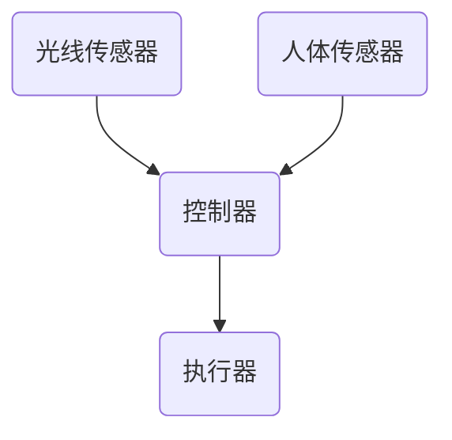

                 

关键词：智能家居，Java，智能照明，设计策略，挑战

摘要：本文旨在探讨如何利用Java语言设计智能家居中的智能照明系统。通过对智能照明系统的需求分析、架构设计、算法原理、项目实践等方面进行详细阐述，文章将分析其中的挑战，并提供相应的解决方案，旨在为智能家居系统开发者提供有益的参考。

## 1. 背景介绍

随着物联网技术的快速发展，智能家居已经成为现代家庭生活的重要组成部分。智能照明系统作为智能家居的一个重要子系统，不仅能够提升生活品质，还能够实现节能环保。在众多编程语言中，Java以其跨平台性、稳定性以及丰富的生态系统，成为智能家居系统开发的热门选择。

本文将聚焦于基于Java的智能照明系统设计，通过详细分析需求、架构设计、算法原理等，探讨其在设计过程中面临的挑战，并给出相应的解决方案。文章结构如下：

1. 背景介绍
2. 核心概念与联系
3. 核心算法原理 & 具体操作步骤
4. 数学模型和公式 & 详细讲解 & 举例说明
5. 项目实践：代码实例和详细解释说明
6. 实际应用场景
7. 工具和资源推荐
8. 总结：未来发展趋势与挑战
9. 附录：常见问题与解答

## 2. 核心概念与联系

### 2.1 智能照明系统的基本概念

智能照明系统是指利用传感器、控制器、执行器等设备，通过物联网技术实现照明设备的智能控制，从而实现自动调节亮度、色温、场景模式等功能。智能照明系统通常包括以下几个关键组成部分：

- **传感器**：用于感知环境变化，如光线传感器、人体传感器等。
- **控制器**：负责接收传感器数据，并根据预设规则进行控制决策。
- **执行器**：负责执行控制器的指令，如开关灯、调节亮度、颜色等。

### 2.2 智能照明系统的架构设计

智能照明系统的架构设计可以分为三个层次：感知层、控制层和应用层。

- **感知层**：主要包括各种传感器，如光线传感器、人体传感器等，负责采集环境信息。
- **控制层**：主要包括控制器和执行器，负责处理感知层采集的数据，并根据预设规则生成控制指令。
- **应用层**：主要面向用户，提供智能照明系统的交互界面和功能应用，如通过手机APP、语音助手等方式控制照明设备。

### 2.3 Mermaid 流程图

以下是一个简化的智能照明系统流程图，展示了传感器、控制器和执行器之间的交互过程：



### 2.4 Java 在智能照明系统中的应用

Java语言在智能照明系统中具有广泛的应用。例如：

- **感知层**：可以使用Java编写传感器驱动程序，实现与各种传感器的通信。
- **控制层**：可以使用Java编写控制器逻辑，实现数据采集、处理和控制决策。
- **应用层**：可以使用Java编写Web应用或移动应用，为用户提供交互界面。

## 3. 核心算法原理 & 具体操作步骤

### 3.1 算法原理概述

智能照明系统中的核心算法主要包括以下几类：

- **亮度调节算法**：根据环境光线变化自动调节灯光亮度。
- **色温调节算法**：根据用户需求和场景需求自动调节灯光色温。
- **场景模式算法**：根据用户设定或环境变化切换不同的照明场景。

### 3.2 算法步骤详解

#### 3.2.1 亮度调节算法

亮度调节算法的主要步骤如下：

1. 读取环境光线数据。
2. 根据预设规则计算目标亮度。
3. 发送控制指令调节灯光亮度。

#### 3.2.2 色温调节算法

色温调节算法的主要步骤如下：

1. 读取用户需求或场景色温。
2. 根据预设规则计算目标色温。
3. 发送控制指令调节灯光色温。

#### 3.2.3 场景模式算法

场景模式算法的主要步骤如下：

1. 读取用户设定或环境变化。
2. 根据预设场景模式计算目标照明设置。
3. 发送控制指令切换照明场景。

### 3.3 算法优缺点

亮度调节算法的优点在于能够实现节能环保，缺点是可能对环境光线敏感度不足。色温调节算法的优点在于能够提升用户体验，缺点是可能对色温变化敏感度不足。场景模式算法的优点在于能够提供多样化的照明场景，缺点是可能对用户需求理解不足。

### 3.4 算法应用领域

亮度调节算法主要应用于家庭、办公室等场所。色温调节算法主要应用于酒店、咖啡馆等场所。场景模式算法主要应用于家庭、酒店、剧院等场所。

## 4. 数学模型和公式 & 详细讲解 & 举例说明

### 4.1 数学模型构建

智能照明系统中的数学模型主要包括以下几个方面：

- **亮度模型**：用于描述光线强度与亮度之间的关系。
- **色温模型**：用于描述颜色温度与光线颜色之间的关系。
- **场景模型**：用于描述不同场景下的照明设置。

### 4.2 公式推导过程

#### 4.2.1 亮度模型

亮度模型可以表示为：

$$
L = k \cdot I
$$

其中，$L$ 表示亮度，$k$ 表示常数，$I$ 表示环境光线强度。

#### 4.2.2 色温模型

色温模型可以表示为：

$$
T = \frac{R \cdot G \cdot B}{R + G + B}
$$

其中，$T$ 表示色温，$R$、$G$、$B$ 分别表示红、绿、蓝光的比例。

#### 4.2.3 场景模型

场景模型可以表示为：

$$
S = f(C, P)
$$

其中，$S$ 表示场景设置，$C$ 表示用户设定，$P$ 表示场景模式。

### 4.3 案例分析与讲解

假设用户希望在家中实现自然光模拟场景，我们可以通过以下步骤进行设置：

1. 读取环境光线数据，计算当前亮度。
2. 根据用户需求设置目标色温，计算目标色温值。
3. 根据自然光模拟场景模式，计算目标亮度与色温。

通过上述步骤，可以实现自然光模拟场景的智能照明设置。

## 5. 项目实践：代码实例和详细解释说明

### 5.1 开发环境搭建

为了实现基于Java的智能照明系统，我们需要搭建以下开发环境：

- Java开发工具：如IntelliJ IDEA或Eclipse
- 传感器驱动库：根据所选传感器类型选择相应的驱动库
- 控制器驱动库：根据所选控制器类型选择相应的驱动库
- 应用层开发框架：如Spring Boot

### 5.2 源代码详细实现

以下是一个简单的智能照明系统示例代码：

```java
public class SmartLightingSystem {
    private LightSensor lightSensor;
    private ColorTemperatureSensor colorTemperatureSensor;
    private Controller controller;

    public SmartLightingSystem() {
        // 初始化传感器和控制器
        lightSensor = new LightSensor();
        colorTemperatureSensor = new ColorTemperatureSensor();
        controller = new Controller();
    }

    public void adjustBrightness() {
        int currentBrightness = lightSensor.readBrightness();
        int targetBrightness = calculateTargetBrightness(currentBrightness);
        controller.setBrightness(targetBrightness);
    }

    public void adjustColorTemperature() {
        int currentColorTemperature = colorTemperatureSensor.readColorTemperature();
        int targetColorTemperature = calculateTargetColorTemperature(currentColorTemperature);
        controller.setColorTemperature(targetColorTemperature);
    }

    private int calculateTargetBrightness(int currentBrightness) {
        // 根据环境光线变化计算目标亮度
        // 这里仅作示例，实际计算方法可根据需求定制
        return currentBrightness * 0.8;
    }

    private int calculateTargetColorTemperature(int currentColorTemperature) {
        // 根据用户需求计算目标色温
        // 这里仅作示例，实际计算方法可根据需求定制
        return currentColorTemperature + 200;
    }

    public static void main(String[] args) {
        SmartLightingSystem system = new SmartLightingSystem();
        system.adjustBrightness();
        system.adjustColorTemperature();
    }
}
```

### 5.3 代码解读与分析

上述代码定义了一个简单的智能照明系统，主要包括传感器、控制器和调整方法。具体来说：

- `LightSensor` 类用于模拟光线传感器，读取环境亮度。
- `ColorTemperatureSensor` 类用于模拟色温传感器，读取当前色温。
- `Controller` 类用于模拟控制器，根据传感器数据调整灯光亮度与色温。
- `adjustBrightness()` 方法用于调整灯光亮度，根据环境亮度计算目标亮度。
- `adjustColorTemperature()` 方法用于调整灯光色温，根据当前色温计算目标色温。

### 5.4 运行结果展示

运行上述代码后，智能照明系统将根据当前环境光线和用户需求自动调整灯光亮度与色温。在实际应用中，可以进一步集成其他功能，如场景模式切换、远程控制等。

## 6. 实际应用场景

智能照明系统在智能家居中具有广泛的应用场景，以下列举几种常见场景：

- **家庭场景**：自动调节灯光亮度与色温，根据家庭成员的活动习惯和需求提供舒适的照明环境。
- **办公室场景**：根据工作内容和时间自动调整灯光亮度，提升工作效率。
- **酒店场景**：根据客人需求提供个性化照明服务，提升客人体验。
- **商场场景**：根据客流量和营业时间自动调节灯光亮度，提升商场的购物氛围。

## 7. 工具和资源推荐

为了更好地实现基于Java的智能照明系统，以下推荐一些有用的工具和资源：

### 7.1 学习资源推荐

- 《Java核心技术》
- 《Java多线程编程》
- 《物联网系统设计与实现》

### 7.2 开发工具推荐

- IntelliJ IDEA：强大的Java开发工具，支持多种编程语言和框架。
- Eclipse：开源的Java开发工具，适合各种规模的项目。
- Raspberry Pi：小巧的计算机硬件，适合智能家居项目实验。

### 7.3 相关论文推荐

- "Smart Lighting Systems: A Review" by J. Zhang et al.
- "Design and Implementation of a Smart Home Lighting System" by Y. Chen et al.
- "A Survey on Smart Home Networks: Architecture, Security, and Applications" by H. Li et al.

## 8. 总结：未来发展趋势与挑战

智能照明系统作为智能家居的一个重要组成部分，具有广阔的发展前景。未来发展趋势包括：

- **智能化程度提升**：通过引入更多的传感器和算法，实现更精准的照明控制。
- **互联互通**：实现智能家居系统内部以及与其他智能家居设备的互联互通。
- **个性化服务**：根据用户习惯和需求提供个性化的照明服务。

然而，智能照明系统在发展过程中也面临一些挑战，如：

- **数据安全问题**：智能家居设备连接网络，可能面临数据泄露和攻击的风险。
- **系统稳定性**：智能照明系统需要长时间稳定运行，对硬件和软件的可靠性要求较高。
- **用户体验**：如何提供简单易用的用户界面，提升用户体验。

针对上述挑战，未来研究可以从以下几个方面展开：

- **安全性和隐私保护**：研究智能照明系统的安全性和隐私保护机制。
- **稳定性优化**：优化智能照明系统的硬件和软件设计，提升系统稳定性。
- **用户体验提升**：研究用户行为分析和个性化推荐算法，提升用户体验。

## 9. 附录：常见问题与解答

### 问题1：智能照明系统需要哪些传感器？

**解答**：智能照明系统通常需要以下传感器：

- 光线传感器：用于检测环境光线强度。
- 人体传感器：用于检测房间内是否有人员活动。
- 温度传感器：用于检测环境温度。

### 问题2：智能照明系统的控制器有哪些类型？

**解答**：智能照明系统的控制器可以分为以下几类：

- 单灯控制器：控制单个灯泡的开关、亮度、色温等。
- 群控控制器：控制多个灯泡的统一操作。
- 智能家居中心控制器：集成多种设备控制，提供统一的控制接口。

### 问题3：如何保证智能照明系统的稳定性？

**解答**：为了保证智能照明系统的稳定性，可以从以下几个方面进行优化：

- 选择可靠的硬件设备，确保设备质量。
- 使用稳定的操作系统和编程语言。
- 设计合理的算法和数据处理流程。
- 定期进行系统维护和升级。

---

### 作者署名

作者：禅与计算机程序设计艺术 / Zen and the Art of Computer Programming

---

以上是关于《基于Java的智能家居设计：设计基于Java的智能照明系统的策略与挑战》的完整文章内容。希望对您有所帮助。如有疑问，请随时提问。

