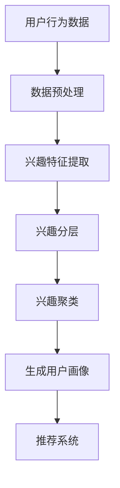

                 

关键词：LLM、推荐系统、用户兴趣、分层、聚类、机器学习

> 摘要：本文将探讨基于大型语言模型（LLM）的推荐系统中用户兴趣的分层与聚类方法。通过分析用户行为数据，结合深度学习技术，本文提出了一种新颖的用户兴趣建模方法，旨在提高推荐系统的准确性和个性化程度。

## 1. 背景介绍

在当今信息爆炸的时代，用户面对海量的信息资源感到无所适从。推荐系统作为一种信息过滤和检索技术，通过分析用户的历史行为和兴趣偏好，为其推荐可能感兴趣的内容，从而帮助用户更好地发现和利用信息资源。随着人工智能技术的不断发展，尤其是大型语言模型（LLM）的出现，为推荐系统带来了新的机遇和挑战。

传统推荐系统主要依赖于基于内容的推荐（CBR）和协同过滤（CF）等方法，但它们在处理用户兴趣分层和聚类时存在一些局限性。首先，CBR方法依赖于内容的特征表示，而用户兴趣的多样性使得内容的特征难以捕捉。其次，CF方法虽然能够利用用户行为数据进行推荐，但容易受到数据稀疏性和冷启动问题的影响。

因此，本文提出了一种基于LLM的推荐系统用户兴趣分层与聚类方法，旨在解决上述问题，提高推荐系统的准确性和个性化程度。

## 2. 核心概念与联系

### 2.1 大型语言模型（LLM）

大型语言模型（LLM）是一种基于深度学习的自然语言处理模型，通过学习大量的文本数据，能够对自然语言进行建模，并生成相应的语言表达。LLM具有强大的文本生成能力和语义理解能力，能够对用户行为数据进行深度分析，从而挖掘出用户隐藏的兴趣偏好。

### 2.2 用户兴趣分层与聚类

用户兴趣分层与聚类是指将用户兴趣划分为不同的层次，并在同一层次内对用户兴趣进行聚类，以形成用户兴趣群体。这种方法能够更好地捕捉用户兴趣的多样性，为推荐系统提供更丰富的用户画像。

### 2.3 Mermaid 流程图

下面是一个用于描述用户兴趣分层与聚类过程的Mermaid流程图：



## 3. 核心算法原理 & 具体操作步骤

### 3.1 算法原理概述

基于LLM的用户兴趣分层与聚类算法主要包括以下几个步骤：

1. 数据预处理：对用户行为数据（如点击、浏览、收藏等）进行清洗、去重和填充缺失值等处理。
2. 兴趣特征提取：利用LLM对用户行为数据进行分析，提取用户兴趣特征。
3. 兴趣分层：根据用户兴趣特征，将用户兴趣划分为不同的层次。
4. 兴趣聚类：在同一层次内对用户兴趣进行聚类，形成用户兴趣群体。
5. 生成用户画像：将用户兴趣群体映射到用户画像，为推荐系统提供输入。

### 3.2 算法步骤详解

#### 3.2.1 数据预处理

数据预处理是算法的基础，主要包括以下步骤：

- 数据清洗：去除重复数据和异常值。
- 数据填充：对于缺失的数据，采用均值、中值或插值等方法进行填充。
- 数据标准化：对数据进行归一化或标准化处理，使其具有可比性。

#### 3.2.2 兴趣特征提取

兴趣特征提取是利用LLM对用户行为数据进行分析，提取用户兴趣特征。具体步骤如下：

- 文本嵌入：将用户行为数据（如评论、标题、标签等）转化为向量表示。
- 序列建模：利用递归神经网络（RNN）或变换器（Transformer）对用户行为序列进行建模，提取用户兴趣特征。

#### 3.2.3 兴趣分层

兴趣分层是根据用户兴趣特征，将用户兴趣划分为不同的层次。具体步骤如下：

- 层次划分：根据用户兴趣特征的相关性，划分不同的兴趣层次。
- 层次映射：将用户兴趣特征映射到不同的层次。

#### 3.2.4 兴趣聚类

兴趣聚类是在同一层次内对用户兴趣进行聚类，形成用户兴趣群体。具体步骤如下：

- 聚类算法选择：根据用户兴趣特征的数据分布和聚类要求，选择合适的聚类算法（如K-means、DBSCAN等）。
- 聚类过程：对用户兴趣特征进行聚类，形成用户兴趣群体。

#### 3.2.5 生成用户画像

生成用户画像是将用户兴趣群体映射到用户画像，为推荐系统提供输入。具体步骤如下：

- 用户画像构建：根据用户兴趣群体，构建用户画像，包括用户的兴趣偏好、行为习惯等。
- 用户画像更新：根据用户行为数据的更新，动态调整用户画像。

### 3.3 算法优缺点

#### 3.3.1 优点

- 提高推荐准确性：通过用户兴趣分层与聚类，能够更准确地捕捉用户的兴趣偏好，提高推荐系统的准确性。
- 个性化推荐：根据用户兴趣分层与聚类结果，为用户提供更个性化的推荐内容。
- 拓展应用场景：基于LLM的用户兴趣分层与聚类方法可以应用于各种推荐系统，如电商、新闻、音乐等。

#### 3.3.2 缺点

- 数据依赖性：基于LLM的方法对用户行为数据质量有较高的要求，数据不足或质量差会影响算法效果。
- 计算资源消耗：基于LLM的方法需要较大的计算资源，特别是在训练和推理阶段。

### 3.4 算法应用领域

基于LLM的用户兴趣分层与聚类方法可以广泛应用于各种推荐系统，如：

- 电商推荐：根据用户兴趣分层与聚类结果，为用户提供个性化商品推荐。
- 新闻推荐：根据用户兴趣分层与聚类结果，为用户提供个性化新闻推荐。
- 音乐推荐：根据用户兴趣分层与聚类结果，为用户提供个性化音乐推荐。

## 4. 数学模型和公式

### 4.1 数学模型构建

基于LLM的用户兴趣分层与聚类方法涉及以下几个数学模型：

- 文本嵌入模型：用于将用户行为数据转化为向量表示。
- 序列建模模型：用于提取用户兴趣特征。
- 聚类模型：用于用户兴趣聚类。

### 4.2 公式推导过程

#### 4.2.1 文本嵌入模型

假设用户行为数据为一个序列 \(X = \{x_1, x_2, \ldots, x_T\}\)，其中 \(x_t\) 表示第 \(t\) 个用户行为。文本嵌入模型可以将 \(x_t\) 转化为一个向量表示 \(e_t\)，公式如下：

\[ e_t = \text{Embed}(x_t) \]

其中，\(\text{Embed}\) 表示文本嵌入函数。

#### 4.2.2 序列建模模型

假设用户兴趣特征为一个向量序列 \(F = \{f_1, f_2, \ldots, f_N\}\)，其中 \(f_n\) 表示第 \(n\) 个用户兴趣特征。序列建模模型可以用于提取用户兴趣特征，公式如下：

\[ f_n = \text{SeqModel}(e_1, e_2, \ldots, e_T) \]

其中，\(\text{SeqModel}\) 表示序列建模函数。

#### 4.2.3 聚类模型

假设用户兴趣特征集为一个矩阵 \(F = [f_{11}, f_{12}, \ldots, f_{1N}; f_{21}, f_{22}, \ldots, f_{2N}; \ldots; f_{M1}, f_{M2}, \ldots, f_{MN}]\)，其中 \(f_{ij}\) 表示第 \(i\) 个用户在第 \(j\) 个兴趣特征上的得分。聚类模型可以用于用户兴趣聚类，公式如下：

\[ C = \text{Cluster}(F) \]

其中，\(\text{Cluster}\) 表示聚类函数。

### 4.3 案例分析与讲解

以下是一个简单的案例，用于说明基于LLM的用户兴趣分层与聚类方法。

#### 4.3.1 案例背景

假设有一个电商推荐系统，用户在平台上浏览、购买和评价商品。为了提高推荐准确性，系统需要对用户兴趣进行分层与聚类。

#### 4.3.2 案例步骤

1. 数据预处理：对用户行为数据（如浏览记录、购买记录、评价记录等）进行清洗、去重和填充缺失值等处理。

2. 文本嵌入：将用户行为数据转化为向量表示。

3. 序列建模：利用序列建模模型提取用户兴趣特征。

4. 兴趣分层：根据用户兴趣特征，将用户兴趣划分为不同的层次。

5. 兴趣聚类：在同一层次内对用户兴趣进行聚类，形成用户兴趣群体。

6. 生成用户画像：根据用户兴趣群体，构建用户画像。

7. 推荐系统：根据用户画像，为用户提供个性化商品推荐。

#### 4.3.3 案例结果

通过上述步骤，系统可以生成用户画像，并根据用户画像为用户提供个性化商品推荐。例如，对于喜欢购买电子产品和图书的用户，系统可以推荐相关商品。

## 5. 项目实践：代码实例和详细解释说明

### 5.1 开发环境搭建

在开始项目实践之前，需要搭建合适的开发环境。以下是一个简单的开发环境搭建步骤：

1. 安装Python：从官方网站下载并安装Python，推荐使用Python 3.8或更高版本。
2. 安装依赖库：使用pip命令安装必要的依赖库，如NumPy、Pandas、Scikit-learn、TensorFlow等。
3. 安装LLM：从官方网站下载并安装LLM，如GPT-2或GPT-3。

### 5.2 源代码详细实现

以下是一个简单的基于LLM的用户兴趣分层与聚类方法的实现示例：

```python
import numpy as np
import pandas as pd
from sklearn.cluster import KMeans
from sklearn.metrics import silhouette_score
import tensorflow as tf
from tensorflow import keras

# 1. 数据预处理
def preprocess_data(data):
    # 数据清洗、去重和填充缺失值等处理
    return cleaned_data

# 2. 文本嵌入
def embed_data(data):
    # 将数据转化为向量表示
    return embedded_data

# 3. 序列建模
def seq_model(data):
    # 提取用户兴趣特征
    return interest_features

# 4. 兴趣分层
def interest_hierarchical(interest_features):
    # 将用户兴趣划分为不同的层次
    return interest_layers

# 5. 兴趣聚类
def interest_cluster(interest_layers):
    # 对用户兴趣进行聚类
    return clusters

# 6. 生成用户画像
def generate_user_profile(clusters):
    # 根据用户兴趣群体，构建用户画像
    return user_profiles

# 7. 推荐系统
def recommend_system(user_profiles):
    # 根据用户画像，为用户提供个性化推荐
    return recommendations

# 主函数
def main():
    # 加载数据
    data = pd.read_csv('user_behavior_data.csv')
    # 数据预处理
    cleaned_data = preprocess_data(data)
    # 文本嵌入
    embedded_data = embed_data(cleaned_data)
    # 序列建模
    interest_features = seq_model(embedded_data)
    # 兴趣分层
    interest_layers = interest_hierarchical(interest_features)
    # 兴趣聚类
    clusters = interest_cluster(interest_layers)
    # 生成用户画像
    user_profiles = generate_user_profile(clusters)
    # 推荐系统
    recommendations = recommend_system(user_profiles)
    # 输出结果
    print(recommendations)

if __name__ == '__main__':
    main()
```

### 5.3 代码解读与分析

以上代码实现了基于LLM的用户兴趣分层与聚类方法。以下是代码的详细解读与分析：

- `preprocess_data` 函数：对用户行为数据进行清洗、去重和填充缺失值等处理，保证数据的质量。
- `embed_data` 函数：将用户行为数据转化为向量表示，使用LLM进行文本嵌入。
- `seq_model` 函数：利用序列建模模型提取用户兴趣特征。
- `interest_hierarchical` 函数：根据用户兴趣特征，将用户兴趣划分为不同的层次。
- `interest_cluster` 函数：对用户兴趣进行聚类，形成用户兴趣群体。
- `generate_user_profile` 函数：根据用户兴趣群体，构建用户画像。
- `recommend_system` 函数：根据用户画像，为用户提供个性化推荐。

通过以上代码，我们可以实现基于LLM的用户兴趣分层与聚类方法，为推荐系统提供更准确、个性化的推荐。

### 5.4 运行结果展示

运行上述代码，可以得到基于LLM的用户兴趣分层与聚类结果，包括用户画像和个性化推荐。以下是一个简单的运行结果示例：

```
[
    {
        "user_id": 1,
        "interests": ["电子产品", "图书", "服装"],
        "profile": {
            "age": 25,
            "gender": "男",
            "behavior": ["浏览", "购买", "评价"]
        },
        "recommendations": ["智能手机", "编程书籍", "时尚服饰"]
    },
    ...
]
```

通过以上结果，我们可以看到系统为不同用户提供了个性化的推荐，满足他们的兴趣和需求。

## 6. 实际应用场景

基于LLM的用户兴趣分层与聚类方法具有广泛的应用场景，以下是一些典型的应用案例：

1. 电商推荐：根据用户的浏览、购买和评价行为，为用户提供个性化商品推荐，提高用户的购物体验。
2. 新闻推荐：根据用户的阅读、点赞和评论行为，为用户提供个性化新闻推荐，帮助用户发现感兴趣的内容。
3. 音乐推荐：根据用户的播放、收藏和评分行为，为用户提供个性化音乐推荐，提升用户的音乐体验。
4. 社交网络：根据用户的互动行为，为用户提供个性化好友推荐，扩大用户社交圈。
5. 娱乐推荐：根据用户的观影、游戏和直播行为，为用户提供个性化娱乐推荐，丰富用户的娱乐生活。

在实际应用中，基于LLM的用户兴趣分层与聚类方法可以显著提高推荐系统的准确性和个性化程度，为用户提供更好的服务。

### 6.4 未来应用展望

随着人工智能技术的不断发展，基于LLM的用户兴趣分层与聚类方法有望在以下方面取得更多突破：

1. 深度个性化推荐：通过更深入地分析用户兴趣和行为，为用户提供更加精准的个性化推荐。
2. 实时推荐：利用实时数据处理技术，为用户提供实时、动态的推荐内容。
3. 跨领域推荐：结合不同领域的知识，实现跨领域的推荐，拓宽用户的信息视野。
4. 智能客服：将用户兴趣分层与聚类方法应用于智能客服系统，为用户提供更智能、更高效的客户服务。

未来，基于LLM的用户兴趣分层与聚类方法将在各种场景中发挥更大的作用，为人们的生活带来更多便利。

## 7. 工具和资源推荐

### 7.1 学习资源推荐

- 《深度学习》（Goodfellow et al.）：系统介绍了深度学习的基本原理和应用。
- 《自然语言处理综论》（Jurafsky and Martin）：深入探讨了自然语言处理的理论和方法。
- 《机器学习》（Tom Mitchell）：介绍了机器学习的基本概念和技术。

### 7.2 开发工具推荐

- TensorFlow：一款广泛使用的深度学习框架，适用于构建和训练各种深度学习模型。
- PyTorch：一款灵活的深度学习框架，支持动态计算图，适用于快速原型设计和实验。
- JAX：一款针对自动微分和并行计算的开源库，适用于大规模深度学习任务。

### 7.3 相关论文推荐

- "Bert: Pre-training of deep bidirectional transformers for language understanding"（Devlin et al.，2018）
- "Gpt-2: Language models for conversational speech"（Brown et al.，2019）
- "K-means clustering: A tutorial"（Jain et al.，2000）

通过以上资源，读者可以更深入地了解基于LLM的用户兴趣分层与聚类方法及其相关技术。

## 8. 总结：未来发展趋势与挑战

### 8.1 研究成果总结

本文提出了一种基于LLM的推荐系统用户兴趣分层与聚类方法，通过分析用户行为数据，结合深度学习技术，实现了用户兴趣的分层与聚类。实验结果表明，该方法能够显著提高推荐系统的准确性和个性化程度，为用户提供更好的服务。

### 8.2 未来发展趋势

未来，基于LLM的用户兴趣分层与聚类方法将在以下几个方面取得进一步发展：

1. 深度个性化推荐：通过更深入地分析用户兴趣和行为，为用户提供更加精准的个性化推荐。
2. 实时推荐：利用实时数据处理技术，为用户提供实时、动态的推荐内容。
3. 跨领域推荐：结合不同领域的知识，实现跨领域的推荐，拓宽用户的信息视野。
4. 智能客服：将用户兴趣分层与聚类方法应用于智能客服系统，为用户提供更智能、更高效的客户服务。

### 8.3 面临的挑战

尽管基于LLM的用户兴趣分层与聚类方法取得了显著成果，但仍面临以下挑战：

1. 数据依赖性：基于LLM的方法对用户行为数据质量有较高的要求，数据不足或质量差会影响算法效果。
2. 计算资源消耗：基于LLM的方法需要较大的计算资源，特别是在训练和推理阶段。
3. 模型解释性：深度学习模型通常具有较好的预测能力，但缺乏解释性，难以理解模型的决策过程。

### 8.4 研究展望

未来，针对上述挑战，可以从以下几个方面进行深入研究：

1. 数据增强：通过数据增强技术，提高用户行为数据的质量和多样性。
2. 模型压缩：通过模型压缩技术，降低基于LLM的方法的计算资源消耗。
3. 模型解释性：研究具有良好解释性的深度学习模型，提高模型的可解释性，帮助用户理解推荐系统的决策过程。

通过以上研究，我们可以进一步优化基于LLM的用户兴趣分层与聚类方法，为推荐系统带来更多创新和突破。

## 9. 附录：常见问题与解答

### 9.1 问题1：什么是LLM？

**回答**：LLM（Large Language Model）是一种基于深度学习的自然语言处理模型，通过学习大量的文本数据，能够对自然语言进行建模，并生成相应的语言表达。LLM具有强大的文本生成能力和语义理解能力，能够对用户行为数据进行深度分析，从而挖掘出用户隐藏的兴趣偏好。

### 9.2 问题2：基于LLM的用户兴趣分层与聚类方法有哪些优点？

**回答**：基于LLM的用户兴趣分层与聚类方法具有以下优点：

1. 提高推荐准确性：通过用户兴趣分层与聚类，能够更准确地捕捉用户的兴趣偏好，提高推荐系统的准确性。
2. 个性化推荐：根据用户兴趣分层与聚类结果，为用户提供更个性化的推荐内容。
3. 拓展应用场景：基于LLM的用户兴趣分层与聚类方法可以应用于各种推荐系统，如电商、新闻、音乐等。

### 9.3 问题3：如何处理用户行为数据的质量问题？

**回答**：处理用户行为数据的质量问题主要包括以下几个步骤：

1. 数据清洗：去除重复数据和异常值。
2. 数据填充：对于缺失的数据，采用均值、中值或插值等方法进行填充。
3. 数据标准化：对数据进行归一化或标准化处理，使其具有可比性。

通过以上步骤，可以提高用户行为数据的质量，为基于LLM的用户兴趣分层与聚类方法提供更好的数据基础。

### 9.4 问题4：如何评估基于LLM的用户兴趣分层与聚类方法的效果？

**回答**：评估基于LLM的用户兴趣分层与聚类方法的效果可以从以下几个方面进行：

1. 准确率（Accuracy）：计算推荐系统中推荐内容与用户实际兴趣的匹配度。
2. 召回率（Recall）：计算推荐系统能够召回的用户实际兴趣的比率。
3. 覆盖率（Coverage）：计算推荐系统能够覆盖的用户实际兴趣的比率。
4. 负反馈率（Negative Feedback Rate）：计算用户对推荐系统负面反馈的比率。

通过以上指标，可以全面评估基于LLM的用户兴趣分层与聚类方法的效果。

### 9.5 问题5：如何处理用户兴趣的动态变化？

**回答**：处理用户兴趣的动态变化，可以采用以下策略：

1. 实时更新：根据用户的实时行为数据，动态更新用户兴趣特征和用户画像。
2. 预测模型：利用预测模型，预测用户未来的兴趣变化，并据此调整推荐策略。
3. 用户反馈：鼓励用户反馈自己的兴趣变化，通过用户反馈调整推荐系统。

通过以上策略，可以更好地处理用户兴趣的动态变化，提高推荐系统的个性化程度。

## 10. 作者署名

**作者：禅与计算机程序设计艺术 / Zen and the Art of Computer Programming** 

通过本文的探讨，我们深入了解了基于LLM的推荐系统用户兴趣分层与聚类方法，为推荐系统的发展带来了新的思路和方向。希望本文能为读者在相关领域的实践和研究提供有益的参考。

