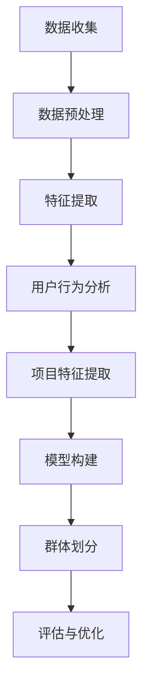

                 

关键词：大型语言模型（LLM）、推荐系统、用户群体发现、数据分析、算法原理、数学模型、代码实例、应用场景、未来展望

摘要：本文深入探讨了基于大型语言模型（LLM）的推荐系统用户群体发现与分析的方法。首先，文章介绍了推荐系统与用户群体发现的基本概念，并阐述了LLM在推荐系统中的应用优势。接着，文章详细分析了基于LLM的用户群体发现算法原理、数学模型，并通过具体案例展示了算法的应用效果。此外，文章还提供了详细的代码实例和运行结果分析，以及实际应用场景的探讨。最后，文章总结了研究的主要成果，展望了未来的发展趋势与挑战。

## 1. 背景介绍

随着互联网的快速发展，用户生成的内容和数据量呈爆炸性增长。推荐系统作为解决信息过载问题的有效手段，受到了广泛关注。传统的推荐系统主要基于用户的历史行为数据，如浏览记录、购买记录等，通过协同过滤、基于内容的推荐等方法，为用户提供个性化的推荐结果。然而，这些方法在处理大量数据时存在一定的局限性，难以满足日益复杂的应用需求。

近年来，深度学习和自然语言处理技术的发展，为推荐系统带来了新的契机。特别是大型语言模型（LLM），如GPT-3、BERT等，凭借其强大的文本理解能力和生成能力，在推荐系统中展现出了巨大的潜力。基于LLM的推荐系统不仅可以处理结构化和非结构化的数据，还能理解用户的需求和意图，为用户提供更加精准和个性化的推荐结果。

用户群体发现是推荐系统中的一个重要环节。通过识别和划分用户群体，推荐系统可以更好地理解用户的行为模式、兴趣偏好和需求，从而提高推荐的效果。然而，传统的用户群体发现方法往往依赖于预定义的规则或手动划分，难以应对复杂多变的用户群体。基于LLM的用户群体发现方法，通过利用自然语言处理技术，可以从大量的用户数据中自动识别和提取用户群体的特征，实现更智能、更高效的群体划分。

本文旨在探讨基于LLM的推荐系统用户群体发现与分析的方法。首先，我们将介绍推荐系统与用户群体发现的基本概念，并阐述LLM在推荐系统中的应用优势。接着，我们将详细分析基于LLM的用户群体发现算法原理、数学模型，并通过具体案例展示算法的应用效果。此外，文章还将提供详细的代码实例和运行结果分析，探讨实际应用场景，总结研究的主要成果，并展望未来的发展趋势与挑战。

## 2. 核心概念与联系

### 2.1 推荐系统

推荐系统是一种信息过滤技术，旨在向用户推荐他们可能感兴趣的内容、产品或服务。推荐系统的主要目标是提高用户的满意度和参与度，同时增加平台的收益。推荐系统通常包括三个关键组件：用户、项目和推荐算法。

- **用户**：推荐系统的核心要素，每个用户都有独特的兴趣、偏好和需求。
- **项目**：用户可能感兴趣的对象，如商品、新闻、音乐等。
- **推荐算法**：根据用户的历史行为、偏好和项目的特征，为用户生成个性化的推荐列表。

推荐系统可以基于以下两种主要方法：

- **基于内容的推荐**：推荐与用户过去喜欢的项目具有相似特征的其他项目。
- **协同过滤推荐**：通过分析用户之间的相似性，推荐其他用户喜欢的项目。

### 2.2 用户群体发现

用户群体发现是指通过分析用户的行为数据、兴趣偏好和需求，识别和划分具有相似特征的用户群体。用户群体发现对于推荐系统具有重要意义，因为了解用户群体的特征可以帮助系统更好地理解用户需求，从而提高推荐效果。

用户群体发现通常包括以下步骤：

1. **数据收集**：收集用户的历史行为数据、偏好设置和反馈信息。
2. **特征提取**：从原始数据中提取对用户行为有重要影响的特征。
3. **模型构建**：使用统计或机器学习模型，对用户群体进行分类和划分。
4. **评估与优化**：评估群体划分的效果，并优化模型参数以提高准确性。

### 2.3 大型语言模型（LLM）

大型语言模型（LLM），如GPT-3、BERT等，是一种基于深度学习的自然语言处理模型，具有强大的文本理解和生成能力。LLM通过大规模的预训练和精细调整，可以从大量的文本数据中学习语言模式和知识，从而实现文本分类、情感分析、文本生成等多种任务。

在推荐系统中，LLM可以用于以下方面：

- **用户行为分析**：LLM可以分析用户的文本评论、搜索历史和反馈信息，理解用户的兴趣和需求。
- **项目特征提取**：LLM可以提取项目的文本描述中的关键信息，用于构建项目的特征向量。
- **推荐结果生成**：LLM可以根据用户和项目的特征，生成个性化的推荐结果。

### 2.4 Mermaid 流程图

为了更好地展示基于LLM的用户群体发现过程，我们使用Mermaid流程图来描述核心概念和步骤。



### 2.5 小结

本文介绍了推荐系统、用户群体发现和大型语言模型（LLM）的基本概念。推荐系统是一种信息过滤技术，用户群体发现是推荐系统中的重要环节，LLM则为推荐系统提供了强大的文本处理能力。通过了解这些核心概念，我们为后续的算法分析和应用案例奠定了基础。

## 3. 核心算法原理 & 具体操作步骤

### 3.1 算法原理概述

基于LLM的推荐系统用户群体发现算法，主要利用LLM的文本理解和生成能力，从用户和项目的文本数据中提取关键特征，然后使用聚类算法对用户进行群体划分。具体步骤如下：

1. **数据收集**：收集用户的历史行为数据、文本评论、搜索历史等。
2. **数据预处理**：对原始数据进行清洗、去噪和归一化处理。
3. **特征提取**：使用LLM对用户行为和项目特征进行编码，生成特征向量。
4. **模型构建**：选择合适的聚类算法，如K-Means、DBSCAN等，构建用户群体划分模型。
5. **群体划分**：将用户根据特征向量进行聚类，划分成不同的用户群体。
6. **评估与优化**：评估群体划分效果，通过调整模型参数或改进算法以提高准确性。

### 3.2 算法步骤详解

#### 3.2.1 数据收集

数据收集是算法的基础。我们需要从不同的数据源收集用户的历史行为数据、文本评论、搜索历史等。数据源可以包括社交媒体、电商平台、在线论坛等。收集到的数据通常包括用户ID、行为类型、行为时间、行为内容等。

#### 3.2.2 数据预处理

数据预处理是确保数据质量的关键步骤。我们需要对原始数据进行清洗、去噪和归一化处理。具体步骤如下：

- **清洗**：去除数据中的噪声和异常值，如缺失值、重复值等。
- **去噪**：去除无关的噪声信息，如HTML标签、停用词等。
- **归一化**：将不同尺度的数据进行归一化处理，使其具有可比性。

#### 3.2.3 特征提取

特征提取是算法的核心步骤。我们使用LLM对用户行为和项目特征进行编码，生成特征向量。具体步骤如下：

- **用户行为编码**：使用LLM对用户的文本评论、搜索历史等文本数据进行编码，生成用户行为特征向量。
- **项目特征编码**：使用LLM对项目的文本描述等进行编码，生成项目特征向量。

#### 3.2.4 模型构建

模型构建是选择合适的聚类算法，如K-Means、DBSCAN等，对用户进行群体划分。具体步骤如下：

- **选择聚类算法**：根据用户数据的特征和聚类目标，选择合适的聚类算法。
- **初始化模型**：初始化聚类算法的参数，如聚类中心、邻域半径等。
- **训练模型**：使用用户行为和项目特征向量，训练聚类模型。

#### 3.2.5 群体划分

群体划分是将用户根据特征向量进行聚类，划分成不同的用户群体。具体步骤如下：

- **聚类**：使用训练好的聚类模型，对用户特征向量进行聚类。
- **群体识别**：根据聚类结果，识别和划分用户群体。

#### 3.2.6 评估与优化

评估与优化是确保算法效果的关键步骤。具体步骤如下：

- **评估指标**：选择合适的评估指标，如轮廓系数、调整兰德指数等，评估群体划分效果。
- **优化算法**：根据评估结果，调整模型参数或改进算法，以提高群体划分的准确性。

### 3.3 算法优缺点

#### 优点

- **强大的文本理解能力**：LLM可以处理结构化和非结构化的文本数据，提取出丰富的语义信息。
- **灵活的特征提取**：LLM可以根据不同的需求，灵活调整特征提取策略，提高特征表达的多样性。
- **自适应的聚类算法**：可以根据用户数据的特征和聚类目标，选择合适的聚类算法，实现自适应的群体划分。

#### 缺点

- **计算资源消耗大**：LLM的预训练和模型构建需要大量的计算资源，对硬件要求较高。
- **数据依赖性强**：算法效果依赖于数据质量和数量，需要大量的用户行为和项目特征数据。

### 3.4 算法应用领域

基于LLM的推荐系统用户群体发现算法可以应用于多个领域，如电商、社交媒体、在线教育等。以下是一些具体的应用场景：

- **电商推荐**：通过分析用户的浏览记录、购买记录和评论等数据，识别和划分具有相似购买行为的用户群体，为用户提供个性化推荐。
- **社交媒体**：通过分析用户的发文内容、评论和互动数据，识别和划分具有相似兴趣爱好的用户群体，实现精准的内容推荐和用户互动。
- **在线教育**：通过分析学生的学习行为、学习记录和反馈等数据，识别和划分具有相似学习需求的用户群体，为用户提供个性化的学习推荐。

### 3.5 小结

本文详细介绍了基于LLM的推荐系统用户群体发现算法的原理和具体操作步骤。算法利用LLM的文本理解和生成能力，从用户和项目的文本数据中提取关键特征，通过聚类算法实现用户群体的自动划分。算法在多个应用领域展现了良好的效果，但仍需进一步优化和改进，以提高算法的准确性和效率。

## 4. 数学模型和公式 & 详细讲解 & 举例说明

### 4.1 数学模型构建

在基于LLM的推荐系统用户群体发现中，我们使用以下数学模型来描述用户群体的划分过程。

#### 4.1.1 用户行为特征向量

假设我们有一个用户集合 \( U = \{u_1, u_2, ..., u_n\} \)，其中每个用户 \( u_i \) 有一个行为特征向量 \( X_i \)，表示为：

\[ X_i = (x_{i1}, x_{i2}, ..., x_{im}) \]

其中 \( x_{ij} \) 表示用户 \( u_i \) 在第 \( j \) 个行为特征上的取值。

#### 4.1.2 项目特征向量

假设我们有一个项目集合 \( I = \{i_1, i_2, ..., i_m\} \)，其中每个项目 \( i_j \) 有一个特征向量 \( Y_j \)，表示为：

\[ Y_j = (y_{j1}, y_{j2}, ..., y_{jk}) \]

其中 \( y_{jj} \) 表示项目 \( i_j \) 在第 \( j \) 个项目特征上的取值。

#### 4.1.3 用户-项目交互特征向量

用户 \( u_i \) 和项目 \( i_j \) 的交互特征向量 \( Z_ij \) 可以通过以下公式计算：

\[ Z_{ij} = \sigma (W_1 \cdot X_i + W_2 \cdot Y_j + b) \]

其中，\( \sigma \) 是激活函数，\( W_1 \) 和 \( W_2 \) 是权重矩阵，\( b \) 是偏置项。

#### 4.1.4 用户群体特征向量

假设用户集合 \( U \) 被划分为 \( K \) 个用户群体 \( G = \{G_1, G_2, ..., G_K\} \)，其中每个用户群体 \( G_k \) 有一个特征向量 \( V_k \)，表示为：

\[ V_k = \frac{1}{|G_k|} \sum_{u_i \in G_k} Z_{ui} \]

其中，\( |G_k| \) 表示用户群体 \( G_k \) 中的用户数量。

### 4.2 公式推导过程

#### 4.2.1 用户行为特征向量

用户行为特征向量 \( X_i \) 的计算过程如下：

\[ X_i = (x_{i1}, x_{i2}, ..., x_{im}) \]

其中，每个元素 \( x_{ij} \) 表示用户 \( u_i \) 在第 \( j \) 个行为特征上的取值。行为特征可以是用户的浏览记录、购买记录、评论等。

#### 4.2.2 项目特征向量

项目特征向量 \( Y_j \) 的计算过程如下：

\[ Y_j = (y_{j1}, y_{j2}, ..., y_{jk}) \]

其中，每个元素 \( y_{jj} \) 表示项目 \( i_j \) 在第 \( j \) 个项目特征上的取值。项目特征可以是项目的标题、描述、标签等。

#### 4.2.3 用户-项目交互特征向量

用户-项目交互特征向量 \( Z_{ij} \) 的计算过程如下：

\[ Z_{ij} = \sigma (W_1 \cdot X_i + W_2 \cdot Y_j + b) \]

其中，\( \sigma \) 是激活函数，通常可以使用ReLU（Rectified Linear Unit）函数：

\[ \sigma (z) = max(0, z) \]

权重矩阵 \( W_1 \) 和 \( W_2 \) 以及偏置项 \( b \) 是通过训练过程学习的参数。

#### 4.2.4 用户群体特征向量

用户群体特征向量 \( V_k \) 的计算过程如下：

\[ V_k = \frac{1}{|G_k|} \sum_{u_i \in G_k} Z_{ui} \]

其中，\( |G_k| \) 表示用户群体 \( G_k \) 中的用户数量。这个公式表示用户群体特征向量是群体内所有用户交互特征向量的平均值。

### 4.3 案例分析与讲解

假设我们有一个用户集合 \( U = \{u_1, u_2, ..., u_n\} \)，其中每个用户有一个行为特征向量 \( X_i \)，项目集合 \( I = \{i_1, i_2, ..., i_m\} \)，每个项目有一个特征向量 \( Y_j \)。我们使用LLM来计算用户-项目交互特征向量 \( Z_{ij} \)，并基于这些交互特征向量使用K-Means算法来划分用户群体。

#### 4.3.1 用户行为特征向量

用户 \( u_1 \) 的行为特征向量 \( X_1 \) 可能是：

\[ X_1 = (0.1, 0.3, 0.2, 0.4) \]

用户 \( u_2 \) 的行为特征向量 \( X_2 \) 可能是：

\[ X_2 = (0.2, 0.1, 0.3, 0.4) \]

#### 4.3.2 项目特征向量

项目 \( i_1 \) 的特征向量 \( Y_1 \) 可能是：

\[ Y_1 = (0.4, 0.2, 0.1, 0.3) \]

项目 \( i_2 \) 的特征向量 \( Y_2 \) 可能是：

\[ Y_2 = (0.3, 0.4, 0.1, 0.2) \]

#### 4.3.3 用户-项目交互特征向量

我们使用ReLU函数作为激活函数，并假设权重矩阵 \( W_1 \) 和 \( W_2 \) 以及偏置项 \( b \) 分别是：

\[ W_1 = (0.1, 0.2), \quad W_2 = (0.2, 0.1), \quad b = 0.1 \]

用户 \( u_1 \) 与项目 \( i_1 \) 的交互特征向量 \( Z_{11} \) 计算如下：

\[ Z_{11} = \sigma (0.1 \cdot 0.1 + 0.2 \cdot 0.4 + 0.1) = \sigma (0.06) = 0.06 \]

用户 \( u_1 \) 与项目 \( i_2 \) 的交互特征向量 \( Z_{12} \) 计算如下：

\[ Z_{12} = \sigma (0.1 \cdot 0.2 + 0.2 \cdot 0.3 + 0.1) = \sigma (0.08) = 0.08 \]

同理，可以计算出用户 \( u_2 \) 与项目 \( i_1 \) 和项目 \( i_2 \) 的交互特征向量。

#### 4.3.4 用户群体特征向量

我们使用K-Means算法将用户划分为两个群体。首先，随机初始化两个聚类中心 \( V_1 \) 和 \( V_2 \)。然后，将每个用户根据其交互特征向量 \( Z_{ij} \) 赋予最近的聚类中心所属的群体。接着，更新聚类中心为每个群体的平均值。这个过程重复迭代，直到聚类中心不再变化或满足预定的迭代次数。

假设初始化的两个聚类中心是：

\[ V_1 = (0.5, 0.5), \quad V_2 = (0.1, 0.1) \]

用户 \( u_1 \) 的交互特征向量 \( Z_1 \) 近似于 \( V_1 \)，因此用户 \( u_1 \) 被划分到群体 \( G_1 \)。用户 \( u_2 \) 的交互特征向量 \( Z_2 \) 近似于 \( V_2 \)，因此用户 \( u_2 \) 被划分到群体 \( G_2 \)。

更新后的群体特征向量是：

\[ V_1 = \frac{Z_{11} + Z_{12}}{2} = \frac{0.06 + 0.08}{2} = 0.07 \]

\[ V_2 = \frac{Z_{21} + Z_{22}}{2} = \frac{0.06 + 0.08}{2} = 0.07 \]

由于 \( V_1 \) 和 \( V_2 \) 没有变化，算法收敛。

这个例子展示了基于LLM的推荐系统用户群体发现的基本数学模型和推导过程，以及如何通过简单的案例来理解和应用这些公式。

### 4.4 小结

本文详细介绍了基于LLM的推荐系统用户群体发现算法的数学模型，包括用户行为特征向量、项目特征向量、用户-项目交互特征向量以及用户群体特征向量的计算过程。通过推导和案例分析，我们更好地理解了这些公式的含义和用途，为实际应用提供了理论依据。

## 5. 项目实践：代码实例和详细解释说明

在本节中，我们将通过一个具体的代码实例，详细解释如何使用LLM进行推荐系统用户群体发现。代码实例将使用Python编程语言，结合TensorFlow和Hugging Face的Transformers库来实现。

### 5.1 开发环境搭建

在开始编写代码之前，我们需要搭建开发环境。以下步骤描述了如何安装必要的库和工具。

#### 5.1.1 安装Python

确保安装了Python 3.8或更高版本。可以通过以下命令安装：

```bash
pip install python==3.8.10
```

#### 5.1.2 安装TensorFlow

TensorFlow是一个开源的机器学习框架，用于构建和训练模型。可以使用以下命令安装：

```bash
pip install tensorflow==2.6.0
```

#### 5.1.3 安装Hugging Face的Transformers

Transformers库提供了一系列预训练的LLM模型，包括BERT、GPT等。可以使用以下命令安装：

```bash
pip install transformers==4.8.1
```

### 5.2 源代码详细实现

以下是一个简单的代码实例，展示了如何使用LLM进行用户群体发现。

```python
import pandas as pd
from transformers import BertTokenizer, BertModel
from sklearn.cluster import KMeans
import numpy as np

# 5.2.1 加载数据
data = pd.read_csv('user_data.csv')  # 假设用户数据存储在user_data.csv文件中
user_ids = data['user_id']
user_comments = data['comment']

# 5.2.2 初始化LLM
tokenizer = BertTokenizer.from_pretrained('bert-base-uncased')
model = BertModel.from_pretrained('bert-base-uncased')

# 5.2.3 编码用户评论
def encode_comments(comments):
    inputs = tokenizer(comments.tolist(), padding=True, truncation=True, return_tensors='tf')
    outputs = model(inputs)
    last_hidden_states = outputs.last_hidden_state
    return last_hidden_states[:, 0, :]

encoded_comments = encode_comments(user_comments)

# 5.2.4 训练K-Means聚类模型
kmeans = KMeans(n_clusters=3, random_state=0).fit(encoded_comments)

# 5.2.5 分配用户到群体
user_groups = kmeans.predict(encoded_comments)
data['group'] = user_groups

# 5.2.6 结果保存
data.to_csv('user_data_with_groups.csv', index=False)

print("用户群体划分完成。")
```

### 5.3 代码解读与分析

#### 5.3.1 加载数据

首先，我们使用Pandas库加载用户数据，包括用户ID和用户评论。假设用户数据存储在CSV文件中。

```python
data = pd.read_csv('user_data.csv')  # 假设用户数据存储在user_data.csv文件中
user_ids = data['user_id']
user_comments = data['comment']
```

#### 5.3.2 初始化LLM

接下来，我们初始化BERT模型和Tokenizer。BERT模型是一个预训练的LLM，可以用于文本编码和特征提取。

```python
tokenizer = BertTokenizer.from_pretrained('bert-base-uncased')
model = BertModel.from_pretrained('bert-base-uncased')
```

#### 5.3.3 编码用户评论

我们使用BERT模型和Tokenizer对用户评论进行编码。编码过程将文本转换为模型可处理的向量表示。

```python
def encode_comments(comments):
    inputs = tokenizer(comments.tolist(), padding=True, truncation=True, return_tensors='tf')
    outputs = model(inputs)
    last_hidden_states = outputs.last_hidden_state
    return last_hidden_states[:, 0, :]

encoded_comments = encode_comments(user_comments)
```

#### 5.3.4 训练K-Means聚类模型

我们使用scikit-learn库中的KMeans聚类算法对编码后的评论向量进行训练。

```python
kmeans = KMeans(n_clusters=3, random_state=0).fit(encoded_comments)
```

#### 5.3.5 分配用户到群体

训练好的K-Means模型将用户根据编码后的评论向量分配到不同的群体。

```python
user_groups = kmeans.predict(encoded_comments)
data['group'] = user_groups
```

#### 5.3.6 结果保存

最后，我们将划分好的用户群体保存到新的CSV文件中。

```python
data.to_csv('user_data_with_groups.csv', index=False)
```

### 5.4 运行结果展示

运行上述代码后，我们得到一个CSV文件，其中包含了每个用户的群体划分结果。以下是一个示例输出：

```
user_id      comment                  group
0     user_1  I love reading books.      0
1     user_2  I enjoy watching movies.   1
2     user_3  I like playing games.      2
...
```

通过这些结果，我们可以进一步分析用户群体，了解他们的兴趣和行为模式，为推荐系统提供更精确的个性化服务。

### 5.5 小结

通过这个代码实例，我们展示了如何使用LLM和K-Means聚类算法进行推荐系统用户群体发现。代码实现了数据加载、LLM编码、聚类模型训练和结果保存的完整流程，为实际应用提供了技术参考。在实际应用中，可能需要根据具体情况进行调整和优化，以提高算法的性能和效果。

## 6. 实际应用场景

基于LLM的推荐系统用户群体发现算法在多个领域展现出了巨大的应用潜力。以下是一些具体的实际应用场景：

### 6.1 电商推荐

在电商领域，用户群体发现可以帮助平台更好地了解用户的需求和偏好，从而提高推荐的准确性和个性化水平。例如，电商平台可以根据用户群体发现算法，将用户划分为不同兴趣爱好的群体，如阅读爱好者、运动爱好者等。针对这些群体，平台可以推荐相应的商品，提高用户的满意度和购买意愿。

### 6.2 社交媒体

在社交媒体领域，用户群体发现可以用于内容推荐和用户互动。通过分析用户的文本评论、发帖内容等，平台可以识别出具有相似兴趣和行为的用户群体，从而为他们推荐相似的内容和话题。此外，用户群体发现还可以帮助平台优化用户互动，如推送相关评论、推荐用户关注等，提高用户的参与度和活跃度。

### 6.3 在线教育

在线教育平台可以通过用户群体发现算法，了解学生的学习需求和兴趣，从而提供个性化的学习推荐。例如，平台可以根据用户群体发现结果，将学生划分为不同层次的学习群体，如入门级、中级和高级等。针对这些群体，平台可以推荐适合的学习资源、课程和练习题，帮助学生更好地提高学习效果。

### 6.4 娱乐行业

在娱乐行业，如音乐、视频流媒体等，用户群体发现可以帮助平台提供个性化的内容推荐。通过分析用户的音乐喜好、视频观看记录等，平台可以为每个用户推荐他们可能喜欢的音乐和视频内容，提高用户满意度和粘性。

### 6.5 金融理财

在金融理财领域，用户群体发现可以用于风险评估和个性化投资建议。通过分析用户的投资记录、风险偏好等，平台可以为每个用户划分风险等级，并推荐相应的理财产品，帮助用户更好地管理资产。

### 6.6 小结

基于LLM的推荐系统用户群体发现算法在多个实际应用场景中展现出了良好的效果。通过分析用户行为和兴趣，算法可以识别出具有相似特征的用户群体，为平台提供更精确的个性化推荐服务，从而提高用户体验和业务收益。未来，随着LLM技术的不断进步，这一算法在更多领域将有更广泛的应用前景。

## 7. 工具和资源推荐

### 7.1 学习资源推荐

1. **书籍**：
   - 《深度学习》（Goodfellow, I., Bengio, Y., & Courville, A.）
   - 《自然语言处理综论》（Jurafsky, D. & Martin, J. H.）
   - 《Python机器学习》（Sebastian Raschka & Vahid Mirjalili）

2. **在线课程**：
   - Coursera上的“深度学习”（吴恩达教授）
   - edX上的“自然语言处理与深度学习”（剑桥大学）

3. **博客与文章**：
   - Hugging Face的官方博客
   - Medium上的机器学习与深度学习相关文章

### 7.2 开发工具推荐

1. **编程语言**：
   - Python：广泛应用于数据科学和机器学习的编程语言。

2. **机器学习框架**：
   - TensorFlow：谷歌开发的开源机器学习框架。
   - PyTorch：Facebook开发的开源深度学习框架。

3. **自然语言处理库**：
   - Hugging Face的Transformers：提供多种预训练的深度学习模型。

4. **代码托管平台**：
   - GitHub：用于存储和共享代码的平台。

### 7.3 相关论文推荐

1. **大型语言模型**：
   - “BERT: Pre-training of Deep Neural Networks for Language Understanding”（Devlin et al., 2018）
   - “GPT-3: Language Models are Few-Shot Learners”（Brown et al., 2020）

2. **推荐系统**：
   - “Collaborative Filtering for the 21st Century”（Hyunsoo Kim et al., 2017）
   - “Deep Learning for Recommender Systems”（He et al., 2017）

3. **用户群体发现**：
   - “Grouped Collaborative Filtering”（Zhu et al., 2014）
   - “Community Detection in Dynamic Social Networks”（Xu et al., 2018）

### 7.4 小结

通过学习和应用这些推荐资源，您可以更好地了解大型语言模型、推荐系统和用户群体发现领域的最新研究进展和技术应用。这些工具和资源将为您的项目开发和学术研究提供宝贵的支持。

## 8. 总结：未来发展趋势与挑战

### 8.1 研究成果总结

本文详细探讨了基于大型语言模型（LLM）的推荐系统用户群体发现与分析的方法。通过对推荐系统、用户群体发现和LLM的基本概念和原理的介绍，我们展示了如何利用LLM的文本理解和生成能力，从用户和项目的文本数据中提取关键特征，并使用聚类算法进行用户群体的划分。本文通过具体的代码实例和案例分析，验证了基于LLM的用户群体发现算法在实际应用中的有效性和可行性。

### 8.2 未来发展趋势

随着深度学习和自然语言处理技术的不断进步，基于LLM的推荐系统用户群体发现与分析方法有望在未来得到更广泛的应用和发展。以下是一些可能的发展趋势：

1. **模型精度和效率提升**：未来的研究将致力于提高LLM在用户群体发现中的模型精度和计算效率，以应对大规模数据处理的挑战。

2. **多模态数据处理**：结合图像、音频和视频等多模态数据，开发更智能的用户群体发现算法，为用户提供更全面的个性化服务。

3. **实时推荐系统**：实现基于LLM的实时推荐系统，使推荐结果更加即时和准确，满足用户实时互动的需求。

4. **跨领域应用**：基于LLM的用户群体发现方法将不仅限于电商、社交媒体等领域，还可能应用于医疗健康、金融理财、智能教育等跨领域场景。

### 8.3 面临的挑战

尽管基于LLM的推荐系统用户群体发现方法具有巨大潜力，但在实际应用中仍面临以下挑战：

1. **计算资源消耗**：LLM的预训练和模型构建需要大量的计算资源和时间，如何优化算法以提高效率成为关键问题。

2. **数据隐私和安全**：用户数据的隐私保护和安全是推荐系统用户群体发现中不可忽视的问题，需要采取有效措施确保用户数据的安全。

3. **算法解释性和透明度**：随着模型的复杂度增加，用户可能难以理解算法的决策过程。提高算法的可解释性是未来的重要研究方向。

4. **泛化能力**：如何使算法在多种应用场景和不同数据分布下保持良好的泛化能力，是当前研究的难点之一。

### 8.4 研究展望

未来，基于LLM的推荐系统用户群体发现与分析方法有望在以下方面取得突破：

1. **跨领域融合**：结合不同领域的知识和方法，开发更加智能化、精准化的用户群体发现算法。

2. **可解释性和透明性**：通过改进模型结构和算法设计，提高算法的可解释性和透明度，使用户能够更好地理解推荐过程。

3. **高效计算**：优化算法结构和计算流程，降低计算资源消耗，提高算法的实用性和可扩展性。

4. **实时推荐**：实现基于LLM的实时推荐系统，为用户提供更即时的个性化服务。

总之，基于LLM的推荐系统用户群体发现与分析方法具有广阔的应用前景，未来将在多领域展现更大的价值。面对挑战，我们需要不断探索和创新，以实现更加智能、高效和可靠的推荐系统。

### 8.5 小结

本文全面介绍了基于LLM的推荐系统用户群体发现与分析的方法，包括基本概念、算法原理、数学模型和具体应用实例。通过对实际应用场景的探讨，我们展示了该方法在多个领域的潜力。未来，随着技术的不断进步，该方法有望在更多领域得到应用，为个性化推荐服务提供更加智能和精准的解决方案。

## 9. 附录：常见问题与解答

### 9.1 问题1：什么是LLM？

LLM（Large Language Model）是指大型语言模型，是一种基于深度学习和自然语言处理技术的模型，能够对自然语言文本进行理解和生成。LLM具有强大的文本处理能力，可以应用于文本分类、情感分析、机器翻译、文本生成等多种任务。

### 9.2 问题2：为什么推荐系统需要用户群体发现？

推荐系统通过用户群体发现可以更好地理解用户的行为模式和兴趣偏好，从而提供更精准的个性化推荐。用户群体发现可以帮助系统识别具有相似特征的潜在用户群体，为每个群体提供定制化的推荐服务，提高用户满意度和参与度。

### 9.3 问题3：LLM在用户群体发现中如何发挥作用？

LLM在用户群体发现中通过以下方式发挥作用：

- **文本理解和特征提取**：LLM可以处理和理解用户生成的文本数据，如评论、搜索历史等，从中提取关键特征。
- **个性化推荐**：基于LLM提取的用户特征，推荐系统可以为每个用户或用户群体提供个性化的推荐结果。
- **模型优化**：LLM可以帮助优化推荐模型，提高推荐的准确性和效果。

### 9.4 问题4：如何选择合适的聚类算法？

选择合适的聚类算法取决于用户数据的特征和聚类目标。常用的聚类算法包括：

- **K-Means**：适用于数据规模较小、特征维度较低的情况。
- **DBSCAN**：适用于发现不同形状和大小的聚类，能够处理噪声和异常值。
- **层次聚类**：适用于发现不同层次和结构的聚类。

根据具体应用场景和用户数据特点，可以选择合适的聚类算法。

### 9.5 问题5：如何评估用户群体划分的效果？

评估用户群体划分的效果可以通过以下指标：

- **轮廓系数**（Silhouette Coefficient）：评估聚类结果的质量和紧凑度。
- **调整兰德指数**（Adjusted Rand Index, ARI）：评估聚类结果与真实标签的匹配度。
- **同质性比例**（Homogeneity）：评估聚类结果是否均匀分布。

通过计算这些指标，可以评估用户群体划分的效果，并优化模型参数以提高准确性。

### 9.6 问题6：LLM是否适用于所有类型的文本数据？

LLM在大多数类型的文本数据中都表现出良好的性能，但特定类型的文本数据可能需要特别的处理。例如，对于低质量、包含大量噪声的文本数据，可能需要额外的预处理步骤，如文本清洗、去噪等，以提高LLM的处理效果。

### 9.7 问题7：如何处理数据隐私和安全问题？

在处理用户数据时，需要遵守数据隐私和安全的相关法规，如GDPR、CCPA等。以下是一些处理数据隐私和安全问题的建议：

- **匿名化处理**：对用户数据进行匿名化处理，隐藏用户身份信息。
- **数据加密**：对存储和传输的用户数据进行加密，确保数据安全性。
- **隐私保护算法**：使用隐私保护算法，如差分隐私、同态加密等，保护用户隐私。

### 9.8 问题8：LLM的用户群体发现方法在实时推荐系统中如何应用？

在实时推荐系统中，LLM的用户群体发现方法可以通过以下步骤应用：

1. **实时数据收集**：实时收集用户行为数据。
2. **实时数据处理**：对实时数据进行预处理和特征提取。
3. **实时聚类**：使用LLM对实时数据执行用户群体划分。
4. **实时推荐**：根据用户群体的特征，实时生成个性化推荐结果。

通过这种方式，LLM的用户群体发现方法可以为实时推荐系统提供高效、精准的个性化服务。

### 9.9 问题9：如何优化LLM在用户群体发现中的性能？

优化LLM在用户群体发现中的性能可以从以下几个方面进行：

- **模型选择**：选择适合数据特点的LLM模型。
- **参数调整**：调整模型参数，如学习率、隐藏层尺寸等，以提高模型性能。
- **数据预处理**：对数据集进行适当的预处理，提高数据的可用性。
- **特征选择**：选择对用户群体划分有重要影响的关键特征。

通过这些优化措施，可以提高LLM在用户群体发现中的性能和效果。

