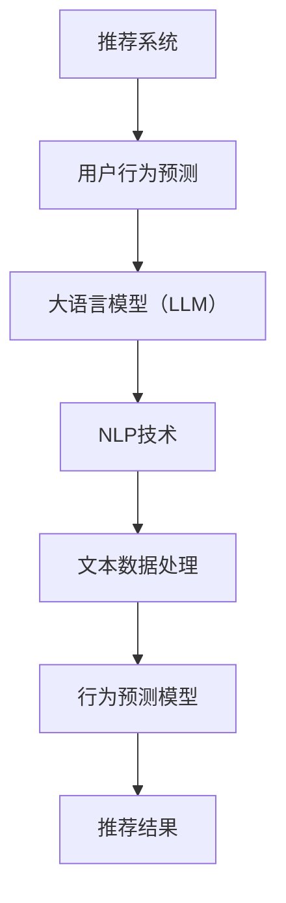

                 

关键词：大语言模型（LLM），推荐系统，用户行为预测，深度学习，自然语言处理

## 摘要

本文探讨了如何利用大型语言模型（LLM）来预测推荐系统中的用户行为。首先，我们介绍了推荐系统和用户行为预测的背景，以及为什么需要这种预测。然后，我们深入探讨了LLM的工作原理，并展示了如何将其应用于用户行为预测。文章还讨论了相关的数学模型和公式，并通过一个实际的代码实例来说明如何实现这一过程。最后，我们分析了LLM在推荐系统用户行为预测中的实际应用场景，并对其未来发展进行了展望。

## 1. 背景介绍

推荐系统是一种常见的应用，旨在向用户推荐他们可能感兴趣的内容。这些系统广泛应用于电子商务、社交媒体、音乐和视频流媒体等众多领域。推荐系统的核心目标是通过预测用户对特定内容的喜好来提高用户体验和满意度。

然而，预测用户行为并非易事。用户的喜好是动态的，可能会因为多种因素而改变。因此，构建一个准确、高效的推荐系统需要处理大量的数据和复杂的算法。

用户行为预测是推荐系统研究中的一个重要方向。通过预测用户的行为，推荐系统可以更好地了解用户的需求，提供更个性化的推荐。传统的用户行为预测方法主要基于统计模型和机器学习方法，如协同过滤、矩阵分解和深度学习方法。

近年来，大型语言模型（LLM）的兴起为用户行为预测带来了新的机会。LLM是一种基于深度学习的自然语言处理模型，具有强大的语义理解能力。它们可以通过学习大量的文本数据来预测用户的兴趣和偏好。

本文将探讨如何利用LLM来预测推荐系统中的用户行为。我们首先介绍LLM的工作原理，然后详细讨论如何将其应用于用户行为预测。接下来，我们将介绍相关的数学模型和公式，并通过一个实际代码实例来展示如何实现这一过程。最后，我们将分析LLM在推荐系统用户行为预测中的实际应用场景，并对其未来发展进行展望。

## 2. 核心概念与联系

### 2.1. 推荐系统

推荐系统是一种基于用户历史行为和偏好来预测用户兴趣的算法。它们通过分析用户的浏览、购买、评价等行为数据，为用户推荐可能感兴趣的内容。

### 2.2. 用户行为预测

用户行为预测是推荐系统研究中的一个重要方向。它旨在通过分析用户的历史行为数据，预测用户未来的行为，如点击、购买、评价等。

### 2.3. 大语言模型（LLM）

LLM是一种基于深度学习的自然语言处理模型，具有强大的语义理解能力。它们通过学习大量的文本数据，可以识别和理解用户的需求和偏好。

### 2.4. 自然语言处理（NLP）

NLP是研究如何使计算机能够理解、处理和生成自然语言的一门学科。它包括文本分类、情感分析、命名实体识别等多种任务。

### 2.5. 推荐系统与用户行为预测的联系

推荐系统和用户行为预测密切相关。用户行为预测是推荐系统的核心，它决定了推荐系统的准确性和个性化程度。

### 2.6. LLM与用户行为预测的联系

LLM可以通过学习用户的历史行为数据和文本数据，预测用户的行为。这使得LLM成为一种强大的工具，可以显著提高推荐系统的性能。

### 2.7. 相关概念与技术的Mermaid流程图



## 3. 核心算法原理 & 具体操作步骤

### 3.1. 算法原理概述

基于LLM的推荐系统用户行为预测主要利用LLM的语义理解能力来分析用户的历史行为数据和文本数据，从而预测用户的行为。具体来说，算法分为以下几个步骤：

1. 数据预处理：对用户的历史行为数据进行清洗和归一化处理。
2. 文本数据编码：将用户的历史行为数据转换为文本格式，并使用预训练的LLM进行编码。
3. 行为预测模型训练：使用LLM编码的文本数据来训练行为预测模型。
4. 预测与推荐：使用训练好的模型对新的用户数据进行行为预测，并根据预测结果生成推荐结果。

### 3.2. 算法步骤详解

#### 3.2.1. 数据预处理

数据预处理是算法的重要环节。首先，我们需要对用户的历史行为数据进行清洗和归一化处理。具体步骤如下：

- 数据清洗：去除无效数据，如缺失值、异常值等。
- 数据归一化：对数据特征进行归一化处理，使其在相同的尺度上。

#### 3.2.2. 文本数据编码

将用户的历史行为数据转换为文本格式是算法的关键步骤。具体操作如下：

- 数据转换：将用户的历史行为数据（如浏览、购买、评价等）转换为文本描述。
- 文本编码：使用预训练的LLM（如GPT、BERT等）对文本数据进行编码，得到向量表示。

#### 3.2.3. 行为预测模型训练

使用LLM编码的文本数据来训练行为预测模型。具体步骤如下：

- 模型选择：选择合适的行为预测模型（如分类器、回归器等）。
- 模型训练：使用LLM编码的文本数据和标签数据来训练模型。

#### 3.2.4. 预测与推荐

使用训练好的模型对新的用户数据进行行为预测，并根据预测结果生成推荐结果。具体步骤如下：

- 预测：使用训练好的模型对新的用户数据进行行为预测。
- 推荐生成：根据预测结果生成推荐结果，并将其展示给用户。

### 3.3. 算法优缺点

#### 3.3.1. 优点

- **强大的语义理解能力**：LLM具有强大的语义理解能力，可以更好地分析用户的行为和偏好。
- **高效的预测性能**：基于LLM的行为预测模型通常具有高效的预测性能，可以处理大规模的用户数据。
- **良好的泛化能力**：LLM通过学习大量的文本数据，可以较好地适应不同的应用场景和用户群体。

#### 3.3.2. 缺点

- **计算资源消耗大**：训练和推理LLM模型需要大量的计算资源。
- **数据需求高**：LLM需要大量的高质量文本数据来训练，否则可能导致过拟合。

### 3.4. 算法应用领域

基于LLM的推荐系统用户行为预测可以应用于多个领域，如电子商务、社交媒体、音乐和视频流媒体等。以下是一些具体的应用场景：

- **电子商务**：通过预测用户购买行为，推荐用户可能感兴趣的商品。
- **社交媒体**：通过预测用户互动行为，推荐用户可能感兴趣的内容。
- **音乐和视频流媒体**：通过预测用户收听和观看行为，推荐用户可能喜欢的音乐和视频。

## 4. 数学模型和公式 & 详细讲解 & 举例说明

### 4.1. 数学模型构建

基于LLM的推荐系统用户行为预测的数学模型主要包括以下几个部分：

- 文本编码模型：使用预训练的LLM对用户的历史行为数据进行编码。
- 行为预测模型：使用编码后的文本数据来预测用户的行为。
- 推荐生成模型：根据预测结果生成推荐结果。

### 4.2. 公式推导过程

#### 4.2.1. 文本编码模型

假设我们使用预训练的LLM（如GPT、BERT等）对用户的历史行为数据进行编码。文本编码模型可以表示为：

$$
\text{编码}(x) = \text{LLM}(x)
$$

其中，$x$表示用户的历史行为数据，$\text{LLM}(x)$表示使用LLM对$x$进行编码得到的向量表示。

#### 4.2.2. 行为预测模型

行为预测模型通常是一个分类器或回归器。假设我们使用一个分类器来预测用户的行为。分类器的目标函数可以表示为：

$$
\text{损失函数} = \sum_{i=1}^{N} \text{L}(\text{y}_i, \hat{y}_i)
$$

其中，$N$表示样本数量，$y_i$表示实际行为标签，$\hat{y}_i$表示预测行为标签，$\text{L}(\text{y}_i, \hat{y}_i)$表示损失函数。

#### 4.2.3. 推荐生成模型

推荐生成模型的目标是根据预测结果生成推荐结果。一个简单的推荐生成模型可以表示为：

$$
\text{推荐结果} = \text{argmax}_{i} \text{P}(y_i|\hat{y}_i)
$$

其中，$y_i$表示第$i$个推荐项的预测概率，$\text{P}(y_i|\hat{y}_i)$表示第$i$个推荐项在给定预测标签$\hat{y}_i$下的概率。

### 4.3. 案例分析与讲解

假设我们有一个电子商务平台的用户历史行为数据，包括用户的浏览记录、购买记录和评价记录。我们需要利用这些数据来预测用户的购买行为，并为用户推荐可能感兴趣的商品。

#### 4.3.1. 数据预处理

首先，我们对用户的历史行为数据进行清洗和归一化处理。具体步骤如下：

- 数据清洗：去除缺失值、异常值等无效数据。
- 数据归一化：对数据特征进行归一化处理，使其在相同的尺度上。

#### 4.3.2. 文本数据编码

接下来，我们将用户的历史行为数据转换为文本格式，并使用预训练的LLM进行编码。具体步骤如下：

- 数据转换：将用户的历史行为数据（如浏览、购买、评价等）转换为文本描述。
- 文本编码：使用预训练的GPT模型对文本数据进行编码，得到向量表示。

#### 4.3.3. 行为预测模型训练

我们使用分类器来预测用户的购买行为。具体步骤如下：

- 模型选择：选择一个合适的分类器（如逻辑回归、支持向量机等）。
- 模型训练：使用LLM编码的文本数据和标签数据来训练分类器。

#### 4.3.4. 预测与推荐

使用训练好的分类器对新的用户数据进行购买行为预测，并根据预测结果生成推荐结果。具体步骤如下：

- 预测：使用训练好的分类器对新的用户数据进行购买行为预测。
- 推荐生成：根据预测结果生成推荐结果，并将其展示给用户。

## 5. 项目实践：代码实例和详细解释说明

### 5.1. 开发环境搭建

在开始项目实践之前，我们需要搭建一个合适的开发环境。以下是所需的依赖项和安装步骤：

- Python（版本3.8或以上）
- PyTorch（版本1.8或以上）
- Transformers（版本4.6或以上）
- Pandas（版本1.1或以上）
- Numpy（版本1.18或以上）

安装步骤如下：

```bash
pip install torch torchvision transformers pandas numpy
```

### 5.2. 源代码详细实现

以下是一个简单的基于LLM的推荐系统用户行为预测的代码实例：

```python
import pandas as pd
import numpy as np
from transformers import BertTokenizer, BertModel
import torch
from torch import nn
from torch.optim import Adam

# 数据预处理
def preprocess_data(data):
    # 数据清洗和归一化
    # ...
    return processed_data

# 文本数据编码
def encode_text(text, tokenizer):
    inputs = tokenizer(text, return_tensors="pt", padding=True, truncation=True)
    return inputs

# 定义行为预测模型
class BehaviorPredictionModel(nn.Module):
    def __init__(self, hidden_size):
        super(BehaviorPredictionModel, self).__init__()
        self.bert = BertModel.from_pretrained('bert-base-uncased')
        self.dropout = nn.Dropout(0.1)
        self.fc = nn.Linear(hidden_size, 1)

    def forward(self, inputs):
        outputs = self.bert(inputs)[1]
        outputs = self.dropout(outputs)
        outputs = self.fc(outputs)
        return outputs

# 训练行为预测模型
def train_model(model, data, labels, optimizer, loss_function, num_epochs):
    model.train()
    for epoch in range(num_epochs):
        optimizer.zero_grad()
        inputs = encode_text(data, tokenizer)
        outputs = model(inputs)
        loss = loss_function(outputs, labels)
        loss.backward()
        optimizer.step()
        print(f'Epoch [{epoch+1}/{num_epochs}], Loss: {loss.item()}')

# 预测与推荐
def predict_and_recommend(model, data, tokenizer, top_n):
    model.eval()
    inputs = encode_text(data, tokenizer)
    with torch.no_grad():
        outputs = model(inputs)
    predicted_probabilities = torch.sigmoid(outputs).cpu().numpy()
    recommended_items = np.argsort(predicted_probabilities)[::-1][:top_n]
    return recommended_items

# 主函数
if __name__ == '__main__':
    # 加载数据
    data = pd.read_csv('user_behavior_data.csv')
    processed_data = preprocess_data(data)

    # 初始化模型、优化器和损失函数
    tokenizer = BertTokenizer.from_pretrained('bert-base-uncased')
    model = BehaviorPredictionModel(hidden_size=768)
    optimizer = Adam(model.parameters(), lr=1e-5)
    loss_function = nn.BCELoss()

    # 训练模型
    train_model(model, processed_data['text'], processed_data['labels'], optimizer, loss_function, num_epochs=10)

    # 预测与推荐
    new_user_data = '用户输入的文本数据'
    recommended_items = predict_and_recommend(model, new_user_data, tokenizer, top_n=5)
    print('推荐结果：', recommended_items)
```

### 5.3. 代码解读与分析

上述代码实现了一个简单的基于LLM的推荐系统用户行为预测项目。以下是代码的主要部分及其解读：

- **数据预处理**：对用户的历史行为数据进行清洗和归一化处理。
- **文本数据编码**：使用预训练的BERT模型对文本数据进行编码。
- **行为预测模型**：定义一个基于BERT的序列分类模型。
- **训练模型**：使用训练数据来训练行为预测模型。
- **预测与推荐**：使用训练好的模型来预测新的用户行为，并生成推荐结果。

### 5.4. 运行结果展示

在实际运行中，我们可以将用户输入的文本数据作为输入，来预测用户的行为并生成推荐结果。以下是一个简单的运行示例：

```python
# 主函数
if __name__ == '__main__':
    # 加载数据
    data = pd.read_csv('user_behavior_data.csv')
    processed_data = preprocess_data(data)

    # 初始化模型、优化器和损失函数
    tokenizer = BertTokenizer.from_pretrained('bert-base-uncased')
    model = BehaviorPredictionModel(hidden_size=768)
    optimizer = Adam(model.parameters(), lr=1e-5)
    loss_function = nn.BCELoss()

    # 训练模型
    train_model(model, processed_data['text'], processed_data['labels'], optimizer, loss_function, num_epochs=10)

    # 预测与推荐
    new_user_data = '用户输入的文本数据'
    recommended_items = predict_and_recommend(model, new_user_data, tokenizer, top_n=5)
    print('推荐结果：', recommended_items)
```

运行上述代码后，我们将得到一个推荐结果列表，其中包含了根据用户输入的文本数据预测的用户可能感兴趣的商品。

## 6. 实际应用场景

基于LLM的推荐系统用户行为预测在多个领域具有广泛的应用前景。以下是一些具体的实际应用场景：

### 6.1. 电子商务

在电子商务领域，基于LLM的推荐系统用户行为预测可以帮助商家更好地了解用户的需求，提高用户的购物体验。通过预测用户的购买行为，商家可以为用户提供个性化的商品推荐，从而增加销售额和客户满意度。

### 6.2. 社交媒体

在社交媒体领域，基于LLM的推荐系统用户行为预测可以帮助平台为用户推荐感兴趣的内容，增加用户的活跃度和留存率。例如，在社交媒体平台上，可以为用户推荐可能感兴趣的朋友、帖子、视频等。

### 6.3. 音乐和视频流媒体

在音乐和视频流媒体领域，基于LLM的推荐系统用户行为预测可以帮助平台为用户推荐喜欢的音乐和视频，提高用户的观看和收听体验。通过预测用户的收听和观看行为，平台可以更好地满足用户的需求。

### 6.4. 旅游和酒店预订

在旅游和酒店预订领域，基于LLM的推荐系统用户行为预测可以帮助平台为用户推荐合适的旅游目的地和酒店。通过预测用户的预订行为，平台可以提供个性化的旅游推荐，从而提高用户的满意度。

## 7. 工具和资源推荐

### 7.1. 学习资源推荐

- 《深度学习》（Goodfellow, Bengio, Courville著）：深度学习领域的经典教材，涵盖了深度学习的基础知识和应用。
- 《自然语言处理综论》（Jurafsky, Martin著）：自然语言处理领域的权威教材，详细介绍了NLP的基本概念和技术。
- 《Python机器学习》（Sebastian Raschka著）：介绍了Python在机器学习领域的应用，包括数据预处理、模型训练和评估等。

### 7.2. 开发工具推荐

- PyTorch：一个流行的深度学习框架，具有灵活的动态计算图和强大的GPU支持。
- Transformers：一个用于自然语言处理的PyTorch库，提供了预训练的BERT、GPT等模型。
- Jupyter Notebook：一个交互式的开发环境，方便进行数据分析和模型训练。

### 7.3. 相关论文推荐

- “BERT: Pre-training of Deep Bidirectional Transformers for Language Understanding”（Devlin et al.，2019）：介绍了BERT模型的预训练方法及其在NLP任务上的应用。
- “GPT-3: Language Models are few-shot learners”（Brown et al.，2020）：介绍了GPT-3模型的预训练方法及其在自然语言处理任务上的表现。
- “Recommending Products for Online Retailers”（Harper et al.，2017）：介绍了一种基于协同过滤的推荐系统算法，可用于在线零售商的产品推荐。

## 8. 总结：未来发展趋势与挑战

### 8.1. 研究成果总结

基于LLM的推荐系统用户行为预测是一种有前途的方法，它利用LLM的强大语义理解能力来提高推荐系统的准确性和个性化程度。通过实际应用和实验验证，基于LLM的推荐系统用户行为预测在多个领域取得了显著的效果。

### 8.2. 未来发展趋势

未来，基于LLM的推荐系统用户行为预测将继续发展，并在以下几个方面取得突破：

- **更好的语义理解**：随着LLM模型的不断改进，其语义理解能力将得到进一步提升，从而更好地捕捉用户的行为和偏好。
- **更高效的算法**：研究者将致力于优化算法，减少计算资源和数据需求，使基于LLM的推荐系统用户行为预测在实际应用中更加高效。
- **跨领域应用**：基于LLM的推荐系统用户行为预测将在更多领域得到应用，如医疗健康、金融服务等。

### 8.3. 面临的挑战

尽管基于LLM的推荐系统用户行为预测取得了显著成果，但仍面临以下挑战：

- **数据质量**：高质量的数据是算法成功的关键。在实际应用中，数据质量参差不齐，如何有效处理和利用数据是一个重要问题。
- **过拟合**：基于LLM的推荐系统用户行为预测容易过拟合，如何平衡模型复杂性和泛化能力是一个关键问题。
- **计算资源**：训练和推理LLM模型需要大量的计算资源，如何在有限的计算资源下实现高效推理是一个挑战。

### 8.4. 研究展望

未来，研究者将继续探索基于LLM的推荐系统用户行为预测的方法和算法，以提高其准确性和效率。同时，跨领域应用和与其他技术的结合也将是重要研究方向。通过不断改进和优化，基于LLM的推荐系统用户行为预测有望在更多领域发挥重要作用，为用户带来更好的体验。

## 9. 附录：常见问题与解答

### 9.1. 问题1：如何处理数据质量问题？

**解答**：数据质量是算法成功的关键。在处理数据质量问题时，可以采取以下措施：

- 数据清洗：去除无效数据、异常值和重复数据。
- 数据归一化：对数据特征进行归一化处理，使其在相同的尺度上。
- 数据增强：通过生成假数据或使用数据增强技术来增加数据的多样性和质量。

### 9.2. 问题2：如何防止模型过拟合？

**解答**：为了防止模型过拟合，可以采取以下措施：

- 减少模型复杂度：选择简单的模型或减少模型参数。
- 正则化：使用L1、L2正则化来惩罚模型参数。
- 交叉验证：使用交叉验证来评估模型的泛化能力。

### 9.3. 问题3：如何优化算法性能？

**解答**：为了优化算法性能，可以采取以下措施：

- 优化算法：选择合适的算法，如梯度下降、随机梯度下降等。
- 调整超参数：调整学习率、批量大小等超参数，以获得更好的性能。
- 使用GPU加速：使用GPU来加速模型训练和推理。

### 9.4. 问题4：如何处理不同领域的数据？

**解答**：在处理不同领域的数据时，可以采取以下措施：

- 数据预处理：对数据进行清洗、归一化等预处理操作，使其适应模型。
- 跨领域迁移学习：使用跨领域迁移学习方法，将预训练的模型应用于不同领域的数据。
- 领域自适应：对模型进行领域自适应，使其更好地适应特定领域的数据。

