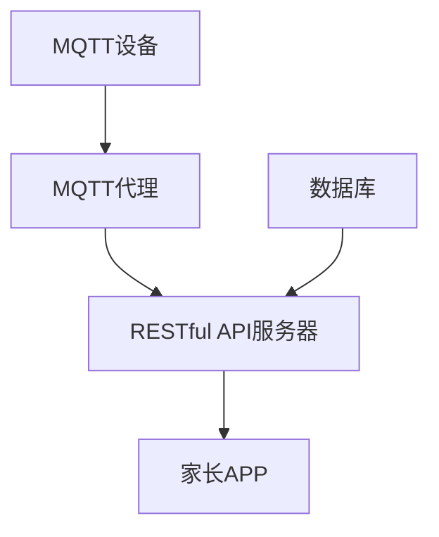

                 

关键词：MQTT协议，RESTful API，智能家居，婴幼儿看护，物联网，安全性，用户体验

## 摘要

本文将探讨一种基于MQTT协议和RESTful API的婴幼儿看护智能家居解决方案。随着物联网技术的快速发展，智能家居已经成为了现代家庭生活中不可或缺的一部分。特别是对于婴幼儿看护，智能设备的引入极大地提升了家长对婴幼儿的监控和照护能力。本文将详细描述该解决方案的核心概念、架构设计、算法原理、数学模型、项目实践以及未来的应用前景。

## 1. 背景介绍

### 智能家居的发展

智能家居技术起源于20世纪90年代，随着计算机和通信技术的进步，智能家居产品逐渐进入普通家庭。近年来，物联网（IoT）技术的迅猛发展，使得智能家居产品在性能、功能和应用范围上取得了显著提升。智能家居不仅仅局限于提供便利的生活体验，还在提升安全性、能源效率等方面发挥着重要作用。

### 婴幼儿看护的需求

婴幼儿是家庭中的特殊群体，他们的安全与健康是家长最为关心的问题。传统的看护方式往往依赖于人工监控，存在一定的局限性和风险。随着智能家居技术的进步，通过智能设备实时监控婴幼儿的状态，成为了一种更加便捷、高效且安全的选择。

### MQTT协议与RESTful API

MQTT（Message Queuing Telemetry Transport）是一种轻量级的消息队列协议，广泛用于物联网设备之间的通信。其特点包括低功耗、可靠性高、可扩展性强，非常适合智能家居环境中的实时数据传输。

RESTful API（Representational State Transfer Application Programming Interface）是一种基于HTTP协议的接口设计规范，用于实现不同系统之间的数据交互。它具有简单、灵活、可扩展的优点，能够很好地支持物联网设备的集成与应用。

## 2. 核心概念与联系

### MQTT协议原理

MQTT协议是基于发布/订阅（Publish/Subscribe）模式的，它允许设备发布消息到特定的主题，其他设备可以订阅这些主题以接收消息。其工作流程如下：

1. **连接与认证**：设备连接到MQTT代理（Broker），并提供用户名和密码进行认证。
2. **发布消息**：设备将消息发布到特定的主题。
3. **订阅主题**：设备订阅感兴趣的主题，以便接收相关的消息。
4. **消息传输**：MQTT代理负责将消息传输给订阅者。

### RESTful API架构

RESTful API是一种基于HTTP协议的接口设计规范，其核心思想是资源的操作通过URL进行映射，常用的HTTP方法包括GET、POST、PUT、DELETE等。RESTful API的工作流程如下：

1. **请求发送**：客户端通过HTTP请求向服务器发送数据。
2. **处理请求**：服务器解析请求，根据请求类型和URL调用相应的处理逻辑。
3. **响应返回**：服务器处理完请求后，将结果以JSON或XML格式返回给客户端。

### 智能家居解决方案架构

基于MQTT协议和RESTful API的婴幼儿看护智能家居解决方案架构如图1所示：



图1：智能家居解决方案架构图

**MQTT设备**：用于采集婴幼儿的实时数据，如心率、体温、睡眠状态等，通过MQTT协议将数据发送到MQTT代理。

**MQTT代理**：负责消息的接收、路由和分发，确保数据能够准确地传输到订阅者。

**RESTful API服务器**：提供数据存储和处理功能，通过RESTful API与家长APP进行交互。

**家长APP**：家长通过APP实时监控婴幼儿的状态，并能够通过API进行远程操作。

**数据库**：用于存储婴幼儿的历史数据和配置信息。

## 3. 核心算法原理 & 具体操作步骤

### 3.1 算法原理概述

该解决方案的核心算法主要包括数据采集、数据传输、数据处理和决策执行等环节。

**数据采集**：利用传感器采集婴幼儿的生理参数，如心率、体温等。

**数据传输**：通过MQTT协议将采集到的数据发送到MQTT代理。

**数据处理**：RESTful API服务器对数据进行处理，如异常检测、趋势分析等。

**决策执行**：根据处理结果，执行相应的操作，如发送警报、调整环境参数等。

### 3.2 算法步骤详解

1. **数据采集**：传感器将采集到的数据发送到MQTT设备。
2. **数据传输**：MQTT设备将数据发布到MQTT代理。
3. **数据处理**：RESTful API服务器接收到数据后，进行预处理，如去噪、归一化等，然后存储到数据库。
4. **异常检测**：通过算法模型对数据进行实时分析，检测是否存在异常情况。
5. **决策执行**：如果检测到异常，根据预设的规则，执行相应的操作，如发送警报到家长APP、调整环境参数等。

### 3.3 算法优缺点

**优点**：

- **实时性**：基于MQTT协议的实时数据传输，能够确保数据的实时性和准确性。
- **灵活性**：基于RESTful API的设计，可以方便地扩展和集成不同的服务和设备。
- **可靠性**：MQTT协议具有良好的容错性和重传机制，确保数据传输的可靠性。

**缺点**：

- **安全性**：由于智能家居系统涉及敏感的个人信息，需要特别关注数据传输过程中的安全性。
- **性能瓶颈**：随着设备数量的增加，MQTT代理和RESTful API服务器的性能可能会成为瓶颈。

### 3.4 算法应用领域

- **婴幼儿看护**：实时监控婴幼儿的生理参数，提供安全看护。
- **医疗健康**：辅助医生进行患者监控，提供个性化的治疗方案。
- **智能家居**：实现家居设备之间的智能联动，提升生活品质。

## 4. 数学模型和公式 & 详细讲解 & 举例说明

### 4.1 数学模型构建

为了实现婴幼儿状态的实时监控，我们构建了一个基于贝叶斯理论的异常检测模型。贝叶斯理论是一种概率理论，可以用于推断某个事件是否发生。

### 4.2 公式推导过程

设事件A为“婴幼儿状态异常”，事件B为“传感器采集到异常数据”。根据贝叶斯定理，有：

$$
P(A|B) = \frac{P(B|A) \cdot P(A)}{P(B)}
$$

其中，$P(A)$为事件A发生的概率，$P(B|A)$为在事件A发生时，事件B发生的条件概率，$P(B)$为事件B发生的概率。

### 4.3 案例分析与讲解

假设我们想检测婴幼儿的心率异常。根据历史数据，婴幼儿正常心率范围为100-160次/分钟，超过或低于此范围可视为异常。

1. **计算概率**：

   $P(A)$：正常心率的概率为0.95，异常心率的概率为0.05。

   $P(B|A)$：在正常心率发生时，传感器检测到异常数据的概率为0.02。

   $P(B)$：在正常心率发生时，传感器检测到异常数据或者异常心率发生时，传感器检测到异常数据的总概率。

   $P(B|A) \cdot P(A) + P(B|\neg A) \cdot P(\neg A) = 0.02 \cdot 0.95 + 1 \cdot 0.05 = 0.102$

2. **计算条件概率**：

   $P(A|B) = \frac{P(B|A) \cdot P(A)}{P(B)} = \frac{0.02 \cdot 0.95}{0.102} \approx 0.185$

   也就是说，当传感器检测到异常数据时，婴幼儿心率异常的概率为18.5%。

通过这样的计算，我们可以实现对婴幼儿心率异常的初步判断，进而采取相应的措施。

## 5. 项目实践：代码实例和详细解释说明

### 5.1 开发环境搭建

1. **硬件环境**：

   - MQTT设备：基于ESP8266或ESP32的物联网开发板。
   - 传感器模块：心率传感器、温度传感器、运动传感器等。

2. **软件环境**：

   - MQTT代理：使用 Mosquitto。
   - RESTful API服务器：使用 Spring Boot。
   - 数据库：使用 MySQL。

### 5.2 源代码详细实现

1. **MQTT设备代码**：

   MQTT设备主要负责采集传感器数据，并将数据发送到MQTT代理。

   ```java
   import org.eclipse.paho.client.mqttv3.*;

   public class MqttDevice {
       private MqttClient mqttClient;
       private String topic;

       public MqttDevice(String brokerUrl, String clientId, String topic) {
           this.topic = topic;
           try {
               this.mqttClient = new MqttClient(brokerUrl, clientId);
               MqttConnectOptions options = new MqttConnectOptions();
               options.setCleanSession(true);
               mqttClient.connect(options);
               mqttClient.setCallback(new MqttCallback() {
                   @Override
                   public void connectionLost(Throwable cause) {
                       System.out.println("连接丢失：" + cause.getMessage());
                   }

                   @Override
                   public void messageArrived(String topic, MqttMessage message) throws Exception {
                       System.out.println("收到消息：" + topic + " - " + new String(message.getPayload()));
                   }

                   @Override
                   public void deliveryComplete(IMqttDeliveryToken token) {
                       System.out.println("消息发送完成：" + token.getMessage());
                   }
               });
           } catch (Exception e) {
               e.printStackTrace();
           }
       }

       public void sendData(String data) {
           try {
               mqttClient.publish(topic, data.getBytes());
           } catch (MqttException e) {
               e.printStackTrace();
           }
       }
   }
   ```

2. **RESTful API服务器代码**：

   RESTful API服务器主要负责接收MQTT代理发送的数据，并进行处理。

   ```java
   import org.springframework.boot.SpringApplication;
   import org.springframework.boot.autoconfigure.SpringBootApplication;
   import org.springframework.web.bind.annotation.*;

   @SpringBootApplication
   public class Application {
       public static void main(String[] args) {
           SpringApplication.run(Application.class, args);
       }
   }

   @RestController
   public class SensorDataController {
       @PostMapping("/data")
       public String receiveData(@RequestBody String data) {
           // 处理数据
           System.out.println("接收到的数据：" + data);
           // 存储数据到数据库
           // ...
           return "收到数据";
       }
   }
   ```

### 5.3 代码解读与分析

**MQTT设备代码**：

该代码实现了MQTT设备的主体功能，包括连接到MQTT代理、发布数据、接收消息和处理连接丢失。

**RESTful API服务器代码**：

该代码实现了RESTful API服务器的基本功能，包括接收HTTP请求、处理数据存储和返回响应。

### 5.4 运行结果展示

运行MQTT设备和RESTful API服务器后，可以通过以下步骤进行测试：

1. **启动MQTT代理**：

   ```shell
   mosquitto_sub -t 'sensor/data' -v
   ```

2. **启动RESTful API服务器**：

   ```shell
   java -jar spring-boot-api-server.jar
   ```

3. **发送数据到MQTT代理**：

   ```shell
   mosquitto_pub -t 'sensor/data' -m '{"heart_rate": 150, "temperature": 36.5}'
   ```

4. **查看RESTful API服务器的控制台输出**：

   ```shell
   curl -X POST -H "Content-Type: application/json" -d '{"heart_rate": 150, "temperature": 36.5}' http://localhost:8080/data
   ```

输出结果应为“收到数据”，表示数据已成功接收和处理。

## 6. 实际应用场景

### 6.1 婴幼儿看护

基于MQTT协议和RESTful API的智能家居解决方案在婴幼儿看护中有着广泛的应用。通过传感器实时监控婴幼儿的心率、体温等生理参数，家长可以随时了解婴幼儿的健康状况，并能够通过APP接收异常警报，及时采取措施。

### 6.2 医疗健康

该解决方案还可以应用于医疗健康领域，如患者监控。通过传感器和物联网设备，医生可以实时了解患者的生理参数，进行远程诊断和治疗，提高医疗服务的质量和效率。

### 6.3 智能家居

在智能家居领域，该解决方案可以实现各种设备的智能联动，如智能灯、窗帘、空调等，根据家庭成员的需求和环境变化自动调整，提升生活品质。

## 7. 工具和资源推荐

### 7.1 学习资源推荐

- 《物联网技术与应用》
- 《RESTful API设计最佳实践》
- 《智能家居系统设计》

### 7.2 开发工具推荐

- Eclipse Paho MQTT客户端库
- Spring Boot
- MySQL

### 7.3 相关论文推荐

- "MQTT: A Protocol for Efficient Mobile From Sensor to Cloud Communication"
- "RESTful API Design Rule 23: Declare Summary Endpoints"
- "Smart Home IoT: A Systematic Literature Review"

## 8. 总结：未来发展趋势与挑战

### 8.1 研究成果总结

本文提出了基于MQTT协议和RESTful API的婴幼儿看护智能家居解决方案，通过传感器实时监控婴幼儿的状态，提高了家长对婴幼儿的监控和照护能力。通过数学模型和算法，实现了对数据的实时处理和异常检测，为智能家居系统的安全性和可靠性提供了保障。

### 8.2 未来发展趋势

随着物联网技术的不断进步，智能家居解决方案将更加智能化、个性化。未来的发展趋势包括：

- **更高性能的传感器**：提高传感器精度和灵敏度，实现更精准的监控。
- **更智能的算法**：结合人工智能技术，实现更加智能的数据分析和决策。
- **更安全的数据传输**：加强数据传输过程中的安全性，保护用户隐私。

### 8.3 面临的挑战

- **数据安全和隐私保护**：智能家居系统涉及敏感的个人信息，需要特别关注数据传输和存储过程中的安全性。
- **系统性能瓶颈**：随着设备数量的增加，系统性能可能会成为瓶颈，需要优化架构和算法。

### 8.4 研究展望

未来，我们将进一步研究如何利用人工智能技术提升智能家居解决方案的智能水平，同时关注数据安全和隐私保护问题，为用户提供更加安全、可靠、智能的智能家居体验。

## 9. 附录：常见问题与解答

### 9.1 MQTT协议的优势是什么？

MQTT协议具有低功耗、可靠性高、可扩展性强等特点，特别适合物联网设备之间的通信。

### 9.2 RESTful API的优势是什么？

RESTful API具有简单、灵活、可扩展的优点，能够很好地支持物联网设备的集成与应用。

### 9.3 如何确保智能家居系统的安全性？

通过加强数据传输和存储过程中的加密和认证，确保系统的安全性。

### 9.4 如何处理大量传感器数据？

通过分布式计算和大数据技术，实现对大量传感器数据的实时处理和分析。

