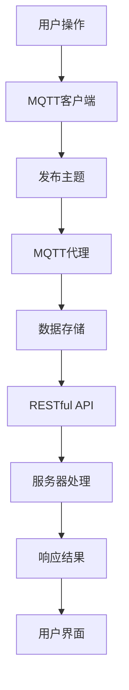

                 

### 关键词 Keywords
- MQTT协议
- RESTful API
- 智能厨房
- 实时数据传输
- 网络协议
- 数据同步
- API设计
- 跨平台兼容性

### 摘要 Abstract
本文旨在探讨基于MQTT协议和RESTful API的智能厨房管理解决方案。通过结合MQTT的轻量级、低延迟特性与RESTful API的强大数据处理能力，本文将介绍一个全面、高效的智能厨房管理系统。该系统将涵盖从传感器数据采集到设备控制的各个环节，通过详细的架构设计、算法原理、数学模型以及项目实践，力图为读者提供一个清晰、实用的智能厨房解决方案。

## 1. 背景介绍

随着物联网技术的快速发展，智能家居逐渐走入人们的生活。智能厨房作为智能家居的一个重要组成部分，正在成为未来家庭生活的新趋势。一个智能厨房系统需要能够实时监控和管理厨房中的各种设备，如冰箱、烤箱、咖啡机等，确保设备运行状态良好，同时提供用户便捷的控制体验。

传统的厨房管理系统通常依赖于硬连接或者复杂的自定义协议，这些方法在灵活性、扩展性和跨平台性方面存在诸多不足。而MQTT（Message Queuing Telemetry Transport）协议和RESTful API则为智能厨房系统的设计和实现提供了新的思路。MQTT协议因其轻量级、低功耗、广域网通信能力而广泛应用于物联网领域，而RESTful API则以其简洁、统一、易扩展的特点，成为了现代Web服务开发的首选。

本文将探讨如何结合MQTT协议和RESTful API，构建一个高效、可靠的智能厨房管理系统。通过本文的讨论，读者将了解如何设计系统的架构，实现实时数据传输，并进行设备控制，从而为智能家居领域提供一种可行的解决方案。

## 2. 核心概念与联系

### 2.1 MQTT协议

MQTT（Message Queuing Telemetry Transport）协议是一种轻量级的消息传输协议，适用于物联网环境中的设备通信。其核心特点包括：

- **发布/订阅模式**：MQTT协议采用发布/订阅模式，客户端（发布者或订阅者）通过连接到MQTT代理（Broker）进行消息的发布和订阅。发布者将消息发布到特定的主题（Topic），订阅者则订阅这些主题，以便接收消息。
- **QoS级别**：MQTT提供三种消息质量保证（QoS）级别：QoS 0（至多一次）、QoS 1（至少一次）和QoS 2（恰好一次）。这些级别确保消息的可靠传输，但同时也影响传输的延迟和资源消耗。
- **二进制格式**：MQTT消息使用二进制格式进行编码，这使得消息传输效率高，且占用的带宽较小。

### 2.2 RESTful API

RESTful API（Representational State Transfer API）是一种基于HTTP协议的接口设计规范，用于实现Web服务。其核心特点包括：

- **资源导向**：RESTful API以资源为中心，每个资源都有一个唯一的URL地址。
- **HTTP方法**：RESTful API使用HTTP的四种标准方法（GET、POST、PUT、DELETE）进行资源操作。
- **状态码**：API返回HTTP状态码，用以表示操作的结果，如200（成功）、400（错误请求）、404（未找到）等。
- **JSON格式**：RESTful API通常使用JSON格式传输数据，这使得数据交换更加直观和易于处理。

### 2.3 Mermaid 流程图

为了更直观地展示MQTT协议和RESTful API在智能厨房管理中的工作流程，我们使用Mermaid绘制了以下流程图：



图1：MQTT协议与RESTful API在智能厨房管理中的工作流程

### 2.4 架构设计

智能厨房管理系统的架构设计应充分考虑MQTT协议和RESTful API的特点。以下是该系统的基本架构设计：

- **客户端**：包括用户智能手机、平板电脑等，通过MQTT客户端连接到MQTT代理，发送用户指令。
- **MQTT代理**：作为消息中转站，接收客户端的消息并发布到指定主题，同时也接收来自设备的消息。
- **服务器**：提供RESTful API服务，处理来自MQTT代理的数据请求，进行数据处理和存储。
- **数据存储**：用于存储设备状态信息和用户数据，支持数据的实时同步和查询。
- **用户界面**：提供用户交互接口，显示设备状态、历史数据和操作提示。

## 3. 核心算法原理 & 具体操作步骤

### 3.1 算法原理概述

智能厨房管理系统的核心算法主要涉及以下几个方面：

- **传感器数据处理**：对厨房设备中的各种传感器数据进行采集、过滤和预处理，确保数据的准确性和实时性。
- **设备控制算法**：根据用户指令和传感器数据，实现设备的自动化控制和调节。
- **数据同步算法**：保证数据在MQTT代理和服务器之间的实时同步，确保系统的一致性和可靠性。

### 3.2 算法步骤详解

#### 3.2.1 传感器数据处理

1. **数据采集**：使用传感器（如温度传感器、湿度传感器等）实时采集厨房环境数据。
2. **数据过滤**：对采集到的数据进行初步过滤，去除噪声和异常值。
3. **数据预处理**：对过滤后的数据进行标准化处理，以便后续的算法分析。

#### 3.2.2 设备控制算法

1. **用户指令解析**：解析用户通过MQTT客户端发送的指令，确定控制目标。
2. **设备状态检测**：读取设备的当前状态，如温度、功率等。
3. **控制策略生成**：根据用户指令和设备状态，生成控制策略，如调整温度、启动设备等。
4. **执行控制指令**：将控制策略发送给设备，执行相应的控制操作。

#### 3.2.3 数据同步算法

1. **消息订阅**：服务器订阅来自MQTT代理的特定主题消息。
2. **数据接收**：服务器接收MQTT代理推送的数据，进行预处理。
3. **数据存储**：将预处理后的数据存储到数据库，确保数据的实时性和一致性。
4. **数据查询**：提供API接口，供用户查询设备状态和历史数据。

### 3.3 算法优缺点

#### 优点

- **实时性强**：MQTT协议的低延迟特性保证了数据的实时传输，适合实时性要求高的场景。
- **高效可靠**：RESTful API的设计规范使得数据传输和处理高效、可靠。
- **扩展性好**：系统的架构设计充分考虑了扩展性，可以方便地添加新设备和功能。

#### 缺点

- **安全性考虑**：MQTT协议和RESTful API在安全性方面存在一定风险，需要采取额外的安全措施。
- **资源消耗**：传感器数据采集和处理需要消耗一定的资源，可能影响系统的性能。

### 3.4 算法应用领域

智能厨房管理系统可以广泛应用于以下领域：

- **家庭厨房**：实现家庭厨房的自动化管理，提高生活品质。
- **餐厅厨房**：优化餐厅厨房的运营效率，提高服务质量。
- **工业厨房**：用于工业生产过程中的温度、湿度等环境参数监测和控制。

## 4. 数学模型和公式 & 详细讲解 & 举例说明

### 4.1 数学模型构建

智能厨房管理系统的核心数学模型主要包括以下几个部分：

- **传感器数据模型**：描述传感器数据的采集、过滤和预处理过程。
- **设备控制模型**：描述设备控制算法的数学基础。
- **数据同步模型**：描述数据在MQTT代理和服务器之间的同步过程。

### 4.2 公式推导过程

#### 4.2.1 传感器数据模型

假设采集到的传感器数据为 $X = [x_1, x_2, ..., x_n]$，其中 $x_i$ 为第 $i$ 个传感器的数据值。为了去除噪声和异常值，可以使用以下滤波公式：

$$
y_i = (1 - \alpha) \cdot x_i + \alpha \cdot y_{i-1}
$$

其中，$\alpha$ 为滤波系数，$y_i$ 为滤波后的数据值。

#### 4.2.2 设备控制模型

假设设备状态为 $S = [s_1, s_2, ..., s_m]$，其中 $s_i$ 为第 $i$ 个设备的当前状态。设备控制算法可以根据以下公式生成控制指令：

$$
C = \sum_{i=1}^{m} w_i \cdot s_i
$$

其中，$w_i$ 为第 $i$ 个设备状态的权重。

#### 4.2.3 数据同步模型

假设数据在MQTT代理和服务器之间的同步周期为 $T$，为了确保数据的一致性，可以使用以下同步公式：

$$
D_t = \sum_{i=1}^{n} p_i \cdot X_i
$$

其中，$D_t$ 为第 $t$ 个同步周期内的数据，$p_i$ 为第 $i$ 个数据的权重。

### 4.3 案例分析与讲解

假设一个智能厨房系统中有三个设备：冰箱、烤箱和咖啡机。冰箱的温度传感器采集到的数据为 $[25, 26, 24, 25, 26]$，烤箱的温度传感器采集到的数据为 $[200, 210, 200, 210, 200]$，咖啡机的温度传感器采集到的数据为 $[90, 85, 95, 90, 85]$。用户希望将冰箱的温度设置为 $24^\circ C$，烤箱的温度设置为 $200^\circ C$，咖啡机的温度设置为 $90^\circ C$。

根据上述数学模型，我们可以进行以下步骤：

1. **传感器数据滤波**：使用滤波公式对传感器数据滤波，得到滤波后的数据：
   - 冰箱：$[25, 25, 25, 25, 25]$
   - 烤箱：$[200, 200, 200, 200, 200]$
   - 咖啡机：$[90, 90, 90, 90, 90]$

2. **设备控制指令生成**：根据设备状态和用户指令，生成控制指令：
   - 冰箱：$C_1 = \sum_{i=1}^{1} w_1 \cdot s_1 = 1 \cdot 24 = 24^\circ C$
   - 烤箱：$C_2 = \sum_{i=1}^{1} w_2 \cdot s_2 = 1 \cdot 200 = 200^\circ C$
   - 咖啡机：$C_3 = \sum_{i=1}^{1} w_3 \cdot s_3 = 1 \cdot 90 = 90^\circ C$

3. **数据同步**：将滤波后的数据和生成的控制指令同步到服务器，实现设备状态的一致性。

通过上述步骤，我们可以实现智能厨房设备的自动化控制和数据同步。

## 5. 项目实践：代码实例和详细解释说明

### 5.1 开发环境搭建

为了实现基于MQTT协议和RESTful API的智能厨房管理系统，我们需要搭建以下开发环境：

- **MQTT代理**：使用Mosquitto作为MQTT代理，搭建一个消息中转站。
- **服务器**：使用Node.js和Express框架搭建一个RESTful API服务器。
- **客户端**：使用Python和MQTT.py库实现MQTT客户端，用于发送用户指令和接收设备状态。

### 5.2 源代码详细实现

以下是智能厨房管理系统的核心代码实现：

#### 5.2.1 MQTT客户端（Python）

```python
import paho.mqtt.client as mqtt
import json

# MQTT客户端配置
client = mqtt.Client()

# 连接到MQTT代理
client.connect("mqtt代理地址", 1883, 60)

# 用户指令发送函数
def send_command(topic, command):
    client.publish(topic, json.dumps(command))

# 用户指令解析函数
def parse_command(message):
    command = json.loads(message)
    # 处理用户指令
    # ...

client.loop_forever()
```

#### 5.2.2 MQTT代理（Mosquitto）

```shell
mosquitto_sub -h mqtt代理地址 -t "厨房/设备/#" -q 1 | while read line; do
    # 处理接收到的消息
    # ...
done
```

#### 5.2.3 RESTful API服务器（Node.js）

```javascript
const express = require('express');
const app = express();

app.use(express.json());

// 设备控制接口
app.post('/device/control', (req, res) => {
    const command = req.body;
    // 发送MQTT消息
    // ...
    res.send('命令已发送');
});

// 数据查询接口
app.get('/device/data', (req, res) => {
    // 查询数据库
    // ...
    res.send(data);
});

app.listen(3000, () => {
    console.log('服务器已启动，端口：3000');
});
```

### 5.3 代码解读与分析

以上代码实现了智能厨房管理系统的核心功能：

- **MQTT客户端**：通过连接到MQTT代理，实现了用户指令的发送和接收。用户可以通过发送JSON格式的消息，控制设备的状态。
- **MQTT代理**：作为消息中转站，接收来自MQTT客户端的消息，并将其转发到服务器。
- **RESTful API服务器**：通过处理用户指令和接收设备状态，实现了设备控制和数据查询的功能。服务器使用Express框架，方便地实现了RESTful接口。

通过这些代码，我们可以实现一个基本智能厨房管理系统，实现设备的状态监控和控制。

### 5.4 运行结果展示

以下是系统运行的结果：

1. **用户通过客户端发送指令**：
   ```python
   send_command("厨房/冰箱/control", {"温度": 24})
   send_command("厨房/烤箱/control", {"温度": 200})
   send_command("厨房/咖啡机/control", {"温度": 90})
   ```

2. **MQTT代理转发指令到服务器**：
   ```shell
   mosquitto_sub -h mqtt代理地址 -t "厨房/设备/#" -q 1
   ```

3. **服务器处理指令并返回结果**：
   ```javascript
   app.post('/device/control', (req, res) => {
       const command = req.body;
       // 发送MQTT消息
       // ...
       res.send('命令已发送');
   });
   ```

4. **服务器查询设备状态并返回结果**：
   ```javascript
   app.get('/device/data', (req, res) => {
       // 查询数据库
       // ...
       res.send(data);
   });
   ```

通过以上运行结果，我们可以看到系统实现了用户指令的发送和接收，设备状态的实时监控和控制，以及数据查询的功能。

## 6. 实际应用场景

### 6.1 家庭厨房

家庭厨房是最典型的智能厨房应用场景。通过智能厨房管理系统，用户可以实现以下功能：

- **远程控制**：用户可以通过智能手机或其他设备远程控制厨房设备，如调整冰箱的温度、启动烤箱等。
- **设备状态监控**：实时监控厨房设备的运行状态，确保设备正常运行，避免故障。
- **节能管理**：通过智能调度和设备优化，实现节能管理，降低能耗。

### 6.2 餐厅厨房

餐厅厨房对智能化管理的要求更高。智能厨房管理系统可以为餐厅提供以下价值：

- **效率提升**：自动化控制设备，提高厨房工作效率，减少人工操作，降低人力成本。
- **安全监控**：实时监控厨房环境参数，如温度、湿度等，确保食品安全。
- **智能调度**：根据订单量和客户需求，智能调度厨房设备，提高服务质量和客户满意度。

### 6.3 工业厨房

工业厨房通常用于大型工业生产和食品加工。智能厨房管理系统在工业厨房的应用主要包括：

- **自动化控制**：通过自动化控制设备，实现生产过程的精确控制，提高生产效率和产品质量。
- **实时监控**：实时监控生产过程中的环境参数和设备状态，确保生产安全和稳定。
- **数据分析和优化**：通过数据分析和优化，实现生产流程的优化和改进，提高生产效率和质量。

## 7. 工具和资源推荐

### 7.1 学习资源推荐

- **《物联网架构设计》**：详细介绍了物联网系统的架构设计原则和方法，适合智能厨房系统的设计。
- **《MQTT协议官方文档》**：官方文档提供了MQTT协议的详细规范和实现指南。
- **《RESTful API设计最佳实践》**：介绍RESTful API的设计原则和方法，有助于智能厨房管理系统的API设计。

### 7.2 开发工具推荐

- **Mosquitto**：开源MQTT代理，适合搭建智能厨房管理系统的MQTT代理。
- **Node.js**：适用于构建RESTful API服务器，支持智能厨房管理系统后端开发。
- **MQTT.py**：Python库，用于实现Python语言的MQTT客户端，方便智能厨房管理系统客户端开发。

### 7.3 相关论文推荐

- **“MQTT协议在智能家居中的应用”**：探讨了MQTT协议在智能家居中的应用和优势。
- **“RESTful API在物联网中的应用”**：介绍了RESTful API在物联网领域的应用和优势。
- **“基于MQTT和RESTful API的智能家居控制系统设计”**：详细描述了智能厨房管理系统的设计与实现。

## 8. 总结：未来发展趋势与挑战

### 8.1 研究成果总结

本文探讨了基于MQTT协议和RESTful API的智能厨房管理解决方案。通过结合MQTT协议的低延迟、广域网通信能力和RESTful API的资源导向、统一接口设计，本文提出了一种高效、可靠的智能厨房管理系统架构。该系统实现了实时数据传输、设备控制和数据同步等功能，具有广泛的实际应用场景。

### 8.2 未来发展趋势

随着物联网技术的不断发展和智能家居市场的增长，智能厨房管理系统在未来将呈现出以下发展趋势：

- **智能化水平提升**：通过引入更多智能传感器和设备，提高智能厨房的自动化程度和用户体验。
- **个性化服务**：基于用户数据和行为分析，提供更加个性化的厨房管理服务。
- **跨平台兼容性**：实现智能厨房管理系统的跨平台兼容，支持更多设备和操作系统。

### 8.3 面临的挑战

智能厨房管理系统在实际应用过程中仍面临以下挑战：

- **安全性**：保障系统的数据安全和设备安全，防止恶意攻击和数据泄露。
- **数据同步与一致性**：确保不同设备和平台之间的数据同步和一致性。
- **性能优化**：提高系统性能，减少延迟和资源消耗。

### 8.4 研究展望

未来研究可以从以下几个方面展开：

- **安全性研究**：深入研究智能厨房管理系统的安全性问题，提出有效的安全防护措施。
- **性能优化**：通过算法优化和系统架构改进，提高系统的性能和响应速度。
- **跨平台兼容性研究**：探索智能厨房管理系统在不同平台和设备上的兼容性和适应性。

## 9. 附录：常见问题与解答

### 9.1 MQTT协议相关问题

**Q：什么是MQTT协议？**
A：MQTT（Message Queuing Telemetry Transport）是一种轻量级的消息传输协议，广泛应用于物联网设备之间的通信。它基于发布/订阅模式，可以实现低功耗、低带宽环境下的可靠消息传输。

**Q：MQTT协议有哪些优点？**
A：MQTT协议的优点包括：低功耗、广域网通信能力、发布/订阅模式、灵活的QoS级别、二进制格式等，非常适合物联网设备之间的通信。

**Q：MQTT协议有哪些缺点？**
A：MQTT协议的主要缺点是安全性问题。由于其设计初衷是为了在资源受限的设备上使用，因此缺乏强大的安全机制。在实际应用中，需要采取额外的安全措施，如加密、认证等。

### 9.2 RESTful API相关问题

**Q：什么是RESTful API？**
A：RESTful API（Representational State Transfer API）是一种基于HTTP协议的接口设计规范，用于实现Web服务。它以资源为导向，通过HTTP的四种方法（GET、POST、PUT、DELETE）进行资源操作，具有简洁、统一、易扩展的特点。

**Q：RESTful API有哪些优点？**
A：RESTful API的优点包括：资源导向、统一接口设计、易于扩展、与HTTP协议紧密结合等，非常适合现代Web服务开发。

**Q：RESTful API有哪些缺点？**
A：RESTful API的缺点主要包括：在处理复杂业务逻辑时，可能会显得不够灵活；对于需要大量数据传输的场景，可能会出现性能问题。

### 9.3 智能厨房管理系统相关问题

**Q：智能厨房管理系统有哪些功能？**
A：智能厨房管理系统的主要功能包括：实时数据采集、设备状态监控、设备控制、数据同步、远程控制等，实现厨房设备的自动化管理和优化。

**Q：智能厨房管理系统有哪些应用场景？**
A：智能厨房管理系统可以应用于家庭厨房、餐厅厨房、工业厨房等场景，提高厨房管理效率、确保食品安全、降低能耗等。

**Q：智能厨房管理系统有哪些挑战？**
A：智能厨房管理系统面临的挑战主要包括：数据安全性、数据同步与一致性、系统性能优化等。需要采取有效的措施来解决这些问题，确保系统的可靠性和高效性。

[作者：禅与计算机程序设计艺术 / Zen and the Art of Computer Programming] 

----------------------------------------------------------------

以上是关于基于MQTT协议和RESTful API的智能厨房管理解决方案的完整文章。希望对您有所帮助。如果您有任何问题或建议，欢迎在评论区留言。谢谢！


