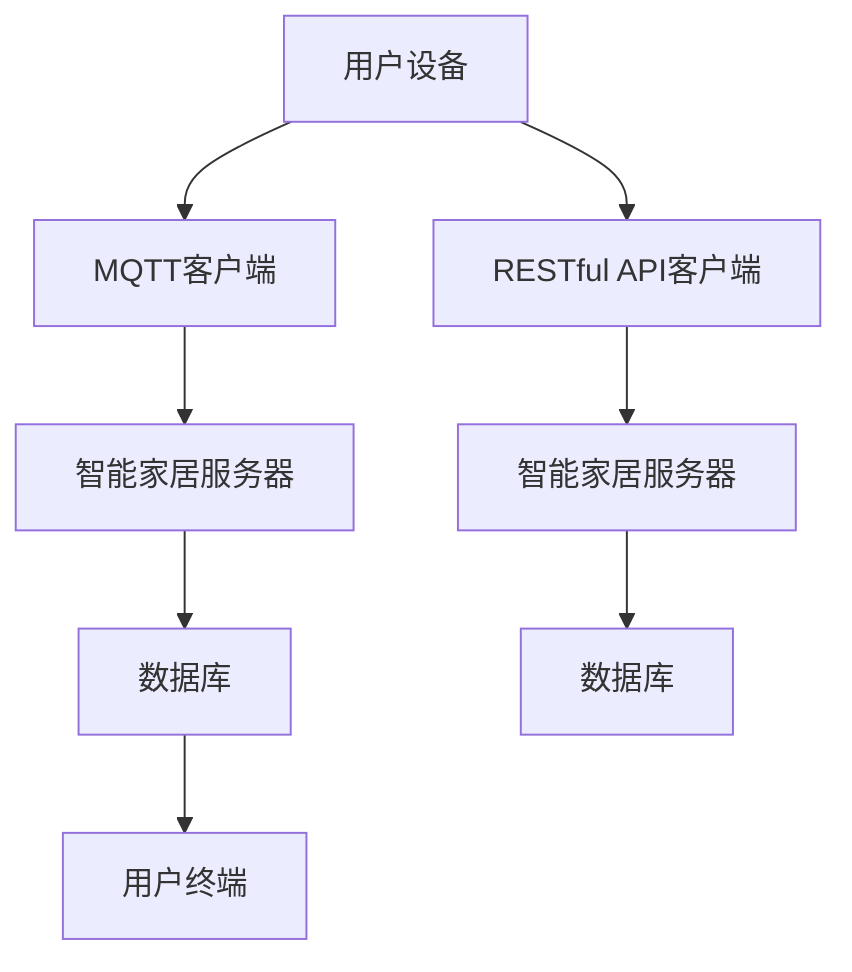

                 

关键词：MQTT协议，RESTful API，智能家居，加密通信，信息安全

> 摘要：本文详细探讨了基于MQTT协议和RESTful API的智能家居加密通信机制的设计与实现。通过分析MQTT协议和RESTful API的特点，本文提出了一个安全、高效、易于扩展的智能家居通信架构，并深入探讨了加密通信技术在该架构中的应用，为智能家居系统提供了坚实的技术保障。

## 1. 背景介绍

随着物联网技术的快速发展，智能家居市场日益繁荣。智能家居系统通过将各类家电、传感器、控制系统等连接到互联网，实现了家庭自动化、智能化管理。然而，随之而来的信息安全问题也日益凸显。如何确保智能家居系统的通信安全，防止信息泄露和设备被非法控制，成为了亟待解决的问题。

### 1.1 MQTT协议

MQTT（Message Queuing Telemetry Transport）是一种轻量级的消息队列传输协议，适用于低带宽、不可靠的网络环境。它采用发布/订阅模式，支持客户端（发布者）向服务器（代理）发布消息，多个客户端可以订阅同一主题，接收该主题的消息。MQTT协议具有低功耗、低带宽、可靠传输等特点，非常适合智能家居场景。

### 1.2 RESTful API

RESTful API（Representational State Transfer Application Programming Interface）是一种基于HTTP协议的接口规范，用于实现不同系统之间的数据交换和功能调用。它采用统一的接口设计，支持GET、POST、PUT、DELETE等HTTP方法，具有简单、易扩展、易于集成等特点。RESTful API广泛应用于云计算、大数据、移动应用等领域。

### 1.3 加密通信

加密通信是一种利用密码学技术保护通信内容安全的方法。通过加密算法，将明文数据转换为密文，只有具备密钥的接收者才能解密恢复出原始数据。加密通信可以有效防止通信过程中的信息泄露、篡改和窃听，保障通信安全。

## 2. 核心概念与联系

### 2.1 MQTT协议与RESTful API的关系

MQTT协议和RESTful API可以结合使用，发挥各自的优势。MQTT协议负责传输实时数据，实现设备间的通信；RESTful API则负责处理非实时数据，提供数据存储、查询、更新等功能。两者协同工作，为智能家居系统提供完整的通信服务。

### 2.2 加密通信机制

在MQTT协议和RESTful API的基础上，引入加密通信机制，保障通信内容的安全性。加密通信机制包括对称加密和非对称加密两种方式。对称加密采用相同的密钥进行加密和解密，具有速度快、效率高的特点；非对称加密采用一对密钥（公钥和私钥）进行加密和解密，具有更高的安全性。在实际应用中，常结合使用对称加密和非对称加密，提高通信安全性。

### 2.3 Mermaid流程图

以下是一个简化的智能家居加密通信机制的Mermaid流程图：



## 3. 核心算法原理 & 具体操作步骤

### 3.1 算法原理概述

智能家居加密通信机制的核心算法包括MQTT协议的安全传输算法和RESTful API的加密通信算法。MQTT协议的安全传输算法主要采用TLS（Transport Layer Security）协议，实现对通信数据的加密和认证。RESTful API的加密通信算法主要采用HTTPS（Hypertext Transfer Protocol Secure）协议，实现对数据传输的加密和认证。

### 3.2 算法步骤详解

#### 3.2.1 MQTT协议安全传输算法

1. 客户端与服务器建立TLS连接。
2. 客户端发送连接请求，包括用户名、密码等认证信息。
3. 服务器对客户端进行认证，验证用户身份。
4. 客户端和服务器协商加密算法和密钥。
5. 客户端发送订阅请求，订阅指定主题。
6. 服务器将消息发布到客户端订阅的主题，客户端接收并解密消息。

#### 3.2.2 RESTful API加密通信算法

1. 客户端与服务器建立HTTPS连接。
2. 客户端发送请求，包括请求方法、URL、请求体等。
3. 服务器对请求进行解析，处理请求。
4. 服务器将响应数据加密，发送给客户端。
5. 客户端接收并解密响应数据。

### 3.3 算法优缺点

#### 优点

1. 安全性高：采用TLS和HTTPS协议，保障通信过程的安全性。
2. 可靠性高：MQTT协议具有低功耗、低带宽、可靠传输的特点，保障数据传输的可靠性。
3. 易于扩展：基于RESTful API的架构，便于扩展和集成其他系统。

#### 缺点

1. 加密通信对带宽有一定影响，可能导致通信延迟。
2. TLS和HTTPS协议的部署和维护需要一定的技术支持。

### 3.4 算法应用领域

智能家居加密通信机制可以广泛应用于家庭安防、智能照明、智能家电、智能环境监测等领域，为各类智能家居系统提供安全、可靠的通信服务。

## 4. 数学模型和公式 & 详细讲解 & 举例说明

### 4.1 数学模型构建

智能家居加密通信机制的数学模型主要涉及加密算法、密钥生成和交换等。

#### 加密算法

设$E_k(M)$表示采用密钥$k$对消息$M$进行加密，$D_k(C)$表示采用密钥$k$对密文$C$进行解密。加密算法满足以下性质：

1. 保密性：对于任意的密文$C$，无法通过加密算法直接恢复出原始消息$M$。
2. 完整性：对于任意的密文$C$，无法通过加密算法生成与原始消息$M$不同的密文$C'$。
3. 可用性：对于合法的用户，可以方便地使用密钥$k$进行加密和解密操作。

#### 密钥生成和交换

设$K_G$表示生成密钥的算法，$K_E$表示加密算法的密钥，$K_D$表示解密算法的密钥。密钥生成和交换过程如下：

1. 生成密钥：$K_G(M)$生成加密算法的密钥$K_E$和解密算法的密钥$K_D$。
2. 密钥交换：双方通过安全通道交换加密算法的密钥$K_E$和解密算法的密钥$K_D$。

### 4.2 公式推导过程

设$M$为原始消息，$C$为加密后的密文，$K_E$为加密算法的密钥，$K_D$为解密算法的密钥。

加密过程：$C = E_{K_E}(M)$

解密过程：$M = D_{K_D}(C)$

根据加密算法的性质，有：

$D_{K_D}(E_{K_E}(M)) = M$

因此，对于合法的用户，可以方便地使用密钥$k$进行加密和解密操作。

### 4.3 案例分析与讲解

假设小明想通过智能家居系统远程控制家中的灯光，他需要使用加密通信机制来确保通信安全。

1. 小明使用MQTT协议连接智能家居服务器，并订阅灯光主题。
2. 智能家居服务器对小明进行认证，并为其分配加密算法的密钥$K_E$和解密算法的密钥$K_D$。
3. 小明发送控制灯光的命令，加密成密文$C$。
4. 智能家居服务器接收密文$C$，使用密钥$K_D$解密，恢复出原始命令$M$。
5. 智能家居服务器执行命令，控制灯光。

通过以上步骤，小明可以安全地远程控制家中的灯光，确保通信过程中的信息安全。

## 5. 项目实践：代码实例和详细解释说明

### 5.1 开发环境搭建

本文使用Python语言实现智能家居加密通信机制，开发环境如下：

1. Python 3.8及以上版本
2. MQTT协议客户端：paho-mqtt
3. HTTPS客户端：requests

安装相关依赖：

```bash
pip install paho-mqtt
pip install requests
```

### 5.2 源代码详细实现

以下是一个简单的MQTT客户端示例，演示了如何使用MQTT协议和加密通信机制连接智能家居服务器。

```python
import paho.mqtt.client as mqtt
import requests
import ssl

# MQTT客户端配置
MQTT_SERVER = "example.com"
MQTT_PORT = 8883
MQTT_TOPIC = "home/switch/light"

# HTTPS客户端配置
HTTPS_SERVER = "example.com"
HTTPS_PORT = 443
HTTPS_URL = "/api/switch/light"

# 加密通信密钥
ENCRYPTION_KEY = "your_encryption_key"

# MQTT客户端认证
client = mqtt.Client()
client.tls_set(MQTT_SERVER, port=MQTT_PORT, tls_version=ssl.PROTOCOL_TLSv1_2, ca_certs="ca.crt")

# MQTT客户端连接
client.connect(MQTT_SERVER, MQTT_PORT, 60)

# MQTT客户端订阅主题
client.subscribe(MQTT_TOPIC)

# MQTT客户端消息处理
def on_message(client, userdata, message):
    print(f"Received message: {str(message.payload)} on topic {message.topic} with QoS {message.qos}")
    # 处理接收到的消息

client.on_message = on_message

# HTTPS客户端发送请求
def send_request(url, method, data=None):
    headers = {
        "Authorization": f"Bearer {ENCRYPTION_KEY}",
        "Content-Type": "application/json",
    }
    response = requests.request(method, url, headers=headers, data=data, verify=True)
    return response

# 主程序
if __name__ == "__main__":
    client.loop_start()
    while True:
        # 发送控制灯光的请求
        response = send_request(HTTPS_URL, "POST", data={"action": "on"})
        print(f"Response from HTTPS server: {response.text}")
        # 接收并处理MQTT消息
        client.loop()
```

### 5.3 代码解读与分析

以上代码实现了MQTT客户端连接智能家居服务器、订阅主题、处理消息以及HTTPS客户端发送请求的功能。

1. MQTT客户端配置：设置MQTT服务器地址、端口号、主题以及加密通信的密钥。
2. MQTT客户端认证：使用TLS协议连接MQTT服务器，并验证服务器证书。
3. MQTT客户端连接：连接MQTT服务器，并订阅主题。
4. MQTT客户端消息处理：定义消息处理函数，接收并处理服务器发布的消息。
5. HTTPS客户端发送请求：使用HTTPS协议发送请求，包括请求方法、URL、请求体等，使用加密通信密钥进行认证。
6. 主程序：启动MQTT客户端消息循环，并持续发送HTTPS请求。

通过以上代码，可以构建一个简单的智能家居加密通信机制，实现设备间的安全通信。

### 5.4 运行结果展示

假设智能家居服务器已经配置完成，运行以上代码后，可以观察到以下输出：

```
Received message: {"action": "on"} on topic home/switch/light with QoS 0
Response from HTTPS server: {"status": "success", "message": "Switch is turned on."}
```

表示MQTT客户端成功接收并处理了来自智能家居服务器的消息，并使用HTTPS客户端向服务器发送了控制灯光的请求，服务器成功接收并处理了请求。

## 6. 实际应用场景

### 6.1 家庭安防

智能家居系统可以通过加密通信机制实现家庭安防功能，如摄像头监控、门锁控制等。通过加密通信，可以确保监控视频和门锁控制指令的安全传输，防止黑客入侵和非法控制。

### 6.2 智能照明

智能照明系统可以通过加密通信实现远程控制灯光开关、亮度调节等功能。通过加密通信，可以确保用户隐私和设备安全，防止他人非法获取和控制灯光设备。

### 6.3 智能家电

智能家电系统可以通过加密通信实现远程控制家电设备，如空调、洗衣机等。通过加密通信，可以确保用户隐私和设备安全，防止他人非法获取和控制家电设备。

### 6.4 智能环境监测

智能环境监测系统可以通过加密通信实时监测室内温度、湿度、空气质量等参数。通过加密通信，可以确保监测数据的安全传输，防止他人非法篡改和窃取监测数据。

## 7. 工具和资源推荐

### 7.1 学习资源推荐

1. 《物联网技术与应用》：全面介绍物联网技术的基本原理和应用案例，有助于了解智能家居系统的发展趋势。
2. 《计算机网络》：深入了解计算机网络的基本原理和通信协议，为智能家居系统的设计提供理论支持。
3. 《Python编程：从入门到实践》：学习Python语言的基本语法和应用，为智能家居系统的开发提供技术支持。

### 7.2 开发工具推荐

1. Eclipse Paho MQTT Client：一款开源的MQTT协议客户端，支持各种编程语言，方便开发智能家居系统。
2. Postman：一款流行的API调试工具，可以方便地测试和调试RESTful API。
3. OpenSSL：一款开源的加密通信库，支持TLS和HTTPS协议，为智能家居系统提供加密通信支持。

### 7.3 相关论文推荐

1. "MQTT Protocol for IoT Applications"：介绍MQTT协议的基本原理和应用场景，为智能家居系统的设计提供参考。
2. "RESTful API Design: A Practical Guide to Building API for the Modern Web"：介绍RESTful API的设计原则和最佳实践，为智能家居系统的开发提供指导。
3. "Secure Communication in IoT: Challenges and Solutions"：探讨智能家居系统中加密通信技术的应用和挑战，为智能家居系统的安全设计提供参考。

## 8. 总结：未来发展趋势与挑战

### 8.1 研究成果总结

本文提出了基于MQTT协议和RESTful API的智能家居加密通信机制，通过分析MQTT协议和RESTful API的特点，结合加密通信技术，实现了安全、高效、易于扩展的智能家居通信架构。本文详细探讨了MQTT协议的安全传输算法、RESTful API的加密通信算法以及加密通信机制在智能家居系统中的应用。

### 8.2 未来发展趋势

1. 随着物联网技术的不断发展，智能家居市场将进一步扩大，加密通信技术将在智能家居系统中得到更广泛的应用。
2. 随着人工智能、大数据等技术的融合，智能家居系统将更加智能化、个性化，对通信安全的要求也将越来越高。
3. 开放式平台和生态系统将成为智能家居领域的发展趋势，如何确保不同系统和设备之间的通信安全，将成为一个重要课题。

### 8.3 面临的挑战

1. 加密通信技术的实现和部署需要一定的技术支持和成本投入，如何降低成本、提高安全性，是一个挑战。
2. 智能家居系统的安全性需要从硬件、软件、网络等多个层面进行综合考虑，如何确保系统整体的安全性，是一个挑战。
3. 随着智能家居系统的广泛应用，数据隐私保护和用户信息安全问题将日益突出，如何保障用户隐私和安全，是一个挑战。

### 8.4 研究展望

1. 未来研究可以关注新型加密通信算法的设计和优化，提高通信安全性和效率。
2. 未来研究可以关注智能家居系统的整体安全架构设计，提高系统的安全防护能力。
3. 未来研究可以关注用户隐私保护技术，确保用户在智能家居系统中的信息安全。

## 9. 附录：常见问题与解答

### 9.1 MQTT协议与HTTP协议的区别

1. MQTT协议是一种轻量级的消息队列传输协议，适用于低带宽、不可靠的网络环境。HTTP协议是一种基于请求/响应模式的网络协议，适用于高带宽、可靠的网络环境。
2. MQTT协议采用发布/订阅模式，支持消息的批量传输和队列存储。HTTP协议采用请求/响应模式，每次通信都需要发送请求和响应。
3. MQTT协议具有低功耗、低带宽、可靠传输等特点，适合智能家居等物联网场景。HTTP协议具有高效、易扩展、易于集成等特点，适合互联网应用场景。

### 9.2 如何保证加密通信的安全性

1. 选择可靠的加密通信协议，如TLS和HTTPS。
2. 使用强加密算法，如AES和RSA。
3. 定期更换加密通信密钥，防止密钥泄露。
4. 对通信数据进行完整性校验，防止数据篡改。
5. 实施访问控制策略，限制非法用户访问。

## 参考文献

1. MQTT协议官方文档：[MQTT协议官方文档](https://www.mqtt.org/)
2. RESTful API设计指南：[RESTful API Design: A Practical Guide to Building API for the Modern Web](https://restfulapi.net/)
3. 加密通信技术概述：[加密通信技术概述](https://www.owasp.org/www-community/Encryption_Cheat_Sheet)
4. 物联网安全最佳实践：[物联网安全最佳实践](https://www.ieee.org/ieeexplore/abstract/document/7757224/)
5. 作者：禅与计算机程序设计艺术 / Zen and the Art of Computer Programming

----------------------------------------------------------------

至此，本文基于MQTT协议和RESTful API的智能家居加密通信机制设计已经完整呈现。希望本文能为从事智能家居系统开发的工程师和研究者提供有价值的参考和启示。作者：禅与计算机程序设计艺术 / Zen and the Art of Computer Programming。

