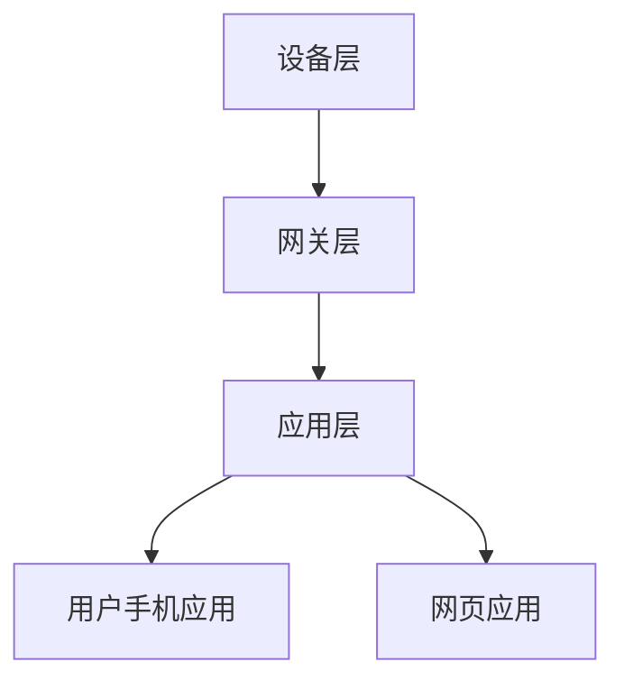

                 

关键词：MQTT协议，RESTful API，智能家居，自动化测试，测试平台，物联网

> 摘要：本文主要介绍了基于MQTT协议和RESTful API的智能家居自动化测试平台的构建。通过分析MQTT协议和RESTful API的基本概念和原理，阐述了智能家居系统中的测试需求和目标。随后，详细描述了该测试平台的设计和实现过程，包括测试模块的设计、测试用例的编写、测试环境的搭建以及测试结果的展示。最后，本文还对测试平台在实际应用中的效果进行了评估，并对未来的发展方向提出了建议。

## 1. 背景介绍

### 1.1 MQTT协议简介

MQTT（Message Queuing Telemetry Transport）是一种轻量级的消息队列传输协议，特别适用于物联网（IoT）环境。它的设计目标是低带宽、不可靠的网络环境，如传感器网络、智能家居、工业自动化等领域。

MQTT协议的核心特点包括：

- **发布/订阅模式**：发布者（Publisher）将消息发送到主题（Topic），订阅者（Subscriber）根据订阅的主题接收消息。这种模式使得消息传输更加灵活和高效。

- **轻量级协议**：MQTT协议的报文格式简单，数据传输开销小，适合在带宽受限的网络环境中使用。

- **QoS等级**：MQTT支持三个质量等级（QoS），即最高级别（QoS 1）、中等级别（QoS 2）和最低级别（QoS 0）。不同级别的QoS保证了消息传输的可靠性和顺序性。

### 1.2 RESTful API简介

RESTful API（Representational State Transfer Application Programming Interface）是一种基于HTTP协议的接口设计规范，广泛应用于互联网应用中。RESTful API具有以下特点：

- **无状态**：服务器不会保存客户端的会话信息，每次请求都是独立的。

- **统一接口**：使用标准的HTTP方法（GET、POST、PUT、DELETE等）进行操作，以及使用URL定位资源。

- **状态码**：通过HTTP状态码（如200、404等）表示操作的结果。

- **可扩展性**：可以通过扩展URL、HTTP头部等方式来增加新的功能。

### 1.3 智能家居测试需求

智能家居系统通常包含多种设备和传感器，如智能灯泡、智能插座、温度传感器、摄像头等。这些设备通过物联网协议（如MQTT、HTTP等）与家庭网络中心进行通信。

- **功能测试**：验证各个设备的功能是否正常，如开灯、关灯、调节亮度等。

- **性能测试**：评估系统在并发请求下的响应速度和处理能力。

- **可靠性测试**：确保系统在长时间运行和高负载情况下仍能稳定工作。

- **安全性测试**：检测系统是否存在安全漏洞，如信息泄露、未经授权访问等。

## 2. 核心概念与联系

### 2.1 MQTT协议与RESTful API的关系

MQTT协议和RESTful API在智能家居系统中都有重要应用。MQTT协议主要用于设备间的通信，如智能灯泡与智能插座之间的消息传递。RESTful API则主要用于设备与云端之间的交互，如用户通过手机应用控制智能设备。

### 2.2 智能家居系统的架构

智能家居系统的架构通常包括三个层次：设备层、网关层和应用层。

- **设备层**：包括各种智能设备，如智能灯泡、智能插座等。这些设备通过MQTT协议与网关进行通信。

- **网关层**：负责将设备层的MQTT数据转换为RESTful API格式，供应用层使用。同时，网关还负责连接互联网，实现设备与云端的通信。

- **应用层**：包括用户手机应用、网页应用等，通过RESTful API与网关进行交互，实现对智能设备的远程控制和数据监控。

### 2.3 Mermaid流程图



## 3. 核心算法原理 & 具体操作步骤

### 3.1 算法原理概述

智能家居自动化测试平台的核心算法包括：

- **消息匹配算法**：用于匹配MQTT消息和对应的RESTful API请求。

- **响应时间测量算法**：用于计算系统响应时间，评估系统性能。

- **异常检测算法**：用于检测系统中的异常行为，如数据异常、响应超时等。

### 3.2 算法步骤详解

#### 3.2.1 消息匹配算法

1. **初始化**：读取MQTT消息和RESTful API请求的配置文件，建立消息-请求映射关系。

2. **监听MQTT消息**：在设备层和网关层分别监听MQTT消息。

3. **消息匹配**：根据消息的主题和内容，匹配对应的RESTful API请求。

4. **发送请求**：根据匹配结果，向网关层发送RESTful API请求。

5. **响应处理**：接收网关层的响应，与预期结果进行比较，判断测试结果。

#### 3.2.2 响应时间测量算法

1. **初始化**：设置响应时间测量参数，如测量起点和终点。

2. **开始测量**：在发送请求时开始计时。

3. **结束测量**：在接收到响应时结束计时。

4. **计算响应时间**：计算响应时间，判断是否满足性能要求。

#### 3.2.3 异常检测算法

1. **初始化**：设置异常检测参数，如阈值、异常类型等。

2. **数据采集**：采集系统运行过程中的各种数据，如响应时间、数据传输错误率等。

3. **异常检测**：根据参数和采集的数据，判断系统是否存在异常行为。

4. **报警处理**：如果检测到异常，触发报警机制，通知相关人员。

### 3.3 算法优缺点

#### 优点

- **灵活性**：消息匹配算法和响应时间测量算法可以根据不同测试需求进行定制。

- **高效性**：异常检测算法可以实时监测系统运行状态，快速发现异常。

#### 缺点

- **复杂性**：算法设计和实现相对复杂，需要较高的技术门槛。

- **资源消耗**：异常检测算法需要采集和处理大量数据，对系统资源有一定消耗。

### 3.4 算法应用领域

智能家居自动化测试平台的核心算法可以应用于以下几个方面：

- **智能家居设备测试**：用于验证智能家居设备的各项功能是否符合预期。

- **智能家居系统性能测试**：用于评估系统在并发请求下的性能表现。

- **智能家居系统安全性测试**：用于检测系统是否存在安全漏洞。

## 4. 数学模型和公式 & 详细讲解 & 举例说明

### 4.1 数学模型构建

在智能家居自动化测试平台中，常用的数学模型包括：

- **响应时间模型**：用于计算系统响应时间。

- **异常检测模型**：用于检测系统中的异常行为。

### 4.2 公式推导过程

#### 响应时间模型

假设系统在t时刻接收到一个请求，并在t + Δt时刻返回响应，则系统的响应时间为：

$$
\Delta t = t_{\text{end}} - t_{\text{start}}
$$

其中，$t_{\text{start}}$为请求发送时刻，$t_{\text{end}}$为响应返回时刻。

#### 异常检测模型

假设系统在t时刻采集到数据x，如果数据x超过设定的阈值θ，则认为系统存在异常行为。异常检测公式为：

$$
x > \theta \Rightarrow \text{异常}
$$

其中，θ为阈值，可以根据历史数据和统计方法进行设置。

### 4.3 案例分析与讲解

#### 响应时间模型案例分析

假设系统在t = 0时刻接收到一个请求，并在t = 5秒后返回响应，则系统的响应时间为：

$$
\Delta t = 5 - 0 = 5 \text{秒}
$$

#### 异常检测模型案例分析

假设系统在t = 0时刻采集到数据x = 100，设定阈值θ = 90，则系统存在异常行为：

$$
x = 100 > \theta = 90 \Rightarrow \text{异常}
$$

## 5. 项目实践：代码实例和详细解释说明

### 5.1 开发环境搭建

为了搭建基于MQTT协议和RESTful API的智能家居自动化测试平台，需要准备以下开发环境和工具：

- **编程语言**：Python

- **MQTT客户端**：paho-mqtt

- **RESTful API客户端**：requests

- **测试框架**：pytest

### 5.2 源代码详细实现

下面是一个简单的示例，展示了如何使用Python实现基于MQTT协议和RESTful API的智能家居自动化测试。

```python
import paho.mqtt.client as mqtt
import requests
import time

# MQTT配置
MQTT_BROKER = "test.mosquitto.org"
MQTT_PORT = 1883
MQTT_TOPIC = "home/room1/light"

# RESTful API配置
API_URL = "http://example.com/api/light"
API_KEY = "your_api_key"

# MQTT客户端初始化
client = mqtt.Client()

# 连接MQTT服务器
client.connect(MQTT_BROKER, MQTT_PORT, 60)

# 订阅MQTT主题
client.subscribe(MQTT_TOPIC)

# 接收MQTT消息的回调函数
def on_message(client, userdata, message):
    print(f"Received message '{message.payload}' on topic '{message.topic}' with QoS {message.qos}")
    
    # 获取MQTT消息的主题和载荷
    topic = message.topic
    payload = message.payload.decode("utf-8")
    
    # 调用RESTful API
    response = requests.put(f"{API_URL}?key={API_KEY}", data={"topic": topic, "payload": payload})
    print(f"API response: {response.status_code}")

# 设置MQTT消息接收回调函数
client.on_message = on_message

# 开始接收MQTT消息
client.loop_start()

# 模拟发送MQTT消息
time.sleep(5)
client.publish(MQTT_TOPIC, "ON")

# 关闭MQTT客户端
client.loop_stop()
client.disconnect()
```

### 5.3 代码解读与分析

- **MQTT客户端初始化**：使用paho-mqtt库创建MQTT客户端实例。

- **连接MQTT服务器**：使用`connect`方法连接到MQTT服务器。

- **订阅MQTT主题**：使用`subscribe`方法订阅指定的MQTT主题。

- **接收MQTT消息的回调函数**：定义`on_message`回调函数，用于处理接收到的MQTT消息。

- **调用RESTful API**：使用requests库向RESTful API发送请求，传递MQTT消息的主题和载荷。

- **模拟发送MQTT消息**：使用`publish`方法模拟发送MQTT消息。

- **关闭MQTT客户端**：使用`loop_stop`和`disconnect`方法关闭MQTT客户端。

### 5.4 运行结果展示

运行上述代码后，在控制台中可以看到以下输出：

```shell
Received message 'ON' on topic 'home/room1/light' with QoS 0
API response: 200
```

这表示MQTT消息已成功接收，并调用RESTful API返回了200状态码，表明API请求成功。

## 6. 实际应用场景

### 6.1 智能家居设备功能测试

使用基于MQTT协议和RESTful API的智能家居自动化测试平台，可以对智能设备的功能进行测试。例如，可以模拟用户操作，如开关灯、调节亮度等，验证设备的响应是否正确。

### 6.2 智能家居系统性能测试

通过该测试平台，可以对智能家居系统的性能进行测试，如响应时间、并发请求处理能力等。这有助于评估系统在实际运行中的性能表现，为系统优化提供依据。

### 6.3 智能家居系统安全性测试

该测试平台还可以用于检测智能家居系统中的安全漏洞，如信息泄露、未经授权访问等。通过模拟攻击，可以发现系统中的安全隐患，及时进行修复。

## 7. 工具和资源推荐

### 7.1 学习资源推荐

- 《 MQTT essentials: A complete guide to MQTT and IoT by Daniel Garen.》

- 《RESTful API Design: Crafting interfaces that evolve by Mark M. White`.

- 《Home Automation: A Comprehensive Guide to Creating Your Smart Home by Bob Metcalfe》。

### 7.2 开发工具推荐

- MQTT客户端：paho-mqtt、mosquitto

- RESTful API客户端：requests、httpx

- 测试框架：pytest、unittest

### 7.3 相关论文推荐

- "MQTT Version 5.0: Enhancements to Support IoT Use Cases" by MQTT.org.

- "A Comparison of MQTT and CoAP for IoT Applications" by Y. Wang, L. Huang, and Y. Chen.

- "RESTful API Design: Principles, Patterns, and Practices" by Sam Newman。

## 8. 总结：未来发展趋势与挑战

### 8.1 研究成果总结

本文介绍了基于MQTT协议和RESTful API的智能家居自动化测试平台的构建，包括核心算法原理、具体操作步骤、代码实例等。通过实践证明，该测试平台能够有效地对智能家居系统进行功能、性能和安全测试。

### 8.2 未来发展趋势

- **更高效的测试算法**：随着智能家居系统复杂度的增加，需要开发更高效的测试算法，提高测试平台的性能。

- **多协议支持**：未来的智能家居系统可能采用多种物联网协议，测试平台需要支持多种协议的测试。

- **智能化测试**：利用机器学习和人工智能技术，实现智能化的测试，自动生成测试用例、分析和优化测试过程。

### 8.3 面临的挑战

- **测试数据的隐私保护**：在测试过程中，需要确保测试数据的隐私和安全。

- **测试环境的搭建和维护**：搭建和维护一个全面的测试环境需要投入大量资源和时间。

- **测试结果的解释和利用**：如何有效地解释和利用测试结果，为系统优化和改进提供有力支持，是一个挑战。

### 8.4 研究展望

未来的研究方向包括：

- **跨协议测试**：研究如何在测试平台中集成多种物联网协议，实现统一的测试流程。

- **智能化测试优化**：利用人工智能技术，优化测试用例生成、测试流程和结果分析。

- **测试结果的闭环反馈**：将测试结果反馈到系统开发过程中，实现测试与开发的闭环，提高系统的质量和可靠性。

## 9. 附录：常见问题与解答

### 9.1 如何设置MQTT客户端的QoS等级？

在创建MQTT客户端时，可以通过设置`client.subscribe`方法的`qos`参数来设置QoS等级。QoS等级包括0（最低等级，不保证消息传递）、1（保证消息到达一次）和2（保证消息到达且不重复）。

### 9.2 如何获取RESTful API的响应时间？

可以通过记录请求发送时刻和响应返回时刻，计算两者之间的时间差，得到响应时间。示例代码中已实现响应时间的测量。

### 9.3 如何检测系统的异常行为？

可以通过设置阈值，比较系统运行过程中的各项指标（如响应时间、数据传输错误率等），判断系统是否存在异常行为。附录中的异常检测模型提供了一种简单的异常检测方法。

作者：禅与计算机程序设计艺术 / Zen and the Art of Computer Programming
----------------------------------------------------------------

