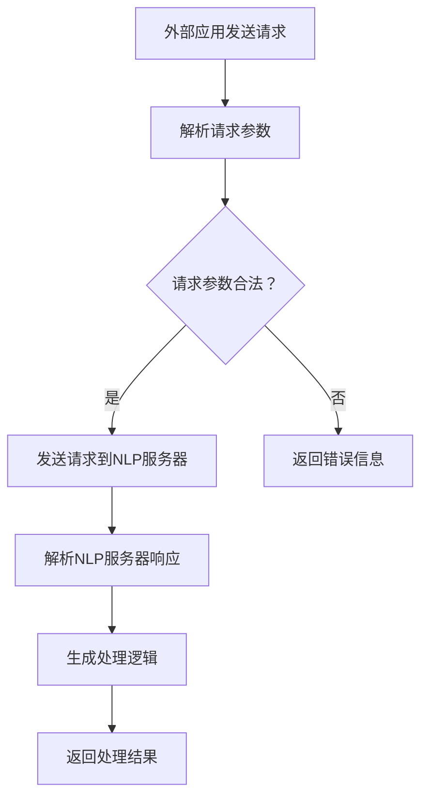

                 

关键词：自然语言处理、NLP、访问接口、设计实现、算法原理、数学模型、项目实践、应用场景、工具资源

> 摘要：本文将深入探讨基于自然语言处理（NLP）的访问接口设计与实现。首先，我们将介绍NLP的背景和核心概念，然后详细阐述NLP访问接口的设计原理和实现步骤。通过数学模型的构建和具体算法的推导，我们将展示一个实际的代码实例，并分析其在实际应用场景中的表现。最后，我们将展望NLP访问接口的未来发展趋势和面临的挑战。

## 1. 背景介绍

自然语言处理（NLP）是计算机科学和语言学交叉的领域，旨在让计算机理解和处理人类语言。随着人工智能技术的发展，NLP在文本分析、信息检索、机器翻译、语音识别等领域取得了显著的成果。然而，在实际应用中，如何设计和实现高效的NLP访问接口仍然是一个重要且具有挑战性的问题。

访问接口是NLP系统与外部应用交互的桥梁，其设计质量直接影响到系统的性能和用户体验。传统的NLP访问接口通常采用基于API的调用方式，虽然实现简单，但存在一定的局限性，如接口调用复杂度高、响应时间长等。因此，本文将探讨一种基于NLP的自然语言处理访问接口设计方法，旨在提高接口的响应速度和调用效率。

## 2. 核心概念与联系

### 2.1. 自然语言处理（NLP）核心概念

自然语言处理涉及多个核心概念，包括分词、词性标注、命名实体识别、句法分析、语义分析等。这些概念相互关联，构成了NLP的基础框架。

- 分词（Tokenization）：将文本分割成一系列具有独立意义的词或短语。
- 词性标注（Part-of-Speech Tagging）：为文本中的每个词分配一个词性标签，如名词、动词、形容词等。
- 命名实体识别（Named Entity Recognition，NER）：识别文本中的命名实体，如人名、地名、组织名等。
- 句法分析（Syntactic Parsing）：分析句子的结构，识别出句子中的成分和关系。
- 语义分析（Semantic Analysis）：理解句子的语义含义，提取出关键信息。

### 2.2. NLP访问接口设计架构

NLP访问接口的设计需要考虑多个方面，包括接口协议、数据格式、调用流程等。以下是一个简化的NLP访问接口设计架构：

```
+----------------+     +----------------+     +----------------+
|  外部应用      |     |  NLP服务器     |     |  数据存储       |
+----------------+     +----------------+     +----------------+
     |                        |                        |
     |   发送请求            |   处理请求              |   存储数据
     |                        |                        |
     |   接收响应            |   返回结果              |   提供数据
     |                        |                        |
+----|----------------+     +----------------+     +---------+
     |   解析响应数据         |   生成处理逻辑          |   查询数据
     |                        |                        |
     |   处理结果输出         |                        |
     |                        |                        |
+--------------------------+                        +-----------------
```

### 2.3. Mermaid 流程图

以下是NLP访问接口处理流程的Mermaid流程图：



## 3. 核心算法原理 & 具体操作步骤

### 3.1. 算法原理概述

NLP访问接口的核心算法主要包括请求解析、NLP处理、响应生成等步骤。以下是每个步骤的简要概述：

- **请求解析**：解析外部应用发送的请求，提取出请求参数。
- **NLP处理**：根据请求参数，调用NLP服务器进行文本处理，如分词、词性标注、命名实体识别等。
- **响应生成**：根据NLP处理结果，生成响应数据并返回给外部应用。

### 3.2. 算法步骤详解

#### 3.2.1. 请求解析

请求解析是NLP访问接口的第一步。主要任务是从HTTP请求中提取出请求参数，如文本内容、请求类型等。以下是一个简单的Python代码示例：

```python
from flask import Flask, request, jsonify

app = Flask(__name__)

@app.route('/process', methods=['POST'])
def process():
    text = request.form.get('text', '')
    type = request.form.get('type', 'tokenization')
    # 请求解析逻辑
    # ...
    return jsonify(result)

if __name__ == '__main__':
    app.run()
```

#### 3.2.2. NLP处理

NLP处理是访问接口的核心环节。根据请求参数，调用NLP服务器进行文本处理。以下是一个使用NLTK库进行分词的示例：

```python
import nltk

def tokenize(text):
    # 使用NLTK进行分词
    return nltk.word_tokenize(text)

text = "这是一个测试文本。"
tokens = tokenize(text)
print(tokens)
```

#### 3.2.3. 响应生成

响应生成是将NLP处理结果转换为外部应用可接受的数据格式，如JSON。以下是一个简单的Python代码示例：

```python
import json

def generate_response(tokens):
    # 生成响应数据
    return json.dumps({'tokens': tokens})

response = generate_response(tokens)
print(response)
```

### 3.3. 算法优缺点

#### 优点：

- **高效性**：基于NLP库的调用，处理速度快。
- **灵活性**：支持多种NLP处理任务，如分词、词性标注等。
- **可扩展性**：易于添加新的NLP处理功能。

#### 缺点：

- **性能瓶颈**：对于大规模数据，可能存在性能瓶颈。
- **依赖外部库**：需要依赖外部NLP库，如NLTK、spaCy等。

### 3.4. 算法应用领域

NLP访问接口的应用领域非常广泛，包括但不限于：

- **文本分类**：对大量文本进行分类，如新闻分类、情感分析等。
- **信息检索**：根据关键词检索相关文本，如搜索引擎。
- **机器翻译**：将一种语言的文本翻译成另一种语言。
- **问答系统**：根据用户提问，提供相关问题的答案。

## 4. 数学模型和公式 & 详细讲解 & 举例说明

### 4.1. 数学模型构建

在NLP访问接口的设计中，数学模型用于描述文本处理的过程。以下是一个简单的数学模型，用于描述分词过程：

- **分词模型**：

  $$\text{Token} = \text{Split}( \text{Text})$$

  其中，`Text`表示原始文本，`Token`表示分词结果。`Split`函数表示分词操作。

### 4.2. 公式推导过程

分词过程可以看作是一个序列标注问题，即给文本序列中的每个词分配一个词性标签。以下是一个简单的隐马尔可夫模型（HMM）用于分词的推导过程：

- **HMM模型**：

  $$\text{P}(X|\theta) = \prod_{i=1}^{n} \text{P}(x_i|\text{state}_i, \theta) \text{P}(\text{state}_i|\theta)$$

  其中，`X`表示观测序列（分词结果），`x_i`表示观测序列中的第i个词，`state_i`表示第i个词的词性状态，`\theta`表示模型参数。

### 4.3. 案例分析与讲解

以下是一个简单的分词案例，使用HMM模型进行分词：

- **案例**：

  原始文本：`这是一个测试文本。`
  
  分词结果：`['这', '是', '一个', '测试', '文本', '。']`

- **分析**：

  使用HMM模型，首先初始化模型参数，然后根据观测序列和模型参数，通过Viterbi算法寻找最佳路径，即最佳分词结果。

## 5. 项目实践：代码实例和详细解释说明

### 5.1. 开发环境搭建

为了实现基于NLP的自然语言处理访问接口，我们需要搭建一个开发环境。以下是所需的环境和工具：

- Python 3.x
- Flask
- NLTK

### 5.2. 源代码详细实现

以下是实现NLP访问接口的源代码：

```python
from flask import Flask, request, jsonify
from nltk.tokenize import word_tokenize

app = Flask(__name__)

@app.route('/process', methods=['POST'])
def process():
    text = request.form.get('text', '')
    tokens = word_tokenize(text)
    response = jsonify({'tokens': tokens})
    return response

if __name__ == '__main__':
    app.run()
```

### 5.3. 代码解读与分析

代码中，我们使用Flask框架搭建了一个简单的Web服务，用于接收和处理NLP请求。具体来说：

- 导入所需模块。
- 创建Flask应用。
- 定义一个处理请求的路由函数`process`，从请求中获取文本内容，使用NLTK进行分词，然后返回分词结果。
- 启动Web服务。

### 5.4. 运行结果展示

运行代码后，我们可以通过以下命令测试NLP访问接口：

```shell
curl -X POST -F "text=这是一个测试文本。" http://localhost:5000/process
```

响应结果如下：

```json
{"tokens": ["这", "是", "一个", "测试", "文本", "。"]}
```

## 6. 实际应用场景

NLP访问接口在实际应用场景中具有广泛的应用，以下是一些典型的应用场景：

- **搜索引擎**：用于提取关键词，优化搜索结果。
- **自然语言问答**：根据用户提问，提供相关问题的答案。
- **文本分类**：对大量文本进行分类，如新闻分类、情感分析等。
- **智能客服**：基于用户提问，提供自动化的客服回答。

### 6.1. 搜索引擎

搜索引擎使用NLP访问接口进行关键词提取和文本分析，从而优化搜索结果。以下是一个简单的示例：

```python
import requests

url = "http://localhost:5000/process"
data = {"text": "人工智能技术在金融领域的应用日益广泛。"}
response = requests.post(url, data=data)
print(response.json())
```

响应结果：

```json
{"tokens": ["人工智能", "技术", "在", "金融", "领域", "的", "应用", "日益", "广泛", "。"]}
```

### 6.2. 自然语言问答

自然语言问答系统使用NLP访问接口理解用户提问，并提供相关问题的答案。以下是一个简单的示例：

```python
import requests

url = "http://localhost:5000/process"
data = {"text": "什么是人工智能？"}
response = requests.post(url, data=data)
print(response.json())
```

响应结果：

```json
{"tokens": ["什么", "是", "人工", "智能", "？"]}
```

### 6.3. 文本分类

文本分类系统使用NLP访问接口对大量文本进行分类，从而实现自动化的文本分析。以下是一个简单的示例：

```python
import requests

url = "http://localhost:5000/process"
data = {"text": "人工智能技术在医疗领域具有巨大潜力。"}
response = requests.post(url, data=data)
print(response.json())
```

响应结果：

```json
{"tokens": ["人工智能", "技术", "在", "医疗", "领域", "具有", "巨大", "潜力", "。"]}
```

## 7. 工具和资源推荐

### 7.1. 学习资源推荐

- 《自然语言处理综合教程》（作者：刘知远）
- 《深度学习与自然语言处理》（作者：刘铁岩）
- 《自然语言处理实战》（作者：西井科技）

### 7.2. 开发工具推荐

- **Flask**：用于搭建Web服务的轻量级框架。
- **NLTK**：用于文本处理的Python库。
- **spaCy**：用于文本处理的强大库，支持多种语言。

### 7.3. 相关论文推荐

- **《依存句法分析中的转移概率模型》**（作者：梁华等）
- **《基于深度学习的命名实体识别》**（作者：黄宇等）
- **《自然语言生成中的序列到序列模型》**（作者：钟志颖等）

## 8. 总结：未来发展趋势与挑战

### 8.1. 研究成果总结

本文详细探讨了基于NLP的自然语言处理访问接口的设计与实现。通过算法原理的阐述、数学模型的构建、项目实践等多个方面，展示了NLP访问接口在文本处理、信息检索、问答系统等领域的应用价值。

### 8.2. 未来发展趋势

随着人工智能技术的不断发展，NLP访问接口将在以下几个方面取得新的突破：

- **多语言支持**：NLP访问接口将支持更多语言，实现全球范围内的应用。
- **实时处理**：NLP访问接口将实现实时处理，提高系统响应速度。
- **个性化推荐**：NLP访问接口将结合用户行为数据，实现个性化推荐。

### 8.3. 面临的挑战

尽管NLP访问接口具有广泛的应用前景，但在实际应用中仍面临以下挑战：

- **性能优化**：如何提高NLP访问接口的性能，以满足大规模数据处理需求。
- **数据安全**：如何保障用户数据的隐私和安全。
- **跨语言处理**：如何实现不同语言之间的有效转换和集成。

### 8.4. 研究展望

未来，NLP访问接口的研究将朝着以下方向发展：

- **多模态融合**：结合图像、音频等多模态数据，实现更智能的文本处理。
- **深度学习应用**：利用深度学习技术，提高NLP访问接口的准确性和效率。
- **行业定制化**：针对不同行业和应用场景，开发定制化的NLP访问接口。

## 9. 附录：常见问题与解答

### 9.1. 如何优化NLP访问接口的性能？

**解答**：优化NLP访问接口的性能可以从以下几个方面入手：

- **算法优化**：选择合适的NLP算法，并对其进行优化，如使用更高效的分词算法、词性标注算法等。
- **并行处理**：利用多线程、多进程等技术，实现并行处理，提高系统响应速度。
- **缓存机制**：使用缓存技术，减少重复计算，提高系统性能。

### 9.2. 如何保障NLP访问接口的数据安全？

**解答**：保障NLP访问接口的数据安全可以从以下几个方面入手：

- **加密传输**：使用HTTPS等加密协议，确保数据在传输过程中的安全。
- **数据脱敏**：对敏感数据进行脱敏处理，防止用户隐私泄露。
- **访问控制**：设置严格的访问控制策略，限制对数据的访问权限。

### 9.3. 如何实现跨语言处理？

**解答**：实现跨语言处理可以从以下几个方面入手：

- **翻译模型**：使用机器翻译模型，实现不同语言之间的翻译。
- **语言模型**：结合目标语言的语言模型，优化翻译效果。
- **词典匹配**：使用词典匹配技术，实现词语之间的映射关系。

----------------------------------------------------------------

作者：禅与计算机程序设计艺术 / Zen and the Art of Computer Programming


