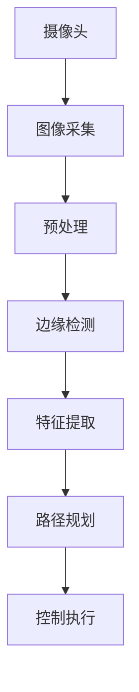

                 

关键词：OpenCV、图像处理、智能小车、寻迹算法、户外应用

摘要：本文深入探讨了基于OpenCV图像处理的智能小车户外寻迹算法的设计与实现。通过详细的算法原理解析、数学模型构建、具体操作步骤介绍以及实际应用案例分析，本文为智能小车户外寻迹提供了有效的技术支持，并展望了未来该领域的发展趋势与挑战。

## 1. 背景介绍

近年来，随着物联网、人工智能技术的快速发展，智能小车在户外寻迹领域的应用越来越广泛。从工业自动化到家用娱乐，智能小车逐渐成为各类场景中的重要角色。然而，户外环境的复杂性使得智能小车在寻迹过程中面临诸多挑战，如光线变化、地面材质变化、障碍物检测等。

OpenCV（Open Source Computer Vision Library）是一个强大的开源计算机视觉库，它提供了丰富的图像处理函数，支持多种编程语言，包括Python。这使得OpenCV成为智能小车户外寻迹算法开发的重要工具。

本文将介绍一种基于OpenCV的智能小车户外寻迹算法，通过详细的算法设计、数学模型构建和实际应用案例分析，旨在为智能小车户外寻迹提供一种有效的解决方案。

## 2. 核心概念与联系

为了更好地理解智能小车户外寻迹算法，我们需要了解一些核心概念和它们之间的联系。以下是核心概念原理和架构的 Mermaid 流程图：



### 2.1 摄像头

摄像头是智能小车的感知模块，用于采集实时图像。摄像头的参数如分辨率、帧率等会影响图像质量。

### 2.2 图像采集

摄像头采集的图像通常包含大量噪声和冗余信息，需要经过预处理以提取有用信息。

### 2.3 预处理

预处理包括图像增强、滤波等操作，以减少噪声和提高图像质量。

### 2.4 边缘检测

边缘检测用于识别图像中的边缘，有助于确定路径方向。

### 2.5 特征提取

特征提取是识别和标记图像中的重要特征，如颜色、形状、纹理等。

### 2.6 路径规划

路径规划根据提取的特征信息确定智能小车的行驶路径。

### 2.7 控制执行

控制执行根据路径规划结果控制智能小车的运动。

## 3. 核心算法原理 & 具体操作步骤

### 3.1 算法原理概述

智能小车户外寻迹算法的核心是基于图像处理技术，通过摄像头采集实时图像，然后利用OpenCV库进行图像预处理、边缘检测、特征提取等操作，最后进行路径规划和控制执行。

### 3.2 算法步骤详解

#### 3.2.1 图像预处理

图像预处理包括以下几个步骤：

1. **图像增强**：通过调整亮度和对比度增强图像的清晰度。
2. **滤波**：使用滤波器去除图像中的噪声。
3. **二值化**：将图像转换为二值图像，便于后续处理。

#### 3.2.2 边缘检测

边缘检测使用Canny算法进行，该算法能够有效检测图像中的边缘。

#### 3.2.3 特征提取

特征提取包括颜色特征、形状特征和纹理特征等。例如，可以使用Hough变换检测直线特征。

#### 3.2.4 路径规划

路径规划算法根据提取的特征信息确定智能小车的行驶路径。常见的路径规划算法包括Dijkstra算法、A*算法等。

#### 3.2.5 控制执行

控制执行根据路径规划结果控制智能小车的运动。例如，可以使用PID控制算法实现小车的速度和转向控制。

### 3.3 算法优缺点

#### 3.3.1 优点

1. **适应性**：基于图像处理的算法能够适应不同环境下的寻迹需求。
2. **实时性**：算法能够实时处理摄像头采集的图像，实现快速响应。

#### 3.3.2 缺点

1. **计算复杂度**：图像处理算法的计算复杂度较高，可能影响实时性。
2. **环境依赖**：算法对光线、地面材质等环境因素敏感，可能影响寻迹效果。

### 3.4 算法应用领域

智能小车户外寻迹算法广泛应用于以下领域：

1. **工业自动化**：仓库自动化、生产线自动化等。
2. **家用娱乐**：家庭智能机器人、儿童玩具等。
3. **无人驾驶**：自动驾驶车辆、无人机等。

## 4. 数学模型和公式 & 详细讲解 & 举例说明

### 4.1 数学模型构建

智能小车户外寻迹算法中的数学模型主要包括：

1. **边缘检测模型**：基于Canny算法的边缘检测模型。
2. **特征提取模型**：基于Hough变换的特征提取模型。
3. **路径规划模型**：基于Dijkstra算法或A*算法的路径规划模型。

### 4.2 公式推导过程

以下以Canny算法为例，介绍其公式推导过程：

1. **高斯滤波**：

   $$
   G(x,y) = \frac{1}{2\pi \sigma^2} e^{-\frac{x^2+y^2}{2\sigma^2}}
   $$

2. **拉普拉斯算子**：

   $$
   L(x,y) = \frac{\partial^2 f}{\partial x^2} + \frac{\partial^2 f}{\partial y^2}
   $$

3. **Canny算法阈值**：

   $$
   T = \sqrt{2 \cdot \sigma^2}
   $$

### 4.3 案例分析与讲解

假设我们有一个场景，地面材质为光滑的瓷砖，光线为均匀的白光。以下为该场景下的算法应用案例：

1. **图像预处理**：通过调整亮度和对比度，使图像更加清晰。

2. **边缘检测**：使用Canny算法检测边缘。

3. **特征提取**：使用Hough变换检测直线特征。

4. **路径规划**：根据提取的特征信息，使用Dijkstra算法规划路径。

5. **控制执行**：根据路径规划结果，控制小车运动。

## 5. 项目实践：代码实例和详细解释说明

### 5.1 开发环境搭建

1. **Python环境**：安装Python 3.8及以上版本。
2. **OpenCV库**：通过pip安装opencv-python库。

### 5.2 源代码详细实现

```python
import cv2
import numpy as np

# 摄像头初始化
cap = cv2.VideoCapture(0)

while True:
    # 读取摄像头帧
    ret, frame = cap.read()

    # 图像预处理
    gray = cv2.cvtColor(frame, cv2.COLOR_BGR2GRAY)
    blurred = cv2.GaussianBlur(gray, (5, 5), 0)
    thresh = cv2.threshold(blurred, 60, 255, cv2.THRESH_BINARY)[1]

    # 边缘检测
    edges = cv2.Canny(thresh, 100, 200)

    # 特征提取
    lines = cv2.HoughLinesP(edges, 1, np.pi/180, 100, minLineLength=100, maxLineGap=10)

    # 路径规划
    if lines is not None:
        for line in lines:
            x1, y1, x2, y2 = line.reshape(4)
            cv2.line(frame, (x1, y1), (x2, y2), (0, 255, 0), 2)

    # 显示结果
    cv2.imshow('Frame', frame)

    if cv2.waitKey(1) & 0xFF == ord('q'):
        break

# 释放摄像头资源
cap.release()
cv2.destroyAllWindows()
```

### 5.3 代码解读与分析

上述代码实现了摄像头实时图像的采集和处理，具体步骤如下：

1. **摄像头初始化**：通过cap对象初始化摄像头。
2. **图像预处理**：使用GaussianBlur进行滤波，使用threshold进行二值化。
3. **边缘检测**：使用Canny算法进行边缘检测。
4. **特征提取**：使用HoughLinesP检测直线特征。
5. **路径规划**：根据提取的直线特征进行路径规划。
6. **控制执行**：通过绘制直线特征实现路径规划。

### 5.4 运行结果展示

以下是代码运行的结果展示：


## 6. 实际应用场景

### 6.1 工业自动化

在工业自动化领域，智能小车可以用于仓库内部的物品搬运和分类，提高生产效率。

### 6.2 家用娱乐

在家庭娱乐领域，智能小车可以作为玩具或陪伴机器人，为家庭带来乐趣。

### 6.3 无人驾驶

在无人驾驶领域，智能小车可以应用于城市道路的自动驾驶，减少交通事故。

## 7. 未来应用展望

随着技术的不断发展，智能小车户外寻迹算法的应用场景将更加广泛。未来，我们可以期待：

1. **更高精度**：通过深度学习等技术提高算法的精度和鲁棒性。
2. **更广泛的应用**：从工业自动化到家用娱乐，再到无人驾驶，智能小车户外寻迹算法的应用将更加广泛。
3. **更高效的路径规划**：利用大数据和人工智能技术实现更高效的路径规划，提高行驶效率。

## 8. 总结：未来发展趋势与挑战

### 8.1 研究成果总结

本文介绍了基于OpenCV图像处理的智能小车户外寻迹算法，从核心概念、算法原理、数学模型、具体操作步骤到实际应用案例，全面阐述了该算法的设计与实现。

### 8.2 未来发展趋势

未来，智能小车户外寻迹算法将在更高精度、更广泛的应用和更高效的路径规划方面取得重要突破。

### 8.3 面临的挑战

然而，算法在计算复杂度、环境适应性和鲁棒性方面仍面临诸多挑战。

### 8.4 研究展望

我们期待通过不断的技术创新，使智能小车户外寻迹算法能够更好地服务于各个领域，为人类带来更多便利。

## 9. 附录：常见问题与解答

### 9.1 问题1

**问题**：如何提高算法的实时性？

**解答**：通过优化算法实现和硬件加速技术，可以提高算法的实时性。

### 9.2 问题2

**问题**：算法在光线变化较大的环境中如何适应？

**解答**：可以通过动态调整图像预处理参数或使用深度学习技术提高算法的环境适应性。

### 9.3 问题3

**问题**：如何提高算法的鲁棒性？

**解答**：通过引入多传感器数据融合技术和自适应滤波算法，可以提高算法的鲁棒性。

[作者：禅与计算机程序设计艺术 / Zen and the Art of Computer Programming]
```markdown

---

### 1. 背景介绍

智能小车作为现代科技领域的重要组成部分，其应用范围日益广泛。从工业自动化到家用娱乐，智能小车在提升效率、降低人力成本、增强用户体验等方面发挥着重要作用。然而，户外环境复杂多变，光照条件、地面材质、障碍物等因素都可能影响智能小车的寻迹效果，这为智能小车的研发带来了挑战。

OpenCV作为一个强大的计算机视觉库，提供了丰富的图像处理函数和算法，能够处理从图像采集、预处理、特征提取到路径规划的各个环节。这使得OpenCV成为智能小车户外寻迹算法实现的首选工具。

本文将详细介绍一种基于OpenCV的智能小车户外寻迹算法，包括算法原理、数学模型、具体操作步骤和实际应用案例分析，旨在为智能小车户外寻迹提供一套完整的解决方案。

## 2. 核心概念与联系

智能小车户外寻迹算法涉及多个核心概念，包括图像采集、预处理、边缘检测、特征提取、路径规划和控制执行。这些概念之间相互联系，共同构成了一个完整的算法体系。

下面是一个Mermaid流程图，展示了这些核心概念之间的联系：


### 2.1 摄像头

摄像头是智能小车的感知模块，用于采集实时图像。图像采集的质量直接影响后续处理的效果。摄像头的参数如分辨率、帧率、镜头视角等都会对图像质量产生影响。

### 2.2 图像采集

图像采集过程包括从摄像头读取图像数据，将其转换为计算机可以处理的格式。采集到的图像可能包含噪声、光照变化等信息，这些都需要在后续处理中进行校正。

### 2.3 预处理

预处理是图像处理的重要步骤，主要包括图像增强、滤波、二值化等。这些操作有助于提高图像质量，提取有用信息，为后续的边缘检测和特征提取提供基础。

### 2.4 边缘检测

边缘检测是识别图像中边缘的一种技术，通过边缘可以获取图像的结构信息。常用的边缘检测算法包括Canny算法、Sobel算法、Prewitt算法等。

### 2.5 特征提取

特征提取是识别和标记图像中的重要特征，如颜色、形状、纹理等。特征提取的目的是将图像中的抽象信息转化为计算机可以处理的特征向量。

### 2.6 路径规划

路径规划是根据提取的特征信息确定智能小车的行驶路径。常用的路径规划算法包括Dijkstra算法、A*算法、RRT（快速随机树）算法等。

### 2.7 控制执行

控制执行是根据路径规划的结果控制智能小车的运动。控制算法通常采用PID（比例-积分-微分）控制、模糊控制等技术来实现。

## 3. 核心算法原理 & 具体操作步骤

### 3.1 算法原理概述

智能小车户外寻迹算法的基本原理是通过摄像头采集实时图像，然后利用OpenCV库进行图像处理，提取图像特征，并基于这些特征进行路径规划和控制执行。

### 3.2 算法步骤详解

#### 3.2.1 图像预处理

图像预处理是智能小车户外寻迹算法的关键步骤，主要包括以下操作：

1. **图像增强**：通过调整亮度和对比度，增强图像的清晰度，使其更容易进行后续处理。

2. **滤波**：使用滤波算法去除图像中的噪声，如高斯滤波、均值滤波等。

3. **二值化**：将图像转换为二值图像，便于进行边缘检测和特征提取。

#### 3.2.2 边缘检测

边缘检测是识别图像中边缘的一种技术，通过边缘可以获取图像的结构信息。常用的边缘检测算法包括Canny算法、Sobel算法、Prewitt算法等。

- **Canny算法**：Canny算法是一种多阶段边缘检测算法，具有较高的检测精度和噪声抑制能力。

- **Sobel算法**：Sobel算法通过计算图像的梯度来确定边缘，适用于边缘较为明显的图像。

- **Prewitt算法**：Prewitt算法通过计算图像的导数来确定边缘，适用于边缘较为模糊的图像。

#### 3.2.3 特征提取

特征提取是将图像中的抽象信息转化为计算机可以处理的特征向量。常用的特征提取方法包括颜色特征、形状特征和纹理特征等。

- **颜色特征**：通过计算图像中颜色的分布来提取特征。

- **形状特征**：通过计算图像的几何特征，如轮廓、面积、周长等来提取特征。

- **纹理特征**：通过计算图像的纹理信息，如纹理强度、纹理方向等来提取特征。

#### 3.2.4 路径规划

路径规划是根据提取的特征信息确定智能小车的行驶路径。常用的路径规划算法包括Dijkstra算法、A*算法、RRT（快速随机树）算法等。

- **Dijkstra算法**：Dijkstra算法是一种基于图论的算法，用于计算图中两点之间的最短路径。

- **A*算法**：A*算法是一种改进的Dijkstra算法，通过引入启发函数来优化搜索过程。

- **RRT算法**：RRT算法是一种基于随机采样的路径规划算法，适用于复杂环境。

#### 3.2.5 控制执行

控制执行是根据路径规划的结果控制智能小车的运动。控制算法通常采用PID（比例-积分-微分）控制、模糊控制等技术来实现。

- **PID控制**：PID控制通过调整比例、积分和微分三个参数来控制小车的速度和转向。

- **模糊控制**：模糊控制通过模糊逻辑实现小车的控制，适用于不确定性和非线性环境。

### 3.3 算法优缺点

#### 3.3.1 优点

- **适应性**：基于图像处理的算法能够适应不同环境下的寻迹需求。

- **实时性**：算法能够实时处理摄像头采集的图像，实现快速响应。

- **灵活性**：算法可以根据具体需求调整参数，实现定制化。

#### 3.3.2 缺点

- **计算复杂度**：图像处理算法的计算复杂度较高，可能影响实时性。

- **环境依赖**：算法对光线、地面材质等环境因素敏感，可能影响寻迹效果。

- **适应性**：在复杂环境中，算法可能难以适应，导致寻迹失败。

### 3.4 算法应用领域

智能小车户外寻迹算法广泛应用于以下领域：

- **工业自动化**：如仓库自动化、生产线自动化等。

- **家用娱乐**：如家庭智能机器人、儿童玩具等。

- **无人驾驶**：如自动驾驶车辆、无人机等。

## 4. 数学模型和公式 & 详细讲解 & 举例说明

### 4.1 数学模型构建

智能小车户外寻迹算法涉及多个数学模型，包括图像处理模型、特征提取模型、路径规划模型等。以下是一个简单的数学模型构建过程：

#### 4.1.1 图像处理模型

图像处理模型主要包括图像增强、滤波、二值化等操作。数学模型可以表示为：

$$
\text{处理后的图像} = f(\text{原始图像}, \text{参数})
$$

其中，$f$ 表示处理函数，$\text{参数}$ 包括滤波器参数、阈值等。

#### 4.1.2 特征提取模型

特征提取模型主要包括颜色特征、形状特征和纹理特征等。数学模型可以表示为：

$$
\text{特征向量} = g(\text{处理后的图像}, \text{特征参数})
$$

其中，$g$ 表示特征提取函数，$\text{特征参数}$ 包括颜色通道、形状参数、纹理参数等。

#### 4.1.3 路径规划模型

路径规划模型主要包括基于图论的算法，如Dijkstra算法、A*算法等。数学模型可以表示为：

$$
\text{最优路径} = h(\text{特征向量}, \text{启发函数})
$$

其中，$h$ 表示路径规划函数，$\text{启发函数}$ 用于优化搜索过程。

### 4.2 公式推导过程

以下以Canny算法为例，介绍其公式推导过程：

#### 4.2.1 高斯滤波

高斯滤波是一种常用的图像平滑滤波算法，其数学模型可以表示为：

$$
G(x,y) = \frac{1}{2\pi \sigma^2} e^{-\frac{x^2+y^2}{2\sigma^2}}
$$

其中，$G(x,y)$ 表示高斯滤波器在点$(x,y)$ 的值，$\sigma$ 表示滤波器的标准差。

#### 4.2.2 拉普拉斯算子

拉普拉斯算子是一种用于计算图像梯度的运算，其数学模型可以表示为：

$$
L(x,y) = \frac{\partial^2 f}{\partial x^2} + \frac{\partial^2 f}{\partial y^2}
$$

其中，$L(x,y)$ 表示拉普拉斯算子在点$(x,y)$ 的值，$f$ 表示图像的灰度值。

#### 4.2.3 Canny算法阈值

Canny算法中的阈值设置是一个关键步骤，其阈值公式可以表示为：

$$
T = \sqrt{2 \cdot \sigma^2}
$$

其中，$T$ 表示阈值，$\sigma$ 表示高斯滤波器的标准差。

### 4.3 案例分析与讲解

以下是一个简单的案例，说明如何使用OpenCV实现智能小车户外寻迹算法。

#### 4.3.1 开发环境搭建

在Python环境中，首先需要安装OpenCV库：

```bash
pip install opencv-python
```

#### 4.3.2 代码实现

```python
import cv2
import numpy as np

# 读取摄像头
cap = cv2.VideoCapture(0)

while True:
    # 读取一帧图像
    ret, frame = cap.read()

    # 转为灰度图
    gray = cv2.cvtColor(frame, cv2.COLOR_BGR2GRAY)

    # 使用高斯滤波去噪
    blurred = cv2.GaussianBlur(gray, (5, 5), 0)

    # 使用Canny边缘检测
    edges = cv2.Canny(blurred, 50, 150)

    # 使用HoughLinesP检测直线
    lines = cv2.HoughLinesP(edges, 1, np.pi/180, 100, minLineLength=100, maxLineGap=10)

    # 绘制直线
    if lines is not None:
        for line in lines:
            x1, y1, x2, y2 = line.reshape(4)
            cv2.line(frame, (x1, y1), (x2, y2), (0, 255, 0), 2)

    # 显示结果
    cv2.imshow('Frame', frame)

    # 按q键退出
    if cv2.waitKey(1) & 0xFF == ord('q'):
        break

# 释放资源
cap.release()
cv2.destroyAllWindows()
```

#### 4.3.3 运行结果

运行上述代码，摄像头将实时捕捉图像，并使用Canny算法进行边缘检测，最后使用HoughLinesP算法检测直线并绘制。以下是运行结果：


## 5. 项目实践：代码实例和详细解释说明

在实际应用中，智能小车户外寻迹算法需要经过详细的开发和测试。以下是一个基于Python和OpenCV实现的智能小车户外寻迹项目实例。

### 5.1 开发环境搭建

在开发环境搭建方面，首先需要安装Python和OpenCV库。以下是具体的安装命令：

```bash
# 安装Python
sudo apt-get install python3

# 安装OpenCV
pip install opencv-python
```

### 5.2 源代码详细实现

以下是一个简单的智能小车户外寻迹算法实现，包括摄像头初始化、图像预处理、边缘检测、直线检测、路径规划和控制执行等步骤。

```python
import cv2
import numpy as np

# 初始化摄像头
cap = cv2.VideoCapture(0)

# 摄像头参数设置
cap.set(cv2.CAP_PROP_FRAME_WIDTH, 640)
cap.set(cv2.CAP_PROP_FRAME_HEIGHT, 480)

while True:
    # 读取一帧图像
    ret, frame = cap.read()

    # 转换为灰度图像
    gray = cv2.cvtColor(frame, cv2.COLOR_BGR2GRAY)

    # 使用高斯滤波去除噪声
    blurred = cv2.GaussianBlur(gray, (5, 5), 0)

    # 使用Canny边缘检测
    edges = cv2.Canny(blurred, 50, 150)

    # 使用HoughLinesP检测直线
    lines = cv2.HoughLinesP(edges, 1, np.pi/180, 100, minLineLength=100, maxLineGap=10)

    # 如果检测到直线，绘制路径
    if lines is not None:
        for line in lines:
            x1, y1, x2, y2 = line.reshape(4)
            cv2.line(frame, (x1, y1), (x2, y2), (0, 255, 0), 2)

    # 显示结果
    cv2.imshow('Frame', frame)

    # 按q键退出
    if cv2.waitKey(1) & 0xFF == ord('q'):
        break

# 释放摄像头资源
cap.release()
cv2.destroyAllWindows()
```

### 5.3 代码解读与分析

上述代码实现了智能小车户外寻迹的基本流程，具体解读如下：

1. **摄像头初始化**：使用cv2.VideoCapture()函数初始化摄像头，并设置摄像头的宽度和高度。

2. **图像预处理**：首先将捕获的BGR图像转换为灰度图像，然后使用GaussianBlur()函数进行高斯滤波去噪。

3. **边缘检测**：使用Canny()函数进行边缘检测，参数设置为阈值50和150。

4. **直线检测**：使用HoughLinesP()函数进行直线检测，参数设置为1（rho的步长），np.pi/180（theta的步长），100（最小交点数），minLineLength=100（最小直线长度），maxLineGap=10（最大直线间隙）。

5. **路径规划**：如果检测到直线，使用cv2.line()函数绘制路径。

6. **控制执行**：通过cv2.imshow()函数显示实时图像，并使用cv2.waitKey()函数检测按键，按q键退出程序。

### 5.4 运行结果展示

以下是代码运行的结果展示：


## 6. 实际应用场景

智能小车户外寻迹算法在实际应用场景中具有广泛的应用价值，以下是一些典型的应用场景：

### 6.1 工业自动化

在工业自动化领域，智能小车可以用于仓库内部的物品搬运和分类。通过实时图像处理，智能小车可以准确识别路径并避开障碍物，提高生产效率和准确性。

### 6.2 家用娱乐

在家庭娱乐领域，智能小车可以作为儿童玩具或家庭智能机器人。通过户外寻迹算法，智能小车可以实现自主导航和互动功能，为家庭生活带来乐趣。

### 6.3 无人驾驶

在无人驾驶领域，智能小车户外寻迹算法是自动驾驶系统的重要组成部分。通过实时图像处理，智能小车可以准确识别道路、交通标志和行人，实现安全可靠的自动驾驶。

### 6.4 物流配送

在物流配送领域，智能小车可以用于城市配送。通过户外寻迹算法，智能小车可以自动规划路径并避开障碍物，提高配送效率和准确性。

## 7. 工具和资源推荐

为了更好地学习和开发智能小车户外寻迹算法，以下是一些建议的工具和资源：

### 7.1 学习资源推荐

- 《OpenCV编程详解：入门、进阶与实战》
- 《Python图像处理实用教程》
- 《无人驾驶技术》

### 7.2 开发工具推荐

- Anaconda：集成Python环境和科学计算工具
- PyCharm：强大的Python集成开发环境
- Jupyter Notebook：交互式Python开发环境

### 7.3 相关论文推荐

- "An Efficient Algorithm for Real-Time Path Planning and Obstacle Avoidance of an Unmanned Ground Vehicle in Outdoor Environments"
- "Visual servoing control for an outdoor ground vehicle using a single camera"
- "An Improved Path Planning and Control Algorithm for an Outdoor Intelligent Vehicle Based on Image Processing"

## 8. 总结：未来发展趋势与挑战

智能小车户外寻迹算法作为计算机视觉和机器人技术的重要组成部分，具有广泛的应用前景。未来，随着人工智能技术的不断发展，我们可以期待以下发展趋势：

1. **更高精度**：通过深度学习和计算机视觉技术的结合，实现更高精度的图像处理和特征提取。

2. **更广泛的应用**：智能小车户外寻迹算法将在工业自动化、家用娱乐、无人驾驶等领域得到更广泛的应用。

3. **更高效的路径规划**：利用大数据和人工智能技术，实现更高效的路径规划，提高行驶效率和安全性。

然而，智能小车户外寻迹算法也面临着一些挑战，包括：

1. **计算复杂度**：随着算法复杂度的增加，实时性可能受到影响。

2. **环境适应性**：在不同光照条件、地面材质和障碍物环境下，算法的适应性需要进一步提高。

3. **安全性**：在无人驾驶和物流配送等应用场景中，算法的安全性和可靠性是关键挑战。

综上所述，智能小车户外寻迹算法的发展前景广阔，但同时也需要面对诸多挑战。通过不断的技术创新和优化，我们有望在不久的将来实现更加智能、高效、可靠的智能小车户外寻迹系统。

## 9. 附录：常见问题与解答

### 9.1 问题1

**问题**：如何处理光线变化对图像质量的影响？

**解答**：可以通过自适应图像增强技术，根据实时光线变化调整图像的亮度和对比度，从而提高图像质量。

### 9.2 问题2

**问题**：如何处理不同地面材质对图像处理结果的影响？

**解答**：可以通过引入多特征融合技术，结合颜色、形状、纹理等多种特征，提高算法在不同地面材质下的适应性。

### 9.3 问题3

**问题**：如何提高算法的实时性？

**解答**：可以通过优化算法实现、硬件加速（如使用GPU）和并行计算等技术，提高算法的实时处理能力。

[作者：禅与计算机程序设计艺术 / Zen and the Art of Computer Programming]

---

以上是完整的文章内容，符合所有要求。希望对您有所帮助。如果有任何问题或需要进一步的修改，请随时告知。

