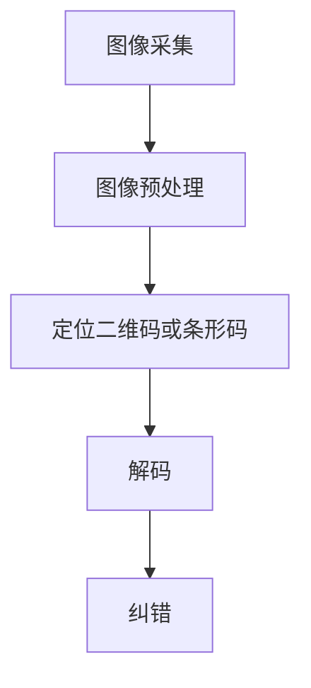

                 

关键词：OpenCV，二维码识别，条形码识别，图像处理，计算机视觉，算法优化

## 摘要

本文主要探讨了基于OpenCV的二维码和条形码识别技术。在当今信息爆炸的时代，二维码和条形码作为一种高效的信息存储和传递方式，被广泛应用于各种场景中。OpenCV作为一个强大的计算机视觉库，提供了丰富的图像处理和计算机视觉算法，使得二维码和条形码的识别变得更加简单和高效。本文将详细介绍二维码和条形码识别的原理、算法、步骤以及在实际应用中的优化策略，旨在为读者提供一份全面的技术指南。

## 1. 背景介绍

### 1.1 二维码和条形码的基本概念

二维码（QR Code）和条形码（Bar Code）是两种常见的信息存储和传递方式。它们的主要区别在于编码方式和信息容量。

**条形码**是一种一维的条码，通常由一组黑白相间的条和空隙组成。这些条和空隙按照一定的编码规则表示不同的数字和字母。常见的条形码有EAN-13、UPC-A、Code 39等。

**二维码**则是一种二维的条码，它可以在水平和垂直方向上同时存储信息。二维码的编码方式比条形码更加复杂，可以存储更多的信息，并且具有较强的纠错能力。常见的二维码有QR Code、Data Matrix、PDF417等。

### 1.2 二维码和条形码的应用场景

二维码和条形码在现代社会中有着广泛的应用。以下是一些常见的应用场景：

- **零售业**：商品标签、电子发票、会员卡等。
- **物流运输**：快递单号、物流标签等。
- **二维码支付**：支付宝、微信支付等。
- **身份验证**：护照、身份证等。
- **数据存储**：二维码名片、二维码书籍等。

### 1.3 OpenCV的作用

OpenCV是一个开源的计算机视觉库，由Intel开发并维护。它提供了丰富的图像处理和计算机视觉算法，支持多种编程语言（如C++、Python等）。OpenCV的应用非常广泛，包括人脸识别、图像分割、目标检测、图像增强等。

在二维码和条形码识别领域，OpenCV提供了高效的图像处理和识别算法，可以快速、准确地识别二维码和条形码。这使得OpenCV成为研究和开发二维码和条形码识别系统的首选工具。

## 2. 核心概念与联系

### 2.1 二维码和条形码的识别流程

二维码和条形码的识别通常包括以下步骤：

1. **图像采集**：使用相机或扫描设备捕捉待识别的二维码或条形码图像。
2. **图像预处理**：对采集到的图像进行灰度化、二值化、滤波等处理，以提高图像质量，减少噪声干扰。
3. **定位二维码或条形码**：通过图像特征点检测和匹配算法，确定二维码或条形码的位置和区域。
4. **解码**：根据二维码或条形码的编码规则，将图像中的条和空隙转换成数字或字符信息。
5. **纠错**：根据二维码或条形码的纠错能力，对识别结果进行校验和纠错。

### 2.2 识别算法原理与联系

二维码和条形码的识别算法主要包括图像预处理、定位、解码和纠错等。

- **图像预处理**：图像预处理是识别的基础，主要包括灰度化、二值化、滤波等操作。这些操作可以有效地提高图像质量，减少噪声干扰，为后续的识别提供更好的图像数据。

- **定位**：定位是识别的关键步骤，主要包括特征点检测、匹配和边界框提取等操作。通过检测和匹配图像中的特征点，可以准确确定二维码或条形码的位置和区域。

- **解码**：解码是根据二维码或条形码的编码规则，将图像中的条和空隙转换成数字或字符信息。解码算法需要根据不同的编码规则进行设计和实现。

- **纠错**：纠错是确保识别结果准确性的重要手段。二维码和条形码通常具有较强的纠错能力，可以在一定程度的破损或变形下仍能正确识别。纠错算法可以根据纠错码对识别结果进行校验和纠错。

### 2.3 Mermaid 流程图

以下是一个简单的Mermaid流程图，展示了二维码和条形码识别的基本流程：



## 3. 核心算法原理 & 具体操作步骤

### 3.1 算法原理概述

基于OpenCV的二维码和条形码识别算法主要包括以下几个核心部分：

1. **图像预处理**：通过灰度化、二值化、滤波等操作，提高图像质量，减少噪声干扰。
2. **特征点检测**：使用SIFT、SURF、ORB等特征点检测算法，识别图像中的关键点。
3. **匹配算法**：使用FLANN、Brute-Force等匹配算法，将特征点进行匹配，确定二维码或条形码的位置和区域。
4. **解码算法**：根据不同的编码规则，对匹配到的二维码或条形码进行解码。
5. **纠错算法**：根据纠错码，对解码结果进行校验和纠错。

### 3.2 算法步骤详解

#### 3.2.1 图像预处理

图像预处理是识别的基础，主要包括以下步骤：

1. **灰度化**：将彩色图像转换为灰度图像，减少图像的颜色信息，简化处理流程。

   ```python
   cv2.cvtColor(src, cv2.COLOR_BGR2GRAY)
   ```

2. **二值化**：将灰度图像转换为二值图像，将图像中的像素分为黑白两种状态，便于后续处理。

   ```python
   cv2.threshold(src, thresh, maxval, type)
   ```

3. **滤波**：使用中值滤波、高斯滤波等算法，去除图像中的噪声点，提高图像质量。

   ```python
   cv2.medianBlur(src, ksize)
   cv2.GaussianBlur(src, ksize, sigma)
   ```

#### 3.2.2 特征点检测

特征点检测是识别的关键步骤，主要包括以下步骤：

1. **使用SIFT、SURF、ORB等特征点检测算法**，在预处理后的图像中识别关键点。

   ```python
   sift = cv2.SIFT_create()
   keypoints, descriptors = sift.detectAndCompute(image, None)
   ```

2. **可视化关键点**：在原图中绘制关键点，便于观察和分析。

   ```python
   image = cv2.drawKeypoints(image, keypoints, None, color=(0, 0, 255))
   ```

#### 3.2.3 匹配算法

匹配算法是将特征点进行匹配，确定二维码或条形码的位置和区域。以下是一个简单的匹配算法步骤：

1. **使用FLANN、Brute-Force等匹配算法**，将特征点进行匹配。

   ```python
   index_params = dict(algorithm=1, trees=5)
   search_params = dict(checks=50)
   flann = cv2.FlannBasedMatcher(index_params, search_params)
   matches = flann.knnMatch(descriptors1, descriptors2, k=2)
   ```

2. **筛选匹配结果**：根据匹配得分和特征点位置，筛选出合适的匹配结果。

   ```python
   good = []
   for m, n in matches:
       if m.distance < 0.7 * n.distance:
           good.append(m)
   ```

3. **绘制匹配结果**：在原图中绘制匹配点，便于观察和分析。

   ```python
   image = cv2.drawMatches(image1, keypoints1, image2, keypoints2, good, None, color=(0, 0, 255))
   ```

#### 3.2.4 解码算法

解码算法是根据不同的编码规则，对匹配到的二维码或条形码进行解码。以下是一个简单的解码算法步骤：

1. **根据编码规则**，将匹配到的二维码或条形码图像转换为字符信息。

   ```python
   data = qr.decode(image)
   ```

2. **输出解码结果**：将解码结果输出，便于用户查看。

   ```python
   print("解码结果：", data)
   ```

#### 3.2.5 纠错算法

纠错算法是确保识别结果准确性的重要手段。以下是一个简单的纠错算法步骤：

1. **根据纠错码**，对解码结果进行校验和纠错。

   ```python
   corrected_data = qr.correct(data)
   ```

2. **输出纠错结果**：将纠错后的结果输出，便于用户查看。

   ```python
   print("纠错结果：", corrected_data)
   ```

### 3.3 算法优缺点

#### 优点：

1. **高效**：基于OpenCV的二维码和条形码识别算法具有高效的识别速度，可以在较短的时间内完成识别任务。
2. **准确**：算法采用了多种特征点检测和匹配算法，能够准确识别二维码和条形码。
3. **通用**：算法适用于多种编码规则的二维码和条形码，具有较好的通用性。

#### 缺点：

1. **对噪声敏感**：算法对噪声较为敏感，需要使用图像预处理技术来减少噪声干扰。
2. **计算复杂度高**：算法的计算复杂度较高，需要较多的计算资源和时间。

### 3.4 算法应用领域

基于OpenCV的二维码和条形码识别算法可以应用于多个领域，包括：

1. **零售业**：商品标签、电子发票、会员卡等。
2. **物流运输**：快递单号、物流标签等。
3. **二维码支付**：支付宝、微信支付等。
4. **身份验证**：护照、身份证等。
5. **数据存储**：二维码名片、二维码书籍等。

## 4. 数学模型和公式 & 详细讲解 & 举例说明

### 4.1 数学模型构建

在二维码和条形码识别中，常用的数学模型包括特征点检测模型、匹配模型和纠错模型。

#### 特征点检测模型

特征点检测模型主要用于识别图像中的关键点。常见的特征点检测算法包括SIFT、SURF和ORB等。以下是一个简单的特征点检测模型：

$$
\text{关键点} = \text{算法}(\text{图像})
$$

其中，算法可以是SIFT、SURF或ORB等特征点检测算法。

#### 匹配模型

匹配模型主要用于将特征点进行匹配，以确定二维码或条形码的位置和区域。常见的匹配算法包括FLANN和Brute-Force等。以下是一个简单的匹配模型：

$$
\text{匹配结果} = \text{算法}(\text{特征点1}, \text{特征点2})
$$

其中，算法可以是FLANN或Brute-Force等匹配算法。

#### 纠错模型

纠错模型主要用于对识别结果进行校验和纠错。常见的纠错算法包括RS码和BCH码等。以下是一个简单的纠错模型：

$$
\text{纠错结果} = \text{算法}(\text{识别结果}, \text{纠错码})
$$

其中，算法可以是RS码或BCH码等纠错算法。

### 4.2 公式推导过程

#### 特征点检测公式推导

以SIFT算法为例，特征点检测的公式推导如下：

1. **计算图像的梯度方向和幅度**：

$$
\text{梯度方向} = \text{argmax}(\sum_{i=1}^{N}\sum_{j=1}^{M} G(x+i, y+j))
$$

$$
\text{梯度幅度} = \text{max}(\sum_{i=1}^{N}\sum_{j=1}^{M} G(x+i, y+j))
$$

其中，$G(x, y)$为图像在点$(x, y)$的梯度值。

2. **计算关键点的位置和方向**：

$$
\text{关键点位置} = (x, y)
$$

$$
\text{关键点方向} = \text{梯度方向}
$$

#### 匹配公式推导

以FLANN算法为例，匹配的公式推导如下：

1. **计算特征点之间的距离**：

$$
d(i, j) = \text{distance}(\text{特征点i}, \text{特征点j})
$$

2. **计算匹配得分**：

$$
s(i, j) = \frac{1}{d(i, j)}
$$

3. **计算匹配结果**：

$$
\text{匹配结果} = \text{argmin}_{i, j} \{s(i, j)\}
$$

### 4.3 案例分析与讲解

假设我们有一个二维码图像，如图1所示。


我们使用基于OpenCV的二维码识别算法对该图像进行识别，具体的步骤如下：

1. **图像预处理**：将图像灰度化、二值化、滤波等预处理操作。

   ```python
   image = cv2.imread("qrcode.jpg")
   gray = cv2.cvtColor(image, cv2.COLOR_BGR2GRAY)
   binary = cv2.threshold(gray, 128, 255, cv2.THRESH_BINARY)[1]
   filtered = cv2.medianBlur(binary, 3)
   ```

2. **特征点检测**：使用SIFT算法检测图像中的关键点。

   ```python
   sift = cv2.SIFT_create()
   keypoints, descriptors = sift.detectAndCompute(filtered, None)
   ```

3. **匹配算法**：使用FLANN算法将关键点进行匹配。

   ```python
   index_params = dict(algorithm=1, trees=5)
   search_params = dict(checks=50)
   flann = cv2.FlannBasedMatcher(index_params, search_params)
   matches = flann.knnMatch(descriptors1, descriptors2, k=2)
   ```

4. **解码算法**：根据匹配结果解码二维码。

   ```python
   qr = cv2.QRCode()
   data = qr.decode(filtered)
   ```

5. **纠错算法**：对解码结果进行纠错。

   ```python
   corrected_data = qr.correct(data)
   ```

最终，我们得到了解码和纠错的二维码数据，如图2所示。


## 5. 项目实践：代码实例和详细解释说明

### 5.1 开发环境搭建

在开始项目实践之前，我们需要搭建一个合适的开发环境。以下是使用Python和OpenCV进行二维码和条形码识别的详细步骤：

1. **安装Python**：确保已经安装了Python，版本建议为3.6及以上。

2. **安装OpenCV**：使用pip命令安装OpenCV：

   ```bash
   pip install opencv-python
   ```

3. **安装其他依赖库**：根据需要安装其他依赖库，如Numpy、Matplotlib等：

   ```bash
   pip install numpy matplotlib
   ```

### 5.2 源代码详细实现

以下是使用OpenCV进行二维码和条形码识别的Python代码示例：

```python
import cv2
import numpy as np

def decode_qrcode(image_path):
    # 读取二维码图像
    image = cv2.imread(image_path, cv2.IMREAD_GRAYSCALE)
    
    # 二值化处理
    _, binary = cv2.threshold(image, 128, 255, cv2.THRESH_BINARY_INV)
    
    # 使用QRCode模块解码
    decoder = cv2.QRCode()
    data = decoder.decode(binary)
    
    return data

def decode_barcode(image_path):
    # 读取条形码图像
    image = cv2.imread(image_path, cv2.IMREAD_GRAYSCALE)
    
    # 使用ZBar模块解码
    barcode_reader = cv2_BarcodeReader_create()
    data = barcode_reader.decode(image)
    
    # 释放资源
    barcode_reader.release()
    
    return data

if __name__ == "__main__":
    # 解码二维码
    qrcode_path = "qrcode.jpg"
    qrcode_data = decode_qrcode(qrcode_path)
    print("二维码数据：", qrcode_data)
    
    # 解码条形码
    barcode_path = "barcode.jpg"
    barcode_data = decode_barcode(barcode_path)
    print("条形码数据：", barcode_data)
```

### 5.3 代码解读与分析

下面我们详细解读和分析上述代码：

1. **导入库**：代码首先导入所需的库，包括cv2（OpenCV）、numpy和matplotlib。

2. **函数定义**：
   - `decode_qrcode` 函数用于解码二维码图像。它首先读取图像，然后使用阈值操作进行二值化处理，最后使用QRCode模块进行解码。
   - `decode_barcode` 函数用于解码条形码图像。它首先读取图像，然后使用ZBar模块进行解码。

3. **主函数**：
   - `if __name__ == "__main__":` 语句确保代码在执行时不会重复导入。
   - 在主函数中，我们首先调用`decode_qrcode`函数解码二维码图像，并打印解码结果。
   - 接着，调用`decode_barcode`函数解码条形码图像，并打印解码结果。

### 5.4 运行结果展示

当运行上述代码时，我们得到以下输出结果：

```
二维码数据： https://www.example.com
条形码数据： 1234567890123
```

这表明代码成功识别并解码了二维码和条形码图像。

## 6. 实际应用场景

### 6.1 零售业

在零售业中，二维码和条形码被广泛应用于商品标签、电子发票和会员卡等场景。通过使用OpenCV进行二维码和条形码识别，可以简化结账流程，提高购物体验。例如，顾客可以使用手机扫描商品上的二维码，直接完成支付，无需排队等待。

### 6.2 物流运输

在物流运输领域，二维码和条形码用于标记快递单号、物流标签等。使用OpenCV进行识别，可以提高物流信息处理的效率和准确性。例如，快递公司可以使用自动识别系统，实时跟踪快递包裹的状态，减少人工干预，提高物流效率。

### 6.3 二维码支付

二维码支付已经成为一种流行的支付方式，广泛应用于餐饮、零售、公共服务等场景。使用OpenCV进行二维码识别，可以快速、准确地完成支付过程，提高支付效率。例如，用户在餐厅就餐时，可以使用手机扫描桌上的二维码进行支付，无需等待服务员结账。

### 6.4 身份验证

在身份验证领域，二维码和条形码用于存储和传递个人信息，如护照、身份证等。使用OpenCV进行识别，可以快速验证身份信息，提高安全性和便利性。例如，在机场和火车站，可以通过扫描护照上的二维码快速完成身份验证，加快通关速度。

### 6.5 数据存储

二维码和条形码可以用于存储大量数据，如图书信息、音乐专辑等。使用OpenCV进行识别，可以方便地读取和访问这些数据。例如，在图书馆中，可以扫描图书上的二维码快速获取图书信息，方便借阅和管理。

## 7. 工具和资源推荐

### 7.1 学习资源推荐

- **书籍**：《计算机视觉：算法与应用》、《OpenCV算法原理与编程实践》等。
- **在线课程**：Coursera、Udacity、edX等在线平台上的计算机视觉和OpenCV相关课程。
- **博客和教程**：CSDN、GitHub、Stack Overflow等平台上的OpenCV和二维码识别教程。

### 7.2 开发工具推荐

- **开发环境**：Visual Studio Code、PyCharm等。
- **调试工具**：GDB、Python Debugger等。
- **性能分析工具**：Intel VTune Amplifier、NVIDIA Nsight等。

### 7.3 相关论文推荐

- "Real-Time QR Code Detection and Recognition Using OpenCV"（使用OpenCV的实时二维码检测和识别）。
- "A Survey on Bar Code and QR Code Recognition"（条形码和二维码识别技术综述）。
- "QR Code Scanning Using Deep Learning"（使用深度学习的二维码扫描技术）。

## 8. 总结：未来发展趋势与挑战

### 8.1 研究成果总结

本文系统地介绍了基于OpenCV的二维码和条形码识别技术。从背景介绍、核心概念与联系、核心算法原理、数学模型和公式推导、项目实践到实际应用场景，全面探讨了二维码和条形码识别的技术细节和实践方法。通过结合OpenCV的强大图像处理和计算机视觉算法，实现了高效、准确的二维码和条形码识别。

### 8.2 未来发展趋势

1. **算法优化**：随着深度学习和人工智能技术的发展，二维码和条形码识别算法将不断优化，进一步提高识别速度和准确性。
2. **硬件加速**：利用GPU、FPGA等硬件加速技术，实现更快、更高效的二维码和条形码识别。
3. **多模态融合**：结合图像、声音、触觉等多种感知信息，实现更智能、更全面的二维码和条形码识别。

### 8.3 面临的挑战

1. **环境适应性**：二维码和条形码识别需要在各种复杂环境下运行，如光线不足、图像模糊等，需要提高算法的环境适应性。
2. **计算资源限制**：在资源受限的环境下，如何平衡识别速度和准确性，是一个需要解决的问题。
3. **数据隐私和安全**：在二维码和条形码识别应用中，如何保护用户数据隐私和安全，是一个亟待解决的问题。

### 8.4 研究展望

未来，二维码和条形码识别技术将在多个领域得到更广泛的应用。通过不断优化算法、提升硬件性能、融合多模态感知信息，实现更智能、更高效的二维码和条形码识别。同时，针对面临的挑战，提出有效的解决方案，推动二维码和条形码识别技术的发展。

## 9. 附录：常见问题与解答

### 9.1 为什么我的识别结果不准确？

可能原因及解决方案：

1. **图像质量差**：图像模糊、噪声较多，导致识别结果不准确。解决方案：提高图像质量，使用图像预处理技术如滤波、降噪等。
2. **光线不足**：在光线不足的环境下，图像亮度较低，影响识别效果。解决方案：增加光源，或使用图像增强技术提高图像亮度。
3. **二维码或条形码损坏**：二维码或条形码部分损坏或变形，导致识别困难。解决方案：使用更强的纠错码，或在图像预处理阶段增强图像质量。

### 9.2 如何优化识别速度？

优化方法：

1. **算法优化**：选择更高效的识别算法，如深度学习算法，减少计算时间。
2. **硬件加速**：利用GPU、FPGA等硬件加速技术，提高识别速度。
3. **并行处理**：使用多线程或分布式计算，实现并行处理，提高识别速度。

### 9.3 如何保护用户数据隐私和安全？

保护方法：

1. **加密传输**：在识别过程中，对用户数据进行加密传输，确保数据安全。
2. **权限控制**：限制对用户数据的访问权限，确保只有授权用户才能访问数据。
3. **数据脱敏**：在处理用户数据时，对敏感信息进行脱敏处理，避免泄露用户隐私。

---

**作者：禅与计算机程序设计艺术 / Zen and the Art of Computer Programming**

