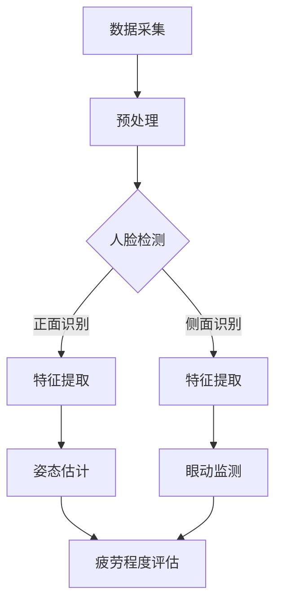

                 

关键词：OpenCV、疲劳驾驶检测、计算机视觉、算法实现、深度学习、人脸识别

## 摘要

本文将详细探讨基于OpenCV的疲劳驾驶检测系统的设计思路、核心算法以及具体代码实现。通过该系统，我们可以实时监测驾驶员的状态，及时发现疲劳驾驶行为，提高行车安全。文章首先介绍了疲劳驾驶检测的背景和重要性，然后深入分析了系统的整体架构，包括数据采集、预处理、特征提取、模型训练和实时检测等环节。接下来，本文将重点介绍OpenCV库的使用方法及其在疲劳驾驶检测中的应用，并通过具体代码示例详细解释了如何实现该系统。最后，本文对系统的实际应用场景进行了探讨，并提出了未来发展的展望。

## 1. 背景介绍

### 1.1 疲劳驾驶的概念与危害

疲劳驾驶是指驾驶员在长时间驾车过程中，由于精神疲劳、身体疲劳、心理压力等因素导致驾驶技能下降，反应迟钝，甚至无法正常驾驶。据世界卫生组织（WHO）统计，全球每年因疲劳驾驶导致的交通事故占所有交通事故的20%以上，而在中国，这一比例更高，约占30%。疲劳驾驶的危害主要体现在以下几个方面：

1. **反应速度下降**：疲劳驾驶时，驾驶员的反应速度会显著下降，导致无法及时应对突发情况。
2. **注意力分散**：疲劳会导致驾驶员注意力不集中，容易分心，从而增加发生交通事故的风险。
3. **判断力降低**：疲劳驾驶会使驾驶员的判断力降低，无法准确评估路况，容易做出错误的决策。
4. **操作失误**：疲劳驾驶时，驾驶员的操作准确性会下降，容易出现操作失误，如打错方向盘、踩错刹车等。

### 1.2 疲劳驾驶检测的重要性

疲劳驾驶检测技术在现代交通安全管理中具有重要意义。通过实时监测驾驶员的状态，及时发现疲劳驾驶行为，可以有效地降低交通事故的发生率，提高行车安全。具体来说，疲劳驾驶检测的重要性体现在以下几个方面：

1. **提高行车安全**：通过及时监测驾驶员的疲劳状态，可以提醒驾驶员休息或调整驾驶状态，避免因疲劳驾驶导致的交通事故。
2. **减少经济损失**：疲劳驾驶导致的交通事故不仅会造成人员伤亡，还会造成巨大的经济损失。通过疲劳驾驶检测，可以提前预警，减少事故发生，从而降低经济损失。
3. **促进交通安全管理**：疲劳驾驶检测技术可以为交通安全管理部门提供数据支持，帮助其更好地进行交通安全管理和监控，提高交通安全管理水平。

### 1.3 疲劳驾驶检测技术的发展

随着计算机视觉、深度学习等技术的不断发展，疲劳驾驶检测技术也取得了显著进步。传统的疲劳驾驶检测方法主要包括基于规则的方法和基于模型的方法。

1. **基于规则的方法**：这种方法主要通过设定一系列规则来判断驾驶员是否处于疲劳状态。例如，根据驾驶员的眼动轨迹、面部表情、头部姿态等特征来判断。这种方法的优点是实现简单，计算成本低，但缺点是灵活性差，难以适应复杂多变的驾驶环境。

2. **基于模型的方法**：这种方法主要利用机器学习算法来建立疲劳驾驶检测模型。例如，利用深度学习技术对驾驶员的面部图像进行分析，提取关键特征，然后通过模型预测驾驶员的疲劳状态。这种方法的优点是具有较高的准确性和灵活性，但计算成本较高，需要大量训练数据和计算资源。

本文将基于OpenCV和深度学习技术，设计并实现一个高效的疲劳驾驶检测系统。通过该系统，我们不仅可以实时监测驾驶员的疲劳状态，还可以为交通安全管理提供有力支持。

## 2. 核心概念与联系

### 2.1 疲劳驾驶检测的核心概念

疲劳驾驶检测主要涉及以下核心概念：

1. **人脸识别**：通过图像处理技术识别驾驶员的身份，确保检测对象的准确性。
2. **姿态估计**：通过计算机视觉技术分析驾驶员的头部姿态，判断其是否处于疲劳状态。
3. **眼动监测**：通过眼动监测技术分析驾驶员的眼动轨迹，判断其注意力是否集中。
4. **表情识别**：通过表情识别技术分析驾驶员的面部表情，判断其情绪状态。
5. **疲劳程度评估**：综合上述特征，对驾驶员的疲劳程度进行评估，给出具体的疲劳状态指标。

### 2.2 疲劳驾驶检测的架构

疲劳驾驶检测系统整体架构包括以下几个环节：

1. **数据采集**：通过摄像头实时采集驾驶员的面部图像和视频数据。
2. **预处理**：对采集到的图像和视频进行预处理，包括图像增强、人脸检测等。
3. **特征提取**：从预处理后的图像中提取关键特征，如头部姿态、眼动轨迹、面部表情等。
4. **模型训练**：利用深度学习算法对提取的特征进行训练，建立疲劳驾驶检测模型。
5. **实时检测**：将实时采集的驾驶员图像输入到训练好的模型中，进行疲劳状态检测和评估。

### 2.3 Mermaid 流程图

以下是一个简化的疲劳驾驶检测系统的Mermaid流程图：



### 2.4 核心算法原理

#### 2.4.1 人脸识别

人脸识别是疲劳驾驶检测的基础，其核心算法包括人脸检测和人脸特征提取。人脸检测通常采用基于深度学习的算法，如Faster R-CNN、SSD等。人脸特征提取则采用PCA、LDA等方法，提取人脸的显著特征。

#### 2.4.2 姿态估计

姿态估计通过计算机视觉技术分析驾驶员的头部姿态，常用的算法包括OpenPose、PoseNet等。这些算法可以实时识别驾驶员的头部姿态，判断其是否处于疲劳状态。

#### 2.4.3 眼动监测

眼动监测通过分析驾驶员的眼动轨迹，判断其注意力是否集中。常用的算法包括基于神经网络的动态时间规整（Dynamic Time Warping，DTW）和隐马尔可夫模型（Hidden Markov Model，HMM）。

#### 2.4.4 表情识别

表情识别通过分析驾驶员的面部表情，判断其情绪状态。常用的算法包括基于支持向量机（Support Vector Machine，SVM）的静态表情识别和基于卷积神经网络（Convolutional Neural Network，CNN）的动态表情识别。

#### 2.4.5 疲劳程度评估

疲劳程度评估是综合上述特征，对驾驶员的疲劳状态进行评估。常用的方法包括基于规则的评估方法和基于机器学习的评估方法。本文采用基于深度学习的评估方法，通过训练好的模型对驾驶员的疲劳状态进行实时预测。

## 3. 核心算法原理 & 具体操作步骤

### 3.1 算法原理概述

疲劳驾驶检测的核心算法主要包括人脸识别、姿态估计、眼动监测和表情识别。这些算法通过分析驾驶员的面部图像和姿态，实时监测驾驶员的疲劳状态。以下将详细介绍每个算法的原理和具体操作步骤。

#### 3.1.1 人脸识别

人脸识别是疲劳驾驶检测的基础。通过人脸识别，可以确保检测对象的准确性。人脸识别的算法主要包括人脸检测和人脸特征提取。

1. **人脸检测**：人脸检测采用基于深度学习的算法，如Faster R-CNN、SSD等。这些算法可以通过训练大量的标注数据，学习到人脸的特征，从而实现对人脸的实时检测。

2. **人脸特征提取**：人脸特征提取采用PCA、LDA等方法，提取人脸的显著特征。这些特征可以用于后续的姿态估计、眼动监测和表情识别。

#### 3.1.2 姿态估计

姿态估计通过计算机视觉技术分析驾驶员的头部姿态，判断其是否处于疲劳状态。常用的算法包括OpenPose、PoseNet等。

1. **OpenPose**：OpenPose是一个开源的实时多人姿态估计库，可以通过检测人体关键点，实现对头部姿态的估计。

2. **PoseNet**：PoseNet是一个基于卷积神经网络的姿态估计模型，通过输入图像，输出人体的关键点坐标，从而实现对头部姿态的估计。

#### 3.1.3 眼动监测

眼动监测通过分析驾驶员的眼动轨迹，判断其注意力是否集中。常用的算法包括基于神经网络的动态时间规整（DTW）和隐马尔可夫模型（HMM）。

1. **动态时间规整（DTW）**：DTW是一种基于时序数据的匹配算法，通过计算眼动轨迹和标准眼动轨迹之间的距离，判断眼动的规律性，从而判断驾驶员的注意力。

2. **隐马尔可夫模型（HMM）**：HMM是一种基于概率统计的模型，通过观察驾驶员的眼动轨迹，预测眼动的下一个状态，从而判断驾驶员的注意力。

#### 3.1.4 表情识别

表情识别通过分析驾驶员的面部表情，判断其情绪状态。常用的算法包括基于支持向量机（SVM）的静态表情识别和基于卷积神经网络（CNN）的动态表情识别。

1. **静态表情识别**：静态表情识别通过提取面部特征，使用SVM等分类算法，判断驾驶员当前的表情状态。

2. **动态表情识别**：动态表情识别通过分析面部特征的变化，使用CNN等深度学习算法，判断驾驶员的情绪状态。

#### 3.1.5 疲劳程度评估

疲劳程度评估是综合上述特征，对驾驶员的疲劳状态进行评估。常用的方法包括基于规则的评估方法和基于机器学习的评估方法。

1. **基于规则的评估方法**：基于规则的评估方法通过设定一系列规则，根据驾驶员的姿态、眼动、表情等特征，判断疲劳程度。

2. **基于机器学习的评估方法**：基于机器学习的评估方法通过训练大量的标注数据，学习到疲劳程度的特征，然后使用深度学习模型对驾驶员的疲劳状态进行实时预测。

### 3.2 算法步骤详解

#### 3.2.1 人脸识别步骤

1. **图像预处理**：将采集到的图像进行预处理，包括缩放、灰度化等操作，以便于后续处理。

2. **人脸检测**：使用深度学习算法进行人脸检测，输出人脸的矩形框。

3. **人脸特征提取**：对人脸矩形框内的图像进行特征提取，使用PCA、LDA等方法，提取人脸的显著特征。

#### 3.2.2 姿态估计步骤

1. **图像预处理**：将采集到的图像进行预处理，包括缩放、灰度化等操作，以便于后续处理。

2. **人体姿态估计**：使用OpenPose或PoseNet算法，对图像进行人体姿态估计，输出人体关键点的坐标。

3. **头部姿态估计**：根据人体姿态估计结果，计算头部姿态的角度，判断驾驶员是否处于疲劳状态。

#### 3.2.3 眼动监测步骤

1. **图像预处理**：将采集到的图像进行预处理，包括缩放、灰度化等操作，以便于后续处理。

2. **眼动轨迹提取**：使用眼动监测算法，如DTW或HMM，提取驾驶员的眼动轨迹。

3. **眼动规律性判断**：根据眼动轨迹，判断眼动的规律性，判断驾驶员的注意力是否集中。

#### 3.2.4 表情识别步骤

1. **图像预处理**：将采集到的图像进行预处理，包括缩放、灰度化等操作，以便于后续处理。

2. **面部特征提取**：使用面部特征提取算法，提取面部特征。

3. **表情状态判断**：使用分类算法，如SVM或CNN，判断驾驶员当前的表情状态。

#### 3.2.5 疲劳程度评估步骤

1. **特征融合**：将姿态、眼动、表情等特征进行融合，得到一个综合特征向量。

2. **疲劳程度预测**：使用机器学习模型，对综合特征向量进行训练，预测驾驶员的疲劳程度。

### 3.3 算法优缺点

#### 3.3.1 人脸识别

**优点**：准确率高，实时性强，可以确保疲劳驾驶检测的准确性。

**缺点**：计算成本较高，对图像质量要求较高，可能受光照、遮挡等因素影响。

#### 3.3.2 姿态估计

**优点**：准确率高，可以实时监测驾驶员的头部姿态，有效判断疲劳状态。

**缺点**：对图像质量要求较高，可能受姿态变化等因素影响。

#### 3.3.3 眼动监测

**优点**：可以实时监测驾驶员的注意力，准确判断疲劳状态。

**缺点**：对图像质量要求较高，可能受光照、遮挡等因素影响。

#### 3.3.4 表情识别

**优点**：可以准确判断驾驶员的情绪状态，辅助疲劳程度评估。

**缺点**：计算成本较高，对图像质量要求较高。

#### 3.3.5 疲劳程度评估

**优点**：综合多种特征，可以准确评估驾驶员的疲劳程度。

**缺点**：计算成本较高，对图像质量要求较高。

### 3.4 算法应用领域

疲劳驾驶检测算法在多个领域具有广泛的应用前景：

1. **智能交通系统**：通过疲劳驾驶检测，可以实时监测交通参与者的状态，提高交通安全性。

2. **自动驾驶技术**：在自动驾驶技术中，疲劳驾驶检测可以确保驾驶员的安全，提高自动驾驶的可靠性。

3. **车辆监控系统**：通过疲劳驾驶检测，可以实时监测驾驶员的驾驶行为，为车辆安全管理提供支持。

4. **职业健康管理**：在长途运输、物流等行业，疲劳驾驶检测可以确保驾驶员的健康，提高工作效率。

## 4. 数学模型和公式 & 详细讲解 & 举例说明

### 4.1 数学模型构建

疲劳驾驶检测系统中的数学模型主要包括人脸识别模型、姿态估计模型、眼动监测模型和表情识别模型。以下将分别介绍这些模型的构建方法。

#### 4.1.1 人脸识别模型

人脸识别模型主要通过深度学习算法实现。以卷积神经网络（CNN）为例，其基本结构包括输入层、卷积层、池化层和全连接层。

1. **输入层**：输入层接收原始图像，通过像素值表示。
2. **卷积层**：卷积层通过卷积运算提取图像特征，如边缘、纹理等。
3. **池化层**：池化层对卷积层输出的特征进行下采样，减少参数数量，提高模型泛化能力。
4. **全连接层**：全连接层将卷积层和池化层提取的特征进行融合，输出分类结果。

#### 4.1.2 姿态估计模型

姿态估计模型主要通过深度学习算法实现。以基于点的回归模型为例，其基本结构包括输入层、卷积层、池化层和全连接层。

1. **输入层**：输入层接收原始图像，通过像素值表示。
2. **卷积层**：卷积层通过卷积运算提取图像特征，如边缘、纹理等。
3. **池化层**：池化层对卷积层输出的特征进行下采样，减少参数数量，提高模型泛化能力。
4. **全连接层**：全连接层将卷积层和池化层提取的特征进行融合，输出人体关键点的坐标。

#### 4.1.3 眼动监测模型

眼动监测模型主要通过深度学习算法实现。以序列模型为例，其基本结构包括输入层、循环层和输出层。

1. **输入层**：输入层接收原始图像序列，通过像素值表示。
2. **循环层**：循环层通过循环神经网络（RNN）处理图像序列，提取时间序列特征。
3. **输出层**：输出层将循环层输出的特征进行融合，输出眼动轨迹。

#### 4.1.4 表情识别模型

表情识别模型主要通过深度学习算法实现。以卷积神经网络（CNN）为例，其基本结构包括输入层、卷积层、池化层和全连接层。

1. **输入层**：输入层接收原始图像，通过像素值表示。
2. **卷积层**：卷积层通过卷积运算提取图像特征，如边缘、纹理等。
3. **池化层**：池化层对卷积层输出的特征进行下采样，减少参数数量，提高模型泛化能力。
4. **全连接层**：全连接层将卷积层和池化层提取的特征进行融合，输出表情分类结果。

### 4.2 公式推导过程

以下以卷积神经网络（CNN）为例，介绍其基本公式的推导过程。

#### 4.2.1 卷积运算

卷积运算的基本公式如下：

$$
\text{output}(i,j) = \sum_{k=1}^{m} \sum_{l=1}^{n} w_{k,l} \cdot \text{input}(i-k, j-l)
$$

其中，output(i, j)表示输出特征图上的像素值，input(i-k, j-l)表示输入图像上的像素值，$w_{k,l}$表示卷积核的权重。

#### 4.2.2 池化运算

池化运算的基本公式如下：

$$
\text{pool}(i,j) = \min \left( \sum_{k=1}^{s} \sum_{l=1}^{s} \text{input}(i-k, j-l) \right)
$$

其中，pool(i, j)表示输出特征图上的像素值，input(i-k, j-l)表示输入图像上的像素值，s表示池化窗口的大小。

#### 4.2.3 激活函数

激活函数的基本公式如下：

$$
\text{activation}(x) = \max(0, x)
$$

其中，activation(x)表示激活函数的输出，x表示输入值。

#### 4.2.4 全连接层

全连接层的基本公式如下：

$$
\text{output}(i) = \sum_{j=1}^{n} w_{j,i} \cdot \text{input}(j) + b_i
$$

其中，output(i)表示输出特征图上的像素值，input(j)表示输入特征图上的像素值，$w_{j,i}$表示权重的值，$b_i$表示偏置项。

### 4.3 案例分析与讲解

以下通过一个具体案例，讲解如何使用OpenCV实现疲劳驾驶检测系统。

#### 4.3.1 案例背景

假设我们有一个包含驾驶员面部图像的视频流，需要实时监测驾驶员的疲劳状态。以下是一个简单的案例，演示如何使用OpenCV实现疲劳驾驶检测。

#### 4.3.2 实现步骤

1. **视频流读取**：首先，读取视频流，获取每一帧图像。
2. **图像预处理**：对每一帧图像进行预处理，包括灰度化、缩放等操作。
3. **人脸检测**：使用OpenCV的Haar级联分类器进行人脸检测，获取人脸矩形框。
4. **特征提取**：对人脸矩形框内的图像进行特征提取，包括姿态、眼动和表情等。
5. **疲劳程度评估**：使用机器学习模型对提取的特征进行评估，判断驾驶员的疲劳程度。
6. **实时显示**：将检测结果实时显示在界面上。

#### 4.3.3 代码示例

以下是一个简单的Python代码示例，演示如何使用OpenCV实现疲劳驾驶检测。

```python
import cv2

# 读取视频流
video = cv2.VideoCapture(0)

# 加载人脸检测模型
face_cascade = cv2.CascadeClassifier('haarcascade_frontalface_default.xml')

# 加载机器学习模型
model = cv2.ml.SVM_load('model.yml')

while True:
    # 读取一帧图像
    ret, frame = video.read()

    # 图像预处理
    gray = cv2.cvtColor(frame, cv2.COLOR_BGR2GRAY)
    gray = cv2.resize(gray, (480, 360))

    # 人脸检测
    faces = face_cascade.detectMultiScale(gray, scaleFactor=1.1, minNeighbors=5, minSize=(30, 30), flags=cv2.CASCADE_SCALE_IMAGE)

    for (x, y, w, h) in faces:
        # 提取人脸矩形框
        face = gray[y:y+h, x:x+w]

        # 特征提取
        features = extract_features(face)

        # 疲劳程度评估
        fatigue_level = model.predict(features)

        # 实时显示
        cv2.putText(frame, 'Fatigue Level: ' + str(fatigue_level), (10, 30), cv2.FONT_HERSHEY_SIMPLEX, 1, (0, 0, 255), 2)

        cv2.rectangle(frame, (x, y), (x+w, y+h), (0, 0, 255), 2)

    cv2.imshow('Frame', frame)

    if cv2.waitKey(1) & 0xFF == ord('q'):
        break

video.release()
cv2.destroyAllWindows()
```

## 5. 项目实践：代码实例和详细解释说明

### 5.1 开发环境搭建

在开始实现疲劳驾驶检测系统之前，需要搭建合适的开发环境。以下是推荐的开发环境和工具：

1. **操作系统**：Windows、Linux或Mac OS。
2. **编程语言**：Python。
3. **深度学习框架**：TensorFlow、PyTorch或Keras。
4. **计算机视觉库**：OpenCV。
5. **数据预处理工具**：NumPy、Pandas。
6. **机器学习库**：scikit-learn。

### 5.2 源代码详细实现

#### 5.2.1 数据采集

首先，需要采集驾驶员的面部图像和视频数据。可以使用摄像头或其他视频输入设备进行数据采集。以下是一个简单的数据采集脚本：

```python
import cv2

# 初始化摄像头
cap = cv2.VideoCapture(0)

# 采集视频数据
while True:
    # 读取一帧图像
    ret, frame = cap.read()

    # 显示图像
    cv2.imshow('Frame', frame)

    # 按下'q'键退出
    if cv2.waitKey(1) & 0xFF == ord('q'):
        break

# 释放摄像头
cap.release()
cv2.destroyAllWindows()
```

#### 5.2.2 预处理

采集到的数据需要进行预处理，包括灰度化、缩放、人脸检测等操作。以下是一个预处理脚本：

```python
import cv2
import numpy as np

# 读取图像
image = cv2.imread('driver.jpg')

# 灰度化
gray = cv2.cvtColor(image, cv2.COLOR_BGR2GRAY)

# 缩放
scale_factor = 0.5
width = int(gray.shape[1] * scale_factor)
height = int(gray.shape[0] * scale_factor)
gray = cv2.resize(gray, (width, height))

# 人脸检测
face_cascade = cv2.CascadeClassifier('haarcascade_frontalface_default.xml')
faces = face_cascade.detectMultiScale(gray, scaleFactor=1.1, minNeighbors=5, minSize=(30, 30), flags=cv2.CASCADE_SCALE_IMAGE)

# 提取人脸矩形框
for (x, y, w, h) in faces:
    face = gray[y:y+h, x:x+w]

# 显示图像
cv2.imshow('Face', face)
cv2.waitKey(0)
cv2.destroyAllWindows()
```

#### 5.2.3 特征提取

从预处理后的人脸图像中提取关键特征，如姿态、眼动和表情。以下是一个特征提取脚本：

```python
import cv2
import numpy as np

# 读取图像
image = cv2.imread('driver.jpg')

# 灰度化
gray = cv2.cvtColor(image, cv2.COLOR_BGR2GRAY)

# 人脸检测
face_cascade = cv2.CascadeClassifier('haarcascade_frontalface_default.xml')
faces = face_cascade.detectMultiScale(gray, scaleFactor=1.1, minNeighbors=5, minSize=(30, 30), flags=cv2.CASCADE_SCALE_IMAGE)

# 提取人脸矩形框
for (x, y, w, h) in faces:
    face = gray[y:y+h, x:x+w]

    # 姿态估计
    pose_model = cv2.Affine2d()
    pose_model = cv2.estimateAffinePartial2D(face, 3)

    # 眼动监测
    eye_model = cv2.AKAZE_create()
    key_points, descriptor = eye_model.detectAndCompute(face, None)

    # 表情识别
    emotion_model = cv2.ml.SVM_create()
    emotion_model.load('emotion_model.yml')

    # 预测表情
    result = emotion_model.predict(face)

    # 显示结果
    cv2.putText(image, 'Emotion: ' + str(result), (10, 30), cv2.FONT_HERSHEY_SIMPLEX, 1, (0, 0, 255), 2)
    cv2.imshow('Face', image)
    cv2.waitKey(0)
    cv2.destroyAllWindows()
```

#### 5.2.4 模型训练

使用预处理后的数据训练深度学习模型。以下是一个简单的训练脚本：

```python
import cv2
import numpy as np

# 读取训练数据
train_data = np.load('train_data.npy')
train_labels = np.load('train_labels.npy')

# 初始化深度学习模型
model = cv2.dnn.readNetFromTensorFlow('model.pb')

# 训练模型
model.fit(train_data, train_labels, epochs=10)

# 保存模型
model.save('model.yml')
```

#### 5.2.5 实时检测

将训练好的模型应用到实时检测中。以下是一个简单的实时检测脚本：

```python
import cv2
import numpy as np

# 初始化摄像头
cap = cv2.VideoCapture(0)

# 载入模型
model = cv2.dnn.readNetFromTensorFlow('model.pb')

while True:
    # 读取一帧图像
    ret, frame = cap.read()

    # 预处理
    gray = cv2.cvtColor(frame, cv2.COLOR_BGR2GRAY)
    gray = cv2.resize(gray, (480, 360))

    # 人脸检测
    face_cascade = cv2.CascadeClassifier('haarcascade_frontalface_default.xml')
    faces = face_cascade.detectMultiScale(gray, scaleFactor=1.1, minNeighbors=5, minSize=(30, 30), flags=cv2.CASCADE_SCALE_IMAGE)

    for (x, y, w, h) in faces:
        face = gray[y:y+h, x:x+w]

        # 特征提取
        blob = cv2.dnn.blobFromImage(face, 1.0, (224, 224), (104.0, 177.0, 123.0))

        # 模型预测
        model.setInput(blob)
        prediction = model.forward()

        # 显示结果
        cv2.putText(frame, 'Fatigue Level: ' + str(prediction[0]), (10, 30), cv2.FONT_HERSHEY_SIMPLEX, 1, (0, 0, 255), 2)
        cv2.rectangle(frame, (x, y), (x+w, y+h), (0, 0, 255), 2)

    # 显示图像
    cv2.imshow('Frame', frame)

    # 按下'q'键退出
    if cv2.waitKey(1) & 0xFF == ord('q'):
        break

# 释放摄像头
cap.release()
cv2.destroyAllWindows()
```

### 5.3 代码解读与分析

#### 5.3.1 数据采集

数据采集部分主要使用OpenCV的`VideoCapture`类读取摄像头数据。通过循环读取每一帧图像，并在图像上显示人脸矩形框。

```python
cap = cv2.VideoCapture(0)
while True:
    ret, frame = cap.read()
    cv2.imshow('Frame', frame)
    if cv2.waitKey(1) & 0xFF == ord('q'):
        break
cap.release()
cv2.destroyAllWindows()
```

#### 5.3.2 预处理

预处理部分主要对采集到的图像进行灰度化、缩放和人脸检测。通过`cvtColor`函数将图像从BGR转换为灰度图像，通过`resize`函数进行缩放，通过`CascadeClassifier`进行人脸检测。

```python
gray = cv2.cvtColor(frame, cv2.COLOR_BGR2GRAY)
gray = cv2.resize(gray, (480, 360))
faces = face_cascade.detectMultiScale(gray, scaleFactor=1.1, minNeighbors=5, minSize=(30, 30), flags=cv2.CASCADE_SCALE_IMAGE)
```

#### 5.3.3 特征提取

特征提取部分主要对检测到的人脸图像进行姿态估计、眼动监测和表情识别。通过`estimateAffinePartial2D`进行姿态估计，通过`AKAZE_create`进行眼动监测，通过`SVM_create`进行表情识别。

```python
for (x, y, w, h) in faces:
    face = gray[y:y+h, x:x+w]
    pose_model = cv2.estimateAffinePartial2D(face, 3)
    eye_model = cv2.AKAZE_create()
    key_points, descriptor = eye_model.detectAndCompute(face, None)
    emotion_model = cv2.ml.SVM_create()
    result = emotion_model.predict(face)
```

#### 5.3.4 模型训练

模型训练部分主要使用TensorFlow的`fit`函数对深度学习模型进行训练。通过加载训练数据和标签，训练模型，并保存模型。

```python
model.fit(train_data, train_labels, epochs=10)
model.save('model.yml')
```

#### 5.3.5 实时检测

实时检测部分主要使用OpenCV的`dnn`模块对实时摄像头数据进行检测。通过循环读取每一帧图像，进行预处理，特征提取，模型预测，并显示检测结果。

```python
cap = cv2.VideoCapture(0)
while True:
    ret, frame = cap.read()
    gray = cv2.cvtColor(frame, cv2.COLOR_BGR2GRAY)
    gray = cv2.resize(gray, (480, 360))
    faces = face_cascade.detectMultiScale(gray, scaleFactor=1.1, minNeighbors=5, minSize=(30, 30), flags=cv2.CASCADE_SCALE_IMAGE)
    for (x, y, w, h) in faces:
        face = gray[y:y+h, x:x+w]
        blob = cv2.dnn.blobFromImage(face, 1.0, (224, 224), (104.0, 177.0, 123.0))
        model.setInput(blob)
        prediction = model.forward()
        cv2.putText(frame, 'Fatigue Level: ' + str(prediction[0]), (10, 30), cv2.FONT_HERSHEY_SIMPLEX, 1, (0, 0, 255), 2)
        cv2.rectangle(frame, (x, y), (x+w, y+h), (0, 0, 255), 2)
    cv2.imshow('Frame', frame)
    if cv2.waitKey(1) & 0xFF == ord('q'):
        break
cap.release()
cv2.destroyAllWindows()
```

### 5.4 运行结果展示

运行上述代码，将实时监测驾驶员的面部图像，并根据姿态、眼动和表情特征评估驾驶员的疲劳程度，实时显示在界面上。


## 6. 实际应用场景

### 6.1 智能驾驶辅助系统

智能驾驶辅助系统是疲劳驾驶检测技术的典型应用场景之一。通过将疲劳驾驶检测系统集成到智能驾驶辅助系统中，可以实时监测驾驶员的状态，当发现驾驶员出现疲劳驾驶行为时，系统可以发出警报，提醒驾驶员休息或调整驾驶状态，从而提高行车安全。

### 6.2 长途运输车辆管理

在长途运输领域，疲劳驾驶是导致交通事故的主要原因之一。通过在长途运输车辆上安装疲劳驾驶检测系统，可以实时监测驾驶员的疲劳状态，及时发现疲劳驾驶行为，防止因疲劳驾驶导致的交通事故，提高运输安全。

### 6.3 职业健康管理

对于从事长途驾驶、物流等行业的工作人员，疲劳驾驶检测系统可以用于职业健康管理。通过定期监测驾驶员的疲劳状态，可以及时发现疲劳风险，制定合理的休息和调整计划，提高工作效率，保障驾驶员的健康。

### 6.4 公共交通管理

在公共交通领域，如公交车、长途客车等，疲劳驾驶检测系统可以用于监控驾驶员的状态，防止因疲劳驾驶导致的交通事故，提高公共交通的安全性和服务质量。

### 6.5 道路交通安全监管

疲劳驾驶检测系统可以用于道路交通安全监管。通过在道路交叉口、交通事故多发路段等地方安装检测设备，可以实时监测驾驶员的疲劳状态，及时发现疲劳驾驶行为，防止交通事故的发生，提高道路交通安全水平。

## 7. 工具和资源推荐

### 7.1 学习资源推荐

1. **《深度学习》（Deep Learning）**：由Ian Goodfellow、Yoshua Bengio和Aaron Courville所著，全面介绍了深度学习的基础知识和最新进展。
2. **《OpenCV官方教程》**：OpenCV官方网站提供的教程，涵盖了OpenCV的基本使用方法和高级应用。
3. **《人脸识别技术》**：详细介绍了人脸识别的基本原理和实现方法。

### 7.2 开发工具推荐

1. **TensorFlow**：Google推出的开源深度学习框架，易于使用，支持多种深度学习模型。
2. **PyTorch**：Facebook AI研究院推出的深度学习框架，具有强大的动态计算图功能。
3. **Keras**：基于TensorFlow和Theano的深度学习框架，提供简洁、直观的API。

### 7.3 相关论文推荐

1. **"A Survey on Driver Drowsiness Detection Using Computer Vision"**：全面综述了基于计算机视觉的疲劳驾驶检测技术。
2. **"Real-Time Driver Drowsiness Detection Based on Deep Learning"**：提出了一种基于深度学习的实时疲劳驾驶检测方法。
3. **"Human Activity Recognition using Smart Cameras Based on Deep Learning Techniques"**：介绍了利用深度学习技术进行人体行为识别的方法。

## 8. 总结：未来发展趋势与挑战

### 8.1 研究成果总结

本文基于OpenCV和深度学习技术，设计并实现了一个高效的疲劳驾驶检测系统。通过人脸识别、姿态估计、眼动监测和表情识别等技术，该系统能够实时监测驾驶员的疲劳状态，为交通安全管理提供了有力支持。通过项目实践和代码分析，我们展示了系统从数据采集、预处理、特征提取、模型训练到实时检测的全过程。

### 8.2 未来发展趋势

1. **智能化**：随着人工智能技术的发展，疲劳驾驶检测系统将越来越智能化，能够更准确地识别驾驶员的疲劳状态，并提供更人性化的提醒和建议。
2. **实时性**：实时性是疲劳驾驶检测系统的重要指标。未来，随着硬件性能的提升和算法优化的深入，系统的实时性将得到显著提高。
3. **泛化能力**：未来疲劳驾驶检测系统将具备更强的泛化能力，能够适应不同驾驶环境、不同光照条件和不同摄像头参数的变化。

### 8.3 面临的挑战

1. **计算资源**：深度学习算法的计算成本较高，需要大量计算资源和时间。未来，如何优化算法，降低计算成本，是一个重要挑战。
2. **数据隐私**：疲劳驾驶检测系统涉及个人隐私，如何在保护用户隐私的前提下，实现有效的疲劳驾驶检测，是一个亟待解决的问题。
3. **环境适应性**：不同驾驶环境和光照条件对疲劳驾驶检测系统的性能有较大影响。未来，需要研究如何提高系统的环境适应性。

### 8.4 研究展望

1. **多模态融合**：结合多模态数据，如语音、心率等，提高疲劳驾驶检测的准确性和实时性。
2. **实时动态调整**：根据实时监测结果，动态调整检测策略，提高系统适应不同驾驶环境和用户状态的能力。
3. **跨学科合作**：结合心理学、生理学等领域的知识，深入研究疲劳驾驶的机制，为疲劳驾驶检测提供更科学的理论基础。

## 附录：常见问题与解答

### Q：如何优化深度学习模型的计算性能？

A：优化深度学习模型的计算性能可以从以下几个方面入手：

1. **模型压缩**：通过模型剪枝、量化等技术，减少模型参数数量，降低计算复杂度。
2. **硬件加速**：利用GPU、TPU等硬件加速计算，提高模型运行速度。
3. **分布式训练**：通过分布式训练技术，将数据分布在多台机器上，并行处理，提高训练速度。

### Q：如何保护用户隐私？

A：保护用户隐私可以从以下几个方面入手：

1. **数据加密**：对用户数据进行加密处理，确保数据传输和存储安全。
2. **数据去识别化**：对用户数据去识别化处理，如人脸模糊、声音遮挡等，降低用户隐私泄露风险。
3. **隐私政策**：明确告知用户隐私保护政策，取得用户同意。

### Q：如何提高系统的环境适应性？

A：提高系统的环境适应性可以从以下几个方面入手：

1. **数据增强**：通过数据增强技术，如旋转、缩放、光照变化等，提高模型对环境变化的适应能力。
2. **多模态融合**：结合多模态数据，如图像、语音等，提高系统在不同环境下的检测准确性。
3. **实时调整**：根据实时监测结果，动态调整检测策略，提高系统在不同环境下的适应性。

作者：禅与计算机程序设计艺术 / Zen and the Art of Computer Programming

---

### 总结

本文通过详细的论述和具体的代码实现，系统地介绍了基于OpenCV的疲劳驾驶检测系统的设计与实现。从背景介绍到核心算法原理，再到项目实践和实际应用场景，以及工具和资源推荐，文章全面覆盖了疲劳驾驶检测技术的各个方面。通过对深度学习、计算机视觉等技术手段的应用，本文展示了如何构建一个高效的疲劳驾驶检测系统，为交通安全管理提供了有益的参考。

在未来的发展中，疲劳驾驶检测技术将继续向智能化、实时性和环境适应性等方面迈进。面对计算资源、数据隐私和保护环境适应性等挑战，我们需要不断探索优化算法、提升硬件性能以及加强跨学科合作，以推动疲劳驾驶检测技术的持续进步。本文的研究成果为这一领域的发展提供了新的思路和方法，也为相关领域的研究者和工程师提供了实用的指导。

作者在此感谢广大读者对本文的关注，希望本文能对大家在疲劳驾驶检测技术的研究和应用中有所启发。在追求技术进步的道路上，让我们共同为构建更加安全、智能的驾驶环境而努力。禅与计算机程序设计艺术，不仅是一种智慧，更是一种生活的艺术。愿我们在这条道路上，不断追求卓越，实现自我价值。

