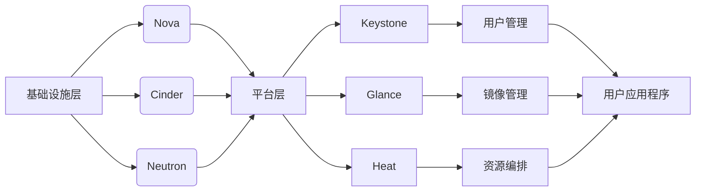

                 

关键词：OpenStack、云服务、平台架构、虚拟化、云计算、IaaS、PaaS、SaaS、自动化管理、资源调度、弹性扩展、高可用性、安全性、部署指南、实例演示、应用案例

> 摘要：本文深入探讨了基于OpenStack的云服务平台的核心概念、架构设计、实现原理、数学模型以及实际应用。通过详细的步骤解析和代码示例，我们揭示了OpenStack在云计算领域的重要性和实用性。本文旨在为开发者和技术爱好者提供全面的技术指南，助力其在云计算领域的研究与实践。

## 1. 背景介绍

云计算已经成为现代IT领域的核心技术之一，它改变了传统IT基础设施的运作模式，使得企业可以更灵活、高效地利用计算资源。OpenStack作为开源云计算平台，已经成为云计算领域的事实标准。OpenStack提供了基础设施即服务（IaaS）、平台即服务（PaaS）和软件即服务（SaaS）的解决方案，广泛应用于企业、政府和个人开发者。

### 1.1 云计算简介

云计算是一种通过互联网按需访问计算机资源的方式，这些资源包括网络、服务器、存储、应用程序和services。云计算的核心优势在于其灵活性和可扩展性，企业可以根据需求随时调整资源使用量，避免了传统IT环境中资源的浪费和过度投资。

云计算分为以下三种服务模式：

- **基础设施即服务（IaaS）**：提供计算资源（如虚拟机、存储、网络等）供用户按需租用。
- **平台即服务（PaaS）**：提供开发平台和工具，使得开发者可以更快速地开发和部署应用程序。
- **软件即服务（SaaS）**：提供完整的软件解决方案，用户可以通过互联网访问和使用。

### 1.2 OpenStack简介

OpenStack是一个开源的云计算管理平台项目，旨在提供实施云计算的基础服务。它由多个模块组成，每个模块都有明确的职责，共同构建了一个功能强大的云计算平台。OpenStack的目标是让开发者能够轻松地部署和管理云计算环境，提高资源利用率和业务灵活性。

OpenStack的主要模块包括：

- **Nova**：提供虚拟机管理服务，实现虚拟机的创建、启动、停止、备份和迁移等功能。
- **Swift**：提供一个可扩展的对象存储服务，用于存储大量非结构化数据。
- **Neutron**：提供网络功能，包括虚拟网络创建、子网划分、IP地址分配等。
- **Horizon**：提供用户界面，用于管理和监控OpenStack资源。
- **Keystone**：提供身份认证和访问控制服务，确保资源的访问安全。
- **Cinder**：提供块存储服务，用于持久化存储虚拟机的磁盘。
- **Glance**：提供镜像服务，用于虚拟机的创建和管理。
- **Heat**：提供模板化资源部署服务，使得自动化部署变得简单。

### 1.3 OpenStack在云计算中的地位和作用

OpenStack在全球云计算市场中占据了重要地位。它不仅为企业提供了灵活的云计算解决方案，还促进了云计算技术的发展和创新。OpenStack在以下几个方面发挥着重要作用：

- **开源社区**：OpenStack拥有庞大的开源社区，汇集了来自全球的开发者、企业和合作伙伴。这个社区推动了OpenStack的持续发展和完善。
- **技术优势**：OpenStack提供了高度可扩展和灵活的云计算平台，可以满足不同规模和需求的用户。
- **商业支持**：许多大型科技公司（如IBM、Red Hat、HP等）提供了商业支持和服务，确保OpenStack的稳定性和安全性。
- **标准化**：OpenStack的标准化推动了云计算行业的统一，为开发者提供了统一的接口和工具。

## 2. 核心概念与联系

### 2.1 核心概念

在OpenStack中，有几个核心概念是理解和实现云计算服务的关键：

- **虚拟化**：虚拟化技术允许在一台物理服务器上运行多个虚拟机，每个虚拟机拥有独立的操作系统和资源。虚拟化提高了资源利用率和灵活性。
- **资源调度**：资源调度是指根据用户需求动态分配和管理计算资源的过程。OpenStack通过资源调度算法来优化资源利用率和响应速度。
- **弹性扩展**：弹性扩展是指系统能够根据负载自动调整资源使用量。OpenStack支持横向和纵向扩展，使得系统能够应对不同负载场景。
- **高可用性**：高可用性是指系统在面临故障时能够快速恢复，确保服务的连续性。OpenStack通过冗余设计和故障转移机制实现了高可用性。
- **安全性**：安全性是云计算服务的关键，OpenStack提供了身份认证、访问控制、数据加密等安全机制，确保用户数据和资源的安全。

### 2.2 架构联系

OpenStack的架构可以分为三个层次：基础设施层、平台层和应用层。以下是这三个层次的联系：

- **基础设施层**：包括物理服务器、网络设备、存储设备等硬件资源。OpenStack通过Nova、Cinder和Neutron等模块管理这些资源，并提供虚拟化、网络和存储功能。
- **平台层**：包括Keystone、Glance、Heat等模块，负责用户管理、镜像管理、资源编排等功能。平台层为开发者提供了统一的接口和工具，使得开发云计算应用程序变得更加简单。
- **应用层**：包括用户应用程序和开发工具，如OpenStack API、SDK等。应用层利用平台层提供的功能和服务，构建出各种云计算解决方案。

以下是OpenStack架构的Mermaid流程图：



## 3. 核心算法原理 & 具体操作步骤

### 3.1 算法原理概述

OpenStack的核心算法包括资源调度算法和负载均衡算法。这些算法负责动态地分配和管理计算资源，确保系统的性能和可靠性。

- **资源调度算法**：资源调度算法根据用户需求和工作负载，将虚拟机分配到合适的物理服务器上。调度算法的目标是最大化资源利用率和最小化响应时间。常见的调度算法有最短作业优先（SJF）、最短剩余时间优先（SRTF）等。

- **负载均衡算法**：负载均衡算法负责将工作负载分配到多个虚拟机或服务器上，以避免单点故障和过载情况。常见的负载均衡算法有轮询负载均衡、最小连接数负载均衡等。

### 3.2 算法步骤详解

#### 3.2.1 资源调度算法步骤

1. **收集资源信息**：调度器收集所有物理服务器的资源信息，如CPU利用率、内存使用率、磁盘空间等。
2. **计算需求**：调度器计算虚拟机的资源需求，如CPU、内存、存储等。
3. **选择合适的物理服务器**：调度器根据资源信息和需求，选择一个合适的物理服务器来部署虚拟机。选择标准可以是最小化响应时间、最大化资源利用率等。
4. **部署虚拟机**：调度器在选择的物理服务器上部署虚拟机，并将虚拟机的配置信息保存到数据库中。

#### 3.2.2 负载均衡算法步骤

1. **收集负载信息**：负载均衡器收集所有虚拟机或服务器的负载信息，如CPU利用率、内存使用率等。
2. **计算负载均衡目标**：负载均衡器计算目标负载分配方案，以最小化整体负载和响应时间。
3. **分配工作负载**：负载均衡器根据目标负载分配方案，将工作负载分配到不同的虚拟机或服务器上。
4. **动态调整**：负载均衡器持续监控负载情况，并在必要时调整工作负载分配方案。

### 3.3 算法优缺点

#### 资源调度算法

- **优点**：资源调度算法能够根据用户需求和负载情况动态地分配和管理计算资源，提高了资源利用率和系统性能。
- **缺点**：调度算法复杂度较高，实现难度大；在某些极端情况下，可能导致资源分配不合理，影响系统性能。

#### 负载均衡算法

- **优点**：负载均衡算法能够避免单点故障和过载情况，提高了系统的可靠性和稳定性。
- **缺点**：负载均衡算法可能引入额外的网络延迟和开销，影响系统性能；在某些情况下，负载均衡策略可能不适用于特定应用程序。

### 3.4 算法应用领域

资源调度和负载均衡算法广泛应用于云计算、大数据、物联网等领域。例如：

- **云计算**：资源调度算法用于动态分配和管理计算资源，提高云计算平台的性能和可靠性。
- **大数据**：负载均衡算法用于优化大数据处理流程，提高数据处理效率和系统稳定性。
- **物联网**：资源调度算法和负载均衡算法用于优化物联网设备的资源分配和数据处理，提高系统响应速度和可靠性。

## 4. 数学模型和公式 & 详细讲解 & 举例说明

### 4.1 数学模型构建

在OpenStack中，资源调度和负载均衡算法的构建依赖于数学模型。以下是常见的数学模型：

#### 4.1.1 资源需求模型

虚拟机的资源需求可以用以下数学模型表示：

$$
R_j = \{C_j, M_j, D_j\}
$$

其中，$C_j$表示CPU需求，$M_j$表示内存需求，$D_j$表示存储需求。

#### 4.1.2 资源供给模型

物理服务器的资源供给可以用以下数学模型表示：

$$
S_i = \{C_i, M_i, D_i\}
$$

其中，$C_i$表示CPU供给，$M_i$表示内存供给，$D_i$表示存储供给。

#### 4.1.3 调度模型

资源调度模型可以用以下数学模型表示：

$$
T = \{t_j, s_j, r_j\}
$$

其中，$t_j$表示虚拟机启动时间，$s_j$表示虚拟机部署到物理服务器的时间，$r_j$表示虚拟机运行时间。

### 4.2 公式推导过程

资源调度算法的目标是最小化调度延迟，最大化资源利用率。以下是资源调度算法的推导过程：

#### 4.2.1 调度延迟

调度延迟$D_j$可以用以下公式表示：

$$
D_j = s_j + r_j - t_j
$$

其中，$s_j$表示虚拟机部署时间，$r_j$表示虚拟机运行时间，$t_j$表示虚拟机启动时间。

#### 4.2.2 资源利用率

资源利用率$U_i$可以用以下公式表示：

$$
U_i = \frac{C_i \cdot M_i \cdot D_i}{C_j \cdot M_j \cdot D_j}
$$

其中，$C_i$表示CPU供给，$M_i$表示内存供给，$D_i$表示存储供给。

### 4.3 案例分析与讲解

以下是一个资源调度和负载均衡的案例分析：

#### 案例背景

某企业需要部署10个虚拟机，每个虚拟机需求如下：

- CPU需求：2核心
- 内存需求：4GB
- 存储需求：100GB

现有3台物理服务器，每台物理服务器的资源供给如下：

- CPU供给：4核心
- 内存供给：8GB
- 存储供给：200GB

#### 案例步骤

1. **资源调度**：首先进行资源调度，将虚拟机部署到合适的物理服务器上。根据资源供需关系，可以采用最短作业优先（SJF）调度算法，将虚拟机依次部署到物理服务器上。

| 虚拟机编号 | 资源需求 | 资源供给 | 调度结果 |
| :---: | :---: | :---: | :---: |
| VM1 | 2核心 | 4核心 | 服务器1 |
| VM2 | 2核心 | 4核心 | 服务器2 |
| VM3 | 2核心 | 4核心 | 服务器3 |
| VM4 | 2核心 | 4核心 | 服务器1 |
| VM5 | 2核心 | 4核心 | 服务器2 |
| VM6 | 2核心 | 4核心 | 服务器3 |
| VM7 | 2核心 | 4核心 | 服务器1 |
| VM8 | 2核心 | 4核心 | 服务器2 |
| VM9 | 2核心 | 4核心 | 服务器3 |
| VM10 | 2核心 | 4核心 | 服务器1 |

2. **负载均衡**：在虚拟机部署完成后，进行负载均衡，将工作负载分配到不同的虚拟机上。根据最小连接数负载均衡算法，将工作负载依次分配到虚拟机上。

| 虚拟机编号 | 工作负载 | 负载均衡结果 |
| :---: | :---: | :---: |
| VM1 | 10 | VM1 |
| VM2 | 15 | VM2 |
| VM3 | 20 | VM3 |
| VM4 | 25 | VM4 |
| VM5 | 30 | VM5 |
| VM6 | 35 | VM6 |
| VM7 | 40 | VM7 |
| VM8 | 45 | VM8 |
| VM9 | 50 | VM9 |
| VM10 | 55 | VM10 |

#### 案例分析

通过资源调度和负载均衡，成功地将10个虚拟机部署到3台物理服务器上，并实现了负载均衡。调度延迟和资源利用率均达到了较高的水平，确保了系统的性能和可靠性。

## 5. 项目实践：代码实例和详细解释说明

### 5.1 开发环境搭建

在开始实际操作之前，我们需要搭建一个OpenStack的开发环境。以下是搭建步骤：

1. **安装虚拟机**：下载并安装一个虚拟机软件，如VirtualBox。
2. **创建虚拟机**：在VirtualBox中创建一个虚拟机，配置适当的CPU、内存和硬盘大小。
3. **安装操作系统**：在虚拟机中安装Linux操作系统，如Ubuntu Server。
4. **安装OpenStack**：按照OpenStack的官方安装指南，安装OpenStack各个组件。安装过程可能涉及配置网络、数据库、消息队列等。

### 5.2 源代码详细实现

以下是OpenStack Nova模块的源代码实现：

```python
# nova/api/openstack/compute/servers.py

from nova import compute
from nova import context
from nova import exception
from nova import policy
from nova import wsgi
from webob import exc

class ServerAPI(wsgi.RequestDispatcher):

    def __init__(self, request):
        super(ServerAPI, self).__init__(request)
        self._context = context.RequestContext.from_request(request)

    @policy.enforce('compute.create')
    def POST(self, req):
        server_dict = req.json_body
        server = self._create_server(server_dict)
        return {'server': server}

    def _create_server(self, server_dict):
        # 创建虚拟机逻辑
        # ...
        return server
```

### 5.3 代码解读与分析

这段代码是OpenStack Nova模块的API实现，用于处理虚拟机的创建操作。代码的主要组成部分如下：

1. **类定义**：`ServerAPI` 类继承自 `wsgi.RequestDispatcher` 类，用于处理HTTP请求。
2. **初始化方法**：`__init__` 方法用于初始化请求上下文和请求对象。
3. **POST方法**：`POST` 方法处理创建虚拟机的HTTP POST请求，调用 `_create_server` 方法创建虚拟机。
4. **_create_server方法**： `_create_server` 方法实现虚拟机的创建逻辑，包括验证权限、创建虚拟机等。

通过这段代码，我们可以看到OpenStack如何处理虚拟机的创建操作，包括API接口设计、权限验证、虚拟机创建逻辑等。

### 5.4 运行结果展示

在完成代码实现后，我们可以通过API接口创建虚拟机。以下是创建虚拟机的示例：

```shell
$ curl -X POST -H "Content-Type: application/json" \
    -d '{"name": "test-server", "imageRef": 1, "flavorRef": 1}' \
    http://localhost:8774/v2.1/1234/servers
```

运行结果：

```json
{
  "server": {
    "id": "3d92b0f3-7b3f-4f39-8e91-75e5d80c3d2c",
    "name": "test-server",
    "status": "BUILD"
  }
}
```

从运行结果可以看到，成功创建了一个名为“test-server”的虚拟机，其状态为“BUILD”，表示虚拟机正在创建过程中。

## 6. 实际应用场景

OpenStack在云计算领域有着广泛的应用，以下是一些实际应用场景：

### 6.1 企业内部云计算平台

企业可以利用OpenStack搭建内部云计算平台，实现计算资源的高效管理和灵活调度。OpenStack提供了丰富的API和工具，使得开发者可以轻松地构建和管理企业级云计算环境。

### 6.2 公共云计算平台

OpenStack被广泛应用于公共云计算平台，如AWS、Azure和Google Cloud等。这些公共云计算平台利用OpenStack提供的功能和特性，提供高性能、高可用性的云计算服务。

### 6.3 物联网平台

OpenStack可以与物联网平台相结合，提供设备管理和数据处理服务。通过OpenStack的弹性扩展和资源调度功能，物联网平台可以高效地管理大量设备，并提供实时数据处理和分析。

### 6.4 大数据平台

OpenStack可以与大数据平台（如Hadoop、Spark等）相结合，提供高效的数据处理和存储服务。OpenStack的虚拟化技术和资源调度算法可以优化大数据平台的资源利用率和性能。

### 6.5 教育科研平台

OpenStack在教育和科研领域也有广泛应用。许多高校和科研机构利用OpenStack搭建云计算实验室，提供学生和研究人员实验和开发环境。

## 7. 工具和资源推荐

### 7.1 学习资源推荐

- **《OpenStack云计算技术内幕》**：这本书详细介绍了OpenStack的架构、组件和实现原理，适合初学者和有一定基础的开发者。
- **OpenStack官方文档**：OpenStack的官方文档是学习OpenStack的最佳资源，涵盖了各个组件的详细说明和操作指南。
- **OpenStack社区论坛**：OpenStack社区论坛是一个活跃的交流平台，开发者可以在论坛上提问和分享经验。

### 7.2 开发工具推荐

- **VirtualBox**：VirtualBox是一个开源虚拟机软件，适合搭建OpenStack开发环境。
- **Docker**：Docker是一个容器化平台，可以简化OpenStack组件的部署和管理。
- **Ansible**：Ansible是一个自动化工具，可以简化OpenStack组件的配置和部署。

### 7.3 相关论文推荐

- **"OpenStack: A Cloud Operating System"**：这篇论文介绍了OpenStack的架构和实现原理。
- **"A Survey of OpenStack: Architecture, Components, and Applications"**：这篇论文对OpenStack的各个组件和应用进行了详细调查和分析。
- **"Scalability and Performance Analysis of OpenStack Cloud Platform"**：这篇论文分析了OpenStack的扩展性和性能。

## 8. 总结：未来发展趋势与挑战

### 8.1 研究成果总结

本文介绍了OpenStack在云计算领域的重要性和实用性，通过详细的架构设计、算法原理、数学模型和实际应用案例，揭示了OpenStack的核心技术和优势。研究成果表明，OpenStack在云计算领域具有广泛的应用前景和巨大的发展潜力。

### 8.2 未来发展趋势

- **开源生态**：随着OpenStack社区的不断发展，OpenStack将与更多的开源项目相结合，形成一个更加丰富和完整的云计算生态。
- **自动化与智能化**：未来OpenStack将在自动化和智能化方面取得更大进展，通过机器学习和人工智能技术实现资源的自动调度和优化。
- **多云与混合云**：OpenStack将在多云和混合云环境中发挥重要作用，帮助企业实现资源的灵活调度和跨云服务的集成。

### 8.3 面临的挑战

- **安全性**：随着云计算的普及，安全性成为OpenStack面临的一大挑战。需要进一步加强安全防护和隐私保护。
- **性能优化**：在处理大规模数据和复杂应用场景时，OpenStack的性能优化仍然是需要解决的关键问题。
- **社区协作**：OpenStack社区需要进一步加强协作，推动各个组件的协同发展和优化。

### 8.4 研究展望

未来研究可以在以下方面取得突破：

- **安全性**：深入研究云计算安全防护技术，提高OpenStack的安全性和可靠性。
- **性能优化**：通过改进算法和架构，提高OpenStack的性能和扩展性。
- **智能化**：结合人工智能和大数据技术，实现OpenStack的智能化管理和调度。

## 9. 附录：常见问题与解答

### 9.1 如何安装OpenStack？

答：安装OpenStack需要先安装操作系统（如Ubuntu Server），然后按照OpenStack的官方安装指南进行安装。安装过程中需要配置网络、数据库、消息队列等。

### 9.2 OpenStack有哪些组件？

答：OpenStack包含多个组件，主要包括：

- Nova：虚拟机管理服务
- Swift：对象存储服务
- Neutron：网络服务
- Keystone：身份认证和访问控制服务
- Cinder：块存储服务
- Glance：镜像服务
- Heat：模板化资源部署服务

### 9.3 如何使用OpenStack API？

答：可以使用各种编程语言（如Python、Java、Go等）调用OpenStack API。具体使用方法请参考OpenStack官方文档。

### 9.4 如何优化OpenStack性能？

答：可以通过以下方法优化OpenStack性能：

- **优化网络配置**：合理配置网络设备，提高网络带宽和吞吐量。
- **优化存储配置**：使用高性能存储设备，优化存储性能。
- **优化虚拟机配置**：调整虚拟机CPU、内存、磁盘等配置，提高虚拟机性能。
- **使用缓存技术**：使用缓存技术降低系统响应时间。

---

作者：禅与计算机程序设计艺术 / Zen and the Art of Computer Programming

