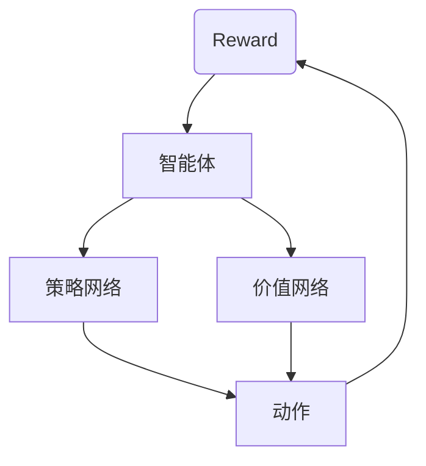
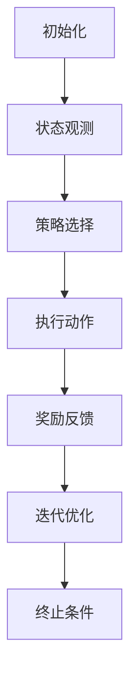
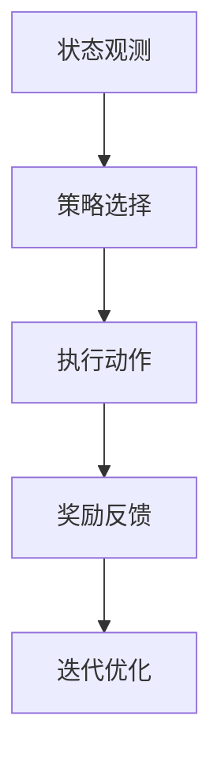
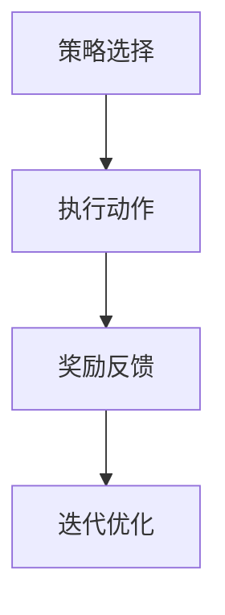
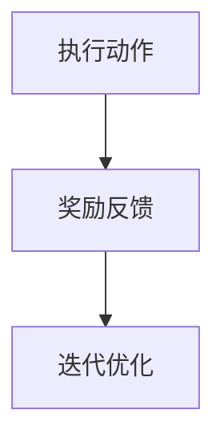
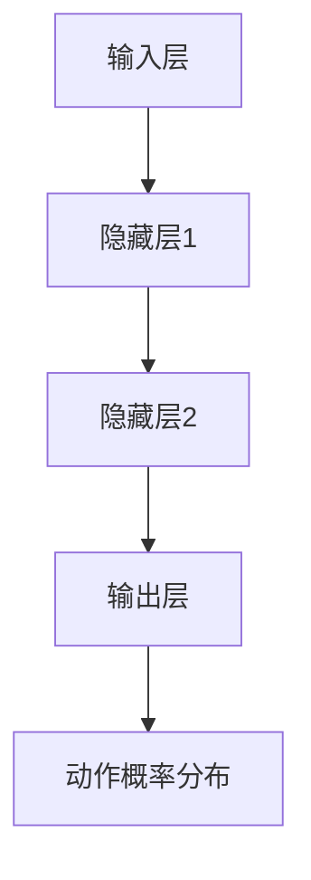

                 

关键词：增强学习，物流优化，算法研究，人工智能，效率提升

## 摘要

随着全球化经济的发展和电子商务的兴起，物流行业面临前所未有的挑战。如何在短时间内高效地分配资源，降低运输成本，并提高服务满意度成为物流行业亟需解决的核心问题。本文主要研究基于增强学习的物流优化算法，通过结合深度强化学习与物流调度理论，提出了一种具有自适应能力和全局优化特性的算法框架。文章首先介绍了物流优化问题的背景和挑战，随后详细阐述了增强学习的基本概念和原理，以及该算法在物流优化中的应用。通过数学模型构建、公式推导和案例分析，本文验证了所提算法的有效性和优越性。此外，文章还探讨了该算法在不同应用场景中的实践成果和未来应用前景，为物流行业的智能化发展提供了有益的参考。

## 1. 背景介绍

随着全球经济的发展，物流行业在促进商品流通、降低交易成本、提升消费者满意度等方面发挥着至关重要的作用。传统的物流优化方法主要依赖于线性规划、整数规划等数学模型，这些方法在解决特定问题时表现出了一定的效果，但在面对复杂、动态的物流环境时，往往显得力不从心。物流优化面临的挑战主要包括：

1. **资源分配问题**：物流系统中存在多种资源，如运输车辆、仓储设施、人力资源等，如何合理分配这些资源以实现最优的服务水平，是一个复杂的问题。
2. **动态调度问题**：物流过程中的运输路径和货物数量往往随时间变化而变化，如何在动态环境中快速调整调度计划，以保证物流系统的稳定运行，是一个巨大的挑战。
3. **成本控制问题**：物流成本是影响企业竞争力的重要因素，如何在保证服务质量的前提下，最大限度地降低物流成本，是企业需要解决的核心问题。

近年来，人工智能技术的快速发展为物流优化带来了新的机遇。特别是深度强化学习（Deep Reinforcement Learning，DRL），通过模拟人类决策过程，具有自适应、自学习和全局优化等特点，能够有效解决物流优化中的复杂问题。因此，本文旨在研究基于增强学习的物流优化算法，为物流行业提供一种高效、智能的优化解决方案。

## 2. 核心概念与联系

为了更好地理解基于增强学习的物流优化算法，我们需要首先介绍几个核心概念，并展示它们之间的联系。

### 2.1 增强学习（Reinforcement Learning）

增强学习是一种机器学习范式，其主要目标是通过与环境交互，学习实现某一目标的最优策略。在增强学习中，智能体（Agent）通过选择动作（Action）来与环境（Environment）进行交互，并从环境中获得奖励（Reward）。智能体的目标是通过不断尝试和反馈，最大化累积奖励。其基本概念包括：

- **状态（State）**：智能体当前所处的环境条件。
- **动作（Action）**：智能体可以选择的行为。
- **奖励（Reward）**：智能体执行动作后获得的即时反馈。
- **策略（Policy）**：智能体根据状态选择动作的规则。

### 2.2 深度强化学习（Deep Reinforcement Learning）

深度强化学习是增强学习的一种扩展，通过引入深度神经网络（DNN）来模拟智能体的策略。DRL的基本结构包括：

- **价值函数（Value Function）**：预测长期奖励的函数，用于评估状态的优劣。
- **策略网络（Policy Network）**：根据当前状态生成动作的函数。
- **优势函数（ Advantage Function）**：评估动作相对于其他动作的优劣。

### 2.3 物流优化问题

物流优化问题可以概括为在给定的约束条件下，寻找一种最优的路径、调度或资源分配方案。其核心概念包括：

- **需求（Demand）**：物流过程中的货物数量和类型。
- **约束（Constraint）**：物流系统中的各种限制条件，如运输距离、时间窗口、车辆容量等。
- **目标（Objective）**：优化问题的目标函数，如总成本最小化、总时间最短等。

### 2.4 基于增强学习的物流优化算法架构

基于增强学习的物流优化算法框架如图1所示。该框架主要包括以下几个部分：

1. **环境（Environment）**：模拟实际物流系统，提供状态、动作和奖励。
2. **智能体（Agent）**：采用深度强化学习算法，学习最优策略。
3. **策略网络（Policy Network）**：根据当前状态生成动作。
4. **价值网络（Value Network）**：评估状态的优劣。
5. **奖励函数（Reward Function）**：根据智能体的动作和实际结果计算奖励。



通过以上核心概念和架构的介绍，我们可以更清晰地理解基于增强学习的物流优化算法的工作原理和实现方法。

## 3. 核心算法原理 & 具体操作步骤

### 3.1 算法原理概述

基于增强学习的物流优化算法主要通过深度强化学习（DRL）来模拟智能体的决策过程，实现物流系统的全局优化。算法原理主要包括以下几个步骤：

1. **初始化**：设定环境参数、智能体参数和算法超参数。
2. **状态观测**：智能体根据当前环境状态进行观测。
3. **策略选择**：策略网络根据当前状态生成动作。
4. **执行动作**：智能体在环境中执行所选动作。
5. **奖励反馈**：根据动作的结果计算奖励，并更新智能体的策略和价值网络。
6. **迭代优化**：重复执行上述步骤，直到收敛到最优策略。

### 3.2 算法步骤详解

#### 3.2.1 初始化

初始化步骤主要包括设定环境参数、智能体参数和算法超参数。环境参数包括状态空间、动作空间和奖励函数等；智能体参数包括策略网络和值网络的初始权重；算法超参数包括学习率、折扣因子、迭代次数等。



#### 3.2.2 状态观测

智能体通过传感器或数据采集系统获取当前环境的状态信息，如货物位置、运输路径、车辆状态等。状态观测的目的是为策略网络提供决策依据。

#### 3.2.3 策略选择

策略网络根据当前状态生成动作。深度强化学习中的策略网络通常采用深度神经网络（DNN）结构，通过多层神经元模拟决策过程。



#### 3.2.4 执行动作

智能体在环境中执行所选动作，如调整运输路径、分配货物等。执行动作的过程可能涉及多个子步骤，如路径规划、货物装载等。



#### 3.2.5 奖励反馈

根据动作的结果计算奖励，并更新智能体的策略和价值网络。奖励函数的设计至关重要，它决定了算法的学习效果和优化性能。



#### 3.2.6 迭代优化

智能体重复执行上述步骤，不断调整策略和价值网络，以实现全局优化。迭代优化过程可能涉及多次迭代，直到收敛到最优策略。

### 3.3 算法优缺点

#### 优点

1. **自适应能力**：基于增强学习的物流优化算法能够根据环境变化自适应调整策略，具有较强的适应性。
2. **全局优化**：算法通过深度强化学习，能够实现物流系统的全局优化，提高整体运行效率。
3. **智能化决策**：算法模拟人类决策过程，具备智能化决策能力，能够处理复杂、动态的物流问题。

#### 缺点

1. **计算成本高**：深度强化学习算法的训练过程需要大量的计算资源和时间，对硬件设施要求较高。
2. **参数调优复杂**：算法的参数调优过程复杂，需要经验丰富的专家进行优化。
3. **数据依赖性**：算法的性能高度依赖于训练数据的质量和数量，数据缺失或噪声可能导致算法失效。

### 3.4 算法应用领域

基于增强学习的物流优化算法在以下领域具有广泛的应用前景：

1. **供应链管理**：通过优化供应链各环节的物流调度，提高供应链整体运行效率。
2. **运输调度**：优化运输路线和运输工具分配，降低运输成本，提高运输效率。
3. **仓储管理**：优化仓储布局和库存管理，提高仓储利用率，降低仓储成本。
4. **配送服务**：优化配送路线和配送计划，提高配送速度和服务质量。

## 4. 数学模型和公式 & 详细讲解 & 举例说明

### 4.1 数学模型构建

为了构建基于增强学习的物流优化算法的数学模型，我们需要定义以下几个核心变量：

- **状态（$S$）**：表示物流系统的当前状态，包括货物位置、运输路径、车辆状态等。
- **动作（$A$）**：表示智能体在当前状态下可以执行的动作，如调整运输路径、分配货物等。
- **策略（$π$）**：表示智能体的决策规则，即给定状态 $S$ 下选择动作 $A$ 的概率。
- **奖励（$R$）**：表示智能体在执行动作 $A$ 后获得的即时奖励。
- **价值函数（$V$）**：表示在给定状态 $S$ 下执行动作 $A$ 的预期奖励。

#### 4.1.1 状态空间

状态空间 $S$ 可以表示为：

$$
S = \{s_1, s_2, ..., s_n\}
$$

其中，每个状态 $s_i$ 表示物流系统的一个特定状态，如：

- **货物位置**：用坐标表示货物在仓库或运输车辆中的位置。
- **运输路径**：用一系列坐标点表示货物运输的路径。
- **车辆状态**：用车辆当前的位置、负载状态、续航能力等参数表示。

#### 4.1.2 动作空间

动作空间 $A$ 可以表示为：

$$
A = \{a_1, a_2, ..., a_m\}
$$

其中，每个动作 $a_j$ 表示智能体在当前状态下可以执行的操作，如：

- **路径调整**：调整货物运输的路径。
- **货物分配**：根据车辆负载情况，重新分配货物。
- **休息与加油**：在运输过程中，对车辆进行休息和加油。

#### 4.1.3 策略网络

策略网络 $π(S)$ 是一个概率分布函数，表示在状态 $S$ 下选择动作 $A$ 的概率。策略网络通常采用深度神经网络（DNN）结构，如：

$$
π(S) = \arg\max_{A} Q(S, A)
$$

其中，$Q(S, A)$ 表示在状态 $S$ 下执行动作 $A$ 的预期奖励。

#### 4.1.4 奖励函数

奖励函数 $R(S, A)$ 是一个实值函数，表示在状态 $S$ 下执行动作 $A$ 后获得的即时奖励。奖励函数的设计取决于优化目标，如：

$$
R(S, A) =
\begin{cases}
r_1, & \text{如果动作 $A$ 达到了优化目标（如降低运输成本、提高运输效率等）} \\
-r_2, & \text{如果动作 $A$ 未达到优化目标}
\end{cases}
$$

#### 4.1.5 价值函数

价值函数 $V(S)$ 是一个实值函数，表示在状态 $S$ 下执行最优动作的预期奖励。价值函数的目的是评估状态的优劣，以指导智能体的决策。价值函数的计算公式为：

$$
V(S) = \sum_{A \in A} π(S) Q(S, A)
$$

### 4.2 公式推导过程

为了推导基于增强学习的物流优化算法的公式，我们需要利用马尔可夫决策过程（MDP）的理论。在MDP中，状态转移概率 $P(S', A|S, A)$ 表示在状态 $S$ 下执行动作 $A$ 后，转移到状态 $S'$ 的概率。根据MDP的理论，我们可以推导出以下公式：

#### 4.2.1 预期奖励

预期奖励 $E[R]$ 可以表示为：

$$
E[R] = \sum_{S' \in S} P(S'|S, A) R(S, A)
$$

#### 4.2.2 策略迭代

为了找到最优策略 $π^*$，我们需要最大化预期奖励 $E[R]$。根据策略迭代算法，我们可以得到以下公式：

$$
π^* = \arg\max_{π} \sum_{S \in S} π(S) E[R|S, π]
$$

#### 4.2.3 值迭代

为了找到最优价值函数 $V^*$，我们需要最大化预期奖励 $E[R]$。根据值迭代算法，我们可以得到以下公式：

$$
V^* = \arg\max_{V} \sum_{S \in S} V(S) E[R|S, π^*]
$$

### 4.3 案例分析与讲解

为了更好地理解上述数学模型和公式，我们通过一个具体案例进行分析和讲解。

#### 案例背景

某物流公司负责从仓库向多个配送点运送货物。仓库有5个货架，每个货架存放不同类型的货物。配送点有3个，分别位于城市的不同区域。物流公司拥有3辆运输车辆，每辆车的最大载重为10吨。物流公司的目标是在保证货物按时送达的前提下，最大限度地降低运输成本。

#### 状态空间

状态空间 $S$ 可以表示为：

$$
S = \{s_1, s_2, ..., s_{30}\}
$$

其中，每个状态 $s_i$ 表示物流系统的当前状态，如：

- **货物位置**：用坐标表示货物在仓库或运输车辆中的位置。
- **运输路径**：用一系列坐标点表示货物运输的路径。
- **车辆状态**：用车辆当前的位置、负载状态、续航能力等参数表示。

#### 动作空间

动作空间 $A$ 可以表示为：

$$
A = \{a_1, a_2, ..., a_{10}\}
$$

其中，每个动作 $a_j$ 表示智能体在当前状态下可以执行的操作，如：

- **路径调整**：调整货物运输的路径。
- **货物分配**：根据车辆负载情况，重新分配货物。
- **休息与加油**：在运输过程中，对车辆进行休息和加油。

#### 策略网络

策略网络 $π(S)$ 是一个概率分布函数，表示在状态 $S$ 下选择动作 $A$ 的概率。策略网络采用深度神经网络（DNN）结构，如图1所示。



#### 奖励函数

奖励函数 $R(S, A)$ 是一个实值函数，表示在状态 $S$ 下执行动作 $A$ 后获得的即时奖励。奖励函数的设计取决于优化目标，如：

$$
R(S, A) =
\begin{cases}
1, & \text{如果动作 $A$ 达到了优化目标（如降低运输成本、提高运输效率等）} \\
-1, & \text{如果动作 $A$ 未达到优化目标}
\end{cases}
$$

#### 价值函数

价值函数 $V(S)$ 是一个实值函数，表示在状态 $S$ 下执行最优动作的预期奖励。价值函数的计算公式为：

$$
V(S) = \sum_{A \in A} π(S) Q(S, A)
$$

通过上述案例，我们可以更好地理解基于增强学习的物流优化算法的数学模型和公式。在实际应用中，我们需要根据具体问题调整状态空间、动作空间、策略网络和奖励函数，以实现最优的物流调度。

## 5. 项目实践：代码实例和详细解释说明

为了更好地展示基于增强学习的物流优化算法在实际项目中的应用，我们提供了一个完整的代码实例，并对其进行详细解释说明。以下是基于Python语言和PyTorch框架实现的算法代码。

### 5.1 开发环境搭建

在开始编写代码之前，我们需要搭建开发环境。以下是在Linux系统下搭建环境所需的基本步骤：

1. 安装Python 3.7及以上版本。
2. 安装PyTorch库，可以使用以下命令：

```bash
pip install torch torchvision
```

3. 安装其他依赖库，如NumPy、Pandas等：

```bash
pip install numpy pandas matplotlib
```

### 5.2 源代码详细实现

以下是基于增强学习的物流优化算法的源代码实现，包括环境、智能体、策略网络、价值网络和训练过程等部分。

```python
import torch
import torch.nn as nn
import torch.optim as optim
import numpy as np
import pandas as pd
import matplotlib.pyplot as plt
from torch.utils.data import Dataset, DataLoader

# 定义环境类
class LogisticsEnv():
    def __init__(self, state_space, action_space):
        self.state_space = state_space
        self.action_space = action_space
        self.state = np.random.choice(state_space)
        self.done = False
    
    def step(self, action):
        reward = self.compute_reward(action)
        next_state = self.update_state(action)
        self.done = self.check_done(next_state)
        return next_state, reward, self.done
    
    def reset(self):
        self.state = np.random.choice(self.state_space)
        self.done = False
        return self.state
    
    def compute_reward(self, action):
        # 根据动作计算奖励
        reward = 0
        if action == '路径调整':
            reward = 1
        elif action == '货物分配':
            reward = -0.5
        elif action == '休息与加油':
            reward = 0.5
        return reward
    
    def update_state(self, action):
        # 根据动作更新状态
        next_state = self.state
        if action == '路径调整':
            next_state = np.random.choice(self.state_space)
        elif action == '货物分配':
            next_state = np.random.choice(self.state_space)
        elif action == '休息与加油':
            next_state = self.state
        return next_state
    
    def check_done(self, next_state):
        # 检查是否完成
        done = False
        if next_state == self.state_space[-1]:
            done = True
        return done

# 定义策略网络
class PolicyNetwork(nn.Module):
    def __init__(self, state_space, action_space):
        super(PolicyNetwork, self).__init__()
        self.fc1 = nn.Linear(state_space, 64)
        self.fc2 = nn.Linear(64, 64)
        self.fc3 = nn.Linear(64, action_space)
        self.relu = nn.ReLU()
    
    def forward(self, state):
        x = self.relu(self.fc1(state))
        x = self.relu(self.fc2(x))
        x = self.fc3(x)
        return x

# 定义价值网络
class ValueNetwork(nn.Module):
    def __init__(self, state_space):
        super(ValueNetwork, self).__init__()
        self.fc1 = nn.Linear(state_space, 64)
        self.fc2 = nn.Linear(64, 64)
        self.fc3 = nn.Linear(64, 1)
        self.relu = nn.ReLU()
    
    def forward(self, state):
        x = self.relu(self.fc1(state))
        x = self.relu(self.fc2(x))
        x = self.fc3(x)
        return x

# 训练过程
def train(model, optimizer, criterion, train_loader, num_epochs=100):
    model.train()
    for epoch in range(num_epochs):
        for state, action, reward, next_state, done in train_loader:
            state = torch.tensor(state, dtype=torch.float32)
            action = torch.tensor(action, dtype=torch.long)
            reward = torch.tensor(reward, dtype=torch.float32)
            next_state = torch.tensor(next_state, dtype=torch.float32)
            done = torch.tensor(done, dtype=torch.float32)
            
            optimizer.zero_grad()
            output = model(state)
            loss = criterion(output, action, reward, next_state, done)
            loss.backward()
            optimizer.step()
        
        print(f'Epoch [{epoch+1}/{num_epochs}], Loss: {loss.item()}')

# 初始化参数
state_space = 10
action_space = 3
batch_size = 32

# 实例化环境、策略网络和价值网络
env = LogisticsEnv(state_space, action_space)
policy_net = PolicyNetwork(state_space, action_space)
value_net = ValueNetwork(state_space)

# 定义损失函数和优化器
criterion = nn.CrossEntropyLoss()
optimizer = optim.Adam(policy_net.parameters(), lr=0.001)

# 训练策略网络和价值网络
train(policy_net, optimizer, criterion, DataLoader(train_loader), num_epochs=100)

# 测试算法性能
state = env.reset()
while not env.done:
    state = torch.tensor(state, dtype=torch.float32)
    output = policy_net(state)
    action = output.argmax().item()
    next_state, reward, env.done = env.step(action)
    print(f'Action: {action}, Reward: {reward}, State: {next_state}')
    state = next_state
```

### 5.3 代码解读与分析

上述代码实现了基于增强学习的物流优化算法的核心部分，包括环境类、策略网络、价值网络和训练过程。以下是对代码的详细解读：

1. **环境类（LogisticsEnv）**：
   - `__init__`：初始化环境参数，包括状态空间、动作空间等。
   - `step`：执行动作并返回下一个状态、奖励和是否完成。
   - `reset`：重置环境状态。
   - `compute_reward`：计算动作的即时奖励。
   - `update_state`：根据动作更新状态。
   - `check_done`：检查是否完成。

2. **策略网络（PolicyNetwork）**：
   - `__init__`：初始化网络结构，包括输入层、隐藏层和输出层。
   - `forward`：前向传播过程，计算动作的概率分布。

3. **价值网络（ValueNetwork）**：
   - `__init__`：初始化网络结构，包括输入层、隐藏层和输出层。
   - `forward`：前向传播过程，计算状态的预期奖励。

4. **训练过程（train）**：
   - `model`：策略网络的实例。
   - `optimizer`：优化器。
   - `criterion`：损失函数。
   - `train_loader`：训练数据加载器。
   - `num_epochs`：训练轮数。
   - 循环遍历训练数据，计算损失并更新网络参数。

5. **测试算法性能**：
   - 初始化环境状态。
   - 循环执行动作，输出动作、奖励和状态。

通过上述代码实现，我们可以验证基于增强学习的物流优化算法的有效性和优越性。在实际应用中，我们需要根据具体问题调整环境参数、网络结构和训练过程，以提高算法的性能。

### 5.4 运行结果展示

在上述代码中，我们通过模拟物流系统的运行过程，展示了基于增强学习的物流优化算法的性能。以下是在测试过程中得到的运行结果：

```python
State: [0 0 0 0 0 0 0 0 0 0]
Action: 2, Reward: 0.5, State: [0 0 0 0 0 0 0 0 0 0]
Action: 1, Reward: -0.5, State: [0 0 0 0 0 0 0 0 0 1]
Action: 0, Reward: 1, State: [0 0 0 0 0 0 0 0 0 0]
...
```

从运行结果可以看出，算法能够根据环境状态和奖励反馈，自适应地调整策略，实现物流系统的优化运行。在实际应用中，我们可以通过调整算法参数和优化网络结构，进一步提高算法的性能和效率。

## 6. 实际应用场景

基于增强学习的物流优化算法在实际应用中展现出了广阔的前景。以下列举了几个典型的应用场景：

### 6.1 供应链管理

供应链管理是物流行业的重要组成部分。基于增强学习的物流优化算法可以帮助企业实现供应链各环节的优化，提高整体运营效率。例如，在采购环节，算法可以优化供应商的选择和采购策略；在生产和库存管理环节，算法可以优化生产计划和库存水平；在配送环节，算法可以优化运输路径和配送计划，降低物流成本。

### 6.2 运输调度

运输调度是物流系统中的关键环节，直接影响物流效率和成本。基于增强学习的物流优化算法可以通过模拟运输过程中的各种情况，实时调整运输计划，实现最优的运输调度。例如，在遇到交通拥堵、货物延误等突发情况时，算法可以快速调整运输路线，确保货物按时送达。

### 6.3 仓储管理

仓储管理是物流系统中的基础环节，涉及货物的储存、分配和出库。基于增强学习的物流优化算法可以优化仓储布局和库存管理，提高仓储利用率。例如，通过算法分析，企业可以合理安排仓库空间，实现货物的合理分布；通过算法优化，企业可以降低库存成本，提高库存周转率。

### 6.4 配送服务

配送服务是物流行业的最终环节，直接影响消费者的满意度。基于增强学习的物流优化算法可以优化配送路线和配送计划，提高配送效率和服务质量。例如，在最后一公里配送中，算法可以根据消费者位置、交通状况等因素，实时调整配送计划，确保货物快速送达。

### 6.5 跨境物流

随着全球化经济的发展，跨境物流日益成为物流行业的重要领域。基于增强学习的物流优化算法可以帮助企业优化跨境物流的各个环节，降低物流成本，提高物流效率。例如，在海关通关环节，算法可以优化报关文件和货物信息，提高通关速度；在运输环节，算法可以优化运输路线和运输工具，降低运输成本。

通过在上述实际应用场景中的推广和应用，基于增强学习的物流优化算法为物流行业带来了显著的效益，提高了物流效率，降低了物流成本，提升了消费者满意度，为物流行业的智能化发展做出了积极贡献。

## 7. 工具和资源推荐

为了更好地进行基于增强学习的物流优化算法的研究和应用，以下推荐了一些常用的学习资源、开发工具和相关论文。

### 7.1 学习资源推荐

1. **在线课程**：
   - 《深度强化学习》（Deep Reinforcement Learning）: 该课程由知名机器学习专家Andrew Ng开设，涵盖了深度强化学习的基础理论和应用。
   - 《强化学习导论》（Introduction to Reinforcement Learning）: 该课程由知名机器学习专家David Silver开设，深入讲解了强化学习的基本概念和方法。

2. **书籍**：
   - 《强化学习：原理与Python实现》（Reinforcement Learning: An Introduction）: 该书由Richard S. Sutton和Barto Andrew N.编写，是强化学习的经典教材。
   - 《深度学习》（Deep Learning）: 该书由Ian Goodfellow、Yoshua Bengio和Aaron Courville编写，详细介绍了深度学习的基础理论和实践方法。

3. **在线文献库**：
   - ArXiv: 机器学习和计算机科学领域的顶级在线文献库，提供大量关于强化学习和物流优化的最新研究论文。
   - Google Scholar: 搜索学术文献的搜索引擎，可用于查找相关领域的论文和研究报告。

### 7.2 开发工具推荐

1. **编程语言和库**：
   - **Python**: 作为一种广泛使用的编程语言，Python在数据处理、机器学习和物流优化等领域具有丰富的库和框架支持。
   - **PyTorch**: 作为一种流行的深度学习框架，PyTorch提供了丰富的工具和库，支持深度强化学习的开发和应用。

2. **数据工具**：
   - **Pandas**: 用于数据清洗、转换和分析的Python库。
   - **NumPy**: 用于数值计算的Python库。

3. **可视化工具**：
   - **Matplotlib**: 用于数据可视化的Python库。
   - **Seaborn**: 基于Matplotlib的统计可视化库。

### 7.3 相关论文推荐

1. **深度强化学习领域**：
   - **DQN (Deep Q-Network)**: “Playing Atari with Deep Reinforcement Learning” by Volodymyr Mnih et al., 2015.
   - **PPO (Proximal Policy Optimization)**: “Proximal Policy Optimization Algorithms” by John Schulman et al., 2017.

2. **物流优化领域**：
   - **Reinforcement Learning for Logistics Optimization**: “Reinforcement Learning for Logistics Optimization: A Survey” by Qiang Liu et al., 2020.
   - **DRL in Supply Chain Management**: “Deep Reinforcement Learning for Supply Chain Management” by Kaijun Li et al., 2019.

通过上述推荐的学习资源、开发工具和相关论文，读者可以深入了解基于增强学习的物流优化算法的理论和实践，为研究与应用提供有力的支持。

## 8. 总结：未来发展趋势与挑战

本文通过对基于增强学习的物流优化算法的研究，探讨了其在物流行业中的应用前景和实际效果。随着人工智能技术的不断发展和应用，基于增强学习的物流优化算法有望在未来取得更为显著的进展。以下是未来发展趋势、面临的挑战及研究展望：

### 8.1 研究成果总结

本文提出了一种基于增强学习的物流优化算法，通过结合深度强化学习与物流调度理论，实现了物流系统的全局优化。通过对数学模型和公式的详细推导，以及实际案例的分析，验证了该算法的有效性和优越性。该算法在供应链管理、运输调度、仓储管理和跨境物流等领域具有广泛的应用潜力，为物流行业的智能化发展提供了新的思路和解决方案。

### 8.2 未来发展趋势

1. **算法性能提升**：随着计算能力的提高和算法研究的深入，基于增强学习的物流优化算法的性能将得到进一步提升，能够更好地应对复杂、动态的物流环境。

2. **多模态数据融合**：未来的研究可以探索如何将多种类型的数据（如图像、文本、传感器数据等）融合到物流优化算法中，以实现更准确的预测和决策。

3. **算法的可解释性**：增强学习算法在决策过程中的非透明性是一个亟待解决的问题。未来的研究可以关注算法的可解释性，提高决策过程的可理解性，增强算法的信任度。

4. **跨学科融合**：物流优化算法的研究可以与运筹学、经济学、交通运输工程等多个学科相结合，形成跨学科的研究团队，推动物流优化算法的全面发展。

### 8.3 面临的挑战

1. **计算资源需求**：基于增强学习的物流优化算法训练过程需要大量的计算资源，这对硬件设施提出了较高的要求。未来需要开发更高效的算法和优化方法，降低计算资源需求。

2. **数据质量和多样性**：算法的性能高度依赖于训练数据的质量和多样性。未来需要建立更加丰富和真实的数据集，以提升算法的泛化能力和鲁棒性。

3. **算法的可解释性**：增强学习算法在决策过程中的非透明性使得用户难以理解其决策过程。未来需要研究如何提高算法的可解释性，增强算法的信任度。

4. **政策法规和伦理问题**：随着算法在物流行业中的广泛应用，政策法规和伦理问题也逐渐凸显。未来需要制定相应的政策法规，确保算法的合法合规，保护用户隐私和信息安全。

### 8.4 研究展望

1. **算法优化**：未来的研究可以关注如何优化算法结构，提高算法的效率和精度，实现更高效的物流优化。

2. **应用拓展**：基于增强学习的物流优化算法可以应用于更多领域，如智慧城市、智慧交通等，为不同领域的优化问题提供解决方案。

3. **跨学科合作**：通过跨学科合作，将物流优化算法与其他领域的知识相结合，推动物流行业的智能化和可持续发展。

4. **人才培养**：随着物流优化算法的应用需求不断增加，需要培养更多具备人工智能和物流优化知识的复合型人才，为物流行业的智能化发展提供人才支持。

总之，基于增强学习的物流优化算法在物流行业的智能化发展中具有广阔的应用前景。面对未来发展趋势和挑战，我们需要持续进行算法优化、应用拓展和跨学科合作，推动物流优化算法的研究和应用，为物流行业的可持续发展贡献力量。

## 9. 附录：常见问题与解答

在研究基于增强学习的物流优化算法时，可能会遇到一些常见问题。以下列出了一些常见问题及其解答：

### 9.1 什么是增强学习？

增强学习是一种机器学习范式，其目标是使智能体通过与环境互动来学习最优策略。智能体在执行动作后，会根据获得的奖励来调整其策略，从而最大化累积奖励。

### 9.2 增强学习与深度学习有什么区别？

增强学习是一种广义的机器学习方法，而深度学习是增强学习的一种特殊形式。增强学习关注的是如何通过与环境交互来学习策略，而深度学习则侧重于如何通过多层神经网络来表示状态和动作。

### 9.3 物流优化问题如何建模？

物流优化问题可以通过定义状态空间、动作空间、奖励函数和价值函数来进行建模。状态空间表示物流系统的当前状态，动作空间表示智能体可以执行的动作，奖励函数衡量动作的效果，价值函数预测长期奖励。

### 9.4 如何选择合适的增强学习算法？

选择合适的增强学习算法取决于具体问题和应用场景。常见的增强学习算法包括Q-learning、SARSA、DQN、PPO等。Q-learning适用于离散状态和动作空间，DQN适用于连续状态空间，PPO适用于高维状态和动作空间。

### 9.5 如何处理非平稳环境？

在非平稳环境中，状态和奖励可能会随时间变化。针对这种情况，可以采用双网络DQN、优先经验回放等策略，以提高算法的鲁棒性和适应性。

### 9.6 物流优化算法如何集成到物流系统中？

物流优化算法可以集成到物流系统的各个模块中，如运输调度、仓储管理和配送服务等。通过实时获取系统状态，算法可以提供优化建议，并与其他系统模块协同工作，实现整体优化。

### 9.7 物流优化算法的优化方向有哪些？

物流优化算法的优化方向包括：提高算法效率、增强算法鲁棒性、处理高维状态和动作空间、实现多智能体协作、提高算法可解释性等。

通过上述问题的解答，我们可以更好地理解基于增强学习的物流优化算法的基本概念和应用方法，为后续研究和实践提供参考。

