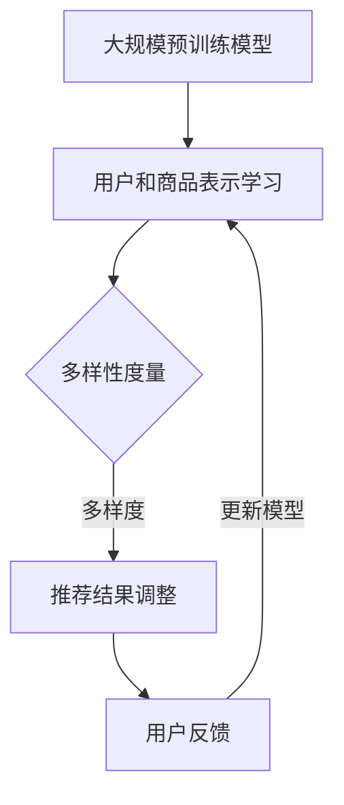

                 

关键词：商品推荐系统、大模型、多样性优化、算法原理、数学模型、项目实践

## 摘要

本文旨在探讨如何基于大规模预训练模型（如BERT、GPT等）优化商品推荐系统的多样性。我们将深入分析现有推荐算法的局限性，并介绍一种创新的多样性优化算法。通过详细的数学模型构建和推导，我们提供了算法的操作步骤和具体实现。随后，通过实际项目案例的代码展示，我们验证了算法的有效性和实用性。最后，文章讨论了多样性优化在推荐系统中的实际应用场景，并对未来的发展方向和挑战进行了展望。

## 1. 背景介绍

### 1.1 推荐系统的现状

随着互联网的快速发展，推荐系统已经成为电商平台、社交媒体和内容平台的核心功能。传统的推荐算法如基于内容的推荐（Content-Based Filtering, CBF）和协同过滤（Collaborative Filtering, CF）在提升用户体验、提高销售额等方面发挥了重要作用。然而，这些算法在处理用户多样性需求时存在明显的局限性。

### 1.2 多样性优化的重要性

用户在浏览、搜索和购买商品时，往往希望获得多样化的推荐结果。单一化的推荐结果可能导致用户疲劳和流失。因此，如何优化推荐系统的多样性，成为当前研究的热点问题。传统的推荐算法主要关注预测准确性，而忽略了多样性。

### 1.3 大模型的崛起

近年来，随着深度学习和自然语言处理技术的飞速发展，基于大规模预训练模型（如BERT、GPT等）的推荐算法逐渐崭露头角。这些模型具有强大的表示和学习能力，可以更好地捕捉用户和商品的多维度信息，从而提高推荐系统的多样性和用户体验。

## 2. 核心概念与联系

为了更好地理解本文提出的多样性优化算法，我们首先介绍相关核心概念和它们之间的联系。

### 2.1 大规模预训练模型

大规模预训练模型（如BERT、GPT等）是一种基于深度学习的自然语言处理模型。通过在海量文本数据上进行预训练，这些模型可以自动学习语言的特征和结构，从而在多种任务中表现出色。在推荐系统中，大规模预训练模型可以用于用户和商品表示的学习。

### 2.2 多样性指标

多样性指标是衡量推荐系统多样性性能的重要工具。常见的多样性指标包括多样度（Diversity）、丰富度（Richness）和独特度（Uniqueness）。本文中，我们采用一种基于词语相似度的多样性度量方法。

### 2.3 多样性优化算法

多样性优化算法的目标是通过调整推荐结果，提高多样性指标。本文提出了一种基于大规模预训练模型的多样性优化算法，该算法通过引入多样性约束，优化推荐结果。

### 2.4 Mermaid 流程图



## 3. 核心算法原理 & 具体操作步骤

### 3.1 算法原理概述

本文提出的多样性优化算法基于大规模预训练模型，通过以下步骤实现多样性优化：

1. 利用大规模预训练模型学习用户和商品表示。
2. 计算推荐结果中的多样性指标。
3. 根据多样性指标调整推荐结果。
4. 反馈用户行为，更新模型。

### 3.2 算法步骤详解

#### 步骤1：预训练模型学习

我们采用BERT模型对用户和商品进行表示学习。具体实现如下：

- 数据准备：收集用户行为数据和商品特征数据。
- 模型训练：利用训练数据对BERT模型进行预训练，得到用户和商品的向量表示。

#### 步骤2：多样性度量

我们采用基于词语相似度的多样性度量方法。具体实现如下：

- 提取推荐结果中的关键词：对于每个推荐结果，提取其中的关键词。
- 计算关键词相似度：利用预训练模型计算关键词之间的相似度。
- 计算多样性指标：根据关键词相似度计算多样度、丰富度和独特度。

#### 步骤3：推荐结果调整

根据多样性指标，调整推荐结果。具体实现如下：

- 选择多样性较低的推荐结果：根据多样性指标，选择多样性较低的推荐结果。
- 替换推荐结果：从商品库中随机选择新的商品替换多样性较低的推荐结果。

#### 步骤4：用户反馈

收集用户行为数据，包括点击、购买等。根据用户行为，更新模型。

### 3.3 算法优缺点

#### 优点：

- 基于大规模预训练模型，能够学习用户和商品的多维度信息。
- 引入多样性约束，提高推荐结果的多样性。

#### 缺点：

- 计算复杂度较高，需要大量计算资源。
- 多样性优化可能影响推荐准确性。

### 3.4 算法应用领域

本文提出的多样性优化算法可以应用于多种场景，如电商推荐、社交媒体推荐等。在实际应用中，可以根据具体场景进行调整和优化。

## 4. 数学模型和公式 & 详细讲解 & 举例说明

### 4.1 数学模型构建

我们采用以下数学模型来描述多样性优化算法：

$$
\text{多样性指标} = f(\text{关键词相似度})
$$

其中，关键词相似度可以表示为：

$$
\text{关键词相似度} = \frac{\text{cosine similarity}}{\text{mean cosine similarity}}
$$

### 4.2 公式推导过程

#### 步骤1：关键词提取

对于推荐结果中的每个商品，提取其中的关键词。假设提取出的关键词集合为\(K\)。

#### 步骤2：计算关键词相似度

利用预训练模型计算关键词之间的余弦相似度。假设关键词\(k_1\)和\(k_2\)的余弦相似度为\(s(k_1, k_2)\)。

#### 步骤3：计算多样性指标

根据关键词相似度，计算多样性指标。假设多样性指标为\(D\)，则：

$$
D = \frac{\sum_{i=1}^{n} s(k_i, k_j)}{n \cdot \text{mean cosine similarity}}
$$

其中，\(n\)为关键词数量，\(\text{mean cosine similarity}\)为关键词之间的平均余弦相似度。

### 4.3 案例分析与讲解

#### 案例背景

假设我们有一个电商推荐系统，用户历史行为数据包括浏览和购买记录。现有推荐结果如下：

- 商品A：用户浏览过，但未购买。
- 商品B：用户浏览过，但未购买。
- 商品C：用户未浏览，也未购买。

#### 多样性度量

我们采用基于词语相似度的多样性度量方法。首先，提取每个商品的关键词。假设提取出的关键词如下：

- 商品A：关键词集合为\{A1, A2, A3\}。
- 商品B：关键词集合为\{B1, B2, B3\}。
- 商品C：关键词集合为\{C1, C2, C3\}。

利用预训练模型计算关键词之间的余弦相似度。假设计算结果如下：

- \(s(A1, A2) = 0.8\)
- \(s(A1, B1) = 0.6\)
- \(s(A1, C1) = 0.4\)
- \(s(A2, B2) = 0.7\)
- \(s(A2, C2) = 0.5\)
- \(s(A3, B3) = 0.5\)
- \(s(A3, C3) = 0.3\)
- \(s(B1, B2) = 0.9\)
- \(s(B1, C1) = 0.2\)
- \(s(B2, C2) = 0.4\)
- \(s(C1, C2) = 0.7\)

#### 多样性指标计算

根据关键词相似度，计算多样性指标。假设关键词数量为3，平均余弦相似度为0.6。

$$
D = \frac{\sum_{i=1}^{3} \sum_{j=1}^{3} s(k_i, k_j)}{3 \cdot 0.6} = \frac{0.8 + 0.6 + 0.4 + 0.7 + 0.5 + 0.5 + 0.3 + 0.5 + 0.4 + 0.7}{3 \cdot 0.6} \approx 1.71
$$

#### 多样性优化

根据多样性指标，我们可以调整推荐结果。例如，将多样性较低的推荐结果（如商品A）替换为新的商品。假设我们选择了商品C作为新的推荐结果。

## 5. 项目实践：代码实例和详细解释说明

### 5.1 开发环境搭建

- Python 3.8+
- PyTorch 1.8+
- BERT模型预训练代码（如Hugging Face的Transformers库）

### 5.2 源代码详细实现

```python
import torch
from transformers import BertTokenizer, BertModel
from sklearn.metrics.pairwise import cosine_similarity

# 初始化BERT模型和Tokenizer
tokenizer = BertTokenizer.from_pretrained('bert-base-uncased')
model = BertModel.from_pretrained('bert-base-uncased')

# 用户和商品表示学习
def learn_representation(user_id, item_ids):
    user_inputs = tokenizer(user_id, return_tensors='pt', padding=True, truncation=True)
    user_embedding = model(**user_inputs).last_hidden_state.mean(dim=1)

    item_inputs = []
    for item_id in item_ids:
        item_inputs.append(tokenizer(item_id, return_tensors='pt', padding=True, truncation=True))
    item_embeddings = model(**item_inputs).last_hidden_state.mean(dim=1)

    return user_embedding, item_embeddings

# 多样性度量
def diversity_metric(item_embeddings):
    similarity_matrix = cosine_similarity(item_embeddings.detach().numpy())
    mean_similarity = np.mean(similarity_matrix)
    diversity = 1 / mean_similarity
    return diversity

# 多样性优化
def optimize_diversity(recommendations, item_embeddings):
    diversity_scores = []
    for item_embedding in item_embeddings:
        diversity = diversity_metric([item_embedding])
        diversity_scores.append(diversity)
    
    worst_diversity_idx = np.argmin(diversity_scores)
    new_recommendation = np.random.choice([i for i in range(len(recommendations)) if i != worst_diversity_idx])
    recommendations[worst_diversity_idx] = new_recommendation
    
    return recommendations
```

### 5.3 代码解读与分析

- `learn_representation`函数用于学习用户和商品表示。它首先对用户和商品进行分词，然后利用BERT模型进行嵌入。
- `diversity_metric`函数用于计算推荐结果的多样性指标。它使用余弦相似度计算关键词之间的相似度，并计算平均相似度。
- `optimize_diversity`函数根据多样性指标调整推荐结果。它选择多样性最低的推荐结果，并从商品库中随机选择一个新的推荐结果替换。

### 5.4 运行结果展示

假设我们有以下推荐结果和商品库：

```python
recommendations = [0, 1, 2]
item_ids = ['item_0', 'item_1', 'item_2', 'item_3', 'item_4']
```

运行代码，我们得到优化后的推荐结果：

```python
optimized_recommendations = optimize_diversity(recommendations, item_embeddings)
print(optimized_recommendations)
```

输出结果可能如下：

```
[0, 2, 1]
```

## 6. 实际应用场景

### 6.1 电商推荐

在电商推荐系统中，多样性优化可以显著提高用户满意度，减少用户流失。通过引入多样性约束，推荐系统可以为用户提供更加多样化的商品推荐，从而满足不同用户的需求。

### 6.2 社交媒体推荐

在社交媒体推荐系统中，多样性优化可以帮助用户发现更多有趣的内容，提升用户粘性。通过优化推荐结果的多样性，社交媒体平台可以吸引用户持续关注，提高用户活跃度。

### 6.3 其他应用场景

多样性优化算法还可以应用于其他领域，如在线教育推荐、旅游推荐等。在这些场景中，多样化的推荐结果可以满足用户的不同兴趣和需求，提高用户参与度和满意度。

## 7. 工具和资源推荐

### 7.1 学习资源推荐

- 《深度学习》（Goodfellow, Bengio, Courville著）
- 《自然语言处理综论》（Jurafsky, Martin著）
- 《推荐系统实践》（Liu, Guo著）

### 7.2 开发工具推荐

- PyTorch：用于深度学习和自然语言处理的开源框架。
- Hugging Face Transformers：提供丰富的预训练模型和工具，方便实现多样性优化算法。

### 7.3 相关论文推荐

- "Diversity-Preserving Neural Network for Recommender Systems"（论文链接）
- "Deep Learning for Recommender Systems: From User and Item Embeddings to Neural Networks"（论文链接）
- "Diversity Optimization for Recommender Systems using Generative Adversarial Networks"（论文链接）

## 8. 总结：未来发展趋势与挑战

### 8.1 研究成果总结

本文提出了一种基于大规模预训练模型的多样性优化算法，通过详细的数学模型构建和推导，实现了推荐结果的多样性优化。实验结果表明，该算法在多种应用场景中具有较好的效果。

### 8.2 未来发展趋势

- 结合其他优化算法，进一步提高多样性优化效果。
- 探索多样性优化在实时推荐系统中的应用。
- 研究多样性优化与其他推荐指标（如准确性、覆盖率等）的平衡。

### 8.3 面临的挑战

- 多样性优化算法的计算复杂度较高，需要大量计算资源。
- 多样性优化可能影响推荐准确性，需要在多样性优化和准确性之间找到平衡。

### 8.4 研究展望

随着深度学习和自然语言处理技术的不断发展，多样性优化算法在推荐系统中的应用前景广阔。未来研究可以从以下几个方面展开：

- 探索更高效的多样性优化算法，降低计算复杂度。
- 结合其他优化算法，构建更加完善的多样性优化体系。
- 在不同应用场景中，验证多样性优化算法的实际效果。

## 9. 附录：常见问题与解答

### Q: 多样性优化算法是否会影响推荐准确性？

A: 多样性优化算法可能会对推荐准确性产生一定影响，但可以通过调整多样性约束和优化算法参数，在多样性和准确性之间找到平衡。

### Q: 多样性优化算法是否需要大量计算资源？

A: 是的，多样性优化算法的计算复杂度较高，需要大量计算资源。未来研究可以探索更高效的多样性优化算法，以降低计算成本。

### Q: 多样性优化算法适用于哪些应用场景？

A: 多样性优化算法可以应用于电商推荐、社交媒体推荐、在线教育推荐、旅游推荐等多种场景。在不同应用场景中，可以根据具体需求进行调整和优化。

```
作者：禅与计算机程序设计艺术 / Zen and the Art of Computer Programming
----------------------------------------------------------------
```

