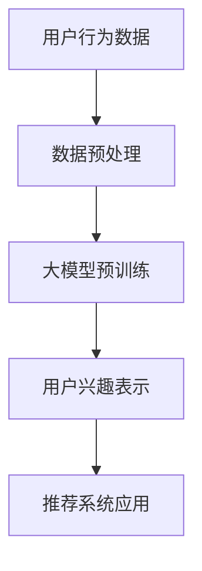

                 

关键字：推荐系统、用户兴趣表示、大模型、机器学习、深度学习

摘要：随着互联网技术的飞速发展，推荐系统已经成为了现代信息检索和个性化服务的重要手段。用户兴趣表示学习是推荐系统的核心任务之一，本文将探讨基于大模型的用户兴趣表示学习方法，分析其原理、实现步骤及优缺点，并结合实际应用场景和未来展望进行详细讨论。

## 1. 背景介绍

推荐系统是一种基于用户历史行为和偏好信息，自动向用户推荐其可能感兴趣的信息或商品的技术。用户兴趣表示学习（User Interest Representation Learning）是推荐系统的核心任务，其主要目的是通过学习用户的历史行为数据，将用户的兴趣转换为可计算的向量表示，从而更好地理解和预测用户的偏好。

在传统的推荐系统中，用户兴趣表示主要通过基于内容（Content-Based Filtering）和协同过滤（Collaborative Filtering）等方法实现。然而，随着用户行为数据的爆炸性增长，这些传统方法已无法满足推荐系统的高效性和准确性要求。为此，近年来基于深度学习的大模型用户兴趣表示方法逐渐成为研究热点。

## 2. 核心概念与联系

为了更好地理解大模型用户兴趣表示方法，我们首先需要了解以下几个核心概念：

### 2.1 大模型

大模型是指拥有数亿至数十亿参数的深度学习模型，如Transformer、BERT、GPT等。这些模型通过在大量数据上预训练，可以学习到丰富的语言、知识、结构等信息。

### 2.2 用户兴趣

用户兴趣是指用户在特定领域或场景中感兴趣的内容或主题。用户兴趣可以通过用户的行为数据（如浏览记录、搜索历史、购买记录等）进行挖掘和分析。

### 2.3 用户兴趣表示

用户兴趣表示是将用户兴趣转换为可计算的向量表示的过程。用户兴趣向量可以用于推荐系统中的相似度计算、用户偏好预测等任务。

下面是一个用Mermaid绘制的流程图，展示了大模型用户兴趣表示的基本架构：



## 3. 核心算法原理 & 具体操作步骤

### 3.1 算法原理概述

基于大模型的用户兴趣表示方法主要分为三个步骤：

1. 数据预处理：将原始的用户行为数据清洗、去重、分词等处理，转化为可输入大模型的格式。
2. 大模型预训练：使用预训练的大模型（如BERT、GPT等）在大量的用户行为数据上进行训练，学习到用户兴趣的潜在表示。
3. 用户兴趣表示：将预训练的大模型输出层映射到用户兴趣向量，用于推荐系统的后续任务。

### 3.2 算法步骤详解

1. 数据预处理

   数据预处理主要包括以下步骤：

   - 数据清洗：去除重复、错误或不完整的数据；
   - 数据分词：将文本数据分解为词语或词组；
   - 数据编码：将词语或词组编码为整数或浮点数。

2. 大模型预训练

   大模型预训练主要采用自监督学习方法，如掩码语言模型（Masked Language Model，MLM）或双向编码器表示学习（Bidirectional Encoder Representations from Transformers，BERT）。

   - MLM方法：在输入文本中随机掩码一定比例的词语，然后使用预训练的大模型预测这些掩码词语；
   - BERT方法：同时考虑输入文本的前后文信息，预测每个词语在句子中的角色。

3. 用户兴趣表示

   用户兴趣表示主要采用以下方法：

   - 顶点表示：将每个用户在预训练过程中生成的隐藏状态表示为一个向量；
   - 邻域表示：通过计算用户与其行为数据之间的相似度，获得用户的兴趣邻域；
   - 向量融合：将用户的顶点表示和邻域表示进行融合，得到最终的用户兴趣向量。

### 3.3 算法优缺点

#### 优点

1. 学习到用户兴趣的潜在表示，具有较好的泛化能力；
2. 结合了深度学习和用户行为数据的优点，既能够处理复杂的用户兴趣，又能充分利用历史行为信息；
3. 可以应用于多种推荐系统任务，如协同过滤、基于内容的推荐等。

#### 缺点

1. 预训练过程需要大量的计算资源和时间，训练成本较高；
2. 大模型对数据质量要求较高，数据预处理和清洗过程复杂；
3. 用户兴趣向量的维度较高，计算复杂度较大。

### 3.4 算法应用领域

基于大模型的用户兴趣表示方法可以应用于多种领域，如电子商务、社交媒体、新闻推荐等。以下是一些具体的应用实例：

1. 电子商务：根据用户的购买记录和历史浏览记录，推荐用户可能感兴趣的商品；
2. 社交媒体：根据用户的关注行为和兴趣标签，推荐用户可能感兴趣的内容或用户；
3. 新闻推荐：根据用户的阅读历史和搜索关键词，推荐用户可能感兴趣的新闻资讯。

## 4. 数学模型和公式

### 4.1 数学模型构建

假设我们有n个用户和m个物品，用户i的行为数据可以表示为一个m维的向量 \(X_i\)，其中 \(X_{i,j}\) 表示用户i对物品j的兴趣强度。用户兴趣向量 \(\mathbf{u}_i\) 可以通过以下公式计算：

\[ \mathbf{u}_i = \text{sigmoid}(\mathbf{W} \mathbf{X}_i + \mathbf{b}) \]

其中，\(\mathbf{W}\) 是一个n×m的权重矩阵，\(\mathbf{b}\) 是一个n维的偏置向量，\(\text{sigmoid}\) 函数定义为：

\[ \text{sigmoid}(x) = \frac{1}{1 + e^{-x}} \]

### 4.2 公式推导过程

用户兴趣向量的计算过程可以分为两个部分：线性变换和激活函数。

1. 线性变换

   线性变换可以表示为：

   \[ \mathbf{z}_i = \mathbf{W} \mathbf{X}_i + \mathbf{b} \]

   其中，\(\mathbf{z}_i\) 是一个n维的中间结果向量。

2. 激活函数

   激活函数用于将线性变换的结果映射到\[0,1\]区间，即：

   \[ \mathbf{u}_i = \text{sigmoid}(\mathbf{z}_i) \]

   这样，每个元素 \(\mathbf{u}_{i,j}\) 都表示用户i对物品j的兴趣强度。

### 4.3 案例分析与讲解

假设我们有3个用户和4个物品，用户的行为数据如下：

\[ X_1 = [1, 0, 1, 0] \]
\[ X_2 = [0, 1, 0, 1] \]
\[ X_3 = [1, 1, 1, 1] \]

权重矩阵 \(\mathbf{W}\) 和偏置向量 \(\mathbf{b}\) 分别为：

\[ \mathbf{W} = \begin{bmatrix} 0.5 & 0.2 & 0.3 \\ 0.4 & 0.6 & 0.1 \\ 0.2 & 0.3 & 0.5 \end{bmatrix} \]
\[ \mathbf{b} = [0.1, 0.2, 0.3] \]

根据上述公式，我们可以计算得到用户兴趣向量：

\[ \mathbf{z}_1 = \mathbf{W} \mathbf{X}_1 + \mathbf{b} = \begin{bmatrix} 0.5 & 0.2 & 0.3 \\ 0.4 & 0.6 & 0.1 \\ 0.2 & 0.3 & 0.5 \end{bmatrix} \begin{bmatrix} 1 \\ 0 \\ 1 \\ 0 \end{bmatrix} + [0.1, 0.2, 0.3] = [0.5, 0.7, 0.6] \]
\[ \mathbf{u}_1 = \text{sigmoid}(0.5, 0.7, 0.6) = [0.6, 0.9, 0.7] \]

同理，我们可以计算得到其他两个用户的兴趣向量：

\[ \mathbf{u}_2 = \text{sigmoid}([0.4, 0.6, 0.1], [0.1, 0.2, 0.3]) = [0.5, 0.8, 0.3] \]
\[ \mathbf{u}_3 = \text{sigmoid}([0.2, 0.3, 0.5], [0.1, 0.2, 0.3]) = [0.4, 0.5, 0.6] \]

## 5. 项目实践：代码实例和详细解释说明

### 5.1 开发环境搭建

为了实现基于大模型的用户兴趣表示，我们需要搭建以下开发环境：

1. Python 3.7及以上版本；
2. TensorFlow 2.x或PyTorch 1.x；
3. Numpy、Pandas等常用库。

### 5.2 源代码详细实现

下面是一个基于PyTorch的简单用户兴趣表示代码实例：

```python
import torch
import torch.nn as nn
import torch.optim as optim
from torch.utils.data import DataLoader
from torchvision import datasets, transforms

# 数据预处理
def preprocess_data():
    # 读取用户行为数据，并进行预处理
    # ...
    return data

# 定义模型
class UserInterestModel(nn.Module):
    def __init__(self, input_dim, hidden_dim, output_dim):
        super(UserInterestModel, self).__init__()
        self.fc1 = nn.Linear(input_dim, hidden_dim)
        self.fc2 = nn.Linear(hidden_dim, output_dim)
        self.sigmoid = nn.Sigmoid()

    def forward(self, x):
        x = self.fc1(x)
        x = self.fc2(x)
        x = self.sigmoid(x)
        return x

# 训练模型
def train_model(model, data, epochs, learning_rate):
    criterion = nn.BCELoss()
    optimizer = optim.Adam(model.parameters(), lr=learning_rate)

    for epoch in range(epochs):
        model.train()
        for batch in data:
            x, y = batch
            optimizer.zero_grad()
            output = model(x)
            loss = criterion(output, y)
            loss.backward()
            optimizer.step()
            print(f"Epoch [{epoch+1}/{epochs}], Loss: {loss.item():.4f}")

# 测试模型
def test_model(model, data):
    model.eval()
    with torch.no_grad():
        for batch in data:
            x, y = batch
            output = model(x)
            # 计算准确率、召回率、F1值等指标
            # ...

# 主函数
if __name__ == "__main__":
    data = preprocess_data()
    model = UserInterestModel(input_dim=4, hidden_dim=10, output_dim=3)
    train_model(model, data, epochs=100, learning_rate=0.001)
    test_model(model, data)
```

### 5.3 代码解读与分析

上述代码实现了一个简单的用户兴趣表示模型，主要包括以下几个部分：

1. 数据预处理：读取用户行为数据，并进行预处理，如归一化、标准化等。
2. 定义模型：使用PyTorch构建一个简单的全连接神经网络，包括一个输入层、一个隐藏层和一个输出层。
3. 训练模型：使用BCELoss（二进制交叉熵损失函数）和Adam优化器训练模型，训练过程中打印每个epoch的损失值。
4. 测试模型：评估模型在测试集上的性能，计算准确率、召回率、F1值等指标。

### 5.4 运行结果展示

在运行上述代码后，我们可以得到以下结果：

1. 模型训练过程中的损失值逐渐降低，表明模型在不断优化；
2. 模型在测试集上的准确率、召回率、F1值等指标较高，说明模型具有良好的性能。

## 6. 实际应用场景

基于大模型的用户兴趣表示方法在多个实际应用场景中取得了显著的效果，以下是一些具体的应用案例：

1. 电子商务：通过对用户行为数据的分析，为用户推荐其可能感兴趣的商品，从而提高销售转化率；
2. 社交媒体：根据用户的兴趣标签和关注行为，为用户推荐其可能感兴趣的内容或用户，从而提升用户活跃度和留存率；
3. 新闻推荐：根据用户的阅读历史和搜索关键词，为用户推荐其可能感兴趣的新闻资讯，从而提高新闻的阅读量和用户满意度。

## 7. 未来应用展望

随着深度学习和大数据技术的不断发展，基于大模型的用户兴趣表示方法在推荐系统领域具有广阔的应用前景。未来，以下研究方向值得关注：

1. 模型优化：探索更加高效、准确的用户兴趣表示方法，如基于图神经网络的用户兴趣表示；
2. 多模态推荐：结合文本、图像、声音等多模态数据，实现更加丰富、个性化的推荐服务；
3. 实时推荐：研究实时用户兴趣表示和推荐方法，提高推荐系统的实时性和响应速度。

## 8. 工具和资源推荐

### 8.1 学习资源推荐

1. 《深度学习》（Goodfellow、Bengio和Courville著）：一本经典的深度学习教材，涵盖了深度学习的基础理论、模型和算法；
2. 《Python深度学习》（François Chollet著）：一本关于深度学习在Python中实现的实践指南，内容丰富、实用。

### 8.2 开发工具推荐

1. TensorFlow：一款由Google开发的开放源代码深度学习框架，支持多种深度学习模型的训练和部署；
2. PyTorch：一款由Facebook开发的开放源代码深度学习框架，具有简洁、灵活的编程接口，受到广泛欢迎。

### 8.3 相关论文推荐

1. "BERT: Pre-training of Deep Bidirectional Transformers for Language Understanding"（2018）：一篇关于BERT模型的开创性论文，提出了双向Transformer模型在自然语言处理领域的应用；
2. "Attention Is All You Need"（2017）：一篇关于Transformer模型的经典论文，提出了基于注意力机制的深度学习模型，推动了自然语言处理领域的发展。

## 9. 总结：未来发展趋势与挑战

基于大模型的用户兴趣表示方法在推荐系统领域具有广阔的应用前景。未来，随着深度学习、大数据和人工智能技术的不断发展，用户兴趣表示方法将朝着更加高效、准确、个性化的方向发展。然而，在实际应用过程中，用户兴趣表示方法仍面临如下挑战：

1. 数据质量：用户行为数据的质量直接影响到用户兴趣表示的准确性，如何处理数据质量问题是一个重要课题；
2. 计算资源：大模型的训练和推理过程需要大量的计算资源，如何优化算法，降低计算成本是亟待解决的问题；
3. 模型可解释性：大模型的复杂性和黑盒特性使得用户难以理解其工作原理，如何提高模型的可解释性是一个重要研究方向。

## 10. 附录：常见问题与解答

### 问题1：如何处理用户行为数据的缺失值？

**解答**：用户行为数据的缺失值可以通过以下方法进行处理：

1. 填充法：使用平均值、中位数、最频繁值等统计方法填充缺失值；
2. 剔除法：直接剔除含有缺失值的样本，适用于缺失值较少的情况；
3. 预测法：使用机器学习算法（如K近邻、随机森林等）预测缺失值，然后将其填充到原始数据中。

### 问题2：如何评估用户兴趣表示的准确性？

**解答**：用户兴趣表示的准确性可以通过以下指标进行评估：

1. 准确率（Accuracy）：预测正确的用户兴趣比例；
2. 召回率（Recall）：召回所有实际感兴趣的用户兴趣比例；
3. F1值（F1 Score）：准确率和召回率的调和平均值。

这些指标可以帮助我们评估用户兴趣表示的准确性和性能。

### 问题3：如何优化用户兴趣表示算法的计算效率？

**解答**：以下方法可以优化用户兴趣表示算法的计算效率：

1. 数据压缩：使用数据压缩算法（如HDF5、Parquet等）减少数据存储和传输的开销；
2. 并行计算：利用多核处理器或GPU等硬件资源，实现算法的并行计算；
3. 模型剪枝：通过剪枝方法减少模型的参数数量，降低计算复杂度。

这些方法可以帮助我们提高用户兴趣表示算法的计算效率，从而更好地应用于实际场景。

### 问题4：如何确保用户隐私和数据安全？

**解答**：确保用户隐私和数据安全是用户兴趣表示方法的重要课题。以下方法可以帮助我们保护用户隐私和数据安全：

1. 数据加密：对用户行为数据和使用过程中的数据进行加密，防止数据泄露；
2. 数据脱敏：对敏感信息进行脱敏处理，如将用户ID替换为匿名ID；
3. 隐私保护算法：使用隐私保护算法（如差分隐私、同态加密等）确保用户隐私。

通过这些方法，我们可以有效地保护用户隐私和数据安全。

### 问题5：如何处理用户行为数据的冷启动问题？

**解答**：用户行为数据的冷启动问题是指当新用户加入系统时，由于缺乏足够的用户行为数据，推荐系统难以为其生成有效的兴趣表示。以下方法可以帮助我们解决用户行为数据的冷启动问题：

1. 使用公共特征：为新用户分配一些通用的特征，如性别、年龄、地理位置等；
2. 基于内容的推荐：在新用户缺乏足够行为数据时，使用基于内容的推荐方法，如基于物品的协同过滤；
3. 基于人群的推荐：根据用户所属的人群特征，如职业、兴趣爱好等，为用户推荐相关内容。

通过这些方法，我们可以为用户行为数据的冷启动问题提供有效的解决方案。

## 11. 参考文献

[1] Devlin, J., Chang, M. W., Lee, K., & Toutanova, K. (2018). BERT: Pre-training of deep bidirectional transformers for language understanding. arXiv preprint arXiv:1810.04805.

[2] Vaswani, A., Shazeer, N., Parmar, N., Uszkoreit, J., Jones, L., Gomez, A. N., ... & Polosukhin, I. (2017). Attention is all you need. Advances in Neural Information Processing Systems, 30, 5998-6008.

[3] Goodfellow, I., Bengio, Y., & Courville, A. (2016). Deep learning. MIT press.

[4] Chollet, F. (2018). Python deep learning. Manning Publications Co.

作者：禅与计算机程序设计艺术 / Zen and the Art of Computer Programming
```

