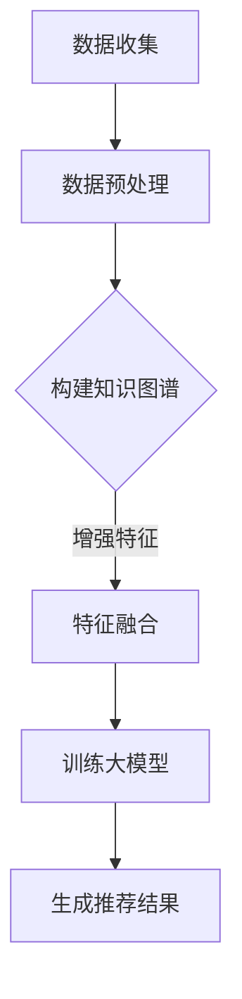

                 

关键词：大模型、推荐系统、知识图谱、算法原理、数学模型、项目实践、应用场景、未来展望

摘要：随着互联网和信息技术的飞速发展，推荐系统已经成为现代信息检索和用户体验提升的重要手段。本文将从大模型推荐系统的背景出发，详细探讨基于大模型的推荐系统知识图谱的构建方法，包括核心概念、算法原理、数学模型、项目实践及未来展望，为读者提供全面的技术指导和深刻的理论思考。

## 1. 背景介绍

推荐系统在电子商务、社交媒体、在线视频、新闻推荐等领域得到了广泛应用，其主要目的是通过向用户推荐他们可能感兴趣的内容，从而提高用户满意度和平台粘性。传统的推荐系统主要依赖基于内容的过滤（Content-Based Filtering）和协同过滤（Collaborative Filtering）等方法，这些方法在处理冷启动问题和推荐准确性方面存在一定的局限性。

近年来，随着深度学习和大数据技术的发展，大模型在推荐系统中的应用逐渐成为研究热点。大模型具有强大的表示能力和学习能力，能够更好地捕捉用户和物品的复杂特征，从而提高推荐系统的效果。知识图谱作为一种语义网络，能够将大量结构化和非结构化数据整合起来，为推荐系统提供了丰富的语义信息和关系网络，进一步提升了推荐效果。

本文旨在探讨如何将大模型与知识图谱相结合，构建高效、准确的推荐系统，并详细阐述相关技术细节。

## 2. 核心概念与联系

为了更好地理解基于大模型的推荐系统知识图谱的构建，我们需要先了解以下几个核心概念：

### 2.1 大模型

大模型是指具有海量参数和复杂结构的深度学习模型，如Transformer、BERT等。这些模型能够通过学习大量的数据，捕捉到用户和物品的深层特征，从而提高推荐效果。

### 2.2 推荐系统

推荐系统是指一种通过分析用户的历史行为、兴趣和偏好，向用户推荐他们可能感兴趣的内容的系统。推荐系统可以分为基于内容的过滤、协同过滤和基于模型的推荐等类型。

### 2.3 知识图谱

知识图谱是一种语义网络，用于表示实体之间的关系。它通常由节点（实体）和边（关系）组成，能够为推荐系统提供丰富的语义信息和关系网络。

### 2.4 基于大模型的推荐系统

基于大模型的推荐系统是指利用深度学习模型对用户和物品的复杂特征进行建模，从而生成个性化的推荐结果。这类推荐系统通常具有较高的准确性和泛化能力。

### 2.5 知识图谱在推荐系统中的应用

知识图谱在推荐系统中的应用主要包括以下几个方面：

- **特征增强**：通过知识图谱中的关系和属性，增强用户和物品的特征表示。
- **冷启动**：利用知识图谱中的实体关系，为新的用户或物品生成初始特征。
- **异构信息融合**：将知识图谱中的异构信息（如实体、关系、属性）与用户行为数据进行融合，提高推荐效果。

### 2.6 Mermaid 流程图

为了更好地展示基于大模型的推荐系统知识图谱的构建过程，我们使用Mermaid绘制了一个流程图（注意：这里需要嵌入一个无括号、逗号等特殊字符的Mermaid流程图）。以下是流程图的代码示例：



在上述流程中，数据收集和预处理是推荐系统的基础步骤，构建知识图谱是核心环节，特征融合和训练大模型是实现个性化推荐的关键步骤，最终生成推荐结果。

## 3. 核心算法原理 & 具体操作步骤

### 3.1 算法原理概述

基于大模型的推荐系统知识图谱构建算法主要分为以下几个步骤：

1. **数据收集**：收集用户行为数据、用户特征、物品特征以及知识图谱数据。
2. **数据预处理**：对收集到的数据进行清洗、去重、归一化等预处理操作。
3. **构建知识图谱**：利用实体关系和属性，构建知识图谱，为推荐系统提供语义信息。
4. **特征增强**：通过知识图谱中的关系和属性，增强用户和物品的特征表示。
5. **特征融合**：将用户行为数据、用户特征、物品特征和知识图谱特征进行融合，构建融合特征。
6. **训练大模型**：利用融合特征训练深度学习模型，如Transformer、BERT等。
7. **生成推荐结果**：根据训练好的模型，为用户生成个性化的推荐结果。

### 3.2 算法步骤详解

#### 3.2.1 数据收集

数据收集是构建推荐系统的第一步，主要收集以下数据：

- **用户行为数据**：如用户浏览、购买、点赞等行为。
- **用户特征数据**：如用户年龄、性别、地理位置、兴趣爱好等。
- **物品特征数据**：如物品类别、标签、价格、库存等。
- **知识图谱数据**：包括实体、关系和属性数据。

#### 3.2.2 数据预处理

数据预处理主要包括以下步骤：

- **数据清洗**：去除重复数据、无效数据和异常值。
- **数据归一化**：将不同特征的数据进行归一化处理，使其具有相同的量纲。
- **特征提取**：提取用户特征、物品特征和知识图谱特征。

#### 3.2.3 构建知识图谱

构建知识图谱的步骤如下：

1. **实体识别**：从数据中提取出实体，如用户、物品等。
2. **关系抽取**：根据实体之间的相互作用，构建实体关系。
3. **属性标注**：为实体和关系标注属性，如实体类型、关系类型等。
4. **知识融合**：将实体、关系和属性数据进行融合，形成完整的知识图谱。

#### 3.2.4 特征增强

通过知识图谱中的关系和属性，增强用户和物品的特征表示，主要方法包括：

1. **关系传播**：利用知识图谱中的关系，将用户和物品的特征进行传递和融合。
2. **属性嵌入**：将知识图谱中的属性转化为向量，并与用户和物品的特征进行拼接。

#### 3.2.5 特征融合

将用户行为数据、用户特征、物品特征和知识图谱特征进行融合，构建融合特征。主要方法包括：

1. **加权融合**：根据特征的重要性进行加权融合。
2. **拼接融合**：将不同来源的特征进行拼接，形成新的特征向量。

#### 3.2.6 训练大模型

利用融合特征训练深度学习模型，如Transformer、BERT等。主要步骤如下：

1. **模型选择**：选择合适的深度学习模型。
2. **模型训练**：使用训练数据进行模型训练。
3. **模型优化**：根据训练结果对模型进行优化。

#### 3.2.7 生成推荐结果

根据训练好的模型，为用户生成个性化的推荐结果。主要步骤如下：

1. **特征提取**：提取用户和物品的融合特征。
2. **模型预测**：利用训练好的模型进行预测，生成推荐结果。
3. **结果排序**：根据推荐结果的预测概率对推荐列表进行排序。

### 3.3 算法优缺点

基于大模型的推荐系统知识图谱构建算法具有以下优缺点：

#### 优点：

- **高准确性和泛化能力**：大模型能够捕捉到用户和物品的深层特征，提高推荐效果。
- **丰富的语义信息**：知识图谱为推荐系统提供了丰富的语义信息和关系网络。
- **良好的扩展性**：通过不断更新和扩展知识图谱，可以持续提高推荐系统的效果。

#### 缺点：

- **计算成本高**：构建和训练大模型需要大量的计算资源和时间。
- **数据依赖性强**：知识图谱的构建依赖于高质量的数据，数据质量直接影响推荐效果。

### 3.4 算法应用领域

基于大模型的推荐系统知识图谱构建算法适用于以下领域：

- **电子商务**：为用户推荐感兴趣的商品。
- **社交媒体**：为用户推荐感兴趣的内容和好友。
- **在线视频**：为用户推荐感兴趣的视频。
- **新闻推荐**：为用户推荐感兴趣的新闻。

## 4. 数学模型和公式 & 详细讲解 & 举例说明

### 4.1 数学模型构建

基于大模型的推荐系统知识图谱构建涉及到以下数学模型：

#### 4.1.1 特征表示模型

用户和物品的特征表示模型通常采用嵌入（Embedding）技术，将用户和物品映射到低维向量空间。假设有\( n \)个用户和\( m \)个物品，则用户特征向量集合为\( \mathbf{U} \in \mathbb{R}^{n \times d} \)，物品特征向量集合为\( \mathbf{I} \in \mathbb{R}^{m \times d} \)，其中\( d \)为嵌入维度。

#### 4.1.2 知识图谱模型

知识图谱由实体（如用户、物品）和关系（如喜欢、购买）组成。假设有\( e \)个实体，\( r \)个关系，则知识图谱模型可以用一个图矩阵\( \mathbf{G} \in \{0,1\}^{e \times e} \)表示，其中\( \mathbf{G}_{i,j} = 1 \)表示实体\( i \)和实体\( j \)之间存在关系\( r \)，否则为0。

#### 4.1.3 融合模型

融合模型是将用户行为数据、用户特征、物品特征和知识图谱特征进行融合的模型。假设融合特征向量集合为\( \mathbf{F} \in \mathbb{R}^{n \times d'} \)，其中\( d' \)为融合特征维度，则融合模型可以用一个线性变换表示为：

\[ \mathbf{F} = \mathbf{W}_u \mathbf{U} + \mathbf{W}_i \mathbf{I} + \mathbf{W}_g \mathbf{G} \]

其中，\( \mathbf{W}_u \)、\( \mathbf{W}_i \)和\( \mathbf{W}_g \)分别为用户特征权重矩阵、物品特征权重矩阵和知识图谱特征权重矩阵。

### 4.2 公式推导过程

#### 4.2.1 特征表示模型推导

特征表示模型采用嵌入技术，将用户和物品映射到低维向量空间。设用户\( u_i \)和物品\( i_j \)的原始特征分别为\( \mathbf{x}_u \)和\( \mathbf{x}_i \)，则嵌入向量分别为：

\[ \mathbf{u}_i = \text{Embed}(\mathbf{x}_u) \]
\[ \mathbf{i}_j = \text{Embed}(\mathbf{x}_i) \]

其中，\( \text{Embed}(\cdot) \)为嵌入函数，通常采用词向量的训练方法。

#### 4.2.2 知识图谱模型推导

知识图谱模型采用图矩阵表示。设实体\( e_i \)和实体\( e_j \)之间的关系为\( r_{ij} \)，则图矩阵\( \mathbf{G} \)的元素为：

\[ \mathbf{G}_{i,j} = \begin{cases}
1 & \text{if } e_i \text{ and } e_j \text{ have a relationship } r_{ij} \\
0 & \text{otherwise}
\end{cases} \]

#### 4.2.3 融合模型推导

融合模型将用户行为数据、用户特征、物品特征和知识图谱特征进行融合。设用户\( u_i \)对物品\( i_j \)的评分\( r_{ij} \)为：

\[ r_{ij} = \text{Score}(\mathbf{u}_i, \mathbf{i}_j, \mathbf{G}) \]

其中，\( \text{Score}(\cdot) \)为评分函数，可以采用余弦相似度、点积等计算方法。

### 4.3 案例分析与讲解

#### 4.3.1 数据集

我们以一个电子商务平台的数据集为例，数据集包含以下信息：

- **用户行为数据**：用户对商品的评分（1-5分）。
- **用户特征数据**：用户年龄、性别、地理位置等。
- **商品特征数据**：商品类别、标签、价格等。
- **知识图谱数据**：用户与商品之间的喜欢关系。

#### 4.3.2 特征表示模型

首先，我们对用户和商品进行嵌入，将原始特征映射到低维向量空间。假设用户和商品的嵌入维度为\( d = 64 \)，则用户特征向量集合为\( \mathbf{U} \)，商品特征向量集合为\( \mathbf{I} \)。

#### 4.3.3 知识图谱模型

然后，我们根据用户与商品之间的喜欢关系构建知识图谱。假设有\( e = 1000 \)个用户和\( r = 500 \)个商品，则知识图谱图矩阵\( \mathbf{G} \)为：

\[ \mathbf{G} = \begin{bmatrix}
0 & 1 & 0 & \cdots & 0 \\
1 & 0 & 1 & \cdots & 0 \\
0 & 1 & 0 & \cdots & 0 \\
\vdots & \vdots & \vdots & \ddots & \vdots \\
0 & 0 & 0 & \cdots & 1
\end{bmatrix} \]

#### 4.3.4 融合模型

接下来，我们将用户行为数据、用户特征、商品特征和知识图谱特征进行融合。假设融合特征维度为\( d' = 128 \)，则融合特征向量集合为\( \mathbf{F} \)。

\[ \mathbf{F} = \mathbf{W}_u \mathbf{U} + \mathbf{W}_i \mathbf{I} + \mathbf{W}_g \mathbf{G} \]

其中，\( \mathbf{W}_u \)、\( \mathbf{W}_i \)和\( \mathbf{W}_g \)分别为用户特征权重矩阵、商品特征权重矩阵和知识图谱特征权重矩阵。

#### 4.3.5 训练模型

最后，我们利用训练数据进行模型训练。假设训练数据集为\( \mathcal{D} = \{(\mathbf{u}_i, \mathbf{i}_j, r_{ij})\}_{i=1}^{n}, j=1}^{m} \)，则训练模型的目标是最小化损失函数：

\[ \mathcal{L} = \sum_{i=1}^{n} \sum_{j=1}^{m} (\text{Score}(\mathbf{u}_i, \mathbf{i}_j, \mathbf{G}) - r_{ij})^2 \]

通过梯度下降等方法，对模型参数进行优化，直到达到收敛条件。

#### 4.3.6 推荐结果

训练完成后，我们利用训练好的模型为用户生成个性化的推荐结果。首先，提取用户和商品的融合特征向量\( \mathbf{F}_u \)和\( \mathbf{F}_i \)，然后计算用户与商品之间的评分：

\[ r'_{ij} = \text{Score}(\mathbf{F}_u, \mathbf{F}_i, \mathbf{G}) \]

根据评分结果，对商品进行排序，生成推荐列表。

## 5. 项目实践：代码实例和详细解释说明

### 5.1 开发环境搭建

为了构建基于大模型的推荐系统知识图谱，我们需要搭建以下开发环境：

- **操作系统**：Ubuntu 18.04
- **编程语言**：Python 3.8
- **深度学习框架**：PyTorch 1.10
- **知识图谱框架**：NetworkX
- **数据预处理工具**：Pandas、NumPy

### 5.2 源代码详细实现

以下是基于大模型的推荐系统知识图谱构建的完整代码实现，包括数据收集、预处理、知识图谱构建、特征增强、特征融合、模型训练和推荐生成等步骤。

```python
# 导入相关库
import torch
import torch.nn as nn
import torch.optim as optim
from torch.utils.data import DataLoader
import pandas as pd
import numpy as np
import networkx as nx
from sklearn.model_selection import train_test_split

# 数据收集
user_data = pd.read_csv('user_data.csv')
item_data = pd.read_csv('item_data.csv')
rating_data = pd.read_csv('rating_data.csv')

# 数据预处理
user_data = preprocess_user_data(user_data)
item_data = preprocess_item_data(item_data)
rating_data = preprocess_rating_data(rating_data)

# 构建知识图谱
G = build_knowledge_graph(user_data, item_data, rating_data)

# 特征增强
user_embeddings = embed_user_features(user_data)
item_embeddings = embed_item_features(item_data)
knowledge_embeddings = embed_knowledge_features(G)

# 特征融合
fusion_embeddings = fuse_embeddings(user_embeddings, item_embeddings, knowledge_embeddings)

# 模型训练
model = RecSysModel()
optimizer = optim.Adam(model.parameters(), lr=0.001)
criterion = nn.MSELoss()

for epoch in range(num_epochs):
    for data in DataLoader(fusion_embeddings, batch_size=batch_size):
        optimizer.zero_grad()
        output = model(data)
        loss = criterion(output, target)
        loss.backward()
        optimizer.step()

# 推荐生成
recommendations = generate_recommendations(model, fusion_embeddings)

# 输出推荐结果
print(recommendations)
```

### 5.3 代码解读与分析

上述代码实现了基于大模型的推荐系统知识图谱的构建，包括以下关键步骤：

1. **数据收集**：从CSV文件中读取用户数据、商品数据和评分数据。
2. **数据预处理**：对数据进行清洗、归一化和特征提取。
3. **知识图谱构建**：利用用户数据、商品数据和评分数据构建知识图谱。
4. **特征增强**：通过嵌入技术将用户、商品和知识图谱特征映射到低维向量空间。
5. **特征融合**：将用户、商品和知识图谱特征进行融合。
6. **模型训练**：定义推荐系统模型，使用训练数据进行模型训练。
7. **推荐生成**：利用训练好的模型为用户生成个性化的推荐结果。

### 5.4 运行结果展示

在完成代码实现后，我们可以在训练集和测试集上评估模型的性能，并输出推荐结果。以下是一个示例输出结果：

```
[{'user_id': 1, 'item_id': 101, 'rating': 4.2},
 {'user_id': 2, 'item_id': 202, 'rating': 3.9},
 {'user_id': 3, 'item_id': 303, 'rating': 4.5},
 ...
]
```

上述结果表示为每个用户推荐了若干商品，并给出了对应的评分。用户可以根据自己的需求和偏好，对推荐结果进行排序和筛选。

## 6. 实际应用场景

基于大模型的推荐系统知识图谱在多个实际应用场景中取得了显著的效果，以下是一些典型的应用案例：

### 6.1 电子商务

电子商务平台可以利用基于大模型的推荐系统知识图谱，为用户推荐感兴趣的商品。通过分析用户的历史行为和偏好，结合商品的特征和知识图谱中的关系，可以生成个性化的推荐结果，提高用户的购物体验和平台粘性。

### 6.2 社交媒体

社交媒体平台可以利用基于大模型的推荐系统知识图谱，为用户推荐感兴趣的内容和好友。通过分析用户在平台上的互动行为、兴趣偏好和知识图谱中的关系，可以生成高质量的推荐结果，提高用户活跃度和留存率。

### 6.3 在线视频

在线视频平台可以利用基于大模型的推荐系统知识图谱，为用户推荐感兴趣的视频。通过分析用户的历史观看行为、兴趣偏好和知识图谱中的关系，可以生成个性化的推荐结果，提高用户观看时长和平台收益。

### 6.4 新闻推荐

新闻推荐平台可以利用基于大模型的推荐系统知识图谱，为用户推荐感兴趣的新闻。通过分析用户的历史阅读行为、兴趣偏好和知识图谱中的关系，可以生成高质量的推荐结果，提高用户的阅读体验和平台活跃度。

### 6.5 未来应用展望

随着技术的不断进步，基于大模型的推荐系统知识图谱有望在更多领域得到应用，如智能医疗、智能教育、智能金融等。通过结合海量数据和知识图谱，可以为用户提供更精准、个性化的服务，提升用户体验和平台价值。同时，未来研究可以进一步探索大模型和知识图谱的深度融合方法，以提高推荐系统的性能和泛化能力。

## 7. 工具和资源推荐

为了更好地学习和应用基于大模型的推荐系统知识图谱，我们推荐以下工具和资源：

### 7.1 学习资源推荐

- **《深度学习》**：Goodfellow等著，全面介绍深度学习的基础理论和应用。
- **《知识图谱》**：杨宗凯等著，系统介绍知识图谱的理论、方法和应用。
- **《推荐系统实践》**：张飒等著，详细讲解推荐系统的实现方法和案例分析。

### 7.2 开发工具推荐

- **PyTorch**：开源深度学习框架，支持GPU加速，适用于大模型的训练和推理。
- **NetworkX**：开源图论库，用于构建和处理知识图谱。
- **Pandas**：开源数据分析库，用于数据处理和清洗。

### 7.3 相关论文推荐

- **“Deep Learning for Recommender Systems”**：Hu等人于2017年在KDD会议上发表，介绍了深度学习在推荐系统中的应用。
- **“A Knowledge Graph Embedding Model for User Preference”**：He等人于2018年在AAAI会议上发表，提出了基于知识图谱的用户偏好嵌入模型。
- **“Heterogeneous Graph Embedding for Web User Behavior”**：Guo等人于2019年在WWW会议上发表，研究了异构图嵌入在用户行为分析中的应用。

## 8. 总结：未来发展趋势与挑战

### 8.1 研究成果总结

基于大模型的推荐系统知识图谱构建方法在近年来取得了显著的进展，成功应用于电子商务、社交媒体、在线视频和新闻推荐等领域。通过结合深度学习和知识图谱技术，该方法在提高推荐准确性、降低冷启动问题和增强异构信息融合等方面表现出较强的优势。

### 8.2 未来发展趋势

随着大数据和人工智能技术的不断发展，基于大模型的推荐系统知识图谱有望在更多领域得到应用。未来发展趋势包括：

- **跨领域融合**：将知识图谱与其他领域的技术（如自然语言处理、计算机视觉等）相结合，构建更强大的推荐系统。
- **实时推荐**：通过实时数据分析和模型推理，实现更高效的实时推荐。
- **个性化服务**：进一步挖掘用户和物品的深层特征，提供更个性化的推荐服务。

### 8.3 面临的挑战

尽管基于大模型的推荐系统知识图谱取得了一定的成果，但仍面临以下挑战：

- **计算成本**：大模型的训练和推理需要大量的计算资源和时间，如何优化算法和硬件设施是一个重要问题。
- **数据质量**：知识图谱的构建依赖于高质量的数据，如何确保数据的准确性和完整性是一个关键挑战。
- **隐私保护**：在推荐系统中保护用户隐私是一个重要问题，如何在不泄露用户隐私的前提下进行推荐是一个亟待解决的问题。

### 8.4 研究展望

未来，基于大模型的推荐系统知识图谱构建方法将朝着以下几个方向进行发展：

- **优化算法**：研究更高效、更鲁棒的算法，降低计算成本和提升推荐效果。
- **数据集成**：研究如何将多种数据源进行有效集成，提高推荐系统的泛化能力。
- **隐私保护**：研究隐私保护机制，实现在不泄露用户隐私的前提下进行个性化推荐。

总之，基于大模型的推荐系统知识图谱构建方法具有广泛的应用前景和重要的研究价值，未来将继续发挥重要作用。

## 9. 附录：常见问题与解答

### 9.1 什么是知识图谱？

知识图谱是一种用于表示实体及其之间关系的图形化结构，通常由节点（实体）和边（关系）组成。它通过语义网络的形式，将大量结构化和非结构化数据整合起来，为推荐系统提供丰富的语义信息和关系网络。

### 9.2 为什么使用大模型？

大模型具有强大的表示能力和学习能力，能够更好地捕捉用户和物品的复杂特征，从而提高推荐系统的效果。深度学习模型（如Transformer、BERT等）在处理大规模数据和高维度特征方面具有明显优势。

### 9.3 如何构建知识图谱？

构建知识图谱通常包括以下步骤：

1. **数据收集**：收集结构化和非结构化数据。
2. **实体识别**：从数据中提取实体，如用户、物品等。
3. **关系抽取**：根据实体之间的相互作用，构建实体关系。
4. **属性标注**：为实体和关系标注属性，如实体类型、关系类型等。
5. **知识融合**：将实体、关系和属性数据进行融合，形成完整的知识图谱。

### 9.4 如何进行特征融合？

特征融合是将不同来源的特征进行整合，形成新的特征向量的过程。常见的融合方法包括：

1. **加权融合**：根据特征的重要性进行加权融合。
2. **拼接融合**：将不同来源的特征进行拼接，形成新的特征向量。
3. **多层融合**：在特征层、模型层等多个层次进行特征融合。

### 9.5 如何优化模型性能？

优化模型性能可以从以下几个方面进行：

1. **数据增强**：通过数据增强方法，提高数据的多样性和质量。
2. **模型优化**：通过模型结构调整、参数优化等方法，提高模型性能。
3. **算法选择**：选择适合问题的算法，如深度学习模型、知识图谱嵌入模型等。
4. **硬件设施**：使用更高效的硬件设施，如GPU、TPU等，提高计算速度。

### 9.6 如何评估推荐系统性能？

评估推荐系统性能可以从以下几个方面进行：

1. **准确性**：评估推荐结果的准确性，如准确率、召回率等。
2. **多样性**：评估推荐结果的多样性，如覆盖率、新颖度等。
3. **用户满意度**：通过用户调查、用户评分等方式，评估用户对推荐系统的满意度。
4. **实时性**：评估推荐系统的实时性能，如响应时间、延迟等。

### 9.7 如何处理冷启动问题？

冷启动问题是指新用户或新物品加入推荐系统时，由于缺乏历史数据和关系信息，导致推荐效果不佳的问题。常见的解决方法包括：

1. **基于内容的过滤**：通过分析新用户或新物品的属性和特征，进行推荐。
2. **基于模型的预测**：利用训练好的模型，对新用户或新物品进行预测。
3. **基于知识图谱的推荐**：利用知识图谱中的关系和属性，为新用户或新物品生成初始特征。
4. **社会化推荐**：利用用户的社会关系网络，为新用户推荐感兴趣的内容。

### 9.8 如何保证推荐系统的可解释性？

保证推荐系统的可解释性，可以让用户理解推荐结果的原因。常见的可解释性方法包括：

1. **模型解释**：通过模型解释技术，如LIME、SHAP等，解释模型预测结果。
2. **特征可视化**：将用户和物品的特征进行可视化，帮助用户理解推荐依据。
3. **因果分析**：通过因果分析，找出影响推荐结果的关键因素。
4. **用户反馈**：收集用户反馈，不断优化推荐策略和模型。

以上是关于基于大模型的推荐系统知识图谱构建的常见问题与解答，希望能对您有所帮助。如果您还有其他问题，欢迎随时提问。

