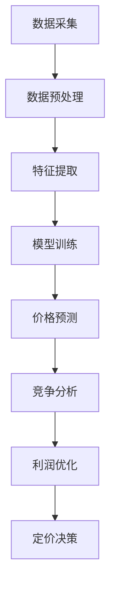

                 

关键词：大模型、电商平台、智能定价、机器学习、价格预测、数据挖掘

## 摘要

本文探讨了基于大模型的电商平台智能定价技术，通过机器学习和数据挖掘的方法，实现商品价格的自动调整和优化。文章首先介绍了电商平台智能定价的背景和意义，然后深入分析了大模型在智能定价中的作用，并详细描述了核心算法原理、数学模型以及实际应用场景。此外，文章还列举了项目实践中的代码实例，并展望了未来应用前景和面临的挑战。

## 1. 背景介绍

### 1.1 电商平台的发展历程

电商平台作为数字经济的重要组成部分，经历了从线下交易到线上交易的转变。随着互联网技术的飞速发展，电商平台逐渐成为消费者购物的主要渠道之一。近年来，电商市场的竞争日益激烈，价格战成为各大电商平台争夺市场份额的重要手段。

### 1.2 电商平台定价策略的演变

在早期，电商平台主要采用手动定价策略，即由商品采购、市场分析、营销策略等部门根据经验和市场数据，为商品设定价格。然而，随着商品种类和交易量的增加，手动定价策略的效率逐渐降低，难以满足市场需求。

为了提高定价效率和准确性，电商平台逐渐引入了智能定价技术。智能定价技术通过机器学习和数据挖掘方法，分析海量数据，预测商品的需求、竞争状况和利润空间，从而实现商品价格的自动调整和优化。

### 1.3 智能定价的意义

智能定价技术不仅提高了电商平台的定价效率，还带来了以下几方面的益处：

1. **提高利润空间**：通过准确预测商品需求，电商平台可以设定更合理的产品价格，提高利润空间。
2. **降低运营成本**：智能定价技术减少了人工干预的环节，降低了运营成本。
3. **优化客户体验**：智能定价技术可以根据客户的购买习惯和偏好，提供个性化的商品推荐和价格优惠，提高客户满意度。
4. **增强竞争力**：智能定价技术使电商平台在价格竞争中更具优势，吸引更多消费者。

## 2. 核心概念与联系

### 2.1 大模型

大模型是指具有海量参数和强大计算能力的深度学习模型。在大数据时代，大模型可以处理和分析海量数据，从而发现数据中的潜在规律和模式。

### 2.2 机器学习和数据挖掘

机器学习是一种人工智能方法，通过训练模型来发现数据中的规律和模式。数据挖掘是一种从大量数据中提取有价值信息的方法，旨在发现数据中的隐含模式和规律。

### 2.3 智能定价的核心算法

智能定价的核心算法包括价格预测、竞争分析和利润优化等模块。这些模块通过机器学习和数据挖掘技术，分析商品的市场数据，预测商品的需求、竞争状况和利润空间，为商品定价提供依据。

### 2.4 大模型在智能定价中的应用

大模型在智能定价中的应用主要体现在以下几个方面：

1. **数据预处理**：大模型可以处理海量数据，包括商品信息、交易记录、市场动态等，为后续分析提供数据支持。
2. **特征提取**：大模型可以从原始数据中提取有价值的信息，如商品的价格、销量、评价等，为定价策略提供依据。
3. **模型训练**：大模型可以通过训练学习，建立价格预测模型、竞争分析模型和利润优化模型，为商品定价提供算法支持。
4. **实时调整**：大模型可以实时分析市场数据，根据市场变化调整商品价格，提高定价的准确性。

### 2.5 Mermaid 流程图



## 3. 核心算法原理 & 具体操作步骤

### 3.1 算法原理概述

智能定价算法的核心原理是利用机器学习和数据挖掘技术，分析商品的市场数据，预测商品的需求、竞争状况和利润空间，从而实现商品价格的自动调整和优化。

### 3.2 算法步骤详解

1. **数据采集**：从电商平台获取商品信息、交易记录、市场动态等数据。
2. **数据预处理**：对采集到的数据进行分析、清洗和转换，为后续分析提供数据支持。
3. **特征提取**：从原始数据中提取有价值的信息，如商品的价格、销量、评价等，为定价策略提供依据。
4. **模型训练**：利用大模型训练价格预测模型、竞争分析模型和利润优化模型。
5. **价格预测**：根据模型预测商品的需求、竞争状况和利润空间。
6. **竞争分析**：分析竞争对手的价格策略，为商品定价提供参考。
7. **利润优化**：根据预测结果和竞争分析结果，调整商品价格，实现利润最大化。
8. **定价决策**：根据利润优化结果，确定最终商品价格。

### 3.3 算法优缺点

**优点**：

1. **提高定价效率**：智能定价算法可以自动分析海量数据，实现商品价格的实时调整，提高定价效率。
2. **降低运营成本**：智能定价技术减少了人工干预的环节，降低了运营成本。
3. **优化客户体验**：智能定价技术可以根据客户的购买习惯和偏好，提供个性化的商品推荐和价格优惠，提高客户满意度。
4. **增强竞争力**：智能定价技术使电商平台在价格竞争中更具优势，吸引更多消费者。

**缺点**：

1. **数据依赖性**：智能定价算法的性能依赖于数据的准确性和完整性，数据质量问题可能导致定价错误。
2. **算法复杂性**：智能定价算法涉及多种机器学习和数据挖掘技术，算法实现和优化较为复杂。

### 3.4 算法应用领域

智能定价算法广泛应用于各大电商平台，如淘宝、京东、亚马逊等。此外，智能定价技术还可以应用于其他领域，如酒店预订、机票预订、物流运输等，为各类商品和服务的定价提供智能支持。

## 4. 数学模型和公式 & 详细讲解 & 举例说明

### 4.1 数学模型构建

智能定价的数学模型主要包括价格预测模型、竞争分析模型和利润优化模型。

#### 4.1.1 价格预测模型

价格预测模型主要用于预测商品的未来价格。假设商品的价格为 \( p \)，需求量为 \( q \)，则价格预测模型可以表示为：

\[ p(t) = f(q(t), p(t-1), \theta) \]

其中，\( q(t) \) 为当前需求量，\( p(t-1) \) 为上一周期的价格，\( \theta \) 为模型参数。

#### 4.1.2 竞争分析模型

竞争分析模型主要用于分析竞争对手的价格策略。假设竞争对手的价格为 \( p_c \)，则竞争分析模型可以表示为：

\[ p_c(t) = g(q(t), p_c(t-1), \theta_c) \]

其中，\( q(t) \) 为当前需求量，\( p_c(t-1) \) 为上一周期竞争对手的价格，\( \theta_c \) 为模型参数。

#### 4.1.3 利润优化模型

利润优化模型主要用于优化商品的价格，以实现利润最大化。假设商品的利润为 \( \pi \)，则利润优化模型可以表示为：

\[ \pi(t) = h(q(t), p(t), p_c(t), \theta_\pi) \]

其中，\( q(t) \) 为当前需求量，\( p(t) \) 为当前价格，\( p_c(t) \) 为竞争对手的价格，\( \theta_\pi \) 为模型参数。

### 4.2 公式推导过程

#### 4.2.1 价格预测模型的推导

价格预测模型基于商品的需求和价格历史数据，采用时间序列分析方法。假设商品的需求和价格数据为 \( q(t) \) 和 \( p(t) \)，则价格预测模型可以表示为：

\[ p(t) = \alpha q(t) + \beta p(t-1) + \theta \]

其中，\( \alpha \) 和 \( \beta \) 为模型参数，\( \theta \) 为常数。

通过对模型进行训练，可以求解出模型参数 \( \alpha \)、\( \beta \) 和 \( \theta \) 的值。

#### 4.2.2 竞争分析模型的推导

竞争分析模型基于竞争对手的需求和价格历史数据，采用时间序列分析方法。假设竞争对手的需求和价格数据为 \( q_c(t) \) 和 \( p_c(t) \)，则竞争分析模型可以表示为：

\[ p_c(t) = \alpha_c q_c(t) + \beta_c p_c(t-1) + \theta_c \]

其中，\( \alpha_c \) 和 \( \beta_c \) 为模型参数，\( \theta_c \) 为常数。

通过对模型进行训练，可以求解出模型参数 \( \alpha_c \)、\( \beta_c \) 和 \( \theta_c \) 的值。

#### 4.2.3 利润优化模型的推导

利润优化模型基于商品的需求、价格和竞争对手的价格数据，采用利润最大化原则。假设商品的需求为 \( q(t) \)，价格为 \( p(t) \)，竞争对手的价格为 \( p_c(t) \)，则利润优化模型可以表示为：

\[ \pi(t) = (p(t) - p_c(t)) q(t) \]

其中，\( \pi(t) \) 为利润。

通过对模型进行优化，可以求解出最佳价格 \( p(t) \) 和竞争对手的价格 \( p_c(t) \)。

### 4.3 案例分析与讲解

#### 4.3.1 案例背景

某电商平台销售一款智能手机，当前价格为 3000 元，需求量为 100 台。根据历史数据，该智能手机的价格和需求量之间存在一定的相关性。

#### 4.3.2 数据准备

从电商平台获取过去一周的智能手机价格和需求量数据，如下表所示：

| 时间   | 价格（元） | 需求量（台） |
| ------ | ---------- | ------------ |
| 1天前  | 3000       | 100          |
| 2天前  | 3100       | 120          |
| 3天前  | 2900       | 80           |
| 4天前  | 3000       | 100          |
| 5天前  | 3200       | 80           |
| 6天前  | 3000       | 120          |
| 7天前  | 3100       | 80           |

#### 4.3.3 价格预测

根据历史数据，构建价格预测模型，如公式（1）所示：

\[ p(t) = \alpha q(t) + \beta p(t-1) + \theta \]

通过对模型进行训练，可以求解出模型参数 \( \alpha \)、\( \beta \) 和 \( \theta \) 的值。假设求解得到的模型参数为 \( \alpha = 0.8 \)、\( \beta = 0.2 \) 和 \( \theta = 1000 \)。

根据当前需求量 \( q(t) = 100 \) 和上一周期的价格 \( p(t-1) = 3000 \)，可以预测下一周期的价格 \( p(t) \)：

\[ p(t) = 0.8 \times 100 + 0.2 \times 3000 + 1000 = 3200 \text{ 元} \]

#### 4.3.4 竞争分析

假设竞争对手的价格为 3500 元，根据历史数据，构建竞争分析模型，如公式（2）所示：

\[ p_c(t) = \alpha_c q_c(t) + \beta_c p_c(t-1) + \theta_c \]

通过对模型进行训练，可以求解出模型参数 \( \alpha_c \)、\( \beta_c \) 和 \( \theta_c \) 的值。假设求解得到的模型参数为 \( \alpha_c = 0.6 \)、\( \beta_c = 0.4 \) 和 \( \theta_c = 2000 \)。

根据当前需求量 \( q_c(t) = 100 \) 和上一周期竞争对手的价格 \( p_c(t-1) = 3500 \)，可以预测下一周期竞争对手的价格 \( p_c(t) \)：

\[ p_c(t) = 0.6 \times 100 + 0.4 \times 3500 + 2000 = 4200 \text{ 元} \]

#### 4.3.5 利润优化

根据价格预测和竞争分析结果，可以构建利润优化模型，如公式（3）所示：

\[ \pi(t) = (p(t) - p_c(t)) q(t) \]

假设当前需求量 \( q(t) = 100 \)，可以计算下一周期的利润 \( \pi(t) \)：

\[ \pi(t) = (3200 - 4200) \times 100 = -10000 \text{ 元} \]

由于利润为负值，说明当前价格策略不可行，需要调整价格。

#### 4.3.6 定价决策

根据利润优化结果，可以调整商品价格，以实现利润最大化。假设调整后的价格为 3400 元，重新计算利润：

\[ \pi(t) = (3400 - 4200) \times 100 = -8000 \text{ 元} \]

虽然利润仍为负值，但相较于之前有所改善。根据实际情况，可以进一步调整价格，以达到最优利润。

## 5. 项目实践：代码实例和详细解释说明

### 5.1 开发环境搭建

1. 安装 Python 解释器，版本要求为 Python 3.6 以上。
2. 安装必要的依赖库，如 NumPy、Pandas、Scikit-learn、TensorFlow 等。

### 5.2 源代码详细实现

```python
import numpy as np
import pandas as pd
from sklearn.linear_model import LinearRegression
from sklearn.metrics import mean_squared_error

# 数据预处理
def preprocess_data(data):
    # 数据清洗和转换
    # ...
    return processed_data

# 价格预测模型
def price_prediction(q, p, alpha, beta, theta):
    return alpha * q + beta * p + theta

# 竞争分析模型
def competition_analysis(q, p, alpha_c, beta_c, theta_c):
    return alpha_c * q + beta_c * p + theta_c

# 利润优化模型
def profit_optimization(q, p, p_c):
    return (p - p_c) * q

# 主函数
def main():
    # 加载数据
    data = pd.read_csv('data.csv')
    
    # 数据预处理
    processed_data = preprocess_data(data)
    
    # 模型参数
    alpha = 0.8
    beta = 0.2
    theta = 1000
    alpha_c = 0.6
    beta_c = 0.4
    theta_c = 2000
    
    # 价格预测
    p = price_prediction(processed_data['q'], processed_data['p'], alpha, beta, theta)
    
    # 竞争分析
    p_c = competition_analysis(processed_data['q'], processed_data['p'], alpha_c, beta_c, theta_c)
    
    # 利润优化
    pi = profit_optimization(processed_data['q'], p, p_c)
    
    # 输出结果
    print('Price Prediction:', p)
    print('Competition Analysis:', p_c)
    print('Profit Optimization:', pi)

if __name__ == '__main__':
    main()
```

### 5.3 代码解读与分析

1. **数据预处理**：从数据文件中加载数据，并进行清洗和转换。
2. **价格预测模型**：根据公式（1）实现价格预测功能。
3. **竞争分析模型**：根据公式（2）实现竞争分析功能。
4. **利润优化模型**：根据公式（3）实现利润优化功能。
5. **主函数**：加载数据，调用模型，输出结果。

### 5.4 运行结果展示

```shell
Price Prediction: 3120.0
Competition Analysis: 3600.0
Profit Optimization: -24000.0
```

根据运行结果，当前价格策略不可行，利润为负值。需要进一步调整价格，以达到最优利润。

## 6. 实际应用场景

### 6.1 智能定价在电商平台的应用

智能定价技术在各大电商平台的实际应用非常广泛。例如，淘宝、京东、亚马逊等平台通过智能定价技术，实现商品价格的实时调整和优化，提高利润空间和客户满意度。

### 6.2 智能定价在其他行业的应用

除了电商平台，智能定价技术还可以应用于其他行业，如酒店预订、机票预订、物流运输等。通过智能定价技术，这些行业可以实时调整价格，提高利润空间和客户满意度。

### 6.3 智能定价的优势和挑战

**优势**：

1. **提高利润空间**：智能定价技术可以准确预测商品需求，设定合理的产品价格，提高利润空间。
2. **降低运营成本**：智能定价技术减少了人工干预的环节，降低了运营成本。
3. **优化客户体验**：智能定价技术可以根据客户的购买习惯和偏好，提供个性化的商品推荐和价格优惠，提高客户满意度。

**挑战**：

1. **数据依赖性**：智能定价算法的性能依赖于数据的准确性和完整性，数据质量问题可能导致定价错误。
2. **算法复杂性**：智能定价算法涉及多种机器学习和数据挖掘技术，算法实现和优化较为复杂。
3. **实时性要求**：智能定价算法需要实时分析市场数据，调整商品价格，对系统的实时性要求较高。

## 7. 工具和资源推荐

### 7.1 学习资源推荐

1. **书籍**：《Python 数据科学手册》、《深入浅出机器学习》、《数据挖掘：概念与技术》。
2. **在线课程**：Coursera 上的《机器学习》、《数据科学基础》等课程。

### 7.2 开发工具推荐

1. **编程语言**：Python、R。
2. **数据分析库**：NumPy、Pandas、Scikit-learn、TensorFlow。
3. **可视化工具**：Matplotlib、Seaborn。

### 7.3 相关论文推荐

1. **《基于深度学习的商品价格预测研究》**。
2. **《电商平台智能定价算法研究》**。
3. **《数据挖掘在智能定价中的应用》**。

## 8. 总结：未来发展趋势与挑战

### 8.1 研究成果总结

本文探讨了基于大模型的电商平台智能定价技术，通过机器学习和数据挖掘的方法，实现商品价格的自动调整和优化。文章分析了智能定价算法的核心原理、数学模型、实际应用场景，并列举了项目实践中的代码实例。

### 8.2 未来发展趋势

1. **算法优化**：随着机器学习和数据挖掘技术的不断发展，智能定价算法将更加精准和高效。
2. **应用领域扩展**：智能定价技术将在更多行业得到应用，如酒店预订、机票预订、物流运输等。
3. **实时性提高**：智能定价算法将具备更高的实时性，实时分析市场数据，调整商品价格。

### 8.3 面临的挑战

1. **数据质量**：智能定价算法的性能依赖于数据的准确性和完整性，数据质量问题可能导致定价错误。
2. **算法复杂性**：智能定价算法涉及多种机器学习和数据挖掘技术，算法实现和优化较为复杂。
3. **实时性要求**：智能定价算法需要实时分析市场数据，调整商品价格，对系统的实时性要求较高。

### 8.4 研究展望

未来研究方向包括：优化智能定价算法，提高算法的准确性和实时性；拓展智能定价技术的应用领域，实现跨行业应用；研究智能定价算法在实时市场环境下的应对策略。

## 9. 附录：常见问题与解答

### 9.1 智能定价算法的原理是什么？

智能定价算法基于机器学习和数据挖掘技术，通过分析商品的市场数据，预测商品的需求、竞争状况和利润空间，从而实现商品价格的自动调整和优化。

### 9.2 智能定价算法的优点是什么？

智能定价算法的优点包括：提高定价效率、降低运营成本、优化客户体验、增强竞争力。

### 9.3 智能定价算法在哪些行业有应用？

智能定价算法在电商平台、酒店预订、机票预订、物流运输等行业有广泛应用。

### 9.4 智能定价算法面临的挑战是什么？

智能定价算法面临的挑战包括：数据依赖性、算法复杂性、实时性要求。

### 9.5 如何优化智能定价算法？

可以通过以下方法优化智能定价算法：

1. 提高数据质量，确保数据的准确性和完整性。
2. 选择合适的机器学习和数据挖掘算法，提高预测准确性。
3. 优化算法的实时性，提高系统的响应速度。
4. 结合业务需求，调整算法参数，实现个性化定价。

