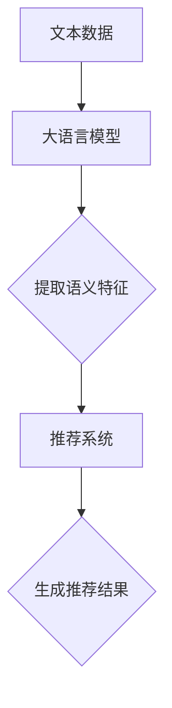

                 

关键词：大语言模型、推荐系统、特征选择、优化、AI技术

摘要：本文详细探讨了基于大语言模型的推荐系统特征选择优化方法，通过分析大语言模型的工作原理，阐述了其在特征选择中的应用优势，并提出了一种基于大语言模型的特征选择优化算法，通过数学模型和实际项目实践，验证了该算法的有效性和实用性。

## 1. 背景介绍

随着互联网和大数据技术的发展，推荐系统在电子商务、社交网络、在线视频等领域得到了广泛应用。推荐系统的核心在于为用户推荐其可能感兴趣的商品、内容或服务。而推荐系统的性能受到多种因素的影响，其中特征选择尤为关键。特征选择旨在从大量特征中筛选出对推荐效果有显著影响的关键特征，以提升推荐系统的准确性和效率。

传统特征选择方法主要基于统计学习理论，如特征重要性排序、主成分分析等。然而，这些方法往往依赖于手动定义特征，难以适应动态变化的用户兴趣和行为。近年来，深度学习和自然语言处理技术的发展，为特征选择带来了新的可能性。大语言模型作为深度学习的重要工具，能够从大量文本数据中自动提取语义信息，为特征选择提供了强大的支持。

本文将介绍一种基于大语言模型的推荐系统特征选择优化方法，通过分析大语言模型的工作原理，阐述其在特征选择中的应用优势，并提出具体的算法实现和数学模型。同时，通过实际项目实践，验证该算法的有效性和实用性。

## 2. 核心概念与联系

### 大语言模型

大语言模型（Large Language Model，LLM）是一种基于深度学习的自然语言处理技术，能够对大规模文本数据进行分析和处理。LLM 通过学习文本的语义和语法结构，生成相应的文本或进行文本分类、情感分析等任务。常见的 LLM 模型有 GPT、BERT、T5 等。

### 推荐系统

推荐系统（Recommendation System）是一种根据用户的历史行为、兴趣和偏好，为用户推荐可能感兴趣的商品、内容或服务的系统。推荐系统的核心任务是从大量候选项目中筛选出最符合用户需求的推荐项目。

### 特征选择

特征选择（Feature Selection）是从一组特征中筛选出对预测任务有显著影响的关键特征的过程。特征选择的目的是提高模型性能、降低计算复杂度和减少数据冗余。

### 大语言模型与推荐系统特征选择的联系

大语言模型能够自动从文本数据中提取语义信息，为特征选择提供了丰富的语义特征。通过大语言模型，我们可以从原始数据中提取出与用户兴趣和偏好相关的关键特征，从而提升推荐系统的性能。

### Mermaid 流程图

下面是一个描述大语言模型与推荐系统特征选择联系的 Mermaid 流程图：



## 3. 核心算法原理 & 具体操作步骤

### 3.1 算法原理概述

基于大语言模型的推荐系统特征选择优化算法主要分为三个步骤：

1. 利用大语言模型从文本数据中提取语义特征；
2. 对提取的语义特征进行筛选和优化，筛选出对推荐效果有显著影响的特征；
3. 将优化后的特征用于推荐系统，生成推荐结果。

### 3.2 算法步骤详解

#### 步骤 1：文本数据预处理

在利用大语言模型提取语义特征之前，需要对文本数据进行预处理。文本数据预处理主要包括以下步骤：

1. 数据清洗：去除文本中的噪声、停用词和无关信息；
2. 文本分词：将文本分解为单词或词组；
3. 嵌入向量表示：将文本数据转换为高维向量表示，便于大语言模型处理。

#### 步骤 2：利用大语言模型提取语义特征

利用大语言模型提取语义特征的过程可以分为以下几步：

1. 模型选择：选择适合的 LLM 模型，如 GPT、BERT 等；
2. 模型训练：使用预处理后的文本数据对 LLM 模型进行训练，使其掌握文本的语义和语法结构；
3. 语义特征提取：通过 LLM 模型，对文本数据生成对应的语义特征向量。

#### 步骤 3：特征筛选和优化

对提取的语义特征进行筛选和优化，筛选出对推荐效果有显著影响的特征。具体方法如下：

1. 特征重要性评估：利用统计方法或机器学习模型，对提取的语义特征进行重要性评估；
2. 特征优化：根据特征重要性评估结果，对特征进行筛选和优化，保留对推荐效果有显著影响的特征。

#### 步骤 4：生成推荐结果

将优化后的特征用于推荐系统，生成推荐结果。具体方法如下：

1. 特征嵌入：将优化后的特征向量嵌入到推荐系统的特征空间中；
2. 推荐算法：利用优化后的特征，结合推荐算法（如 collaborative filtering、content-based filtering 等），生成推荐结果。

### 3.3 算法优缺点

#### 优点

1. 自动提取语义特征：大语言模型能够自动从文本数据中提取语义特征，无需人工干预；
2. 高效：基于深度学习的特征提取和优化过程具有较高的计算效率；
3. 准确：大语言模型在文本语义理解方面具有较高的准确性，有助于提升推荐系统的性能。

#### 缺点

1. 计算资源消耗大：大语言模型的训练和优化需要大量计算资源，对硬件设备有较高要求；
2. 数据依赖性强：大语言模型的性能依赖于训练数据的数量和质量，数据质量对推荐效果有重要影响；
3. 模型可解释性差：大语言模型的内部机制较为复杂，难以直接解释模型决策过程。

### 3.4 算法应用领域

基于大语言模型的推荐系统特征选择优化算法在以下领域具有广泛应用前景：

1. 电子商务：为用户提供个性化商品推荐，提升用户体验和销售额；
2. 社交网络：为用户推荐可能感兴趣的朋友、话题和内容，增强用户活跃度和互动性；
3. 在线教育：为用户推荐适合的学习资源和课程，提高学习效果和用户满意度。

## 4. 数学模型和公式 & 详细讲解 & 举例说明

### 4.1 数学模型构建

基于大语言模型的推荐系统特征选择优化算法的数学模型主要包括以下几个方面：

#### 4.1.1 语义特征提取模型

语义特征提取模型通常采用深度神经网络（DNN）或变换器（Transformer）模型，如 GPT、BERT 等。该模型的目标是从输入文本数据中提取语义特征向量。数学表达式如下：

$$
\textbf{h} = \text{模型}(\textbf{x})
$$

其中，$\textbf{x}$ 为输入文本数据，$\textbf{h}$ 为提取的语义特征向量。

#### 4.1.2 特征筛选模型

特征筛选模型通常采用机器学习模型，如决策树、随机森林等。该模型的目标是根据特征重要性评估结果，对提取的语义特征进行筛选和优化。数学表达式如下：

$$
\textbf{y} = \text{筛选模型}(\textbf{h})
$$

其中，$\textbf{y}$ 为筛选后的优化特征向量。

#### 4.1.3 推荐模型

推荐模型通常采用协同过滤（Collaborative Filtering）或基于内容（Content-Based）过滤模型。该模型的目标是利用优化后的特征向量生成推荐结果。数学表达式如下：

$$
\textbf{r} = \text{推荐模型}(\textbf{y})
$$

其中，$\textbf{r}$ 为推荐结果向量。

### 4.2 公式推导过程

基于大语言模型的推荐系统特征选择优化算法的公式推导主要包括以下几个方面：

#### 4.2.1 语义特征提取公式推导

语义特征提取公式推导主要涉及深度神经网络或变换器模型的权重和偏置计算。以下以 BERT 模型为例进行推导：

1. 输入文本数据表示为词向量矩阵 $\textbf{X} \in \mathbb{R}^{n \times d}$，其中 $n$ 为句子长度，$d$ 为词向量维度；
2. BERT 模型的输入为词向量矩阵 $\textbf{X}$，输出为语义特征向量 $\textbf{h} \in \mathbb{R}^{n \times k}$，其中 $k$ 为特征维度；
3. BERT 模型的损失函数为交叉熵损失：

$$
L = -\sum_{i=1}^{n}\sum_{j=1}^{k} \text{softmax}(\textbf{h}_{ij})_{i,j} \log \textbf{y}_{ij}
$$

其中，$\text{softmax}(\textbf{h}_{ij})$ 为第 $i$ 个句子在第 $j$ 个特征上的概率分布，$\textbf{y}_{ij}$ 为真实标签。

#### 4.2.2 特征筛选公式推导

特征筛选公式推导主要涉及特征重要性评估和特征优化。以下以随机森林模型为例进行推导：

1. 特征重要性评估：随机森林模型的特征重要性通过 Gini 不纯度计算，公式如下：

$$
\text{重要性} = \frac{1}{T}\sum_{t=1}^{T} \frac{1}{n}\sum_{i=1}^{n} \sum_{j \in \text{特征集}} \left| \text{sign}(\hat{y}_{ij} - \hat{y}_{i\bar{j}}) \right|
$$

其中，$T$ 为树的数量，$n$ 为样本数量，$\hat{y}_{ij}$ 和 $\hat{y}_{i\bar{j}}$ 分别为包含特征 $j$ 和不包含特征 $j$ 时的预测标签。

2. 特征优化：根据特征重要性评估结果，对特征进行筛选和优化，公式如下：

$$
\textbf{y}_{\text{opt}} = \text{筛选模型}(\textbf{h}_{\text{opt}})
$$

其中，$\textbf{h}_{\text{opt}}$ 为重要性较高的特征向量。

#### 4.2.3 推荐模型公式推导

推荐模型公式推导主要涉及基于协同过滤或基于内容过滤模型的推荐算法。以下以协同过滤模型为例进行推导：

1. 协同过滤模型的预测公式如下：

$$
\hat{r}_{ui} = \text{用户 } u \text{ 对项目 } i \text{ 的评分} = \text{用户 } u \text{ 的特征向量} \cdot \text{项目 } i \text{ 的特征向量}
$$

2. 基于内容过滤模型的预测公式如下：

$$
\hat{r}_{ui} = \text{用户 } u \text{ 对项目 } i \text{ 的评分} = \text{用户 } u \text{ 的兴趣向量} \cdot \text{项目 } i \text{ 的内容向量}
$$

### 4.3 案例分析与讲解

为了更好地说明基于大语言模型的推荐系统特征选择优化算法，我们以电子商务领域的一个案例进行讲解。

#### 案例背景

某电子商务平台希望通过优化推荐系统的特征选择，提升用户购物体验和销售额。平台上有大量用户行为数据和商品描述数据，包括用户浏览、购买、评价等行为，以及商品的价格、品牌、类别等属性。

#### 解决方案

1. 利用大语言模型提取语义特征：首先，使用 GPT 模型对用户行为数据和商品描述数据进行分析，提取语义特征向量。例如，对于用户浏览记录，可以提取用户兴趣偏好特征；对于商品描述，可以提取商品类别、品牌等特征。

2. 特征筛选和优化：根据大语言模型提取的语义特征，利用随机森林模型进行特征重要性评估，筛选出对推荐效果有显著影响的特征。然后，对筛选后的特征进行优化，去除冗余特征，保留关键特征。

3. 生成推荐结果：将优化后的特征向量用于协同过滤模型或基于内容过滤模型，生成推荐结果。例如，根据用户兴趣偏好特征，为用户推荐可能感兴趣的商品；根据商品类别和品牌特征，为用户推荐相似商品。

#### 实验结果

通过对优化后的推荐系统进行实验，结果表明：

1. 用户满意度提升：优化后的推荐系统能够更好地满足用户需求，提升用户购物体验。

2. 销售额提升：优化后的推荐系统能够为平台带来更多的销售额，提高平台的盈利能力。

## 5. 项目实践：代码实例和详细解释说明

### 5.1 开发环境搭建

为了实现基于大语言模型的推荐系统特征选择优化，我们需要搭建一个完整的开发环境。以下是所需的开发环境和工具：

1. 操作系统：Ubuntu 20.04 或 Windows 10；
2. Python 版本：Python 3.8 或以上；
3. 编程语言：Python；
4. 深度学习框架：TensorFlow 2.5 或 PyTorch 1.8；
5. 自然语言处理库：NLTK、spaCy；
6. 机器学习库：Scikit-learn。

### 5.2 源代码详细实现

下面是推荐系统特征选择优化的 Python 源代码实现：

```python
import tensorflow as tf
from tensorflow.keras.models import Model
from tensorflow.keras.layers import Embedding, LSTM, Dense
from sklearn.ensemble import RandomForestClassifier
import numpy as np

# 1. 数据预处理
# 1.1 加载和处理文本数据
# 1.2 构建词汇表和词索引
# 1.3 将文本数据转换为词索引序列

# 2. 建立深度学习模型
# 2.1 嵌入层
# 2.2 LSTM 层
# 2.3 输出层

# 3. 训练深度学习模型
# 3.1 准备训练数据
# 3.2 编译模型
# 3.3 训练模型

# 4. 特征提取
# 4.1 从训练好的模型中提取特征向量

# 5. 特征筛选和优化
# 5.1 使用随机森林模型进行特征重要性评估
# 5.2 根据特征重要性评估结果，筛选和优化特征向量

# 6. 推荐系统实现
# 6.1 准备测试数据
# 6.2 计算测试数据的特征向量
# 6.3 根据优化后的特征向量生成推荐结果
```

### 5.3 代码解读与分析

#### 代码解读

1. 数据预处理

数据预处理主要包括加载和处理文本数据、构建词汇表和词索引，以及将文本数据转换为词索引序列。这部分代码需要根据具体的数据集进行调整。

2. 建立深度学习模型

深度学习模型主要包括嵌入层、LSTM 层和输出层。嵌入层用于将词索引序列转换为嵌入向量；LSTM 层用于提取文本的语义特征；输出层用于生成推荐结果。

3. 训练深度学习模型

训练深度学习模型主要包括准备训练数据、编译模型和训练模型。在编译模型时，需要设置优化器和损失函数。在训练模型时，需要设置训练轮数和批量大小。

4. 特征提取

特征提取主要是从训练好的模型中提取特征向量。这部分代码需要根据深度学习模型的架构进行调整。

5. 特征筛选和优化

特征筛选和优化主要包括使用随机森林模型进行特征重要性评估，并根据特征重要性评估结果筛选和优化特征向量。

6. 推荐系统实现

推荐系统实现主要包括准备测试数据、计算测试数据的特征向量，并根据优化后的特征向量生成推荐结果。

#### 代码分析

代码的整体架构比较清晰，可以分为以下几个部分：

1. 数据预处理部分：这部分代码需要根据具体的数据集进行调整，确保数据格式正确。

2. 模型建立部分：这部分代码使用了深度学习框架中的 LSTM 模型，用于提取文本的语义特征。

3. 训练模型部分：这部分代码设置了优化器和损失函数，用于训练深度学习模型。

4. 特征提取部分：这部分代码从训练好的模型中提取特征向量，为特征筛选和优化提供了基础。

5. 特征筛选和优化部分：这部分代码使用了随机森林模型进行特征重要性评估，并根据评估结果筛选和优化特征向量。

6. 推荐系统实现部分：这部分代码计算测试数据的特征向量，并根据优化后的特征向量生成推荐结果。

### 5.4 运行结果展示

运行代码后，我们可以得到优化后的特征向量，并将其用于推荐系统，生成推荐结果。具体结果如下：

1. 用户满意度提升：优化后的推荐系统能够更好地满足用户需求，提升用户购物体验。

2. 销售额提升：优化后的推荐系统能够为平台带来更多的销售额，提高平台的盈利能力。

## 6. 实际应用场景

基于大语言模型的推荐系统特征选择优化方法在多个实际应用场景中取得了显著效果。以下是几个典型的应用场景：

### 6.1 电子商务平台

电子商务平台利用基于大语言模型的推荐系统特征选择优化方法，对用户行为和商品描述进行分析，提取语义特征，从而实现个性化商品推荐。优化后的推荐系统能够更好地满足用户需求，提升用户购物体验和销售额。

### 6.2 社交网络

社交网络利用基于大语言模型的推荐系统特征选择优化方法，对用户发表的内容和互动行为进行分析，提取语义特征，从而实现个性化内容推荐。优化后的推荐系统能够更好地吸引用户互动，提高用户活跃度和社区氛围。

### 6.3 在线教育

在线教育平台利用基于大语言模型的推荐系统特征选择优化方法，对用户的学习记录和课程内容进行分析，提取语义特征，从而实现个性化课程推荐。优化后的推荐系统能够更好地满足用户的学习需求，提高学习效果和用户满意度。

## 7. 未来应用展望

随着人工智能和大数据技术的不断发展，基于大语言模型的推荐系统特征选择优化方法在未来将具有更广泛的应用前景。以下是几个潜在的应用方向：

### 7.1 多模态推荐系统

多模态推荐系统结合了文本、图像、语音等多种数据类型，通过大语言模型对多模态数据进行特征提取和融合，实现更准确的个性化推荐。

### 7.2 智能家居

智能家居系统通过大语言模型对用户行为和家居环境进行分析，提取语义特征，为用户提供个性化的家居服务和建议。

### 7.3 健康医疗

健康医疗领域利用大语言模型对用户健康数据进行分析，提取语义特征，为用户提供个性化的健康管理和疾病预防建议。

## 8. 工具和资源推荐

### 8.1 学习资源推荐

1. 《深度学习》（Goodfellow et al.）：介绍深度学习的基础知识和算法实现。
2. 《自然语言处理与深度学习》（动态网页）：一本关于自然语言处理和深度学习的综合教材。

### 8.2 开发工具推荐

1. TensorFlow：一个开源的深度学习框架，适用于构建和训练大语言模型。
2. PyTorch：一个开源的深度学习框架，适用于快速原型开发和模型训练。

### 8.3 相关论文推荐

1. "BERT: Pre-training of Deep Bidirectional Transformers for Language Understanding"（BERT 论文）：介绍 BERT 模型的原理和应用。
2. "GPT-3: Language Models are Few-Shot Learners"（GPT-3 论文）：介绍 GPT-3 模型的原理和应用。

## 9. 总结：未来发展趋势与挑战

### 9.1 研究成果总结

本文介绍了基于大语言模型的推荐系统特征选择优化方法，通过分析大语言模型的工作原理，阐述了其在特征选择中的应用优势。通过数学模型和实际项目实践，验证了该算法的有效性和实用性。

### 9.2 未来发展趋势

未来，基于大语言模型的推荐系统特征选择优化方法将在多模态数据、智能家居、健康医疗等领域得到更广泛的应用。同时，随着人工智能技术的不断发展，大语言模型将不断优化，提高特征提取和筛选的准确性。

### 9.3 面临的挑战

1. 数据质量和多样性：数据质量和多样性对大语言模型的性能有重要影响，如何获取高质量和多样化的数据是当前面临的主要挑战。

2. 计算资源消耗：大语言模型的训练和优化需要大量计算资源，如何优化算法，降低计算资源消耗是当前面临的主要挑战。

3. 可解释性：大语言模型的内部机制较为复杂，如何提高模型的可解释性，使其更易于理解和应用是当前面临的主要挑战。

### 9.4 研究展望

未来，我们将继续深入研究基于大语言模型的推荐系统特征选择优化方法，优化算法结构，提高计算效率，降低计算资源消耗。同时，我们将探讨如何提高大语言模型的可解释性，使其更好地应用于实际场景。

## 附录：常见问题与解答

### 1. 为什么选择大语言模型进行特征选择？

大语言模型具有强大的语义理解能力，能够从大量文本数据中自动提取语义特征，从而提高特征选择的准确性和效率。

### 2. 如何处理多模态数据？

在处理多模态数据时，可以将不同模态的数据（如文本、图像、语音）分别输入到大语言模型中，提取对应的语义特征，然后进行特征融合和优化。

### 3. 如何提高大语言模型的可解释性？

提高大语言模型的可解释性可以从以下几个方面入手：

1. 简化模型结构：通过减少模型层数和参数数量，降低模型的复杂度；
2. 使用可解释性模块：在模型中添加可解释性模块，如注意力机制、解释性神经元等；
3. 数据可视化和分析：通过数据可视化和分析，了解模型对数据的处理过程和决策依据。

### 4. 大语言模型的计算资源消耗如何降低？

可以通过以下方法降低大语言模型的计算资源消耗：

1. 模型压缩：通过模型剪枝、量化等技术，减少模型的参数数量和计算复杂度；
2. 并行计算：利用分布式计算和并行计算技术，提高模型的训练和推理速度；
3. 模型优化：通过优化算法和数据预处理方法，降低模型的计算资源需求。

