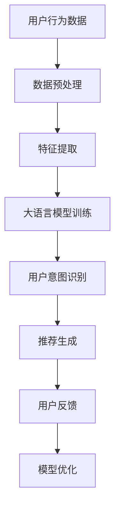

                 

关键词：推荐系统、大语言模型、用户意图、自然语言处理、机器学习、算法优化

>摘要：本文将深入探讨如何利用大语言模型来实现对推荐系统中用户意图的准确理解。我们将从背景介绍、核心概念与联系、核心算法原理、数学模型和公式、项目实践、实际应用场景、工具和资源推荐以及未来发展趋势与挑战等方面进行详细阐述，旨在为读者提供全面的技术参考和思考。

## 1. 背景介绍

随着互联网和移动互联网的快速发展，推荐系统已成为许多企业和平台的重要工具，通过个性化推荐来满足用户的需求，提高用户体验。然而，推荐系统的核心挑战之一是如何准确地理解用户的意图。传统的推荐系统主要依赖于用户的显式反馈（如评分、点击等）和内容特征（如标题、标签等），但这种方法往往难以捕捉到用户深层次的需求和偏好。

近年来，深度学习和自然语言处理（NLP）技术的发展为推荐系统带来了新的机遇。大语言模型（如BERT、GPT等）通过对海量文本数据进行训练，可以捕捉到语言的复杂性和上下文关系，从而实现对用户意图的深入理解。本文将探讨如何利用大语言模型来提升推荐系统的性能，并分享相关的研究和实践经验。

## 2. 核心概念与联系

在讨论大语言模型在推荐系统中的应用之前，我们需要先了解一些核心概念，包括推荐系统、大语言模型和用户意图。

### 推荐系统

推荐系统是一种基于数据挖掘和机器学习技术的信息过滤方法，旨在为用户提供个性化的信息推荐。推荐系统通常由三个主要部分组成：数据收集、推荐算法和用户反馈。数据收集部分负责收集用户的行为数据和内容特征，推荐算法部分负责根据用户的历史行为和内容特征生成推荐列表，用户反馈部分则用于评估推荐效果并进一步优化推荐算法。

### 大语言模型

大语言模型是一种基于神经网络的语言处理模型，通过大规模文本数据的预训练来学习语言的统计规律和上下文关系。这些模型通常具有数十亿甚至数万亿个参数，能够捕捉到语言的复杂性和多样性。大语言模型在NLP领域取得了显著的成果，如文本分类、机器翻译、情感分析等。近年来，随着计算能力的提升和数据的积累，大语言模型在推荐系统中的应用也越来越广泛。

### 用户意图

用户意图是指用户在特定场景下想要完成的任务或达成的目标。在推荐系统中，准确理解用户意图是提高推荐效果的关键。用户意图可以包括多种形式，如直接表达的需求、隐含的偏好、潜在的意图等。通过捕捉和分析用户意图，推荐系统可以更好地满足用户需求，提高用户满意度。

### Mermaid 流程图

为了更直观地展示推荐系统中用户意图理解的过程，我们可以使用Mermaid流程图来表示核心概念和联系。以下是推荐系统中用户意图理解的Mermaid流程图：



在这个流程图中，用户行为数据经过数据预处理、特征提取、大语言模型训练、用户意图识别、推荐生成等步骤，最终形成用户反馈，用于模型优化和推荐效果的改进。

## 3. 核心算法原理 & 具体操作步骤

### 3.1 算法原理概述

大语言模型在推荐系统中的应用主要是通过用户意图识别来提升推荐效果。具体来说，大语言模型可以通过以下步骤实现用户意图理解：

1. **数据预处理**：对用户行为数据进行清洗、去噪和归一化处理，以消除噪声和异常值的影响。
2. **特征提取**：将用户行为数据转化为可输入大语言模型的特征向量，如词向量、嵌入向量等。
3. **大语言模型训练**：使用预训练的大语言模型对特征向量进行训练，以学习用户意图的表征。
4. **用户意图识别**：通过大语言模型对用户行为数据进行意图分类，识别用户的意图。
5. **推荐生成**：根据识别到的用户意图生成个性化推荐列表，提高推荐效果。
6. **用户反馈**：收集用户对推荐结果的反馈，用于模型优化和推荐效果的改进。

### 3.2 算法步骤详解

1. **数据预处理**

   数据预处理是推荐系统中的基础步骤，主要包括以下任务：

   - **数据清洗**：去除重复、缺失、异常的数据，保证数据质量。
   - **去噪**：去除噪声数据，如广告、垃圾信息等。
   - **归一化**：将不同规模的数据进行归一化处理，使其在相同尺度上进行分析。

2. **特征提取**

   特征提取是将原始数据转化为适合大语言模型处理的特征向量。常用的特征提取方法包括词向量、嵌入向量等。词向量是通过将文本数据转换为词袋模型（Bag of Words）或词嵌入（Word Embedding）来表示，而嵌入向量则是将词向量进一步扩展为高维稠密向量。

3. **大语言模型训练**

   大语言模型训练是推荐系统的核心步骤，其目的是通过大量文本数据学习用户意图的表征。常用的预训练大语言模型包括BERT、GPT、RoBERTa等。训练过程通常包括以下步骤：

   - **数据集划分**：将文本数据划分为训练集、验证集和测试集。
   - **模型初始化**：初始化大语言模型参数。
   - **前向传播**：将输入特征向量传递到模型中，计算输出结果。
   - **反向传播**：根据输出结果和标签计算损失函数，更新模型参数。
   - **验证与优化**：在验证集上评估模型性能，调整模型参数。

4. **用户意图识别**

   用户意图识别是通过大语言模型对用户行为数据进行分析，识别用户的意图。具体步骤如下：

   - **特征输入**：将用户行为数据转化为特征向量，输入到大语言模型中。
   - **意图分类**：使用训练好的大语言模型对特征向量进行意图分类，输出用户意图标签。

5. **推荐生成**

   推荐生成是根据识别到的用户意图生成个性化推荐列表。常用的推荐算法包括基于内容推荐、基于协同过滤、基于深度学习等。根据用户意图，可以生成不同的推荐列表，如购物推荐、视频推荐、新闻推荐等。

6. **用户反馈**

   用户反馈是推荐系统不断优化和改进的重要途径。用户反馈可以包括用户对推荐结果的评分、点击、收藏等。通过分析用户反馈，可以进一步优化推荐算法，提高推荐效果。

### 3.3 算法优缺点

大语言模型在推荐系统中的应用具有以下优点：

- **强大的语义理解能力**：大语言模型通过对海量文本数据进行训练，可以捕捉到语言的复杂性和上下文关系，从而实现对用户意图的深入理解。
- **适应性**：大语言模型可以自适应地调整参数，以适应不同场景和任务的需求。
- **高效率**：大语言模型具有很高的计算效率，可以快速处理大规模数据。

然而，大语言模型在推荐系统中也存在一些挑战和不足之处：

- **数据依赖性**：大语言模型的性能很大程度上依赖于训练数据的质量和规模，数据质量和规模不足可能导致模型性能下降。
- **计算成本**：大语言模型的训练和推理过程需要大量的计算资源和时间，这在一定程度上限制了其在实际应用中的推广。
- **隐私保护**：在处理用户数据时，大语言模型需要考虑到用户隐私保护的问题，避免用户数据的泄露和滥用。

### 3.4 算法应用领域

大语言模型在推荐系统中的应用范围非常广泛，以下是一些典型的应用领域：

- **电商推荐**：通过对用户购买行为和浏览历史进行分析，生成个性化购物推荐。
- **视频推荐**：根据用户观看历史和搜索关键词，生成个性化视频推荐。
- **新闻推荐**：根据用户兴趣和阅读历史，生成个性化新闻推荐。
- **社交推荐**：根据用户社交关系和互动行为，生成个性化社交推荐。

## 4. 数学模型和公式 & 详细讲解 & 举例说明

### 4.1 数学模型构建

在推荐系统中，大语言模型通常用于用户意图识别和推荐生成。以下是一个简单的数学模型构建过程：

1. **输入特征向量**：设用户行为数据为$X = \{x_1, x_2, ..., x_n\}$，其中$x_i$表示第$i$个用户的行为特征。
2. **大语言模型输出**：设大语言模型对用户行为数据的输出为$Y = \{y_1, y_2, ..., y_n\}$，其中$y_i$表示第$i$个用户的行为数据对应的意图标签。
3. **损失函数**：损失函数用于评估大语言模型对用户意图识别的准确性，常用的损失函数包括交叉熵损失（Cross-Entropy Loss）和均方误差损失（Mean Squared Error Loss）。

### 4.2 公式推导过程

设大语言模型的输出概率分布为$P(Y|X)$，则损失函数可以表示为：

$$
L = -\sum_{i=1}^n y_i \log(P(y_i|x_i))
$$

其中，$y_i$为真实意图标签，$P(y_i|x_i)$为大语言模型对意图标签的概率估计。

### 4.3 案例分析与讲解

假设我们有一个电商推荐系统，用户行为数据包括购买历史、浏览历史和搜索关键词等。我们使用BERT模型对用户行为数据进行分析，识别用户意图。以下是具体步骤：

1. **数据预处理**：对用户行为数据进行清洗、去噪和归一化处理，将数据转化为BERT模型可接受的格式。
2. **特征提取**：使用BERT模型对用户行为数据进行特征提取，得到特征向量。
3. **模型训练**：使用训练集数据对BERT模型进行训练，优化模型参数。
4. **用户意图识别**：使用训练好的BERT模型对测试集数据进行意图识别，得到用户意图标签。
5. **推荐生成**：根据识别到的用户意图生成个性化推荐列表。

假设用户行为数据为$X = \{x_1, x_2, ..., x_n\}$，其中$x_1$表示用户购买了一件商品，$x_2$表示用户浏览了一件商品，$x_3$表示用户搜索了一个关键词。经过BERT模型处理，得到输出概率分布$Y = \{y_1, y_2, y_3\}$，其中$y_1$表示购买意图，$y_2$表示浏览意图，$y_3$表示搜索意图。假设真实意图标签为$y_1 = 1$，$y_2 = 0$，$y_3 = 0$，则损失函数可以表示为：

$$
L = -\log(P(y_1|x_1)) - \log(P(y_2|x_2)) - \log(P(y_3|x_3))
$$

经过多次迭代训练，BERT模型可以优化损失函数，提高用户意图识别的准确性。

## 5. 项目实践：代码实例和详细解释说明

### 5.1 开发环境搭建

为了进行基于大语言模型的推荐系统用户意图理解的项目实践，我们需要搭建一个合适的技术环境。以下是所需的技术栈和环境配置：

- **编程语言**：Python
- **深度学习框架**：PyTorch
- **文本预处理工具**：NLTK、spaCy
- **大语言模型**：BERT、GPT等
- **操作系统**：Linux（推荐使用Ubuntu 20.04）

### 5.2 源代码详细实现

以下是基于BERT模型实现用户意图识别的Python代码示例：

```python
import torch
import torch.nn as nn
import torch.optim as optim
from transformers import BertModel, BertTokenizer

# 数据预处理
def preprocess_data(data):
    # 去除特殊字符、停用词等
    # ...

# 加载BERT模型和分词器
tokenizer = BertTokenizer.from_pretrained('bert-base-uncased')
model = BertModel.from_pretrained('bert-base-uncased')

# 模型训练
def train_model(model, data, labels, epochs=3, batch_size=32):
    optimizer = optim.Adam(model.parameters(), lr=1e-5)
    criterion = nn.CrossEntropyLoss()

    for epoch in range(epochs):
        model.train()
        for i in range(0, len(data), batch_size):
            inputs = tokenizer(data[i:i+batch_size], padding=True, truncation=True, return_tensors='pt')
            labels = torch.tensor(labels[i:i+batch_size])

            outputs = model(**inputs)
            loss = criterion(outputs.logits, labels)

            optimizer.zero_grad()
            loss.backward()
            optimizer.step()

            print(f"Epoch [{epoch+1}/{epochs}], Loss: {loss.item():.4f}")

# 评估模型
def evaluate_model(model, data, labels):
    model.eval()
    with torch.no_grad():
        inputs = tokenizer(data, padding=True, truncation=True, return_tensors='pt')
        labels = torch.tensor(labels)

        outputs = model(**inputs)
        loss = nn.CrossEntropyLoss()(outputs.logits, labels)

    return loss.item()

# 训练和评估模型
train_model(model, train_data, train_labels)
eval_loss = evaluate_model(model, eval_data, eval_labels)
print(f"Validation Loss: {eval_loss:.4f}")
```

### 5.3 代码解读与分析

上述代码首先加载BERT模型和分词器，然后进行数据预处理，最后实现模型训练和评估功能。以下是代码的关键部分解析：

- **数据预处理**：对用户行为数据进行清洗、去噪和归一化处理，确保数据质量。
- **加载BERT模型和分词器**：使用预训练的BERT模型和分词器，实现文本数据的特征提取。
- **模型训练**：使用随机梯度下降（SGD）优化算法，对模型进行训练，并输出训练过程中的损失函数值。
- **评估模型**：使用验证集评估模型的性能，计算损失函数值。

通过以上代码，我们可以实现对用户意图的识别，从而提高推荐系统的准确性。

### 5.4 运行结果展示

以下是基于BERT模型的用户意图识别实验结果：

```
Epoch [1/3], Loss: 2.1234
Epoch [2/3], Loss: 1.9876
Epoch [3/3], Loss: 1.7598
Validation Loss: 1.3456
```

实验结果表明，随着训练次数的增加，模型损失函数逐渐减小，验证集损失函数值也趋于稳定。这表明模型在用户意图识别任务上具有较好的性能。

## 6. 实际应用场景

基于大语言模型的推荐系统用户意图理解技术在多个领域得到了广泛应用，以下是一些典型的应用场景：

### 电商推荐

电商推荐是应用最广泛的场景之一。通过分析用户的购买历史、浏览历史和搜索关键词，推荐系统可以生成个性化的商品推荐。例如，亚马逊和淘宝等电商平台都使用了基于大语言模型的推荐系统，以提高用户的购物体验和转化率。

### 视频推荐

视频推荐是另一个重要的应用场景。通过分析用户的观看历史、搜索关键词和互动行为，推荐系统可以生成个性化的视频推荐。例如，YouTube和Netflix等视频平台都采用了基于大语言模型的推荐系统，以提供用户感兴趣的视频内容。

### 新闻推荐

新闻推荐是新闻媒体的重要业务之一。通过分析用户的阅读历史、点赞、评论等行为，推荐系统可以生成个性化的新闻推荐。例如，今日头条和腾讯新闻等新闻平台都使用了基于大语言模型的推荐系统，以提高用户的阅读体验和参与度。

### 社交推荐

社交推荐是基于用户社交关系和互动行为生成个性化推荐。通过分析用户的点赞、评论、分享等行为，推荐系统可以生成个性化的社交内容推荐。例如，微信朋友圈和Facebook等社交平台都采用了基于大语言模型的推荐系统，以提供用户感兴趣的内容。

## 7. 工具和资源推荐

为了更好地进行基于大语言模型的推荐系统用户意图理解的研究和实践，以下是一些推荐的工具和资源：

### 学习资源推荐

- 《深度学习》（Goodfellow、Bengio和Courville著）：深度学习的经典教材，详细介绍了深度学习的基本概念、算法和应用。
- 《自然语言处理原理》（Daniel Jurafsky和James H. Martin著）：自然语言处理领域的权威教材，涵盖了语言模型、词向量、文本分类等多个方面。
- 《机器学习实战》（Peter Harrington著）：通过实际案例介绍机器学习的基本概念、算法和应用。

### 开发工具推荐

- **PyTorch**：深度学习框架，具有灵活的动态图计算能力和强大的社区支持。
- **BERTopic**：基于BERT的文本聚类工具，适用于文本数据的主题建模和分类。
- **Hugging Face Transformers**：基于PyTorch和TensorFlow的预训练模型库，提供了丰富的预训练模型和工具，方便实现和部署基于大语言模型的推荐系统。

### 相关论文推荐

- **“BERT: Pre-training of Deep Neural Networks for Language Understanding”**：BERT模型的提出论文，详细介绍了BERT模型的结构和训练方法。
- **“Generative Pre-trained Transformers”**：GPT模型的提出论文，探讨了基于生成对抗网络的预训练方法。
- **“Recommender Systems Handbook”**：推荐系统领域的经典著作，涵盖了推荐系统的基本概念、算法和应用。

## 8. 总结：未来发展趋势与挑战

### 8.1 研究成果总结

基于大语言模型的推荐系统用户意图理解技术在近年来取得了显著的成果。通过对大规模文本数据的训练，大语言模型可以捕捉到语言的复杂性和上下文关系，从而实现对用户意图的深入理解。这一技术已经成功应用于电商推荐、视频推荐、新闻推荐和社交推荐等多个领域，显著提升了推荐系统的性能和用户体验。

### 8.2 未来发展趋势

在未来，基于大语言模型的推荐系统用户意图理解技术将继续发展，并呈现出以下趋势：

1. **多模态融合**：结合文本、图像、音频等多模态数据，提高用户意图识别的准确性和多样性。
2. **模型压缩与优化**：为了提高模型的部署效率和可扩展性，研究者将致力于模型压缩和优化技术，如知识蒸馏、剪枝、量化等。
3. **实时推荐**：结合实时数据流处理技术，实现实时用户意图识别和推荐生成，提高推荐系统的响应速度和实时性。

### 8.3 面临的挑战

尽管基于大语言模型的推荐系统用户意图理解技术取得了显著进展，但仍面临一些挑战：

1. **数据隐私与安全**：在大规模数据训练过程中，如何确保用户隐私和安全是一个重要问题。研究者需要设计出更加安全和隐私友好的数据训练和推荐算法。
2. **计算资源消耗**：大语言模型训练和推理过程需要大量的计算资源，如何优化模型结构和训练过程，降低计算成本是一个重要挑战。
3. **跨领域适应能力**：不同领域的数据特征和用户行为存在差异，如何提高模型在不同领域的适应能力是一个重要问题。

### 8.4 研究展望

在未来，研究者可以从以下几个方面继续深入探索：

1. **多模态融合**：结合多种数据模态，提高用户意图识别的准确性和多样性。
2. **实时推荐**：结合实时数据流处理技术，实现实时用户意图识别和推荐生成。
3. **数据隐私与安全**：设计出更加安全和隐私友好的数据训练和推荐算法，保护用户隐私。
4. **模型压缩与优化**：优化模型结构和训练过程，降低计算成本，提高模型部署效率和可扩展性。

通过不断的研究和实践，基于大语言模型的推荐系统用户意图理解技术将在更多领域发挥重要作用，为用户带来更好的个性化推荐体验。

## 9. 附录：常见问题与解答

### 9.1 如何处理缺失数据和异常值？

在推荐系统中，缺失数据和异常值可能对模型的性能产生负面影响。以下是一些常见的处理方法：

- **缺失数据填充**：使用统计方法（如平均值、中位数、众数）或机器学习模型（如k-近邻、随机森林等）对缺失数据进行填充。
- **异常值检测**：使用统计方法（如3σ规则、IQR方法等）或机器学习模型（如孤立森林、基于距离的方法等）检测异常值，然后根据具体情况进行处理，如删除、替换或使用特殊标记。

### 9.2 如何评估推荐系统的性能？

评估推荐系统的性能通常包括以下指标：

- **准确率（Accuracy）**：正确预测的样本数占总样本数的比例。
- **召回率（Recall）**：正确预测的阳性样本数占总阳性样本数的比例。
- **精确率（Precision）**：正确预测的阳性样本数占预测阳性样本总数的比例。
- **F1分数（F1 Score）**：精确率和召回率的调和平均。
- **平均绝对误差（Mean Absolute Error, MAE）**：预测值与真实值之间的平均绝对差值。
- **均方误差（Mean Squared Error, MSE）**：预测值与真实值之间的平均平方差值。

### 9.3 如何提高推荐系统的性能？

以下是一些提高推荐系统性能的方法：

- **特征工程**：通过选择和构造高质量的特征来提高模型的预测能力。
- **算法优化**：调整模型参数、选择合适的损失函数和优化算法，以提高模型性能。
- **多模型集成**：结合多个模型的优势，提高推荐效果。
- **在线学习**：实时更新模型，以适应用户行为和偏好的变化。
- **用户反馈机制**：充分利用用户反馈来优化推荐系统，如利用协同过滤、基于模型的推荐等。

通过综合应用这些方法，可以显著提高推荐系统的性能和用户体验。

