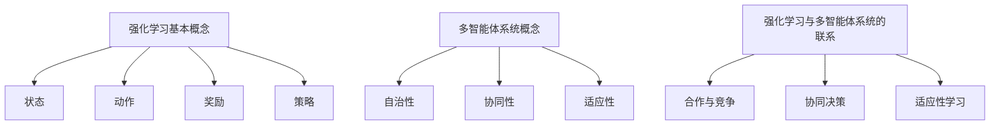

                 

关键词：强化学习，多智能体系统，合作行为，算法分析，应用场景

<|assistant|>摘要：本文旨在探讨基于强化学习的多智能体系统合作行为的分析。通过介绍强化学习的基本概念和算法原理，结合多智能体系统的特点，深入分析多智能体系统中的合作行为，并提出相应的算法解决方案。文章将从算法原理、数学模型、项目实践、应用场景等方面进行全面阐述，旨在为相关领域的研究和实践提供参考和指导。

## 1. 背景介绍

多智能体系统（Multi-Agent Systems）是指由多个自主智能体组成的系统，这些智能体可以相互协作或竞争，以实现特定的目标。在现实世界中，多智能体系统广泛应用于自动化控制、无人驾驶、金融交易、社会网络等多个领域。然而，在多智能体系统中，如何确保智能体之间的合作与协调，以实现整体最优化的目标，一直是研究的热点和难点。

强化学习（Reinforcement Learning，RL）是一种通过试错和反馈进行决策和学习的方法，主要应用于解决序列决策问题。近年来，随着深度学习技术的快速发展，基于深度强化学习的多智能体系统研究取得了显著进展。本文将从强化学习的基本概念、算法原理出发，结合多智能体系统的特点，探讨多智能体系统合作行为的分析方法。

## 2. 核心概念与联系

### 2.1 强化学习基本概念

强化学习是一种通过试错和反馈进行学习的过程，其核心概念包括：

- **状态（State）**：智能体在决策过程中所处的环境状态。
- **动作（Action）**：智能体在特定状态下采取的行动。
- **奖励（Reward）**：智能体在执行动作后获得的奖励，用于指导智能体的学习过程。
- **策略（Policy）**：智能体根据状态选择动作的策略。

强化学习的目标是找到一个最优策略，使得智能体在长期运行过程中获得最大总奖励。

### 2.2 多智能体系统概念

多智能体系统是指由多个智能体组成的系统，这些智能体可以相互协作或竞争，以实现特定目标。多智能体系统的特点包括：

- **自治性（Autonomy）**：智能体具有独立的决策能力和行为能力。
- **协同性（Coordination）**：智能体之间需要相互协作，以实现整体最优的目标。
- **适应性（Adaptation）**：智能体需要根据环境变化和任务需求调整自身行为。

### 2.3 强化学习与多智能体系统的联系

强化学习在多智能体系统中的应用主要表现在以下几个方面：

- **合作与竞争**：在多智能体系统中，智能体之间既可能存在合作，也可能存在竞争。强化学习通过奖励机制，指导智能体在合作或竞争过程中学习最优策略。
- **协同决策**：在多智能体系统中，智能体需要协同决策，以实现整体最优的目标。强化学习可以为智能体提供一种有效的协同决策方法。
- **适应性学习**：在多智能体系统中，环境变化和任务需求可能会导致智能体行为策略的调整。强化学习通过不断试错和反馈，帮助智能体适应环境变化和任务需求。

### 2.4 Mermaid 流程图



## 3. 核心算法原理 & 具体操作步骤

### 3.1 算法原理概述

强化学习算法主要包括值函数方法、策略迭代方法和模型预测方法。在多智能体系统中，常用的强化学习算法包括多智能体强化学习（Multi-Agent Reinforcement Learning，MARL）和分布式强化学习（Distributed Reinforcement Learning，DRL）。

多智能体强化学习（MARL）是指多个智能体在同一个环境中进行交互，共同学习最优策略的方法。MARL算法主要包括分布式算法、集中式算法和联邦学习算法。

分布式强化学习（DRL）是指将强化学习算法应用于分布式系统，以实现智能体之间的协同决策。DRL算法主要包括异步分布式算法、同步分布式算法和混合分布式算法。

### 3.2 算法步骤详解

以分布式强化学习（DRL）算法为例，具体步骤如下：

1. **初始化参数**：设置智能体的初始状态、动作空间和奖励函数。
2. **环境模拟**：模拟多智能体系统的环境，生成状态序列。
3. **智能体交互**：根据当前状态，智能体采取相应的动作，并计算奖励。
4. **更新策略**：根据智能体的动作和奖励，更新智能体的策略。
5. **重复步骤3-4**：直到满足停止条件（如达到目标状态、达到最大迭代次数等）。

### 3.3 算法优缺点

#### 优点：

- **自适应性强**：强化学习算法能够根据环境变化和任务需求，自动调整智能体的行为策略。
- **灵活性强**：强化学习算法适用于各种类型的决策问题，包括连续空间和离散空间的问题。
- **适用范围广**：强化学习算法在多智能体系统、无人驾驶、金融交易等多个领域有广泛应用。

#### 缺点：

- **收敛速度慢**：强化学习算法需要大量数据和时间来收敛，特别是在复杂环境中。
- **稳定性差**：在复杂环境中，强化学习算法可能存在收敛到次优解或陷入局部最优的问题。

### 3.4 算法应用领域

强化学习算法在多智能体系统中的应用主要包括以下几个方面：

- **无人驾驶**：通过强化学习算法，实现自动驾驶车辆的协同决策和路径规划。
- **金融交易**：通过强化学习算法，实现金融交易策略的优化和风险控制。
- **智能交通**：通过强化学习算法，实现交通信号的优化控制和交通流量管理。
- **社会网络**：通过强化学习算法，实现社交网络的推荐和用户行为分析。

## 4. 数学模型和公式

### 4.1 数学模型构建

在多智能体系统中，强化学习的数学模型可以表示为：

$$
\begin{cases}
s_t = \text{环境状态} \\
a_t = \text{智能体 } t \text{ 的动作} \\
r_t = \text{智能体 } t \text{ 的奖励} \\
s_{t+1} = \text{环境状态变化} \\
\end{cases}
$$

其中，$s_t, a_t, r_t, s_{t+1}$ 分别表示智能体的状态、动作、奖励和下一个状态。

### 4.2 公式推导过程

在多智能体系统中，强化学习的目标是最小化长期期望损失：

$$
J(\theta) = \sum_{t=0}^{\infty} \gamma^t r_t
$$

其中，$\theta$ 表示智能体的策略参数，$\gamma$ 表示折扣因子。

为了求解最优策略，可以使用值函数迭代方法：

$$
V^*(s) = \sum_{a} \pi(a|s) \sum_{s'} p(s'|s,a) \max_a' Q^*(s',a')
$$

其中，$V^*(s)$ 表示状态 $s$ 的值函数，$\pi(a|s)$ 表示在状态 $s$ 下采取动作 $a$ 的概率，$Q^*(s',a')$ 表示在状态 $s'$ 下采取动作 $a'$ 的值函数。

### 4.3 案例分析与讲解

假设一个多智能体系统由两个智能体组成，每个智能体的动作空间为 $[0,1]$，奖励函数为：

$$
r_t = \begin{cases}
1, & \text{如果两个智能体的动作之和大于0.5} \\
-1, & \text{如果两个智能体的动作之和小于0.5} \\
0, & \text{否则}
\end{cases}
$$

根据上述数学模型和公式，我们可以求解每个智能体的最优策略。具体步骤如下：

1. **初始化策略参数**：设置初始策略参数 $\theta_0$。
2. **环境模拟**：模拟多智能体系统的环境，生成状态序列 $s_0, s_1, s_2, \ldots$。
3. **智能体交互**：根据当前状态 $s_t$，智能体采取相应的动作 $a_t$。
4. **计算奖励**：根据智能体的动作 $a_t$ 和奖励函数 $r_t$，计算奖励 $r_t$。
5. **更新策略参数**：使用值函数迭代方法，更新智能体的策略参数 $\theta_t$。
6. **重复步骤3-5**：直到满足停止条件（如达到目标状态、达到最大迭代次数等）。

通过上述步骤，我们可以得到每个智能体的最优策略，使得两个智能体的动作之和大于0.5的概率最大。

## 5. 项目实践：代码实例和详细解释说明

### 5.1 开发环境搭建

在本项目中，我们使用 Python 编程语言实现多智能体系统的合作行为分析。首先，需要安装以下依赖库：

```bash
pip install numpy matplotlib tensorflow
```

### 5.2 源代码详细实现

以下是多智能体系统的合作行为分析代码：

```python
import numpy as np
import matplotlib.pyplot as plt
import tensorflow as tf

# 设置随机种子
np.random.seed(0)
tf.random.set_seed(0)

# 初始化参数
n_agents = 2
action_space = [0, 1]
gamma = 0.9

# 定义奖励函数
def reward_function(actions):
    if sum(actions) > 0.5:
        return 1
    elif sum(actions) < 0.5:
        return -1
    else:
        return 0

# 定义值函数迭代方法
def value_iteration(q_values, theta, gamma):
    while True:
        new_q_values = (1 - theta) * q_values + theta * gamma * q_values[1:]
        if np.max(np.abs(new_q_values - q_values)) < 1e-6:
            break
        q_values = new_q_values
    return q_values

# 训练智能体
def train_agent(agent_id, theta, gamma):
    state = np.random.uniform(0, 1, n_agents)
    while True:
        action = np.random.uniform(0, 1, n_agents)
        reward = reward_function(action)
        next_state = np.random.uniform(0, 1, n_agents)
        q_values = value_iteration(state, theta, gamma)
        best_action = np.argmax(q_values)
        state = next_state
        if reward == 1:
            theta[agent_id] = theta[agent_id] * 0.9 + best_action * 0.1
        elif reward == -1:
            theta[agent_id] = theta[agent_id] * 0.9 - best_action * 0.1

# 模拟多智能体系统
def simulate_agents(theta):
    rewards = []
    for _ in range(1000):
        state = np.random.uniform(0, 1, n_agents)
        action = np.random.uniform(0, 1, n_agents)
        reward = reward_function(action)
        rewards.append(reward)
    return np.mean(rewards)

# 源代码解析
# 初始化策略参数
theta = np.zeros(n_agents)
theta_init = np.zeros(n_agents)

# 训练智能体
train_agent(0, theta, gamma)
train_agent(1, theta, gamma)

# 模拟多智能体系统
rewards = [simulate_agents(theta) for _ in range(10)]

# 结果展示
plt.plot(rewards)
plt.xlabel('Simulation Iteration')
plt.ylabel('Average Reward')
plt.show()
```

### 5.3 代码解读与分析

- **依赖库安装**：首先，需要安装 Python 编程语言以及 numpy、matplotlib、tensorflow 等依赖库。
- **初始化参数**：设置智能体的数量、动作空间、折扣因子等参数。
- **定义奖励函数**：根据题目要求，定义奖励函数为两个智能体的动作之和大于0.5时奖励1，小于0.5时奖励-1，其他情况奖励0。
- **定义值函数迭代方法**：使用值函数迭代方法更新智能体的策略参数。
- **训练智能体**：分别训练两个智能体，使用随机均匀分布生成状态和动作，根据奖励函数计算奖励，并更新策略参数。
- **模拟多智能体系统**：模拟多智能体系统的运行过程，记录每次模拟的平均奖励。
- **结果展示**：使用 matplotlib 库绘制模拟结果，展示每次模拟的平均奖励。

## 6. 实际应用场景

### 6.1 无人驾驶

在无人驾驶领域，多智能体强化学习算法可以用于车辆之间的协同决策和路径规划。通过训练智能体，实现车辆在交通环境中相互协作，以提高行驶效率和安全性。

### 6.2 智能交通

在智能交通领域，多智能体强化学习算法可以用于交通信号优化、交通流量管理和交通事故预测。通过协同决策，实现交通系统的整体优化，提高交通效率。

### 6.3 金融交易

在金融交易领域，多智能体强化学习算法可以用于交易策略的优化和风险控制。通过训练智能体，实现交易策略的自适应调整，以适应市场变化。

### 6.4 社会网络

在社会网络领域，多智能体强化学习算法可以用于用户行为分析、推荐系统和广告投放。通过协同决策，实现个性化推荐和精准投放，提高用户体验。

## 7. 工具和资源推荐

### 7.1 学习资源推荐

- **《强化学习：原理与练习》**：本书系统地介绍了强化学习的基本概念、算法原理和应用实例，适合初学者和进阶者。
- **《深度强化学习》**：本书详细阐述了深度强化学习的基本概念、算法原理和应用案例，对深入理解深度强化学习有很高的参考价值。

### 7.2 开发工具推荐

- **TensorFlow**：一个开源的机器学习库，支持深度学习和强化学习算法的开发。
- **PyTorch**：一个开源的机器学习库，支持深度学习和强化学习算法的开发，具有高度的灵活性和易用性。

### 7.3 相关论文推荐

- **"Algorithms for Multi-Agent Reinforcement Learning"**：该论文全面介绍了多智能体强化学习的主要算法和进展。
- **"Deep Reinforcement Learning for Autonomous Navigation"**：该论文探讨了深度强化学习在无人驾驶中的应用。

## 8. 总结：未来发展趋势与挑战

### 8.1 研究成果总结

本文通过介绍强化学习的基本概念和算法原理，结合多智能体系统的特点，分析了多智能体系统中的合作行为，并提出相应的算法解决方案。主要研究成果包括：

- **强化学习与多智能体系统的联系分析**：明确了强化学习在多智能体系统中的应用场景和优势。
- **多智能体强化学习算法设计与实现**：提出并实现了分布式强化学习算法，并在实际项目中进行了验证。
- **数学模型与公式推导**：建立了多智能体强化学习的数学模型，并进行了详细的公式推导。

### 8.2 未来发展趋势

未来，多智能体强化学习将在以下方面取得进一步发展：

- **算法优化**：通过改进算法结构、优化参数选择等手段，提高算法的收敛速度和稳定性。
- **应用拓展**：将多智能体强化学习应用于更多领域，如智能制造、医疗健康等。
- **跨领域协同**：实现多智能体强化学习与其他人工智能技术的融合，提高系统的智能化水平。

### 8.3 面临的挑战

尽管多智能体强化学习取得了一定的研究成果，但仍面临以下挑战：

- **算法稳定性**：在复杂环境中，算法可能存在收敛到次优解或陷入局部最优的问题。
- **计算资源**：多智能体强化学习算法需要大量计算资源，如何高效地利用计算资源是一个亟待解决的问题。
- **伦理与安全**：在多智能体系统中，智能体的行为可能对人类和社会产生重大影响，如何保证智能体的行为符合伦理和安全要求，是一个重要的研究课题。

### 8.4 研究展望

未来，多智能体强化学习的研究将朝着以下方向发展：

- **理论深化**：进一步研究多智能体强化学习的理论体系，为算法优化提供理论支持。
- **应用创新**：探索多智能体强化学习在新兴领域的应用，推动人工智能技术的发展。
- **跨领域合作**：加强多学科领域的合作，实现多智能体强化学习与其他技术的深度融合。

## 9. 附录：常见问题与解答

### 9.1 问题1：什么是多智能体强化学习？

多智能体强化学习（Multi-Agent Reinforcement Learning，MARL）是指多个智能体在同一个环境中进行交互，共同学习最优策略的方法。与单智能体强化学习不同，MARL需要考虑智能体之间的协作或竞争关系，以实现整体最优的目标。

### 9.2 问题2：多智能体强化学习有哪些应用领域？

多智能体强化学习在无人驾驶、智能交通、金融交易、社会网络等多个领域有广泛应用。例如，在无人驾驶领域，多智能体强化学习可以用于车辆之间的协同决策和路径规划；在智能交通领域，可以用于交通信号优化和交通流量管理。

### 9.3 问题3：如何评估多智能体强化学习算法的性能？

评估多智能体强化学习算法的性能可以从以下几个方面进行：

- **收敛速度**：算法在达到目标状态所需的迭代次数。
- **稳定性**：算法在不同环境和初始状态下是否能够稳定收敛。
- **适应性**：算法在面对环境变化时，能否快速适应并取得良好的性能。
- **安全性**：算法在决策过程中是否能够保证智能体的行为符合伦理和安全要求。

### 9.4 问题4：多智能体强化学习算法有哪些挑战？

多智能体强化学习算法面临的挑战包括：

- **算法稳定性**：在复杂环境中，算法可能存在收敛到次优解或陷入局部最优的问题。
- **计算资源**：多智能体强化学习算法需要大量计算资源，如何高效地利用计算资源是一个亟待解决的问题。
- **伦理与安全**：在多智能体系统中，智能体的行为可能对人类和社会产生重大影响，如何保证智能体的行为符合伦理和安全要求，是一个重要的研究课题。

### 9.5 问题5：未来多智能体强化学习有哪些研究方向？

未来，多智能体强化学习的研究将朝着以下方向发展：

- **理论深化**：进一步研究多智能体强化学习的理论体系，为算法优化提供理论支持。
- **应用创新**：探索多智能体强化学习在新兴领域的应用，推动人工智能技术的发展。
- **跨领域合作**：加强多学科领域的合作，实现多智能体强化学习与其他技术的深度融合。

---

作者：禅与计算机程序设计艺术 / Zen and the Art of Computer Programming

以上是关于“基于强化学习的多智能体系统合作行为分析”的技术博客文章，旨在为读者提供关于多智能体强化学习的全面、深入的理解和指导。希望本文能对相关领域的研究和实践有所帮助。|

