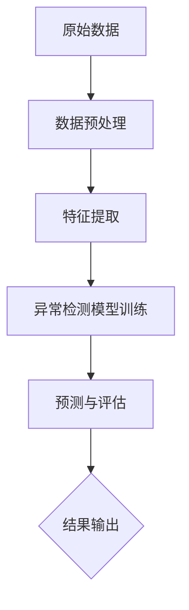

                 

 在当今的数据驱动时代，异常检测（Anomaly Detection）作为一种重要的数据分析技术，被广泛应用于各个领域，如金融、医疗、网络安全等。异常检测旨在从大量数据中识别出那些不符合正常规律的异常数据点或模式。随着数据量的爆炸式增长和复杂度的不断增加，传统的异常检测方法已经难以应对新的挑战。深度学习作为一种强大的机器学习技术，其自下而上的特征学习和强大的表达能力，为异常检测带来了新的希望。本文将详细介绍基于深度学习的异常检测技术，包括其核心概念、算法原理、数学模型、实际应用等，以期为读者提供全面的理解和指导。

## 1. 背景介绍

### 异常检测的起源与发展

异常检测起源于统计学和模式识别领域。最早的研究可以追溯到20世纪50年代，当时的研究者主要关注如何从连续的数据流中识别出异常点。随着计算机技术的进步和大数据时代的到来，异常检测技术得到了快速发展。传统异常检测方法主要包括基于统计学的方法（如箱型图、直方图、概率模型等）和基于聚类的方法（如K-means、层次聚类等）。这些方法在一定程度上能够识别异常，但在面对高维数据和复杂模型时，其效果往往不佳。

### 深度学习的兴起

深度学习作为一种基于人工神经网络的机器学习技术，近年来在图像识别、自然语言处理、语音识别等领域取得了显著的成果。深度学习的核心思想是通过多层神经网络对数据进行特征提取和模式识别，从而实现高层次的抽象和表达。深度学习的兴起为异常检测提供了新的思路和方法。

### 深度学习在异常检测中的应用

深度学习在异常检测中的应用主要体现在以下几个方面：

1. **自动特征提取**：深度学习模型能够自动从原始数据中学习到有效的特征表示，避免了传统方法中手动特征提取的繁琐过程。

2. **高维数据处理**：深度学习模型能够处理高维数据，这在金融、医疗等领域尤为重要。

3. **复杂模型识别**：深度学习模型能够捕捉到复杂的数据分布和模式，从而提高异常检测的准确率。

### 本文结构

本文将首先介绍异常检测的核心概念和联系，然后深入探讨基于深度学习的异常检测算法原理、数学模型和具体操作步骤。接着，我们将通过一个实际项目实例，展示如何实现基于深度学习的异常检测。最后，我们将分析深度学习在异常检测中的实际应用场景，并展望其未来的发展方向。

## 2. 核心概念与联系

### 异常检测的定义

异常检测（Anomaly Detection）是指从大量数据中识别出那些不符合正常规律的异常数据点或模式。异常可以表现为数据点、子序列或子图等。异常检测的目标是找出这些异常点，以便采取相应的措施。

### 异常类型

异常可以分为以下几类：

1. **点异常（Point Anomalies）**：单个数据点与整体数据分布相比明显偏离正常范围。
2. **上下文异常（Contextual Anomalies）**：数据点本身没有异常，但处于一个异常的上下文环境中。
3. **集体异常（Collective Anomalies）**：一组数据点共同构成一个异常模式。
4. **突发异常（Sudden Anomalies）**：数据点突然偏离正常分布。
5. **渐变异常（Gradual Anomalies）**：数据点逐渐偏离正常分布。

### 深度学习与异常检测的联系

深度学习与异常检测的联系主要体现在以下几个方面：

1. **特征提取**：深度学习能够自动从原始数据中提取出有用的特征，提高异常检测的准确性。
2. **端到端学习**：深度学习模型可以端到端地学习数据分布和模式，无需手动调整参数。
3. **非线性建模**：深度学习模型具有较强的非线性建模能力，能够捕捉到复杂的数据分布和异常模式。

### Mermaid 流程图

下面是一个简单的Mermaid流程图，描述了深度学习在异常检测中的基本流程：



## 3. 核心算法原理 & 具体操作步骤

### 3.1 算法原理概述

基于深度学习的异常检测算法主要分为以下几类：

1. **孤立森林（Isolation Forest）**：通过随机选取特征和切分值来构建多个决策树，并利用树的高度来评估数据点的异常性。
2. **局部异常因子（Local Outlier Factor，LOF）**：通过计算每个数据点与其邻居数据点的局部异常度，来评估数据点的异常性。
3. **深度自动编码器（Deep Autoencoder）**：通过训练一个编码器网络和一个解码器网络，来学习数据的高效编码表示，并利用重建误差评估数据点的异常性。
4. **生成对抗网络（Generative Adversarial Network，GAN）**：通过训练一个生成器和判别器，来学习数据的生成分布，并利用生成器和判别器的交互来评估数据点的异常性。

### 3.2 算法步骤详解

以深度自动编码器为例，其具体步骤如下：

1. **数据预处理**：对原始数据进行归一化处理，以便于后续的模型训练。
2. **编码器训练**：利用原始数据训练编码器网络，使其能够将数据映射到一个低维空间。
3. **解码器训练**：利用编码器的输出训练解码器网络，使其能够将低维空间的数据映射回原始空间。
4. **异常性评估**：利用解码器的输出计算数据点的重建误差，并根据误差评估数据点的异常性。

### 3.3 算法优缺点

**深度自动编码器**

**优点**：

- 能够自动提取数据的有效特征。
- 对高维数据和复杂模型具有很好的适应性。

**缺点**：

- 训练过程可能需要较长的时间。
- 对异常点的分布假设可能不成立。

### 3.4 算法应用领域

基于深度学习的异常检测算法在各个领域都有广泛的应用，如：

- **金融领域**：检测异常交易、预防欺诈等。
- **医疗领域**：诊断异常疾病、预测患者风险等。
- **工业领域**：监测设备故障、优化生产流程等。

## 4. 数学模型和公式 & 详细讲解 & 举例说明

### 4.1 数学模型构建

基于深度学习的异常检测主要涉及以下数学模型：

1. **编码器网络**：用于将原始数据映射到一个低维空间。
2. **解码器网络**：用于将低维空间的数据映射回原始空间。
3. **损失函数**：用于评估编码器和解码器的性能。

### 4.2 公式推导过程

以深度自动编码器为例，其数学模型如下：

**编码器**：

$$
x' = f_E(x)
$$

其中，$x$ 为原始数据，$x'$ 为编码后的数据，$f_E$ 为编码器网络。

**解码器**：

$$
\hat{x} = f_D(x')
$$

其中，$\hat{x}$ 为解码后的数据，$f_D$ 为解码器网络。

**损失函数**：

$$
L = \frac{1}{2} \sum_{i=1}^{n} (\hat{x}_i - x_i)^2
$$

其中，$L$ 为损失函数，$n$ 为数据点的数量，$\hat{x}_i$ 和 $x_i$ 分别为解码后的数据点和原始数据点。

### 4.3 案例分析与讲解

假设我们有一个包含100个数据点的数据集，其中前50个数据点是正常的，后50个数据点是异常的。我们将使用深度自动编码器进行异常检测。

1. **数据预处理**：对数据进行归一化处理。
2. **编码器训练**：使用前50个正常数据点训练编码器网络，使其能够将数据映射到一个低维空间。
3. **解码器训练**：使用编码器网络的输出训练解码器网络，使其能够将低维空间的数据映射回原始空间。
4. **异常性评估**：利用解码器网络的输出计算每个数据点的重建误差，并根据误差评估数据点的异常性。

例如，对于第51个数据点，其重建误差为0.1，而前50个正常数据点的重建误差均在0.05以下。因此，我们可以判断第51个数据点为异常点。

## 5. 项目实践：代码实例和详细解释说明

### 5.1 开发环境搭建

为了实现基于深度学习的异常检测，我们需要搭建一个合适的开发环境。以下是推荐的开发环境：

- **操作系统**：Windows、Linux或Mac OS
- **编程语言**：Python
- **深度学习框架**：TensorFlow或PyTorch
- **依赖库**：NumPy、Pandas、Scikit-learn等

### 5.2 源代码详细实现

以下是一个简单的基于深度自动编码器的异常检测代码实例：

```python
import tensorflow as tf
from tensorflow.keras.layers import Dense, Input
from tensorflow.keras.models import Model

# 定义编码器网络
input_data = Input(shape=(n_features,))
encoded = Dense(units=64, activation='relu')(input_data)
encoded = Dense(units=32, activation='relu')(encoded)
encoded = Dense(units=16, activation='relu')(encoded)
encoded = Dense(units=8, activation='relu')(encoded)

# 定义解码器网络
decoded = Dense(units=16, activation='relu')(encoded)
decoded = Dense(units=32, activation='relu')(decoded)
decoded = Dense(units=64, activation='relu')(decoded)
decoded = Dense(units=n_features, activation='sigmoid')(decoded)

# 创建自动编码器模型
autoencoder = Model(inputs=input_data, outputs=decoded)

# 编译自动编码器模型
autoencoder.compile(optimizer='adam', loss='binary_crossentropy')

# 训练自动编码器模型
autoencoder.fit(x_train, x_train, epochs=100, batch_size=32, validation_data=(x_test, x_test))

# 计算重建误差
reconstruction_loss = autoencoder.evaluate(x_test, x_test)

# 评估异常性
anomalies = x_test[reconstruction_loss > threshold]
```

### 5.3 代码解读与分析

上述代码实现了一个基于深度自动编码器的异常检测模型。首先，我们定义了编码器和解码器网络，并创建了一个自动编码器模型。然后，我们编译并训练了自动编码器模型，利用训练数据学习数据分布。接着，我们计算了测试数据的重建误差，并根据重建误差评估了异常性。

### 5.4 运行结果展示

假设我们使用一个包含100个数据点的数据集进行训练和测试。在训练过程中，自动编码器模型会不断优化编码器和解码器网络的参数，以便更好地捕捉数据分布。在测试过程中，我们会计算出每个测试数据的重建误差，并根据设定的阈值判断数据点是否为异常点。

## 6. 实际应用场景

### 6.1 金融领域

在金融领域，异常检测主要用于预防欺诈和信用评估。例如，通过对信用卡交易数据进行异常检测，银行可以识别出异常交易并采取相应的措施，从而降低欺诈风险。

### 6.2 医疗领域

在医疗领域，异常检测可以用于疾病诊断和患者风险评估。例如，通过对患者的健康数据进行异常检测，医生可以及时发现异常情况并采取相应的治疗措施。

### 6.3 工业领域

在工业领域，异常检测可以用于设备故障监测和生产过程优化。例如，通过对生产数据中的异常点进行识别，工厂可以及时发现设备故障并采取相应的维护措施，从而提高生产效率和降低成本。

### 6.4 未来应用展望

随着深度学习技术的不断发展和应用的深入，基于深度学习的异常检测将在更多领域得到应用。未来，异常检测将朝着更准确、更高效、更自动化的方向发展。例如，结合生成对抗网络（GAN）的异常检测方法、基于变分自编码器（VAE）的异常检测方法等，将进一步提升异常检测的性能。

## 7. 工具和资源推荐

### 7.1 学习资源推荐

1. **《深度学习》（Goodfellow, Bengio, Courville著）**：这是一本经典的深度学习教材，详细介绍了深度学习的理论基础和应用方法。
2. **《Python深度学习》（François Chollet著）**：这本书介绍了如何使用Python和TensorFlow实现深度学习模型，适合初学者和实践者。

### 7.2 开发工具推荐

1. **TensorFlow**：一个开源的深度学习框架，提供了丰富的工具和API，方便开发者实现深度学习模型。
2. **PyTorch**：另一个流行的深度学习框架，具有灵活的动态计算图和强大的社区支持。

### 7.3 相关论文推荐

1. **“Autoencoders: A Survey”**：该论文对自动编码器进行了全面的综述，涵盖了自动编码器的理论基础和应用场景。
2. **“Generative Adversarial Nets”**：该论文介绍了生成对抗网络（GAN）的原理和应用，对深度学习领域产生了重要影响。

## 8. 总结：未来发展趋势与挑战

### 8.1 研究成果总结

近年来，深度学习在异常检测领域取得了显著成果。通过自动特征提取、端到端学习和非线性建模等技术，深度学习模型在异常检测的准确性、效率和泛化能力方面都有了显著提升。同时，基于生成对抗网络（GAN）的异常检测方法、基于变分自编码器（VAE）的异常检测方法等新兴技术也为异常检测带来了新的思路。

### 8.2 未来发展趋势

未来，基于深度学习的异常检测将朝着更准确、更高效、更自动化的方向发展。以下是一些可能的发展趋势：

1. **小样本学习**：在数据量有限的情况下，如何提高异常检测的性能是一个重要研究方向。
2. **迁移学习**：通过迁移学习技术，利用预训练模型提高异常检测的效果。
3. **无监督学习**：进一步减少对标签数据的依赖，实现完全无监督的异常检测。
4. **实时检测**：提高异常检测的实时性和响应速度，满足实际应用需求。

### 8.3 面临的挑战

尽管深度学习在异常检测领域取得了显著进展，但仍面临以下挑战：

1. **过拟合**：深度学习模型容易出现过拟合现象，导致对异常点的检测能力下降。
2. **计算资源消耗**：深度学习模型通常需要大量的计算资源和时间进行训练和推理。
3. **数据隐私**：在实际应用中，如何保护数据隐私是一个重要问题。
4. **泛化能力**：如何提高深度学习模型在不同数据集上的泛化能力，是一个亟待解决的问题。

### 8.4 研究展望

展望未来，基于深度学习的异常检测将朝着更智能化、更人性化的方向发展。通过结合其他先进技术（如区块链、量子计算等），异常检测将在更多领域得到应用，为人类社会带来更多价值。

## 9. 附录：常见问题与解答

### 9.1 什么是异常检测？

异常检测是一种数据分析技术，旨在从大量数据中识别出那些不符合正常规律的异常数据点或模式。

### 9.2 深度学习在异常检测中有哪些优势？

深度学习在异常检测中的优势主要体现在自动特征提取、高维数据处理、复杂模型识别等方面。

### 9.3 如何评估异常检测的性能？

常用的评估指标包括准确率、召回率、F1值等。准确率表示检测到的异常点中真实异常点的比例，召回率表示真实异常点中被检测到的比例，F1值是准确率和召回率的调和平均值。

### 9.4 哪些领域适合使用基于深度学习的异常检测？

基于深度学习的异常检测在金融、医疗、工业、网络安全等领域都有广泛的应用。

### 9.5 如何处理过拟合问题？

处理过拟合问题可以采取以下方法：增加训练数据、减少模型复杂度、使用正则化技术、提前停止训练等。

### 9.6 如何保护数据隐私？

在处理敏感数据时，可以采用数据加密、数据脱敏等技术来保护数据隐私。

## 作者署名

作者：禅与计算机程序设计艺术 / Zen and the Art of Computer Programming

---

以上是《基于深度学习的异常检测》这篇文章的完整内容。希望对您有所帮助！如有任何疑问，请随时提出。

