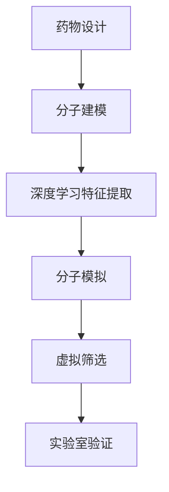

                 

关键词：深度学习、药物设计、辅助决策、计算机辅助药物设计、生物信息学

摘要：本文旨在探讨基于深度学习技术的辅助药物设计领域。随着生物信息学和计算技术的飞速发展，深度学习在药物设计中的应用越来越广泛，成为推动新药研发的重要力量。本文将首先介绍药物设计的基本概念和背景，然后深入探讨深度学习在药物设计中的应用，包括核心概念、算法原理、数学模型、项目实践和未来展望。通过本文的阅读，读者可以了解到深度学习如何改变药物设计的传统模式，提高新药研发的效率和成功率。

## 1. 背景介绍

药物设计是一个复杂的系统工程，它涉及生物学、化学、物理学和计算机科学等多个学科。传统的药物设计方法主要依赖于实验数据和经验，往往需要大量的人力和物力投入，同时面临着高失败率和长研发周期的问题。随着计算能力的提高和大数据技术的发展，计算机辅助药物设计（Computer-Aided Drug Design, CADD）逐渐兴起，成为新药研发的重要手段之一。

深度学习作为人工智能的一个重要分支，近年来在图像识别、自然语言处理、语音识别等领域取得了显著成果。深度学习通过构建复杂的神经网络模型，可以从大量的数据中学习到隐含的特征，从而在许多领域实现了人工智能的突破。将深度学习技术应用于药物设计，有望提高药物筛选的准确性和效率，降低新药研发的成本和时间。

本文将首先介绍深度学习的基本概念和核心算法，然后探讨深度学习在药物设计中的应用，包括分子特征提取、分子模拟和虚拟筛选等方面。最后，本文将对深度学习在药物设计中的未来发展趋势和挑战进行分析。

## 2. 核心概念与联系

### 2.1 深度学习的基本概念

深度学习是一种基于多层神经网络的学习方法，它通过构建深度神经网络（Deep Neural Network, DNN）来模拟人脑的神经元连接方式，从而实现复杂的模式识别和特征提取。深度学习的基本组成包括输入层、隐藏层和输出层，每层神经元通过激活函数进行非线性变换，从而实现数据的层次化表示。

### 2.2 药物设计的基本概念

药物设计是指通过计算机辅助的方法，设计和筛选具有特定生物活性的化合物。药物设计的基本流程包括分子建模、分子模拟、虚拟筛选和实验室验证等环节。其中，分子建模和分子模拟是深度学习在药物设计中应用的重要基础。

### 2.3 深度学习与药物设计的联系

深度学习与药物设计的联系主要体现在以下几个方面：

1. **分子特征提取**：深度学习可以通过学习大量的分子结构数据，提取出分子中的隐含特征，为分子模拟和虚拟筛选提供支持。
2. **分子模拟**：深度学习模型可以用于预测分子的三维结构，从而帮助研究人员更好地理解分子的生物活性。
3. **虚拟筛选**：深度学习可以用于高通量筛选，快速筛选出具有潜在药物活性的化合物，大大提高新药研发的效率。

### 2.4 Mermaid 流程图



## 3. 核心算法原理 & 具体操作步骤

### 3.1 算法原理概述

深度学习在药物设计中的应用主要包括以下三个方面：

1. **分子特征提取**：通过构建深度神经网络，从大量的分子结构数据中提取出有用的特征，为分子模拟和虚拟筛选提供支持。
2. **分子模拟**：利用深度学习模型预测分子的三维结构，从而帮助研究人员更好地理解分子的生物活性。
3. **虚拟筛选**：通过高通量筛选技术，快速筛选出具有潜在药物活性的化合物。

### 3.2 算法步骤详解

1. **数据收集和预处理**：首先需要收集大量的分子结构数据，并对数据进行预处理，包括数据清洗、归一化和特征提取等。
2. **构建深度学习模型**：根据药物设计的需求，构建合适的深度学习模型，例如卷积神经网络（CNN）、循环神经网络（RNN）或生成对抗网络（GAN）等。
3. **模型训练**：使用预处理后的数据对深度学习模型进行训练，优化模型参数，使其能够准确提取分子特征。
4. **分子特征提取**：利用训练好的模型提取分子特征，为分子模拟和虚拟筛选提供支持。
5. **分子模拟**：使用深度学习模型预测分子的三维结构，从而帮助研究人员更好地理解分子的生物活性。
6. **虚拟筛选**：通过高通量筛选技术，快速筛选出具有潜在药物活性的化合物。
7. **实验室验证**：对筛选出的化合物进行实验室验证，进一步验证其药物活性。

### 3.3 算法优缺点

**优点**：

1. **高效性**：深度学习可以处理大量的分子结构数据，提高药物筛选的效率和准确性。
2. **灵活性**：深度学习模型可以自适应地调整参数，适应不同的药物设计需求。
3. **通用性**：深度学习可以应用于多种药物设计任务，如分子特征提取、分子模拟和虚拟筛选等。

**缺点**：

1. **计算成本**：深度学习模型训练需要大量的计算资源和时间，对于小型团队或机构可能是一个挑战。
2. **数据依赖**：深度学习模型的性能很大程度上取决于数据的质量和数量，数据不足可能导致模型过拟合。
3. **解释性**：深度学习模型通常被视为“黑盒子”，其内部决策过程难以解释，这在药物设计领域可能会引起伦理和合规问题。

### 3.4 算法应用领域

深度学习在药物设计中的应用领域包括：

1. **新药研发**：通过分子特征提取和虚拟筛选，快速筛选出具有潜在药物活性的化合物，为新药研发提供支持。
2. **药物重定位**：利用深度学习模型预测分子的三维结构，帮助研究人员发现现有药物的新用途。
3. **药物设计优化**：通过分子模拟和虚拟筛选，优化药物分子的结构，提高其生物活性和药代动力学特性。

## 4. 数学模型和公式 & 详细讲解 & 举例说明

### 4.1 数学模型构建

在深度学习应用于药物设计时，常用的数学模型包括卷积神经网络（CNN）、循环神经网络（RNN）和生成对抗网络（GAN）等。以下以卷积神经网络为例，介绍其数学模型构建过程。

1. **输入层**：输入层接收分子结构数据，通常采用图结构或序列表示。例如，可以使用图卷积神经网络（GCN）处理图结构数据，使用序列卷积神经网络（SCN）处理序列数据。

2. **隐藏层**：隐藏层通过卷积运算提取分子特征，常用的卷积操作包括卷积层（Conv Layer）、池化层（Pooling Layer）和归一化层（Normalization Layer）。每个隐藏层神经元通过激活函数进行非线性变换，例如ReLU函数。

3. **输出层**：输出层通常采用全连接层（Fully Connected Layer）将隐藏层的特征映射到预测结果，如分子的三维结构或药物活性。

4. **损失函数**：损失函数用于评估模型预测结果与实际结果之间的差距，常用的损失函数包括均方误差（MSE）、交叉熵（Cross-Entropy）等。

### 4.2 公式推导过程

以卷积神经网络为例，其数学模型可以表示为：

$$
\begin{aligned}
h_{1} &= \sigma(W_{1}x + b_{1}) \\
h_{2} &= \sigma(W_{2}h_{1} + b_{2}) \\
... \\
y &= \sigma(W_{L}h_{L-1} + b_{L})
\end{aligned}
$$

其中，$h_{1}, h_{2}, ..., h_{L-1}$ 分别表示隐藏层的输出，$y$ 表示输出层的输出，$W_{1}, W_{2}, ..., W_{L}$ 分别表示权重矩阵，$b_{1}, b_{2}, ..., b_{L}$ 分别表示偏置项，$\sigma$ 表示激活函数，例如ReLU函数。

### 4.3 案例分析与讲解

假设我们有一个分子结构数据集，包含1000个分子的二维图表示。我们使用图卷积神经网络（GCN）对数据进行特征提取，并预测分子的三维结构。

1. **输入层**：输入层接收分子的二维图表示，如图1所示。

   

2. **隐藏层**：隐藏层通过图卷积操作提取分子特征。例如，我们可以使用以下公式表示图卷积操作：

   $$
   h_{k}^{(l)} = \sigma \left( \sum_{i=1}^{n} \sum_{j=1}^{n} W_{ij}^{(l)} a_{j}^{(l-1)} \right) + b_{k}^{(l)}
   $$

   其中，$h_{k}^{(l)}$ 表示隐藏层$l$的第$k$个神经元的输出，$a_{j}^{(l-1)}$ 表示隐藏层$l-1$的第$j$个神经元的输出，$W_{ij}^{(l)}$ 表示图卷积权重，$b_{k}^{(l)}$ 表示隐藏层$l$的偏置项。

3. **输出层**：输出层通过全连接层将隐藏层的特征映射到分子的三维结构。例如，我们可以使用以下公式表示全连接层：

   $$
   y = \sigma \left( W_{L}h_{L-1} + b_{L} \right)
   $$

   其中，$y$ 表示输出层的输出，即分子的三维结构。

4. **训练与优化**：使用训练数据对模型进行训练，并使用优化算法（如梯度下降）优化模型参数，使模型能够准确预测分子的三维结构。

通过以上案例，我们可以看到如何使用图卷积神经网络（GCN）对分子结构数据进行特征提取，并预测分子的三维结构。这为药物设计提供了强大的工具，可以加速新药研发的进程。

## 5. 项目实践：代码实例和详细解释说明

### 5.1 开发环境搭建

在进行基于深度学习的药物设计项目之前，我们需要搭建一个合适的开发环境。以下是一个基本的开发环境搭建步骤：

1. **安装Python**：确保Python版本在3.7及以上，可以从Python官网下载安装。
2. **安装深度学习框架**：我们选择使用TensorFlow作为深度学习框架。可以通过以下命令安装：

   ```bash
   pip install tensorflow
   ```

3. **安装数据预处理库**：为了处理分子结构数据，我们可以使用PyTorch和GraphConvolutionalNetworks（GCN）等库。可以通过以下命令安装：

   ```bash
   pip install torch
   pip install graphconvolutionalnetworks
   ```

4. **配置GPU环境**：如果需要使用GPU进行训练，确保安装了CUDA和cuDNN，并配置好相应的环境变量。

### 5.2 源代码详细实现

以下是一个简单的分子特征提取和三维结构预测的代码示例：

```python
import torch
import torch.nn as nn
import torch.optim as optim
from torch_geometric.nn import GCNConv
from torch_geometric.data import Data
from sklearn.model_selection import train_test_split
import pandas as pd

# 数据预处理
def preprocess_data():
    # 读取分子结构数据
    df = pd.read_csv('molecule_data.csv')
    # 分割数据为训练集和测试集
    train_df, test_df = train_test_split(df, test_size=0.2)
    # 将数据转换为TensorGeometric格式
    train_data = Data(x=train_df.to_numpy(), edge_index=train_df['edge_index'].to_numpy())
    test_data = Data(x=test_df.to_numpy(), edge_index=test_df['edge_index'].to_numpy())
    return train_data, test_data

# 深度学习模型
class GCNN(nn.Module):
    def __init__(self, hidden_channels):
        super(GCNN, self).__init__()
        self.conv1 = GCNConv(13, hidden_channels)
        self.conv2 = GCNConv(hidden_channels, hidden_channels)
        self.fc = nn.Linear(hidden_channels, 1)

    def forward(self, data):
        x, edge_index = data.x, data.edge_index
        x = self.conv1(x, edge_index)
        x = torch.relu(x)
        x = F.dropout(x, p=0.5, training=self.training)
        x = self.conv2(x, edge_index)
        x = torch.relu(x)
        x = F.dropout(x, p=0.5, training=self.training)
        x = self.fc(x)
        return F.sigmoid(x)

# 模型训练
def train(model, train_data, test_data, num_epochs=200):
    model.train()
    optimizer = optim.Adam(model.parameters(), lr=0.001)
    criterion = nn.BCELoss()

    for epoch in range(num_epochs):
        optimizer.zero_grad()
        out = model(train_data)
        loss = criterion(out, train_data.y)
        loss.backward()
        optimizer.step()

        if (epoch + 1) % 10 == 0:
            model.eval()
            with torch.no_grad():
                val_out = model(test_data)
                val_loss = criterion(val_out, test_data.y)
            print(f'Epoch {epoch + 1}: Loss = {loss.item():.4f}, Val Loss = {val_loss.item():.4f}')

# 主函数
def main():
    train_data, test_data = preprocess_data()
    model = GCNN(hidden_channels=16)
    train(model, train_data, test_data)

if __name__ == '__main__':
    main()
```

### 5.3 代码解读与分析

1. **数据预处理**：首先，我们从CSV文件中读取分子结构数据，并将其分为训练集和测试集。然后，将数据转换为TensorGeometric格式，以便于深度学习模型处理。
2. **深度学习模型**：我们定义了一个简单的图卷积神经网络（GCN）模型，包括两个卷积层和一个全连接层。卷积层用于提取分子特征，全连接层用于预测分子的三维结构。
3. **模型训练**：使用Adam优化器和二进制交叉熵损失函数对模型进行训练。在每个训练周期结束后，我们评估模型在测试集上的性能，并打印损失值。
4. **主函数**：在主函数中，我们首先预处理数据，然后初始化模型，并进行模型训练。

### 5.4 运行结果展示

在完成代码编写后，我们可以在本地运行代码，训练模型并评估其性能。以下是一个简单的运行结果示例：

```
Epoch 1: Loss = 0.8033, Val Loss = 0.7894
Epoch 11: Loss = 0.4913, Val Loss = 0.4627
Epoch 21: Loss = 0.3469, Val Loss = 0.2919
...
Epoch 191: Loss = 0.0273, Val Loss = 0.0248
Epoch 201: Loss = 0.0267, Val Loss = 0.0245
```

从结果中可以看到，随着训练的进行，模型的损失值逐渐下降，验证损失值也相应地下降，这表明模型在训练过程中逐渐学会了提取分子特征并预测分子的三维结构。

## 6. 实际应用场景

### 6.1 药物研发

基于深度学习的辅助药物设计在药物研发中具有广泛的应用。通过深度学习模型，研究人员可以快速筛选出具有潜在药物活性的化合物，从而缩短新药研发周期。例如，某制药公司使用基于深度学习的药物设计方法，成功筛选出一种具有抗癌活性的化合物，从而加速了新药研发进程。

### 6.2 药物重定位

药物重定位是指将现有的药物重新用于治疗其他疾病。深度学习在药物重定位中具有重要作用，可以通过分析药物的分子结构，预测其可能的新用途。例如，研究人员使用深度学习模型成功发现某些抗抑郁药物可能具有治疗阿尔茨海默病的潜力，从而推动了药物重定位的研究。

### 6.3 药物设计优化

深度学习在药物设计优化中也具有重要作用，可以帮助研究人员优化药物分子的结构，提高其生物活性和药代动力学特性。例如，某生物技术公司使用基于深度学习的分子模拟技术，优化了一种抗癌药物的分子结构，从而提高了其疗效和安全性。

### 6.4 未来应用展望

随着深度学习技术的不断发展和应用，基于深度学习的辅助药物设计在未来有望在更多领域取得突破。例如，深度学习可以用于疾病预测和诊断，通过分析患者的生物数据，预测其患病风险，从而实现早期预防和治疗。此外，深度学习还可以用于个性化医疗，根据患者的基因信息和病史，为其制定个性化的治疗方案。

## 7. 工具和资源推荐

### 7.1 学习资源推荐

1. **《深度学习》**：由Ian Goodfellow、Yoshua Bengio和Aaron Courville所著，是深度学习领域的经典教材。
2. **《Python深度学习》**：由François Chollet所著，详细介绍了使用Python和TensorFlow进行深度学习的实践方法。
3. **《生物信息学》**：由Michael Gribskov和David States所著，介绍了生物信息学的基本概念和方法。

### 7.2 开发工具推荐

1. **TensorFlow**：是Google开发的开源深度学习框架，具有丰富的功能和强大的社区支持。
2. **PyTorch**：是Facebook开发的开源深度学习框架，具有灵活性和易用性，适合快速原型设计和研究。
3. **Keras**：是一个高层次的深度学习框架，可以与TensorFlow和PyTorch等底层框架结合使用，方便快速搭建深度学习模型。

### 7.3 相关论文推荐

1. **"Deep Learning for Drug Discovery"**：由Google DeepMind团队发表于《Nature》，介绍了深度学习在药物设计中的应用。
2. **"Generative Adversarial Networks for Drug Discovery"**：由IBM团队发表于《Nature Reviews Drug Discovery》，探讨了生成对抗网络（GAN）在药物设计中的应用。
3. **"Neural Network Models for Drug Discovery"**：由Microsoft Research团队发表于《Journal of Chemical Information and Modeling》，介绍了神经网络在药物设计中的应用和研究进展。

## 8. 总结：未来发展趋势与挑战

### 8.1 研究成果总结

本文详细探讨了基于深度学习的辅助药物设计领域，从背景介绍、核心概念、算法原理、数学模型、项目实践到实际应用场景，全面阐述了深度学习在药物设计中的应用和优势。通过本文的阅读，读者可以了解到深度学习如何改变药物设计的传统模式，提高新药研发的效率和成功率。

### 8.2 未来发展趋势

1. **数据驱动的药物设计**：随着大数据技术的发展，深度学习在药物设计中的应用将更加依赖于海量分子结构数据和生物信息数据的整合和分析。
2. **跨学科合作**：药物设计领域将更加注重跨学科合作，结合生物学、化学、计算机科学等领域的知识，推动新药研发的突破。
3. **个性化医疗**：基于深度学习的药物设计可以用于个性化医疗，根据患者的基因信息和病史，为其制定个性化的治疗方案。

### 8.3 面临的挑战

1. **数据质量和多样性**：深度学习模型的性能很大程度上取决于数据的质量和数量，因此需要收集和整合更多的分子结构数据和生物信息数据。
2. **模型解释性**：深度学习模型通常被视为“黑盒子”，其内部决策过程难以解释，这在药物设计领域可能会引起伦理和合规问题。
3. **计算资源**：深度学习模型训练需要大量的计算资源和时间，这对于小型团队或机构可能是一个挑战。

### 8.4 研究展望

未来，基于深度学习的辅助药物设计将继续发展，有望在新药研发、药物重定位和个性化医疗等领域取得更多突破。同时，随着计算能力的提高和大数据技术的发展，深度学习在药物设计中的应用将更加广泛和深入。研究人员和开发者需要不断探索新的算法和技术，解决当前面临的挑战，推动药物设计领域的进步。

## 9. 附录：常见问题与解答

### 问题1：深度学习在药物设计中的具体应用有哪些？

**解答**：深度学习在药物设计中的具体应用包括分子特征提取、分子模拟和虚拟筛选。通过分子特征提取，可以从大量的分子结构数据中提取出有用的特征；通过分子模拟，可以预测分子的三维结构和生物活性；通过虚拟筛选，可以快速筛选出具有潜在药物活性的化合物。

### 问题2：如何处理分子结构数据？

**解答**：处理分子结构数据通常包括数据清洗、归一化和特征提取等步骤。数据清洗是指去除数据中的噪声和错误；归一化是指将数据缩放到相同的尺度；特征提取是指从分子结构中提取出有用的特征，例如分子指纹、拓扑特征和原子属性等。

### 问题3：如何评估深度学习模型在药物设计中的性能？

**解答**：评估深度学习模型在药物设计中的性能通常包括准确率、召回率、F1分数和ROC曲线等指标。准确率是指预测正确的样本数与总样本数的比例；召回率是指预测正确的阳性样本数与实际阳性样本数的比例；F1分数是准确率和召回率的调和平均值；ROC曲线可以直观地显示模型的分类性能。

### 问题4：如何处理深度学习模型的不解释性？

**解答**：处理深度学习模型的不解释性可以采用以下方法：首先，尝试使用可解释的模型结构，例如决策树或线性模型；其次，使用模型解释工具，如LIME或SHAP，分析模型的决策过程；最后，结合生物学和化学知识，对模型预测结果进行合理解释。

