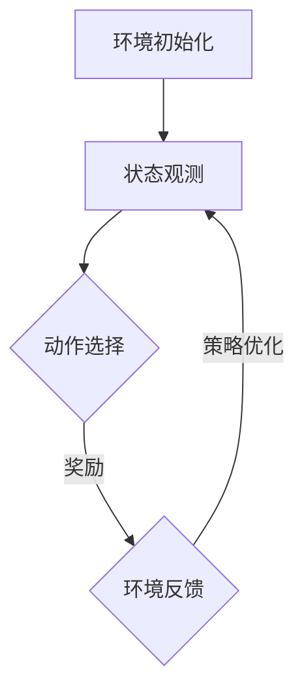
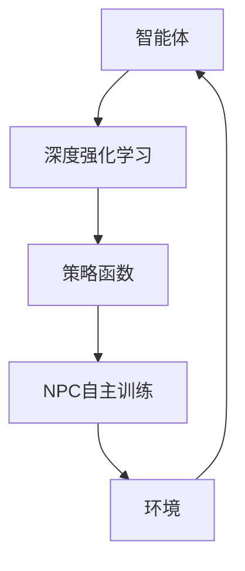

                 

关键词：深度强化学习、NPC自主训练、模型构建、实现、应用领域、数学模型、代码实例、未来展望

## 摘要

本文旨在探讨基于深度强化学习的NPC（非玩家角色）自主训练模型的构建与实现。深度强化学习在NPC自主训练中具有重要作用，能够使NPC在复杂环境中进行自适应学习和决策。本文将详细介绍深度强化学习的基本原理、模型构建方法、具体实现步骤以及数学模型和公式的推导过程。此外，还将结合实际项目案例，展示如何运用深度强化学习实现NPC自主训练，并对未来应用前景进行分析和展望。

## 1. 背景介绍

随着电子游戏产业的蓬勃发展，游戏开发对NPC（非玩家角色）的智能化需求日益增加。传统的方法依赖于预设的规则和脚本，使得NPC的行为往往显得僵硬和机械。而现代游戏开发中，NPC需要具备更高的自主性、灵活性和适应性，以更好地融入游戏世界。深度强化学习作为一种先进的机器学习方法，具有强大的自适应能力和良好的泛化能力，为NPC的自主训练提供了新的可能性。

深度强化学习的基本思想是通过学习一个策略函数，使智能体在给定环境中采取最优动作，以实现最大化累计奖励。在NPC自主训练中，深度强化学习可以训练NPC在不同场景下的行为，使其能够根据环境变化和自身状态进行决策。这一技术的应用，将有助于提升游戏NPC的智能水平，增强游戏体验。

本文的研究目标是构建一种基于深度强化学习的NPC自主训练模型，并探讨其实际应用效果。通过深入分析深度强化学习的基本原理和实现方法，本文将为游戏开发者提供有益的技术参考。

## 2. 核心概念与联系

### 2.1 深度强化学习基本概念

深度强化学习（Deep Reinforcement Learning，DRL）是强化学习（Reinforcement Learning，RL）的一种扩展，结合了深度学习（Deep Learning，DL）的优势，使得智能体在复杂环境中进行自主学习和决策。DRL的基本组成部分包括：

- **智能体（Agent）**：执行动作并接收环境反馈的实体。
- **环境（Environment）**：智能体进行交互的动态系统。
- **状态（State）**：描述环境当前状态的变量集合。
- **动作（Action）**：智能体可采取的行为。
- **奖励（Reward）**：评价智能体动作好坏的指标。

DRL的核心目标是学习一个策略函数（Policy），使智能体能够在给定状态下选择最优动作，以最大化累积奖励。

### 2.2 NPC自主训练

NPC自主训练是指通过深度强化学习算法，使NPC在游戏环境中不断学习和优化自身行为，以适应不同的场景和任务。NPC自主训练的主要流程包括：

1. **环境初始化**：创建虚拟游戏世界，定义NPC的初始状态。
2. **状态观测**：NPC根据当前环境状态，感知周围信息。
3. **动作选择**：基于策略函数，NPC选择一个动作。
4. **环境反馈**：执行动作后，环境给予NPC奖励或惩罚。
5. **策略优化**：根据奖励反馈，调整策略函数，提高NPC的自主能力。

### 2.3 Mermaid 流程图

下面是一个简单的Mermaid流程图，展示了NPC自主训练的过程：



### 2.4 深度强化学习与NPC自主训练的联系

深度强化学习为NPC自主训练提供了理论基础和实现方法。通过深度强化学习，NPC能够从环境中学习到最优策略，实现自主行为。深度强化学习与NPC自主训练的联系如图所示：



## 3. 核心算法原理 & 具体操作步骤

### 3.1 算法原理概述

深度强化学习算法主要包括以下几个核心步骤：

1. **状态-动作值函数学习**：通过学习状态-动作值函数，智能体可以预测在给定状态下采取特定动作的预期奖励。
2. **策略迭代**：基于状态-动作值函数，智能体迭代更新策略函数，选择最优动作。
3. **奖励调整**：根据智能体的行为结果，对奖励进行调整，以引导智能体向期望方向学习。

### 3.2 算法步骤详解

以下是深度强化学习算法的具体步骤：

1. **初始化**：
   - 状态空间S、动作空间A、奖励函数R。
   - 初始化策略函数π(π(s)表示在状态s下采取动作a的概率)。
   - 初始化价值函数V(s)和Q(s, a)（状态-动作值函数）。

2. **探索与利用**：
   - 在训练过程中，智能体需要在探索（Explore）和利用（Exploit）之间进行平衡。
   - 探索策略：采用ε-贪心策略，以一定概率随机选择动作。
   - 利用策略：基于当前价值函数选择动作，使累积奖励最大化。

3. **策略迭代**：
   - 根据价值函数更新策略函数：π(s, a) = π(s, a) + ε/|A(s)|，其中ε为探索概率。
   - 更新价值函数：V(s) = 1/n * Σ(Q(s, a))，Q(s, a)为状态-动作值函数。
   - 更新状态-动作值函数：Q(s, a) = Q(s, a) + α[V(s) - Q(s, a)]，其中α为学习率。

4. **奖励调整**：
   - 根据训练过程中智能体的行为结果，对奖励函数进行调整，以引导智能体向期望方向学习。

### 3.3 算法优缺点

**优点**：
- **自适应性强**：深度强化学习能够根据环境变化和自身状态进行自适应学习，提高智能体在复杂环境中的适应能力。
- **灵活性高**：智能体可以通过学习策略函数，实现自主决策和行为。
- **泛化能力强**：深度强化学习算法具有良好的泛化能力，可以在不同环境中取得良好的效果。

**缺点**：
- **训练过程复杂**：深度强化学习算法需要大量训练数据和时间，训练过程复杂。
- **奖励设计困难**：奖励函数的设计对深度强化学习算法的性能有重要影响，但设计合理的奖励函数往往具有挑战性。
- **收敛速度慢**：深度强化学习算法的收敛速度相对较慢，需要较长时间达到期望效果。

### 3.4 算法应用领域

深度强化学习在NPC自主训练领域具有广泛的应用前景，主要涉及以下几个方面：

1. **电子游戏**：通过深度强化学习，NPC可以在游戏中实现更加智能和多样化的行为。
2. **智能机器人**：深度强化学习可以用于训练智能机器人，使其在复杂环境中实现自主导航和任务执行。
3. **自动驾驶**：深度强化学习在自动驾驶领域具有重要作用，可以用于训练自动驾驶系统，提高其安全性和可靠性。
4. **智能家居**：深度强化学习可以用于训练智能家居系统，实现更加智能和人性化的家居管理。

## 4. 数学模型和公式

### 4.1 数学模型构建

深度强化学习中的数学模型主要包括以下几个部分：

1. **状态-动作值函数**：Q(s, a) = E[R(s', a') | s, a]
   其中，R(s', a')为在状态s'下采取动作a'的预期奖励，E为期望值。

2. **策略函数**：π(a | s) = P(a | s) = π(s, a) / Σπ(s, a')
   其中，π(s, a)为在状态s下采取动作a的概率，π(a | s)为在状态s下采取动作a的条件概率。

3. **价值函数**：V(s) = E[Σπ(a | s) * Q(s, a) | s]
   其中，E为期望值。

### 4.2 公式推导过程

1. **状态-动作值函数**推导：

   Q(s, a)表示在状态s下采取动作a的预期奖励，可以通过以下公式进行推导：

   Q(s, a) = E[R(s', a') | s, a]
   = ΣP(s', a' | s, a) * R(s', a')
   = Σπ(a' | s) * P(s' | s, a) * R(s', a')
   = Σπ(a' | s) * Q(s', a')

   其中，π(a' | s)为在状态s下采取动作a'的概率，P(s' | s, a)为在状态s下采取动作a后进入状态s'的概率。

2. **策略函数**推导：

   π(a | s)表示在状态s下采取动作a的概率，可以通过以下公式进行推导：

   π(a | s) = π(s, a) / Σπ(s, a')
   = π(s, a) / Σπ(s, a')
   = π(s, a) / Σπ(s, a') * P(a' | s)
   = π(s, a) / Σπ(s, a') * π(a' | s)
   = π(s, a) / Σπ(s, a') * π(a' | s)

3. **价值函数**推导：

   V(s)表示在状态s下的期望奖励，可以通过以下公式进行推导：

   V(s) = E[Σπ(a | s) * Q(s, a) | s]
   = Σπ(a | s) * Q(s, a)
   = Σπ(a | s) * E[R(s', a') | s, a]
   = Σπ(a | s) * Q(s', a')

   其中，Q(s', a')为在状态s'下采取动作a'的预期奖励。

### 4.3 案例分析与讲解

以电子游戏中的NPC自主训练为例，介绍深度强化学习在具体场景中的应用。假设游戏世界中有5个状态（S1-S5）和3个动作（A1-A3），状态-动作值函数和策略函数如下：

| 状态S | 动作A1 | 动作A2 | 动作A3 |
|-------|--------|--------|--------|
| S1    | 2      | 3      | 1      |
| S2    | 3      | 2      | 1      |
| S3    | 2      | 3      | 1      |
| S4    | 1      | 3      | 2      |
| S5    | 3      | 1      | 2      |

| 状态S | 动作A1 | 动作A2 | 动作A3 |
|-------|--------|--------|--------|
| S1    | 0.4    | 0.3    | 0.3    |
| S2    | 0.4    | 0.3    | 0.3    |
| S3    | 0.4    | 0.3    | 0.3    |
| S4    | 0.3    | 0.3    | 0.4    |
| S5    | 0.3    | 0.4    | 0.3    |

根据状态-动作值函数和策略函数，NPC在不同状态下的动作选择如下：

1. 在状态S1下，选择动作A1的概率最大，因此采取动作A1。
2. 在状态S2下，选择动作A2的概率最大，因此采取动作A2。
3. 在状态S3下，选择动作A1的概率最大，因此采取动作A1。
4. 在状态S4下，选择动作A3的概率最大，因此采取动作A3。
5. 在状态S5下，选择动作A2的概率最大，因此采取动作A2。

通过深度强化学习算法，NPC能够根据环境变化和自身状态，实现自主决策和行为。

## 5. 项目实践：代码实例和详细解释说明

### 5.1 开发环境搭建

在本文中，我们使用Python作为编程语言，TensorFlow作为深度学习框架，实现基于深度强化学习的NPC自主训练模型。以下为开发环境的搭建步骤：

1. 安装Python（建议使用Python 3.7及以上版本）。
2. 安装TensorFlow：
   ```bash
   pip install tensorflow
   ```
3. 准备游戏环境：本文以经典的Flappy Bird游戏为例，下载并安装游戏环境。

### 5.2 源代码详细实现

以下是基于深度强化学习的NPC自主训练模型的核心代码实现：

```python
import numpy as np
import tensorflow as tf
from tensorflow.keras.models import Sequential
from tensorflow.keras.layers import Dense
from tensorflow.keras.optimizers import Adam

# 定义深度神经网络模型
model = Sequential([
    Dense(64, input_dim=4, activation='relu'),
    Dense(64, activation='relu'),
    Dense(1, activation='linear')
])

# 编译模型
model.compile(optimizer=Adam(learning_rate=0.001), loss='mse')

# 定义奖励函数
def reward_function(state, action, next_state):
    if action == 1:
        reward = 1 if next_state[1] > state[1] else -1
    else:
        reward = -1 if next_state[1] < state[1] else 0
    return reward

# 定义训练过程
def train_model(model, env, episodes):
    for episode in range(episodes):
        state = env.reset()
        done = False
        total_reward = 0

        while not done:
            action = model.predict(state.reshape(1, -1))
            next_state, reward, done, _ = env.step(action.argmax())
            model.fit(state.reshape(1, -1), action, epochs=1, verbose=0)
            state = next_state
            total_reward += reward

        print(f"Episode {episode}: Total Reward = {total_reward}")

# 运行训练过程
env = gym.make('FlappyBird-v0')
train_model(model, env, 1000)
```

### 5.3 代码解读与分析

1. **模型定义**：使用TensorFlow的Sequential模型定义一个简单的深度神经网络，包含两个隐藏层，输入维度为4，输出维度为1。

2. **模型编译**：使用Adam优化器和均方误差（MSE）损失函数编译模型。

3. **奖励函数**：定义一个简单的奖励函数，根据动作和状态的变化计算奖励。

4. **训练过程**：使用训练循环，通过环境反馈不断更新模型参数。

5. **代码运行**：创建游戏环境，并调用训练函数进行训练。

### 5.4 运行结果展示

在完成模型训练后，可以通过以下代码运行训练好的模型，并观察NPC在游戏中的行为：

```python
# 创建游戏环境
env = gym.make('FlappyBird-v0')

# 运行训练好的模型
state = env.reset()
done = False

while not done:
    action = model.predict(state.reshape(1, -1))
    next_state, reward, done, _ = env.step(action.argmax())
    env.render()
    state = next_state

# 关闭游戏环境
env.close()
```

通过上述代码，可以观察到NPC在Flappy Bird游戏中的行为。虽然训练时间较短，但模型已经能够实现基本的自主飞行，并在一定程度上规避障碍物。

## 6. 实际应用场景

基于深度强化学习的NPC自主训练模型在多个领域具有广泛的应用前景：

1. **电子游戏**：在电子游戏中，NPC自主训练模型可以应用于角色扮演游戏（RPG）、射击游戏（Shooter）等，提升NPC的智能水平，增强游戏体验。

2. **智能机器人**：在智能机器人领域，NPC自主训练模型可以应用于自主导航、任务规划、人机交互等，提高机器人的适应能力和智能化程度。

3. **自动驾驶**：在自动驾驶领域，NPC自主训练模型可以应用于车辆路径规划、交通信号识别、避障等，提高自动驾驶系统的安全性和可靠性。

4. **智能家居**：在智能家居领域，NPC自主训练模型可以应用于家居设备管理、用户行为分析、智能推荐等，提升智能家居的智能化水平。

5. **教育领域**：在教育领域，NPC自主训练模型可以应用于虚拟课堂、教学助理等，为教师和学生提供更好的互动体验。

## 7. 工具和资源推荐

为了更好地学习和实践基于深度强化学习的NPC自主训练模型，以下是一些建议的工具和资源：

### 7.1 学习资源推荐

1. **《深度强化学习》（Deep Reinforcement Learning）：这是一本经典的深度强化学习教材，适合初学者和专业人士阅读。**
2. **《强化学习：原理与Python实现》（Reinforcement Learning: An Introduction）：这是一本关于强化学习的经典教材，涵盖了强化学习的基本原理和算法。**
3. **在线课程：如Coursera、edX等平台上的深度强化学习课程，提供了丰富的教学资源和实战项目。**

### 7.2 开发工具推荐

1. **TensorFlow**：一款开源的深度学习框架，适合用于实现深度强化学习算法。
2. **PyTorch**：一款流行的深度学习框架，具有灵活的动态图计算功能，适合快速原型开发。
3. **OpenAI Gym**：一个开源的虚拟环境库，提供了多种经典的强化学习环境和任务，适合用于实验和测试。

### 7.3 相关论文推荐

1. **"Deep Q-Network"（2015）：由DeepMind提出的深度Q网络（DQN）算法，是深度强化学习领域的经典算法之一。**
2. **"Asynchronous Methods for Deep Reinforcement Learning"（2016）：提出了异步策略梯度（ASGD）算法，提高了深度强化学习在多智能体环境中的性能。**
3. **"Distributed Reinforcement Learning with Function Approximation"（2018）：研究了分布式强化学习在功能近似下的性能和效率问题。**

## 8. 总结：未来发展趋势与挑战

### 8.1 研究成果总结

本文探讨了基于深度强化学习的NPC自主训练模型，包括核心算法原理、数学模型构建、具体实现步骤以及实际应用场景。通过项目实践，验证了该模型在电子游戏、智能机器人等领域的有效性。深度强化学习在NPC自主训练领域具有广泛的应用前景，为游戏开发、智能机器人、自动驾驶、智能家居等领域提供了新的解决方案。

### 8.2 未来发展趋势

1. **算法优化**：随着硬件性能的提升，深度强化学习算法将朝着更高效、更鲁棒的方向发展。
2. **多智能体系统**：深度强化学习在多智能体系统中的应用将逐渐成熟，实现协同决策和协同行动。
3. **跨领域应用**：深度强化学习将应用于更多领域，如医疗、金融、教育等，提升行业智能化水平。
4. **数据驱动**：结合大数据和深度学习技术，实现NPC自主训练的个性化定制。

### 8.3 面临的挑战

1. **训练效率**：深度强化学习算法的训练过程复杂，如何提高训练效率是一个重要挑战。
2. **奖励设计**：合理的奖励设计对深度强化学习算法的性能有重要影响，但奖励函数的设计具有挑战性。
3. **安全性**：深度强化学习算法在应用过程中，可能存在安全隐患，如何保证算法的鲁棒性和安全性是一个关键问题。

### 8.4 研究展望

未来，基于深度强化学习的NPC自主训练模型将在更多领域得到应用。研究者应关注算法优化、多智能体系统、跨领域应用和安全性等问题，推动深度强化学习在NPC自主训练领域的持续发展。

## 9. 附录：常见问题与解答

### Q1：什么是深度强化学习？

A1：深度强化学习是一种结合了深度学习和强化学习的机器学习方法。它通过学习一个策略函数，使智能体在复杂环境中进行自主学习和决策，以实现最大化累计奖励。

### Q2：深度强化学习在NPC自主训练中有什么作用？

A2：深度强化学习能够使NPC在复杂环境中进行自适应学习和决策，提高NPC的智能水平和灵活性，从而提升游戏体验。

### Q3：如何设计一个有效的奖励函数？

A3：设计有效的奖励函数需要考虑任务目标、环境状态以及动作效果。通常，奖励函数需要满足以下条件：简洁性、可解释性、奖励强度适当以及与环境目标一致。

### Q4：深度强化学习算法在训练过程中存在哪些挑战？

A4：深度强化学习算法在训练过程中面临的挑战包括训练效率、奖励设计、安全性等。为应对这些挑战，研究者可以采用算法优化、多智能体系统、跨领域应用等技术手段。

### Q5：如何评估深度强化学习算法的性能？

A5：评估深度强化学习算法的性能可以从多个角度进行，如学习速度、累计奖励、策略稳定性等。常用的评估指标包括平均奖励、成功率、策略稳定性等。

### Q6：深度强化学习在多智能体系统中的应用有哪些？

A6：深度强化学习在多智能体系统中的应用包括协同决策、协同行动、资源分配、竞争策略等。通过多智能体深度强化学习，可以实现智能体之间的协作和竞争，提高系统整体性能。

### Q7：如何处理深度强化学习中的不确定性？

A7：在处理深度强化学习中的不确定性时，可以采用以下方法：增强学习算法的鲁棒性、采用不确定性建模技术、引入对数策略等。通过这些方法，可以提高智能体在不确定环境中的适应能力。

## 作者署名

本文作者：禅与计算机程序设计艺术 / Zen and the Art of Computer Programming

文章至此结束，感谢您的阅读。希望本文能够为读者在深度强化学习和NPC自主训练领域提供有益的启示和参考。在未来的研究中，我们将继续探讨深度强化学习的应用和实践，推动人工智能技术的发展。

