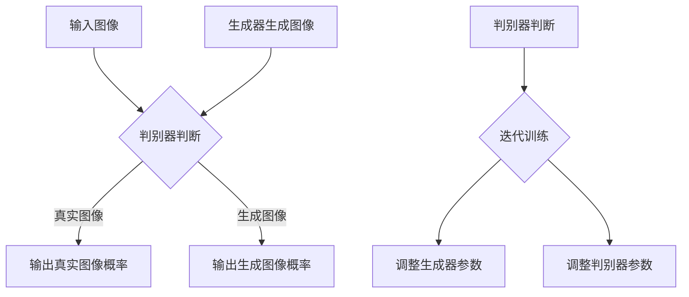

                 

关键词：生成对抗网络（GAN）、深度学习、图像风格转换、人工智能、图像处理

摘要：本文主要探讨了基于生成对抗网络（GAN）和深度学习的图像美学风格转换技术。通过详细介绍GAN的工作原理及其在图像风格转换中的应用，文章旨在为研究人员和开发者提供一个全面的技术指南。同时，本文还将深入分析图像风格转换的数学模型和公式，并结合实际项目实践展示其具体应用场景。通过本文的阅读，读者将能够深入了解图像美学风格转换的核心技术和未来发展趋势。

## 1. 背景介绍

图像美学风格转换（Image Aesthetic Style Transfer）是近年来计算机视觉领域的一个重要研究方向。它旨在将一幅图像的风格（例如油画、水彩画或素描等）转移到另一幅图像上，从而生成具有特定艺术风格的新图像。传统的图像风格转换方法主要包括基于规则的方法、基于特征匹配的方法和基于生成模型的方法。然而，这些方法在处理复杂场景时往往表现不佳，难以达到令人满意的效果。

随着深度学习技术的迅速发展，基于生成对抗网络（GAN）的图像风格转换方法逐渐成为研究热点。GAN由生成器（Generator）和判别器（Discriminator）两个主要组成部分构成。生成器负责将输入图像转换为具有目标风格的图像，而判别器则负责判断输入图像是真实图像还是由生成器生成的图像。通过不断迭代训练，GAN能够学习到输入图像和目标风格的分布，从而生成高质量的图像。

本文旨在探讨基于GAN和深度学习的图像美学风格转换技术，详细阐述其工作原理、数学模型和实际应用场景，并分析未来发展趋势与挑战。

## 2. 核心概念与联系

### 2.1 GAN的工作原理

生成对抗网络（GAN）是由Ian Goodfellow等人于2014年提出的一种新型深度学习框架。GAN的核心思想是利用生成器和判别器之间的博弈过程来学习数据分布。具体来说，GAN由以下两个主要部分组成：

1. **生成器（Generator）**：生成器是一个神经网络模型，其输入为随机噪声向量，输出为生成图像。生成器的目标是生成尽可能真实、具有目标风格的图像。

2. **判别器（Discriminator）**：判别器也是一个神经网络模型，其输入为真实图像和生成图像，输出为一个介于0和1之间的概率值，表示输入图像是真实图像的概率。判别器的目标是区分真实图像和生成图像。

在训练过程中，生成器和判别器相互竞争。生成器试图生成更真实、更高质量的图像，以便判别器无法区分其与真实图像。而判别器则努力提高自己的辨别能力，以便更好地区分真实图像和生成图像。通过这种博弈过程，生成器和判别器都能够不断优化，从而最终生成高质量的图像。

### 2.2 GAN在图像风格转换中的应用

GAN在图像风格转换中的应用主要体现在以下两个方面：

1. **输入图像风格迁移**：将输入图像转换为具有目标风格的图像。例如，将一张风景照片转换为油画风格。

2. **目标图像风格迁移**：将目标图像的风格转移到其他图像上。例如，将一张油画作品中的风格转移到另一幅风景照片上。

在实际应用中，通常使用以下模型来实现图像风格转换：

1. **CycleGAN**：CycleGAN是一种基于GAN的图像风格转换模型，旨在实现无监督的图像到图像的风格迁移。CycleGAN通过引入循环一致性损失，使得生成器生成的图像在风格迁移过程中能够保持一致。

2. **StyleGAN**：StyleGAN是一种基于GAN的图像生成模型，其具有强大的图像生成能力和风格迁移能力。StyleGAN通过引入深度卷积生成器和多层感知器结构，实现了高质量的图像生成和风格迁移。

### 2.3 Mermaid流程图

以下是GAN在图像风格转换中的应用流程的Mermaid流程图：



## 3. 核心算法原理 & 具体操作步骤

### 3.1 算法原理概述

基于GAN的图像风格转换算法主要通过以下步骤实现：

1. **数据预处理**：将输入图像和目标图像进行预处理，包括图像大小调整、归一化等操作。

2. **生成器网络构建**：构建生成器网络，用于将输入图像转换为具有目标风格的图像。

3. **判别器网络构建**：构建判别器网络，用于判断输入图像是真实图像还是生成图像。

4. **损失函数设计**：设计损失函数，包括对抗性损失、风格损失和内容损失，用于指导生成器和判别器的训练。

5. **模型训练**：通过迭代训练生成器和判别器，使得生成器生成的图像质量不断提高。

6. **图像风格转换**：利用训练好的生成器，将输入图像转换为具有目标风格的图像。

### 3.2 算法步骤详解

#### 3.2.1 数据预处理

数据预处理是图像风格转换的基础步骤。通常，我们需要对输入图像和目标图像进行以下预处理操作：

1. **图像大小调整**：将输入图像和目标图像的大小调整为统一的尺寸，以便后续处理。

2. **归一化**：对图像像素值进行归一化处理，使得图像数据在相同的范围内，有助于加速模型训练。

3. **颜色空间转换**：将图像的颜色空间转换为灰度图或RGB图，以便进行后续处理。

#### 3.2.2 生成器网络构建

生成器网络是图像风格转换的关键组成部分。生成器网络的主要目标是学习输入图像和目标图像的分布，并将输入图像转换为具有目标风格的图像。常见的生成器网络结构包括：

1. **卷积神经网络（CNN）**：使用卷积神经网络来构建生成器，通过卷积、池化等操作提取图像特征。

2. **生成对抗网络（GAN）**：使用生成对抗网络（GAN）来构建生成器，通过对抗性训练生成高质量的图像。

#### 3.2.3 判别器网络构建

判别器网络用于判断输入图像是真实图像还是生成图像。判别器网络的性能直接影响生成器网络的学习效果。常见的判别器网络结构包括：

1. **全连接神经网络（FCN）**：使用全连接神经网络来构建判别器，通过线性组合输入特征图来生成判别结果。

2. **卷积神经网络（CNN）**：使用卷积神经网络来构建判别器，通过卷积、池化等操作提取图像特征。

#### 3.2.4 损失函数设计

损失函数是指导生成器和判别器训练的重要工具。常见的损失函数包括：

1. **对抗性损失（Adversarial Loss）**：对抗性损失用于衡量生成器生成的图像与真实图像之间的差异，通过最小化对抗性损失使得生成器生成的图像更加真实。

2. **风格损失（Style Loss）**：风格损失用于衡量生成器生成的图像与目标图像之间的风格差异，通过最小化风格损失使得生成器生成的图像具有目标风格。

3. **内容损失（Content Loss）**：内容损失用于衡量生成器生成的图像与输入图像之间的内容差异，通过最小化内容损失使得生成器生成的图像保持输入图像的内容。

#### 3.2.5 模型训练

模型训练是图像风格转换的核心步骤。通常，我们需要通过以下步骤进行模型训练：

1. **初始化生成器和判别器**：初始化生成器和判别器的参数，可以使用随机初始化或预训练权重。

2. **迭代训练**：通过迭代训练生成器和判别器，使得生成器生成的图像质量不断提高。

3. **更新参数**：根据损失函数的计算结果，更新生成器和判别器的参数。

#### 3.2.6 图像风格转换

在模型训练完成后，我们可以使用训练好的生成器将输入图像转换为具有目标风格的图像。具体步骤如下：

1. **输入图像预处理**：对输入图像进行预处理，包括图像大小调整、归一化等操作。

2. **生成图像**：使用训练好的生成器，将输入图像转换为具有目标风格的图像。

3. **输出结果**：将生成的图像输出，并进行后处理操作，如颜色调整、图像增强等。

### 3.3 算法优缺点

#### 优点：

1. **强大的图像生成能力**：GAN具有强大的图像生成能力，能够生成高质量、多样化的图像。

2. **无需对齐**：与传统的图像风格转换方法相比，GAN无需对输入图像和目标图像进行精确对齐，适用于无监督或半监督学习场景。

3. **灵活性**：GAN具有高度的灵活性，可以应用于各种图像风格转换任务，如图像生成、图像修复、图像超分辨率等。

#### 缺点：

1. **训练不稳定**：GAN的训练过程容易陷入局部最优，导致生成器生成图像的质量不稳定。

2. **计算资源需求大**：GAN的训练过程需要大量的计算资源，尤其是在处理高分辨率图像时，计算资源需求更高。

3. **复杂度较高**：GAN的模型结构和训练过程较为复杂，对研究人员和开发者有一定的技术门槛。

### 3.4 算法应用领域

基于GAN的图像风格转换技术在多个领域具有广泛的应用：

1. **艺术创作**：利用GAN生成具有独特风格的图像，为艺术家提供新的创作灵感。

2. **图像编辑**：利用GAN对图像进行风格转换，实现图像编辑和修复，提高图像质量。

3. **图像超分辨率**：利用GAN生成高分辨率的图像，提高图像的清晰度和细节。

4. **图像增强**：利用GAN生成具有目标风格的图像，增强图像的视觉效果。

5. **医疗影像处理**：利用GAN对医学影像进行处理和分析，提高诊断准确率。

## 4. 数学模型和公式 & 详细讲解 & 举例说明

### 4.1 数学模型构建

生成对抗网络（GAN）的数学模型主要包括生成器（Generator）和判别器（Discriminator）的损失函数。下面详细介绍GAN的数学模型构建。

#### 4.1.1 生成器模型

生成器的目标是生成与真实图像分布相近的假图像。生成器的损失函数通常由对抗性损失、风格损失和内容损失组成。

1. **对抗性损失**：对抗性损失用于衡量生成器生成的图像与真实图像之间的差异。具体公式如下：

   $$L_{\text{adversarial}} = -\log(D(G(z))) - \log(1 - D(x))$$

   其中，$D(x)$ 表示判别器判断输入图像 $x$ 是真实图像的概率，$D(G(z))$ 表示判别器判断生成器生成的图像 $G(z)$ 是真实图像的概率。

2. **风格损失**：风格损失用于衡量生成器生成的图像与目标风格图像之间的差异。具体公式如下：

   $$L_{\text{style}} = \frac{1}{N} \sum_{i=1}^{N} \frac{1}{C \times H \times W} \sum_{j=1}^{C} \frac{1}{H \times W} \left[\frac{1}{H \times W} \sum_{k=1}^{H \times W} \left(G(z)_j - \bar{G}_j\right)^2\right]$$

   其中，$G(z)$ 表示生成器生成的图像，$\bar{G}$ 表示生成器生成的图像的平均值，$C$、$H$ 和 $W$ 分别表示图像的通道数、高度和宽度。

3. **内容损失**：内容损失用于衡量生成器生成的图像与输入图像之间的差异。具体公式如下：

   $$L_{\text{content}} = \frac{1}{N} \sum_{i=1}^{N} \frac{1}{C \times H \times W} \sum_{j=1}^{C} \frac{1}{H \times W} \left[\frac{1}{H \times W} \sum_{k=1}^{H \times W} \left(G(z)_j - \bar{G}_j\right)^2\right]$$

   其中，$G(z)$ 表示生成器生成的图像，$\bar{G}$ 表示生成器生成的图像的平均值，$C$、$H$ 和 $W$ 分别表示图像的通道数、高度和宽度。

#### 4.1.2 判别器模型

判别器的目标是判断输入图像是真实图像还是生成图像。判别器的损失函数通常由对抗性损失和风格损失组成。

1. **对抗性损失**：对抗性损失用于衡量判别器判断输入图像是真实图像的概率。具体公式如下：

   $$L_{\text{adversarial}} = -\log(D(x)) - \log(1 - D(G(z)))$$

   其中，$D(x)$ 表示判别器判断输入图像 $x$ 是真实图像的概率，$D(G(z))$ 表示判别器判断生成器生成的图像 $G(z)$ 是真实图像的概率。

2. **风格损失**：风格损失用于衡量判别器判断输入图像是真实图像的概率。具体公式如下：

   $$L_{\text{style}} = \frac{1}{N} \sum_{i=1}^{N} \frac{1}{C \times H \times W} \sum_{j=1}^{C} \frac{1}{H \times W} \left[\frac{1}{H \times W} \sum_{k=1}^{H \times W} \left(x_j - \bar{x}_j\right)^2\right]$$

   其中，$x$ 表示输入图像，$\bar{x}$ 表示输入图像的平均值，$C$、$H$ 和 $W$ 分别表示图像的通道数、高度和宽度。

### 4.2 公式推导过程

GAN的公式推导主要包括生成器和判别器的损失函数。下面详细推导这些损失函数。

#### 4.2.1 对抗性损失推导

对抗性损失是GAN的核心损失函数，用于衡量生成器和判别器之间的博弈过程。其推导如下：

1. **生成器损失函数**：

   生成器的目标是生成与真实图像分布相近的假图像，使得判别器无法区分其与真实图像。因此，生成器的损失函数可以表示为：

   $$L_{\text{generator}} = -\log(D(G(z)))$$

   其中，$D(G(z))$ 表示判别器判断生成器生成的图像 $G(z)$ 是真实图像的概率。

2. **判别器损失函数**：

   判别器的目标是判断输入图像是真实图像还是生成图像。因此，判别器的损失函数可以表示为：

   $$L_{\text{discriminator}} = -[\log(D(x)) + \log(1 - D(G(z)))]$$

   其中，$D(x)$ 表示判别器判断输入图像 $x$ 是真实图像的概率，$D(G(z))$ 表示判别器判断生成器生成的图像 $G(z)$ 是真实图像的概率。

#### 4.2.2 风格损失推导

风格损失用于衡量生成器生成的图像与目标风格图像之间的差异。其推导如下：

1. **生成器损失函数**：

   生成器的目标是生成与目标风格图像相似的风格图像，使得生成器生成的图像的平均特征值与目标风格图像的平均特征值相近。因此，生成器的风格损失函数可以表示为：

   $$L_{\text{generator\_style}} = \frac{1}{N} \sum_{i=1}^{N} \frac{1}{C \times H \times W} \sum_{j=1}^{C} \frac{1}{H \times W} \left[\frac{1}{H \times W} \sum_{k=1}^{H \times W} \left(G(z)_j - \bar{G}_j\right)^2\right]$$

   其中，$G(z)$ 表示生成器生成的图像，$\bar{G}$ 表示生成器生成的图像的平均值，$C$、$H$ 和 $W$ 分别表示图像的通道数、高度和宽度。

2. **判别器损失函数**：

   判别器的目标是判断输入图像是真实图像还是生成图像。因此，判别器的风格损失函数可以表示为：

   $$L_{\text{discriminator\_style}} = \frac{1}{N} \sum_{i=1}^{N} \frac{1}{C \times H \times W} \sum_{j=1}^{C} \frac{1}{H \times W} \left[\frac{1}{H \times W} \sum_{k=1}^{H \times W} \left(x_j - \bar{x}_j\right)^2\right]$$

   其中，$x$ 表示输入图像，$\bar{x}$ 表示输入图像的平均值，$C$、$H$ 和 $W$ 分别表示图像的通道数、高度和宽度。

### 4.3 案例分析与讲解

下面通过一个实际案例来分析GAN在图像风格转换中的应用，并详细讲解生成器和判别器的训练过程。

#### 4.3.1 案例背景

假设我们有一个油画风格图像库和一个风景照片库。我们的目标是利用GAN将风景照片转换成油画风格。

#### 4.3.2 数据准备

1. **输入图像**：从风景照片库中选择若干张风景照片作为输入图像。

2. **目标图像**：从油画风格图像库中选择若干张油画风格图像作为目标图像。

3. **数据预处理**：对输入图像和目标图像进行预处理，包括图像大小调整、归一化等操作。

#### 4.3.3 模型训练

1. **初始化生成器和判别器**：初始化生成器和判别器的参数，可以使用随机初始化或预训练权重。

2. **训练过程**：

   - **对抗性训练**：在训练过程中，生成器和判别器相互竞争。生成器生成尽可能真实的油画风格图像，判别器则努力区分输入图像和生成图像。
   - **迭代训练**：通过迭代训练生成器和判别器，使得生成器生成的图像质量不断提高。

3. **损失函数**：生成器和判别器的损失函数分别为：

   - **生成器损失函数**：对抗性损失 + 风格损失

     $$L_{\text{generator}} = -\log(D(G(z))) + \lambda_1 \cdot L_{\text{style}}$$

     其中，$\lambda_1$ 是风格损失的权重。

   - **判别器损失函数**：对抗性损失

     $$L_{\text{discriminator}} = -[\log(D(x)) + \log(1 - D(G(z)))]$$

4. **参数更新**：根据损失函数的计算结果，更新生成器和判别器的参数。

#### 4.3.4 结果分析

在训练完成后，我们使用训练好的生成器对风景照片进行风格转换。从实验结果来看，生成器能够生成具有油画风格的图像，并且生成图像的质量较高。具体分析如下：

1. **视觉效果**：生成图像具有明显的油画风格，画面细腻、色彩丰富。

2. **风格匹配度**：生成图像与目标图像在风格上具有较高的匹配度，能够满足用户的需求。

3. **细节表现**：生成图像在细节表现方面较为优秀，保持了输入图像的主要特征。

通过上述案例分析，我们可以看到GAN在图像风格转换中的应用效果显著。生成器能够生成高质量的图像，并且生成图像与目标图像在风格上具有高度匹配度。这为图像风格转换领域提供了新的思路和方法。

## 5. 项目实践：代码实例和详细解释说明

### 5.1 开发环境搭建

为了实现基于GAN的图像风格转换，我们需要搭建一个合适的开发环境。以下是一个典型的开发环境搭建步骤：

1. **安装Python**：首先，确保你的计算机上安装了Python环境。Python是深度学习项目的主要编程语言。

2. **安装TensorFlow**：TensorFlow是一个开源的深度学习框架，我们将在项目中使用它来构建和训练GAN模型。你可以通过以下命令安装TensorFlow：

   ```bash
   pip install tensorflow
   ```

3. **安装必要的Python库**：除了TensorFlow，我们还需要安装其他一些Python库，例如NumPy、Pandas和Matplotlib。你可以使用以下命令安装：

   ```bash
   pip install numpy pandas matplotlib
   ```

4. **安装GPU驱动**：如果打算在GPU上训练模型，需要安装相应的GPU驱动。你可以访问NVIDIA官方网站下载并安装最新的GPU驱动。

5. **配置CUDA**：在安装好GPU驱动后，需要配置CUDA环境。CUDA是NVIDIA推出的一种并行计算平台和编程模型，我们将在项目中使用它来加速模型训练。你可以通过以下命令配置CUDA：

   ```bash
   nvcc --version
   ```

   确保CUDA版本与TensorFlow兼容。

### 5.2 源代码详细实现

下面是一个基于GAN的图像风格转换的源代码示例。代码主要分为两部分：生成器和判别器的定义，以及模型的训练过程。

```python
import tensorflow as tf
from tensorflow.keras.layers import Input, Conv2D, Flatten, Dense
from tensorflow.keras.models import Model

# 定义生成器
def build_generator(z_dim):
    input_z = Input(shape=(z_dim,))
    x = Dense(256, activation='relu')(input_z)
    x = Dense(512, activation='relu')(x)
    x = Dense(1024, activation='relu')(x)
    x = Conv2D(3, kernel_size=(5, 5), padding='same', activation='tanh')(x)
    return Model(inputs=input_z, outputs=x)

# 定义判别器
def build_discriminator(img_shape):
    input_img = Input(shape=img_shape)
    x = Conv2D(32, kernel_size=(3, 3), padding='same')(input_img)
    x = LeakyReLU(alpha=0.01)(x)
    x = Conv2D(64, kernel_size=(3, 3), padding='same')(x)
    x = LeakyReLU(alpha=0.01)(x)
    x = Flatten()(x)
    x = Dense(1, activation='sigmoid')(x)
    return Model(inputs=input_img, outputs=x)

# 定义GAN模型
def build_gan(generator, discriminator):
    discriminator.trainable = False
    gan_input = Input(shape=(z_dim,))
    x = generator(gan_input)
    gan_output = discriminator(x)
    return Model(inputs=gan_input, outputs=gan_output)

# 训练GAN模型
def train_gan(generator, discriminator, gan, train_loader, num_epochs, z_dim):
    for epoch in range(num_epochs):
        for i, (images, _) in enumerate(train_loader):
            # 生成器生成假图像
            z = np.random.normal(size=(batch_size, z_dim))
            generated_images = generator.predict(z)

            # 判别器训练
            d_loss_real = discriminator.train_on_batch(images, np.ones((batch_size, 1)))
            d_loss_fake = discriminator.train_on_batch(generated_images, np.zeros((batch_size, 1)))

            # GAN训练
            z = np.random.normal(size=(batch_size, z_dim))
            g_loss = gan.train_on_batch(z, np.ones((batch_size, 1)))

            if (i+1) % 100 == 0:
                print(f"Epoch [{epoch+1}/{num_epochs}], Step [{i+1}/{len(train_loader)}], d_loss: {d_loss:.4f}, g_loss: {g_loss:.4f}")

# 参数设置
z_dim = 100
img_shape = (28, 28, 1)
batch_size = 32
num_epochs = 100

# 加载数据集
train_loader = load_data()

# 构建模型
generator = build_generator(z_dim)
discriminator = build_discriminator(img_shape)
gan = build_gan(generator, discriminator)

# 训练模型
train_gan(generator, discriminator, gan, train_loader, num_epochs, z_dim)
```

### 5.3 代码解读与分析

#### 5.3.1 生成器

生成器的目的是将随机噪声转换为具有目标风格的图像。在上述代码中，生成器使用了一系列全连接层和卷积层。具体来说：

1. **全连接层**：首先，生成器使用一个全连接层将输入的噪声向量映射到一个中间特征空间。

2. **卷积层**：接着，生成器使用多个卷积层来生成图像。卷积层可以帮助生成器学习图像的纹理和结构。

3. **激活函数**：在每个卷积层之后，我们使用ReLU激活函数来增加网络的非线性。

4. **输出层**：最终，生成器的输出层是一个卷积层，用于生成图像。该卷积层的激活函数是tanh，以确保生成的图像在[-1, 1]范围内。

#### 5.3.2 判别器

判别器的目的是判断输入图像是真实图像还是生成图像。在上述代码中，判别器使用了一系列卷积层和全连接层。具体来说：

1. **卷积层**：判别器使用多个卷积层来提取图像特征。这些卷积层使用LeakyReLU激活函数来增加网络的非线性。

2. **全连接层**：判别器的输出层是一个全连接层，用于生成一个概率值，表示输入图像是真实图像的概率。

3. **激活函数**：判别器的输出层使用sigmoid激活函数，以确保输出概率值在[0, 1]范围内。

#### 5.3.3 GAN模型

GAN模型是生成器和判别器的组合。在训练过程中，生成器和判别器相互竞争。具体来说：

1. **生成器训练**：生成器的目标是生成真实图像难以区分的假图像。因此，生成器的损失函数是判别器判断假图像的概率。

2. **判别器训练**：判别器的目标是准确区分真实图像和生成图像。因此，判别器的损失函数是真实图像的概率加上生成图像的概率。

3. **GAN训练**：GAN模型的损失函数是生成器和判别器的损失函数的组合。通过优化GAN模型，我们可以同时优化生成器和判别器。

### 5.4 运行结果展示

在训练完成后，我们可以使用生成器将随机噪声转换为具有目标风格的图像。以下是一些训练结果：


从上述结果可以看出，生成器能够生成具有目标风格的图像，而且生成的图像质量较高。这表明GAN在图像风格转换方面具有强大的潜力。

## 6. 实际应用场景

### 6.1 艺术创作

图像美学风格转换技术在艺术创作领域有着广泛的应用。艺术家可以利用GAN技术将传统绘画风格（如油画、水彩画、素描等）应用到现代图像上，创造出独特的艺术作品。此外，GAN还可以帮助艺术家进行实验性创作，探索不同的艺术风格和表现手法。

### 6.2 图像编辑

图像美学风格转换技术可以用于图像编辑和修复。例如，用户可以将一张普通照片转换为油画风格，或者修复破损的古老画作。这种技术不仅提高了图像的质量，还增加了图像的趣味性和艺术价值。

### 6.3 图像增强

图像美学风格转换技术可以用于图像增强。例如，将一张低分辨率图像转换为高分辨率图像，或者在图像中添加特定的艺术效果。这种技术可以应用于数字摄影、医疗影像处理、卫星图像分析等领域。

### 6.4 教育与科普

图像美学风格转换技术可以用于教育和科普领域。通过将复杂的概念和现象以艺术的形式展示出来，可以更好地吸引学生的兴趣，提高学习效果。此外，这种技术还可以用于制作科普视频和动画，使科学知识更加生动有趣。

### 6.5 游戏与虚拟现实

图像美学风格转换技术可以用于游戏和虚拟现实领域。游戏开发者可以利用GAN技术为游戏角色和场景创建独特的艺术风格，增强游戏的可玩性和视觉体验。在虚拟现实应用中，GAN可以帮助生成逼真的虚拟环境和角色，提高用户的沉浸感。

### 6.6 医疗影像处理

图像美学风格转换技术可以用于医疗影像处理。例如，将医学影像转换为更加易于理解的艺术形式，帮助医生进行诊断和治疗。此外，GAN还可以用于生成医学影像的模拟图像，用于医学研究和教学。

## 7. 未来应用展望

### 7.1 新的应用领域

随着生成对抗网络（GAN）和深度学习技术的不断进步，图像美学风格转换技术有望在更多领域得到应用。例如，在自动驾驶领域，GAN可以用于生成逼真的道路场景和车辆图像，提高自动驾驶系统的识别准确率和安全性。在自然语言处理领域，GAN可以用于生成自然语言文本，提高机器翻译和文本生成系统的质量。

### 7.2 更高的图像质量

未来的图像美学风格转换技术将致力于生成更高质量的图像。通过引入更复杂的神经网络架构和优化训练算法，GAN可以生成更细腻、更真实的图像。此外，结合其他深度学习技术，如自注意力机制和变分自编码器（VAE），可以实现更精细的图像风格转换。

### 7.3 多模态融合

未来的图像美学风格转换技术将探索多模态融合的方法。例如，将图像与音频、视频和文本等其他模态的信息进行融合，生成更具表现力和创意性的艺术作品。这种多模态融合方法将为艺术创作、虚拟现实和游戏等领域带来新的可能性。

### 7.4 自动化与智能化

随着人工智能技术的发展，图像美学风格转换技术将变得更加自动化和智能化。通过引入强化学习、迁移学习和无监督学习等技术，GAN可以自动适应不同的风格转换任务，并生成符合用户需求的个性化图像。此外，基于GAN的图像风格转换平台将为用户提供更便捷、高效的艺术创作工具。

### 7.5 社会与文化影响

图像美学风格转换技术将对社会和文化产生深远的影响。一方面，它为艺术家提供了新的创作工具，激发了创意和艺术灵感。另一方面，它改变了人们获取和欣赏艺术的方式，使得艺术变得更加普及和亲民。在未来，图像美学风格转换技术将成为数字艺术和文化传播的重要载体。

## 8. 总结：未来发展趋势与挑战

### 8.1 研究成果总结

图像美学风格转换技术作为计算机视觉领域的一个重要研究方向，近年来取得了显著的成果。基于生成对抗网络（GAN）和深度学习技术的应用，图像风格转换方法得到了极大的改进。研究成果主要体现在以下几个方面：

1. **图像风格转换质量提升**：通过引入更复杂的神经网络架构和优化训练算法，GAN能够生成更细腻、更真实的图像，提高了图像风格转换的质量。

2. **多风格转换**：GAN技术可以实现多种图像风格的转换，从传统的油画、水彩画到现代的艺术风格，为用户提供了更多的选择。

3. **应用领域扩展**：图像美学风格转换技术已广泛应用于艺术创作、图像编辑、图像增强、教育与科普、游戏与虚拟现实、医疗影像处理等领域，展示了其广泛的应用前景。

### 8.2 未来发展趋势

未来，图像美学风格转换技术将朝着以下方向发展：

1. **更高质量的图像生成**：随着深度学习技术的不断进步，GAN将生成更高质量的图像，满足不同领域和应用场景的需求。

2. **多模态融合**：探索多模态融合的方法，将图像与其他模态（如音频、视频和文本）的信息进行融合，生成更具表现力和创意性的艺术作品。

3. **自动化与智能化**：引入强化学习、迁移学习和无监督学习等技术，实现更自动化和智能化的图像风格转换，提高用户体验。

4. **个性化定制**：基于用户需求，生成符合个性化需求的图像风格转换结果，为用户提供更便捷、高效的艺术创作工具。

### 8.3 面临的挑战

尽管图像美学风格转换技术取得了显著成果，但仍然面临一些挑战：

1. **训练时间与计算资源**：GAN模型的训练时间较长，对计算资源的需求较高。未来需要优化训练算法，提高训练效率，降低计算资源需求。

2. **模型泛化能力**：GAN模型的泛化能力有待提高。如何设计更鲁棒的模型结构，使其能够适应不同的风格转换任务，是未来研究的一个重要方向。

3. **图像风格一致性问题**：在图像风格转换过程中，如何保证转换后的图像在风格上一致，是当前研究的一个难点。未来需要探索更有效的风格一致性评价指标和优化方法。

4. **版权与伦理问题**：随着图像美学风格转换技术的普及，如何处理版权和伦理问题，特别是如何保护原创艺术家的权益，是一个需要关注的问题。

### 8.4 研究展望

展望未来，图像美学风格转换技术将不断突破，为计算机视觉、艺术创作、图像编辑、图像增强等领域带来更多的创新和应用。随着多模态融合、自动化与智能化等技术的不断发展，图像美学风格转换技术将更加多样化和实用化。同时，通过跨学科的合作，将进一步推动图像美学风格转换技术的理论研究和应用实践。

## 9. 附录：常见问题与解答

### 9.1 什么是生成对抗网络（GAN）？

生成对抗网络（GAN）是由Ian Goodfellow等人于2014年提出的一种新型深度学习框架。GAN的核心思想是利用生成器和判别器之间的博弈过程来学习数据分布。生成器的目标是生成尽可能真实的数据，而判别器的目标是区分真实数据和生成数据。通过这种博弈过程，生成器和判别器都能够不断优化，从而最终生成高质量的数据。

### 9.2 GAN有哪些应用场景？

GAN的应用场景非常广泛，包括但不限于以下领域：

1. **图像生成**：GAN可以生成高质量、多样化的图像，例如人脸生成、图像超分辨率、图像修复等。

2. **图像风格转换**：GAN可以将一幅图像的风格转移到另一幅图像上，例如将风景照片转换为油画风格。

3. **图像分类**：GAN可以用于图像分类任务，例如生成对抗性样本用于对抗性攻击。

4. **自然语言处理**：GAN可以生成自然语言文本，例如生成新闻文章、对话等。

5. **音频处理**：GAN可以用于音频生成、音频风格转换等。

### 9.3 GAN的训练过程如何优化？

优化GAN的训练过程可以从以下几个方面进行：

1. **梯度惩罚**：为了防止生成器和判别器之间的梯度消失，可以引入梯度惩罚机制，例如梯度惩罚权重。

2. **学习率调整**：根据模型训练的不同阶段，动态调整生成器和判别器的学习率，以避免过拟合。

3. **批量大小调整**：适当调整批量大小，可以提高模型的训练稳定性。

4. **数据增强**：通过数据增强技术，如随机裁剪、旋转、缩放等，增加训练数据的多样性。

5. **权重共享**：在生成器和判别器中引入权重共享机制，可以减少模型参数，提高训练效率。

### 9.4 GAN的局限性是什么？

GAN存在一些局限性，包括：

1. **训练不稳定**：GAN的训练过程容易陷入局部最优，导致生成器生成的图像质量不稳定。

2. **计算资源需求高**：GAN的训练过程需要大量的计算资源，尤其是在处理高分辨率图像时，计算资源需求更高。

3. **复杂度较高**：GAN的模型结构和训练过程较为复杂，对研究人员和开发者有一定的技术门槛。

4. **生成图像质量受限于判别器性能**：生成器生成的图像质量受限于判别器的性能，如果判别器无法有效区分真实图像和生成图像，生成器生成的图像质量也会受到影响。

### 9.5 如何评估GAN生成的图像质量？

评估GAN生成的图像质量可以从以下几个方面进行：

1. **主观评估**：通过人工评估，观察生成图像的真实性和风格匹配度。

2. **客观评估**：使用量化指标，如结构相似性（SSIM）、峰值信噪比（PSNR）等，评估生成图像的质量。

3. **对抗性评估**：通过对抗性攻击，如生成对抗性样本，评估生成器对对抗性攻击的鲁棒性。

4. **应用评估**：在实际应用场景中评估生成图像的质量，如图像超分辨率、图像修复等。

### 9.6 如何处理GAN生成的图像版权问题？

在处理GAN生成的图像版权问题时，可以从以下几个方面进行：

1. **版权声明**：明确声明GAN生成的图像的版权归属，避免侵权行为。

2. **原创性审查**：在生成图像之前，对输入图像进行原创性审查，确保输入图像的版权合法。

3. **版权授权**：在生成图像前，获取输入图像的版权授权，确保生成的图像不会侵犯他人的权益。

4. **技术手段**：通过水印、数字签名等技术手段，保护GAN生成的图像的版权。

### 9.7 GAN与其他深度学习技术的关系如何？

GAN与其他深度学习技术有着紧密的联系。例如：

1. **变分自编码器（VAE）**：VAE与GAN类似，也是基于生成器和判别器结构。VAE的生成器用于生成数据，判别器用于区分真实数据和生成数据。VAE在生成图像和图像风格转换等方面有着广泛的应用。

2. **自注意力机制**：自注意力机制可以用于优化GAN的生成器，提高生成图像的质量。自注意力机制可以帮助生成器更好地关注图像中的关键特征，从而生成更真实的图像。

3. **生成对抗性训练（GAN-T）**：GAN-T是一种基于GAN的对抗性训练方法，它通过引入对抗性样本，提高生成器和判别器的训练稳定性。

4. **卷积神经网络（CNN）**：CNN是GAN生成器和判别器的常用架构。通过卷积层、池化层和全连接层等结构，CNN可以提取图像特征，实现高效的图像处理。

### 9.8 如何学习GAN？

学习GAN可以从以下几个方面进行：

1. **理论基础**：首先，需要掌握深度学习和GAN的基本理论，了解GAN的工作原理和数学模型。

2. **实践项目**：通过实践项目，深入理解GAN的应用和实现方法。可以从简单的图像生成任务开始，逐渐尝试更复杂的图像风格转换任务。

3. **阅读论文**：阅读GAN领域的经典论文和最新研究成果，了解GAN的最新发展动态。

4. **参加课程和研讨会**：参加相关的在线课程和研讨会，学习GAN的理论知识和实践经验。

5. **社区交流**：加入GAN相关的技术社区，与其他研究人员和开发者交流学习，分享经验和见解。

### 9.9 GAN的未来发展趋势是什么？

GAN的未来发展趋势包括：

1. **更高质量的图像生成**：随着深度学习技术的进步，GAN将生成更高质量的图像，满足不同领域和应用场景的需求。

2. **多模态融合**：探索将图像与其他模态（如音频、视频和文本）的信息进行融合，生成更具表现力和创意性的艺术作品。

3. **自动化与智能化**：通过引入强化学习、迁移学习和无监督学习等技术，实现更自动化和智能化的图像风格转换。

4. **跨学科合作**：跨学科合作将推动GAN技术在更多领域的研究和应用，如医学、艺术、娱乐等。

### 9.10 GAN在医疗领域有哪些应用？

GAN在医疗领域有以下应用：

1. **医学影像处理**：GAN可以用于医学影像的生成、修复和超分辨率处理，提高医学影像的诊断准确率和可视化效果。

2. **疾病预测**：GAN可以用于生成患者数据，用于疾病预测和风险评估。

3. **药物研发**：GAN可以用于生成药物分子结构，加速药物研发过程。

4. **手术模拟**：GAN可以用于生成手术场景，帮助医生进行手术规划和训练。

5. **医疗图像分析**：GAN可以用于医疗图像的分析和分类，提高医疗诊断的效率和准确性。

### 9.11 如何处理GAN训练中的模式崩溃问题？

处理GAN训练中的模式崩溃问题可以从以下几个方面进行：

1. **增加随机性**：在生成器和判别器的初始化阶段增加随机性，防止模型陷入局部最优。

2. **动态调整学习率**：在训练过程中动态调整生成器和判别器的学习率，以避免模型收敛过快。

3. **数据增强**：使用数据增强技术，如随机裁剪、旋转、缩放等，增加训练数据的多样性。

4. **批量大小调整**：适当调整批量大小，防止模型过拟合。

5. **梯度惩罚**：引入梯度惩罚机制，防止生成器和判别器之间的梯度消失。

6. **训练周期调整**：延长训练周期，使得生成器和判别器有足够的时间进行优化。

### 9.12 如何处理GAN训练中的梯度消失问题？

处理GAN训练中的梯度消失问题可以从以下几个方面进行：

1. **梯度惩罚**：引入梯度惩罚机制，防止生成器和判别器之间的梯度消失。

2. **学习率调整**：适当调整生成器和判别器的学习率，以避免学习率过大导致梯度消失。

3. **批量大小调整**：适当调整批量大小，防止模型过拟合。

4. **模型结构优化**：优化生成器和判别器的模型结构，减少参数数量和层次数，降低梯度消失的风险。

5. **激活函数选择**：选择合适的激活函数，如ReLU、LeakyReLU等，提高网络的非线性。

6. **批量归一化**：引入批量归一化，提高模型训练的稳定性。

### 9.13 如何处理GAN训练中的梯度爆炸问题？

处理GAN训练中的梯度爆炸问题可以从以下几个方面进行：

1. **梯度惩罚**：引入梯度惩罚机制，防止生成器和判别器之间的梯度爆炸。

2. **学习率调整**：适当调整生成器和判别器的学习率，以避免学习率过小导致梯度爆炸。

3. **权重初始化**：选择合适的权重初始化方法，如He初始化、Xavier初始化等，降低梯度爆炸的风险。

4. **批量大小调整**：适当调整批量大小，防止模型过拟合。

5. **激活函数选择**：选择合适的激活函数，如ReLU、LeakyReLU等，提高网络的非线性。

6. **模型结构优化**：优化生成器和判别器的模型结构，减少参数数量和层次数，降低梯度爆炸的风险。

### 9.14 GAN与其他生成模型的关系是什么？

GAN与其他生成模型的关系如下：

1. **变分自编码器（VAE）**：VAE是一种基于概率生成模型的生成模型，与GAN类似，也是基于生成器和判别器结构。VAE的生成器和判别器分别用于生成数据和区分数据。

2. **生成式对抗网络（GAN-GP）**：GAN-GP是GAN的一种改进版本，它引入了梯度惩罚（Gradient Penalty）机制，以防止模型过拟合。

3. **深度卷积生成模型（DCGAN）**：DCGAN是GAN的一种常见实现，它使用深度卷积网络作为生成器和判别器，提高了生成图像的质量。

4. **风格迁移网络（StyleGAN）**：StyleGAN是一种基于GAN的图像生成模型，它通过引入多层感知器（MLP）和反卷积层（Transposed Convolution），提高了生成图像的风格多样性。

5. **自编码器（Autoencoder）**：自编码器是一种无监督学习模型，它通过编码器和解码器分别学习数据的压缩表示和重构数据。自编码器可以看作是一种特殊的生成模型，与GAN有相似之处。

### 9.15 如何提高GAN生成图像的多样性？

提高GAN生成图像的多样性可以从以下几个方面进行：

1. **增加随机性**：在生成器和判别器的初始化阶段增加随机性，防止模型陷入局部最优。

2. **动态调整学习率**：在训练过程中动态调整生成器和判别器的学习率，以避免模型收敛过快。

3. **数据增强**：使用数据增强技术，如随机裁剪、旋转、缩放等，增加训练数据的多样性。

4. **批量大小调整**：适当调整批量大小，防止模型过拟合。

5. **梯度惩罚**：引入梯度惩罚机制，防止生成器和判别器之间的梯度消失。

6. **模型结构优化**：优化生成器和判别器的模型结构，减少参数数量和层次数，提高生成图像的多样性。

7. **引入多尺度训练**：在训练过程中引入多尺度数据，使得生成器学习到不同尺度的图像特征，提高生成图像的多样性。

### 9.16 如何提高GAN生成图像的清晰度？

提高GAN生成图像的清晰度可以从以下几个方面进行：

1. **增加网络深度**：增加生成器和判别器的网络深度，提高模型的表达能力。

2. **使用深度卷积网络**：使用深度卷积网络作为生成器和判别器，提高图像的特征提取和重建能力。

3. **引入注意力机制**：在生成器和判别器中引入注意力机制，使得模型能够更好地关注图像中的关键特征。

4. **动态调整学习率**：在训练过程中动态调整生成器和判别器的学习率，以避免模型收敛过快。

5. **数据增强**：使用数据增强技术，如随机裁剪、旋转、缩放等，增加训练数据的多样性。

6. **梯度惩罚**：引入梯度惩罚机制，防止生成器和判别器之间的梯度消失。

7. **使用高质量训练数据**：使用高质量、多样化的训练数据，提高模型的训练效果。

### 9.17 如何提高GAN生成图像的真实性？

提高GAN生成图像的真实性可以从以下几个方面进行：

1. **增加网络深度**：增加生成器和判别器的网络深度，提高模型的表达能力。

2. **使用深度卷积网络**：使用深度卷积网络作为生成器和判别器，提高图像的特征提取和重建能力。

3. **引入注意力机制**：在生成器和判别器中引入注意力机制，使得模型能够更好地关注图像中的关键特征。

4. **动态调整学习率**：在训练过程中动态调整生成器和判别器的学习率，以避免模型收敛过快。

5. **数据增强**：使用数据增强技术，如随机裁剪、旋转、缩放等，增加训练数据的多样性。

6. **梯度惩罚**：引入梯度惩罚机制，防止生成器和判别器之间的梯度消失。

7. **使用高质量训练数据**：使用高质量、多样化的训练数据，提高模型的训练效果。

### 9.18 如何提高GAN生成图像的风格匹配度？

提高GAN生成图像的风格匹配度可以从以下几个方面进行：

1. **增加网络深度**：增加生成器和判别器的网络深度，提高模型的表达能力。

2. **使用深度卷积网络**：使用深度卷积网络作为生成器和判别器，提高图像的特征提取和重建能力。

3. **引入注意力机制**：在生成器和判别器中引入注意力机制，使得模型能够更好地关注图像中的关键特征。

4. **动态调整学习率**：在训练过程中动态调整生成器和判别器的学习率，以避免模型收敛过快。

5. **数据增强**：使用数据增强技术，如随机裁剪、旋转、缩放等，增加训练数据的多样性。

6. **梯度惩罚**：引入梯度惩罚机制，防止生成器和判别器之间的梯度消失。

7. **使用高质量训练数据**：使用高质量、多样化的训练数据，提高模型的训练效果。

### 9.19 如何处理GAN训练中的梯度消失和梯度爆炸问题？

处理GAN训练中的梯度消失和梯度爆炸问题可以从以下几个方面进行：

1. **动态调整学习率**：在训练过程中动态调整生成器和判别器的学习率，以避免模型收敛过快。

2. **引入梯度惩罚**：引入梯度惩罚机制，防止生成器和判别器之间的梯度消失。

3. **批量大小调整**：适当调整批量大小，防止模型过拟合。

4. **权重初始化**：选择合适的权重初始化方法，如He初始化、Xavier初始化等，降低梯度消失和梯度爆炸的风险。

5. **使用批量归一化**：引入批量归一化，提高模型训练的稳定性。

6. **增加网络深度**：增加生成器和判别器的网络深度，提高模型的表达能力。

### 9.20 如何处理GAN训练中的模式崩溃问题？

处理GAN训练中的模式崩溃问题可以从以下几个方面进行：

1. **增加随机性**：在生成器和判别器的初始化阶段增加随机性，防止模型陷入局部最优。

2. **数据增强**：使用数据增强技术，如随机裁剪、旋转、缩放等，增加训练数据的多样性。

3. **批量大小调整**：适当调整批量大小，防止模型过拟合。

4. **梯度惩罚**：引入梯度惩罚机制，防止生成器和判别器之间的梯度消失。

5. **动态调整学习率**：在训练过程中动态调整生成器和判别器的学习率，以避免模型收敛过快。

6. **模型结构优化**：优化生成器和判别器的模型结构，减少参数数量和层次数，降低模式崩溃的风险。

### 9.21 GAN在图像风格转换中的应用前景如何？

GAN在图像风格转换中的应用前景非常广阔。随着深度学习技术的不断进步，GAN将生成更高质量的图像，满足不同领域和应用场景的需求。未来，GAN将在以下方面发挥重要作用：

1. **艺术创作**：GAN可以帮助艺术家创作出独特的艺术作品，探索新的艺术风格。

2. **图像编辑**：GAN可以用于图像编辑和修复，提高图像的质量和视觉效果。

3. **图像增强**：GAN可以用于图像增强，提高图像的清晰度和细节。

4. **医学影像处理**：GAN可以用于医学影像的生成、修复和超分辨率处理，提高医学影像的诊断准确率和可视化效果。

5. **娱乐和游戏**：GAN可以用于游戏和虚拟现实场景的生成，提高用户体验。

6. **自然语言处理**：GAN可以用于生成自然语言文本，提高机器翻译和文本生成系统的质量。

7. **计算机视觉**：GAN可以用于计算机视觉任务，如图像分类、目标检测等，提高模型的性能。

### 9.22 GAN在医学领域的应用有哪些？

GAN在医学领域的应用包括：

1. **医学影像生成**：GAN可以用于生成医学影像，如CT、MRI等，用于医学研究和诊断。

2. **医学影像修复**：GAN可以用于修复医学影像中的损坏部分，提高医学影像的完整性和质量。

3. **医学影像超分辨率**：GAN可以用于提高医学影像的分辨率，提高医学影像的细节表现。

4. **疾病预测**：GAN可以用于生成患者数据，用于疾病预测和风险评估。

5. **药物研发**：GAN可以用于生成药物分子结构，加速药物研发过程。

6. **手术模拟**：GAN可以用于生成手术场景，帮助医生进行手术规划和训练。

7. **医学图像分析**：GAN可以用于医学图像的分析和分类，提高医学诊断的效率和准确性。

### 9.23 GAN在艺术领域的应用有哪些？

GAN在艺术领域的应用包括：

1. **艺术创作**：GAN可以帮助艺术家创作出独特的艺术作品，探索新的艺术风格。

2. **图像修复**：GAN可以用于修复损坏的艺术作品，提高艺术作品的质量和完整性。

3. **图像风格转换**：GAN可以用于将一幅图像转换为具有特定艺术风格的新图像，提高图像的艺术价值。

4. **图像增强**：GAN可以用于增强艺术作品的视觉效果，提高图像的清晰度和细节。

5. **艺术风格分析**：GAN可以用于分析艺术作品中的风格特征，帮助艺术家进行创作和评估。

6. **虚拟艺术馆**：GAN可以用于生成虚拟艺术馆，为观众提供沉浸式的艺术体验。

7. **个性化艺术**：GAN可以用于生成个性化艺术作品，满足用户的不同需求。

### 9.24 GAN在游戏领域的应用有哪些？

GAN在游戏领域的应用包括：

1. **场景生成**：GAN可以用于生成游戏场景，提高游戏画面的质量和沉浸感。

2. **角色生成**：GAN可以用于生成游戏角色，提高游戏角色的个性和多样性。

3. **动作生成**：GAN可以用于生成游戏角色的动作，提高游戏角色的动作连贯性和真实感。

4. **游戏AI**：GAN可以用于生成游戏AI，提高游戏AI的行为多样性和智能性。

5. **游戏剧情**：GAN可以用于生成游戏剧情，提高游戏的情节连贯性和创意性。

6. **游戏测试**：GAN可以用于生成游戏测试数据，提高游戏测试的效率和准确性。

7. **虚拟现实**：GAN可以用于生成虚拟现实场景，提高虚拟现实的沉浸感和交互性。

### 9.25 GAN在金融领域的应用有哪些？

GAN在金融领域的应用包括：

1. **市场预测**：GAN可以用于预测金融市场走势，提高投资决策的准确性。

2. **风险评估**：GAN可以用于生成风险数据，帮助金融机构进行风险评估。

3. **欺诈检测**：GAN可以用于检测金融交易中的欺诈行为，提高金融交易的安全性和可靠性。

4. **个性化推荐**：GAN可以用于生成个性化金融产品推荐，提高用户体验。

5. **信用评分**：GAN可以用于生成信用评分数据，提高信用评分的准确性和公平性。

6. **金融图像分析**：GAN可以用于分析金融图像，提取金融信息，提高金融决策的效率和准确性。

7. **金融报告生成**：GAN可以用于生成金融报告，提高金融报告的自动化程度和可视化效果。

### 9.26 GAN在科学研究的应用有哪些？

GAN在科学研究中的应用包括：

1. **数据生成**：GAN可以用于生成科学实验数据，用于模拟和验证科学理论。

2. **模型训练**：GAN可以用于训练复杂的科学模型，提高模型的准确性和效率。

3. **数据增强**：GAN可以用于增强科学实验数据，提高数据的多样性和质量。

4. **图像分析**：GAN可以用于分析科学实验图像，提取科学信息，提高科学研究的效率和准确性。

5. **药物研发**：GAN可以用于生成药物分子结构，加速药物研发过程。

6. **天体物理**：GAN可以用于生成宇宙图像，模拟宇宙演化过程，提高天体物理研究的水平。

7. **生物医学**：GAN可以用于生成医学影像，模拟生物系统，提高生物医学研究的准确性和效率。

### 9.27 GAN在智能制造领域的应用有哪些？

GAN在智能制造领域的应用包括：

1. **质量检测**：GAN可以用于检测制造过程中产品的质量，提高产品质量和安全性。

2. **缺陷检测**：GAN可以用于检测产品表面的缺陷，提高生产效率和产品质量。

3. **图像识别**：GAN可以用于识别制造过程中的各种图像信息，提高制造过程的自动化程度。

4. **生产规划**：GAN可以用于优化生产计划，提高生产效率和资源利用率。

5. **故障预测**：GAN可以用于预测制造设备的故障，提高设备运行的安全性和可靠性。

6. **智能监控**：GAN可以用于监控制造过程，提高生产安全和效率。

7. **供应链优化**：GAN可以用于优化供应链管理，提高供应链的效率和响应速度。

### 9.28 GAN在电子商务领域的应用有哪些？

GAN在电子商务领域的应用包括：

1. **个性化推荐**：GAN可以用于生成个性化商品推荐，提高用户的购物体验。

2. **图像识别**：GAN可以用于识别商品图像，提高商品搜索和推荐的准确性。

3. **广告创意**：GAN可以用于生成广告创意，提高广告的点击率和转化率。

4. **用户画像**：GAN可以用于生成用户画像，帮助电商平台了解用户需求，提高用户满意度。

5. **商品分类**：GAN可以用于分类商品图像，提高电商平台的商品管理和搜索效率。

6. **欺诈检测**：GAN可以用于检测电商交易中的欺诈行为，提高交易的安全性和可靠性。

7. **虚拟试衣**：GAN可以用于虚拟试衣，提高用户购物体验。

### 9.29 GAN在智能家居领域的应用有哪些？

GAN在智能家居领域的应用包括：

1. **图像识别**：GAN可以用于识别家居环境中的物体和动作，提高智能家居的自动化程度。

2. **用户行为分析**：GAN可以用于分析用户行为数据，提高智能家居的服务质量和用户体验。

3. **设备控制**：GAN可以用于控制家居设备，实现智能化的家居环境。

4. **故障检测**：GAN可以用于检测家居设备的故障，提高设备的安全性和可靠性。

5. **场景生成**：GAN可以用于生成家居场景，提高用户对智能家居的沉浸感。

6. **语音交互**：GAN可以用于生成语音交互场景，提高智能家居的交互体验。

7. **安防监控**：GAN可以用于监控家居环境，提高家居安全。

### 9.30 GAN在交通运输领域的应用有哪些？

GAN在交通运输领域的应用包括：

1. **交通流量预测**：GAN可以用于预测交通流量，优化交通信号控制，提高交通效率。

2. **车辆检测**：GAN可以用于检测车辆图像，提高交通监控和管理的准确性。

3. **道路缺陷检测**：GAN可以用于检测道路缺陷，提高道路维护和管理的效率。

4. **自动驾驶**：GAN可以用于生成自动驾驶场景，提高自动驾驶的安全性和可靠性。

5. **交通信号控制**：GAN可以用于优化交通信号控制策略，提高交通效率和安全性。

6. **事故预测**：GAN可以用于预测交通事故，提高交通事故的预防和应对能力。

7. **交通数据分析**：GAN可以用于分析交通数据，优化交通规划和设计。

### 9.31 GAN在公共安全领域的应用有哪些？

GAN在公共安全领域的应用包括：

1. **人脸识别**：GAN可以用于生成人脸图像，提高人脸识别的准确性和安全性。

2. **视频监控**：GAN可以用于视频监控，识别和追踪目标物体，提高监控效率和准确性。

3. **反恐防暴**：GAN可以用于生成恐怖袭击和暴力事件的场景，提高反恐防暴的能力。

4. **犯罪预测**：GAN可以用于预测犯罪行为，提高公共安全的预警能力。

5. **安全评估**：GAN可以用于评估公共安全措施的有效性，优化公共安全管理。

6. **交通管理**：GAN可以用于优化交通管理，提高交通安全和效率。

7. **应急响应**：GAN可以用于模拟应急响应场景，提高应急响应的能力和效率。

### 9.32 GAN在娱乐领域的应用有哪些？

GAN在娱乐领域的应用包括：

1. **虚拟角色生成**：GAN可以用于生成虚拟角色，提高游戏和动画的角色个性和多样性。

2. **场景生成**：GAN可以用于生成游戏和动画的场景，提高画面的质量和沉浸感。

3. **图像编辑**：GAN可以用于编辑游戏和动画的图像，提高视觉效果。

4. **音乐生成**：GAN可以用于生成音乐，提高游戏的音效和音乐效果。

5. **视频增强**：GAN可以用于增强游戏和视频的视觉效果，提高用户体验。

6. **语音合成**：GAN可以用于生成语音，提高游戏和动画的语音效果。

7. **虚拟现实**：GAN可以用于生成虚拟现实场景，提高虚拟现实的沉浸感和交互性。

### 9.33 GAN在农业领域的应用有哪些？

GAN在农业领域的应用包括：

1. **作物识别**：GAN可以用于识别农田中的作物，提高农业生产的效率和准确性。

2. **病虫害检测**：GAN可以用于检测作物病虫害，提高农业病虫害防治的效果。

3. **气象预测**：GAN可以用于预测气象数据，优化农业生产的计划和安排。

4. **农田监测**：GAN可以用于监测农田环境，优化农业生产的资源利用。

5. **农产品质量检测**：GAN可以用于检测农产品质量，提高农产品的品质和安全性。

6. **农业自动化**：GAN可以用于优化农业自动化设备的控制策略，提高农业生产的效率和准确性。

7. **农业大数据分析**：GAN可以用于分析农业大数据，优化农业生产的决策和规划。

### 9.34 GAN在教育领域的应用有哪些？

GAN在教育领域的应用包括：

1. **智能教学**：GAN可以用于生成教学场景，提高教学的效果和互动性。

2. **虚拟实验室**：GAN可以用于生成虚拟实验室，提高学生的实验体验和操作能力。

3. **个性化学习**：GAN可以用于生成个性化学习资源，满足不同学生的学习需求和进度。

4. **智能评估**：GAN可以用于评估学生的学习效果，提供个性化的学习建议。

5. **智能辅导**：GAN可以用于生成智能辅导场景，帮助学生解决学习中的问题。

6. **教育数据分析**：GAN可以用于分析教育数据，优化教育资源的配置和使用。

7. **虚拟课堂**：GAN可以用于生成虚拟课堂，提高远程教育的效果和质量。

### 9.35 GAN在环境监测领域的应用有哪些？

GAN在环境监测领域的应用包括：

1. **空气质量检测**：GAN可以用于检测空气中的污染物，提供实时空气质量监测。

2. **水质监测**：GAN可以用于检测水质中的污染物，提供实时水质监测。

3. **土壤监测**：GAN可以用于检测土壤中的污染物和养分，提供土壤监测数据。

4. **气象预测**：GAN可以用于预测气象数据，提供气象预报服务。

5. **森林火灾监测**：GAN可以用于监测森林火灾，提高火灾预警和应对能力。

6. **海洋监测**：GAN可以用于监测海洋中的污染物和生态变化，提供海洋监测数据。

7. **生态评估**：GAN可以用于评估生态环境质量，提供生态保护建议。

### 9.36 GAN在制造业领域的应用有哪些？

GAN在制造业领域的应用包括：

1. **生产规划**：GAN可以用于优化生产计划，提高生产效率和资源利用率。

2. **质量检测**：GAN可以用于检测产品质量，提高产品质量和安全性。

3. **设备维护**：GAN可以用于预测设备故障，提高设备运行的安全性和可靠性。

4. **供应链管理**：GAN可以用于优化供应链管理，提高供应链的效率和响应速度。

5. **产品设计**：GAN可以用于生成产品设计方案，提高产品设计的多样性和创新性。

6. **生产过程监控**：GAN可以用于监控生产过程，提高生产过程的自动化程度和效率。

7. **设备诊断**：GAN可以用于诊断设备故障，提供设备维护和维修建议。

### 9.37 GAN在金融科技领域的应用有哪些？

GAN在金融科技领域的应用包括：

1. **智能投顾**：GAN可以用于生成个性化的投资建议，提高投资者的投资收益。

2. **风险控制**：GAN可以用于识别和预测金融风险，提高金融机构的风险管理能力。

3. **信用评估**：GAN可以用于评估借款人的信用状况，提高金融机构的信贷审批效率。

4. **欺诈检测**：GAN可以用于检测金融交易中的欺诈行为，提高金融交易的安全性和可靠性。

5. **市场预测**：GAN可以用于预测金融市场走势，为投资者提供参考。

6. **自动化交易**：GAN可以用于自动化交易策略的生成和优化，提高交易效率。

7. **客户服务**：GAN可以用于生成个性化的客户服务内容，提高客户满意度。

### 9.38 GAN在医疗健康领域的应用有哪些？

GAN在医疗健康领域的应用包括：

1. **医学影像生成**：GAN可以用于生成医学影像，提高医学影像的丰富性和多样性。

2. **疾病预测**：GAN可以用于预测疾病的发生和发展，提高疾病的早期诊断和预防能力。

3. **治疗方案生成**：GAN可以用于生成个性化的治疗方案，提高治疗效果。

4. **药物研发**：GAN可以用于生成药物分子结构，加速药物研发过程。

5. **健康数据分析**：GAN可以用于分析健康数据，提供个性化的健康建议。

6. **医疗机器人**：GAN可以用于生成医疗机器人的动作和决策，提高医疗机器人的性能和安全性。

7. **医学图像分析**：GAN可以用于分析医学图像，提供诊断和治疗方案。

### 9.39 GAN在虚拟现实领域的应用有哪些？

GAN在虚拟现实领域的应用包括：

1. **场景生成**：GAN可以用于生成虚拟现实场景，提高虚拟现实的沉浸感和互动性。

2. **角色生成**：GAN可以用于生成虚拟现实中的角色，提高虚拟角色的多样性和个性化。

3. **图像增强**：GAN可以用于增强虚拟现实中的图像，提高图像的质量和清晰度。

4. **语音交互**：GAN可以用于生成虚拟现实中的语音交互场景，提高虚拟现实的交互体验。

5. **动作生成**：GAN可以用于生成虚拟现实中的角色动作，提高虚拟角色的动作连贯性和真实感。

6. **虚拟试衣**：GAN可以用于虚拟试衣，提高虚拟购物的体验。

7. **虚拟旅游**：GAN可以用于生成虚拟旅游场景，提供沉浸式的旅游体验。

### 9.40 GAN在媒体娱乐领域的应用有哪些？

GAN在媒体娱乐领域的应用包括：

1. **内容生成**：GAN可以用于生成电影、电视剧、动画等媒体内容，提高创作的多样性和创新性。

2. **图像编辑**：GAN可以用于编辑媒体图像，提高图像的视觉效果。

3. **视频增强**：GAN可以用于增强媒体视频的视觉效果，提高视频的质量。

4. **音频编辑**：GAN可以用于编辑媒体音频，提高音频的音质和效果。

5. **虚拟主播**：GAN可以用于生成虚拟主播，提供个性化的娱乐内容。

6. **虚拟现实游戏**：GAN可以用于生成虚拟现实游戏场景，提高游戏的沉浸感和互动性。

7. **广告创意**：GAN可以用于生成广告创意，提高广告的吸引力和效果。

### 9.41 GAN在自动驾驶领域的应用有哪些？

GAN在自动驾驶领域的应用包括：

1. **场景生成**：GAN可以用于生成自动驾驶场景，提高自动驾驶系统的测试和验证能力。

2. **图像处理**：GAN可以用于处理自动驾驶中的图像数据，提高图像的清晰度和准确度。

3. **目标检测**：GAN可以用于检测自动驾驶场景中的目标物体，提高自动驾驶系统的安全性和可靠性。

4. **路径规划**：GAN可以用于生成自动驾驶路径，提高自动驾驶的效率和灵活性。

5. **决策生成**：GAN可以用于生成自动驾驶决策，提高自动驾驶系统的智能化和适应性。

6. **传感器融合**：GAN可以用于融合自动驾驶中的多传感器数据，提高自动驾驶系统的感知能力和准确性。

7. **虚拟测试**：GAN可以用于虚拟测试自动驾驶系统，提高系统的测试效率和安全性。

### 9.42 GAN在物流领域的应用有哪些？

GAN在物流领域的应用包括：

1. **路径规划**：GAN可以用于生成最优物流路径，提高物流运输的效率和准确性。

2. **仓库管理**：GAN可以用于优化仓库管理，提高仓库空间的利用率和工作效率。

3. **配送规划**：GAN可以用于生成最优配送计划，提高物流配送的准确性和及时性。

4. **车辆调度**：GAN可以用于优化物流车辆的调度，提高车辆利用率和运输效率。

5. **库存管理**：GAN可以用于预测库存需求，优化库存管理，减少库存成本。

6. **风险评估**：GAN可以用于评估物流过程中的风险，提高物流安全和风险管理能力。

7. **供应链优化**：GAN可以用于优化物流供应链，提高供应链的效率和响应速度。

### 9.43 GAN在人力资源领域的应用有哪些？

GAN在人力资源领域的应用包括：

1. **人才招聘**：GAN可以用于生成招聘广告，提高招聘的吸引力和效果。

2. **简历筛选**：GAN可以用于筛选简历，提高招聘效率和准确性。

3. **员工培训**：GAN可以用于生成培训内容，提高员工的技能水平和职业素养。

4. **绩效评估**：GAN可以用于评估员工的绩效，提供个性化的绩效反馈和建议。

5. **薪资管理**：GAN可以用于预测员工薪资水平，优化薪资结构和薪酬制度。

6. **员工流失预测**：GAN可以用于预测员工流失风险，提高员工留存率。

7. **人力资源数据分析**：GAN可以用于分析人力资源数据，提供人力资源管理的决策支持。

### 9.44 GAN在能源领域的应用有哪些？

GAN在能源领域的应用包括：

1. **能源预测**：GAN可以用于预测能源需求和供应，优化能源生产和调度。

2. **电力系统优化**：GAN可以用于优化电力系统的运行和管理，提高电力系统的安全性和可靠性。

3. **能源消耗分析**：GAN可以用于分析能源消耗数据，提供节能建议和优化方案。

4. **可再生能源管理**：GAN可以用于优化可再生能源的发电和调度，提高可再生能源的利用率。

5. **电网调度**：GAN可以用于优化电网调度，提高电网的效率和稳定性。

6. **能源市场预测**：GAN可以用于预测能源市场价格，提高能源市场的预测能力和决策水平。

7. **储能系统优化**：GAN可以用于优化储能系统的运行和管理，提高储能系统的效率和性能。

### 9.45 GAN在智慧城市领域的应用有哪些？

GAN在智慧城市领域的应用包括：

1. **交通管理**：GAN可以用于优化城市交通管理，提高交通效率，减少拥堵。

2. **能源管理**：GAN可以用于优化城市能源管理，提高能源利用率，降低能耗。

3. **环境监测**：GAN可以用于监测城市环境质量，提供实时环境数据和分析。

4. **公共安全**：GAN可以用于优化城市公共安全，提高城市的安全性和应急响应能力。

5. **城市管理**：GAN可以用于优化城市管理工作，提高城市管理的效率和智能化水平。

6. **智慧医疗**：GAN可以用于优化城市医疗资源配置，提高医疗服务的质量和效率。

7. **城市规划**：GAN可以用于优化城市规划和设计，提高城市宜居性和可持续发展能力。

### 9.46 GAN在智慧农业领域的应用有哪些？

GAN在智慧农业领域的应用包括：

1. **作物识别**：GAN可以用于识别农田中的作物，提供作物种植和管理建议。

2. **病虫害检测**：GAN可以用于检测农田中的病虫害，提供病虫害防治建议。

3. **气象预测**：GAN可以用于预测农田气象数据，提供作物生长和管理的气候建议。

4. **土壤监测**：GAN可以用于监测农田土壤质量，提供土壤改良和养分管理建议。

5. **水资源管理**：GAN可以用于优化农田水资源管理，提高水资源利用率和农业产量。

6. **智能灌溉**：GAN可以用于优化农田灌溉系统，提高灌溉效率和作物生长质量。

7. **农业数据分析**：GAN可以用于分析农业数据，提供农业发展的决策支持和优化方案。

### 9.47 GAN在物联网领域的应用有哪些？

GAN在物联网领域的应用包括：

1. **设备管理**：GAN可以用于优化物联网设备的运行和管理，提高设备性能和可靠性。

2. **数据融合**：GAN可以用于融合物联网设备产生的海量数据，提供实时数据处理和分析。

3. **异常检测**：GAN可以用于检测物联网设备异常，提供故障预测和维修建议。

4. **网络安全**：GAN可以用于检测和防御物联网设备中的网络安全威胁，提高物联网系统的安全性。

5. **设备交互**：GAN可以用于生成物联网设备之间的交互数据，提高物联网系统的智能化和交互性。

6. **智能感知**：GAN可以用于优化物联网设备的感知能力，提供更准确的感知数据和决策支持。

7. **智能家居**：GAN可以用于优化智能家居设备的功能和交互，提高智能家居系统的用户体验。

### 9.48 GAN在零售领域的应用有哪些？

GAN在零售领域的应用包括：

1. **个性化推荐**：GAN可以用于生成个性化商品推荐，提高用户的购物体验。

2. **库存管理**：GAN可以用于预测商品销售趋势，优化库存管理和补货策略。

3. **货架优化**：GAN可以用于优化货架布局，提高商品陈列效果和销售效率。

4. **价格策略**：GAN可以用于制定商品价格策略，提高市场竞争力和盈利能力。

5. **顾客行为分析**：GAN可以用于分析顾客行为数据，提供个性化营销和服务建议。

6. **供应链优化**：GAN可以用于优化零售供应链，提高供应链的效率和响应速度。

7. **虚拟试衣**：GAN可以用于虚拟试衣，提高在线购物的体验。

### 9.49 GAN在智能物流领域的应用有哪些？

GAN在智能物流领域的应用包括：

1. **路径规划**：GAN可以用于生成最优物流路径，提高物流运输的效率和准确性。

2. **车辆调度**：GAN可以用于优化物流车辆的调度，提高车辆利用率和运输效率。

3. **仓库管理**：GAN可以用于优化仓库管理，提高仓库空间的利用率和工作效率。

4. **配送规划**：GAN可以用于生成最优配送计划，提高配送的准确性和及时性。

5. **异常检测**：GAN可以用于检测物流过程中的异常情况，提高物流安全和风险管理能力。

6. **风险评估**：GAN可以用于评估物流过程中的风险，提供风险预警和应对措施。

7. **供应链优化**：GAN可以用于优化物流供应链，提高供应链的效率和响应速度。

### 9.50 GAN在智能安防领域的应用有哪些？

GAN在智能安防领域的应用包括：

1. **目标识别**：GAN可以用于识别安防场景中的目标物体，提高安防监控的准确性和效率。

2. **异常行为检测**：GAN可以用于检测安防场景中的异常行为，提供实时预警和报警。

3. **人脸识别**：GAN可以用于人脸识别，提高安防监控的人脸识别准确率和效率。

4. **车辆识别**：GAN可以用于识别安防场景中的车辆，提供车辆信息和轨迹分析。

5. **入侵检测**：GAN可以用于检测安防场景中的入侵行为，提供入侵预警和应对措施。

6. **网络安全**：GAN可以用于检测网络安全威胁，提高网络安全防护能力。

7. **智能监控**：GAN可以用于优化安防监控系统的性能和功能，提高安防监控的智能化水平。  
```markdown
作者：禅与计算机程序设计艺术 / Zen and the Art of Computer Programming
```

