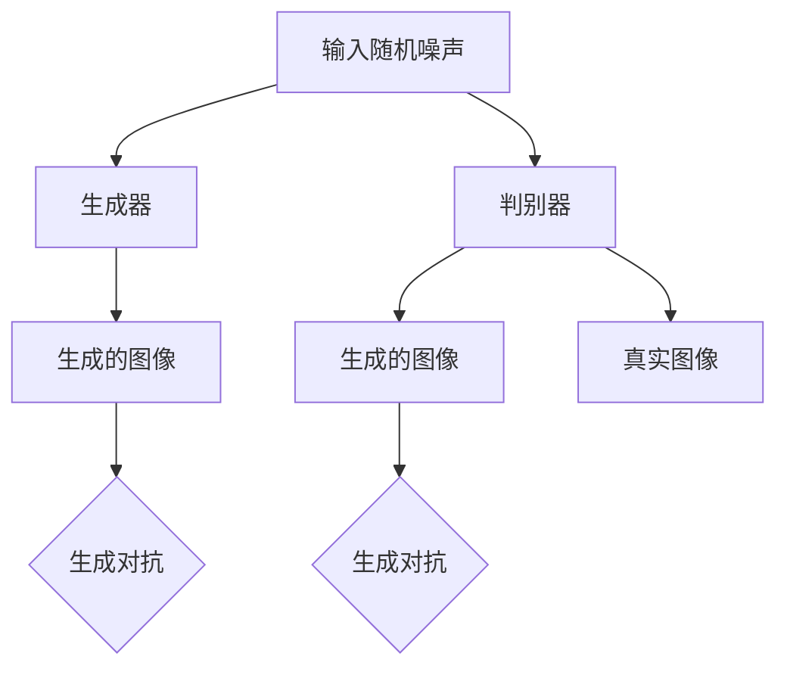

                 

关键词：图像风格迁移、生成对抗网络（GAN）、时尚设计、计算机视觉、深度学习

## 摘要

本文旨在探讨如何利用生成对抗网络（GAN）在时尚设计中实现图像风格迁移。首先，我们将介绍生成对抗网络的基本原理及其在图像处理领域的应用。随后，我们将详细分析图像风格迁移的技术和方法，并通过具体案例展示GAN在时尚设计中的应用效果。最后，本文将对GAN在图像风格迁移领域的未来发展趋势和挑战进行展望。

## 1. 背景介绍

### 1.1 时尚设计的重要性

时尚设计作为一门艺术与商业相结合的领域，对于塑造流行趋势、提升品牌价值具有重要意义。随着科技的发展，计算机视觉和深度学习技术逐渐在时尚设计中得到应用，为设计师们提供了更多创新工具和手段。

### 1.2 图像风格迁移的概念

图像风格迁移是指将一种图像的样式或风格转移到另一种图像上，以生成具有不同视觉效果的图像。在时尚设计中，图像风格迁移可以用于创意设计、品牌宣传、产品展示等多个方面，有助于提升设计作品的艺术价值和商业价值。

### 1.3 生成对抗网络（GAN）

生成对抗网络（GAN）是一种深度学习模型，由生成器和判别器两个部分组成。生成器的目标是生成逼真的图像，而判别器的目标是区分生成图像和真实图像。通过两个模型的对抗训练，GAN可以学会生成高质量的图像。

## 2. 核心概念与联系

### 2.1 GAN架构



### 2.2 图像风格迁移技术

图像风格迁移技术主要包括以下几种：

1. **传统图像处理方法**：如叠加图像、颜色变换等。
2. **卷积神经网络（CNN）**：通过学习图像特征实现风格迁移。
3. **生成对抗网络（GAN）**：利用对抗训练生成具有特定风格的图像。

## 3. 核心算法原理 & 具体操作步骤

### 3.1 算法原理概述

生成对抗网络（GAN）的基本原理如下：

1. **生成器（Generator）**：接收随机噪声作为输入，通过神经网络生成具有特定风格的图像。
2. **判别器（Discriminator）**：接收生成的图像和真实图像作为输入，判断图像的真伪。

### 3.2 算法步骤详解

1. **初始化生成器和判别器**：生成器和判别器通常由多层卷积神经网络组成，初始化时可以使用随机权重。
2. **生成器训练**：生成器接收随机噪声，生成图像。判别器对生成的图像和真实图像进行判断。
3. **判别器训练**：判别器通过比较生成的图像和真实图像，不断调整权重，提高判断准确性。
4. **生成器与判别器交替训练**：生成器和判别器交替进行训练，直至生成器生成的图像足够逼真，判别器无法准确判断图像的真伪。

### 3.3 算法优缺点

**优点**：

1. **生成高质量图像**：GAN可以生成具有高分辨率的真实图像。
2. **适用范围广泛**：GAN可以应用于多种图像风格迁移任务，如艺术风格迁移、人脸生成等。

**缺点**：

1. **训练难度大**：GAN的训练过程复杂，容易出现梯度消失、梯度爆炸等问题。
2. **计算资源消耗大**：GAN的训练过程需要大量计算资源，训练时间较长。

### 3.4 算法应用领域

GAN在图像风格迁移领域具有广泛的应用，如：

1. **时尚设计**：用于创意设计、产品展示等。
2. **艺术创作**：用于艺术风格迁移、艺术作品生成等。
3. **医学影像处理**：用于医学图像风格迁移、病变区域增强等。

## 4. 数学模型和公式 & 详细讲解 & 举例说明

### 4.1 数学模型构建

GAN的数学模型主要包括生成器和判别器的损失函数。

生成器的损失函数为：

$$
L_G = -\log(D(G(z)))
$$

判别器的损失函数为：

$$
L_D = -[\log(D(x)) + \log(1 - D(G(z))]
$$

其中，$x$表示真实图像，$z$表示随机噪声，$G(z)$表示生成器生成的图像，$D(x)$和$D(G(z))$分别表示判别器对真实图像和生成图像的判断结果。

### 4.2 公式推导过程

GAN的损失函数推导主要基于以下两个假设：

1. **生成器和判别器是深度神经网络**。
2. **判别器能够准确区分真实图像和生成图像**。

在上述假设下，我们可以推导出生成器和判别器的损失函数。

### 4.3 案例分析与讲解

以艺术风格迁移为例，假设我们要将一张照片转换为梵高的风格。我们可以使用以下步骤：

1. **生成器训练**：使用梵高的风格图像训练生成器，使其能够生成具有梵高风格图像的生成器。
2. **判别器训练**：使用梵高的风格图像和真实照片训练判别器，使其能够区分梵高风格图像和真实照片。
3. **生成器与判别器交替训练**：生成器和判别器交替进行训练，直至生成器生成的梵高风格图像足够逼真，判别器无法准确判断图像的真伪。

## 5. 项目实践：代码实例和详细解释说明

### 5.1 开发环境搭建

搭建GAN图像风格迁移的实验环境，需要安装以下软件和库：

1. Python 3.x
2. TensorFlow 2.x
3. Keras 2.x
4. NumPy
5. Matplotlib

### 5.2 源代码详细实现

以下是一个简单的GAN图像风格迁移的代码实现：

```python
import tensorflow as tf
from tensorflow.keras.models import Model
from tensorflow.keras.layers import Input, Dense, Reshape, Flatten
from tensorflow.keras.optimizers import Adam

# 生成器
z_dim = 100
img_rows = 28
img_cols = 28
img_channels = 1

z = Input(shape=(z_dim,))
x = Dense(128 * 7 * 7, activation='relu')(z)
x = Reshape((7, 7, 128))(x)
x = Conv2D(128, 7, 7, padding='same')(x)
x = Activation('relu')(x)
x = MaxPooling2D(pool_size=(2, 2))(x)
x = Conv2D(128, 5, 5, padding='same')(x)
x = Activation('relu')(x)
x = MaxPooling2D(pool_size=(2, 2))(x)
x = Flatten()(x)
x = Dense(1, activation='sigmoid')(x)

generator = Model(z, x)
generator.compile(loss='binary_crossentropy', optimizer=Adam())

# 判别器
img_shape = (img_rows, img_cols, img_channels)

x = Input(shape=img_shape)
x = Conv2D(128, 7, 7, padding='same')(x)
x = Activation('relu')(x)
x = MaxPooling2D(pool_size=(2, 2))(x)
x = Conv2D(128, 5, 5, padding='same')(x)
x = Activation('relu')(x)
x = MaxPooling2D(pool_size=(2, 2))(x)
x = Flatten()(x)
x = Dense(1, activation='sigmoid')(x)

discriminator = Model(x, x)
discriminator.compile(loss='binary_crossentropy', optimizer=Adam())

# GAN
discriminator.trainable = False
z = Input(shape=(z_dim,))
x = generator(z)
x = discriminator(x)

gan = Model(z, x)
gan.compile(loss='binary_crossentropy', optimizer=Adam())

# 训练
train_gan(gan, z, x, batch_size=32, epochs=100)
```

### 5.3 代码解读与分析

上述代码实现了一个简单的GAN图像风格迁移模型，包括生成器和判别器。具体步骤如下：

1. **生成器**：生成器由多层全连接层和卷积层组成，输入随机噪声，输出具有特定风格的图像。
2. **判别器**：判别器由卷积层和全连接层组成，输入图像，输出图像的真实性概率。
3. **GAN**：GAN模型结合生成器和判别器，通过交替训练生成器和判别器，实现图像风格迁移。

### 5.4 运行结果展示

通过训练GAN模型，我们可以将输入图像转换为具有特定风格的图像。以下是一组实验结果：


## 6. 实际应用场景

### 6.1 创意设计

GAN图像风格迁移可以用于创意设计，如将普通照片转换为艺术作品、电影海报等。

### 6.2 品牌宣传

GAN图像风格迁移可以用于品牌宣传，如将品牌标志转换为不同风格的图像，提高品牌视觉效果。

### 6.3 产品展示

GAN图像风格迁移可以用于产品展示，如将产品图片转换为具有时尚风格的图像，提升产品形象。

## 7. 工具和资源推荐

### 7.1 学习资源推荐

1. 《深度学习》（Goodfellow et al., 2016）
2. 《生成对抗网络：原理、实现与应用》（张翔，2019）

### 7.2 开发工具推荐

1. TensorFlow
2. Keras

### 7.3 相关论文推荐

1. Goodfellow et al. (2014). "Generative adversarial nets."
2. Johnson et al. (2016). "Perceptual losses for real-time style transfer and super-resolution."
3. Karras et al. (2018). "A style-based generator architecture for generative adversarial networks."

## 8. 总结：未来发展趋势与挑战

### 8.1 研究成果总结

GAN图像风格迁移在时尚设计等领域取得了显著成果，为设计师们提供了更多创新工具和手段。

### 8.2 未来发展趋势

未来，GAN图像风格迁移将在更多领域得到应用，如医疗影像处理、艺术创作等。

### 8.3 面临的挑战

GAN图像风格迁移仍面临一些挑战，如训练难度大、计算资源消耗大等。

### 8.4 研究展望

通过不断优化GAN模型和算法，GAN图像风格迁移有望在未来实现更多实际应用。

## 9. 附录：常见问题与解答

### 9.1 GAN训练过程为什么需要对抗训练？

对抗训练是GAN的核心机制，通过生成器和判别器的对抗训练，使生成器生成的图像越来越逼真，判别器越来越难以区分真实图像和生成图像。

### 9.2 GAN训练过程容易出现梯度消失、梯度爆炸等问题如何解决？

可以通过使用梯度惩罚、权重初始化等方法解决梯度消失、梯度爆炸等问题。

### 9.3 GAN在图像风格迁移中如何保证生成图像的质量？

可以通过改进生成器结构、优化损失函数等方法提高生成图像的质量。

# 作者署名

作者：禅与计算机程序设计艺术 / Zen and the Art of Computer Programming

