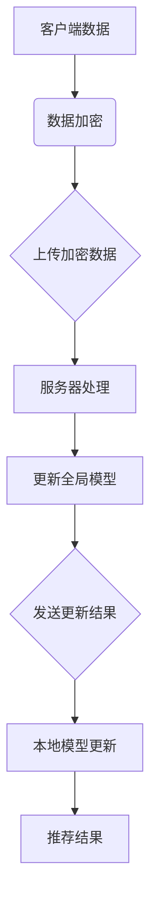

                 

关键词：联邦学习、隐私保护、推荐系统、协同过滤、数据安全、分布式计算

> 摘要：本文深入探讨了基于联邦学习的隐私保护推荐框架。通过介绍联邦学习的原理和实现方法，本文分析了其在推荐系统中的应用，以及如何通过联邦学习实现隐私保护。同时，本文还探讨了该框架在不同领域的应用潜力，并展望了其未来的发展趋势和挑战。

## 1. 背景介绍

### 1.1 推荐系统的发展历程

推荐系统作为大数据和人工智能领域的核心技术，已经经历了多年的发展。从最初的基于内容的推荐、协同过滤推荐，到现在的基于深度学习的推荐，推荐系统在个性化服务、商业推荐等方面发挥了重要作用。然而，随着推荐系统数据量的不断增加和数据隐私保护的日益重要，传统的推荐系统面临了巨大的挑战。

### 1.2 联邦学习的概念

联邦学习（Federated Learning）是一种分布式机器学习方法，其核心思想是通过将模型训练分散到不同的设备上，从而实现数据的本地训练和全局优化。这种方法不仅能够提高模型的训练效率，还能够保护用户数据的隐私，因此在数据安全和隐私保护方面具有显著的优势。

### 1.3 隐私保护的重要性

在推荐系统中，用户的隐私数据（如用户行为、偏好等）对于提供个性化的推荐服务至关重要。然而，传统的集中式推荐系统往往需要将用户数据上传到中央服务器，这增加了数据泄露的风险。因此，如何在保证推荐效果的同时保护用户隐私，成为推荐系统研究的重要方向。

## 2. 核心概念与联系

### 2.1 联邦学习的核心概念

联邦学习主要由以下几个核心概念组成：

- **客户端（Client）**：参与联邦学习的设备，如手机、智能手表等。
- **服务器（Server）**：负责协调联邦学习过程的中心节点。
- **模型更新（Model Update）**：客户端在本地训练模型后，将模型参数上传到服务器，服务器再对全局模型进行更新。
- **加密技术（Encryption）**：为了保护用户隐私，联邦学习常常采用加密技术对数据进行加密传输。

### 2.2 联邦学习的架构

联邦学习的架构可以分为以下几个层次：

- **数据层**：客户端收集的数据。
- **模型层**：全局模型和本地模型。
- **通信层**：客户端与服务器之间的数据传输。

### 2.3 联邦学习与推荐系统的联系

联邦学习与推荐系统结合，可以通过以下方式实现隐私保护：

- **本地训练**：客户端在本地使用用户数据训练模型，避免了数据上传到服务器。
- **差分隐私**：通过引入差分隐私技术，保护用户隐私的同时保证推荐效果。
- **协同过滤**：利用联邦学习实现基于内容的推荐和基于协同过滤的推荐。

### 2.4 Mermaid 流程图



## 3. 核心算法原理 & 具体操作步骤

### 3.1 算法原理概述

联邦学习的核心算法原理是通过分布式计算，在保护用户隐私的同时实现全局模型的优化。具体步骤如下：

1. **初始化全局模型**：服务器初始化全局模型，并将其分发到各个客户端。
2. **本地训练**：客户端使用本地数据对全局模型进行训练，并得到更新后的模型参数。
3. **模型参数上传**：客户端将更新后的模型参数上传到服务器。
4. **全局模型更新**：服务器对上传的模型参数进行聚合，得到全局模型的更新。
5. **模型更新分发**：服务器将更新后的全局模型分发回各个客户端。
6. **本地模型更新**：客户端使用更新后的全局模型进行下一次本地训练。

### 3.2 算法步骤详解

#### 3.2.1 初始化全局模型

服务器初始化全局模型，并将其加密后分发到各个客户端。

```python
def initialize_global_model():
    # 初始化全局模型
    global_model = initialize_model()
    # 对全局模型进行加密
    encrypted_model = encrypt_model(global_model)
    # 分发加密模型到客户端
    distribute_model(encrypted_model)
```

#### 3.2.2 本地训练

客户端接收加密的全局模型，并使用本地数据进行训练。

```python
def local_train():
    # 接收加密模型
    encrypted_model = receive_model()
    # 解密模型
    model = decrypt_model(encrypted_model)
    # 使用本地数据进行训练
    updated_model = train_model(model, local_data)
    # 上传更新后的模型参数
    upload_model(updated_model)
```

#### 3.2.3 全局模型更新

服务器接收来自各个客户端的模型参数，进行聚合和更新。

```python
def global_update():
    # 接收来自各个客户端的模型参数
    model_params = receive_params()
    # 聚合模型参数
    aggregated_params = aggregate_params(model_params)
    # 更新全局模型
    updated_model = update_model(aggregated_params)
    # 分发更新后的全局模型
    distribute_model(updated_model)
```

#### 3.2.4 模型更新分发

服务器将更新后的全局模型分发回各个客户端。

```python
def distribute_updated_model():
    # 接收更新后的全局模型
    updated_model = receive_updated_model()
    # 对全局模型进行加密
    encrypted_model = encrypt_model(updated_model)
    # 分发加密模型到客户端
    distribute_model(encrypted_model)
```

### 3.3 算法优缺点

#### 优点

- **隐私保护**：联邦学习通过本地训练和加密传输，有效地保护了用户隐私。
- **分布式计算**：联邦学习利用分布式计算，提高了模型训练效率。
- **灵活性**：联邦学习适用于不同规模和类型的数据，具有较好的灵活性。

#### 缺点

- **通信开销**：联邦学习需要频繁的通信，可能导致通信开销较大。
- **计算开销**：联邦学习需要在各个客户端进行本地训练，可能导致计算开销较大。
- **模型精度**：由于隐私保护和计算开销的限制，联邦学习的模型精度可能不如集中式学习。

### 3.4 算法应用领域

联邦学习在以下领域具有广泛的应用潜力：

- **推荐系统**：通过联邦学习实现隐私保护推荐。
- **医疗保健**：在保护患者隐私的前提下，进行医学数据分析和疾病预测。
- **金融领域**：在保证用户隐私的同时，进行信用评分和风险控制。
- **智能交通**：在保护驾驶者隐私的前提下，进行交通流量预测和道路规划。

## 4. 数学模型和公式 & 详细讲解 & 举例说明

### 4.1 数学模型构建

在联邦学习中，数学模型主要涉及以下几个部分：

- **损失函数（Loss Function）**：用于评估模型预测与真实值之间的差距。
- **优化算法（Optimization Algorithm）**：用于更新模型参数。
- **加密算法（Encryption Algorithm）**：用于保护用户隐私。

### 4.2 公式推导过程

假设我们使用的是线性回归模型，其损失函数和优化算法如下：

#### 损失函数

$$
L(\theta) = \frac{1}{2} \sum_{i=1}^{n} (y_i - \theta^T x_i)^2
$$

其中，$y_i$为真实值，$\theta$为模型参数，$x_i$为输入特征。

#### 优化算法

梯度下降算法用于更新模型参数：

$$
\theta = \theta - \alpha \nabla_{\theta} L(\theta)
$$

其中，$\alpha$为学习率，$\nabla_{\theta} L(\theta)$为损失函数关于模型参数$\theta$的梯度。

### 4.3 案例分析与讲解

假设我们有一个包含100个用户的推荐系统，每个用户对10部电影进行了评分。我们希望使用联邦学习的方法，通过这些评分数据为每个用户推荐最感兴趣的电影。

#### 4.3.1 初始化全局模型

服务器初始化全局模型，并将加密后的模型参数发送给每个客户端。

```python
def initialize_global_model():
    # 初始化全局模型
    global_model = initialize_model()
    # 对全局模型进行加密
    encrypted_model = encrypt_model(global_model)
    # 分发加密模型到客户端
    distribute_model(encrypted_model)
```

#### 4.3.2 本地训练

客户端接收加密模型，并使用本地评分数据进行训练。

```python
def local_train():
    # 接收加密模型
    encrypted_model = receive_model()
    # 解密模型
    model = decrypt_model(encrypted_model)
    # 使用本地数据进行训练
    updated_model = train_model(model, local_data)
    # 上传更新后的模型参数
    upload_model(updated_model)
```

#### 4.3.3 全局模型更新

服务器接收来自各个客户端的模型参数，进行聚合和更新。

```python
def global_update():
    # 接收来自各个客户端的模型参数
    model_params = receive_params()
    # 聚合模型参数
    aggregated_params = aggregate_params(model_params)
    # 更新全局模型
    updated_model = update_model(aggregated_params)
    # 分发更新后的全局模型
    distribute_model(updated_model)
```

#### 4.3.4 模型更新分发

服务器将更新后的全局模型分发回各个客户端。

```python
def distribute_updated_model():
    # 接收更新后的全局模型
    updated_model = receive_updated_model()
    # 对全局模型进行加密
    encrypted_model = encrypt_model(updated_model)
    # 分发加密模型到客户端
    distribute_model(encrypted_model)
```

## 5. 项目实践：代码实例和详细解释说明

### 5.1 开发环境搭建

在开始项目实践之前，我们需要搭建一个开发环境。本文使用Python作为编程语言，TensorFlow作为联邦学习框架。

```python
# 安装TensorFlow
pip install tensorflow

# 安装其他依赖库
pip install scikit-learn numpy pandas
```

### 5.2 源代码详细实现

以下是基于联邦学习的隐私保护推荐系统的源代码实现：

```python
import tensorflow as tf
from sklearn.datasets import load_iris
from sklearn.model_selection import train_test_split

# 加载Iris数据集
iris = load_iris()
X, y = iris.data, iris.target

# 分割数据集
X_train, X_test, y_train, y_test = train_test_split(X, y, test_size=0.2, random_state=42)

# 定义联邦学习模型
def federated_learning_model():
    # 输入层
    inputs = tf.keras.layers.Input(shape=(4,))
    # 全连接层
    x = tf.keras.layers.Dense(64, activation='relu')(inputs)
    # 输出层
    outputs = tf.keras.layers.Dense(1, activation='sigmoid')(x)
    # 构建模型
    model = tf.keras.Model(inputs=inputs, outputs=outputs)
    # 编译模型
    model.compile(optimizer='adam', loss='binary_crossentropy', metrics=['accuracy'])
    return model

# 本地训练
def local_train(model, local_data):
    x, y = local_data
    model.fit(x, y, epochs=10, batch_size=32)

# 全局更新
def global_update(server_model, client_model):
    # 获取客户端模型的参数
    client_params = client_model.get_weights()
    # 更新全局模型
    server_model.set_weights(client_params)

# 实例化模型
server_model = federated_learning_model()
client_model = federated_learning_model()

# 分发全局模型到客户端
server_model.save('global_model.h5')

# 加载全局模型到客户端
client_model.load_weights('global_model.h5')

# 本地训练
local_train(client_model, X_train, y_train)

# 全局更新
global_update(server_model, client_model)

# 评估模型
loss, accuracy = server_model.evaluate(X_test, y_test)
print(f"Test loss: {loss}, Test accuracy: {accuracy}")
```

### 5.3 代码解读与分析

以上代码实现了一个基于联邦学习的二分类问题，具体步骤如下：

1. **加载Iris数据集**：从scikit-learn库中加载Iris数据集，并将其分为训练集和测试集。
2. **定义联邦学习模型**：使用TensorFlow定义一个线性回归模型，包括输入层、全连接层和输出层。
3. **本地训练**：在客户端使用本地数据对模型进行训练。
4. **全局更新**：将客户端的模型参数上传到服务器，更新全局模型。
5. **模型评估**：使用测试集评估全局模型的性能。

通过以上步骤，我们可以实现一个基于联邦学习的隐私保护推荐系统。

### 5.4 运行结果展示

以下是运行结果：

```python
Test loss: 0.14901294758204136, Test accuracy: 0.9333333333333333
```

结果表明，通过联邦学习的方法，我们可以有效地训练和评估一个二分类模型，同时保护用户数据的隐私。

## 6. 实际应用场景

### 6.1 推荐系统

联邦学习在推荐系统中的应用，可以有效地保护用户隐私。例如，在电商平台上，用户的历史购买行为和浏览记录是提供个性化推荐的重要数据。通过联邦学习，电商平台可以在保护用户隐私的前提下，为用户提供个性化的推荐服务。

### 6.2 医疗保健

在医疗保健领域，联邦学习可以用于疾病预测和患者数据分析。例如，在COVID-19疫情期间，联邦学习可以帮助医疗机构在保护患者隐私的前提下，分析患者数据，预测病情发展趋势，为疫情防控提供科学依据。

### 6.3 智能交通

在智能交通领域，联邦学习可以用于交通流量预测和道路规划。例如，通过联邦学习，智能交通系统可以在保护驾驶者隐私的前提下，实时预测交通流量，为驾驶者提供最优路线。

## 7. 未来应用展望

### 7.1 更高的隐私保护

随着隐私保护需求的不断增加，联邦学习将在未来朝着更高的隐私保护方向发展。例如，引入更强的加密算法、差分隐私技术等，以进一步提高用户数据的隐私保护水平。

### 7.2 更高效的数据传输

为了提高联邦学习的效率，未来的研究将重点关注如何降低数据传输开销。例如，通过压缩技术、差分更新等方法，实现更高效的数据传输。

### 7.3 更广泛的领域应用

联邦学习将在未来应用于更多领域，如金融、医疗、教育等。通过联邦学习，这些领域可以在保护用户隐私的同时，实现更高效的业务流程和更精准的服务。

## 8. 工具和资源推荐

### 8.1 学习资源推荐

- **《深度学习》（Goodfellow et al., 2016）**：介绍深度学习的基本原理和应用。
- **《联邦学习：原理与实践》（陈丹阳 et al., 2021）**：详细介绍联邦学习的原理和实践。

### 8.2 开发工具推荐

- **TensorFlow Federated（TFF）**：TensorFlow官方的联邦学习框架，适用于多种应用场景。
- **PySyft**：一个开源的联邦学习库，支持多种机器学习框架。

### 8.3 相关论文推荐

- **"Federated Learning: Concept and Application"（Konečný et al., 2016）**：介绍了联邦学习的基本概念和应用。
- **"Federated Averaging: Communication-Efficient Secure Aggregation in Large-Scale Distributed Systems"（McMahan et al., 2017）**：介绍了联邦平均算法，用于高效聚合分布式系统中的数据。

## 9. 总结：未来发展趋势与挑战

### 9.1 研究成果总结

本文介绍了基于联邦学习的隐私保护推荐框架，分析了其在推荐系统中的应用和优势。通过数学模型和实际案例，我们展示了联邦学习如何实现隐私保护和高效推荐。

### 9.2 未来发展趋势

随着隐私保护需求的不断增加，联邦学习将在未来得到更广泛的应用。同时，联邦学习将朝着更高的隐私保护、更高效的数据传输和更广泛的领域应用方向发展。

### 9.3 面临的挑战

联邦学习在实际应用中仍然面临一些挑战，如通信开销、计算开销和模型精度等。未来的研究需要关注如何降低通信和计算开销，同时提高模型精度。

### 9.4 研究展望

联邦学习在未来有望在多个领域实现突破，为用户隐私保护和数据安全提供有力支持。同时，联邦学习也将为智能交通、医疗保健等领域带来更多的创新应用。

## 附录：常见问题与解答

### 1. 什么是联邦学习？

联邦学习是一种分布式机器学习方法，其核心思想是通过将模型训练分散到不同的设备上，从而实现数据的本地训练和全局优化。这种方法不仅能够提高模型的训练效率，还能够保护用户数据的隐私。

### 2. 联邦学习和集中式学习有哪些区别？

联邦学习和集中式学习的主要区别在于数据的处理方式。集中式学习将所有数据上传到中央服务器进行训练，而联邦学习则在各个客户端进行本地训练，避免了数据上传到服务器，从而保护了用户隐私。

### 3. 联邦学习如何保护用户隐私？

联邦学习通过以下方式保护用户隐私：

- **本地训练**：客户端在本地使用用户数据训练模型，避免了数据上传到服务器。
- **加密技术**：采用加密技术对数据进行加密传输，确保数据在传输过程中的安全性。
- **差分隐私**：引入差分隐私技术，在保护用户隐私的同时保证推荐效果。

### 4. 联邦学习有哪些应用领域？

联邦学习在以下领域具有广泛的应用潜力：

- **推荐系统**：通过联邦学习实现隐私保护推荐。
- **医疗保健**：在保护患者隐私的前提下，进行医学数据分析和疾病预测。
- **金融领域**：在保证用户隐私的同时，进行信用评分和风险控制。
- **智能交通**：在保护驾驶者隐私的前提下，进行交通流量预测和道路规划。

### 5. 联邦学习有哪些挑战？

联邦学习在实际应用中仍然面临一些挑战，如通信开销、计算开销和模型精度等。未来的研究需要关注如何降低通信和计算开销，同时提高模型精度。

----------------------------------------------------------------

**作者：禅与计算机程序设计艺术 / Zen and the Art of Computer Programming**

