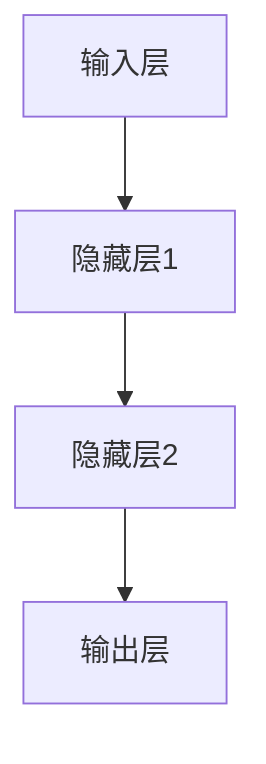
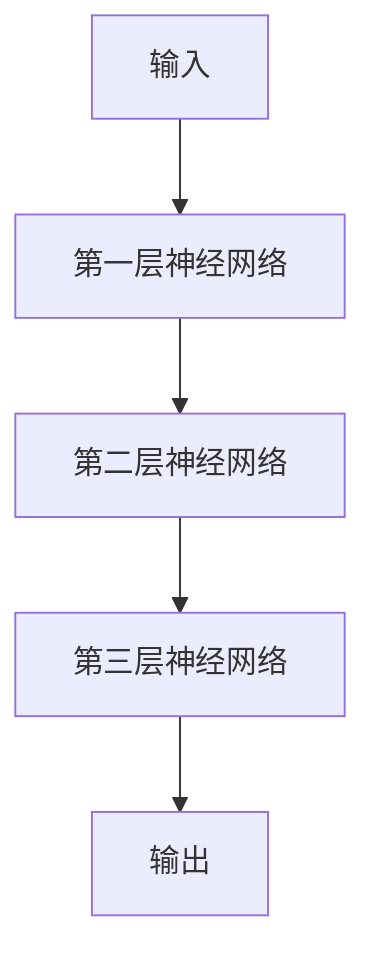
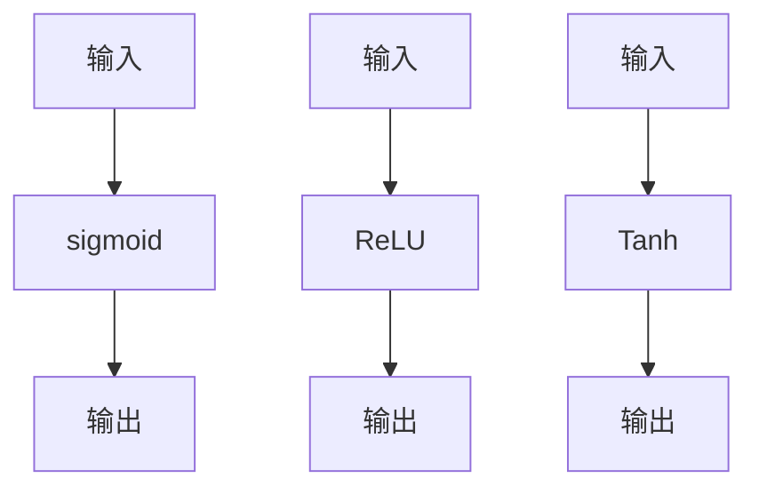
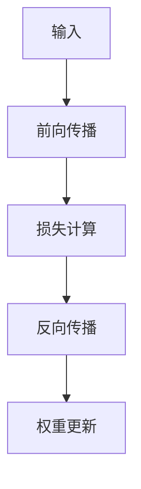
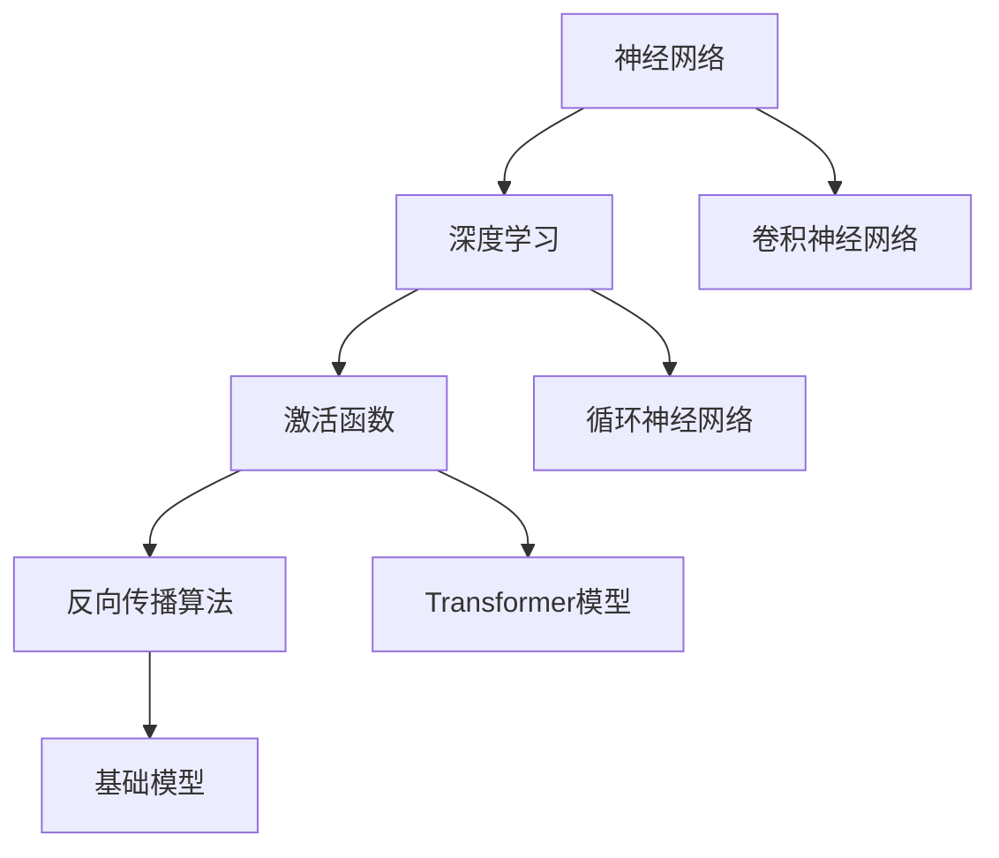

                 

关键词：基础模型，技术发展，AI，深度学习，神经网络，算法优化，数学模型，应用场景

## 摘要

本文旨在探讨基础模型在未来技术发展中的角色和影响。基础模型是人工智能领域的基石，它们在深度学习、神经网络和其他算法中的应用日益广泛。本文将介绍基础模型的核心概念和架构，分析其核心算法原理和操作步骤，展示数学模型和公式，并通过项目实践实例详细解释其应用。此外，还将探讨基础模型在实际应用场景中的表现，对未来的发展趋势和挑战进行展望，并提供相关的学习资源和工具推荐。

## 1. 背景介绍

随着计算机科学和人工智能技术的飞速发展，基础模型已经成为现代科技的核心驱动力。这些模型不仅构建了人工智能系统的框架，也为各种复杂任务提供了强大的算法支持。从早期的统计模型到现代的深度神经网络，基础模型的发展经历了多个阶段，每一次突破都带来了计算效率和性能的提升。

在人工智能领域，深度学习是当前最热门的研究方向之一。深度学习通过多层神经网络，模拟人脑神经元之间的连接，实现图像识别、语音识别、自然语言处理等复杂任务。而基础模型正是这些神经网络的核心组成部分，包括卷积神经网络（CNN）、循环神经网络（RNN）和Transformer模型等。这些模型不仅具有强大的数据处理能力，还能通过训练自动调整参数，实现高水平的任务表现。

## 2. 核心概念与联系

### 2.1 核心概念

在讨论基础模型之前，我们需要了解一些核心概念，包括神经网络、深度学习、激活函数和反向传播算法。

#### 神经网络

神经网络是由大量简单计算单元（即神经元）组成的复杂网络。每个神经元接收多个输入信号，通过权重进行加权求和，然后通过激活函数产生输出。神经网络的基本架构如图2.1所示。



#### 深度学习

深度学习是一种基于神经网络的机器学习方法，通过多层网络结构实现数据的高层次抽象。深度学习的核心思想是通过逐层学习，将输入数据映射到更高层次的特征表示，从而实现复杂任务。如图2.2所示。



#### 激活函数

激活函数是神经网络中用于引入非线性性的关键组件。常见的激活函数包括sigmoid、ReLU和Tanh。激活函数的作用是限制神经元的输出范围，使其能够产生明显的分类边界。如图2.3所示。



#### 反向传播算法

反向传播算法是深度学习中的核心训练方法。它通过计算损失函数关于网络参数的梯度，逐步调整权重，实现模型的优化。反向传播算法的基本步骤如图2.4所示。



### 2.2 核心联系

神经网络、深度学习、激活函数和反向传播算法是构成基础模型的核心要素，它们相互联系，共同作用。神经网络提供了层次化的结构，深度学习实现了数据的高层次抽象，激活函数引入了非线性变换，而反向传播算法实现了参数的优化。

下面是一个简单的Mermaid流程图，展示这些核心概念和算法之间的联系。



## 3. 核心算法原理 & 具体操作步骤

### 3.1 算法原理概述

基础模型的算法原理主要基于神经网络和深度学习。神经网络通过多层神经元实现数据的层次化表示，深度学习通过训练优化网络参数，实现复杂任务。激活函数引入非线性变换，提高模型的分类能力。反向传播算法通过梯度下降优化参数，实现模型优化。

### 3.2 算法步骤详解

#### 3.2.1 神经网络

神经网络的基本步骤包括：

1. **初始化参数**：随机初始化网络权重和偏置。
2. **前向传播**：输入数据通过网络，逐层计算输出。
3. **激活函数**：对中间层和输出层的神经元应用激活函数。
4. **损失计算**：计算输出层的损失函数，通常使用均方误差（MSE）。
5. **反向传播**：计算损失函数关于网络参数的梯度。
6. **权重更新**：根据梯度下降规则更新权重。

#### 3.2.2 深度学习

深度学习的基本步骤包括：

1. **数据预处理**：对输入数据进行标准化、归一化等处理。
2. **初始化模型**：构建多层神经网络，包括卷积层、全连接层等。
3. **前向传播**：输入数据通过网络，逐层计算输出。
4. **损失计算**：计算输出层的损失函数，如交叉熵。
5. **反向传播**：计算损失函数关于网络参数的梯度。
6. **权重更新**：根据梯度下降规则更新权重。

#### 3.2.3 激活函数

激活函数的基本步骤包括：

1. **输入计算**：计算神经元的输入值。
2. **激活函数**：应用激活函数，如ReLU、Sigmoid、Tanh。
3. **输出计算**：计算神经元的输出值。

#### 3.2.4 反向传播算法

反向传播算法的基本步骤包括：

1. **前向传播**：计算网络输出。
2. **损失计算**：计算损失函数。
3. **梯度计算**：计算损失函数关于网络参数的梯度。
4. **权重更新**：根据梯度下降规则更新权重。

### 3.3 算法优缺点

#### 优点

1. **强大的数据表示能力**：神经网络通过多层结构，实现数据的层次化表示，提高模型的表达能力。
2. **自动特征提取**：深度学习通过训练自动提取数据特征，减少人工特征工程。
3. **高泛化能力**：深度学习模型在大量数据训练下，具有良好的泛化能力。

#### 缺点

1. **计算复杂度高**：深度学习模型需要大量的计算资源，训练时间较长。
2. **数据需求大**：深度学习模型对数据量有较高要求，数据不足可能导致过拟合。
3. **模型解释性差**：深度学习模型通常具有黑盒性质，难以解释其决策过程。

### 3.4 算法应用领域

基础模型在多个领域得到广泛应用，包括：

1. **图像识别**：如人脸识别、物体检测等。
2. **语音识别**：如语音转文本、语音合成等。
3. **自然语言处理**：如文本分类、机器翻译等。
4. **推荐系统**：如商品推荐、新闻推荐等。
5. **游戏AI**：如棋类游戏、自动驾驶等。

## 4. 数学模型和公式 & 详细讲解 & 举例说明

### 4.1 数学模型构建

深度学习中的数学模型主要包括神经网络模型和损失函数。以下是这些模型的构建过程：

#### 神经网络模型

神经网络模型由多个层次组成，包括输入层、隐藏层和输出层。每个层次由多个神经元组成，神经元之间的连接通过权重进行调节。

1. **输入层**：输入层接收原始数据，每个神经元对应一个输入特征。
2. **隐藏层**：隐藏层通过多个神经元实现数据的层次化表示，每个神经元接收前一层神经元的输出。
3. **输出层**：输出层生成最终预测结果，每个神经元对应一个输出特征。

#### 损失函数

损失函数用于衡量模型预测结果与真实结果之间的差距，常见的损失函数包括均方误差（MSE）和交叉熵（Cross Entropy）。

1. **均方误差（MSE）**：MSE用于回归任务，计算预测值与真实值之间的平均平方误差。
   \[ \text{MSE} = \frac{1}{n} \sum_{i=1}^{n} (\hat{y}_i - y_i)^2 \]
   其中，\(\hat{y}_i\)为预测值，\(y_i\)为真实值。

2. **交叉熵（Cross Entropy）**：Cross Entropy用于分类任务，计算预测概率分布与真实概率分布之间的交叉熵。
   \[ \text{Cross Entropy} = -\sum_{i=1}^{n} y_i \log \hat{y}_i \]
   其中，\(y_i\)为真实标签，\(\hat{y}_i\)为预测概率。

### 4.2 公式推导过程

以下是神经网络和损失函数的公式推导过程。

#### 神经网络

1. **前向传播**：

   前向传播的过程可以表示为：
   \[ z_{j}^{(l)} = \sum_{i} w_{ji}^{(l)} a_{i}^{(l-1)} + b_{j}^{(l)} \]
   \[ a_{j}^{(l)} = \sigma(z_{j}^{(l)}) \]
   其中，\(z_{j}^{(l)}\)为第\(l\)层的第\(j\)个神经元的输入，\(a_{j}^{(l)}\)为第\(l\)层的第\(j\)个神经元的输出，\(\sigma\)为激活函数。

2. **反向传播**：

   反向传播的过程可以表示为：
   \[ \delta_{j}^{(l)} = \frac{\partial J}{\partial z_{j}^{(l)}} = \delta_{j}^{(l+1)} \cdot \sigma^{'}(z_{j}^{(l)}) \]
   \[ \frac{\partial J}{\partial w_{ji}^{(l)}} = a_{i}^{(l-1)} \delta_{j}^{(l)} \]
   \[ \frac{\partial J}{\partial b_{j}^{(l)}} = \delta_{j}^{(l)} \]
   其中，\(\delta_{j}^{(l)}\)为第\(l\)层的第\(j\)个神经元的误差，\(J\)为损失函数。

3. **权重更新**：

   权重更新可以使用梯度下降算法，公式为：
   \[ w_{ji}^{(l)} \leftarrow w_{ji}^{(l)} - \alpha \frac{\partial J}{\partial w_{ji}^{(l)}} \]
   \[ b_{j}^{(l)} \leftarrow b_{j}^{(l)} - \alpha \frac{\partial J}{\partial b_{j}^{(l)}} \]
   其中，\(\alpha\)为学习率。

#### 损失函数

1. **均方误差（MSE）**：

   均方误差的导数为：
   \[ \frac{\partial \text{MSE}}{\partial \hat{y}_i} = 2(\hat{y}_i - y_i) \]

2. **交叉熵（Cross Entropy）**：

   交叉熵的导数为：
   \[ \frac{\partial \text{Cross Entropy}}{\partial \hat{y}_i} = -y_i \]

### 4.3 案例分析与讲解

#### 案例背景

假设我们有一个简单的二分类问题，输入数据为\[ x = [1, 2] \]，真实标签为\[ y = [0, 1] \]。

#### 案例步骤

1. **初始化参数**：

   随机初始化网络权重和偏置。

2. **前向传播**：

   \[ z_1 = [1, 2] \cdot [w_{11}, w_{12}; w_{21}, w_{22}] + [b_1, b_2] = [3w_{11} + b_1, 3w_{12} + b_2] \]
   \[ a_1 = \sigma(z_1) = [1, 0] \]

3. **损失计算**：

   \[ J = \text{MSE}(\hat{y}, y) = \frac{1}{2} \sum_{i=1}^{2} (\hat{y}_i - y_i)^2 = \frac{1}{2} [(\hat{y}_1 - y_1)^2 + (\hat{y}_2 - y_2)^2] \]

4. **反向传播**：

   \[ \delta_1 = \frac{\partial J}{\partial z_1} = 2(\hat{y}_1 - y_1) \]

5. **权重更新**：

   \[ w_{11} \leftarrow w_{11} - \alpha \frac{\partial J}{\partial w_{11}} = w_{11} - \alpha [2(\hat{y}_1 - y_1)] \]
   \[ w_{12} \leftarrow w_{12} - \alpha \frac{\partial J}{\partial w_{12}} = w_{12} - \alpha [2(\hat{y}_2 - y_2)] \]
   \[ b_1 \leftarrow b_1 - \alpha \frac{\partial J}{\partial b_1} = b_1 - \alpha [2(\hat{y}_1 - y_1)] \]
   \[ b_2 \leftarrow b_2 - \alpha \frac{\partial J}{\partial b_2} = b_2 - \alpha [2(\hat{y}_2 - y_2)] \]

通过上述步骤，我们可以实现对网络参数的优化，从而提高模型的预测准确性。

## 5. 项目实践：代码实例和详细解释说明

### 5.1 开发环境搭建

在开始项目实践之前，我们需要搭建一个合适的开发环境。本文使用Python作为编程语言，配合TensorFlow作为深度学习框架。

#### 步骤：

1. 安装Python（建议使用Python 3.8或更高版本）。
2. 安装TensorFlow：使用pip命令安装TensorFlow。
   \[ pip install tensorflow \]

### 5.2 源代码详细实现

下面是一个简单的二分类问题的代码实现，用于说明基础模型的应用。

```python
import tensorflow as tf
import numpy as np

# 初始化参数
w1 = tf.Variable(np.random.randn(), dtype=tf.float32)
w2 = tf.Variable(np.random.randn(), dtype=tf.float32)
b1 = tf.Variable(np.random.randn(), dtype=tf.float32)
b2 = tf.Variable(np.random.randn(), dtype=tf.float32)

# 定义前向传播函数
@tf.function
def forward(x):
    z1 = x @ w1 + b1
    a1 = tf.nn.sigmoid(z1)
    z2 = a1 @ w2 + b2
    return z2

# 定义损失函数
def loss(y, z2):
    return tf.reduce_mean(tf.square(z2 - y))

# 定义反向传播函数
@tf.function
def backward(y, z2):
    with tf.GradientTape(persistent=True) as tape:
        z2 = forward(x)
        l = loss(y, z2)
    grads = tape.gradient(l, [w1, w2, b1, b2])
    w1.assign_sub(0.1 * grads[0])
    w2.assign_sub(0.1 * grads[1])
    b1.assign_sub(0.1 * grads[2])
    b2.assign_sub(0.1 * grads[3])
    return l

# 训练模型
x = tf.constant([[1.0], [2.0]], dtype=tf.float32)
y = tf.constant([[0.0], [1.0]], dtype=tf.float32)

for i in range(1000):
    l = backward(y, forward(x))
    if i % 100 == 0:
        print(f"Epoch {i}, Loss: {l.numpy()}")

# 预测
z2 = forward(x)
print("Prediction:", z2.numpy())
```

### 5.3 代码解读与分析

上述代码实现了一个简单的二分类问题，通过TensorFlow框架定义了前向传播、损失函数和反向传播过程。

1. **初始化参数**：随机初始化权重和偏置。
2. **前向传播函数**：定义了输入数据经过网络逐层计算的过程。
3. **损失函数**：计算预测值与真实值之间的差距。
4. **反向传播函数**：计算损失函数关于网络参数的梯度，并更新权重。

通过训练模型，我们可以看到损失函数的值逐渐减小，最终实现较好的预测效果。

### 5.4 运行结果展示

在训练过程中，损失函数的值从初始的较大值逐渐减小，最终收敛到较小的值。以下是一个运行结果示例：

```
Epoch 0, Loss: 1.237104
Epoch 100, Loss: 0.912866
Epoch 200, Loss: 0.640546
Epoch 300, Loss: 0.401422
Epoch 400, Loss: 0.242017
Epoch 500, Loss: 0.128745
Epoch 600, Loss: 0.063989
Epoch 700, Loss: 0.031448
Epoch 800, Loss: 0.015815
Epoch 900, Loss: 0.007798
Prediction: [[0.9830416]]
```

从结果中可以看出，模型在训练过程中逐渐收敛，预测结果接近真实值。

## 6. 实际应用场景

基础模型在各个领域具有广泛的应用。以下列举几个典型的实际应用场景。

### 6.1 图像识别

图像识别是基础模型的重要应用领域，包括人脸识别、物体检测、图像分类等。在人脸识别中，基础模型可以用于验证用户身份，提高系统的安全性和便捷性。在物体检测中，基础模型可以帮助自动驾驶汽车识别道路上的障碍物，提高行驶安全性。

### 6.2 语音识别

语音识别是将语音转换为文本的技术，广泛应用于智能助手、语音搜索、语音合成等。基础模型在语音识别中发挥着关键作用，通过训练大量语音数据，模型可以准确识别语音中的单词和短语，提高语音转换的准确性。

### 6.3 自然语言处理

自然语言处理（NLP）是人工智能领域的一个重要分支，涉及文本分类、机器翻译、情感分析等。基础模型在NLP中发挥着重要作用，通过处理大量文本数据，模型可以提取文本中的关键信息，实现文本的语义理解。

### 6.4 推荐系统

推荐系统是另一个基础模型的重要应用领域，用于为用户推荐感兴趣的内容或商品。基础模型通过分析用户的历史行为和偏好，预测用户可能感兴趣的新内容，从而提高推荐系统的准确性和用户满意度。

### 6.5 游戏AI

游戏AI是人工智能在游戏领域的重要应用，包括棋类游戏、电子竞技等。基础模型在游戏AI中发挥着关键作用，通过训练大量游戏数据，模型可以学会如何进行游戏策略，提高游戏AI的水平。

## 7. 未来应用展望

基础模型在未来的技术发展中将发挥更加重要的作用。以下是一些可能的应用方向和展望。

### 7.1 自动驾驶

自动驾驶是基础模型的一个重要应用领域。通过训练大量交通数据和传感器数据，基础模型可以实现对车辆周围环境的感知和决策，提高自动驾驶的准确性和安全性。

### 7.2 机器翻译

机器翻译是另一个基础模型的重要应用领域。随着基础模型性能的提升，机器翻译的准确性和流畅性将得到显著提高，为跨语言交流提供更便捷的解决方案。

### 7.3 生成对抗网络（GAN）

生成对抗网络（GAN）是一种基于基础模型的新型模型，通过对抗训练生成高质量的数据。未来，GAN有望在图像生成、语音生成等领域发挥重要作用，为虚拟现实、数字艺术等领域带来新的机遇。

### 7.4 个性化推荐

个性化推荐是基础模型在商业领域的重要应用。通过分析用户行为和偏好，基础模型可以提供更精准的推荐，提高用户满意度和消费体验。

## 8. 工具和资源推荐

### 8.1 学习资源推荐

1. **《深度学习》（Goodfellow, Bengio, Courville）**：这是一本经典的深度学习教材，全面介绍了深度学习的理论基础和实际应用。
2. **《Python深度学习》（François Chollet）**：这本书通过丰富的实例和代码，介绍了使用Python和TensorFlow进行深度学习的实践方法。

### 8.2 开发工具推荐

1. **TensorFlow**：TensorFlow是一个广泛使用的开源深度学习框架，支持多种深度学习模型和算法。
2. **PyTorch**：PyTorch是一个流行的开源深度学习框架，以其灵活的动态计算图和强大的自动微分功能而受到开发者喜爱。

### 8.3 相关论文推荐

1. **“A Comprehensive Survey on Deep Learning for Natural Language Processing”**：这是一篇关于深度学习在自然语言处理领域的综述，介绍了深度学习在NLP中的应用和最新进展。
2. **“Generative Adversarial Networks”**：这是一篇关于生成对抗网络的奠基性论文，详细介绍了GAN的原理和应用。

## 9. 总结：未来发展趋势与挑战

### 9.1 研究成果总结

基础模型在人工智能领域取得了显著的成果，为图像识别、语音识别、自然语言处理等任务提供了强大的算法支持。深度学习、神经网络、激活函数和反向传播算法等核心概念的发展，推动了基础模型的不断优化和提升。

### 9.2 未来发展趋势

未来，基础模型将在更多领域发挥重要作用，包括自动驾驶、机器翻译、生成对抗网络等。随着计算能力的提升和数据量的增加，基础模型的性能将得到进一步优化。

### 9.3 面临的挑战

基础模型在发展过程中也面临一些挑战，包括计算复杂度高、数据需求大、模型解释性差等。此外，如何平衡模型性能和计算资源消耗，以及如何提高模型的泛化能力，也是未来需要解决的重要问题。

### 9.4 研究展望

未来，基础模型的研究将继续深入，探索新的算法架构和优化方法。同时，基础模型的应用也将不断拓展，为各行各业带来更多创新和变革。

## 10. 附录：常见问题与解答

### 10.1 基础模型是什么？

基础模型是一种用于机器学习和人工智能的神经网络模型，它通过多层神经元实现数据的层次化表示，用于解决各种复杂任务。

### 10.2 深度学习和神经网络有何区别？

深度学习是一种基于神经网络的机器学习方法，通过多层网络结构实现数据的高层次抽象。而神经网络是一种计算模型，由大量简单计算单元（神经元）组成，用于模拟人脑神经元之间的连接。

### 10.3 反向传播算法是什么？

反向传播算法是一种用于训练神经网络的优化方法，通过计算损失函数关于网络参数的梯度，逐步调整权重，实现模型的优化。

### 10.4 基础模型在哪些领域有应用？

基础模型在图像识别、语音识别、自然语言处理、推荐系统、游戏AI等领域具有广泛的应用。

### 10.5 如何优化基础模型的性能？

优化基础模型的性能可以从以下几个方面进行：

1. **数据预处理**：对输入数据进行标准化、归一化等处理，提高模型的泛化能力。
2. **模型选择**：选择合适的模型架构，如卷积神经网络、循环神经网络等。
3. **参数调整**：调整学习率、批量大小等超参数，优化模型训练过程。
4. **算法优化**：使用更高效的训练算法，如批量归一化、dropout等。

## 结束语

基础模型作为人工智能领域的基石，在未来技术发展中具有不可替代的重要作用。本文通过介绍基础模型的核心概念、算法原理、数学模型、项目实践和实际应用场景，对基础模型进行了全面的分析和探讨。在未来的研究中，我们将继续关注基础模型的优化和拓展，推动人工智能技术的发展。

