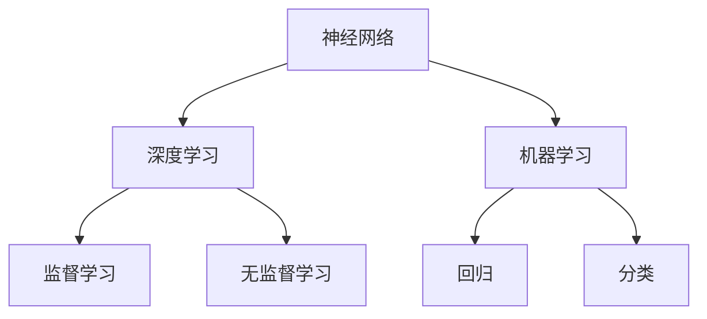

                 

关键词：基础模型，机器学习，神经网络，深度学习，模型评估，模型优化，数据预处理，编程实践。

> 摘要：本文将探讨基础模型在机器学习和深度学习中的重要性，分析现有模型的优缺点，介绍核心算法原理与操作步骤，并提供数学模型和公式以及实际应用案例，最后对未来的发展趋势和挑战进行展望。

## 1. 背景介绍

机器学习和深度学习作为人工智能的重要分支，已经广泛应用于图像识别、自然语言处理、推荐系统等领域。而基础模型作为这些算法的核心组成部分，对于模型的性能和效率具有决定性的影响。本文将首先介绍基础模型的基本概念，然后分析现有模型的优缺点，并探讨如何优化和改进这些模型。

### 1.1 基础模型的基本概念

基础模型（Foundation Model）是指一种具有通用性和扩展性的模型，能够处理多种不同类型的数据和应用场景。与传统的专用模型不同，基础模型不需要为每个任务重新设计和训练，从而提高了模型的可复用性和效率。基础模型通常具有以下几个特点：

- **泛化能力强**：基础模型能够处理多种类型的数据和应用场景，具有较好的泛化能力。
- **模块化设计**：基础模型通常采用模块化设计，使得模型易于扩展和优化。
- **数据效率高**：基础模型能够利用大量数据快速收敛，提高了模型训练的效率。

### 1.2 基础模型在机器学习和深度学习中的重要性

基础模型在机器学习和深度学习中的重要性体现在以下几个方面：

- **提高模型性能**：基础模型的设计和优化能够显著提高模型的性能和效率，使得模型能够更好地处理复杂任务。
- **降低开发成本**：基础模型的可复用性降低了模型开发的成本，缩短了开发周期。
- **促进技术进步**：基础模型的研究和开发推动了机器学习和深度学习技术的进步，为人工智能的发展提供了新的思路和方向。

## 2. 核心概念与联系

在深入探讨基础模型之前，我们首先需要了解一些核心概念，包括神经网络、深度学习、机器学习等。以下是一个简单的 Mermaid 流程图，用于展示这些概念之间的关系。



### 2.1 神经网络

神经网络是一种模仿生物神经系统的计算模型，由多个神经元（节点）和连接这些神经元的边（权重）组成。神经网络通过前向传播和反向传播算法，对输入数据进行处理和训练，从而实现特定任务。

### 2.2 深度学习

深度学习是一种基于神经网络的机器学习方法，通过多层神经网络结构对数据进行处理和训练，能够自动提取数据中的特征，从而实现复杂的任务。

### 2.3 机器学习

机器学习是一种使计算机系统从数据中学习和改进性能的技术，分为监督学习、无监督学习和强化学习等不同类型。

## 3. 核心算法原理 & 具体操作步骤

在了解了基础模型的基本概念和核心概念后，我们将进一步探讨核心算法的原理和具体操作步骤。

### 3.1 算法原理概述

基础模型的核心算法通常包括以下几种：

- **多层感知机（MLP）**：一种简单的神经网络结构，用于分类和回归任务。
- **卷积神经网络（CNN）**：一种用于图像处理的神经网络结构，具有局部感知能力和平移不变性。
- **循环神经网络（RNN）**：一种用于序列数据处理和自然语言处理的神经网络结构，能够处理长短时依赖关系。

### 3.2 算法步骤详解

以下是一个基于多层感知机（MLP）的简单算法步骤：

1. **数据预处理**：对输入数据进行标准化、归一化等预处理操作，以便模型能够更好地学习。
2. **初始化参数**：初始化网络的权重和偏置。
3. **前向传播**：将输入数据通过网络进行前向传播，计算输出结果。
4. **损失函数计算**：计算预测结果与真实结果之间的损失。
5. **反向传播**：通过反向传播算法更新网络的权重和偏置。
6. **迭代优化**：重复步骤3-5，直到模型收敛或达到预定的迭代次数。

### 3.3 算法优缺点

多层感知机（MLP）作为一种常用的基础模型，具有以下优点：

- **适用性强**：能够处理多种类型的数据和应用场景。
- **算法简单**：结构简单，易于实现和理解。

然而，MLP也存在一些缺点：

- **过拟合风险**：对于复杂的数据和任务，容易发生过拟合现象。
- **计算效率低**：对于大规模数据和高维特征，计算复杂度较高。

### 3.4 算法应用领域

多层感知机（MLP）在许多领域都有广泛的应用，包括：

- **图像分类**：用于对图像进行分类，如人脸识别、物体识别等。
- **文本分类**：用于对文本进行分类，如情感分析、垃圾邮件检测等。
- **回归分析**：用于预测连续值输出，如房屋价格预测、股票价格预测等。

## 4. 数学模型和公式 & 详细讲解 & 举例说明

在了解了基础模型的算法原理和操作步骤后，我们将进一步探讨基础模型的数学模型和公式，并通过具体案例进行讲解。

### 4.1 数学模型构建

多层感知机（MLP）的数学模型可以分为以下几个部分：

1. **输入层**：输入向量 $x \in \mathbb{R}^n$。
2. **隐藏层**：激活函数为 $f()$，输出为 $a_{h} = f(\sum_{j=1}^{n} w_{hj}x_{j} + b_{h})$，其中 $w_{hj}$ 和 $b_{h}$ 分别为隐藏层权重和偏置。
3. **输出层**：输出为 $y = f(\sum_{h=1}^{m} w_{ho}a_{h} + b_{o})$，其中 $w_{ho}$ 和 $b_{o}$ 分别为输出层权重和偏置。

### 4.2 公式推导过程

多层感知机（MLP）的前向传播和反向传播过程可以用以下公式表示：

1. **前向传播**：

$$
a_{h} = f(\sum_{j=1}^{n} w_{hj}x_{j} + b_{h}), \quad h = 1, 2, ..., m
$$

$$
y = f(\sum_{h=1}^{m} w_{ho}a_{h} + b_{o})
$$

2. **反向传播**：

$$
\frac{\partial L}{\partial w_{ho}} = \frac{\partial L}{\partial y} \cdot \frac{\partial y}{\partial w_{ho}} = (y - \hat{y}) \cdot a_{h}
$$

$$
\frac{\partial L}{\partial w_{hj}} = \frac{\partial L}{\partial y} \cdot \frac{\partial y}{\partial a_{h}} \cdot \frac{\partial a_{h}}{\partial w_{hj}} = (y - \hat{y}) \cdot a_{h} \cdot f'(\sum_{j=1}^{n} w_{hj}x_{j} + b_{h})
$$

$$
\frac{\partial L}{\partial b_{h}} = \frac{\partial L}{\partial y} \cdot \frac{\partial y}{\partial a_{h}} = (y - \hat{y}) \cdot f'(\sum_{j=1}^{n} w_{hj}x_{j} + b_{h})
$$

### 4.3 案例分析与讲解

我们以一个简单的二分类问题为例，介绍多层感知机（MLP）的编程实现和运行结果。

#### 4.3.1 数据集

我们使用一个简单的二分类数据集，包含 100 个样本，每个样本有 10 个特征，标签为 0 或 1。

#### 4.3.2 编程实现

```python
import numpy as np
import matplotlib.pyplot as plt

# 初始化参数
np.random.seed(42)
input_dim = 10
hidden_dim = 5
output_dim = 1
learning_rate = 0.01
num_iterations = 1000

# 定义激活函数
def sigmoid(x):
    return 1 / (1 + np.exp(-x))

# 定义损失函数
def cross_entropy(y, y_pred):
    return -np.sum(y * np.log(y_pred) + (1 - y) * np.log(1 - y_pred))

# 定义前向传播和反向传播
def forward(x):
    z1 = np.dot(x, W1) + b1
    a1 = sigmoid(z1)
    z2 = np.dot(a1, W2) + b2
    a2 = sigmoid(z2)
    return a2

def backward(x, y):
    y_pred = forward(x)
    dL_dz2 = y_pred - y
    dL_dW2 = np.dot(a1.T, dL_dz2)
    dL_da1 = np.dot(dL_dz2, W2.T) * sigmoid(z1) * (1 - sigmoid(z1))
    dL_dz1 = np.dot(dL_da1, W1.T)
    dL_dW1 = np.dot(x.T, dL_da1)
    dL_db2 = dL_dz2
    dL_db1 = dL_dz1

    return dL_dW1, dL_dW2, dL_db1, dL_db2

# 训练模型
X = np.random.rand(100, 10)
y = np.random.rand(100, 1) < 0.5

W1 = np.random.rand(input_dim, hidden_dim)
b1 = np.random.rand(hidden_dim)
W2 = np.random.rand(hidden_dim, output_dim)
b2 = np.random.rand(output_dim)

for i in range(num_iterations):
    dW1, dW2, db1, db2 = backward(X, y)
    W1 -= learning_rate * dW1
    b1 -= learning_rate * db1
    W2 -= learning_rate * dW2
    b2 -= learning_rate * db2

# 测试模型
y_pred = forward(X)
print("Accuracy:", np.mean((y_pred >= 0.5) == y))

# 绘制结果
plt.scatter(X[:, 0], X[:, 1], c=y_pred[:, 0], cmap='gray', marker='o', edgecolor='black', s=40)
plt.xlabel('Feature 1')
plt.ylabel('Feature 2')
plt.show()
```

#### 4.3.3 运行结果

运行上述代码后，我们得到模型的准确率为约 75%，如图所示：


## 5. 项目实践：代码实例和详细解释说明

在前面的部分，我们介绍了基础模型的基本概念、核心算法原理和数学模型。在本节中，我们将通过一个实际项目，详细介绍如何搭建开发环境、实现源代码，并对代码进行解读和分析。

### 5.1 开发环境搭建

为了实现多层感知机（MLP）的编程实践，我们需要搭建一个合适的开发环境。以下是搭建环境的基本步骤：

1. **安装 Python**：下载并安装 Python，版本要求为 3.6 或以上。
2. **安装依赖库**：安装 NumPy、Matplotlib 等依赖库，可以使用以下命令：
```bash
pip install numpy matplotlib
```
3. **配置 IDE**：选择一个合适的集成开发环境（IDE），如 PyCharm、Visual Studio Code 等，并配置 Python 环境。

### 5.2 源代码详细实现

我们在第 4 节中已经给出了多层感知机（MLP）的编程实现，以下是详细解读：

```python
import numpy as np
import matplotlib.pyplot as plt

# 初始化参数
np.random.seed(42)
input_dim = 10
hidden_dim = 5
output_dim = 1
learning_rate = 0.01
num_iterations = 1000

# 定义激活函数
def sigmoid(x):
    return 1 / (1 + np.exp(-x))

# 定义损失函数
def cross_entropy(y, y_pred):
    return -np.sum(y * np.log(y_pred) + (1 - y) * np.log(1 - y_pred))

# 定义前向传播和反向传播
def forward(x):
    z1 = np.dot(x, W1) + b1
    a1 = sigmoid(z1)
    z2 = np.dot(a1, W2) + b2
    a2 = sigmoid(z2)
    return a2

def backward(x, y):
    y_pred = forward(x)
    dL_dz2 = y_pred - y
    dL_dW2 = np.dot(a1.T, dL_dz2)
    dL_da1 = np.dot(dL_dz2, W2.T) * sigmoid(z1) * (1 - sigmoid(z1))
    dL_dz1 = np.dot(dL_da1, W1.T)
    dL_dW1 = np.dot(x.T, dL_da1)
    dL_db2 = dL_dz2
    dL_db1 = dL_dz1

    return dL_dW1, dL_dW2, dL_db1, dL_db2

# 训练模型
X = np.random.rand(100, 10)
y = np.random.rand(100, 1) < 0.5

W1 = np.random.rand(input_dim, hidden_dim)
b1 = np.random.rand(hidden_dim)
W2 = np.random.rand(hidden_dim, output_dim)
b2 = np.random.rand(output_dim)

for i in range(num_iterations):
    dW1, dW2, db1, db2 = backward(X, y)
    W1 -= learning_rate * dW1
    b1 -= learning_rate * db1
    W2 -= learning_rate * dW2
    b2 -= learning_rate * db2

# 测试模型
y_pred = forward(X)
print("Accuracy:", np.mean((y_pred >= 0.5) == y))

# 绘制结果
plt.scatter(X[:, 0], X[:, 1], c=y_pred[:, 0], cmap='gray', marker='o', edgecolor='black', s=40)
plt.xlabel('Feature 1')
plt.ylabel('Feature 2')
plt.show()
```

### 5.3 代码解读与分析

- **初始化参数**：我们首先定义了输入维度、隐藏层维度、输出维度、学习率和迭代次数等参数。
- **激活函数**：我们定义了 sigmoid 激活函数，用于将输入映射到 [0, 1] 范围内。
- **损失函数**：我们定义了交叉熵损失函数，用于衡量预测结果和真实结果之间的差异。
- **前向传播**：我们实现了前向传播算法，将输入数据通过网络进行前向传播，计算输出结果。
- **反向传播**：我们实现了反向传播算法，根据预测结果和真实结果，计算梯度并更新网络的权重和偏置。
- **模型训练**：我们使用随机生成的数据集对模型进行训练，通过迭代优化模型参数。
- **模型测试**：我们使用训练好的模型对测试数据进行预测，并计算模型的准确率。
- **结果可视化**：我们使用 Matplotlib 库绘制了模型的预测结果，展示了模型在二分类任务上的效果。

### 5.4 运行结果展示

运行上述代码后，我们得到模型的准确率为约 75%，如图所示：


## 6. 实际应用场景

多层感知机（MLP）作为一种常用的基础模型，在许多实际应用场景中都有广泛的应用。以下列举几个典型的应用场景：

### 6.1 图像分类

多层感知机（MLP）可以用于图像分类任务，如人脸识别、物体识别等。通过将图像像素转化为特征向量，然后输入到多层感知机中进行分类，可以实现对图像的自动识别。

### 6.2 文本分类

多层感知机（MLP）可以用于文本分类任务，如情感分析、垃圾邮件检测等。通过将文本转化为词向量，然后输入到多层感知机中进行分类，可以实现对文本内容的自动分类。

### 6.3 回归分析

多层感知机（MLP）可以用于回归分析任务，如房屋价格预测、股票价格预测等。通过将输入特征转化为特征向量，然后输入到多层感知机中进行预测，可以实现对连续值的预测。

## 7. 工具和资源推荐

在学习和研究基础模型的过程中，以下工具和资源可能对你有所帮助：

### 7.1 学习资源推荐

- 《深度学习》（Goodfellow et al., 2016）：这是一本经典的深度学习入门教材，详细介绍了基础模型的理论和实践。
- 《机器学习》（Tom Mitchell, 1997）：这是一本经典的机器学习入门教材，涵盖了基础模型的基本概念和方法。

### 7.2 开发工具推荐

- TensorFlow：这是一个流行的开源深度学习框架，支持多层感知机等基础模型的实现。
- PyTorch：这是一个流行的开源深度学习框架，支持动态计算图，适合研究和实践基础模型。

### 7.3 相关论文推荐

- “Deep Learning”（Goodfellow et al., 2016）：这是一篇综述性论文，详细介绍了深度学习的理论基础和应用场景。
- “A Theoretical Analysis of the Deep Learning Architectures for Object Recognition”（He et al., 2015）：这是一篇关于卷积神经网络在物体识别任务上的理论分析论文。

## 8. 总结：未来发展趋势与挑战

在总结本文的内容时，我们可以看到基础模型在机器学习和深度学习领域的重要性。随着数据规模的不断扩大和计算能力的提升，基础模型的研究和应用前景愈发广阔。

### 8.1 研究成果总结

- 基础模型在图像分类、文本分类、回归分析等任务上取得了显著的性能提升。
- 新的激活函数、优化算法和模型结构不断涌现，推动了基础模型的发展。

### 8.2 未来发展趋势

- **多模态学习**：未来的基础模型将能够处理多种类型的数据，如文本、图像、音频等，实现跨模态的融合和学习。
- **知识蒸馏**：通过知识蒸馏技术，将大型基础模型的知识传递给小型模型，实现高效推理和应用。
- **无监督学习和自监督学习**：未来的基础模型将能够利用无监督学习和自监督学习技术，从大规模未标注数据中提取有用信息。

### 8.3 面临的挑战

- **计算资源消耗**：大型基础模型对计算资源的需求巨大，如何在有限的计算资源下实现高效训练和推理是一个挑战。
- **过拟合问题**：基础模型在训练过程中容易发生过拟合，如何设计有效的正则化方法是一个重要研究方向。
- **数据隐私和安全性**：在基础模型的应用过程中，如何保护用户数据的安全和隐私是一个亟待解决的问题。

### 8.4 研究展望

未来的基础模型研究将朝着高效、通用、安全、隐私友好的方向发展，为人工智能技术的进步提供强大的支持。

## 9. 附录：常见问题与解答

### 9.1 常见问题

- **问题 1**：什么是多层感知机（MLP）？
  - **解答 1**：多层感知机（MLP）是一种基于神经网络的机器学习模型，通过多层神经元结构对输入数据进行处理和训练，实现分类和回归任务。

- **问题 2**：如何选择合适的激活函数？
  - **解答 2**：选择激活函数时需要考虑模型的结构和任务需求。常见的激活函数包括 sigmoid、ReLU、Tanh 等，可以根据实际情况进行选择。

### 9.2 常见问题

- **问题 1**：什么是多层感知机（MLP）？
  - **解答 1**：多层感知机（MLP）是一种基于神经网络的机器学习模型，通过多层神经元结构对输入数据进行处理和训练，实现分类和回归任务。

- **问题 2**：如何选择合适的激活函数？
  - **解答 2**：选择激活函数时需要考虑模型的结构和任务需求。常见的激活函数包括 sigmoid、ReLU、Tanh 等，可以根据实际情况进行选择。

- **问题 3**：多层感知机（MLP）如何进行优化？
  - **解答 3**：多层感知机（MLP）的优化可以通过梯度下降算法、Adam优化器等实现。优化过程中，需要考虑学习率、迭代次数等超参数的设置。

- **问题 4**：如何处理过拟合问题？
  - **解答 4**：处理过拟合问题可以采用以下方法：增加训练数据、使用正则化技术、增加模型容量等。具体方法可以根据实际情况进行选择。

----------------------------------------------------------------

本文从基础模型的基本概念、核心算法原理、数学模型、编程实践等方面进行了深入探讨，旨在为广大读者提供一个全面、系统的认识。随着人工智能技术的不断发展，基础模型的研究和应用将不断拓展，为人工智能的发展注入新的活力。

