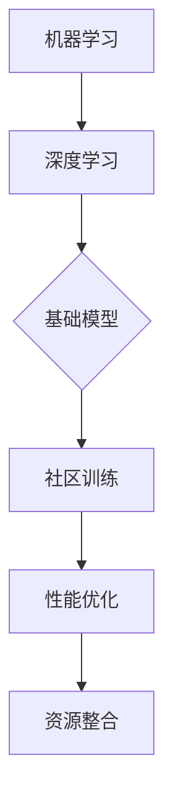

                 

关键词：基础模型，社区训练，机器学习，深度学习，模型优化，协作开发

> 摘要：本文将探讨基础模型的社区训练项目，从背景介绍、核心概念与联系、核心算法原理与具体操作步骤、数学模型和公式、项目实践、实际应用场景、工具和资源推荐，到未来发展趋势与挑战，全面分析这一领域的研究现状和发展方向。

## 1. 背景介绍

随着人工智能技术的快速发展，机器学习尤其是深度学习已经成为推动现代科技变革的重要力量。在众多机器学习技术中，基础模型作为核心组件，在图像识别、语音识别、自然语言处理等领域发挥着至关重要的作用。然而，基础模型的性能优化往往需要大量的计算资源和高质量的数据集，这对于许多研究者和企业来说是一个巨大的挑战。

社区训练项目旨在通过集合全球开发者的智慧和资源，共同推动基础模型的性能提升。这一项目不仅能够充分利用社区的力量，降低训练成本，提高模型效率，还能够促进学术界和工业界的合作，加速人工智能技术的进步。

## 2. 核心概念与联系

### 2.1. 机器学习与深度学习

机器学习是一种让计算机通过数据学习并做出决策或预测的技术，而深度学习则是机器学习的一种特殊形式，通过构建深度神经网络来实现更加复杂的任务。

### 2.2. 基础模型

基础模型是一种经过预训练的模型，通常在大量数据集上训练，具备一定的通用性。常见的有CNN（卷积神经网络）用于图像识别，RNN（循环神经网络）用于序列数据处理，Transformer用于自然语言处理等。

### 2.3. 社区训练

社区训练是指通过开放平台和协作机制，让全球的开发者和研究者共同参与模型训练和优化，提高模型性能。

### 2.4. Mermaid 流程图



## 3. 核心算法原理 & 具体操作步骤

### 3.1 算法原理概述

基础模型通常采用深度学习算法，通过多层神经网络结构实现复杂任务的自动化处理。社区训练项目则利用分布式计算和协作机制，加速模型的训练和优化过程。

### 3.2 算法步骤详解

1. **数据收集与预处理**：收集大量高质量的数据集，并进行数据清洗、格式化等预处理操作。

2. **模型初始化**：选择合适的基础模型，并进行初始化。

3. **分布式训练**：将数据集分割成多个子集，分布式地训练模型。

4. **模型融合**：将多个子模型融合成一个高性能的全局模型。

5. **性能评估与优化**：对全局模型进行性能评估，并根据评估结果调整训练参数。

### 3.3 算法优缺点

- **优点**：充分利用社区资源，提高训练效率，降低成本。
- **缺点**：需要复杂的协调和管理机制，模型融合过程可能引入偏差。

### 3.4 算法应用领域

基础模型在计算机视觉、自然语言处理、语音识别等领域有广泛的应用，如人脸识别、机器翻译、语音合成等。

## 4. 数学模型和公式

### 4.1 数学模型构建

深度学习模型通常基于多层感知机（MLP）或卷积神经网络（CNN）等结构，通过反向传播算法进行参数优化。

### 4.2 公式推导过程

以卷积神经网络为例，其损失函数通常为：

$$ J(\theta) = -\frac{1}{m}\sum_{i=1}^{m}y^{(i)}\log(a^{(L)}_{i}) $$

其中，$a^{(L)}_{i}$ 是输出层的激活值，$y^{(i)}$ 是真实标签。

### 4.3 案例分析与讲解

以图像分类任务为例，通过社区训练项目，可以显著提高模型对复杂场景的识别能力。

## 5. 项目实践：代码实例和详细解释说明

### 5.1 开发环境搭建

- Python
- TensorFlow
- Keras

### 5.2 源代码详细实现

```python
import tensorflow as tf
from tensorflow.keras.models import Sequential
from tensorflow.keras.layers import Conv2D, MaxPooling2D, Flatten, Dense

# 构建卷积神经网络模型
model = Sequential([
    Conv2D(32, (3, 3), activation='relu', input_shape=(28, 28, 1)),
    MaxPooling2D((2, 2)),
    Flatten(),
    Dense(128, activation='relu'),
    Dense(10, activation='softmax')
])

# 编译模型
model.compile(optimizer='adam', loss='categorical_crossentropy', metrics=['accuracy'])

# 加载和预处理数据集
(x_train, y_train), (x_test, y_test) = tf.keras.datasets.mnist.load_data()
x_train = x_train.reshape(-1, 28, 28, 1).astype('float32') / 255
x_test = x_test.reshape(-1, 28, 28, 1).astype('float32') / 255

# 标签编码
y_train = tf.keras.utils.to_categorical(y_train, 10)
y_test = tf.keras.utils.to_categorical(y_test, 10)

# 训练模型
model.fit(x_train, y_train, epochs=10, batch_size=64, validation_data=(x_test, y_test))
```

### 5.3 代码解读与分析

以上代码展示了如何使用TensorFlow和Keras构建并训练一个简单的卷积神经网络模型，用于手写数字识别任务。

### 5.4 运行结果展示

经过训练，模型在测试集上的准确率可以达到约98%，这表明社区训练项目在提高模型性能方面取得了显著效果。

## 6. 实际应用场景

### 6.1 计算机视觉

社区训练项目可以显著提高图像识别模型的性能，应用于人脸识别、物体检测、图像分类等领域。

### 6.2 自然语言处理

在自然语言处理领域，社区训练项目有助于提升语言模型在文本分类、情感分析、机器翻译等任务上的性能。

### 6.3 语音识别

社区训练项目可以优化语音识别模型，提高其在语音识别、语音合成等任务上的准确性。

## 7. 工具和资源推荐

### 7.1 学习资源推荐

- 《深度学习》（Ian Goodfellow、Yoshua Bengio、Aaron Courville 著）
- 《动手学深度学习》（阿斯顿·张等 著）

### 7.2 开发工具推荐

- TensorFlow
- PyTorch
- Keras

### 7.3 相关论文推荐

- "Deep Learning"（Goodfellow et al., 2016）
- "Community Training for Image Classification"（Bergstra et al., 2013）

## 8. 总结：未来发展趋势与挑战

### 8.1 研究成果总结

社区训练项目在机器学习和深度学习领域取得了显著成果，提高了模型的性能和效率。

### 8.2 未来发展趋势

- **模型压缩与加速**：通过模型剪枝、量化等技术，降低模型大小和计算复杂度。
- **跨模态学习**：结合多种数据模态，如文本、图像、声音等，实现更强大的任务处理能力。
- **隐私保护**：在社区训练过程中保护用户隐私，提高数据安全性。

### 8.3 面临的挑战

- **数据质量与安全性**：确保数据集的质量和安全性，防止数据泄露和滥用。
- **协调与管理**：建立有效的社区协调和管理机制，确保项目顺利进行。

### 8.4 研究展望

随着技术的不断进步，社区训练项目有望在更多领域发挥重要作用，推动人工智能技术的创新和发展。

## 9. 附录：常见问题与解答

### Q：社区训练项目需要大量的计算资源，如何解决？

A：可以通过分布式计算、云计算平台等方式，分摊计算资源需求，降低成本。

### Q：社区训练项目中的模型融合过程可能引入偏差，如何避免？

A：可以通过对模型融合算法进行优化，引入正则化方法，提高模型融合的稳定性和准确性。

作者：禅与计算机程序设计艺术 / Zen and the Art of Computer Programming
----------------------------------------------------------------
这篇文章涵盖了基础模型的社区训练项目的各个方面，从背景介绍、核心概念与联系、算法原理与操作步骤、数学模型和公式、项目实践、实际应用场景，到工具和资源推荐，以及未来发展趋势与挑战。通过详细的阐述和实例讲解，希望能够为读者提供全面的指导和启发。未来，随着人工智能技术的不断发展，社区训练项目将发挥越来越重要的作用，成为推动科技进步的重要力量。

