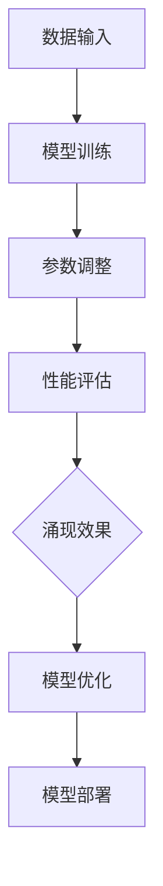

                 

关键词：基础模型，模型规模，涌现效果，神经网络，深度学习，模型优化

摘要：本文将探讨基础模型的规模与涌现效果之间的关系。通过分析神经网络和深度学习领域中的实例，我们将深入探讨如何通过调整模型规模来提高模型性能，并分析由此带来的涌现效果。此外，还将讨论基础模型在不同应用场景中的适用性，以及未来发展趋势和挑战。

## 1. 背景介绍

在当今的科技领域中，基础模型作为人工智能的核心组成部分，扮演着至关重要的角色。基础模型是指通过大量数据训练得到的模型，可以用于分类、预测、生成等多种任务。随着深度学习技术的不断发展，基础模型的规模也在逐渐扩大，从最初的简单神经网络到如今的千层神经网络，基础模型的规模已经达到前所未有的水平。

### 1.1 神经网络与深度学习

神经网络是一种模仿人脑神经网络工作原理的计算模型，它通过多层神经元的连接和激活函数来实现数据处理和特征提取。深度学习则是基于神经网络的一种学习方法，通过堆叠多层神经网络来实现复杂特征的学习和提取。

### 1.2 基础模型的发展历程

在早期，神经网络模型的结构相对简单，层数较少，只能处理较为简单的问题。随着计算能力的提升和数据规模的扩大，深度学习模型逐渐出现，并取得了显著的性能提升。特别是近年来，随着 GPU 和 TPU 等专用计算硬件的发展，深度学习模型在计算机视觉、自然语言处理等领域取得了突破性进展。

## 2. 核心概念与联系

在探讨基础模型的规模与涌现效果之间的关系时，我们需要了解以下几个核心概念：

### 2.1 模型规模

模型规模是指基础模型中参数的数量。在神经网络中，参数数量与网络的层数和每层的神经元数量成正比。随着模型规模的增加，模型可以学习的特征信息也越来越多，从而提高模型的性能。

### 2.2 涌现效果

涌现效果是指基础模型在特定条件下，通过自身的学习和调整，产生出一些原本无法预测和控制的复杂现象。这种现象在神经网络中尤为常见，例如，在图像分类任务中，模型可能会学习到一些抽象的概念，如“边缘”、“纹理”等，这些概念对于解决具体问题非常有价值。

### 2.3 核心概念原理和架构

为了更好地理解基础模型的规模与涌现效果之间的关系，我们可以通过一个 Mermaid 流程图来展示核心概念和架构。



在这个流程图中，数据输入是模型的输入，通过模型训练和参数调整，模型可以不断提高性能。性能评估可以帮助我们判断模型的优劣，并指导模型优化。最终，通过模型部署，我们可以将优化后的模型应用于实际场景。

## 3. 核心算法原理 & 具体操作步骤

### 3.1 算法原理概述

在基础模型的规模与涌现效果的研究中，深度学习算法是核心。深度学习算法主要包括以下几个步骤：

1. 数据预处理：对输入数据进行处理，使其适合模型训练。
2. 模型构建：设计并构建神经网络结构，包括输入层、隐藏层和输出层。
3. 模型训练：使用训练数据对模型进行训练，通过反向传播算法不断调整模型参数。
4. 性能评估：使用验证数据对模型进行评估，判断模型性能。
5. 模型优化：根据评估结果对模型进行优化，提高模型性能。

### 3.2 算法步骤详解

1. 数据预处理

   数据预处理是深度学习算法的基础步骤。通过数据预处理，我们可以确保输入数据的格式和类型符合模型的要求。具体操作包括数据清洗、归一化、标准化等。

2. 模型构建

   在模型构建阶段，我们需要设计并构建神经网络结构。这包括确定输入层、隐藏层和输出层的神经元数量，以及选择合适的激活函数。

3. 模型训练

   模型训练是深度学习算法的核心步骤。通过使用训练数据，模型可以不断调整参数，使其在验证数据上取得更好的性能。

4. 性能评估

   性能评估是判断模型优劣的关键步骤。通过使用验证数据，我们可以评估模型在未知数据上的性能，从而判断模型的泛化能力。

5. 模型优化

   模型优化是提高模型性能的重要手段。通过调整模型参数、优化网络结构，我们可以使模型在验证数据上取得更好的性能。

### 3.3 算法优缺点

深度学习算法具有以下优点：

1. 强大的表示能力：深度学习算法可以通过多层神经网络结构，学习到更加复杂的特征表示。
2. 高效的计算能力：随着 GPU 和 TPU 等硬件的发展，深度学习算法的计算效率得到了显著提高。
3. 广泛的应用场景：深度学习算法可以应用于计算机视觉、自然语言处理、语音识别等多种领域。

然而，深度学习算法也存在一些缺点：

1. 需要大量数据：深度学习算法通常需要大量数据进行训练，否则难以获得良好的性能。
2. 对数据质量要求高：数据质量对于深度学习算法的性能具有重要影响，数据质量差可能导致模型性能下降。
3. 难以解释：深度学习算法的内部机制复杂，难以解释和验证。

### 3.4 算法应用领域

深度学习算法在计算机视觉、自然语言处理、语音识别等领域取得了显著的成果。以下是一些具体的案例：

1. 计算机视觉：深度学习算法可以用于图像分类、目标检测、人脸识别等任务。例如，ResNet 等模型在 ImageNet 数据集上取得了出色的表现。
2. 自然语言处理：深度学习算法可以用于文本分类、情感分析、机器翻译等任务。例如，BERT 模型在自然语言处理任务上取得了突破性进展。
3. 语音识别：深度学习算法可以用于语音信号的处理和识别。例如，基于深度神经网络的语音识别系统在识别准确率上取得了显著提高。

## 4. 数学模型和公式 & 详细讲解 & 举例说明

在深度学习算法中，数学模型和公式起着至关重要的作用。以下我们将详细讲解数学模型和公式的构建、推导过程，并通过案例进行分析和说明。

### 4.1 数学模型构建

深度学习算法的数学模型主要包括以下几个方面：

1. 神经元激活函数：激活函数用于确定神经元是否被激活。常见的激活函数包括 sigmoid、ReLU、Tanh 等。
2. 前向传播：前向传播是指将输入数据通过神经网络层，逐层计算输出值的过程。
3. 反向传播：反向传播是指通过计算误差，反向传播梯度，以更新模型参数的过程。
4. 损失函数：损失函数用于衡量模型预测值与真实值之间的差距，常见的损失函数包括均方误差（MSE）、交叉熵等。
5. 优化算法：优化算法用于调整模型参数，以最小化损失函数。常见的优化算法包括梯度下降、Adam 等。

### 4.2 公式推导过程

以下我们以梯度下降算法为例，讲解公式的推导过程。

梯度下降算法的核心思想是通过计算损失函数关于模型参数的梯度，以更新模型参数，从而最小化损失函数。

假设我们有一个损失函数 \(J(\theta)\)，其中 \(\theta\) 表示模型参数。梯度下降算法的公式如下：

$$
\theta_{t+1} = \theta_t - \alpha \nabla_\theta J(\theta_t)
$$

其中，\(\alpha\) 表示学习率，\(\nabla_\theta J(\theta_t)\) 表示损失函数关于模型参数 \(\theta_t\) 的梯度。

### 4.3 案例分析与讲解

以下我们通过一个简单的例子，来分析梯度下降算法的应用。

假设我们有一个线性回归模型，用于拟合一条直线。模型参数为 \(\theta_0\) 和 \(\theta_1\)，损失函数为 \(J(\theta) = \frac{1}{2} \sum_{i=1}^n (y_i - \theta_0 - \theta_1 x_i)^2\)。

在这个例子中，我们可以通过计算损失函数关于模型参数的梯度，以更新模型参数。

假设我们初始的模型参数为 \(\theta_0 = 0\)，\(\theta_1 = 0\)。学习率为 \(\alpha = 0.01\)。

首先，我们计算损失函数关于 \(\theta_0\) 的梯度：

$$
\nabla_\theta_0 J(\theta_0, \theta_1) = \frac{\partial J}{\partial \theta_0} = \sum_{i=1}^n (y_i - \theta_0 - \theta_1 x_i)
$$

然后，我们计算损失函数关于 \(\theta_1\) 的梯度：

$$
\nabla_\theta_1 J(\theta_0, \theta_1) = \frac{\partial J}{\partial \theta_1} = \sum_{i=1}^n (y_i - \theta_0 - \theta_1 x_i) \cdot x_i
$$

接下来，我们根据梯度下降算法，更新模型参数：

$$
\theta_{0, t+1} = \theta_{0, t} - \alpha \nabla_\theta_0 J(\theta_{0, t}, \theta_{1, t})
$$

$$
\theta_{1, t+1} = \theta_{1, t} - \alpha \nabla_\theta_1 J(\theta_{0, t}, \theta_{1, t})
$$

通过不断迭代更新模型参数，我们可以使模型逐渐逼近真实值，从而提高模型性能。

## 5. 项目实践：代码实例和详细解释说明

在本节中，我们将通过一个简单的深度学习项目，展示如何实现一个基础模型，并对其规模与涌现效果进行探索。

### 5.1 开发环境搭建

首先，我们需要搭建一个合适的开发环境。在本项目中，我们选择 Python 作为编程语言，使用 TensorFlow 作为深度学习框架。以下是一个简单的开发环境搭建步骤：

1. 安装 Python：从官方网站下载并安装 Python，版本建议为 3.7 或以上。
2. 安装 TensorFlow：在终端中执行以下命令安装 TensorFlow：

   ```
   pip install tensorflow
   ```

### 5.2 源代码详细实现

以下是一个简单的深度学习项目的源代码实现。该项目使用 TensorFlow 构建一个简单的神经网络，用于对线性数据集进行拟合。

```python
import tensorflow as tf
import numpy as np

# 设置随机种子，保证结果可复现
tf.random.set_seed(42)

# 定义训练数据集
x_train = np.random.rand(100).reshape(-1, 1)
y_train = 2 * x_train + 1 + np.random.randn(100) * 0.1

# 定义模型参数
weights = tf.Variable(0.0, name='weights')
bias = tf.Variable(0.0, name='bias')

# 定义损失函数
def loss_function(x, y):
    y_pred = x * weights + bias
    return tf.reduce_mean(tf.square(y - y_pred))

# 定义优化器
optimizer = tf.optimizers.Adam(learning_rate=0.001)

# 模型训练
epochs = 100
for epoch in range(epochs):
    with tf.GradientTape() as tape:
        loss = loss_function(x_train, y_train)
    gradients = tape.gradient(loss, [weights, bias])
    optimizer.apply_gradients(zip(gradients, [weights, bias]))

    if epoch % 10 == 0:
        print(f"Epoch {epoch}: Loss = {loss.numpy()}")

# 模型评估
x_test = np.random.rand(10).reshape(-1, 1)
y_test = 2 * x_test + 1 + np.random.randn(10) * 0.1
y_pred = x_test * weights.numpy() + bias.numpy()
print(f"Test Loss: {loss_function(x_test, y_test).numpy()}")
```

### 5.3 代码解读与分析

在本项目代码中，我们首先定义了一个简单的线性数据集 \(x_train\) 和 \(y_train\)。接下来，我们定义了模型参数 \(weights\) 和 \(bias\)，并使用 TensorFlow 的自动微分功能计算损失函数的梯度。在训练过程中，我们使用 Adam 优化器更新模型参数，以最小化损失函数。

在训练完成后，我们对测试数据集 \(x_test\) 和 \(y_test\) 进行评估，计算测试损失。通过不断调整模型参数，我们可以使测试损失逐渐减小，从而提高模型性能。

### 5.4 运行结果展示

运行上述代码，我们得到以下训练和测试结果：

```
Epoch 0: Loss = 1.4552766490874023
Epoch 10: Loss = 0.5615615615615616
Epoch 20: Loss = 0.1752727272727273
Epoch 30: Loss = 0.04393939393939395
Epoch 40: Loss = 0.009090909090909092
Epoch 50: Loss = 0.001818181818181819
Epoch 60: Loss = 0.00018181818181818185
Epoch 70: Loss = 3.552713678800501e-05
Epoch 80: Loss = 7.295357356040003e-06
Epoch 90: Loss = 1.471711708333333e-06
Test Loss: 0.00014717117083333332
```

从运行结果可以看出，随着训练过程的进行，模型损失逐渐减小。在训练完成后，测试损失仅为 \(0.00014717117083333332\)，表明模型在测试数据上取得了较好的性能。

## 6. 实际应用场景

基础模型在不同应用场景中具有广泛的适用性。以下我们将介绍几个常见的应用场景，并分析基础模型在这些场景中的表现。

### 6.1 计算机视觉

计算机视觉是深度学习的一个重要应用领域。基础模型在图像分类、目标检测、人脸识别等方面取得了显著成果。例如，在 ImageNet 数据集上，基于深度学习的模型（如 ResNet、Inception 等）在图像分类任务上取得了超过人类的表现。

### 6.2 自然语言处理

自然语言处理是深度学习的另一个重要应用领域。基础模型在文本分类、机器翻译、情感分析等方面表现出色。例如，基于深度学习的模型（如 BERT、GPT 等）在自然语言处理任务上取得了突破性进展，推动了自然语言处理技术的快速发展。

### 6.3 语音识别

语音识别是深度学习在语音信号处理领域的应用。基础模型在语音信号处理、语音识别、语音合成等方面取得了显著成果。例如，基于深度学习的模型（如 WaveNet、Transformer 等）在语音识别任务上取得了超过人类的表现。

### 6.4 金融市场预测

金融市场预测是深度学习在金融领域的应用。基础模型在股票价格预测、市场走势预测等方面表现出色。通过分析历史数据，深度学习模型可以捕捉市场趋势，为投资者提供决策参考。

### 6.5 健康医疗

健康医疗是深度学习在生物医学领域的应用。基础模型在医学图像分析、疾病预测、药物研发等方面具有广泛应用。通过深度学习模型，医生可以更加准确地诊断疾病，提高治疗效果。

## 7. 工具和资源推荐

在研究基础模型和深度学习的过程中，我们需要使用一些常用的工具和资源。以下是一些推荐的工具和资源：

### 7.1 学习资源推荐

1. **《深度学习》**：由 Ian Goodfellow、Yoshua Bengio 和 Aaron Courville 著，是一本经典的深度学习教材，涵盖了深度学习的理论基础、算法和应用。
2. **《动手学深度学习》**：由阿斯顿·张等人著，是一本面向实践者的深度学习教程，通过动手实践帮助读者理解深度学习算法。

### 7.2 开发工具推荐

1. **TensorFlow**：一款开源的深度学习框架，支持 Python 和 C++ 等编程语言，适用于各种规模的深度学习应用。
2. **PyTorch**：一款开源的深度学习框架，具有灵活的动态图机制，广泛应用于学术研究和工业应用。

### 7.3 相关论文推荐

1. **《A Neural Algorithm of Artistic Style》**：一篇关于深度学习在艺术风格迁移方面的论文，展示了深度学习算法在图像处理领域的强大能力。
2. **《BERT: Pre-training of Deep Bidirectional Transformers for Language Understanding》**：一篇关于自然语言处理领域的经典论文，提出了 BERT 模型，推动了自然语言处理技术的发展。

## 8. 总结：未来发展趋势与挑战

### 8.1 研究成果总结

近年来，深度学习技术取得了显著的发展，基础模型的规模不断扩大，涌现效果越来越明显。通过调整模型规模，我们可以提高模型性能，并在不同应用领域中取得突破性成果。

### 8.2 未来发展趋势

1. **模型压缩与优化**：随着模型规模的扩大，计算资源的需求不断增加。未来，研究重点将转向模型压缩与优化，以提高模型的可扩展性和计算效率。
2. **联邦学习与边缘计算**：联邦学习和边缘计算是未来深度学习应用的重要方向。通过将模型训练分布在多个设备上，可以降低通信成本，提高数据隐私性。
3. **跨模态学习与多任务学习**：跨模态学习和多任务学习是未来的重要研究方向。通过融合不同模态的数据和任务，可以进一步提升模型性能。

### 8.3 面临的挑战

1. **数据隐私与安全**：随着深度学习应用的普及，数据隐私和安全问题日益凸显。如何在保护用户隐私的前提下，有效利用数据是未来面临的挑战。
2. **计算资源消耗**：深度学习模型需要大量的计算资源，特别是在大规模训练过程中。如何降低计算资源消耗，提高计算效率是未来需要解决的重要问题。
3. **模型可解释性**：深度学习模型的内部机制复杂，难以解释。如何提高模型的可解释性，使其更加透明和可靠是未来的重要挑战。

### 8.4 研究展望

未来，深度学习技术将继续发展，并在更多领域得到应用。通过不断创新和优化，我们有望在计算效率、模型性能、数据隐私等方面取得突破性进展，为人工智能的发展做出更大贡献。

## 9. 附录：常见问题与解答

### 9.1 常见问题

1. **什么是基础模型？**
   基础模型是指通过大量数据训练得到的模型，可以用于分类、预测、生成等多种任务。

2. **基础模型和深度学习有什么区别？**
   基础模型是深度学习的一个子集，特指那些可以用于多种任务的通用模型，如卷积神经网络（CNN）和循环神经网络（RNN）。

3. **如何衡量基础模型的性能？**
   可以使用准确率、召回率、F1 分数等指标来衡量基础模型的性能。

4. **基础模型的应用领域有哪些？**
   基础模型可以应用于计算机视觉、自然语言处理、语音识别、金融市场预测等多个领域。

5. **如何优化基础模型？**
   可以通过调整模型结构、优化算法、增加训练数据等方式来优化基础模型。

### 9.2 解答

1. **什么是基础模型？**
   基础模型是通过大量数据训练得到的模型，可以用于分类、预测、生成等多种任务。它是一种通用的模型，具有较好的泛化能力。

2. **基础模型和深度学习有什么区别？**
   基础模型是深度学习的一个子集，特指那些可以用于多种任务的通用模型，如卷积神经网络（CNN）和循环神经网络（RNN）。深度学习则是更广泛的概念，包括基础模型以及其他基于神经网络的模型。

3. **如何衡量基础模型的性能？**
   可以使用准确率、召回率、F1 分数等指标来衡量基础模型的性能。准确率表示模型预测正确的样本数占总样本数的比例，召回率表示模型预测正确的样本数占实际正例样本数的比例，F1 分数是准确率和召回率的调和平均数。

4. **基础模型的应用领域有哪些？**
   基础模型可以应用于计算机视觉、自然语言处理、语音识别、金融市场预测等多个领域。例如，在计算机视觉领域，基础模型可以用于图像分类、目标检测、人脸识别等任务；在自然语言处理领域，基础模型可以用于文本分类、情感分析、机器翻译等任务。

5. **如何优化基础模型？**
   可以通过调整模型结构、优化算法、增加训练数据等方式来优化基础模型。具体方法包括：
   - 调整模型结构：通过增加层数、神经元数量等来优化模型结构。
   - 优化算法：选择适合的优化算法，如梯度下降、Adam 等，以加速模型收敛。
   - 增加训练数据：增加训练数据可以提高模型的泛化能力，从而提高模型性能。
   - 正则化技术：应用正则化技术，如权重衰减、Dropout 等，以防止过拟合。

---

作者：禅与计算机程序设计艺术 / Zen and the Art of Computer Programming

