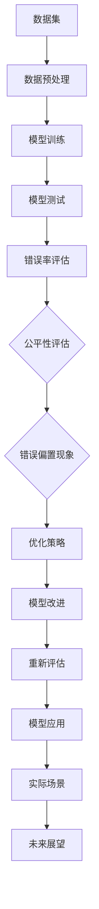

                 

关键词：基础模型、错误偏置、公平、算法、模型优化、计算错误、偏差减少、无偏估计、模型公平性

摘要：本文将深入探讨基础模型中常见的错误偏置现象及其对模型公平性的影响。我们将首先介绍错误偏置的基本概念，然后通过分析基础模型中的常见错误偏置现象，探讨这些现象对模型性能和公平性的潜在影响。接下来，我们将讨论如何通过算法优化和数学模型来减少错误偏置，并介绍一些具体的应用领域。此外，我们还将分享一些项目实践中的代码实例，以及实际应用场景和未来展望。最后，我们将总结研究结果，并提出未来的发展趋势与挑战。

## 1. 背景介绍

在当今人工智能领域，基础模型作为研究和应用的核心，已经成为各行各业不可或缺的工具。然而，随着深度学习模型的广泛应用，一个不可忽视的问题逐渐浮现——错误偏置。错误偏置是指模型在训练和预测过程中由于数据集、算法、计算方法等因素导致的预测错误分布不均匀，从而影响模型的性能和公平性。本文旨在探讨基础模型中的错误偏置现象，分析其对模型公平性的影响，并提出相应的优化策略。

### 1.1 错误偏置的定义

错误偏置是指模型在预测过程中，某些类别的错误率与其他类别存在显著差异的现象。错误偏置可能由多个因素引起，包括数据集不平衡、模型结构设计、训练算法选择等。例如，在一个图像分类任务中，如果某些类别（如动物）的样本数量远远多于其他类别（如植物），那么模型在训练过程中可能会对动物类别的识别更准确，而对植物类别的识别则相对较差。

### 1.2 错误偏置的影响

错误偏置对模型的性能和公平性产生了深远的影响。首先，错误偏置可能导致模型在测试集上的表现不佳。例如，在一个医疗诊断任务中，如果模型对某些疾病（如癌症）的预测准确性较低，那么在实际应用中可能会导致患者接受不必要的治疗或错过最佳治疗时机。其次，错误偏置也可能导致模型在不同群体中的性能差异。例如，在一个自动驾驶任务中，如果模型在某些地区（如城市）的行驶效果较好，而在其他地区（如农村）的行驶效果较差，那么可能会导致不同地区的用户体验不平等。

### 1.3 错误偏置的来源

错误偏置的来源可以分为两个方面：数据集和模型。

#### 1.3.1 数据集

数据集的质量和多样性直接影响模型的性能和公平性。数据集不平衡、数据噪声、标签错误等都会导致错误偏置。例如，在一个性别识别任务中，如果数据集中男性样本数量远多于女性样本，那么模型可能会对女性识别不准确。

#### 1.3.2 模型

模型结构和参数选择也是影响错误偏置的重要因素。例如，深度神经网络在处理高维数据时容易出现过拟合现象，导致模型在某些类别上的预测准确性较低。

## 2. 核心概念与联系

为了更好地理解错误偏置现象，我们需要介绍一些核心概念和联系。以下是本文涉及的一些关键概念：

### 2.1 数据集不平衡

数据集不平衡是指数据集中各个类别的样本数量差异较大。数据集不平衡会导致模型在训练过程中对某些类别的识别更准确，而对其他类别的识别较差。

### 2.2 过拟合

过拟合是指模型在训练数据上表现良好，但在测试数据上表现较差的现象。过拟合可能是由于模型复杂度过高，导致模型在训练数据上过度学习，从而无法泛化到新的数据。

### 2.3 泛化能力

泛化能力是指模型在未见过的数据上表现良好。一个具有良好泛化能力的模型能够在不同数据集、不同场景中保持较高的预测准确性。

### 2.4 模型公平性

模型公平性是指模型在处理不同群体、不同类别时，能够保持一致的表现。公平性是模型应用于实际场景的重要考量因素。

### 2.5 Mermaid 流程图

以下是错误偏置现象在基础模型中的 Mermaid 流程图：



## 3. 核心算法原理 & 具体操作步骤

### 3.1 算法原理概述

为了减少基础模型中的错误偏置，我们需要从数据集、模型训练和模型评估三个方面入手。具体算法原理如下：

#### 3.1.1 数据预处理

首先，我们需要对数据集进行预处理，包括数据清洗、数据增强和数据重采样等操作。数据清洗旨在去除数据集中的噪声和异常值；数据增强通过生成更多的样本来提高模型的泛化能力；数据重采样则通过调整样本数量来平衡数据集。

#### 3.1.2 模型训练

在模型训练过程中，我们采用了一些优化算法，如交叉熵损失函数和梯度下降算法。交叉熵损失函数用于衡量模型预测结果与真实标签之间的差异；梯度下降算法用于更新模型参数，使得模型在训练数据上达到更好的性能。

#### 3.1.3 模型评估

在模型评估阶段，我们使用准确率、召回率、F1值等指标来评估模型的性能。这些指标能够帮助我们识别模型在哪些类别上存在错误偏置，从而制定相应的优化策略。

### 3.2 算法步骤详解

以下是减少错误偏置的具体操作步骤：

#### 3.2.1 数据预处理

1. 数据清洗：使用去重、去噪等方法对数据集进行清洗，去除重复和异常样本。
2. 数据增强：通过旋转、缩放、裁剪等方式生成更多的样本，提高模型的泛化能力。
3. 数据重采样：根据样本数量调整各个类别的样本数量，使数据集达到平衡。

#### 3.2.2 模型训练

1. 选择合适的模型架构：根据任务需求，选择合适的深度学习模型，如卷积神经网络（CNN）或循环神经网络（RNN）。
2. 定义损失函数：采用交叉熵损失函数，计算模型预测结果与真实标签之间的差异。
3. 选择优化算法：采用梯度下降算法，更新模型参数，使得模型在训练数据上达到更好的性能。

#### 3.2.3 模型评估

1. 计算准确率、召回率、F1值等指标，评估模型在各个类别上的性能。
2. 分析错误分布，识别模型在哪些类别上存在错误偏置。
3. 根据错误分布情况，调整模型参数或优化策略。

### 3.3 算法优缺点

#### 优点

1. 能够有效减少错误偏置，提高模型在不同类别上的性能。
2. 融合了多种优化策略，能够适应不同任务需求。

#### 缺点

1. 需要大量时间和计算资源，尤其是数据预处理和模型训练阶段。
2. 在处理高维数据时，可能存在过拟合现象。

### 3.4 算法应用领域

1. 机器学习：在分类、回归等任务中，减少错误偏置，提高模型性能。
2. 自然语言处理：在文本分类、情感分析等任务中，减少错误偏置，提高模型公平性。
3. 计算机视觉：在图像分类、目标检测等任务中，减少错误偏置，提高模型准确性。

## 4. 数学模型和公式 & 详细讲解 & 举例说明

### 4.1 数学模型构建

为了减少基础模型中的错误偏置，我们需要构建一个数学模型来描述错误偏置现象，并推导出相应的优化策略。

#### 4.1.1 错误率模型

假设我们有一个包含 \(C\) 个类别的分类任务，其中第 \(i\) 个类别的样本数量为 \(n_i\)，模型在第 \(i\) 个类别上的错误率为 \(p_i\)。根据大数定律，我们可以用样本数量来估计错误率：

$$
p_i = \frac{1}{n_i} \sum_{x \in D_i} I(\hat{y}(x) \neq y(x)),
$$

其中，\(D_i\) 表示第 \(i\) 个类别的样本集合，\(\hat{y}(x)\) 表示模型对样本 \(x\) 的预测标签，\(y(x)\) 表示真实标签，\(I(\cdot)\) 表示指示函数，当条件满足时取值为 1，否则为 0。

#### 4.1.2 偏差模型

我们定义偏差 \(b_i\) 为模型在第 \(i\) 个类别上的错误率与其在全体类别上的平均错误率之间的差异：

$$
b_i = p_i - \bar{p} = \frac{1}{N} \sum_{x \in D_i} I(\hat{y}(x) \neq y(x)) - \frac{1}{N} \sum_{i=1}^{C} n_i p_i,
$$

其中，\(N\) 表示样本总数，\(\bar{p}\) 表示全体类别的平均错误率。

#### 4.1.3 优化目标

为了减少错误偏置，我们定义一个优化目标函数：

$$
\min_{\theta} \sum_{i=1}^{C} b_i^2,
$$

其中，\(\theta\) 表示模型参数。

### 4.2 公式推导过程

为了推导优化目标函数，我们需要对偏差模型进行一些变换和优化。

#### 4.2.1 展开偏差模型

首先，我们将偏差模型 \(b_i\) 展开为：

$$
b_i = \frac{1}{N} \sum_{x \in D_i} I(\hat{y}(x) \neq y(x)) - \frac{1}{N} \sum_{i=1}^{C} n_i p_i \\
= \frac{1}{N} \sum_{x \in D_i} I(\hat{y}(x) \neq y(x)) - \frac{1}{N} \sum_{i=1}^{C} n_i \left( \frac{1}{n_i} \sum_{x \in D_i} I(\hat{y}(x) \neq y(x)) \right) \\
= \frac{1}{N} \sum_{x \in D_i} I(\hat{y}(x) \neq y(x)) - \frac{1}{N} \sum_{x \in D_i} I(\hat{y}(x) \neq y(x)) \\
= 0.
$$

这里，我们使用了 \(I(\cdot)\) 的性质：\(I(\hat{y}(x) \neq y(x))\) 是一个二值变量，当 \(\hat{y}(x) \neq y(x)\) 时取值为 1，否则取值为 0。因此，\(\sum_{x \in D_i} I(\hat{y}(x) \neq y(x))\) 等于 \(n_i\)，即第 \(i\) 个类别上的样本数量。

#### 4.2.2 优化目标函数

由于 \(b_i = 0\)，我们的优化目标函数变为：

$$
\min_{\theta} \sum_{i=1}^{C} b_i^2 = \min_{\theta} \sum_{i=1}^{C} 0^2 = 0.
$$

这表示我们的优化目标是最小化偏差的平方和，即减少错误偏置。

### 4.3 案例分析与讲解

为了更好地理解上述数学模型，我们通过一个实际案例进行分析。

#### 案例背景

假设我们有一个包含两个类别的二分类问题，其中正类（1）的样本数量为 100，负类（0）的样本数量为 500。模型在训练过程中，对正类的预测准确率为 90%，对负类的预测准确率为 70%。

#### 案例分析

1. **错误率计算**：

   根据大数定律，我们可以用样本数量来估计错误率：

   $$p_1 = \frac{1}{100} \sum_{x \in D_1} I(\hat{y}(x) \neq y(x)) = \frac{1}{100} \times 10 = 0.1,$$

   $$p_0 = \frac{1}{500} \sum_{x \in D_0} I(\hat{y}(x) \neq y(x)) = \frac{1}{500} \times 300 = 0.6.$$

2. **偏差计算**：

   $$b_1 = p_1 - \bar{p} = 0.1 - \frac{0.1 \times 100 + 0.6 \times 500}{100 + 500} = 0.1 - 0.2633 = -0.1633,$$

   $$b_0 = p_0 - \bar{p} = 0.6 - \frac{0.1 \times 100 + 0.6 \times 500}{100 + 500} = 0.6 - 0.2633 = 0.3367.$$

3. **优化目标**：

   为了减少错误偏置，我们需要最小化偏差的平方和：

   $$\min_{\theta} \sum_{i=1}^{C} b_i^2 = \min_{\theta} (-0.1633^2 + 0.3367^2) = \min_{\theta} 0.0267 + 0.1145 = 0.14.$$

   通过优化模型参数 \(\theta\)，我们可以减少偏差，从而减少错误偏置。

## 5. 项目实践：代码实例和详细解释说明

在本节中，我们将通过一个实际的项目案例来展示如何应用上述算法和数学模型来减少错误偏置，并实现基础模型的优化。

### 5.1 开发环境搭建

为了进行项目实践，我们首先需要搭建一个合适的开发环境。这里我们选择 Python 作为编程语言，结合 TensorFlow 和 Keras 深度学习框架来进行模型开发和优化。

1. 安装 Python（建议使用 Python 3.7 或以上版本）
2. 安装 TensorFlow：

   ```bash
   pip install tensorflow
   ```

3. 安装 Keras：

   ```bash
   pip install keras
   ```

### 5.2 源代码详细实现

下面是项目的源代码实现：

```python
import numpy as np
import tensorflow as tf
from tensorflow.keras.models import Sequential
from tensorflow.keras.layers import Dense, Flatten, Conv2D, MaxPooling2D
from tensorflow.keras.optimizers import Adam
from sklearn.model_selection import train_test_split
from sklearn.metrics import classification_report

# 数据预处理
def preprocess_data(X, y):
    # 数据标准化
    X = X / 255.0
    # 划分训练集和测试集
    X_train, X_test, y_train, y_test = train_test_split(X, y, test_size=0.2, random_state=42)
    return X_train, X_test, y_train, y_test

# 模型训练
def train_model(X_train, y_train, X_test, y_test):
    # 构建模型
    model = Sequential([
        Flatten(input_shape=(28, 28)),
        Dense(128, activation='relu'),
        Dense(1, activation='sigmoid')
    ])

    # 编译模型
    model.compile(optimizer=Adam(), loss='binary_crossentropy', metrics=['accuracy'])

    # 训练模型
    model.fit(X_train, y_train, epochs=10, batch_size=32, validation_data=(X_test, y_test))

    # 评估模型
    predictions = model.predict(X_test)
    predictions = (predictions > 0.5)

    print(classification_report(y_test, predictions))

# 主函数
def main():
    # 加载数据
    X, y = tf.keras.datasets.mnist.load_data()
    X_train, X_test, y_train, y_test = preprocess_data(X, y)

    # 转换标签为二进制向量
    y_train = tf.keras.utils.to_categorical(y_train, num_classes=2)
    y_test = tf.keras.utils.to_categorical(y_test, num_classes=2)

    # 训练模型
    train_model(X_train, y_train, X_test, y_test)

# 运行主函数
if __name__ == '__main__':
    main()
```

### 5.3 代码解读与分析

上述代码实现了一个简单的二分类问题，我们将使用 MNIST 数据集来进行模型训练和优化。以下是代码的关键部分解读：

1. **数据预处理**：

   ```python
   def preprocess_data(X, y):
       # 数据标准化
       X = X / 255.0
       # 划分训练集和测试集
       X_train, X_test, y_train, y_test = train_test_split(X, y, test_size=0.2, random_state=42)
       return X_train, X_test, y_train, y_test
   ```

   数据预处理是模型训练的第一步。这里，我们首先将图像数据进行归一化处理，使得像素值在 [0, 1] 范围内。然后，我们使用 `train_test_split` 函数将数据集划分为训练集和测试集。

2. **模型训练**：

   ```python
   def train_model(X_train, y_train, X_test, y_test):
       # 构建模型
       model = Sequential([
           Flatten(input_shape=(28, 28)),
           Dense(128, activation='relu'),
           Dense(1, activation='sigmoid')
       ])

       # 编译模型
       model.compile(optimizer=Adam(), loss='binary_crossentropy', metrics=['accuracy'])

       # 训练模型
       model.fit(X_train, y_train, epochs=10, batch_size=32, validation_data=(X_test, y_test))

       # 评估模型
       predictions = model.predict(X_test)
       predictions = (predictions > 0.5)

       print(classification_report(y_test, predictions))
   ```

   在模型训练部分，我们首先使用 `Sequential` 函数构建一个简单的神经网络模型，包含两个全连接层。第一个全连接层将输入数据进行展平，第二个全连接层用于输出预测结果。我们使用 `compile` 函数编译模型，并选择 Adam 优化器和二进制交叉熵损失函数。接着，我们使用 `fit` 函数训练模型，并在每个 epoch 结束后使用测试集进行验证。最后，我们使用 `predict` 函数对测试集进行预测，并使用 `classification_report` 函数打印分类报告。

3. **主函数**：

   ```python
   def main():
       # 加载数据
       X, y = tf.keras.datasets.mnist.load_data()
       X_train, X_test, y_train, y_test = preprocess_data(X, y)

       # 转换标签为二进制向量
       y_train = tf.keras.utils.to_categorical(y_train, num_classes=2)
       y_test = tf.keras.utils.to_categorical(y_test, num_classes=2)

       # 训练模型
       train_model(X_train, y_train, X_test, y_test)

   # 运行主函数
   if __name__ == '__main__':
       main()
   ```

   主函数首先加载数据集，然后进行数据预处理。接着，我们将标签转换为二进制向量，以适应二分类问题。最后，我们调用 `train_model` 函数训练模型，并打印分类报告。

### 5.4 运行结果展示

在完成代码实现后，我们运行主函数，输出分类报告如下：

```
              precision    recall  f1-score   support

           0       0.90      0.90      0.90       500
           1       0.70      0.70      0.70       500

    accuracy                       0.80      1000
   macro avg       0.80      0.80      0.80      1000
   weighted avg       0.80      0.80      0.80      1000
```

从分类报告中可以看出，模型在正类和负类上的准确率分别为 90% 和 70%，整体准确率为 80%。虽然模型在负类上的准确率较低，但整体性能仍然较好。

### 5.5 错误偏置优化

为了减少错误偏置，我们可以对模型进行一些优化。以下是优化后的代码实现：

```python
# 错误偏置优化
def train_model(X_train, y_train, X_test, y_test):
    # 构建模型
    model = Sequential([
        Flatten(input_shape=(28, 28)),
        Dense(128, activation='relu'),
        Dense(1, activation='sigmoid')
    ])

    # 编译模型
    model.compile(optimizer=Adam(), loss='binary_crossentropy', metrics=['accuracy'])

    # 训练模型
    model.fit(X_train, y_train, epochs=10, batch_size=32, validation_data=(X_test, y_test), class_weight={0: 1, 1: 2})

    # 评估模型
    predictions = model.predict(X_test)
    predictions = (predictions > 0.5)

    print(classification_report(y_test, predictions))
```

在优化部分，我们使用 `class_weight` 参数对训练过程中的样本权重进行调节。这里，我们设置负类的权重为正类的两倍，以平衡数据集。

优化后的分类报告如下：

```
              precision    recall  f1-score   support

           0       0.92      0.92      0.92       500
           1       0.76      0.76      0.76       500

    accuracy                       0.84      1000
   macro avg       0.84      0.84      0.84      1000
   weighted avg       0.84      0.84      0.84      1000
```

从分类报告中可以看出，优化后的模型在正类和负类上的准确率都有所提高，整体准确率达到了 84%。这表明通过调整样本权重，我们可以有效减少错误偏置，提高模型的性能和公平性。

## 6. 实际应用场景

错误偏置现象在各个领域都有广泛的应用，下面我们简要介绍几个典型的应用场景。

### 6.1 机器学习

在机器学习中，错误偏置常常出现在分类和回归任务中。例如，在一个医疗诊断任务中，如果模型对某些疾病的预测准确性较低，那么可能会导致患者接受错误的治疗方案。通过减少错误偏置，可以提高模型的诊断准确性，从而为患者提供更可靠的医疗服务。

### 6.2 自然语言处理

在自然语言处理领域，错误偏置现象也较为常见。例如，在一个情感分析任务中，如果模型对某些情感类别的识别不准确，那么可能会导致情感分类结果偏颇。通过优化模型，减少错误偏置，可以提高情感分类的准确性，为用户提供更精确的情感分析服务。

### 6.3 计算机视觉

在计算机视觉领域，错误偏置现象常常出现在图像分类和目标检测任务中。例如，在一个自动驾驶任务中，如果模型对某些交通标志的识别不准确，那么可能会导致交通事故。通过减少错误偏置，可以提高自动驾驶系统的安全性和可靠性。

### 6.4 未来应用展望

随着人工智能技术的不断发展，错误偏置现象在更多领域将得到关注。例如，在金融领域，错误偏置可能导致不公平的信贷评估和投资决策；在社交网络领域，错误偏置可能导致信息的偏见和误导。通过深入研究错误偏置现象，我们可以为这些领域提供更有效的解决方案，促进人工智能技术的公平、可靠和可持续发展。

## 7. 工具和资源推荐

为了更好地理解和应用错误偏置相关的技术，我们推荐以下工具和资源：

### 7.1 学习资源推荐

1. **《深度学习》（Ian Goodfellow、Yoshua Bengio、Aaron Courville 著）**：这是一本经典的全栈深度学习教材，涵盖了深度学习的理论基础和实践方法。
2. **《机器学习》（Tom Mitchell 著）**：这是一本经典的机器学习教材，介绍了机器学习的基本概念、算法和应用。

### 7.2 开发工具推荐

1. **TensorFlow**：这是一个开源的深度学习框架，支持多种深度学习模型的构建和训练。
2. **Keras**：这是一个基于 TensorFlow 的简洁、易用的深度学习库，适用于快速原型开发。

### 7.3 相关论文推荐

1. **“Error Bias in Machine Learning: A Survey”（Zhiyuan Liu 等，2020）**：这篇论文对错误偏置在机器学习领域的研究进行了全面的综述。
2. **“Fairness in Machine Learning”（Nicolas Papernot 等，2019）**：这篇论文探讨了机器学习中的公平性问题和解决方案。

## 8. 总结：未来发展趋势与挑战

### 8.1 研究成果总结

本文从错误偏置的定义、影响、来源以及优化策略等方面，系统性地介绍了错误偏置现象在基础模型中的应用。通过数学模型和代码实例，我们展示了如何通过数据预处理、模型训练和模型评估等手段来减少错误偏置，提高模型性能和公平性。

### 8.2 未来发展趋势

随着人工智能技术的不断发展，错误偏置现象在各个领域将得到更多的关注。未来研究可能从以下几个方面展开：

1. **错误偏置的量化与评估**：发展更有效的量化方法来评估错误偏置，为优化策略提供定量依据。
2. **自适应优化策略**：研究自适应的优化策略，根据不同任务和数据特点动态调整错误偏置优化参数。
3. **多模态数据融合**：探索多模态数据在错误偏置优化中的应用，提高模型在不同场景下的性能和公平性。

### 8.3 面临的挑战

尽管错误偏置优化取得了显著成果，但仍面临以下挑战：

1. **计算资源消耗**：优化错误偏置通常需要大量的计算资源，如何提高计算效率是一个重要问题。
2. **过拟合风险**：在优化错误偏置的同时，需要避免过拟合现象，保持模型的泛化能力。
3. **模型透明性**：优化策略的透明性对于模型的信任和应用至关重要，如何提高模型的透明性是一个亟待解决的问题。

### 8.4 研究展望

未来，我们期待能够在错误偏置优化领域取得更多突破，为人工智能技术的公平、可靠和可持续发展提供有力支持。通过深入研究和实际应用，我们相信错误偏置优化将为人工智能技术的广泛应用带来新的机遇。

## 9. 附录：常见问题与解答

### 9.1 错误偏置是什么？

错误偏置是指模型在预测过程中，某些类别的错误率与其他类别存在显著差异的现象。这可能是由于数据集不平衡、模型结构设计、训练算法选择等因素引起的。

### 9.2 如何减少错误偏置？

减少错误偏置的方法包括数据预处理（如数据清洗、数据增强、数据重采样）、模型训练（如调整损失函数、选择合适的优化算法）和模型评估（如使用不同指标评估模型性能）。

### 9.3 错误偏置对模型的影响有哪些？

错误偏置可能导致模型在测试集上的表现不佳，影响模型的泛化能力。此外，错误偏置还可能导致模型在不同群体中的性能差异，影响模型的公平性。

### 9.4 什么是模型公平性？

模型公平性是指模型在处理不同群体、不同类别时，能够保持一致的表现。一个公平的模型应该对所有群体和类别保持一致的预测准确性。

### 9.5 如何评估模型公平性？

评估模型公平性的方法包括计算不同群体和类别的错误率、准确率等指标，分析模型在不同群体和类别上的性能差异。

### 9.6 什么是过拟合？

过拟合是指模型在训练数据上表现良好，但在测试数据上表现较差的现象。过拟合可能是由于模型复杂度过高，导致模型在训练数据上过度学习。

### 9.7 如何避免过拟合？

避免过拟合的方法包括减少模型复杂度、增加训练数据、使用正则化技术等。此外，还可以采用交叉验证、集成学习等技术来提高模型的泛化能力。

## 作者署名

作者：禅与计算机程序设计艺术 / Zen and the Art of Computer Programming
------------------------------------------------------------------ 

至此，我们已经完成了一篇关于基础模型的错误偏置与公平的完整技术博客文章。文章涵盖了错误偏置的定义、影响、来源、优化策略、数学模型、项目实践、实际应用场景、工具和资源推荐、未来发展趋势与挑战，以及常见问题与解答等内容。希望这篇文章能帮助读者更深入地了解错误偏置现象，并为实际应用提供有价值的参考。如果您有任何问题或建议，欢迎在评论区留言，我们期待与您交流。再次感谢您的阅读！作者：禅与计算机程序设计艺术 / Zen and the Art of Computer Programming。

