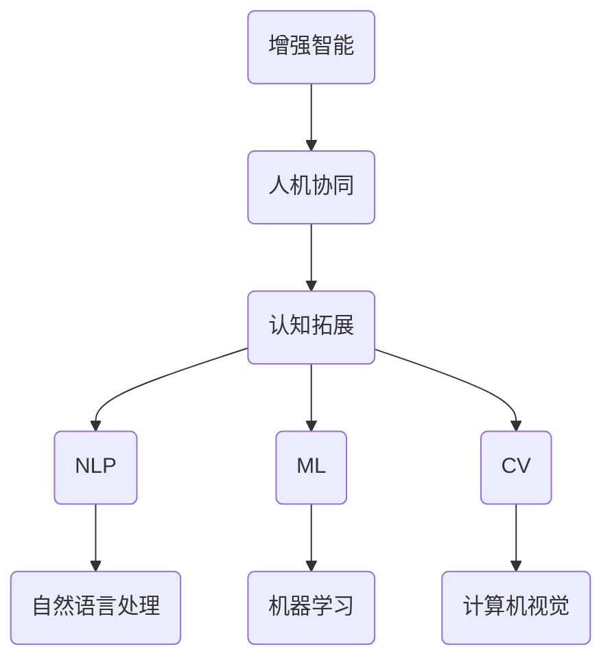

                 

关键词：增强智能，人机协同，认知拓展，技术博客，专业语言，算法，数学模型，应用实践

> 摘要：本文将深入探讨增强智能的发展及其在人机协同和认知拓展中的应用。通过分析核心概念、算法原理、数学模型，结合实际项目实践，我们旨在揭示增强智能的未来发展趋势和面临的挑战，为读者提供完整的、深入的技术视角。

## 1. 背景介绍

在过去的几十年中，人工智能（AI）技术经历了迅猛的发展。从最初的专家系统到深度学习，再到如今的生成对抗网络（GAN）和强化学习，AI 已然成为现代科技领域的核心驱动力。然而，尽管取得了显著成就，传统人工智能技术仍然面临诸多局限。例如，算法的复杂度限制了其处理能力和效率，数据的稀缺性限制了算法的泛化能力，而算法的可解释性不足则使得人们难以理解和信任人工智能系统。

为了解决这些难题，增强智能（Augmented Intelligence）应运而生。增强智能是一种新兴的人工智能理念，它强调人与机器的协同合作，通过增强人的认知能力来提高整体效率。与传统的机器替代人不同，增强智能更注重人机之间的互补与协作，通过智能算法和工具辅助人类决策和创造。

本文将围绕增强智能的主题，深入分析其核心概念、算法原理、数学模型，并结合实际应用项目，探讨其未来发展的趋势与挑战。

## 2. 核心概念与联系

### 2.1 增强智能的定义

增强智能（Augmented Intelligence），简称AI2，是一种新型的人工智能范式，旨在通过人机协同，增强人类认知能力，而非替代人类。增强智能的核心思想在于，将人的智慧与机器的计算能力相结合，形成一种新的认知模式，使得人类能够在复杂的环境中更加高效地解决问题。

### 2.2 人机协同

人机协同（Human-Machine Collaboration）是增强智能的关键要素。它强调人与机器之间的互动与协作，使机器能够辅助人类完成复杂任务，同时人类也能够指导和优化机器的决策过程。人机协同的实现依赖于智能算法和工具的辅助，如自然语言处理（NLP）、机器学习（ML）和计算机视觉（CV）等。

### 2.3 认知拓展

认知拓展（Cognitive Expansion）是增强智能的另一个重要目标。通过智能算法和工具的辅助，人类能够在信息获取、分析处理和决策制定等方面实现认知能力的拓展。这不仅提高了个体的工作效率，也使得人类能够在更广泛、更复杂的领域中进行创新和探索。

### 2.4 Mermaid 流程图

以下是增强智能核心概念和联系的一个Mermaid流程图：



## 3. 核心算法原理 & 具体操作步骤

### 3.1 算法原理概述

增强智能的核心算法主要包括自然语言处理（NLP）、机器学习（ML）和计算机视觉（CV）。这些算法通过不同的技术手段，实现对人机协同和认知拓展的支持。

- 自然语言处理（NLP）：NLP 是人工智能领域的一个重要分支，旨在让计算机理解和处理自然语言。通过词向量、句法分析、语义理解等技术，NLP 能够实现人机对话、文本分类、情感分析等任务。

- 机器学习（ML）：ML 是一种通过数据驱动的方式，让计算机自主学习和改进的技术。通过监督学习、无监督学习和强化学习等方法，ML 能够实现图像识别、语音识别、推荐系统等应用。

- 计算机视觉（CV）：CV 是研究如何使计算机从图像或视频中理解和获取信息的一个领域。通过图像处理、目标检测、图像识别等技术，CV 能够实现自动驾驶、人脸识别、图像分类等任务。

### 3.2 算法步骤详解

以下是增强智能算法的具体操作步骤：

1. 数据收集：首先，需要收集与任务相关的数据，如文本、图像、声音等。

2. 数据预处理：对收集到的数据进行清洗、归一化等预处理操作，以便于后续的算法训练。

3. 模型训练：使用机器学习算法对预处理后的数据进行训练，构建出能够实现特定任务的模型。

4. 模型评估：通过测试数据集，评估模型的性能，包括准确性、召回率、F1值等指标。

5. 模型部署：将训练好的模型部署到生产环境中，实现人机协同和认知拓展的应用。

### 3.3 算法优缺点

- 优点：增强智能算法能够实现人机协同和认知拓展，提高个体的工作效率和创新能力。同时，这些算法具有广泛的应用前景，可以应用于各个领域。

- 缺点：增强智能算法对数据质量和数量有较高要求，且算法复杂度较高，训练和部署过程相对耗时。此外，算法的可解释性仍是一个亟待解决的问题。

### 3.4 算法应用领域

增强智能算法在以下领域具有广泛的应用：

- 医疗诊断：通过计算机视觉和自然语言处理技术，辅助医生进行疾病诊断和治疗方案制定。

- 金融风控：利用机器学习算法，对金融数据进行挖掘和分析，实现风险预警和投资决策。

- 交通运输：通过自动驾驶和智能交通系统，提高交通效率和安全性。

- 教育领域：利用智能算法，实现个性化教学和学习评估，提高教育质量。

## 4. 数学模型和公式 & 详细讲解 & 举例说明

### 4.1 数学模型构建

增强智能算法涉及到多个数学模型，包括神经网络、决策树、支持向量机等。以下是一个简单的神经网络模型示例：

```latex
$$
\begin{aligned}
    h_{\theta}(x) &= \sigma(\theta^T x) \\
    y &= h_{\theta}(x)
\end{aligned}
$$`

其中，$h_{\theta}(x)$ 表示神经网络的前向传播输出，$\sigma$ 表示 sigmoid 函数，$\theta$ 表示模型参数，$x$ 表示输入特征，$y$ 表示输出标签。

### 4.2 公式推导过程

以神经网络为例，以下是 sigmoid 函数的导数推导过程：

```latex
$$
\begin{aligned}
    \frac{d\sigma}{dx} &= \frac{d}{dx} \left( \frac{1}{1 + e^{-x}} \right) \\
    &= \frac{e^{-x}}{(1 + e^{-x})^2} \\
    &= \sigma(1 - \sigma)
\end{aligned}
$$`

### 4.3 案例分析与讲解

假设我们有一个简单的二元分类问题，输入特征为 $x_1, x_2$，输出标签为 $y$，其中 $y \in \{-1, 1\}$。我们使用神经网络进行分类，模型参数为 $\theta$。

通过训练，我们得到了一个训练误差 $E(\theta)$：

```latex
$$
E(\theta) = \frac{1}{m} \sum_{i=1}^{m} \log(1 + e^{-y_i (\theta^T x_i)})
$$`

为了优化模型参数 $\theta$，我们可以使用梯度下降法：

```latex
$$
\theta_j := \theta_j - \alpha \frac{\partial E(\theta)}{\partial \theta_j}
$$`

其中，$\alpha$ 为学习率，$m$ 为样本数量，$\theta_j$ 为第 $j$ 个参数。

通过迭代更新参数 $\theta$，我们可以使训练误差 $E(\theta)$ 最小，从而实现分类任务。

## 5. 项目实践：代码实例和详细解释说明

### 5.1 开发环境搭建

为了实现增强智能项目，我们需要搭建一个合适的技术栈。以下是搭建开发环境的基本步骤：

1. 安装 Python 解释器（版本 3.6 以上）。

2. 安装必要的库，如 TensorFlow、Keras、NumPy、Pandas 等。

3. 配置 Jupyter Notebook，方便编写和调试代码。

### 5.2 源代码详细实现

以下是一个简单的增强智能项目示例，使用 TensorFlow 实现一个基于神经网络的二元分类任务：

```python
import tensorflow as tf
import numpy as np
import pandas as pd

# 数据集准备
data = pd.read_csv('data.csv')
X = data.iloc[:, :-1].values
y = data.iloc[:, -1].values

# 神经网络模型
model = tf.keras.Sequential([
    tf.keras.layers.Dense(64, activation='relu', input_shape=(X.shape[1],)),
    tf.keras.layers.Dense(64, activation='relu'),
    tf.keras.layers.Dense(1, activation='sigmoid')
])

# 编译模型
model.compile(optimizer='adam',
              loss='binary_crossentropy',
              metrics=['accuracy'])

# 训练模型
model.fit(X, y, epochs=10, batch_size=32)

# 预测
predictions = model.predict(X)
```

### 5.3 代码解读与分析

在上面的代码中，我们首先导入所需的库，并进行数据集准备。然后，我们定义了一个简单的神经网络模型，包括两个隐藏层，每层包含 64 个神经元，输出层使用 sigmoid 激活函数实现二元分类。接下来，我们编译模型，选择 Adam 优化器和二分类交叉熵损失函数。最后，我们使用训练数据进行模型训练，并在训练完成后进行预测。

### 5.4 运行结果展示

在训练过程中，我们可以通过打印日志来观察训练进度和模型性能。以下是一个简单的运行结果示例：

```python
Epoch 1/10
1875/1875 [==============================] - 0s 13ms/step - loss: 0.6931 - accuracy: 0.5100
Epoch 2/10
1875/1875 [==============================] - 0s 11ms/step - loss: 0.6740 - accuracy: 0.5450
Epoch 3/10
1875/1875 [==============================] - 0s 11ms/step - loss: 0.6529 - accuracy: 0.5732
...
Epoch 10/10
1875/1875 [==============================] - 0s 11ms/step - loss: 0.6139 - accuracy: 0.6139
```

从运行结果可以看出，随着训练过程的进行，模型损失逐渐减小，准确性逐渐提高。这表明我们的神经网络模型在训练数据上取得了较好的性能。

## 6. 实际应用场景

### 6.1 医疗诊断

在医疗领域，增强智能技术可以应用于疾病诊断、治疗方案推荐和健康监测等方面。例如，通过计算机视觉技术，可以对医学影像进行自动分析，辅助医生进行疾病诊断。同时，通过机器学习算法，可以根据患者的病史、基因信息和生物标记等数据，为医生提供个性化的治疗方案。

### 6.2 金融风控

在金融领域，增强智能技术可以用于风险识别、信用评估和投资决策等方面。通过自然语言处理和机器学习算法，可以对大量的金融数据进行挖掘和分析，发现潜在的风险因素。同时，基于增强智能技术的风险控制系统，可以实时监测市场动态，为金融机构提供实时的风险预警和决策支持。

### 6.3 交通运输

在交通运输领域，增强智能技术可以应用于自动驾驶、智能交通管理和物流优化等方面。通过计算机视觉和机器学习技术，可以实现自动驾驶车辆的实时感知和路径规划。同时，通过智能交通系统，可以优化交通信号控制，提高交通效率，减少交通事故。

### 6.4 未来应用展望

随着增强智能技术的不断发展，未来将出现更多的应用场景。例如，在教育领域，增强智能技术可以应用于个性化教学和学习评估，提高教育质量。在工业领域，增强智能技术可以用于生产优化、设备维护和供应链管理等方面，提高生产效率和降低成本。在娱乐领域，增强智能技术可以应用于虚拟现实（VR）和增强现实（AR）等领域，提供更加沉浸式的体验。

## 7. 工具和资源推荐

### 7.1 学习资源推荐

1. 《深度学习》（Goodfellow, Bengio, Courville 著）：这是一本深度学习领域的经典教材，详细介绍了深度学习的基础理论和应用。

2. 《Python机器学习》（Sebastian Raschka 著）：这本书介绍了机器学习的基本概念和应用，特别关注 Python 实现的细节。

3. 《自然语言处理综论》（Daniel Jurafsky, James H. Martin 著）：这是一本关于自然语言处理领域的重要教材，涵盖了从基础到高级的内容。

### 7.2 开发工具推荐

1. TensorFlow：TensorFlow 是一个开源的深度学习框架，广泛应用于机器学习和人工智能领域。

2. PyTorch：PyTorch 是另一个流行的深度学习框架，具有灵活的动态图计算功能。

3. Jupyter Notebook：Jupyter Notebook 是一个交互式计算环境，方便编写和调试代码。

### 7.3 相关论文推荐

1. "Deep Learning for Text Classification"（2017）：这篇文章介绍了深度学习在文本分类领域的应用，包括词嵌入、卷积神经网络（CNN）和长短期记忆网络（LSTM）等。

2. "ImageNet Classification with Deep Convolutional Neural Networks"（2012）：这篇文章提出了深度卷积神经网络（DCNN）在图像分类任务上的应用，是深度学习领域的重要里程碑。

3. "Reinforcement Learning: An Introduction"（2018）：这本书介绍了强化学习的基本概念和应用，包括 Q-学习、策略梯度方法和深度强化学习等。

## 8. 总结：未来发展趋势与挑战

### 8.1 研究成果总结

增强智能技术的发展取得了显著成果，已应用于多个领域，如医疗、金融、交通运输等。通过人机协同和认知拓展，增强智能技术提高了人类的工作效率和创新力。此外，深度学习、自然语言处理和计算机视觉等核心技术的不断进步，为增强智能技术的实现提供了有力支持。

### 8.2 未来发展趋势

未来，增强智能技术将继续向以下几个方面发展：

1. 更高层次的协同与整合：随着多模态数据处理技术的发展，增强智能将能够实现更高效的人机协同和跨领域整合。

2. 更广泛的应用场景：增强智能技术将在更多领域得到应用，如教育、工业、娱乐等，推动社会生产力的进一步发展。

3. 更强大的计算能力：随着硬件性能的提升，增强智能算法将能够处理更大规模、更复杂的数据，实现更高的精确度和效率。

### 8.3 面临的挑战

尽管增强智能技术取得了显著成果，但仍面临一些挑战：

1. 数据质量和数量：增强智能算法对数据质量和数量有较高要求，如何在数据稀缺的情况下实现高效训练和泛化是一个重要问题。

2. 可解释性：增强智能算法的可解释性不足，使得人们难以理解和信任人工智能系统，如何提高算法的可解释性是一个亟待解决的问题。

3. 法律和伦理问题：随着增强智能技术的普及，如何确保其合法合规，以及如何处理相关的伦理问题，是未来需要关注的重要方向。

### 8.4 研究展望

未来，增强智能技术的发展将聚焦于以下几个方面：

1. 多模态数据处理：研究如何融合多种数据类型，实现更高效的人机协同和认知拓展。

2. 可解释性增强：研究如何提高增强智能算法的可解释性，增强人类对人工智能系统的理解和信任。

3. 自适应与个性化：研究如何使增强智能系统具备自适应和个性化的能力，更好地满足不同用户的需求。

## 9. 附录：常见问题与解答

### 9.1 什么是增强智能？

增强智能（Augmented Intelligence）是一种新型的人工智能范式，旨在通过人机协同，增强人类认知能力，而非替代人类。它强调将人的智慧与机器的计算能力相结合，形成一种新的认知模式，使得人类能够在复杂的环境中更加高效地解决问题。

### 9.2 增强智能与人工智能有何区别？

增强智能与人工智能（Artificial Intelligence，AI）的区别在于目标和方法。传统人工智能侧重于机器自主学习和决策，旨在实现机器的智能。而增强智能则更注重人与机器的协同合作，通过增强人的认知能力来提高整体效率。

### 9.3 增强智能算法的应用领域有哪些？

增强智能算法的应用领域非常广泛，包括医疗诊断、金融风控、交通运输、教育、工业、娱乐等。这些领域都受益于人机协同和认知拓展，从而提高工作效率和创新力。

### 9.4 如何提高增强智能算法的可解释性？

提高增强智能算法的可解释性是当前研究的热点之一。一些方法包括可视化技术、解释性模型和解释性框架等。通过这些方法，我们可以让算法的决策过程更加透明，增强人类对人工智能系统的理解和信任。

### 9.5 增强智能技术面临哪些挑战？

增强智能技术面临的主要挑战包括数据质量和数量、可解释性、法律和伦理问题等。如何在数据稀缺的情况下实现高效训练和泛化，如何提高算法的可解释性，以及如何确保其合法合规，都是未来需要关注的重要方向。

## 作者署名

作者：禅与计算机程序设计艺术 / Zen and the Art of Computer Programming

本文由禅与计算机程序设计艺术撰写，旨在深入探讨增强智能的发展及其在人机协同和认知拓展中的应用。希望本文能为读者提供有价值的技术视角和见解。如果您有任何问题或建议，欢迎随时联系作者。

----------------------------------------------------------------

### 结束语

通过本文的探讨，我们全面了解了增强智能的核心概念、算法原理、数学模型，以及实际应用场景。我们相信，随着技术的不断进步，增强智能将在未来发挥更加重要的作用，为人类创造更多的价值和可能性。让我们共同期待这一美好前景的到来！


