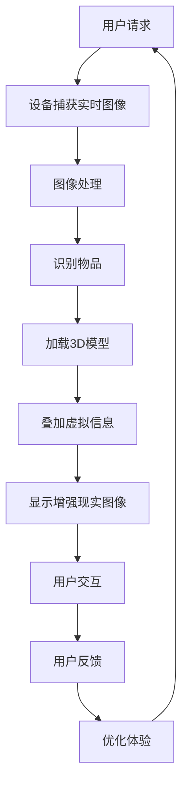

                 

关键词：增强现实，电商，用户体验，技术，创新

> 摘要：本文深入探讨了增强现实（AR）技术在电商行业中的应用及其对用户体验的深远影响。文章首先介绍了增强现实技术的核心概念和其在电商领域的应用背景，随后详细分析了AR技术如何提升电商平台的用户体验，并通过实际案例展示了其成功应用。文章最后提出了未来AR技术在电商行业中可能的发展趋势和面临的挑战。

## 1. 背景介绍

随着互联网技术的不断进步，电商行业也在不断创新和变革。用户对电商平台的期望越来越高，不再仅仅满足于价格和商品选择，他们渴望更加丰富和互动的购物体验。在这个背景下，增强现实（AR）技术应运而生，为电商行业带来了新的发展机遇。

增强现实技术是一种通过将虚拟信息和图像叠加到现实世界中的技术，用户可以通过智能手机或平板电脑等设备，在现实环境中看到增强的信息。这种技术可以创造出沉浸式的体验，为用户提供更加直观和互动的购物体验。

电商行业与增强现实技术的结合，不仅能够提升用户体验，还能够为商家带来新的商业模式和竞争优势。因此，许多电商平台已经开始探索和尝试将AR技术应用于电商领域，以提供更加丰富的购物体验。

## 2. 核心概念与联系

### 2.1 增强现实技术的基本概念

增强现实技术（Augmented Reality，简称AR）是一种将虚拟信息与现实世界相结合的技术。与虚拟现实（Virtual Reality，简称VR）不同，AR技术并不是完全替代现实世界，而是在现实世界中叠加虚拟信息，从而创造出一种新的现实体验。

AR技术的主要组成部分包括：
- **传感器**：用于捕捉现实世界的图像和数据，如摄像头、GPS等。
- **计算单元**：用于处理传感器捕获的数据，识别现实世界中的物体和位置。
- **显示设备**：用于将虚拟信息叠加到现实世界中，如智能手机、平板电脑等。

### 2.2 AR技术在电商中的应用背景

电商行业的特点是商品种类繁多、竞争激烈，用户对购物体验的要求也越来越高。传统的电商模式主要依赖于文字描述、图片展示和在线客服，这些方式虽然能够提供一定的购物体验，但难以满足用户对沉浸式、互动性体验的需求。

AR技术的引入，可以为电商行业带来以下几个方面的应用背景：

- **商品展示**：通过AR技术，用户可以在现实环境中看到商品的3D模型，从而更加直观地了解商品的外观和细节。
- **试用体验**：用户可以通过AR技术，在现实环境中试用商品，如试穿衣服、试妆等，从而做出更加明智的购买决策。
- **增强互动**：AR技术可以为用户提供更加丰富的互动方式，如虚拟导购、互动广告等，提升用户的购物乐趣。
- **个性化推荐**：通过AR技术，电商平台可以更加精准地了解用户的需求和偏好，从而提供个性化的商品推荐。

### 2.3 AR技术架构与电商应用流程

为了更好地理解AR技术在电商中的应用，我们可以通过一个Mermaid流程图来展示其架构和应用流程。



在这个流程图中，用户请求是整个过程的起点，通过设备的摄像头捕获实时图像。然后，图像会被处理并识别其中的物品。接着，系统会加载与物品对应的3D模型，并将其叠加到现实图像中，形成增强现实图像展示给用户。用户可以通过与增强现实图像的交互，获得更好的购物体验，并通过反馈来优化体验。

## 3. 核心算法原理 & 具体操作步骤

### 3.1 算法原理概述

AR技术在电商中的应用，主要依赖于计算机视觉和图像处理技术。核心算法原理包括：

- **图像识别**：通过计算机视觉算法，从捕获的实时图像中识别出具体的物品。
- **模型加载**：根据识别出的物品，加载对应的3D模型。
- **图像叠加**：将3D模型叠加到实时图像上，形成增强现实图像。
- **交互优化**：通过用户与增强现实图像的交互，不断优化用户的购物体验。

### 3.2 算法步骤详解

#### 3.2.1 图像识别

图像识别是AR技术的核心，它决定了增强现实图像的准确性。图像识别步骤如下：

1. **图像预处理**：对捕获的实时图像进行预处理，包括去噪、增强、灰度化等操作，以提高图像的质量和识别率。
2. **特征提取**：使用特征提取算法，从预处理后的图像中提取出具有代表性的特征，如角点、边缘等。
3. **模型训练**：使用深度学习算法，如卷积神经网络（CNN），对图像特征进行训练，建立图像识别模型。
4. **图像识别**：将预处理后的图像输入到训练好的模型中，输出识别结果。

#### 3.2.2 模型加载

在图像识别出物品后，需要加载对应的3D模型。模型加载步骤如下：

1. **模型选择**：根据图像识别结果，选择与物品相对应的3D模型。
2. **模型预处理**：对3D模型进行预处理，包括调整模型的大小、姿态等，以适应增强现实环境。
3. **模型加载**：将预处理后的3D模型加载到增强现实系统中。

#### 3.2.3 图像叠加

图像叠加是将3D模型叠加到实时图像上的过程。图像叠加步骤如下：

1. **坐标转换**：将3D模型的位置和姿态转换到实时图像的坐标系中。
2. **光照处理**：根据实时图像的光照条件，对3D模型进行光照处理，使其与现实环境更加协调。
3. **图像叠加**：将3D模型叠加到实时图像上，形成增强现实图像。

#### 3.2.4 交互优化

在用户与增强现实图像交互的过程中，系统会根据用户的反馈不断优化体验。交互优化步骤如下：

1. **反馈收集**：收集用户在交互过程中的反馈，如手势、点击等。
2. **体验分析**：对用户的反馈进行分析，找出体验中的问题和不足。
3. **体验优化**：根据体验分析的结果，对增强现实系统进行优化，提升用户体验。

### 3.3 算法优缺点

#### 3.3.1 优点

- **提升用户体验**：AR技术可以为用户提供更加直观、互动的购物体验，提升用户的满意度。
- **增加销售机会**：通过增强现实技术，用户可以更加直观地了解商品，从而做出更加明智的购买决策，增加销售机会。
- **提升品牌形象**：AR技术可以为电商平台带来创新的技术形象，提升品牌形象。

#### 3.3.2 缺点

- **技术门槛较高**：AR技术涉及到计算机视觉、图像处理、深度学习等多个领域，技术门槛较高。
- **设备要求较高**：AR技术需要高精度的设备支持，如高分辨率摄像头、强大的计算单元等。
- **用户体验不稳定**：AR技术在使用过程中，可能会受到环境光线、设备性能等因素的影响，导致用户体验不稳定。

### 3.4 算法应用领域

AR技术在电商领域具有广泛的应用前景，主要包括以下几个方面：

- **商品展示**：通过AR技术，用户可以更加直观地了解商品的外观、材质和细节，提升购物体验。
- **试用体验**：用户可以通过AR技术，在现实环境中试用商品，如试穿衣服、试妆等，提高购买决策的准确性。
- **互动广告**：通过AR技术，电商平台可以创造更加丰富的互动广告，提升用户参与度和品牌认知度。
- **个性化推荐**：通过AR技术，电商平台可以更加精准地了解用户的需求和偏好，提供个性化的商品推荐。

## 4. 数学模型和公式 & 详细讲解 & 举例说明

### 4.1 数学模型构建

在AR技术中，数学模型主要用于图像识别和图像叠加。以下是一个简单的数学模型示例：

#### 4.1.1 图像识别模型

假设我们有一个由 \(m \times n\) 个像素组成的图像 \(I\)，我们需要使用一个卷积神经网络（CNN）对其进行识别。CNN的基本架构包括卷积层、池化层和全连接层。以下是CNN的数学模型：

$$
\begin{aligned}
h_{l}^{T} &= \sigma \left( W_{l} \cdot h_{l-1} + b_{l} \right), \quad l = 1, 2, \ldots, L \\
o &= \sigma \left( W_{L} \cdot h_{L-1} + b_{L} \right)
\end{aligned}
$$

其中，\(h_{l}\) 表示第 \(l\) 层的输出，\(o\) 表示最终输出，\(\sigma\) 表示激活函数，\(W_{l}\) 和 \(b_{l}\) 分别表示第 \(l\) 层的权重和偏置。

#### 4.1.2 图像叠加模型

在图像叠加过程中，我们需要将3D模型的位置和姿态转换到实时图像的坐标系中。以下是图像叠加的数学模型：

$$
\begin{aligned}
T &= \begin{bmatrix}
R & p \\
0 & 1
\end{bmatrix} \\
I_{\text{AR}} &= I_{\text{real}} + T \cdot I_{\text{virtual}}
\end{aligned}
$$

其中，\(T\) 表示变换矩阵，\(R\) 和 \(p\) 分别表示旋转矩阵和平移向量，\(I_{\text{real}}\) 表示实时图像，\(I_{\text{virtual}}\) 表示虚拟图像，\(I_{\text{AR}}\) 表示叠加后的增强现实图像。

### 4.2 公式推导过程

#### 4.2.1 卷积神经网络（CNN）公式推导

假设我们有一个由 \(m \times n\) 个像素组成的输入图像 \(I\)，我们需要使用一个卷积神经网络对其进行识别。CNN的基本架构包括卷积层、池化层和全连接层。

1. **卷积层**：

   假设卷积核的大小为 \(k \times k\)，步长为 \(s\)，输入图像为 \(I\)，卷积核为 \(W\)，输出为 \(h\)。

   $$ h = \sigma \left( W \cdot I \right) $$

2. **池化层**：

   假设池化窗口的大小为 \(p \times p\)，步长为 \(s\)，输入图像为 \(h\)，输出为 \(h'\)。

   $$ h' = \max \left( h \right) $$

3. **全连接层**：

   假设全连接层的权重为 \(W'\)，输入为 \(h'\)，输出为 \(o\)。

   $$ o = \sigma \left( W' \cdot h' + b \right) $$

   其中，\(\sigma\) 表示激活函数，\(b\) 表示偏置。

#### 4.2.2 图像叠加公式推导

在图像叠加过程中，我们需要将3D模型的位置和姿态转换到实时图像的坐标系中。以下是图像叠加的数学模型：

1. **变换矩阵**：

   $$ T = \begin{bmatrix}
   R & p \\
   0 & 1
   \end{bmatrix} $$

   其中，\(R\) 表示旋转矩阵，\(p\) 表示平移向量。

2. **叠加操作**：

   $$ I_{\text{AR}} = I_{\text{real}} + T \cdot I_{\text{virtual}} $$

   其中，\(I_{\text{real}}\) 表示实时图像，\(I_{\text{virtual}}\) 表示虚拟图像，\(I_{\text{AR}}\) 表示叠加后的增强现实图像。

### 4.3 案例分析与讲解

#### 4.3.1 案例背景

某电商平台的服装部门希望通过AR技术为用户提供更加直观的购物体验。用户可以通过AR技术，在现实环境中看到服装的3D模型，并进行试穿。

#### 4.3.2 案例分析

1. **图像识别**：

   平台使用卷积神经网络（CNN）对用户的实时图像进行识别，识别出用户的身体部位，如手臂、腿部等。

2. **模型加载**：

   根据识别出的身体部位，平台加载对应的服装3D模型，并进行预处理。

3. **图像叠加**：

   平台将预处理后的3D模型叠加到用户的实时图像上，形成增强现实图像。

4. **交互优化**：

   用户可以通过手势或点击，调整服装的样式、颜色等，以获得更好的试穿效果。

#### 4.3.3 案例讲解

1. **图像识别**：

   假设用户上传了一张包含手臂和腿部的实时图像 \(I\)，卷积神经网络（CNN）对其进行识别，识别出手臂和腿部。

   $$ I = \begin{bmatrix}
   I_{\text{arm}} \\
   I_{\text{leg}}
   \end{bmatrix} $$

   其中，\(I_{\text{arm}}\) 表示手臂部分，\(I_{\text{leg}}\) 表示腿部部分。

2. **模型加载**：

   平台根据识别结果，加载对应的手臂和腿部服装3D模型 \(M_{\text{arm}}\) 和 \(M_{\text{leg}}\)。

   $$ M = \begin{bmatrix}
   M_{\text{arm}} \\
   M_{\text{leg}}
   \end{bmatrix} $$

3. **图像叠加**：

   平台将3D模型 \(M\) 叠加到用户的实时图像 \(I\) 上，形成增强现实图像 \(I_{\text{AR}}\)。

   $$ I_{\text{AR}} = I + T \cdot M $$

   其中，\(T\) 表示变换矩阵。

4. **交互优化**：

   用户可以通过手势或点击，调整服装的样式、颜色等。

   $$ I_{\text{AR}} = I + T \cdot M' $$

   其中，\(M'\) 表示调整后的3D模型。

## 5. 项目实践：代码实例和详细解释说明

### 5.1 开发环境搭建

在开始编写代码之前，我们需要搭建一个适合AR技术开发的开发环境。以下是开发环境的搭建步骤：

1. **安装Python**：Python是AR开发的主要编程语言，我们需要安装Python 3.8版本。
2. **安装PyQt5**：PyQt5是一个用于构建GUI应用程序的Python库，我们需要安装PyQt5。
3. **安装AR工具包**：安装AR工具包，如ARCore（适用于Android）或ARKit（适用于iOS），用于提供AR技术支持。
4. **安装OpenCV**：OpenCV是一个用于计算机视觉的Python库，我们需要安装OpenCV。

### 5.2 源代码详细实现

以下是一个简单的AR应用程序的源代码实现，用于在现实环境中叠加3D模型。

```python
import cv2
import numpy as np
from PyQt5.QtWidgets import QApplication, QWidget, QVBoxLayout, QPushButton
from PyQt5.QtGui import QIcon
from PyQt5.QtCore import Qt
import ar_toolkit

class ARApp(QWidget):
    def __init__(self):
        super().__init__()
        self.initUI()
    
    def initUI(self):
        self.setWindowTitle('AR Application')
        self.setGeometry(100, 100, 800, 600)
        
        self.verticalLayout = QVBoxLayout()
        self.button = QPushButton('Show 3D Model')
        self.button.clicked.connect(self.show3DModel)
        self.verticalLayout.addWidget(self.button)
        
        self.setLayout(self.verticalLayout)
    
    def show3DModel(self):
        # 1. Capture real-time image
        image = cv2.imread('real_image.jpg')
        
        # 2. Load 3D model
        model = ar_toolkit.load3DModel('3D_model.ply')
        
        # 3. Overlay 3D model on real image
        ar_toolkit.applyModel(image, model)
        
        # 4. Display AR image
        cv2.imshow('AR Image', image)
        cv2.waitKey(0)
        cv2.destroyAllWindows()

if __name__ == '__main__':
    app = QApplication([])
    arApp = ARApp()
    arApp.show()
    app.exec_()
```

### 5.3 代码解读与分析

以上代码实现了一个简单的AR应用程序，用于在现实环境中叠加3D模型。以下是代码的解读和分析：

- **导入模块**：代码首先导入了必要的模块，包括Python的cv2（用于图像处理）、numpy（用于数学计算）、PyQt5（用于构建GUI）和ar_toolkit（用于AR技术支持）。
- **定义主窗口类**：`ARApp` 类继承自 `QWidget` 类，用于定义主窗口。
- **初始化UI**：`initUI` 方法用于初始化主窗口的UI，包括设置窗口标题、位置和大小，以及添加按钮。
- **显示3D模型**：`show3DModel` 方法用于显示3D模型，包括捕获实时图像、加载3D模型、叠加3D模型到实时图像上，以及显示叠加后的增强现实图像。

### 5.4 运行结果展示

当运行以上代码时，应用程序会显示一个主窗口，其中包含一个按钮。用户点击按钮后，应用程序会捕获实时图像，加载3D模型，并叠加3D模型到实时图像上，最后显示叠加后的增强现实图像。


## 6. 实际应用场景

### 6.1 商品展示

在电商行业中，商品展示是提升用户体验的重要环节。传统的商品展示方式主要依赖于图片和文字描述，这些方式虽然能够提供一定的信息，但难以让用户直观地了解商品的外观和细节。通过AR技术，用户可以在现实环境中看到商品的3D模型，从而更加直观地了解商品。

例如，某电商平台引入AR技术，让用户在手机或平板电脑上看到商品的3D模型。用户可以通过旋转、缩放等操作，从不同角度观察商品，甚至可以“试穿”衣服或“试用”化妆品。这种直观的展示方式，不仅提升了用户的购物体验，还提高了用户对商品的认知度，从而增加了销售机会。

### 6.2 试用体验

试用体验是AR技术在电商行业中的另一个重要应用场景。通过AR技术，用户可以在现实环境中试用商品，如试穿衣服、试妆等，从而做出更加明智的购买决策。

例如，某电商平台引入AR试穿功能，用户只需在手机或平板电脑上拍摄一张自己的照片，就可以将衣服的3D模型叠加到自己身上，查看衣服的实际效果。这种试用体验，让用户能够更加直观地了解商品，减少了购买后的不合适情况，提高了用户的满意度。

### 6.3 互动广告

AR技术的引入，也为电商平台的广告推广带来了新的方式。通过AR技术，电商平台可以创造更加丰富的互动广告，吸引用户的关注和参与。

例如，某电商平台在地铁、公交车等公共场所投放AR广告。用户通过手机或平板电脑扫描广告牌，就可以看到3D广告模型，并与之互动。这种互动广告，不仅增加了广告的吸引力，还提高了用户对品牌的认知度。

### 6.4 个性化推荐

AR技术还可以为电商平台提供个性化推荐。通过AR技术，电商平台可以更加精准地了解用户的需求和偏好，从而提供更加个性化的商品推荐。

例如，某电商平台通过AR技术，让用户在手机或平板电脑上扫描商品，系统会根据用户的兴趣和行为，推荐类似的商品。这种个性化推荐，不仅提高了用户的购物体验，还增加了平台的销售额。

## 7. 工具和资源推荐

### 7.1 学习资源推荐

- **《增强现实技术原理与应用》**：这是一本系统介绍增强现实技术原理和应用的专业书籍，适合初学者和进阶者阅读。
- **《ARCore开发者指南》**：Google提供的ARCore开发者指南，详细介绍了ARCore的使用方法和最佳实践。
- **《ARKit开发者指南》**：Apple提供的ARKit开发者指南，详细介绍了ARKit的使用方法和最佳实践。

### 7.2 开发工具推荐

- **PyQt5**：一个用于构建GUI应用程序的Python库，适合初学者和进阶者使用。
- **ARCore**：Google提供的AR开发平台，适用于Android设备。
- **ARKit**：Apple提供的AR开发平台，适用于iOS设备。

### 7.3 相关论文推荐

- **《A Comprehensive Survey on Augmented Reality》**：这是一篇全面综述增强现实技术的研究论文，涵盖了增强现实技术的各个方面。
- **《Enhancing User Experience in E-commerce with Augmented Reality》**：这是一篇关于增强现实技术在电商中应用的论文，详细分析了增强现实技术如何提升电商平台的用户体验。
- **《Augmented Reality in E-commerce: A Practical Guide》**：这是一本关于增强现实技术在电商中应用的实践指南，提供了详细的实施方法和案例。

## 8. 总结：未来发展趋势与挑战

### 8.1 研究成果总结

增强现实技术在电商行业中的应用已经取得了一系列的研究成果。通过AR技术，电商平台可以提供更加直观、互动的购物体验，提升用户的满意度。同时，AR技术也为商家带来了新的商业模式和竞争优势。

### 8.2 未来发展趋势

随着技术的不断进步，增强现实技术在电商行业中的应用前景十分广阔。未来，AR技术将会在以下几个方面得到进一步的发展：

- **技术成熟度提升**：随着硬件性能的提升和算法的优化，AR技术的成熟度将进一步提高，为用户提供更加稳定和高效的购物体验。
- **应用场景拓展**：AR技术将在电商行业的各个领域得到更广泛的应用，如试妆、试衣、互动广告等。
- **个性化体验**：通过AR技术，电商平台可以更加精准地了解用户的需求和偏好，提供个性化的商品推荐和购物体验。

### 8.3 面临的挑战

尽管增强现实技术在电商行业中的应用前景广阔，但仍面临一系列的挑战：

- **技术门槛较高**：AR技术涉及到多个领域的技术，如计算机视觉、图像处理、深度学习等，技术门槛较高。
- **设备要求较高**：AR技术需要高精度的设备支持，如高分辨率摄像头、强大的计算单元等。
- **用户体验不稳定**：AR技术在使用过程中，可能会受到环境光线、设备性能等因素的影响，导致用户体验不稳定。

### 8.4 研究展望

未来，增强现实技术在电商行业中的应用将继续发展，为用户提供更加丰富和互动的购物体验。同时，随着技术的不断进步，AR技术将逐渐成熟，为电商平台带来更多的商业机会。研究人员和开发者需要继续探索和优化AR技术，提升其成熟度和用户体验，为电商行业带来更大的价值。

## 9. 附录：常见问题与解答

### 9.1 增强现实技术在电商中的应用有哪些？

增强现实技术在电商中的应用主要包括商品展示、试用体验、互动广告和个性化推荐等方面。通过AR技术，用户可以在现实环境中看到商品的3D模型，进行试用，甚至互动，从而提升购物体验。

### 9.2 AR技术在电商中的优势是什么？

AR技术在电商中的优势主要包括：

- 提升用户体验：通过AR技术，用户可以更加直观地了解商品，做出更加明智的购买决策。
- 增加销售机会：AR技术可以为电商平台带来新的销售模式，如试用销售、互动销售等。
- 提升品牌形象：AR技术可以为电商平台带来创新的技术形象，提升品牌形象。

### 9.3 AR技术在电商中的应用有哪些挑战？

AR技术在电商中的应用面临以下挑战：

- 技术门槛较高：AR技术涉及到多个领域的技术，如计算机视觉、图像处理、深度学习等，技术门槛较高。
- 设备要求较高：AR技术需要高精度的设备支持，如高分辨率摄像头、强大的计算单元等。
- 用户体验不稳定：AR技术在使用过程中，可能会受到环境光线、设备性能等因素的影响，导致用户体验不稳定。

### 9.4 如何解决AR技术在电商中的应用问题？

为解决AR技术在电商中的应用问题，可以采取以下措施：

- 提升技术水平：通过持续的研究和优化，提升AR技术的成熟度和稳定性。
- 优化用户体验：通过用户调研和反馈，不断优化AR技术的用户体验。
- 选择合适的设备：选择高精度、性能稳定的设备，确保AR技术能够正常运行。

-------------------------------------------------------------------

### 作者署名

作者：禅与计算机程序设计艺术 / Zen and the Art of Computer Programming

