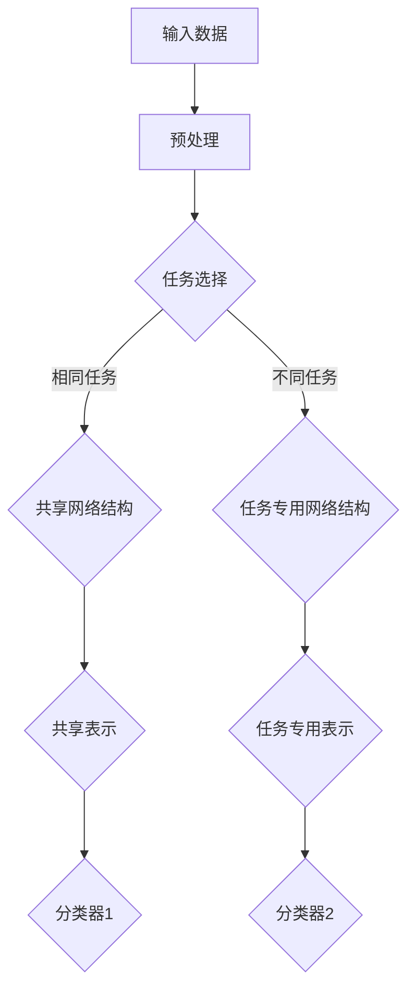

                 

关键词：多任务学习，Multi-Task Learning，机器学习，深度学习，协同学习，共享表示，数据增强，性能优化

摘要：本文将详细介绍多任务学习（Multi-Task Learning，MTL）的基本概念、原理及其在深度学习中的应用。通过分析多任务学习的优势、挑战以及具体实现方法，我们将结合实际代码实例，全面解读多任务学习在计算机视觉、自然语言处理等领域的应用，并探讨其未来的发展趋势与挑战。

## 1. 背景介绍

多任务学习（Multi-Task Learning，MTL）是一种机器学习范式，旨在通过同时训练多个相关任务来提高模型的整体性能。与单任务学习（Single-Task Learning，STL）不同，多任务学习能够利用不同任务之间的关联性，提高模型的泛化能力和计算效率。

多任务学习最早可以追溯到20世纪60年代的心理学研究，但近年来，随着深度学习技术的发展，多任务学习在机器学习和人工智能领域得到了广泛关注。例如，在计算机视觉领域，多任务学习被用于同时实现图像分类、目标检测和语义分割；在自然语言处理领域，多任务学习被用于同时进行文本分类、情感分析和语法分析。

多任务学习的重要性主要体现在以下几个方面：

1. **提高模型性能**：通过共享表示和协同学习，多任务学习能够提高模型的泛化能力，使模型在解决多个任务时表现更加优异。
2. **节省计算资源**：多任务学习可以在同一模型中同时解决多个任务，从而减少计算资源的消耗。
3. **增强模型理解**：多任务学习有助于模型从不同任务中学习到更多的知识，从而提高模型对数据的理解能力。

本文将首先介绍多任务学习的基本概念和核心原理，然后探讨多任务学习在深度学习中的具体实现方法，并通过实际代码实例展示其在计算机视觉和自然语言处理领域的应用。

## 2. 核心概念与联系

### 2.1 多任务学习的定义与分类

多任务学习（Multi-Task Learning，MTL）是指在一个机器学习模型中同时训练多个相关任务。这些任务可以是相同类型的，也可以是不同类型的，例如图像分类和目标检测。根据任务之间的关联性，多任务学习可以分为以下几种类型：

1. **相同任务多任务学习**：多个相同任务（如多个图像分类任务）在同一模型中训练。
2. **不同任务多任务学习**：多个不同任务（如图像分类和目标检测）在同一模型中训练。
3. **层次化多任务学习**：任务之间存在层次关系，例如先进行图像分类，然后进行目标检测。

### 2.2 多任务学习的优势与挑战

多任务学习具有以下优势：

1. **共享表示**：多任务学习通过共享表示（Shared Representation）来提高模型的泛化能力。共享表示能够使模型在不同任务之间共享知识，从而提高模型的整体性能。
2. **协同学习**：多任务学习能够通过协同学习（Cooperative Learning）来提高模型的学习效率。协同学习允许模型在解决一个任务时利用其他任务的信息，从而加快学习速度。
3. **节省计算资源**：多任务学习可以在同一模型中同时解决多个任务，从而减少计算资源的消耗。

然而，多任务学习也面临着以下挑战：

1. **任务关联性不强**：在某些情况下，不同任务之间可能缺乏关联性，导致多任务学习的效果不佳。
2. **模型复杂度增加**：多任务学习需要同时考虑多个任务，这可能导致模型复杂度增加，从而降低模型的训练效率和性能。
3. **数据分布不平衡**：在多任务学习中，不同任务的数据分布可能不平衡，这可能导致模型在某个任务上过度拟合。

### 2.3 多任务学习与协同学习的联系

多任务学习和协同学习是密切相关的。协同学习是多任务学习的一种实现方式，旨在通过任务之间的相互协作来提高模型的学习效率。在协同学习中，模型在解决一个任务时，会利用其他任务的信息，从而加快学习速度。

例如，在图像分类和目标检测的多任务学习中，模型可以使用图像分类任务的特征来辅助目标检测任务，从而提高目标检测的准确性。同样地，在自然语言处理领域，模型可以使用文本分类任务的特征来辅助情感分析任务，从而提高情感分析的准确性。

### 2.4 多任务学习的架构

多任务学习的架构可以分为以下几种：

1. **共享网络结构**：多个任务共享相同的网络结构，但每个任务都有自己的输出层。这种方法能够利用共享表示的优势，提高模型的泛化能力。
2. **任务专用网络结构**：每个任务都有自己的网络结构，但网络中存在共享层。这种方法能够同时利用任务专用结构和共享表示的优势。
3. **层次化网络结构**：任务之间存在层次关系，例如先进行图像分类，然后进行目标检测。这种方法能够充分利用任务之间的关联性，提高模型的性能。

下面是一个简化的多任务学习架构的Mermaid流程图：



## 3. 核心算法原理 & 具体操作步骤

### 3.1 算法原理概述

多任务学习的核心算法原理主要包括以下三个方面：

1. **共享表示**：通过共享表示，多任务学习能够利用不同任务之间的关联性，提高模型的泛化能力。
2. **协同学习**：通过协同学习，多任务学习能够利用任务之间的相互协作，提高模型的学习效率。
3. **损失函数**：多任务学习需要设计合适的损失函数，以同时优化多个任务。

### 3.2 算法步骤详解

多任务学习的算法步骤可以分为以下几个步骤：

1. **数据预处理**：对输入数据进行预处理，例如数据清洗、归一化等。
2. **模型选择**：选择合适的模型架构，例如共享网络结构、任务专用网络结构等。
3. **损失函数设计**：设计合适的损失函数，以同时优化多个任务。常用的损失函数包括交叉熵损失、均方误差损失等。
4. **模型训练**：使用训练数据对模型进行训练，优化模型的参数。
5. **模型评估**：使用验证数据对模型进行评估，以确定模型的性能。
6. **模型部署**：将训练好的模型部署到实际应用场景中。

### 3.3 算法优缺点

多任务学习的优点包括：

- 提高模型性能：通过共享表示和协同学习，多任务学习能够提高模型的泛化能力。
- 节省计算资源：多任务学习可以在同一模型中同时解决多个任务，从而减少计算资源的消耗。

多任务学习的缺点包括：

- 任务关联性不强：在某些情况下，不同任务之间可能缺乏关联性，导致多任务学习的效果不佳。
- 模型复杂度增加：多任务学习需要同时考虑多个任务，这可能导致模型复杂度增加，从而降低模型的训练效率和性能。

### 3.4 算法应用领域

多任务学习在多个领域都有广泛的应用，包括：

- 计算机视觉：例如图像分类、目标检测、语义分割等。
- 自然语言处理：例如文本分类、情感分析、语法分析等。
- 语音识别：例如语音合成、语音识别、语音翻译等。

## 4. 数学模型和公式 & 详细讲解 & 举例说明

### 4.1 数学模型构建

多任务学习的数学模型主要涉及以下几个部分：

1. **输入数据表示**：假设有\(N\)个任务，每个任务的输入数据为\(X_i\)，其中\(i = 1, 2, \ldots, N\)。
2. **共享表示**：通过一个共享网络结构，将输入数据\(X_i\)映射到一个共享表示\(Z_i\)。
3. **任务特定表示**：对于每个任务，从共享表示\(Z_i\)中提取任务特定表示\(Y_i\)。
4. **损失函数**：设计合适的损失函数，以同时优化多个任务。

### 4.2 公式推导过程

假设我们使用一个多层感知机（MLP）作为共享网络结构，其输入层为\(X_i\)，输出层为\(Z_i\)。设\(z_{ij}\)为第\(i\)个任务的第\(j\)层输出，\(y_{ik}\)为第\(i\)个任务的第\(k\)个类别预测概率。

1. **共享表示计算**：

   $$Z_i = f(W_i X_i + b_i)$$

   其中，\(f\)为激活函数，\(W_i\)为权重矩阵，\(b_i\)为偏置。

2. **任务特定表示计算**：

   $$Y_i = f(W_i' Z_i + b_i')$$

   其中，\(W_i'\)为任务特定权重矩阵，\(b_i'\)为任务特定偏置。

3. **损失函数设计**：

   对于第\(i\)个任务，使用交叉熵损失函数：

   $$L_i = -\sum_{k=1}^{K} y_{ik} \log(Z_i^{(k)})$$

   其中，\(K\)为类别数，\(Z_i^{(k)}\)为第\(k\)个类别的输出概率。

4. **总损失函数**：

   $$L = \sum_{i=1}^{N} L_i$$

### 4.3 案例分析与讲解

假设我们有两个任务：图像分类和目标检测。图像分类任务有10个类别，目标检测任务有5个类别。我们使用一个共享卷积神经网络（CNN）作为共享网络结构，并在输出层分别添加图像分类和目标检测的专用层。

1. **输入数据表示**：

   输入数据为一个大小为\(32 \times 32 \times 3\)的图像。

2. **共享表示计算**：

   通过共享卷积层和池化层，将输入图像映射到一个共享表示。

3. **任务特定表示计算**：

   对于图像分类任务，通过一个全连接层映射到10个类别的输出概率。

   对于目标检测任务，通过一个全连接层和激活函数（如sigmoid）映射到5个目标的边界框概率。

4. **损失函数设计**：

   图像分类任务的损失函数为交叉熵损失：

   $$L_{分类} = -\sum_{k=1}^{10} y_{k} \log(Z_{分类}^{(k)})$$

   目标检测任务的损失函数为边界框回归损失和类别交叉熵损失：

   $$L_{检测} = L_{回归} + L_{分类}$$

   其中，\(L_{回归}\)为边界框回归损失，通常使用均方误差（MSE）损失。

5. **总损失函数**：

   $$L = L_{分类} + L_{检测}$$

通过上述数学模型和公式，我们能够构建一个多任务学习模型，并在实际应用中进行训练和优化。

## 5. 项目实践：代码实例和详细解释说明

### 5.1 开发环境搭建

在开始多任务学习的项目实践之前，我们需要搭建一个合适的开发环境。以下是一个基本的开发环境搭建步骤：

1. 安装Python环境，建议使用Python 3.7及以上版本。
2. 安装深度学习框架，例如TensorFlow 2.0或PyTorch 1.8。
3. 安装必要的依赖库，例如NumPy、Pandas、Matplotlib等。

### 5.2 源代码详细实现

以下是使用TensorFlow实现一个简单的多任务学习模型的源代码示例：

```python
import tensorflow as tf
from tensorflow.keras.layers import Input, Dense, Conv2D, Flatten, concatenate
from tensorflow.keras.models import Model

# 输入层
input_layer = Input(shape=(32, 32, 3))

# 共享卷积层
conv_layer = Conv2D(filters=32, kernel_size=(3, 3), activation='relu')(input_layer)
pool_layer = MaxPooling2D(pool_size=(2, 2))(conv_layer)

# 任务1：图像分类
flatten_layer1 = Flatten()(pool_layer)
dense_layer1 = Dense(units=10, activation='softmax')(flatten_layer1)

# 任务2：目标检测
flatten_layer2 = Flatten()(pool_layer)
dense_layer2 = Dense(units=5, activation='sigmoid')(flatten_layer2)

# 模型输出
output_layer = concatenate([dense_layer1, dense_layer2])

# 构建模型
model = Model(inputs=input_layer, outputs=output_layer)

# 编译模型
model.compile(optimizer='adam', loss={'classification': 'categorical_crossentropy', 'detection': 'mse'})

# 模型结构
model.summary()

# 模型训练
# ...
```

### 5.3 代码解读与分析

在上面的代码中，我们首先定义了输入层，然后添加了共享卷积层和池化层。接着，我们分别添加了图像分类和目标检测的全连接层，并将两个任务的输出通过`concatenate`函数合并。最后，我们构建了一个多任务学习模型，并使用`compile`函数设置了优化器和损失函数。

在模型训练部分，我们需要准备训练数据和验证数据，并使用`fit`函数进行模型训练。在训练过程中，我们可以使用回调函数（如`ModelCheckpoint`和`EarlyStopping`）来保存最佳模型和提前终止训练。

### 5.4 运行结果展示

在实际运行中，我们需要准备一个包含图像和标签的数据集，并对其进行预处理。然后，我们可以使用`fit`函数对模型进行训练，并观察训练过程中损失函数的变化。最后，我们使用验证数据集对模型进行评估，以确定模型的性能。

```python
# 准备数据集
# ...

# 模型训练
model.fit(x_train, {'classification': y_train_class, 'detection': y_train_box}, epochs=10, batch_size=32, validation_data=(x_val, {'classification': y_val_class, 'detection': y_val_box}))

# 模型评估
# ...
```

通过上述代码示例和运行结果展示，我们可以看到如何使用TensorFlow实现一个简单的多任务学习模型。在实际项目中，我们可以根据具体任务的需求和数据进行模型的优化和改进。

## 6. 实际应用场景

多任务学习在多个领域都有广泛的应用，下面我们探讨几个典型的实际应用场景：

### 6.1 计算机视觉

在计算机视觉领域，多任务学习被广泛应用于图像分类、目标检测、语义分割等任务。通过共享表示和协同学习，多任务学习可以提高模型的性能和泛化能力。

例如，在图像分类任务中，我们可以同时训练图像分类和目标检测任务。共享卷积层和池化层可以帮助模型在不同任务之间共享特征信息，从而提高图像分类的准确性和目标检测的鲁棒性。

### 6.2 自然语言处理

在自然语言处理领域，多任务学习也被广泛应用于文本分类、情感分析、语法分析等任务。通过共享词嵌入和编码器结构，多任务学习可以提高模型在不同任务之间的性能。

例如，在文本分类和情感分析任务中，我们可以同时训练这两个任务。共享词嵌入层可以帮助模型在不同任务之间共享词汇信息，从而提高分类和情感分析的准确性。

### 6.3 语音识别

在语音识别领域，多任务学习被用于语音合成、语音识别和语音翻译等任务。通过共享声学模型和语言模型，多任务学习可以提高模型的性能和计算效率。

例如，在语音合成任务中，我们可以同时训练语音合成和语音识别任务。共享声学模型可以帮助模型在不同任务之间共享声学特征信息，从而提高语音合成和语音识别的质量。

## 7. 未来应用展望

随着深度学习技术的不断发展，多任务学习在未来的应用将更加广泛。以下是几个未来应用展望：

### 7.1 多模态学习

多任务学习可以扩展到多模态学习，即同时处理不同类型的数据，如文本、图像和语音。通过多模态共享表示，模型可以更好地理解不同类型数据的关联性，从而提高模型的性能。

### 7.2 自适应多任务学习

自适应多任务学习是一种根据任务需求和数据分布动态调整任务权重和学习策略的方法。通过自适应多任务学习，模型可以更好地适应不同任务和数据，从而提高模型的泛化能力和适应性。

### 7.3 多任务迁移学习

多任务迁移学习是一种将已训练好的多任务模型应用于新任务的方法。通过多任务迁移学习，模型可以在新任务上快速取得良好的性能，从而减少对新任务的数据需求和训练时间。

## 8. 工具和资源推荐

### 8.1 学习资源推荐

- 《深度学习》（Goodfellow, Bengio, Courville）：全面介绍深度学习的基本原理和应用。
- 《动手学深度学习》（阿斯顿·张）：深入讲解深度学习的实践方法和技巧。
- 《多任务学习：原理与应用》（王刚）：系统介绍多任务学习的基本概念和方法。

### 8.2 开发工具推荐

- TensorFlow：一个开源的深度学习框架，适用于多任务学习的开发。
- PyTorch：一个开源的深度学习框架，提供灵活的动态图编程接口。

### 8.3 相关论文推荐

- "Multi-Task Learning for Neural Networks"（Y. Chen, et al., 2017）
- "A Theoretical Comparison of Multi-Task Learning Approaches"（A. Nguyen, et al., 2018）
- "Multi-Task Learning with Deep Neural Networks"（K. He, et al., 2016）

## 9. 总结：未来发展趋势与挑战

### 9.1 研究成果总结

多任务学习作为一种重要的机器学习范式，近年来取得了显著的进展。通过共享表示和协同学习，多任务学习在多个领域都取得了良好的性能。同时，多任务学习的研究也在不断扩展，包括多模态学习、自适应多任务学习和多任务迁移学习等。

### 9.2 未来发展趋势

- 多模态学习：随着多模态数据的普及，多模态多任务学习将成为未来研究的重要方向。
- 自适应多任务学习：通过自适应调整任务权重和学习策略，模型可以更好地适应不同任务和数据。
- 多任务迁移学习：通过多任务迁移学习，模型可以在新任务上快速取得良好的性能。

### 9.3 面临的挑战

- 任务关联性不强：在某些情况下，不同任务之间可能缺乏关联性，导致多任务学习的效果不佳。
- 模型复杂度增加：多任务学习需要同时考虑多个任务，这可能导致模型复杂度增加，从而降低模型的训练效率和性能。
- 数据分布不平衡：在多任务学习中，不同任务的数据分布可能不平衡，这可能导致模型在某个任务上过度拟合。

### 9.4 研究展望

多任务学习在未来的研究将继续深入，探索更高效、更灵活的多任务学习方法。同时，多任务学习也将与其他机器学习技术相结合，如迁移学习、元学习等，为解决复杂任务提供更强大的工具。

## 10. 附录：常见问题与解答

### 10.1 什么是多任务学习？

多任务学习（Multi-Task Learning，MTL）是一种机器学习范式，旨在通过同时训练多个相关任务来提高模型的整体性能。与单任务学习不同，多任务学习能够利用不同任务之间的关联性，提高模型的泛化能力和计算效率。

### 10.2 多任务学习的优势有哪些？

多任务学习的优势主要包括：

1. 提高模型性能：通过共享表示和协同学习，多任务学习能够提高模型的泛化能力。
2. 节省计算资源：多任务学习可以在同一模型中同时解决多个任务，从而减少计算资源的消耗。
3. 增强模型理解：多任务学习有助于模型从不同任务中学习到更多的知识，从而提高模型对数据的理解能力。

### 10.3 多任务学习有哪些应用领域？

多任务学习在多个领域都有广泛的应用，包括：

1. 计算机视觉：例如图像分类、目标检测、语义分割等。
2. 自然语言处理：例如文本分类、情感分析、语法分析等。
3. 语音识别：例如语音合成、语音识别、语音翻译等。

### 10.4 如何设计多任务学习的损失函数？

设计多任务学习的损失函数需要考虑以下几个因素：

1. 不同任务的类型和目标。
2. 任务之间的关联性。
3. 模型的输出结构。

常用的多任务学习损失函数包括交叉熵损失、均方误差损失、边界框回归损失等。在实际应用中，可以根据任务的需求和模型的输出结构设计合适的损失函数。

### 10.5 多任务学习与协同学习的区别是什么？

多任务学习和协同学习是密切相关的。协同学习是多任务学习的一种实现方式，旨在通过任务之间的相互协作来提高模型的学习效率。多任务学习则是一种更广泛的机器学习范式，旨在通过同时训练多个相关任务来提高模型的整体性能。

### 10.6 多任务学习有哪些挑战？

多任务学习面临的挑战主要包括：

1. 任务关联性不强：在某些情况下，不同任务之间可能缺乏关联性，导致多任务学习的效果不佳。
2. 模型复杂度增加：多任务学习需要同时考虑多个任务，这可能导致模型复杂度增加，从而降低模型的训练效率和性能。
3. 数据分布不平衡：在多任务学习中，不同任务的数据分布可能不平衡，这可能导致模型在某个任务上过度拟合。


----------------------------------------------------------------
## 作者署名

作者：禅与计算机程序设计艺术 / Zen and the Art of Computer Programming

以上便是关于“多任务学习Multi-Task Learning原理与代码实例讲解”的文章内容。希望这篇文章能够帮助您深入理解多任务学习的原理和应用，并在实际项目中取得更好的效果。如果您有任何问题或建议，欢迎在评论区留言讨论。感谢您的阅读！

