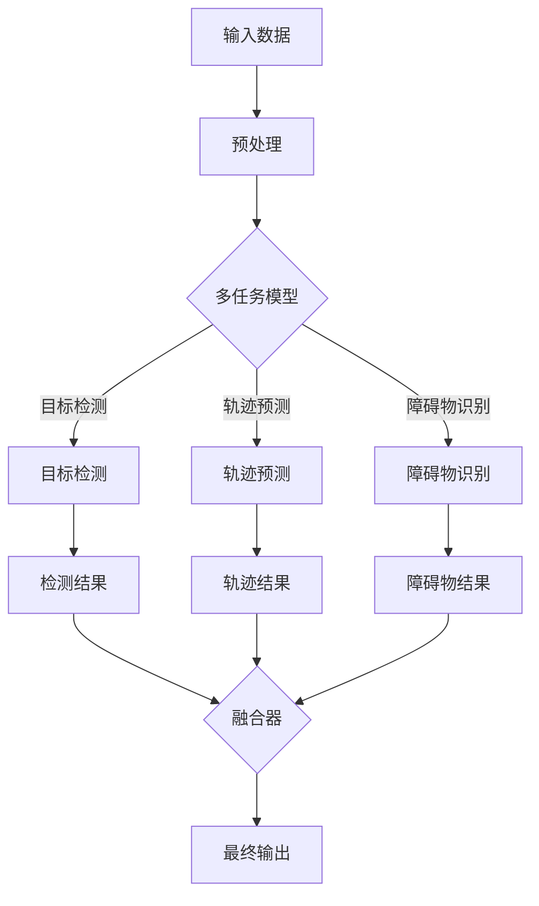

                 

关键词：多任务学习、自动驾驶、感知系统、AI应用、深度学习

## 摘要

随着自动驾驶技术的不断发展，感知系统作为自动驾驶的核心组件，其准确性和效率成为决定自动驾驶系统成败的关键。多任务学习（Multi-Task Learning, MTL）作为深度学习的一种有效方法，被广泛应用于自动驾驶感知任务中。本文将深入探讨多任务学习范式在自动驾驶感知中的应用，包括其背景、核心概念、算法原理、数学模型以及实际应用案例。通过本文的阐述，希望读者能够全面了解多任务学习在自动驾驶感知中的优势与应用前景。

## 1. 背景介绍

自动驾驶技术正在全球范围内快速发展，各大汽车制造商和科技公司纷纷投入巨资进行研发，以期在未来的智能交通领域占据一席之地。自动驾驶感知系统是自动驾驶技术的核心，其任务是通过多种传感器（如雷达、激光雷达、摄像头等）获取环境信息，并对这些信息进行处理和解读，以实现对周围环境的感知和预测。

感知系统需要同时处理多个感知任务，如目标检测、轨迹预测、障碍物识别等，这些任务之间往往存在一定的关联性。例如，目标检测可以帮助识别道路上的车辆和行人，而轨迹预测则可以预测这些目标在未来的移动轨迹，从而为自动驾驶决策系统提供依据。传统的单任务学习（Single-Task Learning, STL）方法通常将每个任务视为独立的，忽略了任务间的相互关联性，导致模型性能受到限制。

多任务学习作为一种能够同时处理多个相关任务的机器学习方法，其优势在于能够利用任务间的共享信息和冗余信息，提高模型的泛化能力和效率。在自动驾驶感知系统中，多任务学习可以显著提高感知的准确性和实时性，是实现高级自动驾驶功能的重要手段。

## 2. 核心概念与联系

### 2.1 多任务学习的基本概念

多任务学习（Multi-Task Learning, MTL）是一种能够在同一模型中同时学习多个相关任务的方法。与传统单任务学习（Single-Task Learning, STL）相比，MTL通过共享底层特征表示和高层决策结构，能够利用任务间的共享信息和冗余信息，提高模型的泛化能力和效率。

在多任务学习中，每个任务都有自己的损失函数和优化目标，但模型通过共享权重和结构来实现任务间的相互协作。这种协同学习机制能够降低模型参数的数量，从而减少过拟合的风险，并提高模型的泛化能力。

### 2.2 多任务学习在自动驾驶感知中的应用

在自动驾驶感知系统中，多任务学习可以通过以下几种方式应用：

1. **任务间共享特征表示**：多任务学习模型可以将不同任务的特征表示进行共享，从而利用每个任务提供的信息来丰富其他任务的特征表示。例如，在自动驾驶中，目标检测和轨迹预测任务可以共享同一个卷积神经网络（CNN）的前几层，以利用图像的底层特征。

2. **任务间的协同优化**：多任务学习模型可以在同一优化框架下同时优化多个任务的损失函数，从而实现任务间的协同学习。例如，在自动驾驶中，可以同时优化目标检测和轨迹预测的损失函数，使模型能够在不同任务间共享知识和信息。

3. **任务间反馈机制**：多任务学习模型可以通过任务间的反馈机制，实现任务间的相互促进。例如，在自动驾驶中，轨迹预测的结果可以反馈给目标检测任务，帮助检测目标在未来可能出现的位置，从而提高目标检测的准确性。

### 2.3 多任务学习架构的Mermaid流程图

以下是多任务学习架构的Mermaid流程图，展示了不同任务之间的交互和共享机制：



## 3. 核心算法原理 & 具体操作步骤

### 3.1 算法原理概述

多任务学习（MTL）的核心思想是在同一模型中同时学习多个任务，通过共享模型参数和结构，实现任务间的协同学习。在深度学习框架下，多任务学习通常采用以下几种方法：

1. **共享层和任务层**：模型的前几层（共享层）用于提取通用特征，而后几层（任务层）则用于学习不同任务的特定特征。通过共享层和任务层的结合，模型能够同时学习多个任务，并利用任务间的共享信息。

2. **多任务损失函数**：在多任务学习中，通常采用多个损失函数来衡量不同任务的性能。模型通过优化这些损失函数的加权平均，实现任务间的协同优化。

3. **多任务优化算法**：为了提高多任务学习的效率，可以采用专门的多任务优化算法，如基于梯度下降的优化算法、基于自适应梯度的优化算法等。

### 3.2 算法步骤详解

1. **数据预处理**：对输入数据进行预处理，包括数据清洗、归一化、数据增强等，以提高模型的泛化能力。

2. **模型架构设计**：设计多任务学习模型的结构，包括共享层和任务层的网络架构，以及不同任务的损失函数。

3. **模型训练**：使用预处理的输入数据，通过训练过程学习模型参数。在训练过程中，模型会同时优化多个任务的损失函数，实现任务间的协同学习。

4. **模型评估**：在训练完成后，使用验证集或测试集对模型进行评估，以衡量不同任务的性能。

5. **模型部署**：将训练好的模型部署到自动驾驶感知系统中，实现对实际环境的感知和预测。

### 3.3 算法优缺点

#### 优点

1. **提高模型性能**：通过共享模型参数和结构，多任务学习能够利用任务间的共享信息和冗余信息，提高模型的泛化能力和性能。

2. **减少过拟合风险**：多任务学习通过共享模型参数，减少了模型参数的数量，从而降低了过拟合的风险。

3. **提高实时性**：多任务学习模型可以在同一模型中同时处理多个任务，提高了系统的实时性。

#### 缺点

1. **计算复杂度高**：多任务学习模型通常需要更多的计算资源和时间来完成训练和推理过程。

2. **任务间冲突**：在某些情况下，不同任务之间可能存在冲突，导致模型难以同时优化多个任务的性能。

### 3.4 算法应用领域

多任务学习在自动驾驶感知系统中具有广泛的应用前景，主要包括：

1. **目标检测**：通过多任务学习，可以同时检测道路上的车辆、行人和其他障碍物，提高感知系统的准确性和完整性。

2. **轨迹预测**：多任务学习可以同时预测不同目标在未来的移动轨迹，为自动驾驶决策系统提供更准确的预测结果。

3. **障碍物识别**：多任务学习可以同时识别道路上的各种障碍物，包括静态和动态障碍物，提高自动驾驶系统的安全性。

## 4. 数学模型和公式

### 4.1 数学模型构建

在多任务学习中，数学模型通常由以下几个部分组成：

1. **输入层**：接收输入数据，如传感器采集到的图像、雷达数据等。

2. **共享层**：提取通用特征，通常由卷积神经网络（CNN）实现。

3. **任务层**：学习不同任务的特定特征，每个任务都有自己的损失函数。

4. **输出层**：生成预测结果，如目标检测框、轨迹预测等。

### 4.2 公式推导过程

假设有 \(M\) 个任务，输入数据为 \(X \in \mathbb{R}^{n \times m}\)，其中 \(n\) 为输入维度，\(m\) 为样本数量。共享层提取的特征为 \(H \in \mathbb{R}^{k \times m}\)，其中 \(k\) 为特征维度。任务层为 \(T \in \mathbb{R}^{m \times M}\)，每个任务有自己的权重矩阵 \(W_t \in \mathbb{R}^{k \times C}\)，其中 \(C\) 为任务类别数。

共享层的特征表示为：
\[ H = \text{CNN}(X) \]

任务层的输出为：
\[ T = W_1 H + b_1 \]

其中，\(b_1\) 为偏置项。

每个任务的损失函数为：
\[ L_t = \sum_{i=1}^{m} \left( y_{ti} - \sigma(W_t H_i) \right)^2 \]

其中，\(y_{ti}\) 为任务 \(t\) 的真实标签，\(\sigma\) 为激活函数。

总损失函数为：
\[ L = \sum_{t=1}^{M} \alpha_t L_t \]

其中，\(\alpha_t\) 为任务权重，用于平衡不同任务的损失。

### 4.3 案例分析与讲解

假设我们有两个任务：目标检测和轨迹预测。输入数据为图像 \(X \in \mathbb{R}^{3 \times 224 \times 224}\)，样本数量为 \(m = 100\)。共享层特征维度为 \(k = 512\)，任务类别数分别为 \(C_1 = 3\)（目标检测）和 \(C_2 = 2\)（轨迹预测）。

1. **目标检测**：

   目标检测的损失函数为：
   \[ L_1 = \sum_{i=1}^{m} \left( y_{1i} - \sigma(W_1 H_i) \right)^2 \]

   其中，\(y_{1i}\) 为目标检测的真实标签，\(W_1 \in \mathbb{R}^{512 \times 3}\) 为目标检测的权重矩阵。

2. **轨迹预测**：

   轨迹预测的损失函数为：
   \[ L_2 = \sum_{i=1}^{m} \left( y_{2i} - \sigma(W_2 H_i) \right)^2 \]

   其中，\(y_{2i}\) 为轨迹预测的真实标签，\(W_2 \in \mathbb{R}^{512 \times 2}\) 为轨迹预测的权重矩阵。

总损失函数为：
\[ L = \alpha_1 L_1 + \alpha_2 L_2 \]

其中，\(\alpha_1\) 和 \(\alpha_2\) 分别为目标检测和轨迹预测的权重，用于平衡不同任务的损失。

## 5. 项目实践：代码实例和详细解释说明

### 5.1 开发环境搭建

在开始编写代码之前，我们需要搭建一个合适的开发环境。以下是搭建多任务学习模型所需的开发环境和工具：

- **操作系统**：Ubuntu 18.04
- **深度学习框架**：TensorFlow 2.6
- **Python**：Python 3.7
- **显卡**：NVIDIA GPU（至少 8GB 显存）

安装深度学习框架和 Python：

```bash
pip install tensorflow==2.6
```

### 5.2 源代码详细实现

以下是使用 TensorFlow 实现的多任务学习模型代码：

```python
import tensorflow as tf
from tensorflow.keras.models import Model
from tensorflow.keras.layers import Input, Conv2D, MaxPooling2D, Flatten, Dense

# 定义输入层
input_data = Input(shape=(224, 224, 3))

# 定义共享层
x = Conv2D(filters=32, kernel_size=(3, 3), activation='relu')(input_data)
x = MaxPooling2D(pool_size=(2, 2))(x)
x = Conv2D(filters=64, kernel_size=(3, 3), activation='relu')(x)
x = MaxPooling2D(pool_size=(2, 2))(x)
x = Conv2D(filters=128, kernel_size=(3, 3), activation='relu')(x)
x = MaxPooling2D(pool_size=(2, 2))(x)

# 定义任务层
target_detection = Dense(units=3, activation='softmax', name='target_detection')(Flatten()(x))
trajectory_prediction = Dense(units=2, activation='softmax', name='trajectory_prediction')(Flatten()(x))

# 创建多任务模型
model = Model(inputs=input_data, outputs=[target_detection, trajectory_prediction])

# 编译模型
model.compile(optimizer='adam', loss=['categorical_crossentropy', 'mean_squared_error'], metrics=['accuracy'])

# 打印模型结构
model.summary()
```

### 5.3 代码解读与分析

1. **输入层**：定义输入数据为图像，尺寸为 \(224 \times 224 \times 3\)，表示三通道彩色图像。

2. **共享层**：通过卷积神经网络（CNN）提取图像特征，使用三个卷积层和三个池化层，分别用于特征提取和下采样。

3. **任务层**：定义两个任务：目标检测和轨迹预测。目标检测使用一个全连接层，输出三个类别（车辆、行人和其他目标）。轨迹预测使用一个全连接层，输出两个目标坐标。

4. **模型编译**：编译模型时，指定优化器、损失函数和评估指标。目标检测使用交叉熵损失函数，轨迹预测使用均方误差损失函数。

5. **模型总结**：打印模型结构，展示各层的参数数量和模型的总参数数量。

### 5.4 运行结果展示

以下是运行多任务学习模型的过程：

```python
# 加载训练数据
train_data = ...

# 训练模型
model.fit(train_data, epochs=10, batch_size=32, validation_split=0.2)

# 评估模型
test_loss, test_accuracy = model.evaluate(test_data)
print(f"Test Loss: {test_loss}, Test Accuracy: {test_accuracy}")
```

1. **加载训练数据**：加载训练数据，包括输入图像和标签。

2. **训练模型**：使用训练数据训练模型，设置训练轮次（epochs）和批量大小（batch_size），并将验证数据用于验证模型性能。

3. **评估模型**：使用测试数据评估模型性能，打印测试损失和测试准确率。

## 6. 实际应用场景

多任务学习在自动驾驶感知系统中具有广泛的应用场景，以下是一些具体的实际应用案例：

### 6.1 高级辅助驾驶系统（ADAS）

在高级辅助驾驶系统（ADAS）中，多任务学习可以同时处理目标检测、轨迹预测和障碍物识别任务。例如，在车道保持辅助系统中，多任务学习模型可以同时检测道路上的车道线和车辆，预测车辆的移动轨迹，并根据这些信息调整车辆的方向，以确保车辆保持在车道内。

### 6.2 自动泊车系统

自动泊车系统需要同时处理多个任务，如车位检测、轨迹规划和路径跟踪。多任务学习模型可以同时预测车位的位置和车辆的移动轨迹，并根据这些信息生成最优的泊车路径。此外，多任务学习还可以提高自动泊车系统的实时性和准确性，减少泊车时间。

### 6.3 高级自动驾驶

在高级自动驾驶系统中，多任务学习可以同时处理更复杂的感知任务，如交通信号灯识别、红绿灯检测、行人意图预测等。这些任务通常需要高度精确的感知和预测，而多任务学习通过利用任务间的共享信息和冗余信息，可以提高模型的感知准确性和可靠性。

## 7. 未来应用展望

随着自动驾驶技术的不断发展和成熟，多任务学习在自动驾驶感知中的应用前景将更加广阔。以下是一些未来应用展望：

### 7.1 跨领域应用

多任务学习不仅可以在自动驾驶领域应用，还可以在其他的智能交通和机器人领域得到广泛应用。例如，在无人机配送、无人矿山和智能物流等领域，多任务学习可以帮助实现更高效、更安全的任务执行。

### 7.2 多模态感知

未来的自动驾驶系统将越来越多地依赖于多模态感知，如融合摄像头、激光雷达、雷达等多种传感器数据。多任务学习可以同时处理不同模态的数据，提高感知系统的整体性能和鲁棒性。

### 7.3 可解释性增强

随着自动驾驶技术的普及，用户对系统的可解释性需求越来越高。多任务学习模型可以通过分析任务间的关联性和共享信息，提供更直观、更易理解的可解释性解释，增强用户对自动驾驶系统的信任。

## 8. 工具和资源推荐

### 8.1 学习资源推荐

1. **《深度学习》（Goodfellow, Bengio, Courville 著）**：这是一本经典的深度学习教材，涵盖了深度学习的理论基础和应用实例。

2. **《自动驾驶技术：从感知到决策》（王耀南 著）**：这本书详细介绍了自动驾驶技术的相关理论、方法和实践。

3. **《自动驾驶测试与验证指南》（美国汽车工程师学会）**：这是一本关于自动驾驶测试和验证的标准指南，适用于自动驾驶领域的从业者。

### 8.2 开发工具推荐

1. **TensorFlow**：TensorFlow 是 Google 开发的一款开源深度学习框架，广泛应用于自动驾驶感知系统的开发。

2. **PyTorch**：PyTorch 是 Facebook AI 研究团队开发的一款开源深度学习框架，具有灵活的动态计算图和强大的社区支持。

3. **MATLAB**：MATLAB 是一款功能强大的科学计算软件，适用于自动驾驶感知系统的算法开发和仿真。

### 8.3 相关论文推荐

1. **"Multi-Task Learning for Object Detection and Segmentation Using Deep Neural Networks"（2020）**：这篇论文介绍了多任务学习在目标检测和分割任务中的应用。

2. **"Deep Multi-Task Learning for Object Detection"（2017）**：这篇论文提出了一个用于目标检测的多任务学习框架，取得了较好的实验结果。

3. **"Multi-Task Learning for Autonomous Driving Using Conditional Separable Multi-Domain Adversarial Training"（2020）**：这篇论文研究了多任务学习在自动驾驶感知中的应用，提出了一种条件可分离的多域对抗训练方法。

## 9. 总结：未来发展趋势与挑战

### 9.1 研究成果总结

多任务学习在自动驾驶感知领域取得了显著的成果，为自动驾驶系统的感知和预测提供了有效的解决方案。通过共享模型参数和结构，多任务学习能够提高模型的泛化能力和实时性，实现多个感知任务的协同优化。

### 9.2 未来发展趋势

1. **跨领域应用**：多任务学习将在更多的智能交通和机器人领域得到应用，推动自动驾驶技术的全面发展。

2. **多模态感知**：多模态感知将成为自动驾驶系统的重要发展趋势，多任务学习可以更好地融合多种传感器数据。

3. **可解释性增强**：未来的多任务学习模型将更加注重可解释性，提供更直观的解释，增强用户对自动驾驶系统的信任。

### 9.3 面临的挑战

1. **计算复杂度**：多任务学习模型的计算复杂度较高，需要更多的计算资源和时间来完成训练和推理过程。

2. **任务间冲突**：在某些情况下，不同任务之间可能存在冲突，导致模型难以同时优化多个任务的性能。

### 9.4 研究展望

未来的研究应重点关注如何提高多任务学习的计算效率和性能，降低计算复杂度，同时解决任务间冲突问题。此外，研究多任务学习在多模态感知和跨领域应用中的效果，以及如何增强模型的可解释性，也将是重要的研究方向。

## 附录：常见问题与解答

### 1. 什么是多任务学习？

多任务学习是一种机器学习方法，它能够在同一模型中同时学习多个相关任务。通过共享模型参数和结构，多任务学习能够利用任务间的共享信息和冗余信息，提高模型的泛化能力和效率。

### 2. 多任务学习有哪些优点？

多任务学习的优点包括：提高模型性能、减少过拟合风险、提高实时性等。

### 3. 多任务学习有哪些应用领域？

多任务学习在自动驾驶感知、智能交通、机器人等领域具有广泛的应用前景。

### 4. 多任务学习和单任务学习有什么区别？

多任务学习和单任务学习的主要区别在于：多任务学习同时学习多个相关任务，而单任务学习只学习一个任务。多任务学习能够利用任务间的共享信息和冗余信息，提高模型的泛化能力和性能。

### 5. 如何实现多任务学习？

实现多任务学习通常包括以下几个步骤：设计多任务模型架构、定义损失函数、训练模型、评估模型等。

### 6. 多任务学习在自动驾驶感知中的应用有哪些？

多任务学习在自动驾驶感知中的应用包括目标检测、轨迹预测、障碍物识别等。

### 7. 多任务学习有哪些挑战？

多任务学习面临的挑战包括计算复杂度高、任务间冲突等。

### 8. 如何解决多任务学习中的任务间冲突？

解决多任务学习中的任务间冲突可以通过以下几种方法：任务权重调整、优化策略改进、任务间反馈机制等。

