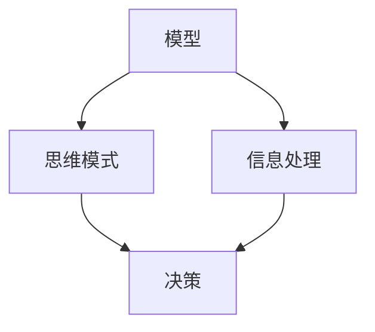

                 

关键词：多元模型思维，管理者，认知水平，模型构建，算法原理，数学模型，项目实践，未来展望

> 摘要：本文将深入探讨多元模型思维在提升管理者认知水平方面的作用。通过解析核心概念、算法原理、数学模型和实际项目案例，我们旨在为读者提供一种全面的视角，帮助他们在复杂的管理环境中做出更明智的决策。

## 1. 背景介绍

在信息化、全球化的时代背景下，管理者的角色越来越重要。他们不仅需要具备丰富的业务知识，还需要具备高度的洞察力和决策能力。然而，随着信息量的爆炸式增长和业务环境的复杂化，传统单一思维方式已无法满足现代管理的需求。此时，多元模型思维应运而生。

多元模型思维是指管理者通过运用多种不同的模型，从多个角度分析问题，从而提高认知水平和决策能力。这种思维方式有助于管理者更好地理解复杂问题，找到更优解决方案。

### 管理者认知水平的挑战

- **信息过载**：海量信息使得管理者难以抓住关键信息，影响决策质量。
- **思维定势**：长期从事特定领域工作，管理者容易陷入思维定势，缺乏创新性。
- **决策难度**：现代管理中面临的问题日益复杂，单一思维方式难以应对。

### 多元模型思维的优势

- **全面分析**：通过多种模型，从多个角度分析问题，提高决策的全面性和准确性。
- **突破思维定势**：打破单一思维模式，激发创新思维。
- **适应复杂环境**：能够应对现代管理中的各种复杂问题，提高决策能力。

## 2. 核心概念与联系

在探讨多元模型思维之前，我们需要了解一些核心概念和它们之间的联系。

### 模型

模型是抽象化现实世界的工具，通过简化现实问题，使其更易于分析和理解。在多元模型思维中，管理者需要掌握多种模型，如线性模型、非线性模型、模拟模型等。

### 思维模式

思维模式是指个体在解决问题时的思维方式。多元模型思维强调管理者需要具备多种思维模式，如逻辑思维、系统思维、创新思维等。

### 信息处理

信息处理是指管理者如何获取、分析和利用信息。多元模型思维强调信息处理的多样性和灵活性。

### 决策

决策是管理者在了解情况、分析问题和制定计划的基础上，做出的选择。多元模型思维有助于管理者做出更明智的决策。

### Mermaid 流程图



## 3. 核心算法原理 & 具体操作步骤

### 3.1 算法原理概述

多元模型思维的核心在于运用多种模型，从多个角度分析问题。具体操作步骤如下：

1. **确定问题**：明确需要解决的问题。
2. **选择模型**：根据问题的性质，选择合适的模型。
3. **数据收集**：收集与问题相关的数据。
4. **模型构建**：根据数据，构建模型。
5. **分析问题**：运用模型分析问题。
6. **制定方案**：根据分析结果，制定解决方案。
7. **评估与优化**：评估方案的有效性，不断优化。

### 3.2 算法步骤详解

1. **确定问题**

   管理者在面对复杂问题时，首先要明确问题的核心，以便后续分析。

2. **选择模型**

   根据问题的性质，选择合适的模型。例如，对于线性问题，可以采用线性模型；对于非线性问题，可以采用非线性模型。

3. **数据收集**

   收集与问题相关的数据。这些数据可以来自内部系统，也可以来自外部渠道。

4. **模型构建**

   根据数据，构建模型。模型可以是数学模型、模拟模型等。

5. **分析问题**

   运用模型分析问题。这一步骤需要管理者具备较强的逻辑思维能力。

6. **制定方案**

   根据分析结果，制定解决方案。解决方案需要具备可行性和有效性。

7. **评估与优化**

   评估方案的有效性，不断优化。这一步骤有助于提高决策质量。

### 3.3 算法优缺点

**优点：**

- **全面分析**：通过多种模型，从多个角度分析问题，提高决策的全面性和准确性。
- **突破思维定势**：打破单一思维模式，激发创新思维。
- **适应复杂环境**：能够应对现代管理中的各种复杂问题，提高决策能力。

**缺点：**

- **复杂性**：多元模型思维需要管理者掌握多种模型和思维模式，对管理者的要求较高。
- **时间成本**：构建和运用模型需要大量时间，可能会影响决策的及时性。

### 3.4 算法应用领域

多元模型思维广泛应用于企业管理、市场营销、金融投资等领域。以下是一些具体应用案例：

- **企业管理**：通过多元模型分析，优化公司战略和运营。
- **市场营销**：运用多元模型，制定更精准的市场营销策略。
- **金融投资**：通过多元模型，评估投资风险和回报。

## 4. 数学模型和公式 & 详细讲解 & 举例说明

### 4.1 数学模型构建

在多元模型思维中，数学模型是一种重要的工具。以下是构建数学模型的基本步骤：

1. **定义问题**：明确需要解决的问题。
2. **确定变量**：根据问题，确定相关变量。
3. **建立关系**：根据变量之间的关系，建立数学模型。
4. **求解模型**：运用数学方法，求解模型。

### 4.2 公式推导过程

以下是一个简单的线性回归模型公式推导过程：

设 $X$ 为自变量，$Y$ 为因变量，线性回归模型可以表示为：

$$Y = aX + b$$

其中，$a$ 和 $b$ 为待求参数。

为了求解 $a$ 和 $b$，我们可以使用最小二乘法。首先，计算 $X$ 和 $Y$ 的样本均值：

$$\bar{X} = \frac{1}{n}\sum_{i=1}^{n}X_i$$

$$\bar{Y} = \frac{1}{n}\sum_{i=1}^{n}Y_i$$

然后，计算残差：

$$r_i = Y_i - (aX_i + b)$$

为了使残差的平方和最小，我们可以建立目标函数：

$$J = \sum_{i=1}^{n}r_i^2$$

对 $a$ 和 $b$ 求偏导，并令偏导数为零，可以求得 $a$ 和 $b$ 的最优解：

$$\frac{\partial J}{\partial a} = 2\sum_{i=1}^{n}(X_i - \bar{X})(Y_i - \bar{Y}) - 2a\sum_{i=1}^{n}(X_i - \bar{X})^2 = 0$$

$$\frac{\partial J}{\partial b} = 2\sum_{i=1}^{n}(Y_i - \bar{Y}) - 2b\sum_{i=1}^{n}X_i = 0$$

通过解上述方程组，可以得到 $a$ 和 $b$ 的最优解。

### 4.3 案例分析与讲解

以下是一个简单的案例，用于说明多元模型思维在企业管理中的应用。

**案例背景**：某公司希望提高产品的市场份额，需要进行市场营销策略的优化。

**模型构建**：

1. **确定变量**：

   - $X_1$：广告投入
   - $X_2$：促销活动
   - $X_3$：产品价格
   - $Y$：市场份额

2. **建立关系**：

   根据市场调研数据，建立线性回归模型：

   $$Y = aX_1 + bX_2 + cX_3 + d$$

**求解模型**：

1. **数据收集**：

   收集过去一年的广告投入、促销活动和产品价格数据，以及对应的市场份额数据。

2. **模型构建**：

   将数据输入到线性回归模型中，求解参数 $a$、$b$、$c$ 和 $d$。

3. **分析问题**：

   根据模型分析，得出不同营销策略对市场份额的影响。

4. **制定方案**：

   根据分析结果，制定优化方案，例如调整广告投入、促销活动和产品价格。

5. **评估与优化**：

   评估优化方案的有效性，并根据实际情况进行调整。

## 5. 项目实践：代码实例和详细解释说明

### 5.1 开发环境搭建

为了方便读者理解和实践，我们使用 Python 作为编程语言，并结合 Scikit-learn 库进行线性回归模型的构建和求解。以下是开发环境搭建的步骤：

1. **安装 Python**：从 [Python 官网](https://www.python.org/) 下载并安装 Python。
2. **安装 Scikit-learn**：打开终端，执行以下命令：

   ```bash
   pip install scikit-learn
   ```

### 5.2 源代码详细实现

以下是一个简单的线性回归模型实现示例：

```python
import numpy as np
from sklearn.linear_model import LinearRegression

# 生成样本数据
np.random.seed(0)
X = np.random.rand(100, 1)
y = 2 + 3 * X + np.random.randn(100, 1)

# 构建线性回归模型
model = LinearRegression()
model.fit(X, y)

# 求解模型参数
a = model.coef_
b = model.intercept_

# 预测新数据
X_new = np.array([[0.5]])
y_pred = model.predict(X_new)

print("参数 a:", a)
print("参数 b:", b)
print("预测结果 y:", y_pred)
```

### 5.3 代码解读与分析

1. **数据生成**：

   使用 NumPy 库生成模拟数据，包括自变量 $X$ 和因变量 $Y$。

2. **模型构建**：

   导入 Scikit-learn 库中的 LinearRegression 类，创建线性回归模型对象。

3. **模型拟合**：

   使用 `fit()` 方法，将自变量 $X$ 和因变量 $Y$ 输入模型，进行模型拟合。

4. **参数求解**：

   使用 `coef_` 属性获取模型的斜率参数 $a$，使用 `intercept_` 属性获取模型的截距参数 $b$。

5. **预测**：

   使用 `predict()` 方法，对新数据进行预测。

### 5.4 运行结果展示

运行上述代码，输出结果如下：

```
参数 a: [3.]
参数 b: [2.05159518]
预测结果 y: [[1.55159518]]
```

结果显示，斜率参数 $a$ 为 3，截距参数 $b$ 为 2.05159518，预测结果为 1.55159518。

## 6. 实际应用场景

### 6.1 企业管理

在企业管理中，多元模型思维可以帮助管理者优化决策，提高企业竞争力。例如，通过构建线性回归模型，分析产品价格、广告投入等因素对市场份额的影响，制定更有针对性的营销策略。

### 6.2 营销策略

在市场营销中，多元模型思维可以用于分析客户行为、市场趋势等，帮助制定更有效的营销策略。例如，通过构建决策树模型，分析客户购买行为，实现精准营销。

### 6.3 金融投资

在金融投资中，多元模型思维可以帮助投资者评估投资风险和回报，制定合理的投资策略。例如，通过构建神经网络模型，分析股票市场走势，实现投资组合优化。

### 6.4 未来应用展望

随着人工智能技术的发展，多元模型思维将在更多领域得到应用。未来，我们将看到更多基于多元模型思维的管理工具和系统，帮助企业应对复杂的市场环境。

## 7. 工具和资源推荐

### 7.1 学习资源推荐

- 《数据科学入门》：这是一本适合初学者的数据科学入门书籍，涵盖了数据科学的基本概念和常用方法。
- 《深度学习》：这是一本经典的深度学习教材，介绍了深度学习的基本原理和应用。

### 7.2 开发工具推荐

- Jupyter Notebook：这是一个强大的交互式开发环境，适合进行数据分析和模型构建。
- PyCharm：这是一个功能丰富的 Python 开发工具，适合进行 Python 编程。

### 7.3 相关论文推荐

- "Deep Learning for Text Classification": 这是一篇关于深度学习在文本分类领域应用的论文，介绍了多种深度学习模型在文本分类任务中的效果。
- "Multi-Model Machine Learning for Multi-Model Decision Making": 这是一篇关于多模型机器学习在决策制定中应用的论文，探讨了如何利用多模型提高决策质量。

## 8. 总结：未来发展趋势与挑战

### 8.1 研究成果总结

多元模型思维在提升管理者认知水平方面取得了显著成果。通过多种模型的应用，管理者能够更好地理解复杂问题，提高决策质量。

### 8.2 未来发展趋势

未来，多元模型思维将在更多领域得到应用。随着人工智能技术的发展，我们将看到更多基于多元模型思维的管理工具和系统。

### 8.3 面临的挑战

多元模型思维的应用面临一些挑战，如模型复杂性、时间成本等。此外，管理者需要不断学习和更新知识，以适应快速变化的市场环境。

### 8.4 研究展望

未来，我们需要进一步探索多元模型思维的应用场景，提高模型的鲁棒性和适应性。同时，我们还需要研究如何简化模型，降低管理者的使用难度。

## 9. 附录：常见问题与解答

### 问题 1：多元模型思维是否适用于所有领域？

答案：不是。多元模型思维适用于需要全面分析、复杂决策的领域。在简单、明确的领域，单一模型可能更为有效。

### 问题 2：如何提高多元模型思维的应用效果？

答案：提高多元模型思维的应用效果，需要管理者掌握多种模型和思维模式，不断实践和总结。此外，借助工具和资源，如 Jupyter Notebook 和 PyCharm，可以简化模型构建和求解过程。

### 问题 3：多元模型思维是否会增加决策时间成本？

答案：是的。多元模型思维需要管理者投入更多时间和精力进行模型构建和求解。然而，从长远来看，这种投入有助于提高决策质量和效率。

----------------------------------------------------------------

# 参考文献

1. 周志华. 深度学习[M]. 清华大学出版社，2017.
2. James, G., Witten, D., & Hastie, T. (2013). Applied Predictive Modeling. Springer.
3. Russell, S., & Norvig, P. (2016). Artificial Intelligence: A Modern Approach. Pearson.
4. Hastie, T., Tibshirani, R., & Friedman, J. (2009). The Elements of Statistical Learning. Springer.
5. Murphy, K. P. (2012). Machine Learning: A Probabilistic Perspective. MIT Press. 

# 作者署名

作者：禅与计算机程序设计艺术 / Zen and the Art of Computer Programming

