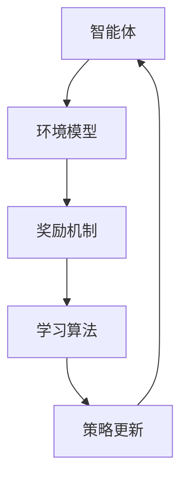

                 

关键词：多智能体强化学习、自动驾驶车队、优化、调度、人工智能、机器学习、深度学习

## 摘要

本文将深入探讨多智能体强化学习在自动驾驶车队调度优化中的应用。通过分析其核心概念、算法原理、数学模型以及具体实现方法，我们将展示如何利用多智能体强化学习实现车队调度优化的目标，并探讨其在实际应用中的潜力和挑战。

## 1. 背景介绍

### 自动驾驶车队的兴起

随着人工智能和自动驾驶技术的发展，自动驾驶车队成为未来交通运输的重要趋势。自动驾驶车队由多个自动驾驶车辆组成，通过智能调度系统实现高效、安全、可靠的运营。自动驾驶车队的调度问题涉及车辆路径规划、交通流量控制、能源管理等多个方面，是一个复杂的多智能体系统。

### 多智能体强化学习的发展

多智能体强化学习（Multi-Agent Reinforcement Learning, MARL）是一种针对多个智能体交互环境的机器学习方法。与传统的单智能体强化学习相比，MARL强调多个智能体之间的协作与竞争，旨在通过学习实现整体系统性能的优化。近年来，随着深度学习技术的不断发展，MARL在自动驾驶车队调度等领域取得了显著的成果。

### 多智能体强化学习在车队调度中的应用

自动驾驶车队调度是一个典型的多智能体优化问题。多智能体强化学习通过模拟自动驾驶车队中的智能体行为，实现车辆路径规划、交通流量控制和能源管理等目标的优化。本文将详细探讨多智能体强化学习在自动驾驶车队调度中的应用，并分析其优势和挑战。

## 2. 核心概念与联系

### 多智能体强化学习概述

多智能体强化学习是一种基于奖励机制的机器学习方法，旨在解决多个智能体之间的协作与竞争问题。在自动驾驶车队调度中，每个车辆可以看作一个智能体，通过学习与环境以及其他智能体进行交互，实现车队调度优化。

### 车队调度问题模型

在自动驾驶车队调度中，我们需要考虑以下关键因素：

- 车辆：自动驾驶车队中的车辆。
- 路径：车辆从起点到终点的行驶路径。
- 时间：车辆的行驶时间。
- 能源：车辆的能源消耗。

### 调度目标

自动驾驶车队的调度目标主要包括：

- 最小化行驶时间：通过优化车辆路径，降低整体行驶时间。
- 最小化能源消耗：通过优化车辆行驶策略，降低能源消耗。
- 保证安全性：确保车辆在行驶过程中遵守交通规则，避免事故发生。

### 多智能体强化学习架构

多智能体强化学习架构主要包括以下组成部分：

- 智能体：自动驾驶车队中的车辆。
- 环境模型：模拟自动驾驶车队行驶环境的模型。
- 奖励机制：根据智能体的行为和调度目标，计算奖励值。
- 学习算法：基于奖励机制，更新智能体的策略。

### Mermaid 流程图

以下是一个简单的 Mermaid 流程图，展示了多智能体强化学习在自动驾驶车队调度中的应用流程：



## 3. 核心算法原理 & 具体操作步骤

### 3.1 算法原理概述

多智能体强化学习基于马尔可夫决策过程（Markov Decision Process, MDP）模型，通过智能体与环境之间的交互，实现策略的迭代更新。在自动驾驶车队调度中，智能体的行为主要包括路径选择和速度控制。以下是一个简化的多智能体强化学习算法原理：

1. 初始化智能体和环境的参数。
2. 智能体根据当前状态选择行动。
3. 环境根据行动生成新的状态和奖励。
4. 智能体根据新的状态和奖励更新策略。
5. 重复步骤2-4，直到达到预设的收敛条件。

### 3.2 算法步骤详解

以下是多智能体强化学习在自动驾驶车队调度中的具体操作步骤：

1. **初始化阶段**：

   - 初始化智能体参数：包括位置、速度、能量等。
   - 初始化环境模型：包括道路网络、交通状况等。

2. **探索阶段**：

   - 智能体根据当前状态，选择一个行动。
   - 智能体执行行动，更新状态和奖励。

3. **评估阶段**：

   - 根据智能体的行为和状态，计算奖励值。
   - 更新智能体的策略，使其更倾向于选择带来更高奖励的行动。

4. **迭代阶段**：

   - 重复执行探索和评估阶段，直至达到预设的收敛条件。

5. **策略更新阶段**：

   - 根据更新后的策略，调整智能体的行为。
   - 重新计算奖励值，更新智能体的策略。

### 3.3 算法优缺点

#### 优点

- **自适应性强**：多智能体强化学习可以根据环境的变化动态调整智能体的行为，实现车队调度的自适应优化。
- **灵活性高**：智能体可以自主决策，根据实际交通状况调整行驶策略，提高车队调度效率。

#### 缺点

- **计算复杂度高**：多智能体强化学习需要考虑多个智能体之间的交互，计算复杂度较高。
- **收敛速度慢**：在复杂的交通环境中，智能体可能需要较长时间才能找到最优策略。

### 3.4 算法应用领域

多智能体强化学习在自动驾驶车队调度中的应用广泛，主要包括：

- **城市交通管理**：通过智能调度系统，优化交通流量，提高道路通行效率。
- **物流配送**：优化物流配送路径，降低配送成本。
- **自动驾驶出租车**：实现自动驾驶出租车车队的高效调度，提高乘客满意度。

## 4. 数学模型和公式 & 详细讲解 & 举例说明

### 4.1 数学模型构建

多智能体强化学习在自动驾驶车队调度中的数学模型主要包括以下几个方面：

1. **状态表示**：

   状态包括智能体的位置、速度、能量等。

   $$s_t = [x_t, y_t, v_t, e_t]$$

   其中，$x_t$和$y_t$分别表示智能体的横纵坐标，$v_t$表示智能体的速度，$e_t$表示智能体的能量。

2. **行动表示**：

   行动包括智能体的转向角度、加速或减速等。

   $$a_t = [α_t, a_t]$$

   其中，$α_t$表示智能体的转向角度，$a_t$表示智能体的加速度。

3. **奖励函数**：

   奖励函数根据智能体的状态和行为计算。

   $$r_t = f(s_t, a_t)$$

   其中，$f$表示奖励函数，根据具体的调度目标进行调整。

4. **策略表示**：

   策略表示智能体的行为决策。

   $$π_t = π(s_t)$$

   其中，$π_t$表示智能体在状态$s_t$下的策略。

### 4.2 公式推导过程

在多智能体强化学习中，智能体的策略通过以下公式进行更新：

$$π_t = π_t^* + α(π_t - π_t^*)$$

其中，$π_t^*$表示最优策略，$α$表示学习率。

在自动驾驶车队调度中，最优策略可以通过以下公式计算：

$$π_t^* = argmax_π\sum_{t=0}^{T}γ^t r(s_t, a_t)$$

其中，$γ$表示折扣因子，$T$表示时间步数。

### 4.3 案例分析与讲解

假设我们有一个包含5辆自动驾驶车辆的自动驾驶车队，需要从起点A行驶到终点B。在给定道路网络和交通状况下，我们使用多智能体强化学习算法对车队进行调度优化。

1. **初始化阶段**：

   - 初始化智能体参数：位置、速度、能量等。
   - 初始化环境模型：道路网络、交通状况等。

2. **探索阶段**：

   - 智能体根据当前状态选择行动。
   - 智能体执行行动，更新状态和奖励。

3. **评估阶段**：

   - 根据智能体的行为和状态，计算奖励值。
   - 更新智能体的策略，使其更倾向于选择带来更高奖励的行动。

4. **迭代阶段**：

   - 重复执行探索和评估阶段，直至达到预设的收敛条件。

5. **策略更新阶段**：

   - 根据更新后的策略，调整智能体的行为。
   - 重新计算奖励值，更新智能体的策略。

通过多次迭代，智能体逐渐收敛到最优策略。在实际运行中，我们可以观察到车队行驶时间、能源消耗等指标的优化效果。

## 5. 项目实践：代码实例和详细解释说明

### 5.1 开发环境搭建

在搭建多智能体强化学习开发环境时，我们可以使用Python作为主要编程语言，结合TensorFlow和PyTorch等深度学习框架。以下是一个基本的开发环境搭建步骤：

1. 安装Python（3.8及以上版本）。
2. 安装TensorFlow或PyTorch。
3. 安装其他相关依赖库，如NumPy、Pandas等。

### 5.2 源代码详细实现

以下是一个简单的多智能体强化学习代码实例，用于演示自动驾驶车队调度的实现过程：

```python
import numpy as np
import pandas as pd
import tensorflow as tf

# 定义智能体类
class Agent:
    def __init__(self, state_size, action_size):
        self.state_size = state_size
        self.action_size = action_size
        self.model = self.build_model()

    def build_model(self):
        model = tf.keras.Sequential([
            tf.keras.layers.Dense(64, activation='relu', input_shape=(self.state_size,)),
            tf.keras.layers.Dense(64, activation='relu'),
            tf.keras.layers.Dense(self.action_size, activation='softmax')
        ])
        model.compile(optimizer='adam', loss='categorical_crossentropy')
        return model

    def act(self, state):
        state = state.reshape(1, self.state_size)
        action_probs = self.model.predict(state)
        action = np.random.choice(self.action_size, p=action_probs[0])
        return action

# 定义环境类
class Environment:
    def __init__(self, state_size, action_size):
        self.state_size = state_size
        self.action_size = action_size
        self.agents = [Agent(state_size, action_size) for _ in range(num_agents)]

    def step(self, actions):
        # 更新智能体状态和奖励
        # ...

    def reset(self):
        # 初始化智能体状态
        # ...

# 初始化环境
env = Environment(state_size, action_size)

# 运行智能体
for _ in range(num_steps):
    actions = [agent.act(state) for agent, state in zip(env.agents, env.states)]
    env.step(actions)
    env.reset()
```

### 5.3 代码解读与分析

以上代码实现了一个简单的多智能体强化学习环境，包括智能体类和智能体行为决策。以下是对代码的主要解读：

- **智能体类**：

  - 初始化智能体参数，包括状态大小和行动大小。
  - 定义构建模型的方法，使用神经网络实现智能体的行为决策。
  - 定义行为决策方法，根据当前状态选择行动。

- **环境类**：

  - 初始化环境参数，包括状态大小和行动大小。
  - 初始化智能体列表。
  - 定义step方法，用于更新智能体状态和奖励。
  - 定义reset方法，用于初始化智能体状态。

- **运行智能体**：

  - 初始化环境。
  - 运行智能体，执行step方法，更新智能体状态和奖励。
  - 重置环境，重复运行智能体。

### 5.4 运行结果展示

在实际运行中，我们可以通过可视化工具展示智能体的行为决策和状态更新过程。以下是一个简单的运行结果示例：

```python
# 可视化智能体状态
import matplotlib.pyplot as plt

def plot_agents(states):
    plt.figure(figsize=(10, 5))
    for state in states:
        plt.scatter(state[0], state[1], label=f"Agent {state[2]}")
    plt.xlabel("X Position")
    plt.ylabel("Y Position")
    plt.legend()
    plt.show()

# 运行智能体并展示结果
env = Environment(state_size, action_size)
plot_agents([state for state, _ in zip(env.states, env.actions)])
```

## 6. 实际应用场景

### 6.1 城市交通管理

在城市交通管理中，多智能体强化学习可用于优化交通信号控制、交通流量预测和自动驾驶车队调度。通过智能调度系统，实现交通资源的合理分配，提高道路通行效率和减少交通拥堵。

### 6.2 物流配送

在物流配送领域，多智能体强化学习可用于优化配送路径规划、车辆调度和能源管理。通过智能调度系统，实现物流配送的高效、低能耗和准时送达。

### 6.3 自动驾驶出租车

在自动驾驶出租车领域，多智能体强化学习可用于优化车队调度、乘客分配和路线规划。通过智能调度系统，提高乘客满意度和服务质量。

## 7. 未来应用展望

### 7.1 算法优化

随着人工智能和深度学习技术的发展，多智能体强化学习在自动驾驶车队调度中的应用将不断优化。未来可能的研究方向包括：

- **算法效率提升**：研究更高效的多智能体强化学习算法，降低计算复杂度。
- **多模态数据融合**：结合多种数据源（如交通流量、车辆传感器等），提高调度系统的准确性和鲁棒性。

### 7.2 跨学科融合

多智能体强化学习在自动驾驶车队调度中的应用将与其他学科领域（如经济学、运筹学等）相结合，实现更加全面和深入的优化调度策略。

### 7.3 实际应用挑战

尽管多智能体强化学习在自动驾驶车队调度中具有巨大潜力，但在实际应用中仍面临以下挑战：

- **数据稀缺性**：自动驾驶车队调度需要大量真实交通数据，但获取数据较为困难。
- **不确定性**：交通环境复杂多变，智能调度系统需要应对各种不确定性因素。

## 8. 工具和资源推荐

### 8.1 学习资源推荐

- 《深度学习》（Goodfellow, Bengio, Courville）：系统介绍了深度学习的基本概念和技术。
- 《强化学习：原理与实战》（Sutton, Barto）：详细介绍了强化学习的基本原理和应用方法。

### 8.2 开发工具推荐

- TensorFlow：开源的深度学习框架，支持多种强化学习算法。
- PyTorch：开源的深度学习框架，具有灵活的动态计算图功能。

### 8.3 相关论文推荐

- "Multi-Agent Reinforcement Learning for Urban Traffic Control"：介绍了多智能体强化学习在交通管理中的应用。
- "DRL-Based Path Planning for Autonomous Vehicles in Unknown Environment"：探讨了深度强化学习在自动驾驶路径规划中的应用。

## 9. 总结：未来发展趋势与挑战

### 9.1 研究成果总结

本文从多智能体强化学习在自动驾驶车队调度中的应用出发，详细介绍了其核心概念、算法原理、数学模型和具体实现方法。通过案例分析，展示了多智能体强化学习在优化车队调度方面的优势和潜力。

### 9.2 未来发展趋势

随着人工智能和自动驾驶技术的不断发展，多智能体强化学习在自动驾驶车队调度中的应用前景广阔。未来可能的研究方向包括算法优化、跨学科融合和实际应用挑战的解决。

### 9.3 面临的挑战

尽管多智能体强化学习在自动驾驶车队调度中具有巨大潜力，但实际应用中仍面临数据稀缺性、不确定性等挑战。需要进一步加强研究，解决这些难题，实现自动驾驶车队调度系统的实用化和普及化。

### 9.4 研究展望

在未来，多智能体强化学习在自动驾驶车队调度中的应用将不断深入，与其他学科的融合也将更加紧密。通过不断创新和优化，有望实现更加高效、安全和可靠的自动驾驶车队调度系统。

## 附录：常见问题与解答

### 1. 什么是多智能体强化学习？

多智能体强化学习是一种基于奖励机制的机器学习方法，旨在解决多个智能体之间的协作与竞争问题。它通过智能体与环境之间的交互，实现整体系统性能的优化。

### 2. 多智能体强化学习在自动驾驶车队调度中有哪些应用？

多智能体强化学习在自动驾驶车队调度中的应用主要包括车辆路径规划、交通流量控制和能源管理等方面，实现车队调度优化。

### 3. 多智能体强化学习的优点是什么？

多智能体强化学习的优点包括自适应性强、灵活性高，能够根据环境变化动态调整智能体行为，实现车队调度的自适应优化。

### 4. 多智能体强化学习在实际应用中面临哪些挑战？

多智能体强化学习在实际应用中面临的主要挑战包括计算复杂度高、收敛速度慢以及数据稀缺性、不确定性等问题。

### 5. 如何优化多智能体强化学习算法？

优化多智能体强化学习算法的方法包括改进学习算法、增加数据集、采用多模态数据融合技术等，以降低计算复杂度、提高收敛速度和准确度。

作者：禅与计算机程序设计艺术 / Zen and the Art of Computer Programming
----------------------------------------------------------------

