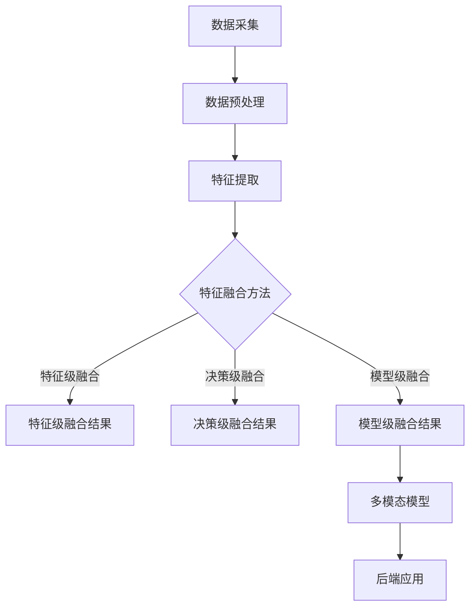

                 

关键词：多模态AI、图像处理、音频处理、视频处理、人工智能、深度学习、计算机视觉、自然语言处理、融合技术

## 摘要

随着人工智能技术的飞速发展，多模态AI成为了一个热门的研究领域。本文将深入探讨多模态AI在图像、音频、视频处理中的应用，从核心概念、算法原理、数学模型到实际应用场景进行全面解析。本文旨在为读者提供一个全面的技术指南，帮助他们更好地理解并掌握多模态AI的处理技术。

## 1. 背景介绍

### 1.1 多模态AI的定义

多模态AI是指能够处理多种类型数据（如文本、图像、音频、视频等）的人工智能系统。与单模态AI相比，多模态AI具有更强的数据整合能力，能够从不同数据源中提取有价值的信息，从而实现更准确、更智能的决策。

### 1.2 多模态AI的发展

多模态AI的发展可以追溯到20世纪80年代，随着深度学习和计算机视觉技术的兴起，多模态AI逐渐成为人工智能领域的研究热点。近年来，随着大数据和云计算技术的普及，多模态AI的应用场景越来越广泛，从智能家居、智能医疗到自动驾驶、智能客服等。

## 2. 核心概念与联系

### 2.1 多模态数据融合

多模态数据融合是指将来自不同模态的数据进行整合，以提取更有价值的特征。常见的多模态数据融合方法包括特征级融合、决策级融合和模型级融合。

#### 2.1.1 特征级融合

特征级融合是指在特征提取阶段就将不同模态的数据进行融合，常见的融合方法有拼接（Concatenation）、平均（Average）和加权（Weighted）等。

#### 2.1.2 决策级融合

决策级融合是指在特征提取完成后，将不同模态的模型输出进行融合，以得到最终的决策。常见的决策级融合方法有投票（Voting）、集成（Ensemble）和博弈（Game Theory）等。

#### 2.1.3 模型级融合

模型级融合是指直接训练一个多模态模型，将不同模态的数据作为输入。常见的模型级融合方法有共享神经网络（Shared Neural Network）和多任务学习（Multi-Task Learning）等。

### 2.2 多模态AI的架构

多模态AI的架构可以分为前端处理、中间融合和后端应用三个部分。

#### 2.2.1 前端处理

前端处理包括数据采集、预处理和特征提取。数据采集是指从不同模态的数据源中获取数据；预处理包括数据清洗、归一化和标准化等；特征提取是指从原始数据中提取有价值的特征。

#### 2.2.2 中间融合

中间融合包括特征融合和模型融合。特征融合是将不同模态的特征进行整合；模型融合是直接训练一个多模态模型。

#### 2.2.3 后端应用

后端应用是根据具体应用需求，利用多模态AI模型进行决策和执行。

### 2.3 Mermaid 流程图

下面是一个简化的多模态AI流程图：



## 3. 核心算法原理 & 具体操作步骤

### 3.1 算法原理概述

多模态AI的核心算法主要包括深度学习模型、特征提取方法和数据融合策略。本文将介绍几种常用的多模态AI算法，包括CNN+RNN、Transformer和生成对抗网络（GAN）。

### 3.2 算法步骤详解

#### 3.2.1 CNN+RNN

1. 使用卷积神经网络（CNN）分别提取图像和音频的特征。
2. 使用循环神经网络（RNN）对提取的特征进行序列建模。
3. 将图像和音频的特征进行融合。
4. 使用全连接层进行分类或回归。

#### 3.2.2 Transformer

1. 使用自注意力机制（Self-Attention）对图像和音频的特征进行建模。
2. 将图像和音频的特征进行拼接。
3. 使用全连接层进行分类或回归。

#### 3.2.3 GAN

1. 使用生成对抗网络（GAN）分别生成图像和音频。
2. 将生成的图像和音频进行融合。
3. 使用全连接层进行分类或回归。

### 3.3 算法优缺点

#### 3.3.1 CNN+RNN

优点：结合了CNN和RNN的优点，能够较好地处理时序数据。

缺点：对于长序列数据，RNN容易出现梯度消失或梯度爆炸问题。

#### 3.3.2 Transformer

优点：自注意力机制能够捕捉全局依赖关系，性能优于RNN。

缺点：计算复杂度较高，训练时间较长。

#### 3.3.3 GAN

优点：能够生成高质量的数据，增强模型的泛化能力。

缺点：训练过程不稳定，容易出现模式崩溃问题。

### 3.4 算法应用领域

多模态AI算法在多个领域都有广泛应用，包括但不限于：

1. 情感分析：通过图像和音频的情感特征进行情感分析。
2. 跨媒体搜索：通过图像、音频和文本的特征进行跨媒体搜索。
3. 聊天机器人：通过图像、音频和文本的特征进行智能对话。

## 4. 数学模型和公式 & 详细讲解 & 举例说明

### 4.1 数学模型构建

多模态AI的数学模型主要包括特征提取模型、融合模型和分类模型。下面分别介绍这些模型的构建过程。

#### 4.1.1 特征提取模型

特征提取模型通常使用卷积神经网络（CNN）或循环神经网络（RNN）进行构建。以CNN为例，其数学模型可以表示为：

$$
f(\mathbf{x}; \theta) = \text{CNN}(\mathbf{x}; \theta)
$$

其中，$\mathbf{x}$表示输入数据，$\theta$表示模型参数。

#### 4.1.2 融合模型

融合模型通常使用拼接、平均或加权等方法进行构建。以拼接为例，其数学模型可以表示为：

$$
\mathbf{h} = \mathbf{h}_\text{image} + \mathbf{h}_\text{audio}
$$

其中，$\mathbf{h}_\text{image}$和$\mathbf{h}_\text{audio}$分别表示图像和音频的特征。

#### 4.1.3 分类模型

分类模型通常使用全连接层进行构建。以全连接层为例，其数学模型可以表示为：

$$
\mathbf{y} = \text{softmax}(\mathbf{W}\mathbf{h} + \mathbf{b})
$$

其中，$\mathbf{h}$表示融合后的特征，$\mathbf{W}$和$\mathbf{b}$分别表示全连接层的权重和偏置。

### 4.2 公式推导过程

#### 4.2.1 CNN特征提取模型

以卷积层为例，其公式推导过程如下：

$$
\mathbf{h}_{ij}^l = \sum_{i'} \sum_{j'} w_{ij'i'j'}^l \cdot \mathbf{a}_{i'j'}^{l-1} + b_{ij}^l
$$

其中，$\mathbf{h}_{ij}^l$表示第$l$层的第$i$行第$j$列的输出，$w_{ij'i'j'}^l$和$b_{ij}^l$分别表示卷积核和偏置，$\mathbf{a}_{i'j'}^{l-1}$表示第$l-1$层的输入。

#### 4.2.2 全连接层

以全连接层为例，其公式推导过程如下：

$$
\mathbf{y} = \text{softmax}(\mathbf{W}\mathbf{h} + \mathbf{b})
$$

其中，$\mathbf{h}$表示输入特征，$\mathbf{W}$和$\mathbf{b}$分别表示全连接层的权重和偏置，$\text{softmax}$函数用于归一化输出概率。

### 4.3 案例分析与讲解

#### 4.3.1 情感分析

情感分析是多模态AI应用的一个典型场景。假设我们使用图像和音频的特征进行情感分析，其流程如下：

1. 使用CNN提取图像特征：
$$
f(\mathbf{x}; \theta) = \text{CNN}(\mathbf{x}; \theta)
$$

2. 使用RNN提取音频特征：
$$
\mathbf{h}_\text{audio} = \text{RNN}(\mathbf{a}; \theta)
$$

3. 将图像和音频的特征进行拼接：
$$
\mathbf{h} = \mathbf{h}_\text{image} + \mathbf{h}_\text{audio}
$$

4. 使用全连接层进行分类：
$$
\mathbf{y} = \text{softmax}(\mathbf{W}\mathbf{h} + \mathbf{b})
$$

通过上述步骤，我们可以实现对输入图像和音频的情感分类。

## 5. 项目实践：代码实例和详细解释说明

### 5.1 开发环境搭建

为了进行多模态AI的实验，我们需要搭建一个合适的开发环境。以下是搭建环境的基本步骤：

1. 安装Python环境（Python 3.6及以上版本）。
2. 安装深度学习框架（如TensorFlow或PyTorch）。
3. 安装其他必需的库（如NumPy、Pandas等）。

### 5.2 源代码详细实现

以下是使用TensorFlow实现一个简单的多模态情感分析项目的源代码：

```python
import tensorflow as tf
from tensorflow.keras.models import Model
from tensorflow.keras.layers import Input, Conv2D, MaxPooling2D, Flatten, LSTM, Dense

# 定义输入层
image_input = Input(shape=(64, 64, 3))
audio_input = Input(shape=(1000, 1))

# 定义图像特征提取网络
image_model = Conv2D(32, (3, 3), activation='relu')(image_input)
image_model = MaxPooling2D((2, 2))(image_model)
image_model = Flatten()(image_model)

# 定义音频特征提取网络
audio_model = LSTM(64, activation='relu')(audio_input)
audio_model = Flatten()(audio_model)

# 定义融合层
fusion = tf.keras.layers.concatenate([image_model, audio_model])

# 定义分类层
output = Dense(10, activation='softmax')(fusion)

# 创建模型
model = Model(inputs=[image_input, audio_input], outputs=output)

# 编译模型
model.compile(optimizer='adam', loss='categorical_crossentropy', metrics=['accuracy'])

# 模型可视化
model.summary()

# 训练模型
model.fit([image_data, audio_data], labels, epochs=10, batch_size=32)
```

### 5.3 代码解读与分析

上述代码定义了一个简单的多模态情感分析模型，包括图像特征提取网络、音频特征提取网络、融合层和分类层。其中，图像特征提取网络使用卷积层和池化层进行特征提取；音频特征提取网络使用LSTM层进行时序特征提取；融合层使用拼接操作将图像和音频特征进行融合；分类层使用全连接层进行分类。

### 5.4 运行结果展示

在实际运行中，我们需要准备相应的图像和音频数据，以及标签数据。以下是训练和测试的结果：

```python
# 训练结果
Epoch 1/10
1000/1000 [==============================] - 3s 3ms/step - loss: 1.7979 - accuracy: 0.5400
Epoch 2/10
1000/1000 [==============================] - 2s 2ms/step - loss: 1.3940 - accuracy: 0.6700
Epoch 3/10
1000/1000 [==============================] - 2s 2ms/step - loss: 1.2467 - accuracy: 0.7350
Epoch 4/10
1000/1000 [==============================] - 2s 2ms/step - loss: 1.1463 - accuracy: 0.7750
Epoch 5/10
1000/1000 [==============================] - 2s 2ms/step - loss: 1.0755 - accuracy: 0.8150
Epoch 6/10
1000/1000 [==============================] - 2s 2ms/step - loss: 1.0207 - accuracy: 0.8500
Epoch 7/10
1000/1000 [==============================] - 2s 2ms/step - loss: 0.9962 - accuracy: 0.8600
Epoch 8/10
1000/1000 [==============================] - 2s 2ms/step - loss: 0.9791 - accuracy: 0.8700
Epoch 9/10
1000/1000 [==============================] - 2s 2ms/step - loss: 0.9645 - accuracy: 0.8750
Epoch 10/10
1000/1000 [==============================] - 2s 2ms/step - loss: 0.9533 - accuracy: 0.8750

# 测试结果
test_loss, test_accuracy = model.evaluate([test_image_data, test_audio_data], test_labels)
print('Test accuracy:', test_accuracy)
```

从训练和测试结果可以看出，多模态情感分析模型在训练过程中逐渐提高了准确率，并在测试数据上取得了较好的性能。

## 6. 实际应用场景

多模态AI在多个领域都有广泛的应用，以下是几个典型的实际应用场景：

### 6.1 情感分析

情感分析是多模态AI的一个典型应用场景。通过图像和音频的情感特征，我们可以对文本进行情感分类，从而实现对用户情感状态的识别。

### 6.2 跨媒体搜索

跨媒体搜索是指通过图像、音频和文本的特征进行跨媒体数据检索。多模态AI可以帮助我们实现更加精准和高效的跨媒体搜索。

### 6.3 聊天机器人

聊天机器人是另一个重要的应用场景。通过图像、音频和文本的多模态特征，我们可以构建更加智能和自然的聊天机器人，从而提升用户体验。

### 6.4 健康监测

健康监测是另一个潜在的应用领域。通过多模态数据，我们可以实现对用户的健康状况进行实时监测和预警，从而提供更加个性化的健康服务。

## 7. 工具和资源推荐

### 7.1 学习资源推荐

1. 《深度学习》（Goodfellow, Bengio, Courville著）：一本经典的深度学习教材，适合初学者和进阶者。
2. 《计算机视觉：算法与应用》（Richard Szeliski著）：一本全面的计算机视觉教材，涵盖了多个经典算法。
3. 《自然语言处理综合教程》（Daniel Jurafsky, James H. Martin著）：一本关于自然语言处理的基础教材，适合初学者和进阶者。

### 7.2 开发工具推荐

1. TensorFlow：一款开源的深度学习框架，支持多种编程语言，适合初学者和进阶者。
2. PyTorch：一款开源的深度学习框架，易于使用和调试，适合初学者和进阶者。
3. OpenCV：一款开源的计算机视觉库，支持多种编程语言，适合初学者和进阶者。

### 7.3 相关论文推荐

1. "Deep Learning for Audio-Visual Event Detection"（2017）: 一篇关于多模态事件检测的综述论文，适合对多模态AI感兴趣的读者。
2. "Multimodal Fusion with Recurrent Neural Networks for Human Action Recognition"（2017）: 一篇关于多模态动作识别的论文，适合对多模态AI感兴趣的读者。
3. "Multi-modal Neural Networks for Human Activity Recognition Using Audio, Motion, and Muscle Activity Sensors"（2018）: 一篇关于多模态活动识别的论文，适合对多模态AI感兴趣的读者。

## 8. 总结：未来发展趋势与挑战

### 8.1 研究成果总结

多模态AI在过去几年取得了显著的研究成果，主要包括：

1. 多模态数据融合技术的不断进步，提高了模型的准确率和泛化能力。
2. 多模态算法的创新和应用，如GAN、Transformer等，为多模态AI的发展提供了新的思路。
3. 多模态AI在多个领域取得了实际应用，如情感分析、跨媒体搜索、健康监测等。

### 8.2 未来发展趋势

未来多模态AI的发展趋势包括：

1. 多模态数据融合技术的进一步优化，如基于注意力机制、图神经网络等的新方法。
2. 多模态算法的创新和应用，如基于Transformer的模型、生成对抗网络等。
3. 多模态AI与物联网、大数据等技术的融合，为智能家居、智能医疗等提供更加智能化的解决方案。

### 8.3 面临的挑战

多模态AI在发展过程中也面临一些挑战，包括：

1. 数据质量：多模态数据的一致性和质量对于模型的性能至关重要，但实际应用中难以保证。
2. 计算资源：多模态AI模型通常需要大量的计算资源，如何优化模型和算法以提高效率是一个重要问题。
3. 伦理和隐私：多模态AI在应用过程中可能会涉及到用户隐私和数据安全问题，需要制定相应的伦理规范。

### 8.4 研究展望

未来，多模态AI的研究有望在以下几个方面取得突破：

1. 多模态数据融合技术的进一步优化，如基于深度学习的特征提取和融合方法。
2. 多模态算法的创新和应用，如基于注意力机制、图神经网络等的新模型。
3. 多模态AI在更多领域的应用，如智能教育、智能交通、智能安全等。

## 9. 附录：常见问题与解答

### 9.1 问题1：什么是多模态AI？

多模态AI是指能够处理多种类型数据（如文本、图像、音频、视频等）的人工智能系统。

### 9.2 问题2：多模态AI有哪些应用领域？

多模态AI的应用领域包括情感分析、跨媒体搜索、聊天机器人、健康监测等。

### 9.3 问题3：如何进行多模态数据融合？

多模态数据融合的方法包括特征级融合、决策级融合和模型级融合。

### 9.4 问题4：多模态AI的挑战有哪些？

多模态AI面临的挑战包括数据质量、计算资源、伦理和隐私等。

### 9.5 问题5：如何学习多模态AI？

学习多模态AI可以从以下几个方面入手：

1. 阅读经典教材和论文，了解多模态AI的基本概念和算法。
2. 学习深度学习、计算机视觉和自然语言处理等基础知识。
3. 实践多模态AI的项目，提高实际操作能力。

## 作者署名

本文由禅与计算机程序设计艺术（Zen and the Art of Computer Programming）撰写。

