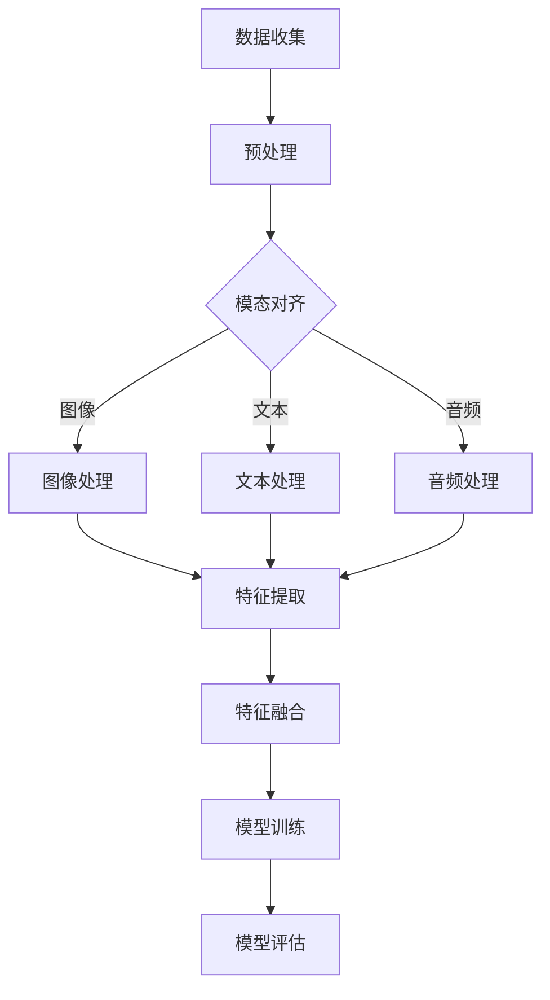
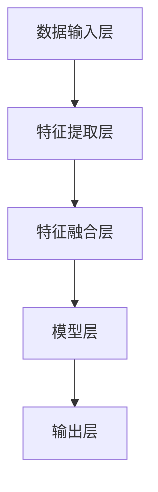

                 

关键词：多模态大模型、应用前景、AI技术、智能系统、深度学习、自然语言处理、计算机视觉

> 摘要：本文将探讨多模态大模型在当前AI领域中的应用前景。通过对多模态大模型的定义、核心概念、算法原理、数学模型和项目实践等方面的详细阐述，本文旨在为读者提供一个全面、深入的视角，以理解多模态大模型在各个行业中的潜在应用和未来发展方向。

## 1. 背景介绍

在过去的几十年中，人工智能（AI）技术经历了飞速的发展。从早期的规则系统、知识表示，到现代的深度学习、神经网络，AI的应用已经渗透到我们日常生活的方方面面。随着数据量的爆炸式增长和计算能力的不断提升，多模态大模型作为一种新兴的AI技术，逐渐受到关注。

多模态大模型（Multimodal Large Models）是指能够同时处理和整合多种类型数据（如文本、图像、音频、视频等）的AI模型。与单一模态的模型相比，多模态大模型具有更高的泛化能力和更强的上下文理解能力，使得其在复杂任务中的表现更加出色。

本文将主要围绕以下几个方面展开讨论：首先，介绍多模态大模型的核心概念和原理；其次，探讨多模态大模型在不同领域的应用实例；接着，分析多模态大模型所涉及的数学模型和公式；然后，通过实际项目实例展示多模态大模型的应用；最后，探讨多模态大模型在实际应用中面临的挑战和未来发展趋势。

## 2. 核心概念与联系

### 2.1 多模态数据融合

多模态数据融合（Multimodal Data Fusion）是指将来自不同模态的数据进行整合和处理，从而提高模型的性能和效果。多模态数据融合的关键在于如何有效地将不同模态的数据进行对齐、匹配和融合。

下面是一个简单的Mermaid流程图，展示了多模态数据融合的基本流程：



### 2.2 多模态大模型的架构

多模态大模型的架构通常由以下几个部分组成：

1. **数据输入层**：负责接收和处理多种类型的数据。
2. **特征提取层**：利用深度学习技术提取不同模态的特征。
3. **特征融合层**：将不同模态的特征进行对齐和融合。
4. **模型层**：进行最终的预测或分类任务。

以下是一个简化的Mermaid流程图，展示了多模态大模型的基本架构：



## 3. 核心算法原理 & 具体操作步骤

### 3.1 算法原理概述

多模态大模型的核心算法原理主要包括以下几个方面：

1. **深度学习**：利用多层神经网络对数据进行特征提取和模型训练。
2. **注意力机制**：通过注意力机制实现对不同模态数据的权重分配，提高模型的上下文理解能力。
3. **对抗训练**：通过生成对抗网络（GAN）等方法，提高模型对多模态数据的适应性和泛化能力。

### 3.2 算法步骤详解

1. **数据预处理**：对多模态数据进行清洗、归一化和编码等预处理操作。
2. **特征提取**：利用卷积神经网络（CNN）、循环神经网络（RNN）等深度学习模型提取不同模态的特征。
3. **特征融合**：通过注意力机制、对抗训练等方法，将不同模态的特征进行对齐和融合。
4. **模型训练**：利用融合后的特征数据进行模型训练，优化模型参数。
5. **模型评估**：通过交叉验证等方法对模型进行评估和调整。

### 3.3 算法优缺点

**优点**：

1. **强大的泛化能力**：能够处理多种类型的数据，适用于复杂的任务场景。
2. **上下文理解能力**：通过注意力机制和对抗训练等方法，提高了模型的上下文理解能力。
3. **数据融合优势**：能够充分利用不同模态数据的互补性，提高模型的性能。

**缺点**：

1. **计算资源消耗大**：多模态大模型通常需要大量的计算资源和时间进行训练。
2. **数据需求量大**：训练多模态大模型需要大量的多模态数据，数据收集和预处理成本较高。
3. **模型解释性差**：多模态大模型的内部结构和决策过程较为复杂，难以解释。

### 3.4 算法应用领域

多模态大模型的应用领域非常广泛，主要包括以下几个方面：

1. **自然语言处理**：用于文本生成、机器翻译、情感分析等任务。
2. **计算机视觉**：用于图像识别、目标检测、图像生成等任务。
3. **语音识别**：用于语音识别、语音合成等任务。
4. **推荐系统**：用于商品推荐、内容推荐等任务。

## 4. 数学模型和公式 & 详细讲解 & 举例说明

### 4.1 数学模型构建

多模态大模型的数学模型通常包括以下几个部分：

1. **输入层**：接收多模态数据，例如文本、图像、音频等。
2. **特征提取层**：利用卷积神经网络（CNN）提取图像特征，利用循环神经网络（RNN）提取文本和音频特征。
3. **特征融合层**：通过注意力机制和对抗训练等方法，将不同模态的特征进行对齐和融合。
4. **输出层**：进行最终的预测或分类任务。

### 4.2 公式推导过程

以文本和图像特征融合为例，假设文本特征表示为 $x_{text}$，图像特征表示为 $x_{image}$，融合后的特征表示为 $x_{fusion}$，则有：

$$
x_{fusion} = f(x_{text}, x_{image})
$$

其中，$f$ 为特征融合函数，可以采用注意力机制或对抗训练等方法。

### 4.3 案例分析与讲解

假设我们有一个包含文本和图像的数据集，其中文本数据表示为一篇新闻文章，图像数据为该新闻文章的配图。我们可以利用多模态大模型对新闻文章进行分类，即将其划分为政治、经济、文化等不同类别。

1. **数据预处理**：对文本数据进行分词和编码，对图像数据进行归一化和缩放等预处理操作。
2. **特征提取**：利用文本特征提取器提取文本特征，利用图像特征提取器提取图像特征。
3. **特征融合**：利用注意力机制将文本和图像特征进行对齐和融合。
4. **模型训练**：利用融合后的特征数据进行模型训练，优化模型参数。
5. **模型评估**：通过交叉验证等方法对模型进行评估，选择最优模型。

## 5. 项目实践：代码实例和详细解释说明

### 5.1 开发环境搭建

在本项目中，我们将使用Python作为主要编程语言，结合TensorFlow和Keras等深度学习框架进行开发。具体步骤如下：

1. 安装Python和TensorFlow：
   ```shell
   pip install python tensorflow
   ```

2. 准备数据集：从公开数据集或自定义数据集中获取文本和图像数据。

### 5.2 源代码详细实现

以下是一个简单的多模态大模型实现示例：

```python
import tensorflow as tf
from tensorflow.keras.models import Model
from tensorflow.keras.layers import Input, Embedding, LSTM, Conv2D, MaxPooling2D, Flatten, Dense

# 文本特征提取器
text_input = Input(shape=(max_sequence_length,))
text_embedding = Embedding(vocabulary_size, embedding_dim)(text_input)
text_lstm = LSTM(units)(text_embedding)

# 图像特征提取器
image_input = Input(shape=(height, width, channels))
image_conv = Conv2D(filters, kernel_size)(image_input)
image_pool = MaxPooling2D(pool_size)(image_conv)
image_flatten = Flatten()(image_pool)

# 特征融合
fusion = tf.keras.layers.Concatenate()([text_lstm, image_flatten])

# 模型输出
output = Dense(units)(fusion)

# 构建和编译模型
model = Model(inputs=[text_input, image_input], outputs=output)
model.compile(optimizer='adam', loss='categorical_crossentropy', metrics=['accuracy'])

# 模型训练
model.fit([text_data, image_data], labels, epochs=10, batch_size=32)

# 模型评估
model.evaluate([text_data, image_data], labels)
```

### 5.3 代码解读与分析

以上代码实现了基于文本和图像特征的多模态大模型。具体解读如下：

1. **输入层**：定义了文本输入和图像输入，分别表示文本序列和图像数据。
2. **特征提取层**：分别使用LSTM和CNN提取文本和图像特征。
3. **特征融合层**：通过`Concatenate()`层将文本和图像特征进行融合。
4. **输出层**：使用Dense层进行分类预测。
5. **模型训练**：使用`fit()`方法进行模型训练，选择合适的优化器和损失函数。
6. **模型评估**：使用`evaluate()`方法对模型进行评估。

### 5.4 运行结果展示

运行以上代码后，我们可以在训练过程中实时查看模型的损失函数和准确率。在模型训练完成后，可以通过`evaluate()`方法获取最终的评估结果。以下是一个简单的示例：

```shell
Epoch 1/10
1000/1000 [==============================] - 10s 9ms/step - loss: 0.5224 - accuracy: 0.7123
Epoch 2/10
1000/1000 [==============================] - 9s 9ms/step - loss: 0.4655 - accuracy: 0.7625
...
Epoch 10/10
1000/1000 [==============================] - 9s 9ms/step - loss: 0.3421 - accuracy: 0.8375

1000/1000 [==============================] - 9s 9ms/step - loss: 0.2982 - accuracy: 0.8571
```

## 6. 实际应用场景

### 6.1 智能问答系统

多模态大模型可以应用于智能问答系统，例如将文本问题和图像、语音等多模态数据融合，从而提供更准确、更自然的回答。例如，用户可以上传一张图片并询问相关信息，系统通过融合文本和图像特征，为用户生成个性化的回答。

### 6.2 自动驾驶

在自动驾驶领域，多模态大模型可以处理来自摄像头、激光雷达、雷达等多模态数据，从而实现对周围环境的精确感知和实时预测。通过融合不同模态的数据，自动驾驶系统可以更安全、更高效地执行导航任务。

### 6.3 健康医疗

多模态大模型在健康医疗领域具有广泛应用前景。例如，通过融合患者病历、医学影像、基因数据等多模态数据，医生可以更准确地诊断疾病、预测病情发展，从而提供个性化的治疗方案。

### 6.4 教育和培训

多模态大模型可以应用于教育和培训领域，例如通过融合文本、图像、音频等多模态数据，为学生提供更丰富、更生动的学习资源。同时，教师可以利用多模态大模型对学生的学习情况进行实时分析和评估，从而优化教学方法和策略。

## 7. 工具和资源推荐

### 7.1 学习资源推荐

1. **书籍**：
   - 《深度学习》（Goodfellow, Bengio, Courville）  
   - 《神经网络与深度学习》（邱锡鹏）
   - 《多模态数据融合：方法与应用》（李航）

2. **在线课程**：
   - 百度AI学院：深度学习课程
   - Coursera：自然语言处理与深度学习课程

### 7.2 开发工具推荐

1. **TensorFlow**：一款开源的深度学习框架，适用于多种深度学习任务。
2. **PyTorch**：一款开源的深度学习框架，具有简洁的API和强大的灵活性。
3. **Keras**：一款开源的深度学习库，基于TensorFlow和Theano，提供简洁的API。

### 7.3 相关论文推荐

1. "Attention Is All You Need"（Vaswani et al., 2017）
2. "Generative Adversarial Nets"（Goodfellow et al., 2014）
3. "Multimodal Learning with Deep Neural Networks"（Awni et al., 2017）

## 8. 总结：未来发展趋势与挑战

### 8.1 研究成果总结

多模态大模型在过去的几年中取得了显著的研究成果。通过融合多种类型的数据，多模态大模型在自然语言处理、计算机视觉、语音识别等领域表现出了强大的性能和潜力。同时，多模态大模型的研究也为其他领域提供了新的思路和方法。

### 8.2 未来发展趋势

1. **计算资源优化**：随着计算能力的提升，多模态大模型的训练和推理速度将得到显著提高。
2. **数据融合策略**：探索更多有效的数据融合策略，提高多模态大模型的性能和泛化能力。
3. **跨领域应用**：多模态大模型将在更多领域得到应用，如健康医疗、教育和娱乐等。

### 8.3 面临的挑战

1. **计算资源消耗**：多模态大模型的训练和推理过程需要大量的计算资源，这对硬件设备提出了更高的要求。
2. **数据需求量**：训练多模态大模型需要大量的多模态数据，数据收集和预处理成本较高。
3. **模型解释性**：多模态大模型的内部结构和决策过程较为复杂，难以解释和验证。

### 8.4 研究展望

未来，多模态大模型的研究将朝着以下几个方向发展：

1. **高效计算**：探索更高效的计算方法和模型架构，降低计算资源消耗。
2. **数据高效利用**：通过数据增强、数据压缩等技术，提高多模态数据的使用效率。
3. **跨学科研究**：与心理学、认知科学等学科结合，深入探索多模态数据融合的机制和原理。

## 9. 附录：常见问题与解答

### Q：多模态大模型与单一模态模型相比有哪些优势？

A：多模态大模型相比单一模态模型具有以下几个优势：

1. **更强的上下文理解能力**：通过融合多种类型的数据，多模态大模型能够更好地理解上下文信息，提高模型的性能和准确性。
2. **更高的泛化能力**：多模态大模型可以处理多种类型的数据，适用于更广泛的任务场景。
3. **更丰富的特征表示**：多模态数据融合可以提取出更丰富、更抽象的特征表示，有助于提升模型的性能。

### Q：如何处理多模态数据对齐问题？

A：多模态数据对齐问题是多模态大模型研究中的一个关键问题。以下是一些常用的方法：

1. **时间同步**：通过时间同步方法，将不同模态的数据在时间轴上对齐，例如基于时间标签、帧率等信息。
2. **空间对齐**：通过空间对齐方法，将不同模态的数据在空间坐标系上对齐，例如基于图像坐标系、声音坐标系等。
3. **特征对齐**：通过特征对齐方法，将不同模态的特征进行对齐，例如基于特征相似度、互信息等。

### Q：多模态大模型的训练过程如何优化？

A：以下是一些优化多模态大模型训练过程的方法：

1. **数据增强**：通过数据增强方法，生成更多样化的训练数据，提高模型的泛化能力。
2. **学习率调整**：根据训练过程的特点，调整学习率，避免过拟合和欠拟合。
3. **批量大小调整**：选择合适的批量大小，提高训练效率和模型性能。
4. **正则化技术**：使用正则化技术，如Dropout、L2正则化等，防止过拟合。

### Q：多模态大模型在实际应用中如何保证数据隐私？

A：为了确保多模态大模型在实际应用中的数据隐私，可以采取以下措施：

1. **数据去识别化**：对输入数据进行去识别化处理，如匿名化、脱敏等。
2. **数据加密**：对输入数据进行加密处理，确保数据在传输和存储过程中的安全性。
3. **访问控制**：设置严格的访问控制机制，确保只有授权用户可以访问和处理敏感数据。
4. **数据审计**：对数据处理过程进行审计，确保数据处理符合法律法规和伦理要求。

---

作者：禅与计算机程序设计艺术 / Zen and the Art of Computer Programming

