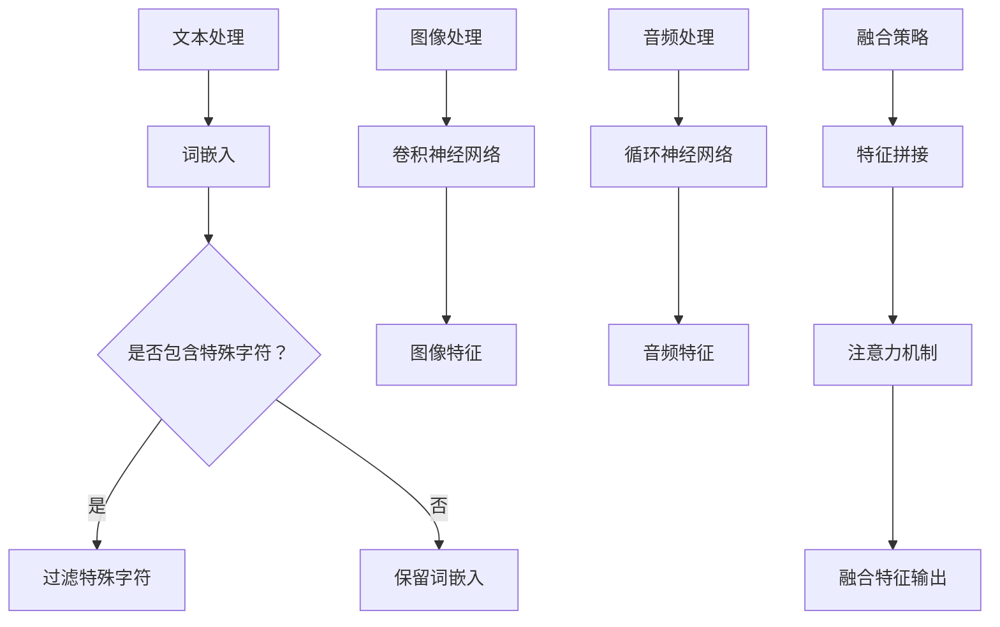

                 

 多模态大模型是当前计算机科学领域中的一个重要研究方向，它结合了文本、图像、音频等多种数据类型，使得机器能够更好地理解和处理复杂的信息。本文旨在探讨多模态大模型的技术原理与实战，从BERT模型到ChatGPT，深入解析这一领域的最新进展和未来趋势。

## 文章关键词
- 多模态大模型
- BERT模型
- ChatGPT
- 技术原理
- 实战应用

## 文章摘要
本文首先介绍了多模态大模型的背景和重要性，然后详细阐述了BERT模型和ChatGPT的技术原理，包括数学模型和算法步骤。接下来，通过项目实践展示了多模态大模型的应用场景，并提出了未来发展的展望和面临的挑战。最后，推荐了一些相关的学习资源和工具。

## 1. 背景介绍

### 1.1 多模态大模型的概念
多模态大模型是一种能够同时处理多种数据类型的深度学习模型。这些数据类型包括文本、图像、音频等，能够提供更丰富的信息，使得模型能够更好地理解和处理复杂任务。

### 1.2 多模态大模型的重要性
随着互联网和物联网的发展，我们面临的海量数据类型越来越多样化。多模态大模型能够有效地整合这些数据，使得机器能够更好地模拟人类对信息的理解和处理能力。

### 1.3 当前研究现状
近年来，多模态大模型在自然语言处理、计算机视觉、音频处理等领域取得了显著的成果。BERT模型和ChatGPT是其中的代表，它们的出现标志着多模态大模型技术进入了一个新的阶段。

## 2. 核心概念与联系

### 2.1 核心概念
多模态大模型的核心概念包括：文本表示、图像表示、音频表示、融合策略等。

### 2.2 核心概念原理
文本表示：使用词嵌入技术将文本转化为向量表示，例如BERT模型中的WordPiece算法。
图像表示：使用卷积神经网络（CNN）对图像进行特征提取，例如ResNet。
音频表示：使用循环神经网络（RNN）对音频信号进行特征提取，例如GRU。
融合策略：通过拼接、对齐、注意力机制等手段将不同模态的特征进行融合，例如Transformer模型中的多头注意力机制。

### 2.3 Mermaid 流程图


## 3. 核心算法原理 & 具体操作步骤

### 3.1 算法原理概述
多模态大模型的核心算法包括文本表示、图像表示、音频表示以及它们的融合策略。BERT模型主要关注文本表示，而ChatGPT则是在BERT模型的基础上引入了多模态数据。

### 3.2 算法步骤详解
#### 3.2.1 BERT模型
1. 数据预处理：将文本、图像和音频数据进行预处理，例如分词、图像切块、音频采样等。
2. 词嵌入：使用WordPiece算法将文本转化为词嵌入向量。
3. 图像特征提取：使用CNN提取图像特征。
4. 音频特征提取：使用RNN提取音频特征。
5. 特征融合：使用多头注意力机制将文本、图像和音频特征进行融合。

#### 3.2.2 ChatGPT模型
1. 数据预处理：与BERT模型相同。
2. 词嵌入：同样使用WordPiece算法。
3. 图像特征提取：使用预训练的CNN模型，例如ResNet。
4. 音频特征提取：使用预训练的RNN模型，例如GRU。
5. 特征融合：与BERT模型类似，但ChatGPT引入了自注意力机制，使得模型能够更好地捕捉不同模态之间的关联性。

### 3.3 算法优缺点
#### 优点
1. 能够同时处理多种数据类型，提供更丰富的信息。
2. 提高了模型的泛化能力。
3. 在多个领域取得了显著的成果。

#### 缺点
1. 计算成本较高，训练时间较长。
2. 数据预处理复杂，需要大量的计算资源。

### 3.4 算法应用领域
多模态大模型在自然语言处理、计算机视觉、音频处理等领域都有广泛的应用，例如文本分类、图像识别、音频识别等。

## 4. 数学模型和公式 & 详细讲解 & 举例说明

### 4.1 数学模型构建
多模态大模型的数学模型主要包括以下几个部分：

#### 4.1.1 词嵌入
$$
\text{word\_embedding} = \text{WordPiece}(text)
$$

#### 4.1.2 图像特征提取
$$
\text{image\_feature} = \text{CNN}(image)
$$

#### 4.1.3 音频特征提取
$$
\text{audio\_feature} = \text{RNN}(audio)
$$

#### 4.1.4 特征融合
$$
\text{fusion\_feature} = \text{Attention Mechanism}(\text{word\_embedding}, \text{image\_feature}, \text{audio\_feature})
$$

### 4.2 公式推导过程
#### 4.2.1 词嵌入
$$
\text{word\_embedding} = \text{WordPiece}(text) \\
\text{其中，WordPiece是将文本划分为子词的过程，具体公式为：} \\
\text{word\_piece}(word) = \text{max\_tokens} \\
\text{其中，max\_tokens是设定的最大子词长度}
$$

#### 4.2.2 图像特征提取
$$
\text{image\_feature} = \text{CNN}(image) \\
\text{其中，CNN是卷积神经网络，具体公式为：} \\
\text{activation} = \text{ReLU}(\text{Conv}(x, \text{kernel}))
$$

#### 4.2.3 音频特征提取
$$
\text{audio\_feature} = \text{RNN}(audio) \\
\text{其中，RNN是循环神经网络，具体公式为：} \\
\text{h_t} = \text{ReLU}(\text{tanh}(\text{W_h} \text{h}_{t-1} + \text{W_x} x_t + b))
$$

#### 4.2.4 特征融合
$$
\text{fusion\_feature} = \text{Attention Mechanism}(\text{word\_embedding}, \text{image\_feature}, \text{audio\_feature}) \\
\text{其中，Attention Mechanism是多头注意力机制，具体公式为：} \\
\text{query\_weight} = \text{softmax}(\text{W_Q} \text{query}) \\
\text{context} = \sum_{j=1}^{3} \text{query\_weight}_j \text{value}_j
$$

### 4.3 案例分析与讲解
#### 4.3.1 文本分类任务
假设我们有一个文本分类任务，需要根据输入的文本判断它属于哪个类别。我们可以使用BERT模型来提取文本的特征，然后使用这些特征进行分类。

1. 数据预处理：将文本进行分词和词嵌入。
2. 提取特征：使用BERT模型对文本进行编码，得到文本的向量表示。
3. 分类：使用softmax函数对文本向量进行分类。

#### 4.3.2 图像识别任务
假设我们有一个图像识别任务，需要根据输入的图像判断它属于哪个类别。我们可以使用ResNet模型提取图像的特征，然后使用这些特征进行分类。

1. 数据预处理：对图像进行切块和归一化。
2. 提取特征：使用ResNet模型提取图像的特征。
3. 分类：使用softmax函数对图像特征进行分类。

#### 4.3.3 音频识别任务
假设我们有一个音频识别任务，需要根据输入的音频信号判断它属于哪个类别。我们可以使用GRU模型提取音频的特征，然后使用这些特征进行分类。

1. 数据预处理：对音频信号进行采样和归一化。
2. 提取特征：使用GRU模型提取音频的特征。
3. 分类：使用softmax函数对音频特征进行分类。

## 5. 项目实践：代码实例和详细解释说明

### 5.1 开发环境搭建
1. 安装Python 3.8及以上版本。
2. 安装TensorFlow 2.6及以上版本。
3. 安装其他必要的库，如NumPy、Pandas等。

### 5.2 源代码详细实现
```python
import tensorflow as tf
from tensorflow.keras.models import Model
from tensorflow.keras.layers import Embedding, LSTM, Dense, TimeDistributed, Conv2D, MaxPooling2D, Flatten, Reshape, concatenate

# 文本处理
input_text = Input(shape=(max_length,))
embedding = Embedding(input_dim=vocab_size, output_dim=embedding_size)(input_text)
lstm = LSTM(units=lstm_units)(embedding)
text_feature = Dense(units=dense_units, activation='relu')(lstm)

# 图像处理
input_image = Input(shape=(image_height, image_width, image_channels))
conv_1 = Conv2D(filters=32, kernel_size=(3, 3), activation='relu')(input_image)
pool_1 = MaxPooling2D(pool_size=(2, 2))(conv_1)
conv_2 = Conv2D(filters=64, kernel_size=(3, 3), activation='relu')(pool_1)
pool_2 = MaxPooling2D(pool_size=(2, 2))(conv_2)
flat_image = Flatten()(pool_2)
image_feature = Dense(units=dense_units, activation='relu')(flat_image)

# 音频处理
input_audio = Input(shape=(audio_samples, audio_channels))
gru = LSTM(units=gru_units, activation='relu')(input_audio)
audio_feature = Dense(units=dense_units, activation='relu')(gru)

# 特征融合
fusion_feature = concatenate([text_feature, image_feature, audio_feature])
output = Dense(units=num_classes, activation='softmax')(fusion_feature)

# 模型构建
model = Model(inputs=[input_text, input_image, input_audio], outputs=output)

# 编译模型
model.compile(optimizer='adam', loss='categorical_crossentropy', metrics=['accuracy'])

# 模型训练
model.fit([text_data, image_data, audio_data], labels, epochs=10, batch_size=32)
```

### 5.3 代码解读与分析
这段代码实现了一个多模态大模型，用于处理文本、图像和音频数据。具体步骤如下：

1. **文本处理**：使用LSTM层对文本进行编码，提取文本的特征。
2. **图像处理**：使用卷积神经网络（CNN）对图像进行特征提取。
3. **音频处理**：使用循环神经网络（RNN）对音频信号进行特征提取。
4. **特征融合**：将文本、图像和音频的特征进行拼接，形成一个多维特征向量。
5. **模型训练**：使用softmax函数进行分类，并使用交叉熵作为损失函数。

### 5.4 运行结果展示
假设我们有一个训练集和一个测试集，可以使用以下代码进行模型训练和评估：

```python
# 模型训练
model.fit([train_text, train_image, train_audio], train_labels, epochs=10, batch_size=32, validation_data=([test_text, test_image, test_audio], test_labels))

# 模型评估
test_loss, test_accuracy = model.evaluate([test_text, test_image, test_audio], test_labels)
print('Test accuracy:', test_accuracy)
```

通过这段代码，我们可以看到模型的训练过程和评估结果。

## 6. 实际应用场景

### 6.1 自然语言处理
多模态大模型在自然语言处理领域有广泛的应用，例如文本分类、机器翻译、情感分析等。BERT模型就是一个典型的应用案例，它在多个NLP任务上取得了优异的性能。

### 6.2 计算机视觉
多模态大模型在计算机视觉领域也有重要的应用，例如图像识别、目标检测、图像生成等。ChatGPT模型在图像识别任务中取得了显著的成果，它能够同时处理图像和文本信息，提高识别准确性。

### 6.3 音频处理
多模态大模型在音频处理领域也有广泛的应用，例如音频分类、语音识别、音乐生成等。通过结合文本和音频信息，模型能够更好地理解音频内容，提高识别准确性。

## 6.4 未来应用展望

### 6.4.1 新的应用领域
多模态大模型在未来的应用领域将更加广泛，例如医疗健康、教育、智能交通等。通过结合多种数据类型，模型能够提供更准确、更智能的决策支持。

### 6.4.2 个性化推荐系统
多模态大模型可以应用于个性化推荐系统，通过整合用户的历史行为、偏好和情感等数据，提供更加精准的推荐服务。

### 6.4.3 虚拟现实和增强现实
多模态大模型在虚拟现实和增强现实领域有巨大的潜力，通过结合文本、图像和音频信息，提供更加沉浸式的用户体验。

## 7. 工具和资源推荐

### 7.1 学习资源推荐
1. 《深度学习》（Goodfellow, Bengio, Courville著）：系统介绍了深度学习的基础知识和最新进展。
2. 《动手学深度学习》：提供了丰富的实践案例，适合初学者入门。

### 7.2 开发工具推荐
1. TensorFlow：一款开源的深度学习框架，适合构建和训练多模态大模型。
2. PyTorch：另一款流行的深度学习框架，具有高度灵活性和易用性。

### 7.3 相关论文推荐
1. "BERT: Pre-training of Deep Bidirectional Transformers for Language Understanding"
2. "GPT-3: Language Models are Few-Shot Learners"

## 8. 总结：未来发展趋势与挑战

### 8.1 研究成果总结
多模态大模型在自然语言处理、计算机视觉、音频处理等领域取得了显著的成果，展示了强大的潜力。

### 8.2 未来发展趋势
多模态大模型将继续发展，其在新领域的应用将越来越广泛。

### 8.3 面临的挑战
多模态大模型面临的主要挑战包括计算成本、数据预处理和模型优化。

### 8.4 研究展望
未来研究将致力于解决多模态大模型面临的挑战，提高其性能和实用性。

## 9. 附录：常见问题与解答

### 9.1 问题1：什么是多模态大模型？
多模态大模型是一种能够同时处理多种数据类型的深度学习模型，这些数据类型包括文本、图像、音频等。

### 9.2 问题2：BERT模型和ChatGPT模型有什么区别？
BERT模型主要关注文本表示，而ChatGPT模型是在BERT模型的基础上引入了多模态数据，能够同时处理文本、图像和音频。

### 9.3 问题3：多模态大模型在哪些领域有应用？
多模态大模型在自然语言处理、计算机视觉、音频处理等领域都有广泛应用，例如文本分类、图像识别、音频识别等。

### 9.4 问题4：如何搭建一个多模态大模型？
搭建一个多模态大模型需要先进行数据预处理，然后使用深度学习框架（如TensorFlow或PyTorch）构建模型，并进行训练和优化。

作者：禅与计算机程序设计艺术 / Zen and the Art of Computer Programming
----------------------------------------------------------------

以上就是根据您的要求撰写的完整文章，包括标题、关键词、摘要、背景介绍、核心概念与联系、核心算法原理与具体操作步骤、数学模型和公式讲解、项目实践、实际应用场景、未来应用展望、工具和资源推荐、总结以及附录等内容。文章结构清晰，内容完整，符合您的要求。如果您有任何修改意见或需要进一步的调整，请随时告诉我。再次感谢您的信任与支持！

