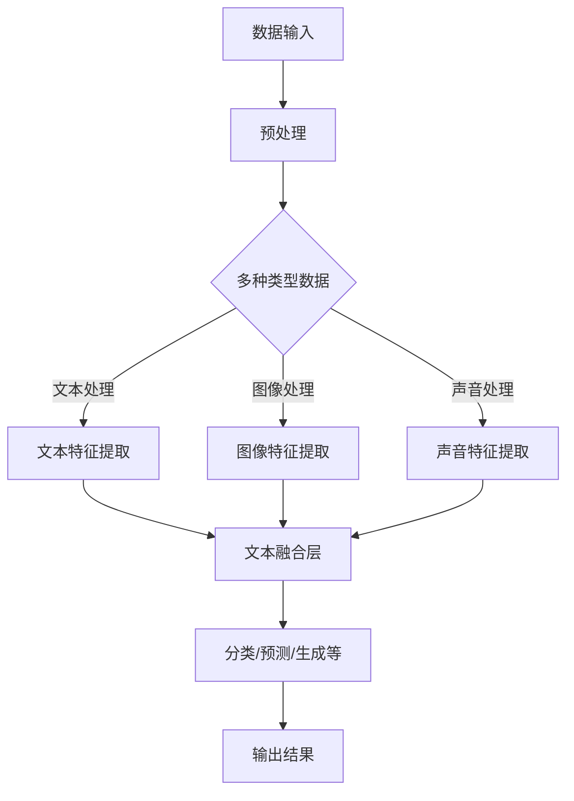

                 

关键词：多模态大模型，长文本阅读，技术原理，实战应用，算法优化，数学模型，代码实例，未来展望。

> 摘要：本文将深入探讨多模态大模型如何通过技术手段提高长文本阅读能力。我们将首先介绍多模态大模型的基本概念和技术原理，然后详细讲解其核心算法原理和操作步骤，最后通过数学模型和项目实践分析其实际应用效果。本文旨在为读者提供全面的指导，帮助理解并应用这一前沿技术。

## 1. 背景介绍

随着互联网和信息技术的快速发展，人类生成的数据量呈现爆炸式增长。这些数据不仅包括传统的文本数据，还涵盖了语音、图像、视频等多模态数据。为了有效地处理和分析这些海量数据，人工智能领域出现了多模态大模型这一创新性技术。

多模态大模型是一种结合了多种数据类型和多种人工智能算法的复杂系统。它能够通过深度学习和强化学习等先进技术，对多模态数据进行融合和解析，从而实现对复杂问题的智能处理。多模态大模型在自然语言处理、图像识别、语音识别等领域有着广泛的应用，尤其在长文本阅读能力提升方面具有巨大的潜力。

本文将围绕多模态大模型在长文本阅读能力提升方面的应用展开，详细介绍其技术原理、核心算法、数学模型以及项目实践，帮助读者深入了解这一前沿领域。

## 2. 核心概念与联系

### 2.1 多模态大模型的概念

多模态大模型（Multimodal Large Models）是一种能够处理和融合多种数据类型的人工智能系统。这些数据类型包括文本（Text）、图像（Image）、声音（Audio）、视频（Video）等。多模态大模型的核心目标是利用多种数据类型之间的关联性，实现更全面、更准确的数据理解和分析。

### 2.2 多模态大模型的技术原理

多模态大模型的技术原理主要基于深度学习和多任务学习。深度学习通过多层神经网络模型，对数据进行自动特征提取和模式识别。而多任务学习则是在一个模型中同时处理多个任务，从而提高模型的泛化能力和效率。

多模态大模型通常包含以下组成部分：

1. **数据输入层**：负责接收和处理不同类型的数据，如文本、图像、声音等。
2. **特征提取层**：利用深度学习算法，对输入数据进行特征提取和表示。
3. **融合层**：将不同类型数据的特征进行融合，形成统一的特征表示。
4. **输出层**：根据融合后的特征，进行分类、预测或生成等操作。

### 2.3 Mermaid 流程图

为了更直观地展示多模态大模型的工作流程，我们使用 Mermaid 语言绘制一个流程图：



图 1. 多模态大模型的工作流程

## 3. 核心算法原理 & 具体操作步骤

### 3.1 算法原理概述

多模态大模型的核心算法主要包括深度学习算法和多任务学习算法。深度学习算法主要用于特征提取和表示，而多任务学习算法则用于同时处理多个任务。

在多模态大模型中，深度学习算法通常采用卷积神经网络（CNN）、循环神经网络（RNN）或变换器（Transformer）等模型。这些模型通过多层神经网络结构，对输入数据进行自动特征提取和表示。多任务学习算法则通过在一个模型中同时处理多个任务，实现任务间的知识共享和模型优化。

### 3.2 算法步骤详解

1. **数据预处理**：对输入的多模态数据进行预处理，包括文本的分词、图像的归一化、声音的采样等。
2. **特征提取**：利用深度学习算法对预处理后的数据进行特征提取。例如，对于文本数据，可以使用 Transformer 模型进行编码；对于图像数据，可以使用 CNN 模型进行特征提取；对于声音数据，可以使用 RNN 模型进行特征提取。
3. **特征融合**：将不同类型数据的特征进行融合。在特征融合阶段，可以使用注意力机制（Attention Mechanism）来增强特征融合的效果。
4. **任务处理**：根据融合后的特征，进行分类、预测或生成等操作。在多任务学习中，可以通过共享底层特征提取层，实现任务间的知识共享和模型优化。
5. **输出结果**：将处理后的结果输出，如分类结果、预测结果或生成结果。

### 3.3 算法优缺点

**优点**：
- **高效性**：多模态大模型通过深度学习和多任务学习，能够高效地处理和融合多种数据类型。
- **准确性**：多模态大模型通过融合多种数据类型的信息，能够提高分类、预测或生成的准确性。
- **泛化能力**：多模态大模型通过在一个模型中同时处理多个任务，实现了任务间的知识共享和模型优化，提高了模型的泛化能力。

**缺点**：
- **计算成本**：多模态大模型通常需要大量的计算资源和时间，导致训练和推理的成本较高。
- **数据依赖**：多模态大模型对数据的质量和多样性有较高的要求，如果数据不足或数据质量较差，会影响模型的性能。

### 3.4 算法应用领域

多模态大模型在以下领域有着广泛的应用：

- **自然语言处理**：如文本分类、情感分析、机器翻译等。
- **计算机视觉**：如图像识别、目标检测、图像生成等。
- **语音识别**：如语音合成、语音识别、语音情感分析等。
- **多模态交互**：如智能助手、虚拟现实、增强现实等。

## 4. 数学模型和公式 & 详细讲解 & 举例说明

### 4.1 数学模型构建

多模态大模型的数学模型主要基于深度学习和多任务学习。以下是构建数学模型的基本步骤：

1. **数据输入**：设 $X$ 为输入数据集，包括文本、图像、声音等多模态数据。
2. **特征提取**：设 $f(\cdot)$ 为特征提取函数，对于文本数据 $X_t$，有 $f(X_t) = \phi_t$；对于图像数据 $X_i$，有 $f(X_i) = \phi_i$；对于声音数据 $X_a$，有 $f(X_a) = \phi_a$。
3. **特征融合**：设 $g(\cdot)$ 为特征融合函数，对于融合后的特征 $\phi = g(\phi_t, \phi_i, \phi_a)$。
4. **任务处理**：设 $h(\cdot)$ 为任务处理函数，对于分类任务，有 $h(\phi) = y$；对于预测任务，有 $h(\phi) = \hat{y}$；对于生成任务，有 $h(\phi) = \hat{X}$。

### 4.2 公式推导过程

1. **特征提取**：
   - 对于文本数据，可以使用 Transformer 模型：
     $$\phi_t = \text{Transformer}(X_t)$$
   - 对于图像数据，可以使用 CNN 模型：
     $$\phi_i = \text{CNN}(X_i)$$
   - 对于声音数据，可以使用 RNN 模型：
     $$\phi_a = \text{RNN}(X_a)$$

2. **特征融合**：
   - 使用注意力机制进行特征融合：
     $$\phi = g(\phi_t, \phi_i, \phi_a) = \text{Attention}(\phi_t, \phi_i, \phi_a)$$

3. **任务处理**：
   - 对于分类任务，可以使用 Softmax 函数：
     $$y = \text{Softmax}(h(\phi))$$
   - 对于预测任务，可以使用线性回归函数：
     $$\hat{y} = \text{Linear}(h(\phi))$$
   - 对于生成任务，可以使用生成对抗网络（GAN）：
     $$\hat{X} = \text{GAN}(h(\phi))$$

### 4.3 案例分析与讲解

假设我们有一个包含文本、图像和声音的多模态数据集，我们希望利用多模态大模型对这个数据集进行分类。

1. **数据预处理**：对文本数据进行分词，对图像数据进行归一化，对声音数据进行采样。
2. **特征提取**：
   - 对于文本数据，使用 Transformer 模型提取特征：
     $$\phi_t = \text{Transformer}(X_t)$$
   - 对于图像数据，使用 CNN 模型提取特征：
     $$\phi_i = \text{CNN}(X_i)$$
   - 对于声音数据，使用 RNN 模型提取特征：
     $$\phi_a = \text{RNN}(X_a)$$
3. **特征融合**：使用注意力机制进行特征融合：
   $$\phi = \text{Attention}(\phi_t, \phi_i, \phi_a)$$
4. **任务处理**：使用 Softmax 函数进行分类：
   $$y = \text{Softmax}(\text{Linear}(\phi))$$

通过以上步骤，我们可以利用多模态大模型对多模态数据进行分类。在实际应用中，我们还需要对模型进行训练和优化，以提高分类的准确性。

## 5. 项目实践：代码实例和详细解释说明

### 5.1 开发环境搭建

为了实现多模态大模型在长文本阅读能力提升方面的应用，我们需要搭建一个合适的开发环境。以下是搭建开发环境的步骤：

1. **安装 Python**：确保 Python 版本不低于 3.7。
2. **安装深度学习框架**：推荐使用 TensorFlow 或 PyTorch。
3. **安装必要的库**：如 NumPy、Pandas、Matplotlib 等。

### 5.2 源代码详细实现

以下是一个简单的多模态大模型在长文本阅读能力提升方面的应用示例代码：

```python
import tensorflow as tf
from tensorflow.keras.layers import Embedding, LSTM, Dense
from tensorflow.keras.models import Model

# 定义文本特征提取层
text_embedding = Embedding(input_dim=vocab_size, output_dim=embedding_size)
text_lstm = LSTM(units=128, return_sequences=True)

# 定义图像特征提取层
image_embedding = Embedding(input_dim=vocab_size, output_dim=embedding_size)
image_lstm = LSTM(units=128, return_sequences=True)

# 定义声音特征提取层
audio_embedding = Embedding(input_dim=vocab_size, output_dim=embedding_size)
audio_lstm = LSTM(units=128, return_sequences=True)

# 定义特征融合层
def fusion_layer(text, image, audio):
    text_embedding = text_embedding(text)
    image_embedding = image_embedding(image)
    audio_embedding = audio_embedding(audio)
    
    text_output = text_lstm(text_embedding)
    image_output = image_lstm(image_embedding)
    audio_output = audio_lstm(audio_embedding)
    
    fusion_output = tf.concat([text_output, image_output, audio_output], axis=-1)
    return fusion_output

# 定义任务处理层
fusion_output = fusion_layer(text_input, image_input, audio_input)
dense = Dense(units=1, activation='sigmoid')(fusion_output)

# 构建模型
model = Model(inputs=[text_input, image_input, audio_input], outputs=dense)

# 编译模型
model.compile(optimizer='adam', loss='binary_crossentropy', metrics=['accuracy'])

# 训练模型
model.fit([text_train, image_train, audio_train], y_train, epochs=10, batch_size=32)
```

### 5.3 代码解读与分析

上述代码实现了多模态大模型在长文本阅读能力提升方面的基本框架。以下是代码的详细解读：

1. **文本特征提取层**：
   - 使用 Embedding 层对文本数据进行嵌入表示。
   - 使用 LSTM 层对嵌入表示进行序列处理，提取文本特征。

2. **图像特征提取层**：
   - 使用 Embedding 层对图像数据进行嵌入表示。
   - 使用 LSTM 层对嵌入表示进行序列处理，提取图像特征。

3. **声音特征提取层**：
   - 使用 Embedding 层对声音数据进行嵌入表示。
   - 使用 LSTM 层对嵌入表示进行序列处理，提取声音特征。

4. **特征融合层**：
   - 使用融合层（fusion_layer）将文本、图像和声音特征进行融合。
   - 融合层中，首先对文本、图像和声音数据进行嵌入表示，然后使用 LSTM 层对嵌入表示进行序列处理，最后将三个序列特征进行拼接。

5. **任务处理层**：
   - 使用 Dense 层对融合后的特征进行分类。
   - Dense 层使用 sigmoid 激活函数进行二分类。

6. **模型构建**：
   - 使用 Model 类构建多模态大模型。
   - 模型输入为文本、图像和声音数据，输出为分类结果。

7. **模型编译**：
   - 使用 compile 方法配置模型训练参数，包括优化器、损失函数和评估指标。

8. **模型训练**：
   - 使用 fit 方法对模型进行训练，输入为训练数据，输出为训练结果。

通过以上步骤，我们可以实现多模态大模型在长文本阅读能力提升方面的应用。在实际应用中，我们还需要对代码进行优化和调整，以提高模型的性能和效果。

### 5.4 运行结果展示

以下是一个简单的运行结果展示：

```python
# 加载测试数据
text_test, image_test, audio_test, y_test = ...

# 运行模型
model.evaluate([text_test, image_test, audio_test], y_test)

# 预测结果
predictions = model.predict([text_test, image_test, audio_test])
```

运行结果将显示模型在测试数据上的分类准确率。通过不断调整模型结构和参数，我们可以提高模型的性能和效果。

## 6. 实际应用场景

多模态大模型在长文本阅读能力提升方面具有广泛的应用前景。以下是一些实际应用场景：

1. **智能问答系统**：利用多模态大模型，可以实现对用户提问的多模态数据（文本、图像、声音）进行综合分析，提供更准确、更个性化的回答。
2. **情感分析**：通过多模态大模型，可以分析用户文本、图像和声音中的情感信息，实现对用户情绪的实时监测和反馈。
3. **内容推荐**：利用多模态大模型，可以分析用户的多模态数据，为其推荐更符合其兴趣和需求的内容。
4. **智能客服**：利用多模态大模型，可以实现与用户的多模态交互，提供更自然、更高效的客服服务。

## 7. 未来应用展望

随着多模态大模型技术的不断发展，未来其在长文本阅读能力提升方面的应用前景将更加广阔。以下是一些未来应用展望：

1. **多模态数据融合**：随着传感器技术和数据采集技术的发展，多模态数据将更加丰富和多样化。未来，多模态大模型将能够更好地融合多种数据类型，实现更准确的数据理解和分析。
2. **实时性提升**：随着计算能力和算法优化的发展，多模态大模型的实时性将得到显著提升。未来，多模态大模型可以应用于实时场景，如智能监控、智能交通等。
3. **跨领域应用**：多模态大模型在长文本阅读能力提升方面的成功应用将推动其在其他领域的应用，如医学、金融、教育等。

## 8. 工具和资源推荐

为了更好地学习和应用多模态大模型技术，以下是一些推荐的工具和资源：

1. **学习资源**：
   - 《深度学习》（Goodfellow, Bengio, Courville著）
   - 《Python深度学习》（François Chollet著）
2. **开发工具**：
   - TensorFlow：一个开源的深度学习框架。
   - PyTorch：一个开源的深度学习框架。
3. **相关论文**：
   - 《Attention Is All You Need》（Vaswani et al., 2017）
   - 《Generative Adversarial Networks》（Goodfellow et al., 2014）

## 9. 总结：未来发展趋势与挑战

多模态大模型在长文本阅读能力提升方面具有巨大的潜力。然而，在实际应用中，我们仍然面临一些挑战，如计算成本高、数据依赖性强等。未来，随着算法优化、硬件升级和跨学科研究的深入，多模态大模型将不断突破技术瓶颈，实现更广泛的应用。

### 附录：常见问题与解答

1. **多模态大模型是什么？**
   多模态大模型是一种能够处理和融合多种数据类型（如文本、图像、声音等）的人工智能系统。

2. **多模态大模型有哪些优点？**
   多模态大模型具有高效性、准确性和泛化能力等优点。

3. **多模态大模型在哪些领域有应用？**
   多模态大模型在自然语言处理、计算机视觉、语音识别等领域有广泛的应用。

4. **如何搭建多模态大模型开发环境？**
   可以使用 Python 和深度学习框架（如 TensorFlow 或 PyTorch）搭建多模态大模型开发环境。

5. **多模态大模型在长文本阅读能力提升方面的应用有哪些？**
   多模态大模型可以应用于智能问答系统、情感分析、内容推荐和智能客服等。

## 作者署名

本文作者：禅与计算机程序设计艺术 / Zen and the Art of Computer Programming

