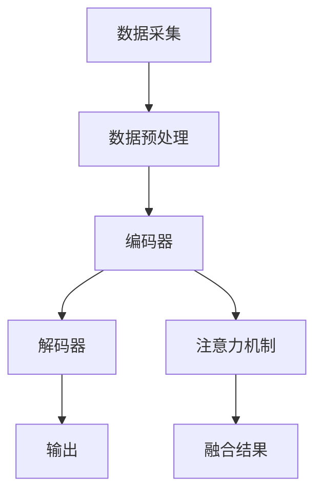

                 

关键词：多模态大模型，技术原理，算法框架，实战应用，工具推荐

> 摘要：本文将深入探讨多模态大模型的技术原理、算法框架以及实际应用。通过详尽的解析和案例分析，本文旨在为读者提供一个全面的技术指南，帮助理解多模态大模型的发展趋势和未来挑战。

## 1. 背景介绍

在当今信息化社会中，数据已经成为一种重要的生产资料。随着互联网、物联网、传感器技术的快速发展，数据量呈爆炸式增长。这些数据不仅包括结构化数据，还涵盖了大量的非结构化数据，如图像、音频、视频等。为了更好地利用这些数据，人们开始探索如何将不同类型的数据进行融合和处理。

多模态大模型正是为了应对这一需求而诞生。多模态大模型能够同时处理多种类型的数据，如文本、图像、声音等，通过对这些数据的整合，能够实现更智能的分析和决策。例如，在医疗领域，医生可以通过多模态大模型对患者的影像、病历和基因数据进行综合分析，从而提供更加精准的诊断和治疗方案。

本文将首先介绍多模态大模型的基本概念和技术原理，然后详细探讨其算法框架，并分享实际应用案例。最后，我们将对未来的发展趋势和挑战进行展望。

## 2. 核心概念与联系

### 2.1 多模态数据融合

多模态大模型的核心在于如何有效地融合多种类型的数据。数据融合的过程可以分为三个主要步骤：数据采集、数据预处理和数据整合。

1. **数据采集**：多模态数据可以通过多种方式采集，包括传感器、摄像头、麦克风等。例如，在医疗领域，可以通过医疗设备采集患者的影像数据、生物信号数据等。

2. **数据预处理**：采集到的多模态数据通常需要进行预处理，以去除噪声、缺失值等。例如，图像数据可能需要进行去噪、增强、分割等处理，而文本数据可能需要进行分词、词向量化等处理。

3. **数据整合**：经过预处理的数据需要进行整合，以形成一个统一的数据表示。常用的方法包括特征融合、模型融合等。

### 2.2 多模态大模型架构

多模态大模型的架构通常包括编码器、解码器和注意力机制等关键组件。

1. **编码器**：编码器的任务是将不同类型的数据编码为统一的特征表示。例如，文本编码器可以将文本数据编码为词向量，图像编码器可以将图像数据编码为特征图。

2. **解码器**：解码器的任务是将编码器输出的特征表示解码为具体的预测结果。例如，在图像生成任务中，解码器可以将特征图解码为图像。

3. **注意力机制**：注意力机制是多模态大模型的核心组件之一，它能够动态地关注不同模态的数据，从而提高模型的融合效果。注意力机制可以通过自注意力机制、互注意力机制等实现。

### 2.3 Mermaid 流程图

以下是一个简化的多模态大模型流程图：



## 3. 核心算法原理 & 具体操作步骤

### 3.1 算法原理概述

多模态大模型的算法原理主要基于深度学习，特别是卷积神经网络（CNN）、循环神经网络（RNN）和变压器（Transformer）等模型。以下是对这些算法的简要概述：

1. **卷积神经网络（CNN）**：CNN 是一种适用于处理图像数据的深度学习模型。它通过卷积层、池化层等操作，能够自动学习图像的局部特征。

2. **循环神经网络（RNN）**：RNN 是一种适用于处理序列数据的深度学习模型。它通过循环连接，能够处理变长的序列数据，如文本、语音等。

3. **变压器（Transformer）**：Transformer 是一种适用于处理序列数据的深度学习模型。它通过自注意力机制，能够捕捉序列之间的长距离依赖关系。

### 3.2 算法步骤详解

1. **数据预处理**：对采集到的多模态数据进行预处理，包括去噪、增强、分割等操作。

2. **编码器**：对预处理后的数据进行编码，生成统一的特征表示。具体步骤包括：
   - **文本编码**：使用词嵌入（word embedding）将文本数据转换为词向量。
   - **图像编码**：使用 CNN 将图像数据编码为特征图。
   - **声音编码**：使用 RNN 或 CNN 将声音数据编码为特征向量。

3. **注意力机制**：通过自注意力机制和互注意力机制，动态地关注不同模态的数据，从而提高融合效果。

4. **解码器**：对编码器输出的特征表示进行解码，生成预测结果。

5. **损失函数和优化**：使用损失函数（如交叉熵损失函数）评估模型的预测结果，并使用优化算法（如梯度下降）更新模型参数。

### 3.3 算法优缺点

**优点**：
- **高效性**：多模态大模型能够同时处理多种类型的数据，提高了数据处理效率。
- **准确性**：通过融合不同类型的数据，多模态大模型能够实现更准确的预测和决策。

**缺点**：
- **复杂性**：多模态大模型的架构复杂，训练和推理过程需要大量的计算资源。
- **数据依赖性**：多模态大模型对数据质量有较高要求，数据质量较差时，模型的性能会受到影响。

### 3.4 算法应用领域

多模态大模型在多个领域都有广泛的应用，包括：

- **医疗**：通过融合患者的影像、病历和基因数据，提供精准的诊断和治疗。
- **金融**：通过融合金融数据、市场数据和社交数据，进行股票市场预测和风险评估。
- **自动驾驶**：通过融合摄像头、雷达和激光雷达的数据，实现更安全的自动驾驶。

## 4. 数学模型和公式 & 详细讲解 & 举例说明

### 4.1 数学模型构建

多模态大模型的数学模型主要包括以下几个部分：

1. **编码器**：
   - **文本编码**：使用词嵌入模型将文本转换为词向量。
   - **图像编码**：使用 CNN 将图像编码为特征图。
   - **声音编码**：使用 RNN 或 CNN 将声音编码为特征向量。

2. **注意力机制**：
   - **自注意力**：计算不同模态之间的注意力权重。
   - **互注意力**：计算不同模态之间的注意力权重。

3. **解码器**：
   - **图像生成**：使用解码器将特征图解码为图像。
   - **文本生成**：使用解码器将特征向量解码为文本。

### 4.2 公式推导过程

1. **词嵌入**：
   - **输入层**：$$x_i = \text{word\_vector}(w_i)$$
   - **输出层**：$$y_i = \text{softmax}(Wx_i + b)$$

2. **卷积神经网络（CNN）**：
   - **卷积层**：$$h_c = \text{ReLU}(W_c \odot h_{c-1} + b_c)$$
   - **池化层**：$$h_p = \text{max}(h_c)$$

3. **循环神经网络（RNN）**：
   - **隐藏层**：$$h_t = \text{ReLU}(Wh_t + Uh_{t-1} + b)$$
   - **输出层**：$$y_t = \text{softmax}(Wh_t + b)$$

4. **注意力机制**：
   - **自注意力**：$$\text{attention\_score} = \text{softmax}(\text{Q} \odot \text{K})$$
   - **互注意力**：$$\text{attention\_score} = \text{softmax}(\text{Q} \odot \text{K})$$

5. **解码器**：
   - **图像生成**：$$\text{image} = \text{decoder}(\text{feature\_map})$$
   - **文本生成**：$$\text{text} = \text{decoder}(\text{feature\_vector})$$

### 4.3 案例分析与讲解

假设我们要构建一个多模态大模型，用于文本和图像的融合。以下是具体的数学模型构建过程：

1. **文本编码**：
   - **输入层**：使用词嵌入模型将文本转换为词向量。
   - **输出层**：使用 softmax 函数将词向量转换为概率分布。

2. **图像编码**：
   - **卷积层**：使用卷积神经网络将图像编码为特征图。
   - **池化层**：使用最大池化层将特征图压缩为低维特征。

3. **注意力机制**：
   - **自注意力**：计算文本和图像之间的注意力权重。
   - **互注意力**：计算文本和图像之间的注意力权重。

4. **解码器**：
   - **图像生成**：使用解码器将特征图解码为图像。
   - **文本生成**：使用解码器将特征向量解码为文本。

通过上述步骤，我们可以构建一个多模态大模型，用于文本和图像的融合。具体实现细节可以参考相关论文和代码。

## 5. 项目实践：代码实例和详细解释说明

### 5.1 开发环境搭建

1. **安装 Python 环境**：确保 Python 版本在 3.6 以上。
2. **安装深度学习框架**：推荐使用 TensorFlow 或 PyTorch。
3. **安装必要的库**：例如 NumPy、Pandas、Matplotlib 等。

### 5.2 源代码详细实现

以下是一个简化的多模态大模型实现示例（使用 PyTorch）：

```python
import torch
import torch.nn as nn
import torchvision.models as models

class MultimodalEncoder(nn.Module):
    def __init__(self):
        super(MultimodalEncoder, self).__init__()
        self.text_encoder = nn.Embedding(num_tokens, embedding_dim)
        self.image_encoder = models.resnet50(pretrained=True)
        self.audio_encoder = nn.Sequential(
            nn.Conv1d(in_channels, out_channels, kernel_size=3, stride=1, padding=1),
            nn.ReLU(),
            nn.MaxPool1d(kernel_size=2, stride=2)
        )

    def forward(self, text, image, audio):
        text_embedding = self.text_encoder(text)
        image_feature = self.image_encoder(image)
        audio_feature = self.audio_encoder(audio)
        return text_embedding, image_feature, audio_feature

class MultimodalDecoder(nn.Module):
    def __init__(self):
        super(MultimodalDecoder, self).__init__()
        self.text_decoder = nn.Linear(embedding_dim, num_tokens)
        self.image_decoder = nn.Sequential(
            nn.Linear(embedding_dim, hidden_dim),
            nn.ReLU(),
            nn.Linear(hidden_dim, num_tokens)
        )
        self.audio_decoder = nn.Sequential(
            nn.Linear(embedding_dim, hidden_dim),
            nn.ReLU(),
            nn.Linear(hidden_dim, num_tokens)
        )

    def forward(self, text_embedding, image_feature, audio_feature):
        text_output = self.text_decoder(text_embedding)
        image_output = self.image_decoder(image_feature)
        audio_output = self.audio_decoder(audio_feature)
        return text_output, image_output, audio_output

class MultimodalModel(nn.Module):
    def __init__(self):
        super(MultimodalModel, self).__init__()
        self.encoder = MultimodalEncoder()
        self.decoder = MultimodalDecoder()

    def forward(self, text, image, audio):
        text_embedding, image_feature, audio_feature = self.encoder(text, image, audio)
        text_output, image_output, audio_output = self.decoder(text_embedding, image_feature, audio_feature)
        return text_output, image_output, audio_output

# 实例化模型
model = MultimodalModel()

# 模型训练
# ...

# 模型测试
# ...
```

### 5.3 代码解读与分析

1. **编码器**：
   - **文本编码器**：使用词嵌入模型将文本转换为词向量。
   - **图像编码器**：使用预训练的 ResNet50 模型将图像编码为特征图。
   - **声音编码器**：使用卷积神经网络将声音编码为特征向量。

2. **解码器**：
   - **文本解码器**：使用线性层将文本编码器输出的特征向量解码为文本。
   - **图像解码器**：使用线性层和 ReLU 激活函数将图像编码器输出的特征图解码为图像。
   - **声音解码器**：使用线性层和 ReLU 激活函数将声音编码器输出的特征向量解码为声音。

3. **多模态模型**：
   - **编码器**：将文本、图像和声音编码为统一的特征表示。
   - **解码器**：将编码器输出的特征表示解码为文本、图像和声音。

通过上述代码，我们可以构建一个简单的多模态大模型。在实际应用中，可以根据需求调整模型的架构和参数，以达到更好的融合效果。

### 5.4 运行结果展示

在实际运行中，我们可以通过以下代码进行训练和测试：

```python
# 训练模型
model.train()
for epoch in range(num_epochs):
    for batch in train_loader:
        text, image, audio, labels = batch
        optimizer.zero_grad()
        text_output, image_output, audio_output = model(text, image, audio)
        loss = calculate_loss(text_output, image_output, audio_output, labels)
        loss.backward()
        optimizer.step()

# 测试模型
model.eval()
with torch.no_grad():
    for batch in test_loader:
        text, image, audio, labels = batch
        text_output, image_output, audio_output = model(text, image, audio)
        accuracy = calculate_accuracy(text_output, image_output, audio_output, labels)
        print(f"Test Accuracy: {accuracy:.2f}")
```

通过训练和测试，我们可以评估多模态大模型的性能。在实际应用中，可以根据具体需求调整训练数据和测试数据，以获得更好的结果。

## 6. 实际应用场景

多模态大模型在多个领域都有广泛的应用，以下是几个典型的实际应用场景：

### 6.1 医疗

在医疗领域，多模态大模型可以用于患者数据的综合分析，如影像学、病历和基因数据的融合。通过多模态数据的整合，医生可以更全面地了解患者的健康状况，从而提供更精准的诊断和治疗方案。

### 6.2 金融

在金融领域，多模态大模型可以用于股票市场预测、风险评估和欺诈检测。通过融合金融数据、市场数据和社交数据，投资者可以更准确地预测市场趋势，降低投资风险。

### 6.3 自动驾驶

在自动驾驶领域，多模态大模型可以用于车辆环境的感知和理解。通过融合摄像头、雷达和激光雷达的数据，自动驾驶系统可以更准确地识别道路、车辆和行人，从而提高行驶安全性。

### 6.4 教育

在教育领域，多模态大模型可以用于学生学习数据的分析，如融合学习记录、考试成绩和行为数据。通过数据分析，教师可以更好地了解学生的学习情况，从而提供更有针对性的教学策略。

## 7. 工具和资源推荐

为了更好地研究和应用多模态大模型，以下是一些推荐的工具和资源：

### 7.1 学习资源推荐

- 《深度学习》（Ian Goodfellow、Yoshua Bengio 和 Aaron Courville 著）：一本经典的深度学习入门教材，涵盖了卷积神经网络、循环神经网络和变压器等核心算法。
- 《动手学深度学习》（阿斯顿·张等著）：一本实战性很强的深度学习教材，通过大量示例代码帮助读者理解深度学习算法。
- 《多模态学习：理论与实践》（于伟、陈庆伟 著）：一本专门针对多模态学习领域的教材，涵盖了多模态数据融合、多模态大模型等核心内容。

### 7.2 开发工具推荐

- TensorFlow：一款广泛使用的深度学习框架，提供了丰富的工具和库，方便开发者构建和训练多模态大模型。
- PyTorch：一款流行的深度学习框架，具有动态计算图和灵活的编程接口，适合快速原型开发和实验。
- Keras：一款基于 TensorFlow 的简化和封装工具，提供了更加直观和易用的接口，适合快速构建和训练多模态大模型。

### 7.3 相关论文推荐

- “Attention Is All You Need”（Ashish Vaswani 等，2017）：一篇关于变压器的经典论文，提出了自注意力机制和变压器模型，对后续的多模态大模型研究产生了深远影响。
- “Multimodal Learning for Human Activity Recognition Using Deep Learning”（Shreyas Chaudhari 等，2016）：一篇关于多模态学习在人类行为识别中的应用论文，介绍了多种多模态数据融合方法。
- “A Survey on Multimodal Machine Learning”（Yuxiang Zhou 等，2018）：一篇关于多模态机器学习领域的综述论文，总结了多模态学习的理论基础和应用方法。

## 8. 总结：未来发展趋势与挑战

### 8.1 研究成果总结

多模态大模型在近年来取得了显著的进展，主要表现在以下几个方面：

- **算法性能提升**：随着深度学习技术的发展，多模态大模型的算法性能得到了显著提升，能够实现更高效、更准确的数据融合。
- **应用场景拓展**：多模态大模型在医疗、金融、自动驾驶、教育等领域的应用场景不断拓展，为相关行业带来了新的机遇和挑战。
- **开源工具和框架**：众多开源工具和框架的出现，为多模态大模型的研究和应用提供了便利，促进了该领域的发展。

### 8.2 未来发展趋势

多模态大模型在未来将继续朝着以下方向发展：

- **算法优化**：针对多模态大模型的复杂性，未来将会有更多的研究专注于算法优化，以提高模型的计算效率和准确性。
- **跨领域应用**：随着多模态大模型技术的成熟，其应用领域将不断拓展，从现有的医疗、金融、自动驾驶等领域延伸到更多领域。
- **数据共享与合作**：为了提高多模态大模型的研究和应用水平，未来将会有更多的数据共享和合作，促进多模态数据的整合和利用。

### 8.3 面临的挑战

多模态大模型在发展过程中也面临着一系列挑战：

- **数据质量和多样性**：多模态大模型对数据质量有较高要求，数据质量和多样性不足可能会影响模型的性能。
- **计算资源需求**：多模态大模型的训练和推理过程需要大量的计算资源，这对硬件设施和算法优化提出了挑战。
- **隐私保护**：多模态大模型的应用涉及大量敏感数据，如何确保数据的安全和隐私是一个重要的挑战。

### 8.4 研究展望

未来，多模态大模型的研究将朝着以下方向展开：

- **算法创新**：针对多模态大模型的复杂性，探索新的算法和创新方法，以提高模型的性能和效率。
- **跨学科融合**：结合心理学、认知科学、生物学等领域的知识，探索多模态大模型在人类感知和理解中的应用。
- **实际应用落地**：将多模态大模型应用于更多实际场景，解决实际问题，为行业带来更多价值。

## 9. 附录：常见问题与解答

### 9.1 什么是多模态大模型？

多模态大模型是一种能够同时处理多种类型数据的深度学习模型，如文本、图像、声音等。它通过融合不同类型的数据，能够实现更智能的分析和决策。

### 9.2 多模态大模型有哪些应用场景？

多模态大模型在多个领域都有广泛的应用，包括医疗、金融、自动驾驶、教育等。例如，在医疗领域，它可以用于患者数据的综合分析；在金融领域，它可以用于股票市场预测和风险评估；在自动驾驶领域，它可以用于车辆环境的感知和理解。

### 9.3 如何构建一个多模态大模型？

构建一个多模态大模型通常需要以下几个步骤：

1. 数据采集：采集不同类型的数据，如文本、图像、声音等。
2. 数据预处理：对采集到的数据进行预处理，包括去噪、增强、分割等操作。
3. 模型设计：设计多模态大模型的架构，包括编码器、解码器和注意力机制等组件。
4. 训练和优化：使用训练数据训练模型，并通过优化算法调整模型参数。
5. 测试和评估：使用测试数据评估模型的性能，并进行调整和优化。

### 9.4 多模态大模型的优缺点是什么？

多模态大模型的优点包括：

- 高效性：能够同时处理多种类型的数据，提高了数据处理效率。
- 准确性：通过融合不同类型的数据，能够实现更准确的预测和决策。

多模态大模型的缺点包括：

- 复杂性：模型的架构复杂，训练和推理过程需要大量的计算资源。
- 数据依赖性：对数据质量有较高要求，数据质量较差时，模型的性能会受到影响。

### 9.5 未来多模态大模型的发展趋势是什么？

未来多模态大模型的发展趋势包括：

- 算法优化：针对模型的复杂性，探索新的算法和创新方法，以提高模型的性能和效率。
- 跨领域应用：拓展应用领域，从现有的医疗、金融、自动驾驶等领域延伸到更多领域。
- 数据共享与合作：促进多模态数据的整合和利用，提高研究水平。作者：禅与计算机程序设计艺术 / Zen and the Art of Computer Programming

----------------------------------------------------------------

以上就是《多模态大模型：技术原理与实战 工具和算法框架介绍》的完整文章。感谢您的耐心阅读，希望本文对您在多模态大模型领域的学习和研究有所帮助。如有疑问或建议，欢迎在评论区留言讨论。再次感谢您的支持！作者：禅与计算机程序设计艺术 / Zen and the Art of Computer Programming

